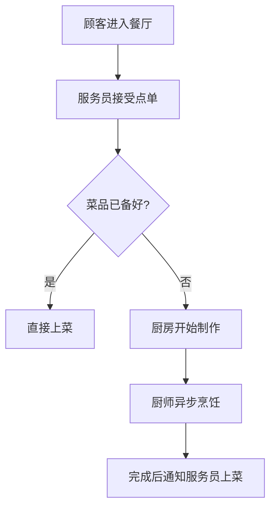
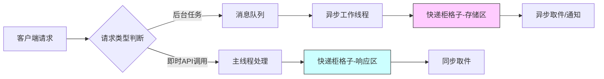

扫描[二维码](https://api2.cmdragon.cn/upload/cmder/20250304_012821924.jpg)
关注或者微信搜一搜：`编程智域 前端至全栈交流与成长`

[发现1000+提升效率与开发的AI工具和实用程序](https://tools.cmdragon.cn/zh/apps?category=ai_chat)：https://tools.cmdragon.cn/

## 1. 请求-响应周期基础原理

FastAPI 的请求-响应周期遵循标准 ASGI 协议，可以比作餐厅的点餐流程：



这种同步处理模式在遇到耗时操作时会形成"前厅拥堵"，就像厨师做菜时间太长导致顾客排队。

```python
from fastapi import FastAPI
import time

app = FastAPI()


# 同步处理示例
@app.get("/sync-task")
def sync_task():
    time.sleep(5)  # 模拟耗时操作
    return {"status": "completed"}
```

当访问该接口时，整个服务将阻塞5秒无法处理其他请求。通过 `time.sleep(5)` 我们可以直观感受到同步处理对性能的影响。

## 2. 后台任务分离实现机制

FastAPI 采用双通道设计实现请求-响应与后台任务分离，其工作原理类似于快递柜系统：

1. 主线程处理核心业务逻辑
2. 任务分发器创建独立任务单元
3. 任务队列存储待处理任务
4. 工作线程池异步执行任务



```python
from fastapi import BackgroundTasks
from pydantic import BaseModel


class Notification(BaseModel):
    message: str
    user_id: int


def send_notification(email: str, message: str):
    # 模拟耗时通知操作
    print(f"Sending message to {email}: {message}")


@app.post("/notify/{email}")
async def send_email_notification(
        email: str,
        notification: Notification,
        background_tasks: BackgroundTasks
):
    background_tasks.add_task(send_notification, email, notification.message)
    return {"message": "Notification queued"}
```

代码中 `BackgroundTasks` 参数会自动注入上下文，通过类型声明实现依赖注入。注意任务函数应当是非异步的常规函数，这与 FastAPI
的线程池执行策略有关。

## 3. 应用场景对比分析

通过以下表格理解不同场景的技术选型：

| 场景特征      | BackgroundTasks | Celery |
|-----------|-----------------|--------|
| 任务执行时间    | <1分钟            | ≥1分钟   |
| 需要任务状态跟踪  | 否               | 是      |
| 需要失败重试机制  | 基本支持            | 完善支持   |
| 跨进程/跨机器执行 | 否               | 是      |

```python
# Celery 集成示例（需安装 celery==5.2.7）
from celery import Celery

celery_app = Celery(
    "worker",
    broker="redis://localhost:6379/0",
    backend="redis://localhost:6379/1"
)


@celery_app.task
def long_running_task(data: dict):
    # 模拟长时间数据处理
    time.sleep(120)
    return {"result": "processed"}
```

## 4. 技术实现细节

### 4.1 依赖管理

后台任务中访问数据库时需要特别注意依赖生命周期管理。错误示例：

```python
# 错误用法：直接传递数据库连接
def bad_task(db_conn):
    db_conn.execute(...)  # 可能使用已关闭的连接


# 正确用法：通过依赖重新获取
def good_task():
    db_conn = get_db()  # 重新建立连接
    db_conn.execute(...)
```

### 4.2 错误处理机制

FastAPI 提供两种错误处理模式：

```python
# 即时错误捕获模式
background_tasks.add_task(handle_errors(safe_task))

# 延迟错误记录模式
background_tasks.add_task(unsafe_task, on_error=error_logger)
```

推荐使用装饰器模式封装任务函数：

```python
from functools import wraps


def retry(max_attempts=3):
    def decorator(func):
        @wraps(func)
        def wrapper(*args, **kwargs):
            attempts = 0
            while attempts < max_attempts:
                try:
                    return func(*args, **kwargs)
                except Exception as e:
                    print(f"Attempt {attempts + 1} failed: {str(e)}")
                    attempts += 1
            raise RuntimeError("Max retries exceeded")

        return wrapper

    return decorator


@retry(max_attempts=3)
def unreliable_task():
    # 可能失败的操作
    ...
```

## 5. 课后 Quiz

**问题1：** 当后台任务需要访问数据库连接时，应该如何处理依赖关系？

A. 直接传递数据库连接对象  
B. 在任务内部重新创建连接  
C. 使用全局单例连接  
D. 避免在后台任务操作数据库

**答案：** B。根据 FastAPI 的依赖生命周期管理，应该在任务内部重新创建数据库连接，直接传递连接对象可能导致使用已关闭的连接（A错误），全局单例（C）可能引发线程安全问题，D选项不符合实际需求。

---

**问题2：** 以下哪种情况应该优先选择 Celery 而不是 BackgroundTasks？

A. 需要发送欢迎邮件  
B. 用户上传文件后生成缩略图  
C. 每月一次的报表生成  
D. 实时聊天消息推送

**答案：** C。每月报表生成属于长时间任务且需要可靠执行，符合 Celery 的应用场景。A、B适合后台任务，D需要实时性不适合异步处理。

## 6. 常见报错解决方案

**错误1：** `RuntimeError: No context available to access BackgroundTasks`

**原因：** 在非请求上下文中调用后台任务  
**解决：** 检查任务触发位置，确保只在路由处理函数中使用 BackgroundTasks 参数

**错误2：** `TypeError: BackgroundTasks only supports sync functions`

**原因：** 尝试添加异步函数作为后台任务  
**解决：** 将任务函数改为同步函数或使用 Celery 等异步任务队列

**错误3：** `Task was lost but worker is still connected`

**原因：** Celery 任务超时未确认  
**解决：**

1. 增加 `task_acks_late=True` 配置
2. 调整 `broker_connection_timeout` 参数
3. 检查消息代理（如 Redis）的连接稳定性

**预防建议：**

```python
# 在 Celery 配置中添加健康检查
celery_app.conf.worker_ping_interval = 30  # 30秒一次健康检查
```

余下文章内容请点击跳转至 个人博客页面 或者 扫码关注或者微信搜一搜：`编程智域 前端至全栈交流与成长`
，阅读完整的文章：[FastAPI的请求-响应周期为何需要后台任务分离？](https://blog.cmdragon.cn/posts/c7b54d6b3b6b5041654e69e5610bf3b9/)

## 往期文章归档：

- [如何在FastAPI中让后台任务既高效又不会让你的应用崩溃？ - cmdragon's Blog](https://blog.cmdragon.cn/posts/5ad8d0a4c8f2d05e9c1a42d828aad7b3/)
- [FastAPI后台任务：异步魔法还是同步噩梦？ - cmdragon's Blog](https://blog.cmdragon.cn/posts/6a69eca9fd14ba8f6fa41502c5014edd/)
- [如何在FastAPI中玩转Schema版本管理和灰度发布？ - cmdragon's Blog](https://blog.cmdragon.cn/posts/6d9d20cd8d8528da4193f13aaf98575c/)
- [FastAPI的查询白名单和安全沙箱机制如何确保你的API坚不可摧？ - cmdragon's Blog](https://blog.cmdragon.cn/posts/ca141239cfc5c0d510960acd266de9cd/)
- [如何在 FastAPI 中玩转 GraphQL 性能监控与 APM 集成？ - cmdragon's Blog](https://blog.cmdragon.cn/posts/52fe9ea73b0e26de308ae0e539df21d2/)
- [如何在 FastAPI 中玩转 GraphQL 和 WebSocket 的实时数据推送魔法？ - cmdragon's Blog](https://blog.cmdragon.cn/posts/ae484cf6bcf3f44fd8392a8272e57db4/)
- [如何在FastAPI中玩转GraphQL联邦架构，让数据源手拉手跳探戈？ - cmdragon's Blog](https://blog.cmdragon.cn/posts/9b9086ff5d8464b0810cfb55f7768513/)
- [GraphQL批量查询优化：DataLoader如何让数据库访问速度飞起来？ - cmdragon's Blog](https://blog.cmdragon.cn/posts/0e236dbe717bde52bda290e89f4f6eca/)
- [如何在FastAPI中整合GraphQL的复杂度与限流？ - cmdragon's Blog](https://blog.cmdragon.cn/posts/ace8bb3f01589994f51d748ab5c73652/)
- [GraphQL错误处理为何让你又爱又恨？FastAPI中间件能否成为你的救星？ - cmdragon's Blog](https://blog.cmdragon.cn/posts/a28d5c1b32feadb18b406a849455dfe5/)
- [FastAPI遇上GraphQL：异步解析器如何让API性能飙升？ - cmdragon's Blog](https://blog.cmdragon.cn/posts/35fced261e8ff834e68e07c93902cc13/)
- [GraphQL的N+1问题如何被DataLoader巧妙化解？ - cmdragon's Blog](https://blog.cmdragon.cn/posts/72629304782a121fbf89b151c436f9aa/)
- [FastAPI与GraphQL的完美邂逅：如何打造高效API？ - cmdragon's Blog](https://blog.cmdragon.cn/posts/fb5c5c7b00bbe57b3a5346b8ee5bc289/)
- [GraphQL类型系统如何让FastAPI开发更高效？ - cmdragon's Blog](https://blog.cmdragon.cn/posts/31c152e531e1cbe5b5cfe15e7ff053c9/)
- [REST和GraphQL究竟谁才是API设计的终极赢家？ - cmdragon's Blog](https://blog.cmdragon.cn/posts/218ad2370eab6197f42fdc9c52f0fc19/)
- [IoT设备的OTA升级是如何通过MQTT协议实现无缝对接的？ - cmdragon's Blog](https://blog.cmdragon.cn/posts/071e9a3b9792beea63f134f5ad28df67/)
- [如何在FastAPI中玩转STOMP协议升级，让你的消息传递更高效？ - cmdragon's Blog](https://blog.cmdragon.cn/posts/16744b2f460346805c45314bc0c6f751/)
- [如何用WebSocket打造毫秒级实时协作系统？ - cmdragon's Blog](https://blog.cmdragon.cn/posts/da5b64cb0ded23e4d5b1f19ffd5ac53d/)
- [如何用WebSocket打造毫秒级实时协作系统？ - cmdragon's Blog](https://blog.cmdragon.cn/posts/da5b64cb0ded23e4d5b1f19ffd5ac53d/)
- [如何让你的WebSocket连接既安全又高效？](https://blog.cmdragon.cn/posts/eb598d50b76ea1823746ab7cdf49ce05/)
- [如何让多客户端会话管理不再成为你的技术噩梦？ - cmdragon's Blog](https://blog.cmdragon.cn/posts/08ba771dbb2eec087c4bc6dc584113c5/)
- [如何在FastAPI中玩转WebSocket消息处理？](https://blog.cmdragon.cn/posts/fbf7d6843e430133547057254deb2dfb/)
- [如何在FastAPI中玩转WebSocket，让实时通信不再烦恼？ - cmdragon's Blog](https://blog.cmdragon.cn/posts/0faebb0f6c2b1bde4ba75869f4f67b76/)
- [WebSocket与HTTP协议究竟有何不同？FastAPI如何让长连接变得如此简单？ - cmdragon's Blog](https://blog.cmdragon.cn/posts/903448c85701a6a747fc9a4417e2bdc8/)
- [FastAPI如何玩转安全防护，让黑客望而却步？](https://blog.cmdragon.cn/posts/c1314c623211c9269f36053179a53d5c/)
- [如何用三层防护体系打造坚不可摧的 API 安全堡垒？ - cmdragon's Blog](https://blog.cmdragon.cn/posts/0bbb4a455ef36bf6f81ac97189586fda/#%E4%B8%80jwt-%E8%AE%A4%E8%AF%81%E8%81%94%E8%B0%83%E6%96%B9%E6%A1%88)
- [FastAPI安全加固：密钥轮换、限流策略与安全头部如何实现三重防护？ - cmdragon's Blog](https://blog.cmdragon.cn/posts/f96ba438de34dc197fd2598f91ae133d/)
- [如何在FastAPI中巧妙玩转数据脱敏，让敏感信息安全无忧？ - cmdragon's Blog](https://blog.cmdragon.cn/posts/045021f8831a03bcdf71e44cb793baf4/)
- [RBAC权限模型如何让API访问控制既安全又灵活？ - cmdragon's Blog](https://blog.cmdragon.cn/posts/9f01e838545ae8d34016c759ef461423/)
- [FastAPI中的敏感数据如何在不泄露的情况下翩翩起舞？](https://blog.cmdragon.cn/posts/88e8615e4c961e7a4f0ef31c0e41cb0b/)
- [FastAPI安全认证的终极秘籍：OAuth2与JWT如何完美融合？ - cmdragon's Blog](https://blog.cmdragon.cn/posts/17d5c40ff6c84ad652f962fed0ce46ab/)
- [如何在FastAPI中打造坚不可摧的Web安全防线？ - cmdragon's Blog](https://blog.cmdragon.cn/posts/9d6200ae7ce0a1a1a523591e3d65a82e/)
- [如何用 FastAPI 和 RBAC 打造坚不可摧的安全堡垒？ - cmdragon's Blog](https://blog.cmdragon.cn/posts/d878b5dbef959058b8098551c70594f8/)
- [FastAPI权限配置：你的系统真的安全吗？ - cmdragon's Blog](https://blog.cmdragon.cn/posts/96b6ede65030daa4613ab92da1d739a6/#%E5%BE%80%E6%9C%9F%E6%96%87%E7%AB%A0%E5%BD%92%E6%A1%A3)
- [FastAPI权限缓存：你的性能瓶颈是否藏在这只“看不见的手”里？ | cmdragon's Blog](https://blog.cmdragon.cn/posts/0c8c5a3fdaf69250ac3db7429b102625/)
- [FastAPI日志审计：你的权限系统是否真的安全无虞？ | cmdragon's Blog](https://blog.cmdragon.cn/posts/84bf7b11b342415bddb50e0521c64dfe/)
- [如何在FastAPI中打造坚不可摧的安全防线？ | cmdragon's Blog](https://blog.cmdragon.cn/posts/e2ec1e31dd5d97e0f32d2125385fd955/)

## 免费好用的热门在线工具

- [ASCII字符画生成器 - 应用商店 | By cmdragon](https://tools.cmdragon.cn/zh/apps/ascii-art-generator)
- [JSON Web Tokens 工具 - 应用商店 | By cmdragon](https://tools.cmdragon.cn/zh/apps/jwt-tool)
- [Bcrypt 密码工具 - 应用商店 | By cmdragon](https://tools.cmdragon.cn/zh/apps/bcrypt-tool)
- [GIF 合成器 - 应用商店 | By cmdragon](https://tools.cmdragon.cn/zh/apps/gif-composer)
- [GIF 分解器 - 应用商店 | By cmdragon](https://tools.cmdragon.cn/zh/apps/gif-decomposer)
- [文本隐写术 - 应用商店 | By cmdragon](https://tools.cmdragon.cn/zh/apps/text-steganography)
- [CMDragon 在线工具 - 高级AI工具箱与开发者套件 | 免费好用的在线工具](https://tools.cmdragon.cn/zh)
- [应用商店 - 发现1000+提升效率与开发的AI工具和实用程序 | 免费好用的在线工具](https://tools.cmdragon.cn/zh/apps?category=trending)
- [CMDragon 更新日志 - 最新更新、功能与改进 | 免费好用的在线工具](https://tools.cmdragon.cn/zh/changelog)
- [支持我们 - 成为赞助者 | 免费好用的在线工具](https://tools.cmdragon.cn/zh/sponsor)
- [AI文本生成图像 - 应用商店 | 免费好用的在线工具](https://tools.cmdragon.cn/zh/apps/text-to-image-ai)
- [临时邮箱 - 应用商店 | 免费好用的在线工具](https://tools.cmdragon.cn/zh/apps/temp-email)
- [二维码解析器 - 应用商店 | 免费好用的在线工具](https://tools.cmdragon.cn/zh/apps/qrcode-parser)
- [文本转思维导图 - 应用商店 | 免费好用的在线工具](https://tools.cmdragon.cn/zh/apps/text-to-mindmap)
- [正则表达式可视化工具 - 应用商店 | 免费好用的在线工具](https://tools.cmdragon.cn/zh/apps/regex-visualizer)
- [文件隐写工具 - 应用商店 | 免费好用的在线工具](https://tools.cmdragon.cn/zh/apps/steganography-tool)
- [IPTV 频道探索器 - 应用商店 | 免费好用的在线工具](https://tools.cmdragon.cn/zh/apps/iptv-explorer)
- [快传 - 应用商店 | 免费好用的在线工具](https://tools.cmdragon.cn/zh/apps/snapdrop)
- [随机抽奖工具 - 应用商店 | 免费好用的在线工具](https://tools.cmdragon.cn/zh/apps/lucky-draw)
- [动漫场景查找器 - 应用商店 | 免费好用的在线工具](https://tools.cmdragon.cn/zh/apps/anime-scene-finder)
- [时间工具箱 - 应用商店 | 免费好用的在线工具](https://tools.cmdragon.cn/zh/apps/time-toolkit)
- [网速测试 - 应用商店 | 免费好用的在线工具](https://tools.cmdragon.cn/zh/apps/speed-test)
- [AI 智能抠图工具 - 应用商店 | 免费好用的在线工具](https://tools.cmdragon.cn/zh/apps/background-remover)
- [背景替换工具 - 应用商店 | 免费好用的在线工具](https://tools.cmdragon.cn/zh/apps/background-replacer)
- [艺术二维码生成器 - 应用商店 | 免费好用的在线工具](https://tools.cmdragon.cn/zh/apps/artistic-qrcode)
- [Open Graph 元标签生成器 - 应用商店 | 免费好用的在线工具](https://tools.cmdragon.cn/zh/apps/open-graph-generator)
- [图像对比工具 - 应用商店 | 免费好用的在线工具](https://tools.cmdragon.cn/zh/apps/image-comparison)
- [图片压缩专业版 - 应用商店 | 免费好用的在线工具](https://tools.cmdragon.cn/zh/apps/image-compressor)
- [密码生成器 - 应用商店 | 免费好用的在线工具](https://tools.cmdragon.cn/zh/apps/password-generator)
- [SVG优化器 - 应用商店 | 免费好用的在线工具](https://tools.cmdragon.cn/zh/apps/svg-optimizer)
- [调色板生成器 - 应用商店 | 免费好用的在线工具](https://tools.cmdragon.cn/zh/apps/color-palette)
- [在线节拍器 - 应用商店 | 免费好用的在线工具](https://tools.cmdragon.cn/zh/apps/online-metronome)
- [IP归属地查询 - 应用商店 | 免费好用的在线工具](https://tools.cmdragon.cn/zh/apps/ip-geolocation)
- [CSS网格布局生成器 - 应用商店 | 免费好用的在线工具](https://tools.cmdragon.cn/zh/apps/css-grid-layout)
- [邮箱验证工具 - 应用商店 | 免费好用的在线工具](https://tools.cmdragon.cn/zh/apps/email-validator)
- [书法练习字帖 - 应用商店 | 免费好用的在线工具](https://tools.cmdragon.cn/zh/apps/calligraphy-practice)
- [金融计算器套件 - 应用商店 | 免费好用的在线工具](https://tools.cmdragon.cn/zh/apps/finance-calculator-suite)
- [中国亲戚关系计算器 - 应用商店 | 免费好用的在线工具](https://tools.cmdragon.cn/zh/apps/chinese-kinship-calculator)
- [Protocol Buffer 工具箱 - 应用商店 | 免费好用的在线工具](https://tools.cmdragon.cn/zh/apps/protobuf-toolkit)
- [IP归属地查询 - 应用商店 | 免费好用的在线工具](https://tools.cmdragon.cn/zh/apps/ip-geolocation)
- [图片无损放大 - 应用商店 | 免费好用的在线工具](https://tools.cmdragon.cn/zh/apps/image-upscaler)
- [文本比较工具 - 应用商店 | 免费好用的在线工具](https://tools.cmdragon.cn/zh/apps/text-compare)
- [IP批量查询工具 - 应用商店 | 免费好用的在线工具](https://tools.cmdragon.cn/zh/apps/ip-batch-lookup)
- [域名查询工具 - 应用商店 | 免费好用的在线工具](https://tools.cmdragon.cn/zh/apps/domain-finder)
- [DNS工具箱 - 应用商店 | 免费好用的在线工具](https://tools.cmdragon.cn/zh/apps/dns-toolkit)
- [网站图标生成器 - 应用商店 | 免费好用的在线工具](https://tools.cmdragon.cn/zh/apps/favicon-generator)
- [XML Sitemap](https://tools.cmdragon.cn/sitemap_index.xml)