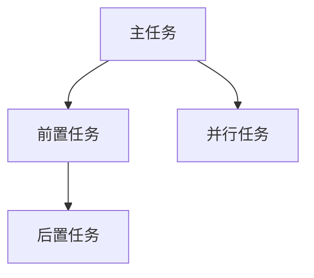

扫描[二维码](https://api2.cmdragon.cn/upload/cmder/20250304_012821924.jpg)
关注或者微信搜一搜：`编程智域 前端至全栈交流与成长`

[发现1000+提升效率与开发的AI工具和实用程序](https://tools.cmdragon.cn/zh/apps?category=ai_chat)：https://tools.cmdragon.cn/


## 一、BackgroundTasks基础回顾

### 1.1 核心作用机制

FastAPI的BackgroundTasks功能允许在响应返回客户端后执行异步操作。其核心实现原理是通过将任务注册到Starlette的BackgroundTasks实例，在当前请求处理完成后顺序执行。

### 1.2 典型应用场景

- 邮件/短信通知发送
- 日志记录与分析
- 文件异步处理
- 第三方API回调处理

## 二、任务依赖关系管理

### 2.1 依赖关系类型



#### 2.1.1 顺序依赖

通过任务注册顺序控制执行顺序：

```python
def task_a():
    print("执行任务A")


def task_b():
    print("执行任务B")


@app.post("/tasks")
async def create_task(background_tasks: BackgroundTasks):
    background_tasks.add_task(task_a)  # 先执行
    background_tasks.add_task(task_b)  # 后执行
```

#### 2.1.2 数据依赖

通过参数传递实现跨任务数据共享：

```python
def process_data(raw_data: dict) -> dict:
    # 数据处理逻辑
    return cleaned_data


def save_data(cleaned_data: dict):
    # 数据存储逻辑
    pass


@app.post("/data")
async def handle_data(
        data: dict,
        background_tasks: BackgroundTasks
):
    cleaned = process_data(data)
    background_tasks.add_task(save_data, cleaned)
```

### 2.2 依赖管理器实现

创建高级任务管理器类：

```python
from pydantic import BaseModel
from typing import List, Callable


class TaskDependency(BaseModel):
    task: Callable
    depends_on: List[str] = []


class TaskManager:
    def __init__(self):
        self.tasks = {}

    def add_task(self, name: str, task: Callable, dependencies: List[str]):
        self.tasks[name] = TaskDependency(
            task=task,
            depends_on=dependencies
        )

    def resolve_dependencies(self):
        # 实现依赖解析算法
        pass
```

## 三、异常处理机制

### 3.1 错误隔离配置

```python
from fastapi import HTTPException


def safe_task():
    try:
    # 任务逻辑
    except Exception as e:
        print(f"任务失败: {str(e)}")


@app.post("/safe-task")
async def create_safe_task(background_tasks: BackgroundTasks):
    background_tasks.add_task(safe_task)
```

### 3.2 重试机制实现

```python
from tenacity import retry, stop_after_attempt


@retry(stop=stop_after_attempt(3))
def retryable_task():
    # 可能失败的任务逻辑
    pass
```

## 课后Quiz

1. 当多个后台任务存在数据依赖时，如何保证执行顺序？
   **答案**：通过任务管理器进行拓扑排序，确保依赖任务先执行

2. 后台任务抛出未捕获异常会导致什么后果？
   **答案**：不会影响主请求响应，但会中断后续任务执行

## 常见报错处理

**错误现象**：`RuntimeError: No response object found`

- 原因分析：在非请求上下文中访问响应对象
- 解决方案：使用`BackgroundTasks`代替直接操作响应对象
- 预防建议：遵循FastAPI的依赖注入机制

---

**运行环境要求**：

```text
fastapi>=0.68.0
pydantic==1.10.7
tenacity==8.0.1
```

**代码示例说明**：
示例实现了一个包含依赖解析能力的任务管理器，通过拓扑排序算法处理复杂任务依赖关系。使用pydantic进行参数验证，保证任务添加的规范性。

余下文章内容请点击跳转至 个人博客页面 或者 扫码关注或者微信搜一搜：`编程智域 前端至全栈交流与成长`
，阅读完整的文章：[如何让FastAPI后台任务像多米诺骨牌一样井然有序地执行？](https://blog.cmdragon.cn/posts/7693d3430a6256c2abefc1e4aba21a4a/)

## 往期文章归档：

- [FastAPI后台任务：是时候让你的代码飞起来了吗？ - cmdragon's Blog](https://blog.cmdragon.cn/posts/6145d88d5154d5cd38cee7ddc2d46e1d/)
- [FastAPI后台任务为何能让邮件发送如此丝滑？ - cmdragon's Blog](https://blog.cmdragon.cn/posts/19241679a1852122f740391cbdc21bae/)
- [FastAPI的请求-响应周期为何需要后台任务分离？ - cmdragon's Blog](https://blog.cmdragon.cn/posts/c7b54d6b3b6b5041654e69e5610bf3b9/)
- [如何在FastAPI中让后台任务既高效又不会让你的应用崩溃？ - cmdragon's Blog](https://blog.cmdragon.cn/posts/5ad8d0a4c8f2d05e9c1a42d828aad7b3/)
- [FastAPI后台任务：异步魔法还是同步噩梦？ - cmdragon's Blog](https://blog.cmdragon.cn/posts/6a69eca9fd14ba8f6fa41502c5014edd/)
- [如何在FastAPI中玩转Schema版本管理和灰度发布？ - cmdragon's Blog](https://blog.cmdragon.cn/posts/6d9d20cd8d8528da4193f13aaf98575c/)
- [FastAPI的查询白名单和安全沙箱机制如何确保你的API坚不可摧？ - cmdragon's Blog](https://blog.cmdragon.cn/posts/ca141239cfc5c0d510960acd266de9cd/)
- [如何在 FastAPI 中玩转 GraphQL 性能监控与 APM 集成？ - cmdragon's Blog](https://blog.cmdragon.cn/posts/52fe9ea73b0e26de308ae0e539df21d2/)
- [如何在 FastAPI 中玩转 GraphQL 和 WebSocket 的实时数据推送魔法？ - cmdragon's Blog](https://blog.cmdragon.cn/posts/ae484cf6bcf3f44fd8392a8272e57db4/)
- [如何在FastAPI中玩转GraphQL联邦架构，让数据源手拉手跳探戈？ - cmdragon's Blog](https://blog.cmdragon.cn/posts/9b9086ff5d8464b0810cfb55f7768513/)
- [GraphQL批量查询优化：DataLoader如何让数据库访问速度飞起来？ - cmdragon's Blog](https://blog.cmdragon.cn/posts/0e236dbe717bde52bda290e89f4f6eca/)
- [如何在FastAPI中整合GraphQL的复杂度与限流？ - cmdragon's Blog](https://blog.cmdragon.cn/posts/ace8bb3f01589994f51d748ab5c73652/)
- [GraphQL错误处理为何让你又爱又恨？FastAPI中间件能否成为你的救星？ - cmdragon's Blog](https://blog.cmdragon.cn/posts/a28d5c1b32feadb18b406a849455dfe5/)
- [FastAPI遇上GraphQL：异步解析器如何让API性能飙升？ - cmdragon's Blog](https://blog.cmdragon.cn/posts/35fced261e8ff834e68e07c93902cc13/)
- [GraphQL的N+1问题如何被DataLoader巧妙化解？ - cmdragon's Blog](https://blog.cmdragon.cn/posts/72629304782a121fbf89b151c436f9aa/)
- [FastAPI与GraphQL的完美邂逅：如何打造高效API？ - cmdragon's Blog](https://blog.cmdragon.cn/posts/fb5c5c7b00bbe57b3a5346b8ee5bc289/)
- [GraphQL类型系统如何让FastAPI开发更高效？ - cmdragon's Blog](https://blog.cmdragon.cn/posts/31c152e531e1cbe5b5cfe15e7ff053c9/)
- [REST和GraphQL究竟谁才是API设计的终极赢家？ - cmdragon's Blog](https://blog.cmdragon.cn/posts/218ad2370eab6197f42fdc9c52f0fc19/)
- [IoT设备的OTA升级是如何通过MQTT协议实现无缝对接的？ - cmdragon's Blog](https://blog.cmdragon.cn/posts/071e9a3b9792beea63f134f5ad28df67/)
- [如何在FastAPI中玩转STOMP协议升级，让你的消息传递更高效？ - cmdragon's Blog](https://blog.cmdragon.cn/posts/16744b2f460346805c45314bc0c6f751/)
- [如何用WebSocket打造毫秒级实时协作系统？ - cmdragon's Blog](https://blog.cmdragon.cn/posts/da5b64cb0ded23e4d5b1f19ffd5ac53d/)
- [如何用WebSocket打造毫秒级实时协作系统？ - cmdragon's Blog](https://blog.cmdragon.cn/posts/da5b64cb0ded23e4d5b1f19ffd5ac53d/)
- [如何让你的WebSocket连接既安全又高效？](https://blog.cmdragon.cn/posts/eb598d50b76ea1823746ab7cdf49ce05/)
- [如何让多客户端会话管理不再成为你的技术噩梦？ - cmdragon's Blog](https://blog.cmdragon.cn/posts/08ba771dbb2eec087c4bc6dc584113c5/)
- [如何在FastAPI中玩转WebSocket消息处理？](https://blog.cmdragon.cn/posts/fbf7d6843e430133547057254deb2dfb/)
- [如何在FastAPI中玩转WebSocket，让实时通信不再烦恼？ - cmdragon's Blog](https://blog.cmdragon.cn/posts/0faebb0f6c2b1bde4ba75869f4f67b76/)
- [WebSocket与HTTP协议究竟有何不同？FastAPI如何让长连接变得如此简单？ - cmdragon's Blog](https://blog.cmdragon.cn/posts/903448c85701a6a747fc9a4417e2bdc8/)
- [FastAPI如何玩转安全防护，让黑客望而却步？](https://blog.cmdragon.cn/posts/c1314c623211c9269f36053179a53d5c/)
- [如何用三层防护体系打造坚不可摧的 API 安全堡垒？ - cmdragon's Blog](https://blog.cmdragon.cn/posts/0bbb4a455ef36bf6f81ac97189586fda/#%E4%B8%80jwt-%E8%AE%A4%E8%AF%81%E8%81%94%E8%B0%83%E6%96%B9%E6%A1%88)
- [FastAPI安全加固：密钥轮换、限流策略与安全头部如何实现三重防护？ - cmdragon's Blog](https://blog.cmdragon.cn/posts/f96ba438de34dc197fd2598f91ae133d/)
- [如何在FastAPI中巧妙玩转数据脱敏，让敏感信息安全无忧？ - cmdragon's Blog](https://blog.cmdragon.cn/posts/045021f8831a03bcdf71e44cb793baf4/)
- [RBAC权限模型如何让API访问控制既安全又灵活？ - cmdragon's Blog](https://blog.cmdragon.cn/posts/9f01e838545ae8d34016c759ef461423/)
- [FastAPI中的敏感数据如何在不泄露的情况下翩翩起舞？](https://blog.cmdragon.cn/posts/88e8615e4c961e7a4f0ef31c0e41cb0b/)
- [FastAPI安全认证的终极秘籍：OAuth2与JWT如何完美融合？ - cmdragon's Blog](https://blog.cmdragon.cn/posts/17d5c40ff6c84ad652f962fed0ce46ab/)
- [如何在FastAPI中打造坚不可摧的Web安全防线？ - cmdragon's Blog](https://blog.cmdragon.cn/posts/9d6200ae7ce0a1a1a523591e3d65a82e/)
- [如何用 FastAPI 和 RBAC 打造坚不可摧的安全堡垒？ - cmdragon's Blog](https://blog.cmdragon.cn/posts/d878b5dbef959058b8098551c70594f8/)
- [FastAPI权限配置：你的系统真的安全吗？ - cmdragon's Blog](https://blog.cmdragon.cn/posts/96b6ede65030daa4613ab92da1d739a6/#%E5%BE%80%E6%9C%9F%E6%96%87%E7%AB%A0%E5%BD%92%E6%A1%A3)

## 免费好用的热门在线工具

- [ASCII字符画生成器 - 应用商店 | By cmdragon](https://tools.cmdragon.cn/zh/apps/ascii-art-generator)
- [JSON Web Tokens 工具 - 应用商店 | By cmdragon](https://tools.cmdragon.cn/zh/apps/jwt-tool)
- [Bcrypt 密码工具 - 应用商店 | By cmdragon](https://tools.cmdragon.cn/zh/apps/bcrypt-tool)
- [GIF 合成器 - 应用商店 | By cmdragon](https://tools.cmdragon.cn/zh/apps/gif-composer)
- [GIF 分解器 - 应用商店 | By cmdragon](https://tools.cmdragon.cn/zh/apps/gif-decomposer)
- [文本隐写术 - 应用商店 | By cmdragon](https://tools.cmdragon.cn/zh/apps/text-steganography)
- [CMDragon 在线工具 - 高级AI工具箱与开发者套件 | 免费好用的在线工具](https://tools.cmdragon.cn/zh)
- [应用商店 - 发现1000+提升效率与开发的AI工具和实用程序 | 免费好用的在线工具](https://tools.cmdragon.cn/zh/apps?category=trending)
- [CMDragon 更新日志 - 最新更新、功能与改进 | 免费好用的在线工具](https://tools.cmdragon.cn/zh/changelog)
- [支持我们 - 成为赞助者 | 免费好用的在线工具](https://tools.cmdragon.cn/zh/sponsor)
- [AI文本生成图像 - 应用商店 | 免费好用的在线工具](https://tools.cmdragon.cn/zh/apps/text-to-image-ai)
- [临时邮箱 - 应用商店 | 免费好用的在线工具](https://tools.cmdragon.cn/zh/apps/temp-email)
- [二维码解析器 - 应用商店 | 免费好用的在线工具](https://tools.cmdragon.cn/zh/apps/qrcode-parser)
- [文本转思维导图 - 应用商店 | 免费好用的在线工具](https://tools.cmdragon.cn/zh/apps/text-to-mindmap)
- [正则表达式可视化工具 - 应用商店 | 免费好用的在线工具](https://tools.cmdragon.cn/zh/apps/regex-visualizer)
- [文件隐写工具 - 应用商店 | 免费好用的在线工具](https://tools.cmdragon.cn/zh/apps/steganography-tool)
- [IPTV 频道探索器 - 应用商店 | 免费好用的在线工具](https://tools.cmdragon.cn/zh/apps/iptv-explorer)
- [快传 - 应用商店 | 免费好用的在线工具](https://tools.cmdragon.cn/zh/apps/snapdrop)
- [随机抽奖工具 - 应用商店 | 免费好用的在线工具](https://tools.cmdragon.cn/zh/apps/lucky-draw)
- [动漫场景查找器 - 应用商店 | 免费好用的在线工具](https://tools.cmdragon.cn/zh/apps/anime-scene-finder)
- [时间工具箱 - 应用商店 | 免费好用的在线工具](https://tools.cmdragon.cn/zh/apps/time-toolkit)
- [网速测试 - 应用商店 | 免费好用的在线工具](https://tools.cmdragon.cn/zh/apps/speed-test)
- [AI 智能抠图工具 - 应用商店 | 免费好用的在线工具](https://tools.cmdragon.cn/zh/apps/background-remover)
- [背景替换工具 - 应用商店 | 免费好用的在线工具](https://tools.cmdragon.cn/zh/apps/background-replacer)
- [艺术二维码生成器 - 应用商店 | 免费好用的在线工具](https://tools.cmdragon.cn/zh/apps/artistic-qrcode)
- [Open Graph 元标签生成器 - 应用商店 | 免费好用的在线工具](https://tools.cmdragon.cn/zh/apps/open-graph-generator)
- [图像对比工具 - 应用商店 | 免费好用的在线工具](https://tools.cmdragon.cn/zh/apps/image-comparison)
- [图片压缩专业版 - 应用商店 | 免费好用的在线工具](https://tools.cmdragon.cn/zh/apps/image-compressor)
- [密码生成器 - 应用商店 | 免费好用的在线工具](https://tools.cmdragon.cn/zh/apps/password-generator)
- [SVG优化器 - 应用商店 | 免费好用的在线工具](https://tools.cmdragon.cn/zh/apps/svg-optimizer)
- [调色板生成器 - 应用商店 | 免费好用的在线工具](https://tools.cmdragon.cn/zh/apps/color-palette)
- [在线节拍器 - 应用商店 | 免费好用的在线工具](https://tools.cmdragon.cn/zh/apps/online-metronome)
- [IP归属地查询 - 应用商店 | 免费好用的在线工具](https://tools.cmdragon.cn/zh/apps/ip-geolocation)
- [CSS网格布局生成器 - 应用商店 | 免费好用的在线工具](https://tools.cmdragon.cn/zh/apps/css-grid-layout)
- [邮箱验证工具 - 应用商店 | 免费好用的在线工具](https://tools.cmdragon.cn/zh/apps/email-validator)
- [书法练习字帖 - 应用商店 | 免费好用的在线工具](https://tools.cmdragon.cn/zh/apps/calligraphy-practice)
- [金融计算器套件 - 应用商店 | 免费好用的在线工具](https://tools.cmdragon.cn/zh/apps/finance-calculator-suite)
- [中国亲戚关系计算器 - 应用商店 | 免费好用的在线工具](https://tools.cmdragon.cn/zh/apps/chinese-kinship-calculator)
- [Protocol Buffer 工具箱 - 应用商店 | 免费好用的在线工具](https://tools.cmdragon.cn/zh/apps/protobuf-toolkit)
- [IP归属地查询 - 应用商店 | 免费好用的在线工具](https://tools.cmdragon.cn/zh/apps/ip-geolocation)
- [图片无损放大 - 应用商店 | 免费好用的在线工具](https://tools.cmdragon.cn/zh/apps/image-upscaler)
- [文本比较工具 - 应用商店 | 免费好用的在线工具](https://tools.cmdragon.cn/zh/apps/text-compare)
- [IP批量查询工具 - 应用商店 | 免费好用的在线工具](https://tools.cmdragon.cn/zh/apps/ip-batch-lookup)
- [域名查询工具 - 应用商店 | 免费好用的在线工具](https://tools.cmdragon.cn/zh/apps/domain-finder)
- [DNS工具箱 - 应用商店 | 免费好用的在线工具](https://tools.cmdragon.cn/zh/apps/dns-toolkit)
- [网站图标生成器 - 应用商店 | 免费好用的在线工具](https://tools.cmdragon.cn/zh/apps/favicon-generator)
- [XML Sitemap](https://tools.cmdragon.cn/sitemap_index.xml)