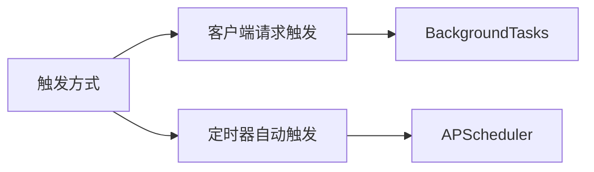

扫描[二维码](https://api2.cmdragon.cn/upload/cmder/20250304_012821924.jpg)
关注或者微信搜一搜：`编程智域 前端至全栈交流与成长`

[发现1000+提升效率与开发的AI工具和实用程序](https://tools.cmdragon.cn/zh/apps?category=ai_chat)：https://tools.cmdragon.cn/

### 定时任务系统原理与应用

#### 1. 定时任务的核心概念

定时任务系统是Web应用中用于在特定时间自动执行任务的机制，它在各种场景中都有重要应用：

1. **数据清理**：每日凌晨清理过期缓存数据
2. **报表生成**：每周一早晨生成业务数据周报
3. **状态刷新**：每5分钟同步外部系统状态
4. **批量处理**：月末计算用户账单

在FastAPI中，主要存在两种实现方式：

- **后台任务队列**：适用于一次性延时任务
- **定时调度系统**：适用于周期重复任务



#### 2. APScheduler 集成方案

APScheduler 是Python中最成熟的定时任务调度库，支持多种调度器和存储方案：

**调度器类型比较**：
| 调度器类型 | 适用场景 | 特点 |
|------------|----------|------|
| BlockingScheduler | 独立脚本 | 阻塞主线程 |
| BackgroundScheduler | Web应用 | 后台独立线程 |
| AsyncIOScheduler | 异步应用 | 兼容asyncio |

**集成示例**：

```python
# requirements.txt
fastapi == 0.109
.2
apscheduler == 3.10
.1
pydantic == 2.6
.4
uvicorn == 0.27
.1
```

```python
from fastapi import FastAPI
from apscheduler.schedulers.background import BackgroundScheduler
from apscheduler.triggers.cron import CronTrigger
from pydantic import BaseModel
import logging

app = FastAPI()
scheduler = BackgroundScheduler()


class TaskConfig(BaseModel):
    """定时任务配置模型"""
    task_id: str
    schedule: str  # Cron表达式
    payload: dict = {}


@app.on_event("startup")
async def init_scheduler():
    """应用启动时初始化调度器"""
    scheduler.add_job(clean_temp_files, "cron", hour=3)  # 每天3点执行
    scheduler.add_job(send_daily_report, CronTrigger.from_crontab("0 9 * * 1-5"))  # 工作日9点
    scheduler.start()
    logging.info("Scheduler started")


@app.on_event("shutdown")
def shutdown_scheduler():
    """应用关闭时安全终止调度器"""
    scheduler.shutdown()
    logging.info("Scheduler stopped")


def clean_temp_files():
    """清理临时文件任务"""
    logging.info("Cleaning temp files...")
    # 实际清理逻辑...


def send_daily_report():
    """发送日报任务"""
    logging.info("Sending daily report...")
    # 实际邮件发送逻辑...
```

#### 3. 案例：电商订单超时处理

**业务需求**：

- 用户下单后15分钟内未支付自动取消订单
- 每天凌晨统计前日取消订单数量

**Pydantic 订单模型**：

```python
class Order(BaseModel):
    order_id: str
    user_id: int
    items: list[str]
    amount: float
    created_at: datetime = Field(default_factory=datetime.now)
    status: Literal["pending", "paid", "canceled"] = "pending"
```

**定时任务实现**：

```python
from datetime import timedelta


@app.post("/orders")
async def create_order(order: Order):
    """创建订单接口"""
    # 订单入库...
    scheduler.add_job(
        cancel_unpaid_order,
        "date",
        run_date=datetime.now() + timedelta(minutes=15),
        args=[order.order_id]
    )
    return {"order_id": order.order_id}


def cancel_unpaid_order(order_id: str):
    """取消未支付订单"""
    order = db.get_order(order_id)
    if order and order.status == "pending":
        order.status = "canceled"
        db.update_order(order)
        logging.info(f"Order {order_id} auto-canceled")
```

#### 4. 课后 Quiz

1. **问题**：如何在分布式环境中避免重复执行定时任务？  
   **答案**：结合分布式锁（如Redis Lock）或使用支持集群的作业存储器（如APScheduler的SQLAlchemyJobStore）

2. **问题**：当任务执行时间超过调度间隔会怎样？  
   **答案**：默认产生任务叠加（misfire）。可通过设置：
   ```python
   scheduler.add_job(misfire_grace_time=300)  # 允许5分钟延迟
   ```

#### 5. 常见错误及解决方法

1. **错误**：`JobLookupError: No job by the id of...`  
   **原因**：任务已移除或从未添加  
   **解决**：添加前检查任务是否存在：
   ```python
   if not scheduler.get_job(job_id):
       scheduler.add_job(...)
   ```

2. **错误**：任务未按预期时间执行  
   **原因**：时区配置错误  
   **解决**：明确设置时区：
   ```python
   scheduler = BackgroundScheduler(timezone="Asia/Shanghai")
   ```

3. **错误**：`RuntimeError: Scheduler is not running`  
   **原因**：在调度器未启动时添加任务  
   **解决**：确保在`startup`事件中添加任务或检查状态：
   ```python
   if scheduler.state == STATE_RUNNING:
       scheduler.add_job(...)
   ```

余下文章内容请点击跳转至 个人博客页面 或者 扫码关注或者微信搜一搜：`编程智域 前端至全栈交流与成长`
，阅读完整的文章：[定时任务系统如何让你的Web应用自动完成那些烦人的重复工作？](https://blog.cmdragon.cn/posts/2b27950aab76203a1af4e9e3deda8699/)


<details>
<summary>往期文章归档</summary>

- [Celery任务监控的魔法背后藏着什么秘密？ - cmdragon's Blog](https://blog.cmdragon.cn/posts/f43335725bb3372ebc774db1b9f28d2d/)
- [如何让Celery任务像VIP客户一样享受优先待遇？ - cmdragon's Blog](https://blog.cmdragon.cn/posts/c24491a7ac7f7c5e9cf77596ebb27c51/)
- [如何让你的FastAPI Celery Worker在压力下优雅起舞？ - cmdragon's Blog](https://blog.cmdragon.cn/posts/c3129f4b424d2ed2330484b82ec31875/)
- [FastAPI与Celery的完美邂逅，如何让异步任务飞起来？ - cmdragon's Blog](https://blog.cmdragon.cn/posts/b79c2c1805fe9b1ea28326b5b8f3b709/)
- [FastAPI消息持久化与ACK机制：如何确保你的任务永不迷路？ - cmdragon's Blog](https://blog.cmdragon.cn/posts/13a59846aaab71b44ab6f3dadc5b5ec7/)
- [FastAPI的BackgroundTasks如何玩转生产者-消费者模式？ - cmdragon's Blog](https://blog.cmdragon.cn/posts/1549a6bd7e47e7006e7ba8f52bcfe8eb/)
- [BackgroundTasks 还是 RabbitMQ？你的异步任务到底该选谁？ - cmdragon's Blog](https://blog.cmdragon.cn/posts/d26fdc150ff9dd70c7482381ff4c77c4/)
- [BackgroundTasks与Celery：谁才是异步任务的终极赢家？ - cmdragon's Blog](https://blog.cmdragon.cn/posts/792cac4ce6eb96b5001da15b0d52ef83/)
- [如何在 FastAPI 中优雅处理后台任务异常并实现智能重试？ - cmdragon's Blog](https://blog.cmdragon.cn/posts/d5c1d2efbaf6fe4c9e13acc6be6d929a/)
- [BackgroundTasks 如何巧妙驾驭多任务并发？ - cmdragon's Blog](https://blog.cmdragon.cn/posts/8661dc74944bd6fb28092e90d4060161/)
- [如何让FastAPI后台任务像多米诺骨牌一样井然有序地执行？ - cmdragon's Blog](https://blog.cmdragon.cn/posts/7693d3430a6256c2abefc1e4aba21a4a/)
- [FastAPI后台任务：是时候让你的代码飞起来了吗？ - cmdragon's Blog](https://blog.cmdragon.cn/posts/6145d88d5154d5cd38cee7ddc2d46e1d/)
- [FastAPI后台任务为何能让邮件发送如此丝滑？ - cmdragon's Blog](https://blog.cmdragon.cn/posts/19241679a1852122f740391cbdc21bae/)
- [FastAPI的请求-响应周期为何需要后台任务分离？ - cmdragon's Blog](https://blog.cmdragon.cn/posts/c7b54d6b3b6b5041654e69e5610bf3b9/)
- [如何在FastAPI中让后台任务既高效又不会让你的应用崩溃？ - cmdragon's Blog](https://blog.cmdragon.cn/posts/5ad8d0a4c8f2d05e9c1a42d828aad7b3/)
- [FastAPI后台任务：异步魔法还是同步噩梦？ - cmdragon's Blog](https://blog.cmdragon.cn/posts/6a69eca9fd14ba8f6fa41502c5014edd/)
- [如何在FastAPI中玩转Schema版本管理和灰度发布？ - cmdragon's Blog](https://blog.cmdragon.cn/posts/6d9d20cd8d8528da4193f13aaf98575c/)
- [FastAPI的查询白名单和安全沙箱机制如何确保你的API坚不可摧？ - cmdragon's Blog](https://blog.cmdragon.cn/posts/ca141239cfc5c0d510960acd266de9cd/)
- [如何在 FastAPI 中玩转 GraphQL 性能监控与 APM 集成？ - cmdragon's Blog](https://blog.cmdragon.cn/posts/52fe9ea73b0e26de308ae0e539df21d2/)
- [如何在 FastAPI 中玩转 GraphQL 和 WebSocket 的实时数据推送魔法？ - cmdragon's Blog](https://blog.cmdragon.cn/posts/ae484cf6bcf3f44fd8392a8272e57db4/)
- [如何在FastAPI中玩转GraphQL联邦架构，让数据源手拉手跳探戈？ - cmdragon's Blog](https://blog.cmdragon.cn/posts/9b9086ff5d8464b0810cfb55f7768513/)
- [GraphQL批量查询优化：DataLoader如何让数据库访问速度飞起来？ - cmdragon's Blog](https://blog.cmdragon.cn/posts/0e236dbe717bde52bda290e89f4f6eca/)
- [如何在FastAPI中整合GraphQL的复杂度与限流？ - cmdragon's Blog](https://blog.cmdragon.cn/posts/ace8bb3f01589994f51d748ab5c73652/)
- [GraphQL错误处理为何让你又爱又恨？FastAPI中间件能否成为你的救星？ - cmdragon's Blog](https://blog.cmdragon.cn/posts/a28d5c1b32feadb18b406a849455dfe5/)
- [FastAPI遇上GraphQL：异步解析器如何让API性能飙升？ - cmdragon's Blog](https://blog.cmdragon.cn/posts/35fced261e8ff834e68e07c93902cc13/)
- [GraphQL的N+1问题如何被DataLoader巧妙化解？ - cmdragon's Blog](https://blog.cmdragon.cn/posts/72629304782a121fbf89b151c436f9aa/)
- [FastAPI与GraphQL的完美邂逅：如何打造高效API？ - cmdragon's Blog](https://blog.cmdragon.cn/posts/fb5c5c7b00bbe57b3a5346b8ee5bc289/)
- [GraphQL类型系统如何让FastAPI开发更高效？ - cmdragon's Blog](https://blog.cmdragon.cn/posts/31c152e531e1cbe5b5cfe15e7ff053c9/)
- [REST和GraphQL究竟谁才是API设计的终极赢家？ - cmdragon's Blog](https://blog.cmdragon.cn/posts/218ad2370eab6197f42fdc9c52f0fc19/)
- [IoT设备的OTA升级是如何通过MQTT协议实现无缝对接的？ - cmdragon's Blog](https://blog.cmdragon.cn/posts/071e9a3b9792beea63f134f5ad28df67/)
- [如何在FastAPI中玩转STOMP协议升级，让你的消息传递更高效？ - cmdragon's Blog](https://blog.cmdragon.cn/posts/16744b2f460346805c45314bc0c6f751/)
- [如何用WebSocket打造毫秒级实时协作系统？ - cmdragon's Blog](https://blog.cmdragon.cn/posts/da5b64cb0ded23e4d5b1f19ffd5ac53d/)
- [如何用WebSocket打造毫秒级实时协作系统？ - cmdragon's Blog](https://blog.cmdragon.cn/posts/da5b64cb0ded23e4d5b1f19ffd5ac53d/)
- [如何让你的WebSocket连接既安全又高效？](https://blog.cmdragon.cn/posts/eb598d50b76ea1823746ab7cdf49ce05/)
- [如何让多客户端会话管理不再成为你的技术噩梦？ - cmdragon's Blog](https://blog.cmdragon.cn/posts/08ba771dbb2eec087c4bc6dc584113c5/)
- [如何在FastAPI中玩转WebSocket消息处理？](https://blog.cmdragon.cn/posts/fbf7d6843e430133547057254deb2dfb/)
- [如何在FastAPI中玩转WebSocket，让实时通信不再烦恼？ - cmdragon's Blog](https://blog.cmdragon.cn/posts/0faebb0f6c2b1bde4ba75869f4f67b76/)

</details>


<details>
<summary>免费好用的热门在线工具</summary>

- [ASCII字符画生成器 - 应用商店 | By cmdragon](https://tools.cmdragon.cn/zh/apps/ascii-art-generator)
- [JSON Web Tokens 工具 - 应用商店 | By cmdragon](https://tools.cmdragon.cn/zh/apps/jwt-tool)
- [Bcrypt 密码工具 - 应用商店 | By cmdragon](https://tools.cmdragon.cn/zh/apps/bcrypt-tool)
- [GIF 合成器 - 应用商店 | By cmdragon](https://tools.cmdragon.cn/zh/apps/gif-composer)
- [GIF 分解器 - 应用商店 | By cmdragon](https://tools.cmdragon.cn/zh/apps/gif-decomposer)
- [文本隐写术 - 应用商店 | By cmdragon](https://tools.cmdragon.cn/zh/apps/text-steganography)
- [CMDragon 在线工具 - 高级AI工具箱与开发者套件 | 免费好用的在线工具](https://tools.cmdragon.cn/zh)
- [应用商店 - 发现1000+提升效率与开发的AI工具和实用程序 | 免费好用的在线工具](https://tools.cmdragon.cn/zh/apps?category=trending)
- [CMDragon 更新日志 - 最新更新、功能与改进 | 免费好用的在线工具](https://tools.cmdragon.cn/zh/changelog)
- [支持我们 - 成为赞助者 | 免费好用的在线工具](https://tools.cmdragon.cn/zh/sponsor)
- [AI文本生成图像 - 应用商店 | 免费好用的在线工具](https://tools.cmdragon.cn/zh/apps/text-to-image-ai)
- [临时邮箱 - 应用商店 | 免费好用的在线工具](https://tools.cmdragon.cn/zh/apps/temp-email)
- [二维码解析器 - 应用商店 | 免费好用的在线工具](https://tools.cmdragon.cn/zh/apps/qrcode-parser)
- [文本转思维导图 - 应用商店 | 免费好用的在线工具](https://tools.cmdragon.cn/zh/apps/text-to-mindmap)
- [正则表达式可视化工具 - 应用商店 | 免费好用的在线工具](https://tools.cmdragon.cn/zh/apps/regex-visualizer)
- [文件隐写工具 - 应用商店 | 免费好用的在线工具](https://tools.cmdragon.cn/zh/apps/steganography-tool)
- [IPTV 频道探索器 - 应用商店 | 免费好用的在线工具](https://tools.cmdragon.cn/zh/apps/iptv-explorer)
- [快传 - 应用商店 | 免费好用的在线工具](https://tools.cmdragon.cn/zh/apps/snapdrop)
- [随机抽奖工具 - 应用商店 | 免费好用的在线工具](https://tools.cmdragon.cn/zh/apps/lucky-draw)
- [动漫场景查找器 - 应用商店 | 免费好用的在线工具](https://tools.cmdragon.cn/zh/apps/anime-scene-finder)
- [时间工具箱 - 应用商店 | 免费好用的在线工具](https://tools.cmdragon.cn/zh/apps/time-toolkit)
- [网速测试 - 应用商店 | 免费好用的在线工具](https://tools.cmdragon.cn/zh/apps/speed-test)
- [AI 智能抠图工具 - 应用商店 | 免费好用的在线工具](https://tools.cmdragon.cn/zh/apps/background-remover)
- [背景替换工具 - 应用商店 | 免费好用的在线工具](https://tools.cmdragon.cn/zh/apps/background-replacer)
- [艺术二维码生成器 - 应用商店 | 免费好用的在线工具](https://tools.cmdragon.cn/zh/apps/artistic-qrcode)
- [Open Graph 元标签生成器 - 应用商店 | 免费好用的在线工具](https://tools.cmdragon.cn/zh/apps/open-graph-generator)
- [图像对比工具 - 应用商店 | 免费好用的在线工具](https://tools.cmdragon.cn/zh/apps/image-comparison)
- [图片压缩专业版 - 应用商店 | 免费好用的在线工具](https://tools.cmdragon.cn/zh/apps/image-compressor)
- [密码生成器 - 应用商店 | 免费好用的在线工具](https://tools.cmdragon.cn/zh/apps/password-generator)
- [SVG优化器 - 应用商店 | 免费好用的在线工具](https://tools.cmdragon.cn/zh/apps/svg-optimizer)
- [调色板生成器 - 应用商店 | 免费好用的在线工具](https://tools.cmdragon.cn/zh/apps/color-palette)
- [在线节拍器 - 应用商店 | 免费好用的在线工具](https://tools.cmdragon.cn/zh/apps/online-metronome)
- [IP归属地查询 - 应用商店 | 免费好用的在线工具](https://tools.cmdragon.cn/zh/apps/ip-geolocation)
- [CSS网格布局生成器 - 应用商店 | 免费好用的在线工具](https://tools.cmdragon.cn/zh/apps/css-grid-layout)
- [邮箱验证工具 - 应用商店 | 免费好用的在线工具](https://tools.cmdragon.cn/zh/apps/email-validator)
- [书法练习字帖 - 应用商店 | 免费好用的在线工具](https://tools.cmdragon.cn/zh/apps/calligraphy-practice)
- [金融计算器套件 - 应用商店 | 免费好用的在线工具](https://tools.cmdragon.cn/zh/apps/finance-calculator-suite)
- [中国亲戚关系计算器 - 应用商店 | 免费好用的在线工具](https://tools.cmdragon.cn/zh/apps/chinese-kinship-calculator)
- [Protocol Buffer 工具箱 - 应用商店 | 免费好用的在线工具](https://tools.cmdragon.cn/zh/apps/protobuf-toolkit)
- [IP归属地查询 - 应用商店 | 免费好用的在线工具](https://tools.cmdragon.cn/zh/apps/ip-geolocation)
- [图片无损放大 - 应用商店 | 免费好用的在线工具](https://tools.cmdragon.cn/zh/apps/image-upscaler)
- [文本比较工具 - 应用商店 | 免费好用的在线工具](https://tools.cmdragon.cn/zh/apps/text-compare)
- [IP批量查询工具 - 应用商店 | 免费好用的在线工具](https://tools.cmdragon.cn/zh/apps/ip-batch-lookup)
- [域名查询工具 - 应用商店 | 免费好用的在线工具](https://tools.cmdragon.cn/zh/apps/domain-finder)
- [DNS工具箱 - 应用商店 | 免费好用的在线工具](https://tools.cmdragon.cn/zh/apps/dns-toolkit)
- [网站图标生成器 - 应用商店 | 免费好用的在线工具](https://tools.cmdragon.cn/zh/apps/favicon-generator)
- [XML Sitemap](https://tools.cmdragon.cn/sitemap_index.xml)

</details>

