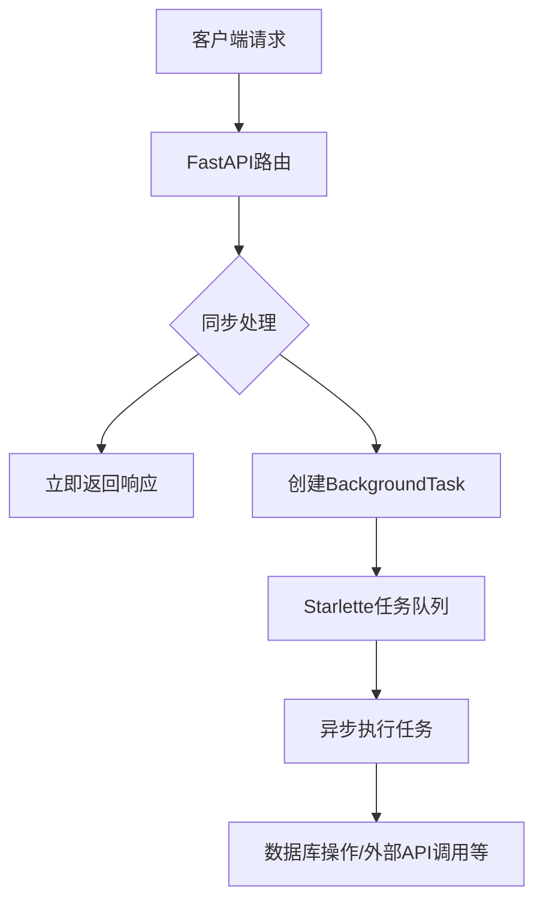

扫描[二维码](https://api2.cmdragon.cn/upload/cmder/20250304_012821924.jpg)
关注或者微信搜一搜：`编程智域 前端至全栈交流与成长`

[发现1000+提升效率与开发的AI工具和实用程序](https://tools.cmdragon.cn/zh/apps?category=ai_chat)：https://tools.cmdragon.cn/

### 1. BackgroundTasks 核心机制

#### 1.1 基础用法与实现原理

FastAPI 的 BackgroundTasks 本质是 Starlette 框架的异步任务队列实现，通过以下方式注册任务：

```python
from fastapi import BackgroundTasks, FastAPI

app = FastAPI()


def log_operation(email: str, message: str):
    with open("operation.log", "a") as f:
        f.write(f"{email}: {message}\n")


@app.post("/notify")
async def send_notification(
        email: str,
        bg_tasks: BackgroundTasks
):
    bg_tasks.add_task(log_operation, email, "notification sent")
    return {"message": "Processing in background"}
```

技术特点：

- 主线程响应后顺序执行任务
- 适用轻量级任务（执行时间 < 3秒）
- 单进程内任务队列

#### 1.2 应用场景对比

| 场景类型 | 适用方案              | 执行时间 | 可靠性要求 |
|------|-------------------|------|-------|
| 日志记录 | BackgroundTasks   | <1秒  | 低     |
| 邮件发送 | BackgroundTasks   | <3秒  | 中     |
| 图片处理 | RabbitMQ + Celery | >5秒  | 高     |
| 数据分析 | RabbitMQ          | 分钟级  | 高     |



### 2. RabbitMQ 集成方案

#### 2.1 环境配置

安装依赖：

```bash
pip install fastapi==0.109.0 pika==1.3.2 pydantic==2.6.4
```

#### 2.2 消息队列配置

```python
import pika


class MQConfig:
    HOST = 'localhost'
    PORT = 5672
    QUEUE = 'fastapi_tasks'
    CREDENTIALS = pika.PlainCredentials('user', 'password')


def get_channel():
    connection = pika.BlockingConnection(
        pika.ConnectionParameters(
            host=MQConfig.HOST,
            port=MQConfig.PORT,
            credentials=MQConfig.CREDENTIALS
        )
    )
    return connection.channel()
```

#### 2.3 任务模型设计

```python
from pydantic import BaseModel
from datetime import datetime


class TaskPayload(BaseModel):
    task_type: str
    content: dict
    created_at: datetime = datetime.now()
    retry_count: int = 0
```

#### 2.4 生产者实现

```python
from fastapi import APIRouter

task_router = APIRouter()


@task_router.post("/create_task")
def create_task(payload: TaskPayload):
    channel = get_channel()
    channel.queue_declare(queue=MQConfig.QUEUE, durable=True)
    channel.basic_publish(
        exchange='',
        routing_key=MQConfig.QUEUE,
        body=payload.json().encode(),
        properties=pika.BasicProperties(
            delivery_mode=2  # 持久化消息
        )
    )
    return {"status": "queued"}
```

#### 2.5 消费者实现

```python
import json
import threading


def start_consumer():
    def callback(ch, method, properties, body):
        try:
            task = TaskPayload.parse_raw(body)
            process_task(task)
            ch.basic_ack(delivery_tag=method.delivery_tag)
        except Exception as e:
            handle_failure(task, str(e))

    channel = get_channel()
    channel.basic_qos(prefetch_count=1)
    channel.basic_consume(
        queue=MQConfig.QUEUE,
        on_message_callback=callback
    )
    threading.Thread(target=channel.start_consuming).start()
```

### 3. 综合应用案例

图片水印处理系统实现：

```python
# 路由层
@task_router.post("/upload_image")
async def upload_image(
        image: UploadFile,
        bg_tasks: BackgroundTasks
):
    # 立即响应
    temp_path = save_temp_image(image)

    # 创建异步任务
    payload = TaskPayload(
        task_type="watermark",
        content={"path": temp_path}
    )

    # 轻量级任务用BackgroundTasks
    bg_tasks.add_task(queue_watermark_task, payload)

    return {"status": "processing"}


def queue_watermark_task(payload: TaskPayload):
    # 将任务提交到RabbitMQ
    channel = get_channel()
    channel.basic_publish(
        exchange='',
        routing_key=MQConfig.QUEUE,
        body=payload.json()
    )
```

### 4. 课后 Quiz

**问题1**：当需要保证任务不丢失时，应该配置哪些关键参数？

**答案解析**：

- 消息持久化：设置 delivery_mode=2
- 队列声明 durable=True
- 消费者手动确认（basic_ack）
- 实现重试机制（通过 retry_count 字段）

**问题2**：什么情况下必须使用消息队列替代 BackgroundTasks？

**参考答案**：

1. 任务执行时间超过 5 秒
2. 需要跨进程/服务器执行
3. 要求任务持久化和重试能力
4. 高并发场景下的负载均衡需求

### 5. 常见报错解决方案

**报错1**：pika.exceptions.AMQPConnectionError

```python
# 解决方案
检查RabbitMQ服务状态：
sudo
systemctl
status
rabbitmq - server

配置连接参数：
credentials = pika.PlainCredentials('正确用户名', '正确密码')
```

**报错2**：ValidationError 422

```json
{
  "detail": [
    {
      "type": "missing",
      "loc": [
        "body",
        "task_type"
      ],
      "msg": "Field required"
    }
  ]
}
```

产生原因：

- 请求体缺少 task_type 字段
- 字段类型不匹配

解决方法：

1. 使用 Pydantic 模型校验请求
2. 启用严格模式：

```python
class TaskPayload(BaseModel):
    model_config = ConfigDict(extra='forbid')
```

余下文章内容请点击跳转至 个人博客页面 或者 扫码关注或者微信搜一搜：`编程智域 前端至全栈交流与成长`
，阅读完整的文章：[BackgroundTasks 还是 RabbitMQ？你的异步任务到底该选谁？](https://blog.cmdragon.cn/posts/d26fdc150ff9dd70c7482381ff4c77c4/)

## 往期文章归档和免费好用的热门在线工具

<details>
<summary>往期文章归档</summary>

- [BackgroundTasks与Celery：谁才是异步任务的终极赢家？ - cmdragon's Blog](https://blog.cmdragon.cn/posts/792cac4ce6eb96b5001da15b0d52ef83/)
- [如何在 FastAPI 中优雅处理后台任务异常并实现智能重试？ - cmdragon's Blog](https://blog.cmdragon.cn/posts/d5c1d2efbaf6fe4c9e13acc6be6d929a/)
- [BackgroundTasks 如何巧妙驾驭多任务并发？ - cmdragon's Blog](https://blog.cmdragon.cn/posts/8661dc74944bd6fb28092e90d4060161/)
- [如何让FastAPI后台任务像多米诺骨牌一样井然有序地执行？ - cmdragon's Blog](https://blog.cmdragon.cn/posts/7693d3430a6256c2abefc1e4aba21a4a/)
- [FastAPI后台任务：是时候让你的代码飞起来了吗？ - cmdragon's Blog](https://blog.cmdragon.cn/posts/6145d88d5154d5cd38cee7ddc2d46e1d/)
- [FastAPI后台任务为何能让邮件发送如此丝滑？ - cmdragon's Blog](https://blog.cmdragon.cn/posts/19241679a1852122f740391cbdc21bae/)
- [FastAPI的请求-响应周期为何需要后台任务分离？ - cmdragon's Blog](https://blog.cmdragon.cn/posts/c7b54d6b3b6b5041654e69e5610bf3b9/)
- [如何在FastAPI中让后台任务既高效又不会让你的应用崩溃？ - cmdragon's Blog](https://blog.cmdragon.cn/posts/5ad8d0a4c8f2d05e9c1a42d828aad7b3/)
- [FastAPI后台任务：异步魔法还是同步噩梦？ - cmdragon's Blog](https://blog.cmdragon.cn/posts/6a69eca9fd14ba8f6fa41502c5014edd/)
- [如何在FastAPI中玩转Schema版本管理和灰度发布？ - cmdragon's Blog](https://blog.cmdragon.cn/posts/6d9d20cd8d8528da4193f13aaf98575c/)
- [FastAPI的查询白名单和安全沙箱机制如何确保你的API坚不可摧？ - cmdragon's Blog](https://blog.cmdragon.cn/posts/ca141239cfc5c0d510960acd266de9cd/)
- [如何在 FastAPI 中玩转 GraphQL 性能监控与 APM 集成？ - cmdragon's Blog](https://blog.cmdragon.cn/posts/52fe9ea73b0e26de308ae0e539df21d2/)
- [如何在 FastAPI 中玩转 GraphQL 和 WebSocket 的实时数据推送魔法？ - cmdragon's Blog](https://blog.cmdragon.cn/posts/ae484cf6bcf3f44fd8392a8272e57db4/)
- [如何在FastAPI中玩转GraphQL联邦架构，让数据源手拉手跳探戈？ - cmdragon's Blog](https://blog.cmdragon.cn/posts/9b9086ff5d8464b0810cfb55f7768513/)
- [GraphQL批量查询优化：DataLoader如何让数据库访问速度飞起来？ - cmdragon's Blog](https://blog.cmdragon.cn/posts/0e236dbe717bde52bda290e89f4f6eca/)
- [如何在FastAPI中整合GraphQL的复杂度与限流？ - cmdragon's Blog](https://blog.cmdragon.cn/posts/ace8bb3f01589994f51d748ab5c73652/)
- [GraphQL错误处理为何让你又爱又恨？FastAPI中间件能否成为你的救星？ - cmdragon's Blog](https://blog.cmdragon.cn/posts/a28d5c1b32feadb18b406a849455dfe5/)
- [FastAPI遇上GraphQL：异步解析器如何让API性能飙升？ - cmdragon's Blog](https://blog.cmdragon.cn/posts/35fced261e8ff834e68e07c93902cc13/)
- [GraphQL的N+1问题如何被DataLoader巧妙化解？ - cmdragon's Blog](https://blog.cmdragon.cn/posts/72629304782a121fbf89b151c436f9aa/)
- [FastAPI与GraphQL的完美邂逅：如何打造高效API？ - cmdragon's Blog](https://blog.cmdragon.cn/posts/fb5c5c7b00bbe57b3a5346b8ee5bc289/)
- [GraphQL类型系统如何让FastAPI开发更高效？ - cmdragon's Blog](https://blog.cmdragon.cn/posts/31c152e531e1cbe5b5cfe15e7ff053c9/)
- [REST和GraphQL究竟谁才是API设计的终极赢家？ - cmdragon's Blog](https://blog.cmdragon.cn/posts/218ad2370eab6197f42fdc9c52f0fc19/)
- [IoT设备的OTA升级是如何通过MQTT协议实现无缝对接的？ - cmdragon's Blog](https://blog.cmdragon.cn/posts/071e9a3b9792beea63f134f5ad28df67/)
- [如何在FastAPI中玩转STOMP协议升级，让你的消息传递更高效？ - cmdragon's Blog](https://blog.cmdragon.cn/posts/16744b2f460346805c45314bc0c6f751/)
- [如何用WebSocket打造毫秒级实时协作系统？ - cmdragon's Blog](https://blog.cmdragon.cn/posts/da5b64cb0ded23e4d5b1f19ffd5ac53d/)
- [如何用WebSocket打造毫秒级实时协作系统？ - cmdragon's Blog](https://blog.cmdragon.cn/posts/da5b64cb0ded23e4d5b1f19ffd5ac53d/)
- [如何让你的WebSocket连接既安全又高效？](https://blog.cmdragon.cn/posts/eb598d50b76ea1823746ab7cdf49ce05/)
- [如何让多客户端会话管理不再成为你的技术噩梦？ - cmdragon's Blog](https://blog.cmdragon.cn/posts/08ba771dbb2eec087c4bc6dc584113c5/)
- [如何在FastAPI中玩转WebSocket消息处理？](https://blog.cmdragon.cn/posts/fbf7d6843e430133547057254deb2dfb/)
- [如何在FastAPI中玩转WebSocket，让实时通信不再烦恼？ - cmdragon's Blog](https://blog.cmdragon.cn/posts/0faebb0f6c2b1bde4ba75869f4f67b76/)
- [WebSocket与HTTP协议究竟有何不同？FastAPI如何让长连接变得如此简单？ - cmdragon's Blog](https://blog.cmdragon.cn/posts/903448c85701a6a747fc9a4417e2bdc8/)
- [FastAPI如何玩转安全防护，让黑客望而却步？](https://blog.cmdragon.cn/posts/c1314c623211c9269f36053179a53d5c/)
- [如何用三层防护体系打造坚不可摧的 API 安全堡垒？ - cmdragon's Blog](https://blog.cmdragon.cn/posts/0bbb4a455ef36bf6f81ac97189586fda/#%E4%B8%80jwt-%E8%AE%A4%E8%AF%81%E8%81%94%E8%B0%83%E6%96%B9%E6%A1%88)
- [FastAPI安全加固：密钥轮换、限流策略与安全头部如何实现三重防护？ - cmdragon's Blog](https://blog.cmdragon.cn/posts/f96ba438de34dc197fd2598f91ae133d/)
- [如何在FastAPI中巧妙玩转数据脱敏，让敏感信息安全无忧？ - cmdragon's Blog](https://blog.cmdragon.cn/posts/045021f8831a03bcdf71e44cb793baf4/)
- [RBAC权限模型如何让API访问控制既安全又灵活？ - cmdragon's Blog](https://blog.cmdragon.cn/posts/9f01e838545ae8d34016c759ef461423/)
- [FastAPI中的敏感数据如何在不泄露的情况下翩翩起舞？](https://blog.cmdragon.cn/posts/88e8615e4c961e7a4f0ef31c0e41cb0b/)

</details>


<details>
<summary>免费好用的热门在线工具</summary>

- [ASCII字符画生成器 - 应用商店 | By cmdragon](https://tools.cmdragon.cn/zh/apps/ascii-art-generator)
- [JSON Web Tokens 工具 - 应用商店 | By cmdragon](https://tools.cmdragon.cn/zh/apps/jwt-tool)
- [Bcrypt 密码工具 - 应用商店 | By cmdragon](https://tools.cmdragon.cn/zh/apps/bcrypt-tool)
- [GIF 合成器 - 应用商店 | By cmdragon](https://tools.cmdragon.cn/zh/apps/gif-composer)
- [GIF 分解器 - 应用商店 | By cmdragon](https://tools.cmdragon.cn/zh/apps/gif-decomposer)
- [文本隐写术 - 应用商店 | By cmdragon](https://tools.cmdragon.cn/zh/apps/text-steganography)
- [CMDragon 在线工具 - 高级AI工具箱与开发者套件 | 免费好用的在线工具](https://tools.cmdragon.cn/zh)
- [应用商店 - 发现1000+提升效率与开发的AI工具和实用程序 | 免费好用的在线工具](https://tools.cmdragon.cn/zh/apps?category=trending)
- [CMDragon 更新日志 - 最新更新、功能与改进 | 免费好用的在线工具](https://tools.cmdragon.cn/zh/changelog)
- [支持我们 - 成为赞助者 | 免费好用的在线工具](https://tools.cmdragon.cn/zh/sponsor)
- [AI文本生成图像 - 应用商店 | 免费好用的在线工具](https://tools.cmdragon.cn/zh/apps/text-to-image-ai)
- [临时邮箱 - 应用商店 | 免费好用的在线工具](https://tools.cmdragon.cn/zh/apps/temp-email)
- [二维码解析器 - 应用商店 | 免费好用的在线工具](https://tools.cmdragon.cn/zh/apps/qrcode-parser)
- [文本转思维导图 - 应用商店 | 免费好用的在线工具](https://tools.cmdragon.cn/zh/apps/text-to-mindmap)
- [正则表达式可视化工具 - 应用商店 | 免费好用的在线工具](https://tools.cmdragon.cn/zh/apps/regex-visualizer)
- [文件隐写工具 - 应用商店 | 免费好用的在线工具](https://tools.cmdragon.cn/zh/apps/steganography-tool)
- [IPTV 频道探索器 - 应用商店 | 免费好用的在线工具](https://tools.cmdragon.cn/zh/apps/iptv-explorer)
- [快传 - 应用商店 | 免费好用的在线工具](https://tools.cmdragon.cn/zh/apps/snapdrop)
- [随机抽奖工具 - 应用商店 | 免费好用的在线工具](https://tools.cmdragon.cn/zh/apps/lucky-draw)
- [动漫场景查找器 - 应用商店 | 免费好用的在线工具](https://tools.cmdragon.cn/zh/apps/anime-scene-finder)
- [时间工具箱 - 应用商店 | 免费好用的在线工具](https://tools.cmdragon.cn/zh/apps/time-toolkit)
- [网速测试 - 应用商店 | 免费好用的在线工具](https://tools.cmdragon.cn/zh/apps/speed-test)
- [AI 智能抠图工具 - 应用商店 | 免费好用的在线工具](https://tools.cmdragon.cn/zh/apps/background-remover)
- [背景替换工具 - 应用商店 | 免费好用的在线工具](https://tools.cmdragon.cn/zh/apps/background-replacer)
- [艺术二维码生成器 - 应用商店 | 免费好用的在线工具](https://tools.cmdragon.cn/zh/apps/artistic-qrcode)
- [Open Graph 元标签生成器 - 应用商店 | 免费好用的在线工具](https://tools.cmdragon.cn/zh/apps/open-graph-generator)
- [图像对比工具 - 应用商店 | 免费好用的在线工具](https://tools.cmdragon.cn/zh/apps/image-comparison)
- [图片压缩专业版 - 应用商店 | 免费好用的在线工具](https://tools.cmdragon.cn/zh/apps/image-compressor)
- [密码生成器 - 应用商店 | 免费好用的在线工具](https://tools.cmdragon.cn/zh/apps/password-generator)
- [SVG优化器 - 应用商店 | 免费好用的在线工具](https://tools.cmdragon.cn/zh/apps/svg-optimizer)
- [调色板生成器 - 应用商店 | 免费好用的在线工具](https://tools.cmdragon.cn/zh/apps/color-palette)
- [在线节拍器 - 应用商店 | 免费好用的在线工具](https://tools.cmdragon.cn/zh/apps/online-metronome)
- [IP归属地查询 - 应用商店 | 免费好用的在线工具](https://tools.cmdragon.cn/zh/apps/ip-geolocation)
- [CSS网格布局生成器 - 应用商店 | 免费好用的在线工具](https://tools.cmdragon.cn/zh/apps/css-grid-layout)
- [邮箱验证工具 - 应用商店 | 免费好用的在线工具](https://tools.cmdragon.cn/zh/apps/email-validator)
- [书法练习字帖 - 应用商店 | 免费好用的在线工具](https://tools.cmdragon.cn/zh/apps/calligraphy-practice)
- [金融计算器套件 - 应用商店 | 免费好用的在线工具](https://tools.cmdragon.cn/zh/apps/finance-calculator-suite)
- [中国亲戚关系计算器 - 应用商店 | 免费好用的在线工具](https://tools.cmdragon.cn/zh/apps/chinese-kinship-calculator)
- [Protocol Buffer 工具箱 - 应用商店 | 免费好用的在线工具](https://tools.cmdragon.cn/zh/apps/protobuf-toolkit)
- [IP归属地查询 - 应用商店 | 免费好用的在线工具](https://tools.cmdragon.cn/zh/apps/ip-geolocation)
- [图片无损放大 - 应用商店 | 免费好用的在线工具](https://tools.cmdragon.cn/zh/apps/image-upscaler)
- [文本比较工具 - 应用商店 | 免费好用的在线工具](https://tools.cmdragon.cn/zh/apps/text-compare)
- [IP批量查询工具 - 应用商店 | 免费好用的在线工具](https://tools.cmdragon.cn/zh/apps/ip-batch-lookup)
- [域名查询工具 - 应用商店 | 免费好用的在线工具](https://tools.cmdragon.cn/zh/apps/domain-finder)
- [DNS工具箱 - 应用商店 | 免费好用的在线工具](https://tools.cmdragon.cn/zh/apps/dns-toolkit)
- [网站图标生成器 - 应用商店 | 免费好用的在线工具](https://tools.cmdragon.cn/zh/apps/favicon-generator)
- [XML Sitemap](https://tools.cmdragon.cn/sitemap_index.xml)

</details>

