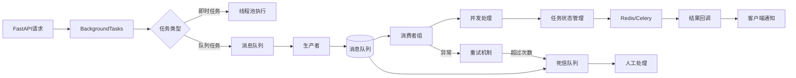
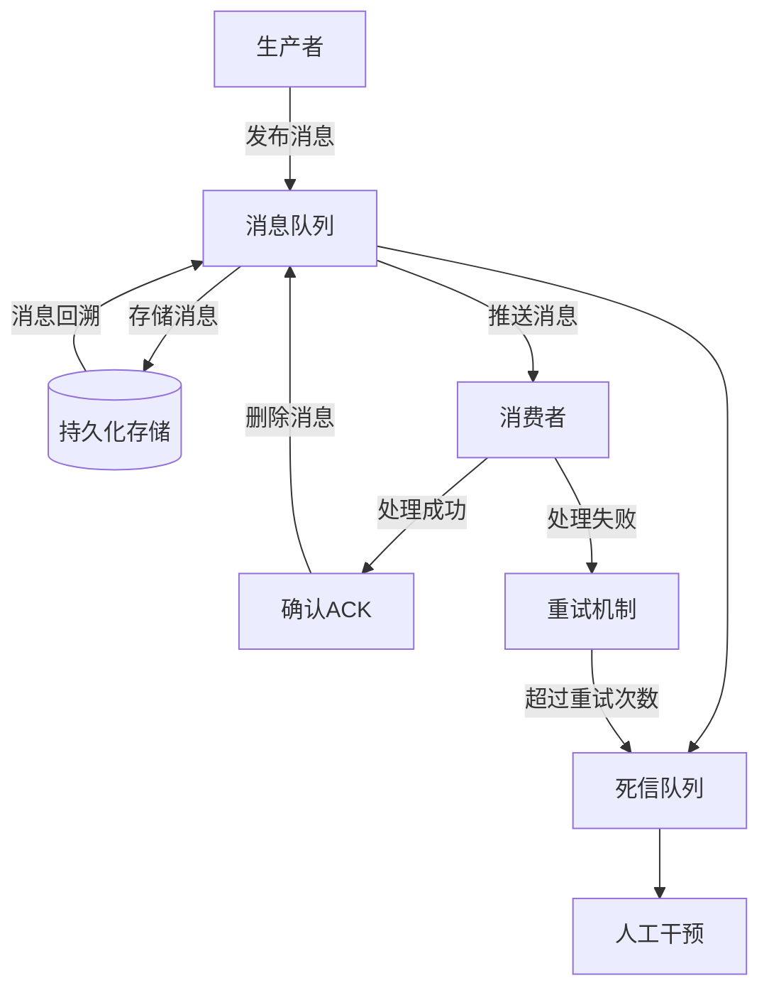

扫描[二维码](https://api2.cmdragon.cn/upload/cmder/20250304_012821924.jpg)
关注或者微信搜一搜：`编程智域 前端至全栈交流与成长`

[发现1000+提升效率与开发的AI工具和实用程序](https://tools.cmdragon.cn/zh/apps?category=ai_chat)：https://tools.cmdragon.cn/

## 二、BackgroundTasks 进阶与消息队列核心原理

### 1. BackgroundTasks 工作机制剖析



FastAPI的BackgroundTasks模块基于请求-响应周期后的异步执行机制，适用于以下典型场景：

- 邮件/短信发送（耗时300ms-2s）
- 日志写入（IO密集型操作）
- 轻量级数据处理（如图片缩略图生成）

与Celery的核心差异对比表：

| 特性     | BackgroundTasks | Celery            |
|--------|-----------------|-------------------|
| 任务持久化  | 内存存储，进程重启丢失     | Redis/RabbitMQ持久化 |
| 分布式支持  | 单进程执行           | 多节点集群             |
| 任务监控   | 无               | Flower监控面板        |
| 适用任务长度 | <5秒             | 任意时长              |
| 失败重试机制 | 需手动实现           | 自动重试策略            |

```python
# 邮件发送示例（需安装pydantic==1.10.7）
from fastapi import BackgroundTasks
from pydantic import EmailStr, BaseModel


class EmailRequest(BaseModel):
    recipient: EmailStr
    content: str


def send_email(email: EmailRequest):
    # 模拟SMTP发送（实际需替换为真实逻辑）
    print(f"Sending email to {email.recipient}")


@app.post("/send-email")
async def schedule_email(
        request: EmailRequest,
        background_tasks: BackgroundTasks
):
    background_tasks.add_task(send_email, request)
    return {"message": "Email queued for delivery"}
```

### 2. 消息队列设计原理详解



消息队列的三大核心组件：

1. **Broker**：负责消息存储和路由
    - 内存队列（如BackgroundTasks）
    - 持久化存储（如RabbitMQ的Exchange/Queue）

2. **生产者-消费者模式**：
   ```python
   # 伪代码示例
   class MessageQueue:
       def __init__(self):
           self.queue = []
       
       def produce(self, message):
           self.queue.append(message)
       
       def consume(self):
           return self.queue.pop(0)
   ```

3. **消息确认机制**：
    - 自动确认（Fire-and-forget）
    - 手动确认（ACK/NACK）

### 3. 混合架构实践方案

结合BackgroundTasks与Celery实现分级任务处理：

```python
from celery import Celery

celery_app = Celery('tasks', broker='redis://localhost:6379/0')


@celery_app.task
def process_large_file(file_path: str):
    # 耗时文件处理（>30秒）
    pass


@app.post("/upload-file")
async def upload_file(
        file: UploadFile,
        background_tasks: BackgroundTasks
):
    # 快速写入本地
    temp_path = save_temp_file(file)

    # 分级任务调度
    background_tasks.add_task(log_upload_action, file.filename)  # 快速任务
    process_large_file.delay(temp_path)  # 慢速任务

    return {"filename": file.filename}
```

### 课后Quiz

**问题1**：当需要处理10分钟的视频转码任务时，应该选择BackgroundTasks还是Celery？  
**答案解析**：必须选择Celery。因为BackgroundTasks设计用于短时任务（通常<
5秒），长时间任务会阻塞FastAPI的事件循环，导致服务响应延迟。Celery支持任务持久化和分布式执行，适合耗时操作。

### 常见报错处理

**报错现象**：HTTP 422 Validation Error  
**根因分析**：

1. 请求体字段类型不匹配（如字符串传入数字字段）
2. 缺少必填字段（如未提供recipient邮件地址）

**解决步骤**：

1. 检查请求头`Content-Type: application/json`设置
2. 使用Swagger UI进行请求体格式验证
3. 添加全局异常捕获：

```python
from fastapi.exceptions import RequestValidationError


@app.exception_handler(RequestValidationError)
async def validation_exception_handler(request, exc):
    return JSONResponse(
        status_code=400,
        content={"detail": exc.errors(), "body": exc.body}
    )
```

余下文章内容请点击跳转至 个人博客页面 或者 扫码关注或者微信搜一搜：`编程智域 前端至全栈交流与成长`
，阅读完整的文章：[BackgroundTasks与Celery：谁才是异步任务的终极赢家？](https://blog.cmdragon.cn/posts/792cac4ce6eb96b5001da15b0d52ef83/)


<details>
<summary>往期文章归档</summary>

- [如何在 FastAPI 中优雅处理后台任务异常并实现智能重试？ - cmdragon's Blog](https://blog.cmdragon.cn/posts/d5c1d2efbaf6fe4c9e13acc6be6d929a/)
- [BackgroundTasks 如何巧妙驾驭多任务并发？ - cmdragon's Blog](https://blog.cmdragon.cn/posts/8661dc74944bd6fb28092e90d4060161/)
- [如何让FastAPI后台任务像多米诺骨牌一样井然有序地执行？ - cmdragon's Blog](https://blog.cmdragon.cn/posts/7693d3430a6256c2abefc1e4aba21a4a/)
- [FastAPI后台任务：是时候让你的代码飞起来了吗？ - cmdragon's Blog](https://blog.cmdragon.cn/posts/6145d88d5154d5cd38cee7ddc2d46e1d/)
- [FastAPI后台任务为何能让邮件发送如此丝滑？ - cmdragon's Blog](https://blog.cmdragon.cn/posts/19241679a1852122f740391cbdc21bae/)
- [FastAPI的请求-响应周期为何需要后台任务分离？ - cmdragon's Blog](https://blog.cmdragon.cn/posts/c7b54d6b3b6b5041654e69e5610bf3b9/)
- [如何在FastAPI中让后台任务既高效又不会让你的应用崩溃？ - cmdragon's Blog](https://blog.cmdragon.cn/posts/5ad8d0a4c8f2d05e9c1a42d828aad7b3/)
- [FastAPI后台任务：异步魔法还是同步噩梦？ - cmdragon's Blog](https://blog.cmdragon.cn/posts/6a69eca9fd14ba8f6fa41502c5014edd/)
- [如何在FastAPI中玩转Schema版本管理和灰度发布？ - cmdragon's Blog](https://blog.cmdragon.cn/posts/6d9d20cd8d8528da4193f13aaf98575c/)
- [FastAPI的查询白名单和安全沙箱机制如何确保你的API坚不可摧？ - cmdragon's Blog](https://blog.cmdragon.cn/posts/ca141239cfc5c0d510960acd266de9cd/)
- [如何在 FastAPI 中玩转 GraphQL 性能监控与 APM 集成？ - cmdragon's Blog](https://blog.cmdragon.cn/posts/52fe9ea73b0e26de308ae0e539df21d2/)
- [如何在 FastAPI 中玩转 GraphQL 和 WebSocket 的实时数据推送魔法？ - cmdragon's Blog](https://blog.cmdragon.cn/posts/ae484cf6bcf3f44fd8392a8272e57db4/)
- [如何在FastAPI中玩转GraphQL联邦架构，让数据源手拉手跳探戈？ - cmdragon's Blog](https://blog.cmdragon.cn/posts/9b9086ff5d8464b0810cfb55f7768513/)
- [GraphQL批量查询优化：DataLoader如何让数据库访问速度飞起来？ - cmdragon's Blog](https://blog.cmdragon.cn/posts/0e236dbe717bde52bda290e89f4f6eca/)
- [如何在FastAPI中整合GraphQL的复杂度与限流？ - cmdragon's Blog](https://blog.cmdragon.cn/posts/ace8bb3f01589994f51d748ab5c73652/)
- [GraphQL错误处理为何让你又爱又恨？FastAPI中间件能否成为你的救星？ - cmdragon's Blog](https://blog.cmdragon.cn/posts/a28d5c1b32feadb18b406a849455dfe5/)
- [FastAPI遇上GraphQL：异步解析器如何让API性能飙升？ - cmdragon's Blog](https://blog.cmdragon.cn/posts/35fced261e8ff834e68e07c93902cc13/)
- [GraphQL的N+1问题如何被DataLoader巧妙化解？ - cmdragon's Blog](https://blog.cmdragon.cn/posts/72629304782a121fbf89b151c436f9aa/)
- [FastAPI与GraphQL的完美邂逅：如何打造高效API？ - cmdragon's Blog](https://blog.cmdragon.cn/posts/fb5c5c7b00bbe57b3a5346b8ee5bc289/)
- [GraphQL类型系统如何让FastAPI开发更高效？ - cmdragon's Blog](https://blog.cmdragon.cn/posts/31c152e531e1cbe5b5cfe15e7ff053c9/)
- [REST和GraphQL究竟谁才是API设计的终极赢家？ - cmdragon's Blog](https://blog.cmdragon.cn/posts/218ad2370eab6197f42fdc9c52f0fc19/)
- [IoT设备的OTA升级是如何通过MQTT协议实现无缝对接的？ - cmdragon's Blog](https://blog.cmdragon.cn/posts/071e9a3b9792beea63f134f5ad28df67/)
- [如何在FastAPI中玩转STOMP协议升级，让你的消息传递更高效？ - cmdragon's Blog](https://blog.cmdragon.cn/posts/16744b2f460346805c45314bc0c6f751/)
- [如何用WebSocket打造毫秒级实时协作系统？ - cmdragon's Blog](https://blog.cmdragon.cn/posts/da5b64cb0ded23e4d5b1f19ffd5ac53d/)
- [如何用WebSocket打造毫秒级实时协作系统？ - cmdragon's Blog](https://blog.cmdragon.cn/posts/da5b64cb0ded23e4d5b1f19ffd5ac53d/)
- [如何让你的WebSocket连接既安全又高效？](https://blog.cmdragon.cn/posts/eb598d50b76ea1823746ab7cdf49ce05/)
- [如何让多客户端会话管理不再成为你的技术噩梦？ - cmdragon's Blog](https://blog.cmdragon.cn/posts/08ba771dbb2eec087c4bc6dc584113c5/)
- [如何在FastAPI中玩转WebSocket消息处理？](https://blog.cmdragon.cn/posts/fbf7d6843e430133547057254deb2dfb/)
- [如何在FastAPI中玩转WebSocket，让实时通信不再烦恼？ - cmdragon's Blog](https://blog.cmdragon.cn/posts/0faebb0f6c2b1bde4ba75869f4f67b76/)
- [WebSocket与HTTP协议究竟有何不同？FastAPI如何让长连接变得如此简单？ - cmdragon's Blog](https://blog.cmdragon.cn/posts/903448c85701a6a747fc9a4417e2bdc8/)
- [FastAPI如何玩转安全防护，让黑客望而却步？](https://blog.cmdragon.cn/posts/c1314c623211c9269f36053179a53d5c/)
- [如何用三层防护体系打造坚不可摧的 API 安全堡垒？ - cmdragon's Blog](https://blog.cmdragon.cn/posts/0bbb4a455ef36bf6f81ac97189586fda/#%E4%B8%80jwt-%E8%AE%A4%E8%AF%81%E8%81%94%E8%B0%83%E6%96%B9%E6%A1%88)
- [FastAPI安全加固：密钥轮换、限流策略与安全头部如何实现三重防护？ - cmdragon's Blog](https://blog.cmdragon.cn/posts/f96ba438de34dc197fd2598f91ae133d/)
- [如何在FastAPI中巧妙玩转数据脱敏，让敏感信息安全无忧？ - cmdragon's Blog](https://blog.cmdragon.cn/posts/045021f8831a03bcdf71e44cb793baf4/)
- [RBAC权限模型如何让API访问控制既安全又灵活？ - cmdragon's Blog](https://blog.cmdragon.cn/posts/9f01e838545ae8d34016c759ef461423/)
- [FastAPI中的敏感数据如何在不泄露的情况下翩翩起舞？](https://blog.cmdragon.cn/posts/88e8615e4c961e7a4f0ef31c0e41cb0b/)
- [FastAPI安全认证的终极秘籍：OAuth2与JWT如何完美融合？ - cmdragon's Blog](https://blog.cmdragon.cn/posts/17d5c40ff6c84ad652f962fed0ce46ab/)

</details>


<details>
<summary>免费好用的热门在线工具</summary>

- [ASCII字符画生成器 - 应用商店 | By cmdragon](https://tools.cmdragon.cn/zh/apps/ascii-art-generator)
- [JSON Web Tokens 工具 - 应用商店 | By cmdragon](https://tools.cmdragon.cn/zh/apps/jwt-tool)
- [Bcrypt 密码工具 - 应用商店 | By cmdragon](https://tools.cmdragon.cn/zh/apps/bcrypt-tool)
- [GIF 合成器 - 应用商店 | By cmdragon](https://tools.cmdragon.cn/zh/apps/gif-composer)
- [GIF 分解器 - 应用商店 | By cmdragon](https://tools.cmdragon.cn/zh/apps/gif-decomposer)
- [文本隐写术 - 应用商店 | By cmdragon](https://tools.cmdragon.cn/zh/apps/text-steganography)
- [CMDragon 在线工具 - 高级AI工具箱与开发者套件 | 免费好用的在线工具](https://tools.cmdragon.cn/zh)
- [应用商店 - 发现1000+提升效率与开发的AI工具和实用程序 | 免费好用的在线工具](https://tools.cmdragon.cn/zh/apps?category=trending)
- [CMDragon 更新日志 - 最新更新、功能与改进 | 免费好用的在线工具](https://tools.cmdragon.cn/zh/changelog)
- [支持我们 - 成为赞助者 | 免费好用的在线工具](https://tools.cmdragon.cn/zh/sponsor)
- [AI文本生成图像 - 应用商店 | 免费好用的在线工具](https://tools.cmdragon.cn/zh/apps/text-to-image-ai)
- [临时邮箱 - 应用商店 | 免费好用的在线工具](https://tools.cmdragon.cn/zh/apps/temp-email)
- [二维码解析器 - 应用商店 | 免费好用的在线工具](https://tools.cmdragon.cn/zh/apps/qrcode-parser)
- [文本转思维导图 - 应用商店 | 免费好用的在线工具](https://tools.cmdragon.cn/zh/apps/text-to-mindmap)
- [正则表达式可视化工具 - 应用商店 | 免费好用的在线工具](https://tools.cmdragon.cn/zh/apps/regex-visualizer)
- [文件隐写工具 - 应用商店 | 免费好用的在线工具](https://tools.cmdragon.cn/zh/apps/steganography-tool)
- [IPTV 频道探索器 - 应用商店 | 免费好用的在线工具](https://tools.cmdragon.cn/zh/apps/iptv-explorer)
- [快传 - 应用商店 | 免费好用的在线工具](https://tools.cmdragon.cn/zh/apps/snapdrop)
- [随机抽奖工具 - 应用商店 | 免费好用的在线工具](https://tools.cmdragon.cn/zh/apps/lucky-draw)
- [动漫场景查找器 - 应用商店 | 免费好用的在线工具](https://tools.cmdragon.cn/zh/apps/anime-scene-finder)
- [时间工具箱 - 应用商店 | 免费好用的在线工具](https://tools.cmdragon.cn/zh/apps/time-toolkit)
- [网速测试 - 应用商店 | 免费好用的在线工具](https://tools.cmdragon.cn/zh/apps/speed-test)
- [AI 智能抠图工具 - 应用商店 | 免费好用的在线工具](https://tools.cmdragon.cn/zh/apps/background-remover)
- [背景替换工具 - 应用商店 | 免费好用的在线工具](https://tools.cmdragon.cn/zh/apps/background-replacer)
- [艺术二维码生成器 - 应用商店 | 免费好用的在线工具](https://tools.cmdragon.cn/zh/apps/artistic-qrcode)
- [Open Graph 元标签生成器 - 应用商店 | 免费好用的在线工具](https://tools.cmdragon.cn/zh/apps/open-graph-generator)
- [图像对比工具 - 应用商店 | 免费好用的在线工具](https://tools.cmdragon.cn/zh/apps/image-comparison)
- [图片压缩专业版 - 应用商店 | 免费好用的在线工具](https://tools.cmdragon.cn/zh/apps/image-compressor)
- [密码生成器 - 应用商店 | 免费好用的在线工具](https://tools.cmdragon.cn/zh/apps/password-generator)
- [SVG优化器 - 应用商店 | 免费好用的在线工具](https://tools.cmdragon.cn/zh/apps/svg-optimizer)
- [调色板生成器 - 应用商店 | 免费好用的在线工具](https://tools.cmdragon.cn/zh/apps/color-palette)
- [在线节拍器 - 应用商店 | 免费好用的在线工具](https://tools.cmdragon.cn/zh/apps/online-metronome)
- [IP归属地查询 - 应用商店 | 免费好用的在线工具](https://tools.cmdragon.cn/zh/apps/ip-geolocation)
- [CSS网格布局生成器 - 应用商店 | 免费好用的在线工具](https://tools.cmdragon.cn/zh/apps/css-grid-layout)
- [邮箱验证工具 - 应用商店 | 免费好用的在线工具](https://tools.cmdragon.cn/zh/apps/email-validator)
- [书法练习字帖 - 应用商店 | 免费好用的在线工具](https://tools.cmdragon.cn/zh/apps/calligraphy-practice)
- [金融计算器套件 - 应用商店 | 免费好用的在线工具](https://tools.cmdragon.cn/zh/apps/finance-calculator-suite)
- [中国亲戚关系计算器 - 应用商店 | 免费好用的在线工具](https://tools.cmdragon.cn/zh/apps/chinese-kinship-calculator)
- [Protocol Buffer 工具箱 - 应用商店 | 免费好用的在线工具](https://tools.cmdragon.cn/zh/apps/protobuf-toolkit)
- [IP归属地查询 - 应用商店 | 免费好用的在线工具](https://tools.cmdragon.cn/zh/apps/ip-geolocation)
- [图片无损放大 - 应用商店 | 免费好用的在线工具](https://tools.cmdragon.cn/zh/apps/image-upscaler)
- [文本比较工具 - 应用商店 | 免费好用的在线工具](https://tools.cmdragon.cn/zh/apps/text-compare)
- [IP批量查询工具 - 应用商店 | 免费好用的在线工具](https://tools.cmdragon.cn/zh/apps/ip-batch-lookup)
- [域名查询工具 - 应用商店 | 免费好用的在线工具](https://tools.cmdragon.cn/zh/apps/domain-finder)
- [DNS工具箱 - 应用商店 | 免费好用的在线工具](https://tools.cmdragon.cn/zh/apps/dns-toolkit)
- [网站图标生成器 - 应用商店 | 免费好用的在线工具](https://tools.cmdragon.cn/zh/apps/favicon-generator)
- [XML Sitemap](https://tools.cmdragon.cn/sitemap_index.xml)

</details>

