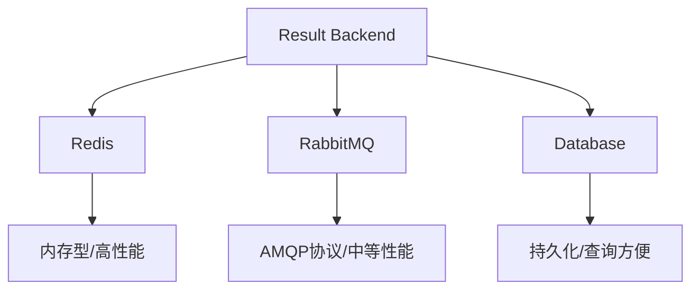

扫描[二维码](https://api2.cmdragon.cn/upload/cmder/20250304_012821924.jpg)
关注或者微信搜一搜：`编程智域 前端至全栈交流与成长`

[发现1000+提升效率与开发的AI工具和实用程序](https://tools.cmdragon.cn/zh/apps?category=ai_chat)：https://tools.cmdragon.cn/

## Celery 结果存储与状态监控

### 1. 结果存储机制解析

#### 1.1 Result Backend 核心作用

Celery 结果存储系统（Result Backend）是异步任务体系的核心组件，负责持久化任务执行状态和返回结果。其核心功能包括：

- 任务状态跟踪（Pending/Started/Success/Failure）
- 任务返回值存储（最长保留时间可配置）
- 异常堆栈信息记录
- 任务元数据存储（如执行时间、重试次数）

#### 1.2 存储方案对比



推荐配置示例（使用Redis）：

```python
# celery_config.py
from celery import Celery

celery_app = Celery(
    'worker',
    broker='redis://:password@localhost:6379/0',
    backend='redis://:password@localhost:6379/1',
    include=['task_handlers']
)
```

### 2. 状态监控实战

#### 2.1 Flower 监控平台

安装最新组件：

```bash
pip install flower==2.0.0 celery==5.3.0
```

启动命令：

```bash
celery -A celery_config.celery_app flower --port=5555
```

#### 2.2 监控指标说明

| 指标类型  | 说明           | 告警阈值建议          |
|-------|--------------|-----------------|
| 任务吞吐量 | 每分钟处理任务数     | <1000 tasks/min |
| 内存占用  | Worker进程内存使用 | >80%            |
| 队列堆积  | 待处理任务数       | >5000           |
| 失败率   | 失败任务占比       | >5%             |

### 3. 集成示例代码

#### 3.1 FastAPI 路由定义

```python
# main.py
from fastapi import FastAPI
from pydantic import BaseModel
from celery_config import celery_app

app = FastAPI()


class TaskRequest(BaseModel):
    data: str
    priority: int = 2


@app.post("/submit-task")
async def submit_task(request: TaskRequest):
    async_result = celery_app.send_task(
        'process_data_task',
        args=[request.data],
        kwargs={'priority': request.priority}
    )
    return {"task_id": async_result.id}
```

#### 3.2 Celery 任务处理器

```python
# task_handlers.py
from celery_config import celery_app
from celery.utils.log import get_task_logger

logger = get_task_logger(__name__)


@celery_app.task(bind=True, max_retries=3)
def process_data_task(self, data):
    try:
        # 模拟数据处理
        processed = data.upper()
        return {"status": "success", "result": processed}
    except Exception as e:
        logger.error(f"Task failed: {str(e)}")
        self.retry(countdown=2 ** self.request.retries)
```

### 4. 常见报错处理

#### 4.1 结果存储异常

**错误现象**：
`NotRegistered: Task handler not registered`

**解决方案**：

1. 检查任务模块是否包含在Celery配置
2. 验证worker启动命令是否正确：

```bash
celery -A celery_config.celery_app worker -l INFO
```

#### 4.2 状态更新延迟

**错误现象**：
任务状态长期显示为"PENDING"

**排查步骤**：

1. 检查Redis连接配置
2. 确认任务超时设置：

```python
celery_app.conf.task_soft_time_limit = 300  # 单位：秒
```

### 课后 Quiz

1. 当使用Redis作为Result Backend时，如何设置不同任务类型的结果过期时间？
   A) 全局统一设置
   B) 在任务装饰器中单独配置
   C) 通过Redis CLI手动设置

**答案**：B。可通过task装饰器参数设置：

```python
@celery_app.task(result_expires=3600)  # 1小时后过期
def my_task():
    ...
```

2. 如何通过API获取任务执行结果？
   A) 直接返回任务对象
   B) 使用AsyncResult查询
   C) 从数据库读取

**答案**：B。示例实现：

```python
from celery.result import AsyncResult


@app.get("/task-result/{task_id}")
def get_task_result(task_id: str):
    result = AsyncResult(task_id, app=celery_app)
    return {
        "status": result.status,
        "result": result.result
    }
```

> **环境要求**：
> - Python 3.8+
> - 依赖版本：
    >
- fastapi==0.109.0
>   - celery==5.3.0
>   - redis==5.0.1
>   - flower==2.0.0
>   - pydantic==2.6.1

余下文章内容请点击跳转至 个人博客页面 或者 扫码关注或者微信搜一搜：`编程智域 前端至全栈交流与成长`
，阅读完整的文章：[Celery任务监控的魔法背后藏着什么秘密？](https://blog.cmdragon.cn/posts/f43335725bb3372ebc774db1b9f28d2d/)


<details>
<summary>往期文章归档</summary>

- [如何让Celery任务像VIP客户一样享受优先待遇？ - cmdragon's Blog](https://blog.cmdragon.cn/posts/c24491a7ac7f7c5e9cf77596ebb27c51/)
- [如何让你的FastAPI Celery Worker在压力下优雅起舞？ - cmdragon's Blog](https://blog.cmdragon.cn/posts/c3129f4b424d2ed2330484b82ec31875/)
- [FastAPI与Celery的完美邂逅，如何让异步任务飞起来？ - cmdragon's Blog](https://blog.cmdragon.cn/posts/b79c2c1805fe9b1ea28326b5b8f3b709/)
- [FastAPI消息持久化与ACK机制：如何确保你的任务永不迷路？ - cmdragon's Blog](https://blog.cmdragon.cn/posts/13a59846aaab71b44ab6f3dadc5b5ec7/)
- [FastAPI的BackgroundTasks如何玩转生产者-消费者模式？ - cmdragon's Blog](https://blog.cmdragon.cn/posts/1549a6bd7e47e7006e7ba8f52bcfe8eb/)
- [BackgroundTasks 还是 RabbitMQ？你的异步任务到底该选谁？ - cmdragon's Blog](https://blog.cmdragon.cn/posts/d26fdc150ff9dd70c7482381ff4c77c4/)
- [BackgroundTasks与Celery：谁才是异步任务的终极赢家？ - cmdragon's Blog](https://blog.cmdragon.cn/posts/792cac4ce6eb96b5001da15b0d52ef83/)
- [如何在 FastAPI 中优雅处理后台任务异常并实现智能重试？ - cmdragon's Blog](https://blog.cmdragon.cn/posts/d5c1d2efbaf6fe4c9e13acc6be6d929a/)
- [BackgroundTasks 如何巧妙驾驭多任务并发？ - cmdragon's Blog](https://blog.cmdragon.cn/posts/8661dc74944bd6fb28092e90d4060161/)
- [如何让FastAPI后台任务像多米诺骨牌一样井然有序地执行？ - cmdragon's Blog](https://blog.cmdragon.cn/posts/7693d3430a6256c2abefc1e4aba21a4a/)
- [FastAPI后台任务：是时候让你的代码飞起来了吗？ - cmdragon's Blog](https://blog.cmdragon.cn/posts/6145d88d5154d5cd38cee7ddc2d46e1d/)
- [FastAPI后台任务为何能让邮件发送如此丝滑？ - cmdragon's Blog](https://blog.cmdragon.cn/posts/19241679a1852122f740391cbdc21bae/)
- [FastAPI的请求-响应周期为何需要后台任务分离？ - cmdragon's Blog](https://blog.cmdragon.cn/posts/c7b54d6b3b6b5041654e69e5610bf3b9/)
- [如何在FastAPI中让后台任务既高效又不会让你的应用崩溃？ - cmdragon's Blog](https://blog.cmdragon.cn/posts/5ad8d0a4c8f2d05e9c1a42d828aad7b3/)
- [FastAPI后台任务：异步魔法还是同步噩梦？ - cmdragon's Blog](https://blog.cmdragon.cn/posts/6a69eca9fd14ba8f6fa41502c5014edd/)
- [如何在FastAPI中玩转Schema版本管理和灰度发布？ - cmdragon's Blog](https://blog.cmdragon.cn/posts/6d9d20cd8d8528da4193f13aaf98575c/)
- [FastAPI的查询白名单和安全沙箱机制如何确保你的API坚不可摧？ - cmdragon's Blog](https://blog.cmdragon.cn/posts/ca141239cfc5c0d510960acd266de9cd/)
- [如何在 FastAPI 中玩转 GraphQL 性能监控与 APM 集成？ - cmdragon's Blog](https://blog.cmdragon.cn/posts/52fe9ea73b0e26de308ae0e539df21d2/)
- [如何在 FastAPI 中玩转 GraphQL 和 WebSocket 的实时数据推送魔法？ - cmdragon's Blog](https://blog.cmdragon.cn/posts/ae484cf6bcf3f44fd8392a8272e57db4/)
- [如何在FastAPI中玩转GraphQL联邦架构，让数据源手拉手跳探戈？ - cmdragon's Blog](https://blog.cmdragon.cn/posts/9b9086ff5d8464b0810cfb55f7768513/)
- [GraphQL批量查询优化：DataLoader如何让数据库访问速度飞起来？ - cmdragon's Blog](https://blog.cmdragon.cn/posts/0e236dbe717bde52bda290e89f4f6eca/)
- [如何在FastAPI中整合GraphQL的复杂度与限流？ - cmdragon's Blog](https://blog.cmdragon.cn/posts/ace8bb3f01589994f51d748ab5c73652/)
- [GraphQL错误处理为何让你又爱又恨？FastAPI中间件能否成为你的救星？ - cmdragon's Blog](https://blog.cmdragon.cn/posts/a28d5c1b32feadb18b406a849455dfe5/)
- [FastAPI遇上GraphQL：异步解析器如何让API性能飙升？ - cmdragon's Blog](https://blog.cmdragon.cn/posts/35fced261e8ff834e68e07c93902cc13/)
- [GraphQL的N+1问题如何被DataLoader巧妙化解？ - cmdragon's Blog](https://blog.cmdragon.cn/posts/72629304782a121fbf89b151c436f9aa/)
- [FastAPI与GraphQL的完美邂逅：如何打造高效API？ - cmdragon's Blog](https://blog.cmdragon.cn/posts/fb5c5c7b00bbe57b3a5346b8ee5bc289/)
- [GraphQL类型系统如何让FastAPI开发更高效？ - cmdragon's Blog](https://blog.cmdragon.cn/posts/31c152e531e1cbe5b5cfe15e7ff053c9/)
- [REST和GraphQL究竟谁才是API设计的终极赢家？ - cmdragon's Blog](https://blog.cmdragon.cn/posts/218ad2370eab6197f42fdc9c52f0fc19/)
- [IoT设备的OTA升级是如何通过MQTT协议实现无缝对接的？ - cmdragon's Blog](https://blog.cmdragon.cn/posts/071e9a3b9792beea63f134f5ad28df67/)
- [如何在FastAPI中玩转STOMP协议升级，让你的消息传递更高效？ - cmdragon's Blog](https://blog.cmdragon.cn/posts/16744b2f460346805c45314bc0c6f751/)
- [如何用WebSocket打造毫秒级实时协作系统？ - cmdragon's Blog](https://blog.cmdragon.cn/posts/da5b64cb0ded23e4d5b1f19ffd5ac53d/)
- [如何用WebSocket打造毫秒级实时协作系统？ - cmdragon's Blog](https://blog.cmdragon.cn/posts/da5b64cb0ded23e4d5b1f19ffd5ac53d/)
- [如何让你的WebSocket连接既安全又高效？](https://blog.cmdragon.cn/posts/eb598d50b76ea1823746ab7cdf49ce05/)
- [如何让多客户端会话管理不再成为你的技术噩梦？ - cmdragon's Blog](https://blog.cmdragon.cn/posts/08ba771dbb2eec087c4bc6dc584113c5/)
- [如何在FastAPI中玩转WebSocket消息处理？](https://blog.cmdragon.cn/posts/fbf7d6843e430133547057254deb2dfb/)
- [如何在FastAPI中玩转WebSocket，让实时通信不再烦恼？ - cmdragon's Blog](https://blog.cmdragon.cn/posts/0faebb0f6c2b1bde4ba75869f4f67b76/)
- [WebSocket与HTTP协议究竟有何不同？FastAPI如何让长连接变得如此简单？ - cmdragon's Blog](https://blog.cmdragon.cn/posts/903448c85701a6a747fc9a4417e2bdc8/)

</details>


<details>
<summary>免费好用的热门在线工具</summary>

- [ASCII字符画生成器 - 应用商店 | By cmdragon](https://tools.cmdragon.cn/zh/apps/ascii-art-generator)
- [JSON Web Tokens 工具 - 应用商店 | By cmdragon](https://tools.cmdragon.cn/zh/apps/jwt-tool)
- [Bcrypt 密码工具 - 应用商店 | By cmdragon](https://tools.cmdragon.cn/zh/apps/bcrypt-tool)
- [GIF 合成器 - 应用商店 | By cmdragon](https://tools.cmdragon.cn/zh/apps/gif-composer)
- [GIF 分解器 - 应用商店 | By cmdragon](https://tools.cmdragon.cn/zh/apps/gif-decomposer)
- [文本隐写术 - 应用商店 | By cmdragon](https://tools.cmdragon.cn/zh/apps/text-steganography)
- [CMDragon 在线工具 - 高级AI工具箱与开发者套件 | 免费好用的在线工具](https://tools.cmdragon.cn/zh)
- [应用商店 - 发现1000+提升效率与开发的AI工具和实用程序 | 免费好用的在线工具](https://tools.cmdragon.cn/zh/apps?category=trending)
- [CMDragon 更新日志 - 最新更新、功能与改进 | 免费好用的在线工具](https://tools.cmdragon.cn/zh/changelog)
- [支持我们 - 成为赞助者 | 免费好用的在线工具](https://tools.cmdragon.cn/zh/sponsor)
- [AI文本生成图像 - 应用商店 | 免费好用的在线工具](https://tools.cmdragon.cn/zh/apps/text-to-image-ai)
- [临时邮箱 - 应用商店 | 免费好用的在线工具](https://tools.cmdragon.cn/zh/apps/temp-email)
- [二维码解析器 - 应用商店 | 免费好用的在线工具](https://tools.cmdragon.cn/zh/apps/qrcode-parser)
- [文本转思维导图 - 应用商店 | 免费好用的在线工具](https://tools.cmdragon.cn/zh/apps/text-to-mindmap)
- [正则表达式可视化工具 - 应用商店 | 免费好用的在线工具](https://tools.cmdragon.cn/zh/apps/regex-visualizer)
- [文件隐写工具 - 应用商店 | 免费好用的在线工具](https://tools.cmdragon.cn/zh/apps/steganography-tool)
- [IPTV 频道探索器 - 应用商店 | 免费好用的在线工具](https://tools.cmdragon.cn/zh/apps/iptv-explorer)
- [快传 - 应用商店 | 免费好用的在线工具](https://tools.cmdragon.cn/zh/apps/snapdrop)
- [随机抽奖工具 - 应用商店 | 免费好用的在线工具](https://tools.cmdragon.cn/zh/apps/lucky-draw)
- [动漫场景查找器 - 应用商店 | 免费好用的在线工具](https://tools.cmdragon.cn/zh/apps/anime-scene-finder)
- [时间工具箱 - 应用商店 | 免费好用的在线工具](https://tools.cmdragon.cn/zh/apps/time-toolkit)
- [网速测试 - 应用商店 | 免费好用的在线工具](https://tools.cmdragon.cn/zh/apps/speed-test)
- [AI 智能抠图工具 - 应用商店 | 免费好用的在线工具](https://tools.cmdragon.cn/zh/apps/background-remover)
- [背景替换工具 - 应用商店 | 免费好用的在线工具](https://tools.cmdragon.cn/zh/apps/background-replacer)
- [艺术二维码生成器 - 应用商店 | 免费好用的在线工具](https://tools.cmdragon.cn/zh/apps/artistic-qrcode)
- [Open Graph 元标签生成器 - 应用商店 | 免费好用的在线工具](https://tools.cmdragon.cn/zh/apps/open-graph-generator)
- [图像对比工具 - 应用商店 | 免费好用的在线工具](https://tools.cmdragon.cn/zh/apps/image-comparison)
- [图片压缩专业版 - 应用商店 | 免费好用的在线工具](https://tools.cmdragon.cn/zh/apps/image-compressor)
- [密码生成器 - 应用商店 | 免费好用的在线工具](https://tools.cmdragon.cn/zh/apps/password-generator)
- [SVG优化器 - 应用商店 | 免费好用的在线工具](https://tools.cmdragon.cn/zh/apps/svg-optimizer)
- [调色板生成器 - 应用商店 | 免费好用的在线工具](https://tools.cmdragon.cn/zh/apps/color-palette)
- [在线节拍器 - 应用商店 | 免费好用的在线工具](https://tools.cmdragon.cn/zh/apps/online-metronome)
- [IP归属地查询 - 应用商店 | 免费好用的在线工具](https://tools.cmdragon.cn/zh/apps/ip-geolocation)
- [CSS网格布局生成器 - 应用商店 | 免费好用的在线工具](https://tools.cmdragon.cn/zh/apps/css-grid-layout)
- [邮箱验证工具 - 应用商店 | 免费好用的在线工具](https://tools.cmdragon.cn/zh/apps/email-validator)
- [书法练习字帖 - 应用商店 | 免费好用的在线工具](https://tools.cmdragon.cn/zh/apps/calligraphy-practice)
- [金融计算器套件 - 应用商店 | 免费好用的在线工具](https://tools.cmdragon.cn/zh/apps/finance-calculator-suite)
- [中国亲戚关系计算器 - 应用商店 | 免费好用的在线工具](https://tools.cmdragon.cn/zh/apps/chinese-kinship-calculator)
- [Protocol Buffer 工具箱 - 应用商店 | 免费好用的在线工具](https://tools.cmdragon.cn/zh/apps/protobuf-toolkit)
- [IP归属地查询 - 应用商店 | 免费好用的在线工具](https://tools.cmdragon.cn/zh/apps/ip-geolocation)
- [图片无损放大 - 应用商店 | 免费好用的在线工具](https://tools.cmdragon.cn/zh/apps/image-upscaler)
- [文本比较工具 - 应用商店 | 免费好用的在线工具](https://tools.cmdragon.cn/zh/apps/text-compare)
- [IP批量查询工具 - 应用商店 | 免费好用的在线工具](https://tools.cmdragon.cn/zh/apps/ip-batch-lookup)
- [域名查询工具 - 应用商店 | 免费好用的在线工具](https://tools.cmdragon.cn/zh/apps/domain-finder)
- [DNS工具箱 - 应用商店 | 免费好用的在线工具](https://tools.cmdragon.cn/zh/apps/dns-toolkit)
- [网站图标生成器 - 应用商店 | 免费好用的在线工具](https://tools.cmdragon.cn/zh/apps/favicon-generator)
- [XML Sitemap](https://tools.cmdragon.cn/sitemap_index.xml)

</details>

