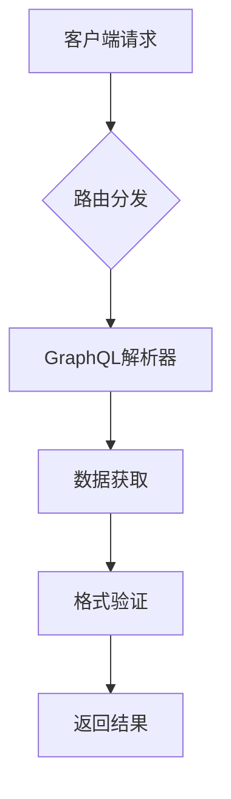
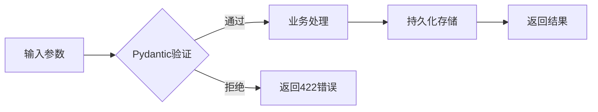

扫描[二维码](https://api2.cmdragon.cn/upload/cmder/20250304_012821924.jpg)
关注或者微信搜一搜：`编程智域 前端至全栈交流与成长`

[发现1000+提升效率与开发的AI工具和实用程序](https://tools.cmdragon.cn/zh/apps?category=ai_chat)：https://tools.cmdragon.cn/

# 1. FastAPI与GraphQL集成基础

## 1.1 技术选型与安装配置

使用Ariadne作为GraphQL实现库，配合FastAPI的异步特性：

```bash
# 安装依赖库
pip install fastapi==0.95.2 uvicorn==0.21.1 
pip install ariadne==0.19.1 python-multipart==0.0.6
```

## 1.2 项目结构设计

推荐采用分层架构：

```
project/
├── main.py
├── schemas/
│   └── graphql/
│       ├── query.py
│       ├── mutation.py
│       └── subscription.py
└── models/
    └── pydantic_models.py
```

# 2. GraphQL核心操作实现

## 2.1 查询（Query）操作

流程图解：



示例代码实现：

```python
from ariadne import QueryType, gql, make_executable_schema
from pydantic import BaseModel


class User(BaseModel):
    id: int
    name: str
    email: str


query = QueryType()


@query.field("getUser")
async def resolve_get_user(_, info, user_id: int):
    # 实际应替换为数据库查询
    return User(id=user_id, name="John", email="john@example.com")


type_defs = gql("""
    type Query {
        getUser(userId: Int!): User
    }
    
    type User {
        id: Int!
        name: String!
        email: String!
    }
""")

schema = make_executable_schema(type_defs, query)
```

## 2.2 变更（Mutation）操作

数据验证流程：



用户创建示例：

```python
from ariadne import MutationType

mutation = MutationType()


class UserInput(BaseModel):
    name: str
    email: str


@mutation.field("createUser")
async def resolve_create_user(_, info, input: dict):
    user_data = UserInput(**input).dict()
    # 插入数据库逻辑
    return {"id": 1, **user_data}


type_defs += gql("""
    input UserInput {
        name: String!
        email: String!
    }
    
    type Mutation {
        createUser(input: UserInput!): User
    }
""")
```

# 3. 订阅（Subscription）实现

## 3.1 WebSocket配置

```python
from fastapi import WebSocket
from ariadne.types import ExtensionSync


class SubscriptionExtension(ExtensionSync):
    def resolve(self, event, _):
        return event.get("result")


@app.websocket("/subscriptions")
async def websocket_endpoint(websocket: WebSocket):
    await websocket.accept()
    # 实现订阅逻辑
```

## 3.2 实时消息推送

```python
from ariadne import SubscriptionType

subscription = SubscriptionType()


@subscription.source("newMessage")
async def generate_messages(obj, info):
    while True:
        await asyncio.sleep(5)
        yield {"content": f"Message {time.time()}"}


type_defs += gql("""
    type Subscription {
        newMessage: String!
    }
""")
```

# 4. 课后Quiz

1. 如何优化GraphQL查询性能？
    - 答案：使用DataLoader批量加载数据，避免N+1查询问题

2. 当出现"Field 'email' of type 'String!' is not found"错误时，应检查什么？
    - 答案：验证Schema定义是否包含该字段，检查查询语句字段拼写

# 5. 常见报错解决方案

## 5.1 422 Validation Error

- 原因：输入数据不符合GraphQL Schema定义
- 解决方法：
    1. 检查请求参数类型
    2. 使用pydantic模型进行预验证
    3. 添加字段默认值处理可选参数

## 5.2 类型解析错误

- 现象：出现"Int cannot represent non-integer value"错误
- 处理步骤：
  ```python
  @scalar("CustomDate")
  def parse_date_value(value):
      try:
          return datetime.fromisoformat(value)
      except ValueError:
          raise GraphQLError("Invalid date format")
  ```

余下文章内容请点击跳转至 个人博客页面 或者 扫码关注或者微信搜一搜：`编程智域 前端至全栈交流与成长`
，阅读完整的文章：[FastAPI与GraphQL的完美邂逅：如何打造高效API？](https://blog.cmdragon.cn/posts/fb5c5c7b00bbe57b3a5346b8ee5bc289/)

## 往期文章归档：

- [GraphQL类型系统如何让FastAPI开发更高效？ - cmdragon's Blog](https://blog.cmdragon.cn/posts/31c152e531e1cbe5b5cfe15e7ff053c9/)
- [REST和GraphQL究竟谁才是API设计的终极赢家？ - cmdragon's Blog](https://blog.cmdragon.cn/posts/218ad2370eab6197f42fdc9c52f0fc19/)
- [IoT设备的OTA升级是如何通过MQTT协议实现无缝对接的？ - cmdragon's Blog](https://blog.cmdragon.cn/posts/071e9a3b9792beea63f134f5ad28df67/)
- [如何在FastAPI中玩转STOMP协议升级，让你的消息传递更高效？ - cmdragon's Blog](https://blog.cmdragon.cn/posts/16744b2f460346805c45314bc0c6f751/)
- [如何用WebSocket打造毫秒级实时协作系统？ - cmdragon's Blog](https://blog.cmdragon.cn/posts/da5b64cb0ded23e4d5b1f19ffd5ac53d/)
- [如何用WebSocket打造毫秒级实时协作系统？ - cmdragon's Blog](https://blog.cmdragon.cn/posts/da5b64cb0ded23e4d5b1f19ffd5ac53d/)
- [如何让你的WebSocket连接既安全又高效？](https://blog.cmdragon.cn/posts/eb598d50b76ea1823746ab7cdf49ce05/)
- [如何让多客户端会话管理不再成为你的技术噩梦？ - cmdragon's Blog](https://blog.cmdragon.cn/posts/08ba771dbb2eec087c4bc6dc584113c5/)
- [如何在FastAPI中玩转WebSocket消息处理？](https://blog.cmdragon.cn/posts/fbf7d6843e430133547057254deb2dfb/)
- [如何在FastAPI中玩转WebSocket，让实时通信不再烦恼？ - cmdragon's Blog](https://blog.cmdragon.cn/posts/0faebb0f6c2b1bde4ba75869f4f67b76/)
- [WebSocket与HTTP协议究竟有何不同？FastAPI如何让长连接变得如此简单？ - cmdragon's Blog](https://blog.cmdragon.cn/posts/903448c85701a6a747fc9a4417e2bdc8/)
- [FastAPI如何玩转安全防护，让黑客望而却步？](https://blog.cmdragon.cn/posts/c1314c623211c9269f36053179a53d5c/)
- [如何用三层防护体系打造坚不可摧的 API 安全堡垒？ - cmdragon's Blog](https://blog.cmdragon.cn/posts/0bbb4a455ef36bf6f81ac97189586fda/#%E4%B8%80jwt-%E8%AE%A4%E8%AF%81%E8%81%94%E8%B0%83%E6%96%B9%E6%A1%88)
- [FastAPI安全加固：密钥轮换、限流策略与安全头部如何实现三重防护？ - cmdragon's Blog](https://blog.cmdragon.cn/posts/f96ba438de34dc197fd2598f91ae133d/)
- [如何在FastAPI中巧妙玩转数据脱敏，让敏感信息安全无忧？ - cmdragon's Blog](https://blog.cmdragon.cn/posts/045021f8831a03bcdf71e44cb793baf4/)
- [RBAC权限模型如何让API访问控制既安全又灵活？ - cmdragon's Blog](https://blog.cmdragon.cn/posts/9f01e838545ae8d34016c759ef461423/)
- [FastAPI中的敏感数据如何在不泄露的情况下翩翩起舞？](https://blog.cmdragon.cn/posts/88e8615e4c961e7a4f0ef31c0e41cb0b/)
- [FastAPI安全认证的终极秘籍：OAuth2与JWT如何完美融合？ - cmdragon's Blog](https://blog.cmdragon.cn/posts/17d5c40ff6c84ad652f962fed0ce46ab/)
- [如何在FastAPI中打造坚不可摧的Web安全防线？ - cmdragon's Blog](https://blog.cmdragon.cn/posts/9d6200ae7ce0a1a1a523591e3d65a82e/)
- [如何用 FastAPI 和 RBAC 打造坚不可摧的安全堡垒？ - cmdragon's Blog](https://blog.cmdragon.cn/posts/d878b5dbef959058b8098551c70594f8/)
- [FastAPI权限配置：你的系统真的安全吗？ - cmdragon's Blog](https://blog.cmdragon.cn/posts/96b6ede65030daa4613ab92da1d739a6/#%E5%BE%80%E6%9C%9F%E6%96%87%E7%AB%A0%E5%BD%92%E6%A1%A3)
- [FastAPI权限缓存：你的性能瓶颈是否藏在这只“看不见的手”里？ | cmdragon's Blog](https://blog.cmdragon.cn/posts/0c8c5a3fdaf69250ac3db7429b102625/)
- [FastAPI日志审计：你的权限系统是否真的安全无虞？ | cmdragon's Blog](https://blog.cmdragon.cn/posts/84bf7b11b342415bddb50e0521c64dfe/)
- [如何在FastAPI中打造坚不可摧的安全防线？ | cmdragon's Blog](https://blog.cmdragon.cn/posts/e2ec1e31dd5d97e0f32d2125385fd955/)
- [如何在FastAPI中实现权限隔离并让用户乖乖听话？ | cmdragon's Blog](https://blog.cmdragon.cn/posts/74777546a240b16b32196e5eb29ec8f7/)
- [如何在FastAPI中玩转权限控制与测试，让代码安全又优雅？ | cmdragon's Blog](https://blog.cmdragon.cn/posts/9dd24a9753ba15f98f24c1e5134fe40e/)
- [如何在FastAPI中打造一个既安全又灵活的权限管理系统？ | cmdragon's Blog](https://blog.cmdragon.cn/posts/277aa1628a2fa9855cdfe5f7c302bd92/)
- [FastAPI访问令牌的权限声明与作用域管理：你的API安全真的无懈可击吗？ | cmdragon's Blog](https://blog.cmdragon.cn/posts/82bae833ad460aec0965cc77b7d6f652/)
- [如何在FastAPI中构建一个既安全又灵活的多层级权限系统？ | cmdragon's Blog](https://blog.cmdragon.cn/posts/13fc113ef1dff03927d46235ad333a7f/)
- [FastAPI如何用角色权限让Web应用安全又灵活？ | cmdragon's Blog](https://blog.cmdragon.cn/posts/cc7aa0af577ae2bc0694e76886373e12/)
- [FastAPI权限验证依赖项究竟藏着什么秘密？ | cmdragon's Blog](https://blog.cmdragon.cn/posts/3e287e8b907561728ded1be34a19b22c/)
- [如何用FastAPI和Tortoise-ORM打造一个既高效又灵活的角色管理系统？ | cmdragon's Blog](https://blog.cmdragon.cn/posts/2b0a2003074eba56a6f6c57aa9690900/)
- [JWT令牌如何在FastAPI中实现安全又高效的生成与验证？ | cmdragon's Blog](https://blog.cmdragon.cn/posts/031a4b22bb8d624cf23ef593f72d1ec6/)
- [你的密码存储方式是否在向黑客招手？ | cmdragon's Blog](https://blog.cmdragon.cn/posts/5f8821250c5a4e9cc08bd08faef76c77/)
- [如何在FastAPI中轻松实现OAuth2认证并保护你的API？ | cmdragon's Blog](https://blog.cmdragon.cn/posts/c290754b532ebf91c5415aa0b30715d0/)
- [FastAPI安全机制：从OAuth2到JWT的魔法通关秘籍 | cmdragon's Blog](https://blog.cmdragon.cn/posts/30ed200ec25b55e1ba159366401ed6ee/)

## 免费好用的热门在线工具

- [CMDragon 在线工具 - 高级AI工具箱与开发者套件 | 免费好用的在线工具](https://tools.cmdragon.cn/zh)
- [应用商店 - 发现1000+提升效率与开发的AI工具和实用程序 | 免费好用的在线工具](https://tools.cmdragon.cn/zh/apps?category=trending)
- [CMDragon 更新日志 - 最新更新、功能与改进 | 免费好用的在线工具](https://tools.cmdragon.cn/zh/changelog)
- [支持我们 - 成为赞助者 | 免费好用的在线工具](https://tools.cmdragon.cn/zh/sponsor)
- [AI文本生成图像 - 应用商店 | 免费好用的在线工具](https://tools.cmdragon.cn/zh/apps/text-to-image-ai)
- [临时邮箱 - 应用商店 | 免费好用的在线工具](https://tools.cmdragon.cn/zh/apps/temp-email)
- [二维码解析器 - 应用商店 | 免费好用的在线工具](https://tools.cmdragon.cn/zh/apps/qrcode-parser)
- [文本转思维导图 - 应用商店 | 免费好用的在线工具](https://tools.cmdragon.cn/zh/apps/text-to-mindmap)
- [正则表达式可视化工具 - 应用商店 | 免费好用的在线工具](https://tools.cmdragon.cn/zh/apps/regex-visualizer)
- [文件隐写工具 - 应用商店 | 免费好用的在线工具](https://tools.cmdragon.cn/zh/apps/steganography-tool)
- [IPTV 频道探索器 - 应用商店 | 免费好用的在线工具](https://tools.cmdragon.cn/zh/apps/iptv-explorer)
- [快传 - 应用商店 | 免费好用的在线工具](https://tools.cmdragon.cn/zh/apps/snapdrop)
- [随机抽奖工具 - 应用商店 | 免费好用的在线工具](https://tools.cmdragon.cn/zh/apps/lucky-draw)
- [动漫场景查找器 - 应用商店 | 免费好用的在线工具](https://tools.cmdragon.cn/zh/apps/anime-scene-finder)
- [时间工具箱 - 应用商店 | 免费好用的在线工具](https://tools.cmdragon.cn/zh/apps/time-toolkit)
- [网速测试 - 应用商店 | 免费好用的在线工具](https://tools.cmdragon.cn/zh/apps/speed-test)
- [AI 智能抠图工具 - 应用商店 | 免费好用的在线工具](https://tools.cmdragon.cn/zh/apps/background-remover)
- [背景替换工具 - 应用商店 | 免费好用的在线工具](https://tools.cmdragon.cn/zh/apps/background-replacer)
- [艺术二维码生成器 - 应用商店 | 免费好用的在线工具](https://tools.cmdragon.cn/zh/apps/artistic-qrcode)
- [Open Graph 元标签生成器 - 应用商店 | 免费好用的在线工具](https://tools.cmdragon.cn/zh/apps/open-graph-generator)
- [图像对比工具 - 应用商店 | 免费好用的在线工具](https://tools.cmdragon.cn/zh/apps/image-comparison)
- [图片压缩专业版 - 应用商店 | 免费好用的在线工具](https://tools.cmdragon.cn/zh/apps/image-compressor)
- [密码生成器 - 应用商店 | 免费好用的在线工具](https://tools.cmdragon.cn/zh/apps/password-generator)
- [SVG优化器 - 应用商店 | 免费好用的在线工具](https://tools.cmdragon.cn/zh/apps/svg-optimizer)
- [调色板生成器 - 应用商店 | 免费好用的在线工具](https://tools.cmdragon.cn/zh/apps/color-palette)
- [在线节拍器 - 应用商店 | 免费好用的在线工具](https://tools.cmdragon.cn/zh/apps/online-metronome)
- [IP归属地查询 - 应用商店 | 免费好用的在线工具](https://tools.cmdragon.cn/zh/apps/ip-geolocation)
- [CSS网格布局生成器 - 应用商店 | 免费好用的在线工具](https://tools.cmdragon.cn/zh/apps/css-grid-layout)
- [邮箱验证工具 - 应用商店 | 免费好用的在线工具](https://tools.cmdragon.cn/zh/apps/email-validator)
- [书法练习字帖 - 应用商店 | 免费好用的在线工具](https://tools.cmdragon.cn/zh/apps/calligraphy-practice)
- [金融计算器套件 - 应用商店 | 免费好用的在线工具](https://tools.cmdragon.cn/zh/apps/finance-calculator-suite)
- [中国亲戚关系计算器 - 应用商店 | 免费好用的在线工具](https://tools.cmdragon.cn/zh/apps/chinese-kinship-calculator)
- [Protocol Buffer 工具箱 - 应用商店 | 免费好用的在线工具](https://tools.cmdragon.cn/zh/apps/protobuf-toolkit)
- [IP归属地查询 - 应用商店 | 免费好用的在线工具](https://tools.cmdragon.cn/zh/apps/ip-geolocation)
- [图片无损放大 - 应用商店 | 免费好用的在线工具](https://tools.cmdragon.cn/zh/apps/image-upscaler)
- [文本比较工具 - 应用商店 | 免费好用的在线工具](https://tools.cmdragon.cn/zh/apps/text-compare)
- [IP批量查询工具 - 应用商店 | 免费好用的在线工具](https://tools.cmdragon.cn/zh/apps/ip-batch-lookup)
- [域名查询工具 - 应用商店 | 免费好用的在线工具](https://tools.cmdragon.cn/zh/apps/domain-finder)
- [DNS工具箱 - 应用商店 | 免费好用的在线工具](https://tools.cmdragon.cn/zh/apps/dns-toolkit)
- [网站图标生成器 - 应用商店 | 免费好用的在线工具](https://tools.cmdragon.cn/zh/apps/favicon-generator)
- [XML Sitemap](https://tools.cmdragon.cn/sitemap_index.xml)