扫描[二维码](https://api2.cmdragon.cn/upload/cmder/20250304_012821924.jpg)
关注或者微信搜一搜：`编程智域 前端至全栈交流与成长`

[发现1000+提升效率与开发的AI工具和实用程序](https://tools.cmdragon.cn/zh/apps?category=ai_chat)：https://tools.cmdragon.cn/

# 第一章：后台任务实现原理与实战

## 1.1 后台任务运行机制

FastAPI通过BackgroundTasks模块实现异步后台任务处理。该机制基于Starlette的BackgroundTask实现，具有以下特点：

- 任务执行与请求处理完全解耦
- 支持依赖注入系统
- 自动处理任务异常
- 任务队列采用内存存储（适用于中小型应用）

```mermaid
graph TD
    A[FastAPI请求] --> B{包含BackgroundTasks参数}
    B -->|是| C[主线程响应]
    C --> D[立即返回客户端响应]
    B -->|否| E[常规请求处理]
    D --> F[后台任务队列]
    F --> G[异步执行任务]
    G --> H[成功完成]
    G --> I[失败处理]
    I --> J[异常记录]
    H --> K[任务状态更新]
    style F fill:#9f9,stroke:#333
    style G fill:#f99,stroke:#333
```



## 1.2 邮件通知实战

安装依赖：

```bash
pip install fastapi==0.68.0 pydantic==1.10.7 python-dotenv==0.19.0 aiosmtplib==1.1.6
```

示例代码：

```python
from fastapi import BackgroundTasks, FastAPI
from pydantic import BaseModel
import aiosmtplib
import os
from dotenv import load_dotenv

load_dotenv()

app = FastAPI()


class EmailRequest(BaseModel):
    recipient: str
    subject: str
    content: str


async def send_email(recipient: str, subject: str, content: str):
    """异步发送邮件核心逻辑"""
    message = f"From: {os.getenv('SMTP_USER')}\nTo: {recipient}\nSubject: {subject}\n\n{content}"
    await aiosmtplib.send(
        message,
        hostname=os.getenv('SMTP_HOST'),
        port=os.getenv('SMTP_PORT'),
        username=os.getenv('SMTP_USER'),
        password=os.getenv('SMTP_PASS'),
        use_tls=True
    )


@app.post("/send-notification")
async def send_notification(
        email_data: EmailRequest,
        background_tasks: BackgroundTasks
):
    """用户注册通知接口"""
    background_tasks.add_task(
        send_email,
        email_data.recipient,
        "新用户注册通知",
        email_data.content
    )
    return {"message": "通知已加入发送队列"}
```

## 1.3 常见问题解答

Q：后台任务未执行可能的原因？
A：检查项目结构确保路由正确导入，验证任务函数是否真正异步执行，检查SMTP服务配置

🛠️ 报错解决方案：SMTPAuthenticationError 535

1. 检查.env文件中的账号密码是否正确
2. 确认SMTP服务是否启用专用应用密码
3. 验证网络连接是否允许出站SMTP请求

# 第二章：邮件服务集成与安全实践

## 2.1 SMTP协议安全配置

强制使用SSL加密连接：

```python
async def send_email(...):
    # 在连接配置中强制使用TLS
    await aiosmtplib.send(
        ...,
        start_tls=True,
        tls_context=ssl.create_default_context()
    )
```

## 2.2 邮件模板引擎集成

使用Jinja2模板示例：

```python
from jinja2 import Environment, FileSystemLoader

env = Environment(loader=FileSystemLoader("templates/email"))


async def render_template(template_name: str, context: dict) -> str:
    template = env.get_template(template_name)
    return template.render(context)
```

🔍 Quiz：如何处理邮件发送失败的重试？
A) 使用指数退避算法重试 B) 立即抛出异常
正确答案：A。在send_email函数中添加重试逻辑：

```python
from tenacity import retry, stop_after_attempt, wait_exponential


@retry(stop=stop_after_attempt(3), wait=wait_exponential())
async def send_email(...):
# 原有发送逻辑
```

# 第三章：日志系统深度集成

## 3.1 结构化日志配置

```python
import logging
import json
from pythonjsonlogger import jsonlogger

logger = logging.getLogger("api")
logger.setLevel(logging.INFO)

handler = logging.FileHandler("app.log")
formatter = jsonlogger.JsonFormatter(
    "%(asctime)s %(levelname)s %(message)s"
)
handler.setFormatter(formatter)
logger.addHandler(handler)
```

## 3.2 请求日志中间件

```python
@app.middleware("http")
async def log_requests(request: Request, call_next):
    start_time = time.time()
    response = await call_next(request)
    process_time = (time.time() - start_time) * 1000

    log_data = {
        "method": request.method,
        "path": request.url.path,
        "status": response.status_code,
        "latency": f"{process_time:.2f}ms"
    }
    logger.info(log_data)

    return response
```

⚙️ 性能优化技巧：

- 使用RotatingFileHandler防止日志文件过大
- 生产环境建议接入ELK或Sentry等日志系统
- 敏感信息过滤（在中间件中添加过滤逻辑）

余下文章内容请点击跳转至 个人博客页面 或者 扫码关注或者微信搜一搜：`编程智域 前端至全栈交流与成长`
，阅读完整的文章：[FastAPI后台任务为何能让邮件发送如此丝滑？](https://blog.cmdragon.cn/posts/19241679a1852122f740391cbdc21bae/)

## 往期文章归档：

- [FastAPI的请求-响应周期为何需要后台任务分离？ - cmdragon's Blog](https://blog.cmdragon.cn/posts/c7b54d6b3b6b5041654e69e5610bf3b9/)
- [如何在FastAPI中让后台任务既高效又不会让你的应用崩溃？ - cmdragon's Blog](https://blog.cmdragon.cn/posts/5ad8d0a4c8f2d05e9c1a42d828aad7b3/)
- [FastAPI后台任务：异步魔法还是同步噩梦？ - cmdragon's Blog](https://blog.cmdragon.cn/posts/6a69eca9fd14ba8f6fa41502c5014edd/)
- [如何在FastAPI中玩转Schema版本管理和灰度发布？ - cmdragon's Blog](https://blog.cmdragon.cn/posts/6d9d20cd8d8528da4193f13aaf98575c/)
- [FastAPI的查询白名单和安全沙箱机制如何确保你的API坚不可摧？ - cmdragon's Blog](https://blog.cmdragon.cn/posts/ca141239cfc5c0d510960acd266de9cd/)
- [如何在 FastAPI 中玩转 GraphQL 性能监控与 APM 集成？ - cmdragon's Blog](https://blog.cmdragon.cn/posts/52fe9ea73b0e26de308ae0e539df21d2/)
- [如何在 FastAPI 中玩转 GraphQL 和 WebSocket 的实时数据推送魔法？ - cmdragon's Blog](https://blog.cmdragon.cn/posts/ae484cf6bcf3f44fd8392a8272e57db4/)
- [如何在FastAPI中玩转GraphQL联邦架构，让数据源手拉手跳探戈？ - cmdragon's Blog](https://blog.cmdragon.cn/posts/9b9086ff5d8464b0810cfb55f7768513/)
- [GraphQL批量查询优化：DataLoader如何让数据库访问速度飞起来？ - cmdragon's Blog](https://blog.cmdragon.cn/posts/0e236dbe717bde52bda290e89f4f6eca/)
- [如何在FastAPI中整合GraphQL的复杂度与限流？ - cmdragon's Blog](https://blog.cmdragon.cn/posts/ace8bb3f01589994f51d748ab5c73652/)
- [GraphQL错误处理为何让你又爱又恨？FastAPI中间件能否成为你的救星？ - cmdragon's Blog](https://blog.cmdragon.cn/posts/a28d5c1b32feadb18b406a849455dfe5/)
- [FastAPI遇上GraphQL：异步解析器如何让API性能飙升？ - cmdragon's Blog](https://blog.cmdragon.cn/posts/35fced261e8ff834e68e07c93902cc13/)
- [GraphQL的N+1问题如何被DataLoader巧妙化解？ - cmdragon's Blog](https://blog.cmdragon.cn/posts/72629304782a121fbf89b151c436f9aa/)
- [FastAPI与GraphQL的完美邂逅：如何打造高效API？ - cmdragon's Blog](https://blog.cmdragon.cn/posts/fb5c5c7b00bbe57b3a5346b8ee5bc289/)
- [GraphQL类型系统如何让FastAPI开发更高效？ - cmdragon's Blog](https://blog.cmdragon.cn/posts/31c152e531e1cbe5b5cfe15e7ff053c9/)
- [REST和GraphQL究竟谁才是API设计的终极赢家？ - cmdragon's Blog](https://blog.cmdragon.cn/posts/218ad2370eab6197f42fdc9c52f0fc19/)
- [IoT设备的OTA升级是如何通过MQTT协议实现无缝对接的？ - cmdragon's Blog](https://blog.cmdragon.cn/posts/071e9a3b9792beea63f134f5ad28df67/)
- [如何在FastAPI中玩转STOMP协议升级，让你的消息传递更高效？ - cmdragon's Blog](https://blog.cmdragon.cn/posts/16744b2f460346805c45314bc0c6f751/)
- [如何用WebSocket打造毫秒级实时协作系统？ - cmdragon's Blog](https://blog.cmdragon.cn/posts/da5b64cb0ded23e4d5b1f19ffd5ac53d/)
- [如何用WebSocket打造毫秒级实时协作系统？ - cmdragon's Blog](https://blog.cmdragon.cn/posts/da5b64cb0ded23e4d5b1f19ffd5ac53d/)
- [如何让你的WebSocket连接既安全又高效？](https://blog.cmdragon.cn/posts/eb598d50b76ea1823746ab7cdf49ce05/)
- [如何让多客户端会话管理不再成为你的技术噩梦？ - cmdragon's Blog](https://blog.cmdragon.cn/posts/08ba771dbb2eec087c4bc6dc584113c5/)
- [如何在FastAPI中玩转WebSocket消息处理？](https://blog.cmdragon.cn/posts/fbf7d6843e430133547057254deb2dfb/)
- [如何在FastAPI中玩转WebSocket，让实时通信不再烦恼？ - cmdragon's Blog](https://blog.cmdragon.cn/posts/0faebb0f6c2b1bde4ba75869f4f67b76/)
- [WebSocket与HTTP协议究竟有何不同？FastAPI如何让长连接变得如此简单？ - cmdragon's Blog](https://blog.cmdragon.cn/posts/903448c85701a6a747fc9a4417e2bdc8/)
- [FastAPI如何玩转安全防护，让黑客望而却步？](https://blog.cmdragon.cn/posts/c1314c623211c9269f36053179a53d5c/)
- [如何用三层防护体系打造坚不可摧的 API 安全堡垒？ - cmdragon's Blog](https://blog.cmdragon.cn/posts/0bbb4a455ef36bf6f81ac97189586fda/#%E4%B8%80jwt-%E8%AE%A4%E8%AF%81%E8%81%94%E8%B0%83%E6%96%B9%E6%A1%88)
- [FastAPI安全加固：密钥轮换、限流策略与安全头部如何实现三重防护？ - cmdragon's Blog](https://blog.cmdragon.cn/posts/f96ba438de34dc197fd2598f91ae133d/)
- [如何在FastAPI中巧妙玩转数据脱敏，让敏感信息安全无忧？ - cmdragon's Blog](https://blog.cmdragon.cn/posts/045021f8831a03bcdf71e44cb793baf4/)
- [RBAC权限模型如何让API访问控制既安全又灵活？ - cmdragon's Blog](https://blog.cmdragon.cn/posts/9f01e838545ae8d34016c759ef461423/)
- [FastAPI中的敏感数据如何在不泄露的情况下翩翩起舞？](https://blog.cmdragon.cn/posts/88e8615e4c961e7a4f0ef31c0e41cb0b/)
- [FastAPI安全认证的终极秘籍：OAuth2与JWT如何完美融合？ - cmdragon's Blog](https://blog.cmdragon.cn/posts/17d5c40ff6c84ad652f962fed0ce46ab/)
- [如何在FastAPI中打造坚不可摧的Web安全防线？ - cmdragon's Blog](https://blog.cmdragon.cn/posts/9d6200ae7ce0a1a1a523591e3d65a82e/)
- [如何用 FastAPI 和 RBAC 打造坚不可摧的安全堡垒？ - cmdragon's Blog](https://blog.cmdragon.cn/posts/d878b5dbef959058b8098551c70594f8/)
- [FastAPI权限配置：你的系统真的安全吗？ - cmdragon's Blog](https://blog.cmdragon.cn/posts/96b6ede65030daa4613ab92da1d739a6/#%E5%BE%80%E6%9C%9F%E6%96%87%E7%AB%A0%E5%BD%92%E6%A1%A3)
- [FastAPI权限缓存：你的性能瓶颈是否藏在这只“看不见的手”里？ | cmdragon's Blog](https://blog.cmdragon.cn/posts/0c8c5a3fdaf69250ac3db7429b102625/)
- [FastAPI日志审计：你的权限系统是否真的安全无虞？ | cmdragon's Blog](https://blog.cmdragon.cn/posts/84bf7b11b342415bddb50e0521c64dfe/)

## 免费好用的热门在线工具

- [ASCII字符画生成器 - 应用商店 | By cmdragon](https://tools.cmdragon.cn/zh/apps/ascii-art-generator)
- [JSON Web Tokens 工具 - 应用商店 | By cmdragon](https://tools.cmdragon.cn/zh/apps/jwt-tool)
- [Bcrypt 密码工具 - 应用商店 | By cmdragon](https://tools.cmdragon.cn/zh/apps/bcrypt-tool)
- [GIF 合成器 - 应用商店 | By cmdragon](https://tools.cmdragon.cn/zh/apps/gif-composer)
- [GIF 分解器 - 应用商店 | By cmdragon](https://tools.cmdragon.cn/zh/apps/gif-decomposer)
- [文本隐写术 - 应用商店 | By cmdragon](https://tools.cmdragon.cn/zh/apps/text-steganography)
- [CMDragon 在线工具 - 高级AI工具箱与开发者套件 | 免费好用的在线工具](https://tools.cmdragon.cn/zh)
- [应用商店 - 发现1000+提升效率与开发的AI工具和实用程序 | 免费好用的在线工具](https://tools.cmdragon.cn/zh/apps?category=trending)
- [CMDragon 更新日志 - 最新更新、功能与改进 | 免费好用的在线工具](https://tools.cmdragon.cn/zh/changelog)
- [支持我们 - 成为赞助者 | 免费好用的在线工具](https://tools.cmdragon.cn/zh/sponsor)
- [AI文本生成图像 - 应用商店 | 免费好用的在线工具](https://tools.cmdragon.cn/zh/apps/text-to-image-ai)
- [临时邮箱 - 应用商店 | 免费好用的在线工具](https://tools.cmdragon.cn/zh/apps/temp-email)
- [二维码解析器 - 应用商店 | 免费好用的在线工具](https://tools.cmdragon.cn/zh/apps/qrcode-parser)
- [文本转思维导图 - 应用商店 | 免费好用的在线工具](https://tools.cmdragon.cn/zh/apps/text-to-mindmap)
- [正则表达式可视化工具 - 应用商店 | 免费好用的在线工具](https://tools.cmdragon.cn/zh/apps/regex-visualizer)
- [文件隐写工具 - 应用商店 | 免费好用的在线工具](https://tools.cmdragon.cn/zh/apps/steganography-tool)
- [IPTV 频道探索器 - 应用商店 | 免费好用的在线工具](https://tools.cmdragon.cn/zh/apps/iptv-explorer)
- [快传 - 应用商店 | 免费好用的在线工具](https://tools.cmdragon.cn/zh/apps/snapdrop)
- [随机抽奖工具 - 应用商店 | 免费好用的在线工具](https://tools.cmdragon.cn/zh/apps/lucky-draw)
- [动漫场景查找器 - 应用商店 | 免费好用的在线工具](https://tools.cmdragon.cn/zh/apps/anime-scene-finder)
- [时间工具箱 - 应用商店 | 免费好用的在线工具](https://tools.cmdragon.cn/zh/apps/time-toolkit)
- [网速测试 - 应用商店 | 免费好用的在线工具](https://tools.cmdragon.cn/zh/apps/speed-test)
- [AI 智能抠图工具 - 应用商店 | 免费好用的在线工具](https://tools.cmdragon.cn/zh/apps/background-remover)
- [背景替换工具 - 应用商店 | 免费好用的在线工具](https://tools.cmdragon.cn/zh/apps/background-replacer)
- [艺术二维码生成器 - 应用商店 | 免费好用的在线工具](https://tools.cmdragon.cn/zh/apps/artistic-qrcode)
- [Open Graph 元标签生成器 - 应用商店 | 免费好用的在线工具](https://tools.cmdragon.cn/zh/apps/open-graph-generator)
- [图像对比工具 - 应用商店 | 免费好用的在线工具](https://tools.cmdragon.cn/zh/apps/image-comparison)
- [图片压缩专业版 - 应用商店 | 免费好用的在线工具](https://tools.cmdragon.cn/zh/apps/image-compressor)
- [密码生成器 - 应用商店 | 免费好用的在线工具](https://tools.cmdragon.cn/zh/apps/password-generator)
- [SVG优化器 - 应用商店 | 免费好用的在线工具](https://tools.cmdragon.cn/zh/apps/svg-optimizer)
- [调色板生成器 - 应用商店 | 免费好用的在线工具](https://tools.cmdragon.cn/zh/apps/color-palette)
- [在线节拍器 - 应用商店 | 免费好用的在线工具](https://tools.cmdragon.cn/zh/apps/online-metronome)
- [IP归属地查询 - 应用商店 | 免费好用的在线工具](https://tools.cmdragon.cn/zh/apps/ip-geolocation)
- [CSS网格布局生成器 - 应用商店 | 免费好用的在线工具](https://tools.cmdragon.cn/zh/apps/css-grid-layout)
- [邮箱验证工具 - 应用商店 | 免费好用的在线工具](https://tools.cmdragon.cn/zh/apps/email-validator)
- [书法练习字帖 - 应用商店 | 免费好用的在线工具](https://tools.cmdragon.cn/zh/apps/calligraphy-practice)
- [金融计算器套件 - 应用商店 | 免费好用的在线工具](https://tools.cmdragon.cn/zh/apps/finance-calculator-suite)
- [中国亲戚关系计算器 - 应用商店 | 免费好用的在线工具](https://tools.cmdragon.cn/zh/apps/chinese-kinship-calculator)
- [Protocol Buffer 工具箱 - 应用商店 | 免费好用的在线工具](https://tools.cmdragon.cn/zh/apps/protobuf-toolkit)
- [IP归属地查询 - 应用商店 | 免费好用的在线工具](https://tools.cmdragon.cn/zh/apps/ip-geolocation)
- [图片无损放大 - 应用商店 | 免费好用的在线工具](https://tools.cmdragon.cn/zh/apps/image-upscaler)
- [文本比较工具 - 应用商店 | 免费好用的在线工具](https://tools.cmdragon.cn/zh/apps/text-compare)
- [IP批量查询工具 - 应用商店 | 免费好用的在线工具](https://tools.cmdragon.cn/zh/apps/ip-batch-lookup)
- [域名查询工具 - 应用商店 | 免费好用的在线工具](https://tools.cmdragon.cn/zh/apps/domain-finder)
- [DNS工具箱 - 应用商店 | 免费好用的在线工具](https://tools.cmdragon.cn/zh/apps/dns-toolkit)
- [网站图标生成器 - 应用商店 | 免费好用的在线工具](https://tools.cmdragon.cn/zh/apps/favicon-generator)
- [XML Sitemap](https://tools.cmdragon.cn/sitemap_index.xml)