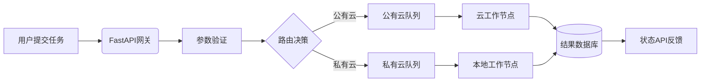

扫描[二维码](https://api2.cmdragon.cn/upload/cmder/20250304_012821924.jpg)
关注或者微信搜一搜：`编程智域 前端至全栈交流与成长`

[发现1000+提升效率与开发的AI工具和实用程序](https://tools.cmdragon.cn/zh/apps?category=ai_chat)：https://tools.cmdragon.cn/


---

### 1. 混合云任务调度概述

混合云任务调度结合了公有云的弹性资源与私有云的安全控制优势，特别适合需要突发计算能力的场景（如大规模数据分析）。FastAPI的异步特性（基于
**ASGI**标准）使其成为构建高并发任务调度API的理想选择。通过异步操作，我们能在单个节点轻松管理数千个并发任务。

#### 典型架构：

```
[用户请求] → [FastAPI网关] → [任务队列] → [公有云工作节点]
                      │              → [私有云工作节点]
                      ↓        
               [状态数据库]
```

---

### 2. 任务调度API设计

#### 核心组件：

1. **任务定义模型**（Pydantic Schema）
2. **异步任务队列**（Celery + Redis）
3. **混合云路由模块**
4. **任务状态跟踪**

#### 流程图：



---

### 3. 代码实现

**依赖库**：

```
fastapi==0.103.1
pydantic==2.5.0
celery==5.3.1
redis==4.5.5
```

#### 核心代码：

```python
from fastapi import Depends, FastAPI, BackgroundTasks
from pydantic import BaseModel
from celery import Celery
from contextlib import asynccontextmanager


# 配置中心模型
class CloudConfig(BaseModel):
    public_cloud_url: str
    private_cloud_key: str


# 初始化Redis连接
@asynccontextmanager
async def redis_connection():
    import redis
    r = redis.Redis(host='localhost', port=6379)
    try:
        yield r
    finally:
        r.close()


# 依赖注入配置
def get_cloud_config() -> CloudConfig:
    return CloudConfig(
        public_cloud_url="https://api.public.cloud/jobs",
        private_cloud_key="secret_key_123"
    )


# 初始化Celery
celery_app = Celery('tasks', broker='redis://localhost:6379/0')


# 定义任务模型
class JobRequest(BaseModel):
    job_type: str
    params: dict
    target_cloud: str  # 'public' 或 'private'


app = FastAPI()


@app.post("/schedule-job")
async def schedule_job(
        job: JobRequest,
        bg_tasks: BackgroundTasks,
        config: CloudConfig = Depends(get_cloud_config),
        redis_conn=Depends(redis_connection)
):
    # 参数验证通过Pydantic自动完成

    # 创建任务记录到数据库
    await redis_conn.set(f"job:{job.job_type}", "pending")

    # 根据目标云分发任务
    if job.target_cloud == "public":
        bg_tasks.add_task(execute_public_cloud_job, job, config)
    else:
        bg_tasks.add_task(execute_private_cloud_job, job, config)

    return {"status": "scheduled", "job_id": job.job_type}


# 公有云执行函数
@celery_app.task
def execute_public_cloud_job(job: JobRequest, config: CloudConfig):
    import requests
    # 实际执行逻辑
    response = requests.post(
        config.public_cloud_url,
        json=job.params,
        headers={"Authorization": f"Bearer {config.public_cloud_key}"}
    )
    return response.json()


# 私有云执行函数
@celery_app.task
def execute_private_cloud_job(job: JobRequest, config: CloudConfig):
    # 调用内部API执行任务
    return {"status": "completed", "cloud": "private"}
```

#### 代码解析

1. **依赖注入系统**
    - `get_cloud_config()`: 提供统一的配置访问入口
    - `redis_connection()`: 使用上下文管理器管理资源生命周期
    - `BackgroundTasks`: 异步执行耗时操作

2. **Pydantic数据验证**
    - `JobRequest`模型确保参数正确性
    - 自动生成API文档验证规则

3. **混合云调度策略**
    - 根据`target_cloud`选择执行路径
    - Celery作为任务队列保证可靠性

---

### 4. 场景案例：视频转码服务

**业务需求：**

- 普通视频转码 → 私有云节点
- 8K HDR视频转码 → 公有云GPU节点

**实现效果：**

```json
// 提交任务
POST /submit-task
{
  "task_type": "8k_transcode",
  "data": {
    "video_id": "1234"
  },
  "priority": 5
}

// 响应
{
  "task_id": "550e8400",
  "queue": "public_cloud_queue"
}
```

系统自动将高负荷任务路由到公有云，同时普通任务在本地处理。

---

### 课后Quiz

**问题**：当同时向公有云和私有云提交任务时，如何保证原子性（即所有子任务要么全部成功，要么全部回滚）？

**选项**：

1. 使用数据库事务记录所有任务状态
2. 依赖FastAPI的自动错误处理
3. 采用SAGA分布式事务模式
4. 忽略此问题，云服务自带容错

**答案及解析**：  
正确答案是选项3（采用SAGA分布式事务模式）。  
在分布式系统中无法使用传统ACID事务时，SAGA模式通过一系列本地事务+补偿事务实现最终一致性。具体实现：

- 在Redis中创建事务ID记录所有任务状态
- 每个子任务完成后更新状态
- 若任一任务失败，执行已成功任务的补偿操作
- FastAPI的依赖注入可以统一管理事务上下文

---

### 常见报错解决方案

#### 报错：`422 Validation Error`

**场景**：

```json
POST /schedule-job
{
  "job_type": "data_sync",
  "params": {
    "source": "db1"
  },
  "target_cloud": "hybrid"
  #
  非有效值
}
```

**原因**：

- Pydantic模型验证失败（`target_cloud`只允许'public'或'private'）
- 字段类型不匹配
- 缺少必填字段

**解决方法**：

1. 检查API文档确认参数格式
2. 使用try-except捕获验证异常：

```python
from fastapi import HTTPException


@app.post("/schedule-job")
async def schedule_job(job: JobRequest):
    try:
    # 业务逻辑
    except ValidationError as e:
        raise HTTPException(422, detail=str(e))
```

**预防措施**：

- 在前端使用自动生成的表单（FastAPI的`/docs`提供）
- 编写单元测试覆盖所有参数组合
- 添加自定义验证器：

```python
from pydantic import field_validator


class JobRequest(BaseModel):
    ...

    @field_validator('target_cloud')
    def check_cloud_type(cls, v):
        if v not in ['public', 'private']:
            raise ValueError("Invalid cloud type")
        return v
```

#### 报错：`503 Service Unavailable`

**原因**：

- Redis或Celery服务不可用
- 云API调用超时
- 资源连接池耗尽

**解决方法**：

1. 添加健康检查端点：

```python
@app.get("/health")
def health_check(redis_conn=Depends(redis_connection)):
    if redis_conn.ping():
        return {"status": "ok"}
    raise HTTPException(503)
```

2. 实现弹性重试机制：

```python
from tenacity import retry, stop_after_attempt


@retry(stop=stop_after_attempt(3))
def execute_public_cloud_job(...):
# 重试逻辑
```

**预防措施**：

- 使用连接池管理数据库连接
- 设置合理的超时参数：

```python
# 在依赖项中设置
@asynccontextmanager
async def redis_connection():
    r = redis.Redis(
        ...,
        socket_timeout=5,
        socket_connect_timeout=2
    )
```

#### 报错：`504 Gateway Timeout`

**原因**：

- 后台任务执行超时
- 同步操作阻塞事件循环
- 资源死锁

**解决方法**：

1. 确保长时间任务放入后台队列：

```python
bg_tasks.add_task(long_running_job)  # 而不是直接调用
```

2. 拆分大任务为小批次：

```python
# 在Celery任务中
for chunk in split_data(data, 1000):
    process_chunk.delay(chunk)
```

**预防措施**：

- 使用性能监控工具（如Prometheus）
- 限制单个任务最大执行时间：

```python
@celery_app.task(time_limit=300)  # 5分钟超时
def process_data(...):
    ...
```

> 关键准则：永远保持FastAPI的请求/响应循环异步，耗时操作委托给后台任务系统。

余下文章内容请点击跳转至 个人博客页面 或者 扫码关注或者微信搜一搜：`编程智域 前端至全栈交流与成长`
，阅读完整的文章：[FastAPI如何巧妙驾驭混合云任务调度，让异步魔力尽情释放？](https://blog.cmdragon.cn/posts/8d8e78fb048643f7ad6bd82d61e85d84/)


<details>
<summary>往期文章归档</summary>

- [冷热任务分离：是提升Web性能的终极秘籍还是技术噱头？ - cmdragon's Blog](https://blog.cmdragon.cn/posts/9c3dc7767a9282f7ef02daad42539f2c/)
- [如何让FastAPI在百万级任务处理中依然游刃有余？ - cmdragon's Blog](https://blog.cmdragon.cn/posts/469aae0e0f88c642ed8bc82e102b960b/)
- [如何让FastAPI与消息队列的联姻既甜蜜又可靠？ - cmdragon's Blog](https://blog.cmdragon.cn/posts/1bebb53f4d9d6fbd0ecbba97562c07b0/)
- [如何在FastAPI中巧妙实现延迟队列，让任务乖乖等待？ - cmdragon's Blog](https://blog.cmdragon.cn/posts/174450702d9e609a072a7d1aaa84750b/)
- [FastAPI的死信队列处理机制：为何你的消息系统需要它？ - cmdragon's Blog](https://blog.cmdragon.cn/posts/047b08957a0d617a87b72da6c3131e5d/)
- [如何让FastAPI任务系统在失败时自动告警并自我修复？ - cmdragon's Blog](https://blog.cmdragon.cn/posts/2f104637ecc916e906c002fa79ab8c80/)
- [如何用Prometheus和FastAPI打造任务监控的“火眼金睛”？ - cmdragon's Blog](https://blog.cmdragon.cn/posts/e7464e5b4d558ede1a7413fa0a2f96f3/)
- [如何用APScheduler和FastAPI打造永不宕机的分布式定时任务系统？ - cmdragon's Blog](https://blog.cmdragon.cn/posts/51a0ff47f509fb6238150a96f551b317/)
- [如何在 FastAPI 中玩转 APScheduler，让任务定时自动执行？ - cmdragon's Blog](https://blog.cmdragon.cn/posts/85564dd901c6d9b1a79d320970843caa/)
- [定时任务系统如何让你的Web应用自动完成那些烦人的重复工作？ - cmdragon's Blog](https://blog.cmdragon.cn/posts/2b27950aab76203a1af4e9e3deda8699/)
- [Celery任务监控的魔法背后藏着什么秘密？ - cmdragon's Blog](https://blog.cmdragon.cn/posts/f43335725bb3372ebc774db1b9f28d2d/)
- [如何让Celery任务像VIP客户一样享受优先待遇？ - cmdragon's Blog](https://blog.cmdragon.cn/posts/c24491a7ac7f7c5e9cf77596ebb27c51/)
- [如何让你的FastAPI Celery Worker在压力下优雅起舞？ - cmdragon's Blog](https://blog.cmdragon.cn/posts/c3129f4b424d2ed2330484b82ec31875/)
- [FastAPI与Celery的完美邂逅，如何让异步任务飞起来？ - cmdragon's Blog](https://blog.cmdragon.cn/posts/b79c2c1805fe9b1ea28326b5b8f3b709/)
- [FastAPI消息持久化与ACK机制：如何确保你的任务永不迷路？ - cmdragon's Blog](https://blog.cmdragon.cn/posts/13a59846aaab71b44ab6f3dadc5b5ec7/)
- [FastAPI的BackgroundTasks如何玩转生产者-消费者模式？ - cmdragon's Blog](https://blog.cmdragon.cn/posts/1549a6bd7e47e7006e7ba8f52bcfe8eb/)
- [BackgroundTasks 还是 RabbitMQ？你的异步任务到底该选谁？ - cmdragon's Blog](https://blog.cmdragon.cn/posts/d26fdc150ff9dd70c7482381ff4c77c4/)
- [BackgroundTasks与Celery：谁才是异步任务的终极赢家？ - cmdragon's Blog](https://blog.cmdragon.cn/posts/792cac4ce6eb96b5001da15b0d52ef83/)
- [如何在 FastAPI 中优雅处理后台任务异常并实现智能重试？ - cmdragon's Blog](https://blog.cmdragon.cn/posts/d5c1d2efbaf6fe4c9e13acc6be6d929a/)
- [BackgroundTasks 如何巧妙驾驭多任务并发？ - cmdragon's Blog](https://blog.cmdragon.cn/posts/8661dc74944bd6fb28092e90d4060161/)
- [如何让FastAPI后台任务像多米诺骨牌一样井然有序地执行？ - cmdragon's Blog](https://blog.cmdragon.cn/posts/7693d3430a6256c2abefc1e4aba21a4a/)
- [FastAPI后台任务：是时候让你的代码飞起来了吗？ - cmdragon's Blog](https://blog.cmdragon.cn/posts/6145d88d5154d5cd38cee7ddc2d46e1d/)
- [FastAPI后台任务为何能让邮件发送如此丝滑？ - cmdragon's Blog](https://blog.cmdragon.cn/posts/19241679a1852122f740391cbdc21bae/)
- [FastAPI的请求-响应周期为何需要后台任务分离？ - cmdragon's Blog](https://blog.cmdragon.cn/posts/c7b54d6b3b6b5041654e69e5610bf3b9/)
- [如何在FastAPI中让后台任务既高效又不会让你的应用崩溃？ - cmdragon's Blog](https://blog.cmdragon.cn/posts/5ad8d0a4c8f2d05e9c1a42d828aad7b3/)
- [FastAPI后台任务：异步魔法还是同步噩梦？ - cmdragon's Blog](https://blog.cmdragon.cn/posts/6a69eca9fd14ba8f6fa41502c5014edd/)
- [如何在FastAPI中玩转Schema版本管理和灰度发布？ - cmdragon's Blog](https://blog.cmdragon.cn/posts/6d9d20cd8d8528da4193f13aaf98575c/)
- [FastAPI的查询白名单和安全沙箱机制如何确保你的API坚不可摧？ - cmdragon's Blog](https://blog.cmdragon.cn/posts/ca141239cfc5c0d510960acd266de9cd/)
- [如何在 FastAPI 中玩转 GraphQL 性能监控与 APM 集成？ - cmdragon's Blog](https://blog.cmdragon.cn/posts/52fe9ea73b0e26de308ae0e539df21d2/)
- [如何在 FastAPI 中玩转 GraphQL 和 WebSocket 的实时数据推送魔法？ - cmdragon's Blog](https://blog.cmdragon.cn/posts/ae484cf6bcf3f44fd8392a8272e57db4/)
- [如何在FastAPI中玩转GraphQL联邦架构，让数据源手拉手跳探戈？ - cmdragon's Blog](https://blog.cmdragon.cn/posts/9b9086ff5d8464b0810cfb55f7768513/)
- [GraphQL批量查询优化：DataLoader如何让数据库访问速度飞起来？ - cmdragon's Blog](https://blog.cmdragon.cn/posts/0e236dbe717bde52bda290e89f4f6eca/)
- [如何在FastAPI中整合GraphQL的复杂度与限流？ - cmdragon's Blog](https://blog.cmdragon.cn/posts/ace8bb3f01589994f51d748ab5c73652/)
- [GraphQL错误处理为何让你又爱又恨？FastAPI中间件能否成为你的救星？ - cmdragon's Blog](https://blog.cmdragon.cn/posts/a28d5c1b32feadb18b406a849455dfe5/)
- [FastAPI遇上GraphQL：异步解析器如何让API性能飙升？ - cmdragon's Blog](https://blog.cmdragon.cn/posts/35fced261e8ff834e68e07c93902cc13/)
- [GraphQL的N+1问题如何被DataLoader巧妙化解？ - cmdragon's Blog](https://blog.cmdragon.cn/posts/72629304782a121fbf89b151c436f9aa/)
- [FastAPI与GraphQL的完美邂逅：如何打造高效API？ - cmdragon's Blog](https://blog.cmdragon.cn/posts/fb5c5c7b00bbe57b3a5346b8ee5bc289/)

</details>


<details>
<summary>免费好用的热门在线工具</summary>

- [ASCII字符画生成器 - 应用商店 | By cmdragon](https://tools.cmdragon.cn/zh/apps/ascii-art-generator)
- [JSON Web Tokens 工具 - 应用商店 | By cmdragon](https://tools.cmdragon.cn/zh/apps/jwt-tool)
- [Bcrypt 密码工具 - 应用商店 | By cmdragon](https://tools.cmdragon.cn/zh/apps/bcrypt-tool)
- [GIF 合成器 - 应用商店 | By cmdragon](https://tools.cmdragon.cn/zh/apps/gif-composer)
- [GIF 分解器 - 应用商店 | By cmdragon](https://tools.cmdragon.cn/zh/apps/gif-decomposer)
- [文本隐写术 - 应用商店 | By cmdragon](https://tools.cmdragon.cn/zh/apps/text-steganography)
- [CMDragon 在线工具 - 高级AI工具箱与开发者套件 | 免费好用的在线工具](https://tools.cmdragon.cn/zh)
- [应用商店 - 发现1000+提升效率与开发的AI工具和实用程序 | 免费好用的在线工具](https://tools.cmdragon.cn/zh/apps?category=trending)
- [CMDragon 更新日志 - 最新更新、功能与改进 | 免费好用的在线工具](https://tools.cmdragon.cn/zh/changelog)
- [支持我们 - 成为赞助者 | 免费好用的在线工具](https://tools.cmdragon.cn/zh/sponsor)
- [AI文本生成图像 - 应用商店 | 免费好用的在线工具](https://tools.cmdragon.cn/zh/apps/text-to-image-ai)
- [临时邮箱 - 应用商店 | 免费好用的在线工具](https://tools.cmdragon.cn/zh/apps/temp-email)
- [二维码解析器 - 应用商店 | 免费好用的在线工具](https://tools.cmdragon.cn/zh/apps/qrcode-parser)
- [文本转思维导图 - 应用商店 | 免费好用的在线工具](https://tools.cmdragon.cn/zh/apps/text-to-mindmap)
- [正则表达式可视化工具 - 应用商店 | 免费好用的在线工具](https://tools.cmdragon.cn/zh/apps/regex-visualizer)
- [文件隐写工具 - 应用商店 | 免费好用的在线工具](https://tools.cmdragon.cn/zh/apps/steganography-tool)
- [IPTV 频道探索器 - 应用商店 | 免费好用的在线工具](https://tools.cmdragon.cn/zh/apps/iptv-explorer)
- [快传 - 应用商店 | 免费好用的在线工具](https://tools.cmdragon.cn/zh/apps/snapdrop)
- [随机抽奖工具 - 应用商店 | 免费好用的在线工具](https://tools.cmdragon.cn/zh/apps/lucky-draw)
- [动漫场景查找器 - 应用商店 | 免费好用的在线工具](https://tools.cmdragon.cn/zh/apps/anime-scene-finder)
- [时间工具箱 - 应用商店 | 免费好用的在线工具](https://tools.cmdragon.cn/zh/apps/time-toolkit)
- [网速测试 - 应用商店 | 免费好用的在线工具](https://tools.cmdragon.cn/zh/apps/speed-test)
- [AI 智能抠图工具 - 应用商店 | 免费好用的在线工具](https://tools.cmdragon.cn/zh/apps/background-remover)
- [背景替换工具 - 应用商店 | 免费好用的在线工具](https://tools.cmdragon.cn/zh/apps/background-replacer)
- [艺术二维码生成器 - 应用商店 | 免费好用的在线工具](https://tools.cmdragon.cn/zh/apps/artistic-qrcode)
- [Open Graph 元标签生成器 - 应用商店 | 免费好用的在线工具](https://tools.cmdragon.cn/zh/apps/open-graph-generator)
- [图像对比工具 - 应用商店 | 免费好用的在线工具](https://tools.cmdragon.cn/zh/apps/image-comparison)
- [图片压缩专业版 - 应用商店 | 免费好用的在线工具](https://tools.cmdragon.cn/zh/apps/image-compressor)
- [密码生成器 - 应用商店 | 免费好用的在线工具](https://tools.cmdragon.cn/zh/apps/password-generator)
- [SVG优化器 - 应用商店 | 免费好用的在线工具](https://tools.cmdragon.cn/zh/apps/svg-optimizer)
- [调色板生成器 - 应用商店 | 免费好用的在线工具](https://tools.cmdragon.cn/zh/apps/color-palette)
- [在线节拍器 - 应用商店 | 免费好用的在线工具](https://tools.cmdragon.cn/zh/apps/online-metronome)
- [IP归属地查询 - 应用商店 | 免费好用的在线工具](https://tools.cmdragon.cn/zh/apps/ip-geolocation)
- [CSS网格布局生成器 - 应用商店 | 免费好用的在线工具](https://tools.cmdragon.cn/zh/apps/css-grid-layout)
- [邮箱验证工具 - 应用商店 | 免费好用的在线工具](https://tools.cmdragon.cn/zh/apps/email-validator)
- [书法练习字帖 - 应用商店 | 免费好用的在线工具](https://tools.cmdragon.cn/zh/apps/calligraphy-practice)
- [金融计算器套件 - 应用商店 | 免费好用的在线工具](https://tools.cmdragon.cn/zh/apps/finance-calculator-suite)
- [中国亲戚关系计算器 - 应用商店 | 免费好用的在线工具](https://tools.cmdragon.cn/zh/apps/chinese-kinship-calculator)
- [Protocol Buffer 工具箱 - 应用商店 | 免费好用的在线工具](https://tools.cmdragon.cn/zh/apps/protobuf-toolkit)
- [IP归属地查询 - 应用商店 | 免费好用的在线工具](https://tools.cmdragon.cn/zh/apps/ip-geolocation)
- [图片无损放大 - 应用商店 | 免费好用的在线工具](https://tools.cmdragon.cn/zh/apps/image-upscaler)
- [文本比较工具 - 应用商店 | 免费好用的在线工具](https://tools.cmdragon.cn/zh/apps/text-compare)
- [IP批量查询工具 - 应用商店 | 免费好用的在线工具](https://tools.cmdragon.cn/zh/apps/ip-batch-lookup)
- [域名查询工具 - 应用商店 | 免费好用的在线工具](https://tools.cmdragon.cn/zh/apps/domain-finder)
- [DNS工具箱 - 应用商店 | 免费好用的在线工具](https://tools.cmdragon.cn/zh/apps/dns-toolkit)
- [网站图标生成器 - 应用商店 | 免费好用的在线工具](https://tools.cmdragon.cn/zh/apps/favicon-generator)
- [XML Sitemap](https://tools.cmdragon.cn/sitemap_index.xml)

</details>