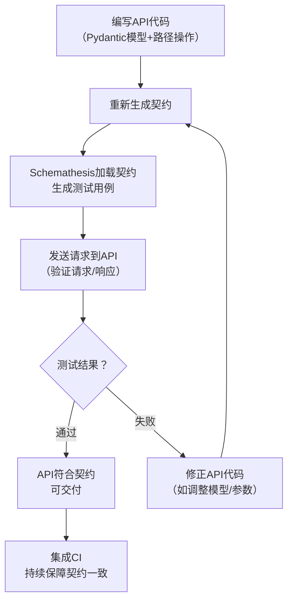

扫描[二维码](https://api2.cmdragon.cn/upload/cmder/20250304_012821924.jpg)
关注或者微信搜一搜：`编程智域 前端至全栈交流与成长`

[发现1000+提升效率与开发的AI工具和实用程序](https://tools.cmdragon.cn/zh/apps?category=ai_chat)：https://tools.cmdragon.cn/

### 一、契约测试：API交互的「合同」保障

#### 1.1 什么是契约测试？

契约测试（Contract Testing）是一种验证**API提供者**（如FastAPI服务）与**消费者**
（如前端、其他微服务）之间交互一致性的测试方法。它的核心是一份「契约」——定义了API的请求格式、响应结构、参数约束等规则，双方必须严格遵守。  
打个比方：你去餐厅吃饭，菜单（契约）上写着「番茄鸡蛋面」包含番茄、鸡蛋、面条（规则）。如果厨师端上来的面没有鸡蛋（违反契约），你可以拒绝付款——契约测试就是这个「检查菜单与实际菜品是否一致」的过程。

#### 1.2 契约测试的核心价值

- **减少协作成本**：前端无需等待后端开发完成，可直接根据契约Mock数据开发；
- **提前发现问题**：避免因API修改（如新增/删除字段）导致消费者崩溃；
- **明确责任边界**：若测试失败，可快速定位是提供者（API不符合契约）还是消费者（调用不符合契约）的问题。

#### 1.3  FastAPI中的契约定位

在FastAPI中，**契约不是手动写的**——框架会通过「类型注解+Pydantic模型+路径操作」自动生成**OpenAPI规范**（即`/openapi.json`
），这份规范就是天然的「契约」。这意味着：  
你写的API代码=契约定义，无需额外维护两份文档，从根源避免「文档与代码不一致」的问题。

### 二、OpenAPI规范：FastAPI的「契约DNA」

#### 2.1  FastAPI如何自动生成OpenAPI？

FastAPI的「魔法」在于**通过代码自动推导规范**。举个简单例子：

```python
from fastapi import FastAPI
from pydantic import BaseModel

app = FastAPI()


class Item(BaseModel):
    name: str  # 必填字符串
    price: float  # 必填浮点数
    is_offer: bool = None  # 可选布尔值


@app.post("/items/")
def create_item(item: Item):  # 请求体为Item模型
    return {"item_name": item.name, "item_price": item.price}
```

FastAPI会自动生成以下OpenAPI信息：

- **路径**：`/items/`，方法`POST`；
- **请求体**：需符合`Item`模型（`name`必填、`price`必填、`is_offer`可选）；
- **响应**：返回包含`item_name`和`item_price`的JSON。

你可以通过`http://localhost:8000/openapi.json`查看完整规范，或通过`http://localhost:8000/docs`查看可视化文档（Swagger UI）。

#### 2.2  OpenAPI规范的核心要素

一份完整的OpenAPI规范包含以下关键部分（对应FastAPI代码）：
| 规范要素 | FastAPI实现方式 | 作用 |
|----------------|-----------------------------------|-----------------------------------|
| 路径（Paths） | `@app.get("/items/{item_id}")`    | 定义API的访问路径和HTTP方法 |
| 参数（Parameters） | `item_id: int = Path(..., ge=1)` | 定义路径/查询/Header参数的约束 |
| 请求体（Request Body） | `item: Item` | 用Pydantic模型定义请求数据结构 |
| 响应（Responses） | `response_model=Item` | 用Pydantic模型定义响应数据结构 |
| 模式（Schemas） | Pydantic模型（如`Item`） | 定义数据的类型、约束（如`min_length`） |

### 三、契约测试与OpenAPI的协同实践

#### 3.1  协同逻辑：用OpenAPI做「契约源」

契约测试的核心是「验证API行为符合契约」，而FastAPI的OpenAPI规范就是**最准确的契约源**。整个流程可总结为：  
`API代码 → 自动生成OpenAPI契约 → 契约测试工具（如Schemathesis） → 验证API是否符合契约`

#### 3.2  工具选择：Schemathesis

Schemathesis是FastAPI生态中最常用的契约测试工具，它能：

- 自动加载OpenAPI规范；
- 生成覆盖所有路径、参数、响应的测试用例；
- 验证请求/响应是否符合契约；
- 集成到Pytest和CI流程。

#### 3.3  实践步骤：从0到1做契约测试

我们以「用户管理API」为例，完整演示契约测试的流程。

##### 3.3.1  步骤1：编写API代码（生成契约）

首先创建`main.py`，实现用户的「创建」和「查询」功能：

```python
from fastapi import FastAPI, HTTPException
from pydantic import BaseModel, EmailStr, Field
from typing import Optional

# 1. 初始化FastAPI应用（自动生成OpenAPI）
app = FastAPI(title="用户管理API", version="1.0.0")

# 模拟数据库（替换为真实数据库即可）
fake_db = []


# 2. 定义请求/响应模型（Pydantic）
class UserCreate(BaseModel):
    """创建用户的请求模型（消费者需遵守的请求格式）"""
    name: str = Field(..., min_length=2, max_length=50, description="用户名，2-50字符")
    email: EmailStr = Field(..., description="合法邮箱")
    age: Optional[int] = Field(None, ge=0, le=120, description="年龄，0-120岁")


class User(UserCreate):
    """查询用户的响应模型（提供者需遵守的响应格式）"""
    id: int = Field(..., description="用户唯一ID")


# 3. 定义路径操作（自动生成OpenAPI的路径、参数、响应）
@app.post("/users/", response_model=User, status_code=201, summary="创建用户")
def create_user(user_in: UserCreate):
    """创建新用户，返回包含ID的用户信息"""
    # 生成自增ID（模拟数据库操作）
    user_id = len(fake_db) + 1
    # 构造响应数据（严格遵循User模型）
    user = User(id=user_id, **user_in.model_dump())
    fake_db.append(user)
    return user


@app.get("/users/{user_id}", response_model=User, summary="查询用户")
def get_user(user_id: int):
    """根据ID查询用户，未找到返回404"""
    for user in fake_db:
        if user.id == user_id:
            return user
    raise HTTPException(status_code=404, detail="用户未找到")
```

**关键说明**：

- `response_model=User`：强制要求响应数据严格符合`User`模型（过滤额外字段、保证必填字段存在）；
- `model_dump()`：Pydantic 2.x的方法（替代旧版`dict()`），确保返回数据与模型一致；
- 路径参数`user_id: int`：FastAPI会自动验证类型（若传入字符串，返回422错误）。

##### 3.3.2  步骤2：编写契约测试代码

创建`test_contract.py`，用Schemathesis和Pytest实现契约测试：

```python
import pytest
from schemathesis import from_asgi
from main import app

# 1. 加载FastAPI的OpenAPI规范（契约源）
# 注意：`/openapi.json`是FastAPI默认的规范路径
schema = from_asgi("/openapi.json", app)


# 2. 编写契约测试用例
@pytest.mark.asyncio  # Schemathesis的call_asgi是异步方法，需加此装饰器
@schema.parametrize()  # 自动生成所有测试用例（覆盖所有路径、参数、响应）
async def test_contract_compliance(case):
    """验证API是否符合OpenAPI契约"""
    # 发送请求到API（用FastAPI的ASGI接口，无需启动服务）
    response = await case.call_asgi(app=app)
    # 验证响应是否符合契约（如字段类型、必填项、响应码）
    case.validate_response(response)
```

##### 3.3.3  步骤3：运行测试并查看结果

安装依赖（确保版本最新）：

```bash
pip install fastapi==0.104.1 pydantic==2.5.2 schemathesis==3.17.0 pytest==7.4.3 uvicorn==0.24.0.post1
```

运行测试：

```bash
pytest test_contract.py -v
```

**预期结果**：

- 对于`/users/`的POST请求：验证请求体符合`UserCreate`、响应符合`User`；
- 对于`/users/{user_id}`的GET请求：验证路径参数`user_id`是整数、响应符合`User`或404；
- 若测试通过，输出`PASSED`；若失败，输出具体错误（如「响应缺少`id`字段」）。

##### 3.3.4  步骤4：集成CI（持续保障契约一致）

将契约测试集成到GitHub Actions（或GitLab CI），确保每次代码提交都自动运行测试：

```yaml
# .github/workflows/contract-test.yml
name: 契约测试
on: [ push, pull_request ]  # 推送或PR时触发
jobs:
  test:
    runs-on: ubuntu-latest
    steps:
      - uses: actions/checkout@v4
      - name: 安装Python
        uses: actions/setup-python@v5
        with:
          python-version: "3.11"
      - name: 安装依赖
        run: pip install -r requirements.txt
      - name: 运行契约测试
        run: pytest test_contract.py -v
```

### 四、课后Quiz：巩固核心知识点

#### 问题1：在FastAPI中，契约测试的「契约源」是什么？为什么它比手动写契约更可靠？

**答案解析**：  
契约源是FastAPI自动生成的**OpenAPI规范**。  
可靠性原因：OpenAPI由API代码推导而来（类型注解、Pydantic模型、路径操作），完全同步代码逻辑——手动写契约容易出现「文档与代码不一致」，而自动生成则避免了这个问题。

#### 问题2：当Schemathesis测试失败，提示「Response schema mismatch: missing required field 'id'」，可能的原因是什么？如何解决？

**答案解析**：

- 原因：API的响应缺少`id`字段，违反了`User`模型的契约（`id`是必填字段）；
- 解决步骤：
    1. 检查路径操作的`response_model`是否设置为`User`（如`@app.post("/users/", response_model=User)`）；
    2. 检查返回值是否用`User`模型构造（如`return User(id=user_id, **user_in.model_dump())`）；
    3. 避免直接返回字典（如`return {"name": "张三"}`），需用Pydantic模型保证字段完整。

### 五、常见报错与解决方案

#### 报错1：「422 Validation Error」（请求参数不符合契约）

- **原因**：消费者发送的请求不符合Pydantic模型的约束（如`name`长度不足2字符、`email`格式错误）；
- **解决**：
    1. 检查请求参数是否符合`UserCreate`模型的定义；
    2. 用FastAPI的`/docs`调试（输入参数后，文档会提示错误）；
    3. 确保消费者使用`application/json`格式发送请求。

#### 报错2：「Response schema mismatch」（响应不符合契约）

- **原因**：API返回的响应不符合`response_model`的定义（如缺少`id`字段、`age`类型是字符串）；
- **解决**：
    1. 检查路径操作的`response_model`是否正确（如`User`而非`UserCreate`）；
    2. 用`User(**data)`构造返回值（而非直接返回字典）；
    3. 禁止返回额外字段（如`return User(..., extra_field="xxx")`会被Pydantic过滤）。

#### 报错3：「OpenAPI schema not found at /openapi.json」

- **原因**：Schemathesis无法加载OpenAPI规范（如FastAPI应用未正确初始化）；
- **解决**：
    1. 确保`app = FastAPI()`正确初始化；
    2. 检查`from_asgi`的路径是否为`"/openapi.json"`（FastAPI默认路径）；
    3. 若用测试客户端，需确保应用处于运行状态（如`with TestClient(app) as client:`）。

### 六、流程图：契约测试的完整流程



余下文章内容请点击跳转至 个人博客页面 或者 扫码关注或者微信搜一搜：`编程智域 前端至全栈交流与成长`
，阅读完整的文章：[FastAPI如何用契约测试确保API的「菜单」与「菜品」一致？](https://blog.cmdragon.cn/posts/02b0c96842d1481c72dab63a149ce0dd/)


<details>
<summary>往期文章归档</summary>

- [为什么TDD能让你的FastAPI开发飞起来？ - cmdragon's Blog](https://blog.cmdragon.cn/posts/c9c1e3bb0fdc15303b9b3b1f20124b0b/)
- [如何用FastAPI玩转多模块测试与异步任务，让代码不再“闹脾气”？ - cmdragon's Blog](https://blog.cmdragon.cn/posts/ddbfa0447a5d0d6f9af12e7a6b206f70/)
- [如何在FastAPI中玩转“时光倒流”的数据库事务回滚测试？](https://blog.cmdragon.cn/posts/bf9883a75ffa46b523a03b16ec56ce48/)
- [如何在FastAPI中优雅地模拟多模块集成测试？ - cmdragon's Blog](https://blog.cmdragon.cn/posts/be553dbd5d51835d2c69553f4a773e2d/)
- [多环境配置切换机制能否让开发与生产无缝衔接？ - cmdragon's Blog](https://blog.cmdragon.cn/posts/533874f5700b8506d4c68781597db659/)
- [如何在 FastAPI 中巧妙覆盖依赖注入并拦截第三方服务调用？ - cmdragon's Blog](https://blog.cmdragon.cn/posts/2d992ef9e8962dc0a4a0b5348d486114/)
- [为什么你的单元测试需要Mock数据库才能飞起来？ - cmdragon's Blog](https://blog.cmdragon.cn/posts/6e69c0eedd8b1e5a74a148d36c85d7ce/)
- [如何在FastAPI中巧妙隔离依赖项，让单元测试不再头疼？ - cmdragon's Blog](https://blog.cmdragon.cn/posts/77ae327dc941b0e74ecc6a8794c084d0/)
- [如何在FastAPI中巧妙隔离依赖项，让单元测试不再头疼？ - cmdragon's Blog](https://blog.cmdragon.cn/posts/77ae327dc941b0e74ecc6a8794c084d0/)
- [测试覆盖率不够高？这些技巧让你的FastAPI测试无懈可击！ - cmdragon's Blog](https://blog.cmdragon.cn/posts/0577d0e24f48b3153b510e74d3d1a822/)
- [为什么你的FastAPI测试覆盖率总是低得让人想哭？ - cmdragon's Blog](https://blog.cmdragon.cn/posts/985c18ca802f1b6da828b92e082b4d4e/)
- [如何让FastAPI测试不再成为你的噩梦？ - cmdragon's Blog](https://blog.cmdragon.cn/posts/29858a7a10d20b4e4649cb75fb422eab/)
- [FastAPI测试环境配置的秘诀，你真的掌握了吗？ - cmdragon's Blog](https://blog.cmdragon.cn/posts/6f9e71e8313db6de8c1431877a70b67e/)
- [全链路追踪如何让FastAPI微服务架构的每个请求都无所遁形？ - cmdragon's Blog](https://blog.cmdragon.cn/posts/30e1d2fbf1ad8123eaf0e1e0dbe7c675/)
- [如何在API高并发中玩转资源隔离与限流策略？ - cmdragon's Blog](https://blog.cmdragon.cn/posts/4ad4ec1dbd80bcf5670fb397ca7cc68c/)
- [任务分片执行模式如何让你的FastAPI性能飙升？ - cmdragon's Blog](https://blog.cmdragon.cn/posts/c6a598639f6a831e9e82e171b8d71857/)
- [冷热任务分离：是提升Web性能的终极秘籍还是技术噱头？ - cmdragon's Blog](https://blog.cmdragon.cn/posts/9c3dc7767a9282f7ef02daad42539f2c/)
- [如何让FastAPI在百万级任务处理中依然游刃有余？ - cmdragon's Blog](https://blog.cmdragon.cn/posts/469aae0e0f88c642ed8bc82e102b960b/)
- [如何让FastAPI与消息队列的联姻既甜蜜又可靠？ - cmdragon's Blog](https://blog.cmdragon.cn/posts/1bebb53f4d9d6fbd0ecbba97562c07b0/)
- [如何在FastAPI中巧妙实现延迟队列，让任务乖乖等待？ - cmdragon's Blog](https://blog.cmdragon.cn/posts/174450702d9e609a072a7d1aaa84750b/)
- [FastAPI的死信队列处理机制：为何你的消息系统需要它？ - cmdragon's Blog](https://blog.cmdragon.cn/posts/047b08957a0d617a87b72da6c3131e5d/)
- [如何让FastAPI任务系统在失败时自动告警并自我修复？ - cmdragon's Blog](https://blog.cmdragon.cn/posts/2f104637ecc916e906c002fa79ab8c80/)
- [如何用Prometheus和FastAPI打造任务监控的“火眼金睛”？ - cmdragon's Blog](https://blog.cmdragon.cn/posts/e7464e5b4d558ede1a7413fa0a2f96f3/)
- [如何用APScheduler和FastAPI打造永不宕机的分布式定时任务系统？ - cmdragon's Blog](https://blog.cmdragon.cn/posts/51a0ff47f509fb6238150a96f551b317/)
- [如何在 FastAPI 中玩转 APScheduler，让任务定时自动执行？ - cmdragon's Blog](https://blog.cmdragon.cn/posts/85564dd901c6d9b1a79d320970843caa/)
- [定时任务系统如何让你的Web应用自动完成那些烦人的重复工作？ - cmdragon's Blog](https://blog.cmdragon.cn/posts/2b27950aab76203a1af4e9e3deda8699/)
- [Celery任务监控的魔法背后藏着什么秘密？ - cmdragon's Blog](https://blog.cmdragon.cn/posts/f43335725bb3372ebc774db1b9f28d2d/)
- [如何让Celery任务像VIP客户一样享受优先待遇？ - cmdragon's Blog](https://blog.cmdragon.cn/posts/c24491a7ac7f7c5e9cf77596ebb27c51/)
- [如何让你的FastAPI Celery Worker在压力下优雅起舞？ - cmdragon's Blog](https://blog.cmdragon.cn/posts/c3129f4b424d2ed2330484b82ec31875/)
- [FastAPI与Celery的完美邂逅，如何让异步任务飞起来？ - cmdragon's Blog](https://blog.cmdragon.cn/posts/b79c2c1805fe9b1ea28326b5b8f3b709/)
- [FastAPI消息持久化与ACK机制：如何确保你的任务永不迷路？ - cmdragon's Blog](https://blog.cmdragon.cn/posts/13a59846aaab71b44ab6f3dadc5b5ec7/)
- [FastAPI的BackgroundTasks如何玩转生产者-消费者模式？ - cmdragon's Blog](https://blog.cmdragon.cn/posts/1549a6bd7e47e7006e7ba8f52bcfe8eb/)
- [BackgroundTasks 还是 RabbitMQ？你的异步任务到底该选谁？ - cmdragon's Blog](https://blog.cmdragon.cn/posts/d26fdc150ff9dd70c7482381ff4c77c4/)
- [BackgroundTasks与Celery：谁才是异步任务的终极赢家？ - cmdragon's Blog](https://blog.cmdragon.cn/posts/792cac4ce6eb96b5001da15b0d52ef83/)
- [如何在 FastAPI 中优雅处理后台任务异常并实现智能重试？ - cmdragon's Blog](https://blog.cmdragon.cn/posts/d5c1d2efbaf6fe4c9e13acc6be6d929a/)
- [BackgroundTasks 如何巧妙驾驭多任务并发？ - cmdragon's Blog](https://blog.cmdragon.cn/posts/8661dc74944bd6fb28092e90d4060161/)
- [如何让FastAPI后台任务像多米诺骨牌一样井然有序地执行？ - cmdragon's Blog](https://blog.cmdragon.cn/posts/7693d3430a6256c2abefc1e4aba21a4a/)

</details>


<details>
<summary>免费好用的热门在线工具</summary>

- [歌词生成工具 - 应用商店 | By cmdragon](https://tools.cmdragon.cn/zh/apps/lyrics-generator)
- [网盘资源聚合搜索 - 应用商店 | By cmdragon](https://tools.cmdragon.cn/zh/apps/cloud-drive-search)
- [ASCII字符画生成器 - 应用商店 | By cmdragon](https://tools.cmdragon.cn/zh/apps/ascii-art-generator)
- [JSON Web Tokens 工具 - 应用商店 | By cmdragon](https://tools.cmdragon.cn/zh/apps/jwt-tool)
- [Bcrypt 密码工具 - 应用商店 | By cmdragon](https://tools.cmdragon.cn/zh/apps/bcrypt-tool)
- [GIF 合成器 - 应用商店 | By cmdragon](https://tools.cmdragon.cn/zh/apps/gif-composer)
- [GIF 分解器 - 应用商店 | By cmdragon](https://tools.cmdragon.cn/zh/apps/gif-decomposer)
- [文本隐写术 - 应用商店 | By cmdragon](https://tools.cmdragon.cn/zh/apps/text-steganography)
- [CMDragon 在线工具 - 高级AI工具箱与开发者套件 | 免费好用的在线工具](https://tools.cmdragon.cn/zh)
- [应用商店 - 发现1000+提升效率与开发的AI工具和实用程序 | 免费好用的在线工具](https://tools.cmdragon.cn/zh/apps?category=trending)
- [CMDragon 更新日志 - 最新更新、功能与改进 | 免费好用的在线工具](https://tools.cmdragon.cn/zh/changelog)
- [支持我们 - 成为赞助者 | 免费好用的在线工具](https://tools.cmdragon.cn/zh/sponsor)
- [AI文本生成图像 - 应用商店 | 免费好用的在线工具](https://tools.cmdragon.cn/zh/apps/text-to-image-ai)
- [临时邮箱 - 应用商店 | 免费好用的在线工具](https://tools.cmdragon.cn/zh/apps/temp-email)
- [二维码解析器 - 应用商店 | 免费好用的在线工具](https://tools.cmdragon.cn/zh/apps/qrcode-parser)
- [文本转思维导图 - 应用商店 | 免费好用的在线工具](https://tools.cmdragon.cn/zh/apps/text-to-mindmap)
- [正则表达式可视化工具 - 应用商店 | 免费好用的在线工具](https://tools.cmdragon.cn/zh/apps/regex-visualizer)
- [文件隐写工具 - 应用商店 | 免费好用的在线工具](https://tools.cmdragon.cn/zh/apps/steganography-tool)
- [IPTV 频道探索器 - 应用商店 | 免费好用的在线工具](https://tools.cmdragon.cn/zh/apps/iptv-explorer)
- [快传 - 应用商店 | 免费好用的在线工具](https://tools.cmdragon.cn/zh/apps/snapdrop)
- [随机抽奖工具 - 应用商店 | 免费好用的在线工具](https://tools.cmdragon.cn/zh/apps/lucky-draw)
- [动漫场景查找器 - 应用商店 | 免费好用的在线工具](https://tools.cmdragon.cn/zh/apps/anime-scene-finder)
- [时间工具箱 - 应用商店 | 免费好用的在线工具](https://tools.cmdragon.cn/zh/apps/time-toolkit)
- [网速测试 - 应用商店 | 免费好用的在线工具](https://tools.cmdragon.cn/zh/apps/speed-test)
- [AI 智能抠图工具 - 应用商店 | 免费好用的在线工具](https://tools.cmdragon.cn/zh/apps/background-remover)
- [背景替换工具 - 应用商店 | 免费好用的在线工具](https://tools.cmdragon.cn/zh/apps/background-replacer)
- [艺术二维码生成器 - 应用商店 | 免费好用的在线工具](https://tools.cmdragon.cn/zh/apps/artistic-qrcode)
- [Open Graph 元标签生成器 - 应用商店 | 免费好用的在线工具](https://tools.cmdragon.cn/zh/apps/open-graph-generator)
- [图像对比工具 - 应用商店 | 免费好用的在线工具](https://tools.cmdragon.cn/zh/apps/image-comparison)
- [图片压缩专业版 - 应用商店 | 免费好用的在线工具](https://tools.cmdragon.cn/zh/apps/image-compressor)
- [密码生成器 - 应用商店 | 免费好用的在线工具](https://tools.cmdragon.cn/zh/apps/password-generator)
- [SVG优化器 - 应用商店 | 免费好用的在线工具](https://tools.cmdragon.cn/zh/apps/svg-optimizer)
- [调色板生成器 - 应用商店 | 免费好用的在线工具](https://tools.cmdragon.cn/zh/apps/color-palette)
- [在线节拍器 - 应用商店 | 免费好用的在线工具](https://tools.cmdragon.cn/zh/apps/online-metronome)
- [IP归属地查询 - 应用商店 | 免费好用的在线工具](https://tools.cmdragon.cn/zh/apps/ip-geolocation)
- [CSS网格布局生成器 - 应用商店 | 免费好用的在线工具](https://tools.cmdragon.cn/zh/apps/css-grid-layout)
- [邮箱验证工具 - 应用商店 | 免费好用的在线工具](https://tools.cmdragon.cn/zh/apps/email-validator)
- [书法练习字帖 - 应用商店 | 免费好用的在线工具](https://tools.cmdragon.cn/zh/apps/calligraphy-practice)
- [金融计算器套件 - 应用商店 | 免费好用的在线工具](https://tools.cmdragon.cn/zh/apps/finance-calculator-suite)
- [中国亲戚关系计算器 - 应用商店 | 免费好用的在线工具](https://tools.cmdragon.cn/zh/apps/chinese-kinship-calculator)
- [Protocol Buffer 工具箱 - 应用商店 | 免费好用的在线工具](https://tools.cmdragon.cn/zh/apps/protobuf-toolkit)
- [IP归属地查询 - 应用商店 | 免费好用的在线工具](https://tools.cmdragon.cn/zh/apps/ip-geolocation)
- [图片无损放大 - 应用商店 | 免费好用的在线工具](https://tools.cmdragon.cn/zh/apps/image-upscaler)
- [文本比较工具 - 应用商店 | 免费好用的在线工具](https://tools.cmdragon.cn/zh/apps/text-compare)
- [IP批量查询工具 - 应用商店 | 免费好用的在线工具](https://tools.cmdragon.cn/zh/apps/ip-batch-lookup)
- [域名查询工具 - 应用商店 | 免费好用的在线工具](https://tools.cmdragon.cn/zh/apps/domain-finder)
- [DNS工具箱 - 应用商店 | 免费好用的在线工具](https://tools.cmdragon.cn/zh/apps/dns-toolkit)
- [网站图标生成器 - 应用商店 | 免费好用的在线工具](https://tools.cmdragon.cn/zh/apps/favicon-generator)
- [XML Sitemap](https://tools.cmdragon.cn/sitemap_index.xml)

</details>