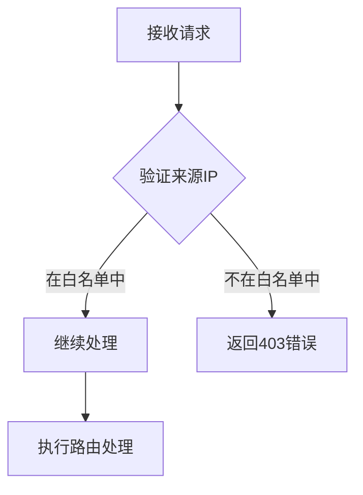
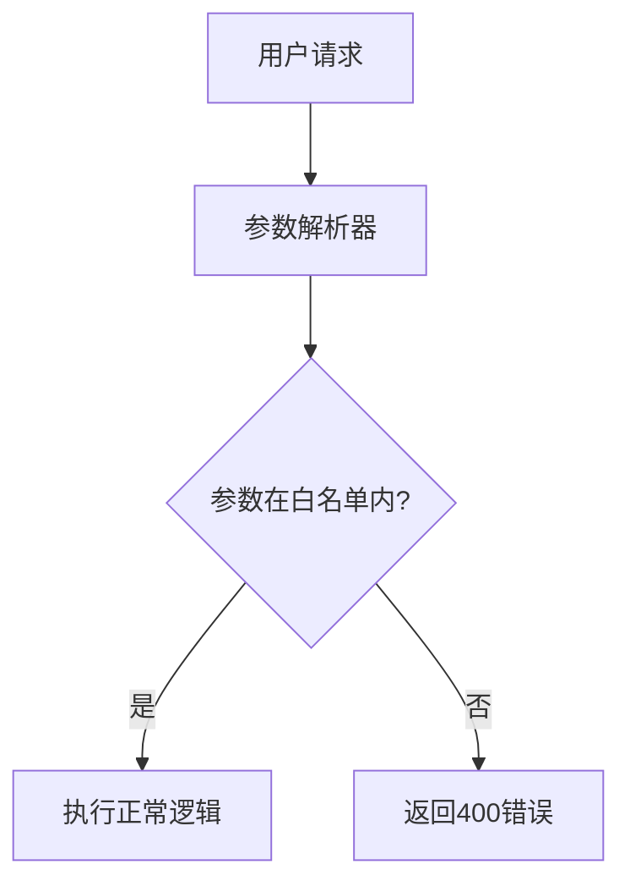
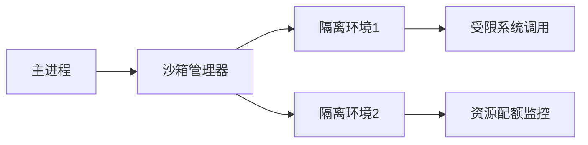

扫描[二维码](https://api2.cmdragon.cn/upload/cmder/20250304_012821924.jpg)
关注或者微信搜一搜：`编程智域 前端至全栈交流与成长`

[发现1000+提升效率与开发的AI工具和实用程序](https://tools.cmdragon.cn/zh/apps?category=ai_chat)：https://tools.cmdragon.cn/

# 一、查询白名单机制

## 1.1 核心原理

FastAPI的查询白名单通过中间件实现请求过滤，其工作流程包含三个关键阶段：



## 1.2 实现方案

安装依赖：

```bash
pip install fastapi==0.68.0 uvicorn==0.15.0 pydantic==1.10.7
```

基础实现代码：

```python
from fastapi import FastAPI, Request, status
from fastapi.responses import JSONResponse

app = FastAPI()

TRUSTED_IPS = {"192.168.1.0/24", "10.0.0.5"}


@app.middleware("http")
async def whitelist_middleware(request: Request, call_next):
    client_ip = request.client.host
    if not any(client_ip in network for network in TRUSTED_IPS):
        return JSONResponse(
            status_code=status.HTTP_403_FORBIDDEN,
            content={"detail": "IP未授权"}
        )
    return await call_next(request)


@app.get("/api/data")
async def get_data():
    return {"data": "敏感信息"}
```

## 1.3 应用场景

1. 内部管理系统接口
2. 物联网设备通信端点
3. 金融交易处理接口
4. 医疗数据查询接口

## 2.1 查询白名单的实现原理

查询白名单机制通过预定义允许的参数范围，有效防止非法参数注入。其核心原理如图1所示：



FastAPI 通过依赖注入系统实现参数校验，结合 Pydantic 模型可构建动态白名单。以下是最新实践方案：

```python
from fastapi import FastAPI, Query
from pydantic import BaseModel, Field

app = FastAPI()


class QueryParams(BaseModel):
    category: str = Field(..., regex="^(book|movie|music)$")
    sort_by: str = Field(None, regex="^(date|views|rating)$")


@app.get("/search")
async def search(params: QueryParams = Depends()):
    # 实际业务逻辑
    return {"status": "valid parameters"}
```

关键实现要素：

1. 使用 Pydantic Field 定义参数正则表达式约束
2. 通过 Depends() 实现依赖注入
3. 自动生成 OpenAPI 文档验证规则

# 二、安全沙箱机制

## 2.1 执行隔离原理

安全沙箱架构示意图：



## 2.2 沙箱实现

安装额外依赖：

```bash
pip install docker==5.0.3 pyjwt==2.3.0
```

安全代码执行示例：

```python
from docker import DockerClient
from fastapi import HTTPException

docker_client = DockerClient(base_url='unix://var/run/docker.sock')


def safe_execute(code: str):
    try:
        container = docker_client.containers.run(
            "python:3.9-slim",
            ["python", "-c", code],
            mem_limit="100m",
            network_mode="none",
            read_only=True,
            auto_remove=True
        )
        return container.logs().decode()
    except Exception as e:
        raise HTTPException(500, f"执行错误: {str(e)}")
```

## 2.3 配置参数说明

| 参数           | 值      | 安全作用    |
|--------------|--------|---------|
| mem_limit    | 100m   | 内存使用限制  |
| network_mode | none   | 禁用网络访问  |
| read_only    | True   | 文件系统只读  |
| cpu_period   | 100000 | CPU时间配额 |

# 三、课后Quiz

1. 当白名单配置为192.168.1.0/24时，下列哪个IP会被允许访问？
   A) 192.168.2.5 B) 192.168.1.128 C) 10.0.0.1
   **答案**：B。CIDR表示法/24对应子网掩码255.255.255.0

2. 沙箱环境中设置network_mode=none的主要作用是？
   A) 加速网络传输 B) 防止数据泄露 C) 降低延迟
   **答案**：B。完全禁用容器网络访问可防止敏感数据外泄

# 四、常见报错处理

## 4.1 403 Forbidden

**现象**：合法IP被拒绝访问  
**检查步骤**：

1. 验证客户端真实IP（注意代理服务器影响）
2. 检查CIDR格式是否正确
3. 使用ipcalc工具验证IP范围

## 4.2 沙箱超时错误

**解决方案**：

```python
# 添加执行超时限制
container = docker_client.containers.run(
    ...,
    stop_timeout=30  # 30秒超时
)
```

## 4.3 内存分配错误

**预防建议**：

1. 设置memory_swap参数防止内存交换
2. 添加内存使用监控：

```python
import psutil


def check_memory():
    if psutil.virtual_memory().percent > 90:
        raise ResourceWarning("内存使用过高")
```

余下文章内容请点击跳转至 个人博客页面 或者 扫码关注或者微信搜一搜：`编程智域 前端至全栈交流与成长`
，阅读完整的文章：[FastAPI的查询白名单和安全沙箱机制如何确保你的API坚不可摧？](https://blog.cmdragon.cn/posts/ca141239cfc5c0d510960acd266de9cd/)

## 往期文章归档：

- [如何在 FastAPI 中玩转 GraphQL 性能监控与 APM 集成？ - cmdragon's Blog](https://blog.cmdragon.cn/posts/52fe9ea73b0e26de308ae0e539df21d2/)
- [如何在 FastAPI 中玩转 GraphQL 和 WebSocket 的实时数据推送魔法？ - cmdragon's Blog](https://blog.cmdragon.cn/posts/ae484cf6bcf3f44fd8392a8272e57db4/)
- [如何在FastAPI中玩转GraphQL联邦架构，让数据源手拉手跳探戈？ - cmdragon's Blog](https://blog.cmdragon.cn/posts/9b9086ff5d8464b0810cfb55f7768513/)
- [GraphQL批量查询优化：DataLoader如何让数据库访问速度飞起来？ - cmdragon's Blog](https://blog.cmdragon.cn/posts/0e236dbe717bde52bda290e89f4f6eca/)
- [如何在FastAPI中整合GraphQL的复杂度与限流？ - cmdragon's Blog](https://blog.cmdragon.cn/posts/ace8bb3f01589994f51d748ab5c73652/)
- [GraphQL错误处理为何让你又爱又恨？FastAPI中间件能否成为你的救星？ - cmdragon's Blog](https://blog.cmdragon.cn/posts/a28d5c1b32feadb18b406a849455dfe5/)
- [FastAPI遇上GraphQL：异步解析器如何让API性能飙升？ - cmdragon's Blog](https://blog.cmdragon.cn/posts/35fced261e8ff834e68e07c93902cc13/)
- [GraphQL的N+1问题如何被DataLoader巧妙化解？ - cmdragon's Blog](https://blog.cmdragon.cn/posts/72629304782a121fbf89b151c436f9aa/)
- [FastAPI与GraphQL的完美邂逅：如何打造高效API？ - cmdragon's Blog](https://blog.cmdragon.cn/posts/fb5c5c7b00bbe57b3a5346b8ee5bc289/)
- [GraphQL类型系统如何让FastAPI开发更高效？ - cmdragon's Blog](https://blog.cmdragon.cn/posts/31c152e531e1cbe5b5cfe15e7ff053c9/)
- [REST和GraphQL究竟谁才是API设计的终极赢家？ - cmdragon's Blog](https://blog.cmdragon.cn/posts/218ad2370eab6197f42fdc9c52f0fc19/)
- [IoT设备的OTA升级是如何通过MQTT协议实现无缝对接的？ - cmdragon's Blog](https://blog.cmdragon.cn/posts/071e9a3b9792beea63f134f5ad28df67/)
- [如何在FastAPI中玩转STOMP协议升级，让你的消息传递更高效？ - cmdragon's Blog](https://blog.cmdragon.cn/posts/16744b2f460346805c45314bc0c6f751/)
- [如何用WebSocket打造毫秒级实时协作系统？ - cmdragon's Blog](https://blog.cmdragon.cn/posts/da5b64cb0ded23e4d5b1f19ffd5ac53d/)
- [如何用WebSocket打造毫秒级实时协作系统？ - cmdragon's Blog](https://blog.cmdragon.cn/posts/da5b64cb0ded23e4d5b1f19ffd5ac53d/)
- [如何让你的WebSocket连接既安全又高效？](https://blog.cmdragon.cn/posts/eb598d50b76ea1823746ab7cdf49ce05/)
- [如何让多客户端会话管理不再成为你的技术噩梦？ - cmdragon's Blog](https://blog.cmdragon.cn/posts/08ba771dbb2eec087c4bc6dc584113c5/)
- [如何在FastAPI中玩转WebSocket消息处理？](https://blog.cmdragon.cn/posts/fbf7d6843e430133547057254deb2dfb/)
- [如何在FastAPI中玩转WebSocket，让实时通信不再烦恼？ - cmdragon's Blog](https://blog.cmdragon.cn/posts/0faebb0f6c2b1bde4ba75869f4f67b76/)
- [WebSocket与HTTP协议究竟有何不同？FastAPI如何让长连接变得如此简单？ - cmdragon's Blog](https://blog.cmdragon.cn/posts/903448c85701a6a747fc9a4417e2bdc8/)
- [FastAPI如何玩转安全防护，让黑客望而却步？](https://blog.cmdragon.cn/posts/c1314c623211c9269f36053179a53d5c/)
- [如何用三层防护体系打造坚不可摧的 API 安全堡垒？ - cmdragon's Blog](https://blog.cmdragon.cn/posts/0bbb4a455ef36bf6f81ac97189586fda/#%E4%B8%80jwt-%E8%AE%A4%E8%AF%81%E8%81%94%E8%B0%83%E6%96%B9%E6%A1%88)
- [FastAPI安全加固：密钥轮换、限流策略与安全头部如何实现三重防护？ - cmdragon's Blog](https://blog.cmdragon.cn/posts/f96ba438de34dc197fd2598f91ae133d/)
- [如何在FastAPI中巧妙玩转数据脱敏，让敏感信息安全无忧？ - cmdragon's Blog](https://blog.cmdragon.cn/posts/045021f8831a03bcdf71e44cb793baf4/)
- [RBAC权限模型如何让API访问控制既安全又灵活？ - cmdragon's Blog](https://blog.cmdragon.cn/posts/9f01e838545ae8d34016c759ef461423/)
- [FastAPI中的敏感数据如何在不泄露的情况下翩翩起舞？](https://blog.cmdragon.cn/posts/88e8615e4c961e7a4f0ef31c0e41cb0b/)
- [FastAPI安全认证的终极秘籍：OAuth2与JWT如何完美融合？ - cmdragon's Blog](https://blog.cmdragon.cn/posts/17d5c40ff6c84ad652f962fed0ce46ab/)
- [如何在FastAPI中打造坚不可摧的Web安全防线？ - cmdragon's Blog](https://blog.cmdragon.cn/posts/9d6200ae7ce0a1a1a523591e3d65a82e/)
- [如何用 FastAPI 和 RBAC 打造坚不可摧的安全堡垒？ - cmdragon's Blog](https://blog.cmdragon.cn/posts/d878b5dbef959058b8098551c70594f8/)
- [FastAPI权限配置：你的系统真的安全吗？ - cmdragon's Blog](https://blog.cmdragon.cn/posts/96b6ede65030daa4613ab92da1d739a6/#%E5%BE%80%E6%9C%9F%E6%96%87%E7%AB%A0%E5%BD%92%E6%A1%A3)
- [FastAPI权限缓存：你的性能瓶颈是否藏在这只“看不见的手”里？ | cmdragon's Blog](https://blog.cmdragon.cn/posts/0c8c5a3fdaf69250ac3db7429b102625/)
- [FastAPI日志审计：你的权限系统是否真的安全无虞？ | cmdragon's Blog](https://blog.cmdragon.cn/posts/84bf7b11b342415bddb50e0521c64dfe/)
- [如何在FastAPI中打造坚不可摧的安全防线？ | cmdragon's Blog](https://blog.cmdragon.cn/posts/e2ec1e31dd5d97e0f32d2125385fd955/)
- [如何在FastAPI中实现权限隔离并让用户乖乖听话？ | cmdragon's Blog](https://blog.cmdragon.cn/posts/74777546a240b16b32196e5eb29ec8f7/)
- [如何在FastAPI中玩转权限控制与测试，让代码安全又优雅？ | cmdragon's Blog](https://blog.cmdragon.cn/posts/9dd24a9753ba15f98f24c1e5134fe40e/)
- [如何在FastAPI中打造一个既安全又灵活的权限管理系统？ | cmdragon's Blog](https://blog.cmdragon.cn/posts/277aa1628a2fa9855cdfe5f7c302bd92/)
- [FastAPI访问令牌的权限声明与作用域管理：你的API安全真的无懈可击吗？ | cmdragon's Blog](https://blog.cmdragon.cn/posts/82bae833ad460aec0965cc77b7d6f652/)

## 免费好用的热门在线工具

- [ASCII字符画生成器 - 应用商店 | By cmdragon](https://tools.cmdragon.cn/zh/apps/ascii-art-generator)
- [JSON Web Tokens 工具 - 应用商店 | By cmdragon](https://tools.cmdragon.cn/zh/apps/jwt-tool)
- [Bcrypt 密码工具 - 应用商店 | By cmdragon](https://tools.cmdragon.cn/zh/apps/bcrypt-tool)
- [GIF 合成器 - 应用商店 | By cmdragon](https://tools.cmdragon.cn/zh/apps/gif-composer)
- [GIF 分解器 - 应用商店 | By cmdragon](https://tools.cmdragon.cn/zh/apps/gif-decomposer)
- [文本隐写术 - 应用商店 | By cmdragon](https://tools.cmdragon.cn/zh/apps/text-steganography)
- [CMDragon 在线工具 - 高级AI工具箱与开发者套件 | 免费好用的在线工具](https://tools.cmdragon.cn/zh)
- [应用商店 - 发现1000+提升效率与开发的AI工具和实用程序 | 免费好用的在线工具](https://tools.cmdragon.cn/zh/apps?category=trending)
- [CMDragon 更新日志 - 最新更新、功能与改进 | 免费好用的在线工具](https://tools.cmdragon.cn/zh/changelog)
- [支持我们 - 成为赞助者 | 免费好用的在线工具](https://tools.cmdragon.cn/zh/sponsor)
- [AI文本生成图像 - 应用商店 | 免费好用的在线工具](https://tools.cmdragon.cn/zh/apps/text-to-image-ai)
- [临时邮箱 - 应用商店 | 免费好用的在线工具](https://tools.cmdragon.cn/zh/apps/temp-email)
- [二维码解析器 - 应用商店 | 免费好用的在线工具](https://tools.cmdragon.cn/zh/apps/qrcode-parser)
- [文本转思维导图 - 应用商店 | 免费好用的在线工具](https://tools.cmdragon.cn/zh/apps/text-to-mindmap)
- [正则表达式可视化工具 - 应用商店 | 免费好用的在线工具](https://tools.cmdragon.cn/zh/apps/regex-visualizer)
- [文件隐写工具 - 应用商店 | 免费好用的在线工具](https://tools.cmdragon.cn/zh/apps/steganography-tool)
- [IPTV 频道探索器 - 应用商店 | 免费好用的在线工具](https://tools.cmdragon.cn/zh/apps/iptv-explorer)
- [快传 - 应用商店 | 免费好用的在线工具](https://tools.cmdragon.cn/zh/apps/snapdrop)
- [随机抽奖工具 - 应用商店 | 免费好用的在线工具](https://tools.cmdragon.cn/zh/apps/lucky-draw)
- [动漫场景查找器 - 应用商店 | 免费好用的在线工具](https://tools.cmdragon.cn/zh/apps/anime-scene-finder)
- [时间工具箱 - 应用商店 | 免费好用的在线工具](https://tools.cmdragon.cn/zh/apps/time-toolkit)
- [网速测试 - 应用商店 | 免费好用的在线工具](https://tools.cmdragon.cn/zh/apps/speed-test)
- [AI 智能抠图工具 - 应用商店 | 免费好用的在线工具](https://tools.cmdragon.cn/zh/apps/background-remover)
- [背景替换工具 - 应用商店 | 免费好用的在线工具](https://tools.cmdragon.cn/zh/apps/background-replacer)
- [艺术二维码生成器 - 应用商店 | 免费好用的在线工具](https://tools.cmdragon.cn/zh/apps/artistic-qrcode)
- [Open Graph 元标签生成器 - 应用商店 | 免费好用的在线工具](https://tools.cmdragon.cn/zh/apps/open-graph-generator)
- [图像对比工具 - 应用商店 | 免费好用的在线工具](https://tools.cmdragon.cn/zh/apps/image-comparison)
- [图片压缩专业版 - 应用商店 | 免费好用的在线工具](https://tools.cmdragon.cn/zh/apps/image-compressor)
- [密码生成器 - 应用商店 | 免费好用的在线工具](https://tools.cmdragon.cn/zh/apps/password-generator)
- [SVG优化器 - 应用商店 | 免费好用的在线工具](https://tools.cmdragon.cn/zh/apps/svg-optimizer)
- [调色板生成器 - 应用商店 | 免费好用的在线工具](https://tools.cmdragon.cn/zh/apps/color-palette)
- [在线节拍器 - 应用商店 | 免费好用的在线工具](https://tools.cmdragon.cn/zh/apps/online-metronome)
- [IP归属地查询 - 应用商店 | 免费好用的在线工具](https://tools.cmdragon.cn/zh/apps/ip-geolocation)
- [CSS网格布局生成器 - 应用商店 | 免费好用的在线工具](https://tools.cmdragon.cn/zh/apps/css-grid-layout)
- [邮箱验证工具 - 应用商店 | 免费好用的在线工具](https://tools.cmdragon.cn/zh/apps/email-validator)
- [书法练习字帖 - 应用商店 | 免费好用的在线工具](https://tools.cmdragon.cn/zh/apps/calligraphy-practice)
- [金融计算器套件 - 应用商店 | 免费好用的在线工具](https://tools.cmdragon.cn/zh/apps/finance-calculator-suite)
- [中国亲戚关系计算器 - 应用商店 | 免费好用的在线工具](https://tools.cmdragon.cn/zh/apps/chinese-kinship-calculator)
- [Protocol Buffer 工具箱 - 应用商店 | 免费好用的在线工具](https://tools.cmdragon.cn/zh/apps/protobuf-toolkit)
- [IP归属地查询 - 应用商店 | 免费好用的在线工具](https://tools.cmdragon.cn/zh/apps/ip-geolocation)
- [图片无损放大 - 应用商店 | 免费好用的在线工具](https://tools.cmdragon.cn/zh/apps/image-upscaler)
- [文本比较工具 - 应用商店 | 免费好用的在线工具](https://tools.cmdragon.cn/zh/apps/text-compare)
- [IP批量查询工具 - 应用商店 | 免费好用的在线工具](https://tools.cmdragon.cn/zh/apps/ip-batch-lookup)
- [域名查询工具 - 应用商店 | 免费好用的在线工具](https://tools.cmdragon.cn/zh/apps/domain-finder)
- [DNS工具箱 - 应用商店 | 免费好用的在线工具](https://tools.cmdragon.cn/zh/apps/dns-toolkit)
- [网站图标生成器 - 应用商店 | 免费好用的在线工具](https://tools.cmdragon.cn/zh/apps/favicon-generator)
- [XML Sitemap](https://tools.cmdragon.cn/sitemap_index.xml)