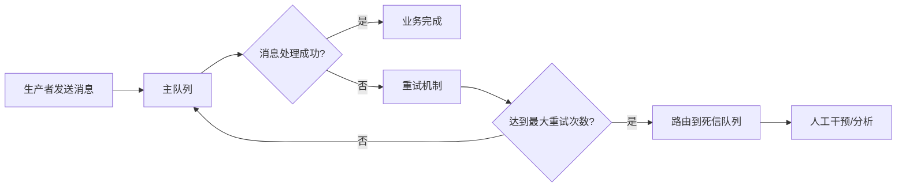
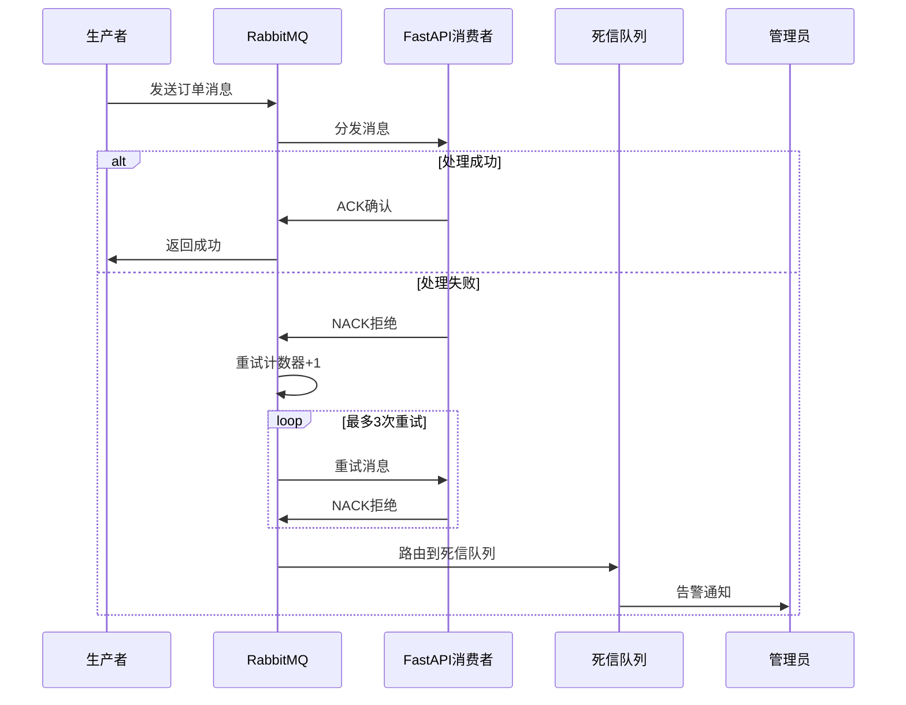

扫描[二维码](https://api2.cmdragon.cn/upload/cmder/20250304_012821924.jpg)
关注或者微信搜一搜：`编程智域 前端至全栈交流与成长`

[发现1000+提升效率与开发的AI工具和实用程序](https://tools.cmdragon.cn/zh/apps?category=ai_chat)：https://tools.cmdragon.cn/

### 1. 死信队列核心概念

死信队列（Dead Letter Queue, DLQ）是消息系统中用于处理"失败消息"的特殊队列。当消息满足特定条件时（如重试次数超限、格式错误等），会被自动路由到死信队列，避免阻塞主业务流程。

#### 1.1 为什么需要死信队列？



#### 1.2 触发死信的典型场景

- ❌ **消息拒收**：消费者明确拒绝且不重入队列
- ⏱️ **TTL过期**：消息存活时间超限
- 🔢 **队列满**：队列达到长度限制
- 🔄 **重试耗尽**：消息重投递超过预设次数

### 2. FastAPI + RabbitMQ 死信实现

实现示例：

#### 2.1 安装依赖

```bash
pip install fastapi==0.110.1 uvicorn==0.29.0 pika==1.3.2 pydantic==2.6.4
```

#### 2.2 Pydantic 消息模型

```python
from pydantic import BaseModel, field_validator


class OrderMessage(BaseModel):
    order_id: str
    product: str
    quantity: int

    @field_validator("quantity")
    def validate_quantity(cls, v):
        if v <= 0:
            raise ValueError("Quantity must be positive")
        return v
```

#### 2.3 死信队列配置

```python
import pika


def setup_queues():
    connection = pika.BlockingConnection(
        pika.ConnectionParameters("localhost")
    )
    channel = connection.channel()

    # 死信交换机和队列
    channel.exchange_declare(exchange="dlx", exchange_type="direct")
    channel.queue_declare(queue="dead_letters")
    channel.queue_bind(queue="dead_letters", exchange="dlx", routing_key="dead")

    # 主队列绑定死信配置
    args = {
        "x-dead-letter-exchange": "dlx",  # 死信交换机
        "x-dead-letter-routing-key": "dead",  # 路由键
        "x-max-retries": 3  # 最大重试次数
    }
    channel.queue_declare(queue="orders", arguments=args)
```

#### 2.4 FastAPI 消费者服务

```python
from fastapi import FastAPI, HTTPException

app = FastAPI()


@app.on_event("startup")
async def init_mq():
    setup_queues()  # 初始化队列


@app.post("/process-order")
async def process_order(message: dict):
    try:
        # Pydantic 验证
        valid_msg = OrderMessage(**message)

        # 模拟业务处理（实际场景可能调用数据库等）
        if valid_msg.product == "invalid_product":
            raise ValueError("Unsupported product")

        return {"status": "processed"}

    except Exception as e:
        # 捕获所有异常，触发死信路由
        raise HTTPException(
            status_code=400,
            detail={
                "error": str(e),
                "original_msg": message
            }
        )
```

#### 2.5 死信处理工作流



### 3. 课后 Quiz

**问题 1**  
当消费者返回 NACK 时，以下哪个参数控制最大重试次数？  
A) `x-max-length`  
B) `x-message-ttl`  
C) `x-max-retries`  
D) `x-dead-letter-exchange`

**问题 2**  
使用 Pydantic 验证消息时，如何确保数值字段为正数？

<details>
<summary>查看答案与解析</summary>

**答案 1: C**  
`x-max-retries` 是自定义参数，用于控制消息的最大重试次数，超出后自动路由到死信队列

**答案 2**  
使用 Pydantic 的字段验证器：

```python
@field_validator("quantity")
def validate_quantity(cls, v):
    if v <= 0:
        raise ValueError("Quantity must be positive")
    return v
```

验证失败会触发异常，最终导致消息进入死信队列
</details>

### 4. 常见报错解决方案

#### 🚨 报错 1：`pika.exceptions.ChannelClosedByBroker: (406, 'PRECONDITION_FAILED - invalid arg 'x-max-retries'`

**原因**：RabbitMQ 不识别自定义参数  
**解决**：

1. 启用 RabbitMQ 特性标志：
   ```bash
   rabbitmqctl eval 'rabbit_registry:load("/usr/lib/rabbitmq/etc/rabbitmq.conf")'
   ```
2. 在 `advanced.config` 添加：

```erlang
[
  {rabbit, [
    {custom_queues_args, [<<"x-max-retries">>]}
  ]}
]
```

#### 🚨 报错 2：`pydantic_core._pydantic_core.ValidationError: 1 validation error for OrderMessage`

**原因**：消息格式违反 Pydantic 模型规则  
**预防建议**：

1. 生产者在发送前做预验证
2. 在模型中添加详细错误信息：

```python
class OrderMessage(BaseModel):
    quantity: int = Field(..., description="Must be positive integer")
    model_config = ConfigDict(
        json_schema_extra={
            "example": {"order_id": "xyz", "product": "book", "quantity": 1}
        }
    )
```

---

以上内容可直接运行于以下环境：

- Python 3.10+
- RabbitMQ 3.12+
- 使用命令启动服务：`uvicorn main:app --reload`

余下文章内容请点击跳转至 个人博客页面 或者 扫码关注或者微信搜一搜：`编程智域 前端至全栈交流与成长`
，阅读完整的文章：[FastAPI的死信队列处理机制：为何你的消息系统需要它？](https://blog.cmdragon.cn/posts/047b08957a0d617a87b72da6c3131e5d/)


<details>
<summary>往期文章归档</summary>

- [如何让FastAPI任务系统在失败时自动告警并自我修复？ - cmdragon's Blog](https://blog.cmdragon.cn/posts/2f104637ecc916e906c002fa79ab8c80/)
- [如何用Prometheus和FastAPI打造任务监控的“火眼金睛”？ - cmdragon's Blog](https://blog.cmdragon.cn/posts/e7464e5b4d558ede1a7413fa0a2f96f3/)
- [如何用APScheduler和FastAPI打造永不宕机的分布式定时任务系统？ - cmdragon's Blog](https://blog.cmdragon.cn/posts/51a0ff47f509fb6238150a96f551b317/)
- [如何在 FastAPI 中玩转 APScheduler，让任务定时自动执行？ - cmdragon's Blog](https://blog.cmdragon.cn/posts/85564dd901c6d9b1a79d320970843caa/)
- [定时任务系统如何让你的Web应用自动完成那些烦人的重复工作？ - cmdragon's Blog](https://blog.cmdragon.cn/posts/2b27950aab76203a1af4e9e3deda8699/)
- [Celery任务监控的魔法背后藏着什么秘密？ - cmdragon's Blog](https://blog.cmdragon.cn/posts/f43335725bb3372ebc774db1b9f28d2d/)
- [如何让Celery任务像VIP客户一样享受优先待遇？ - cmdragon's Blog](https://blog.cmdragon.cn/posts/c24491a7ac7f7c5e9cf77596ebb27c51/)
- [如何让你的FastAPI Celery Worker在压力下优雅起舞？ - cmdragon's Blog](https://blog.cmdragon.cn/posts/c3129f4b424d2ed2330484b82ec31875/)
- [FastAPI与Celery的完美邂逅，如何让异步任务飞起来？ - cmdragon's Blog](https://blog.cmdragon.cn/posts/b79c2c1805fe9b1ea28326b5b8f3b709/)
- [FastAPI消息持久化与ACK机制：如何确保你的任务永不迷路？ - cmdragon's Blog](https://blog.cmdragon.cn/posts/13a59846aaab71b44ab6f3dadc5b5ec7/)
- [FastAPI的BackgroundTasks如何玩转生产者-消费者模式？ - cmdragon's Blog](https://blog.cmdragon.cn/posts/1549a6bd7e47e7006e7ba8f52bcfe8eb/)
- [BackgroundTasks 还是 RabbitMQ？你的异步任务到底该选谁？ - cmdragon's Blog](https://blog.cmdragon.cn/posts/d26fdc150ff9dd70c7482381ff4c77c4/)
- [BackgroundTasks与Celery：谁才是异步任务的终极赢家？ - cmdragon's Blog](https://blog.cmdragon.cn/posts/792cac4ce6eb96b5001da15b0d52ef83/)
- [如何在 FastAPI 中优雅处理后台任务异常并实现智能重试？ - cmdragon's Blog](https://blog.cmdragon.cn/posts/d5c1d2efbaf6fe4c9e13acc6be6d929a/)
- [BackgroundTasks 如何巧妙驾驭多任务并发？ - cmdragon's Blog](https://blog.cmdragon.cn/posts/8661dc74944bd6fb28092e90d4060161/)
- [如何让FastAPI后台任务像多米诺骨牌一样井然有序地执行？ - cmdragon's Blog](https://blog.cmdragon.cn/posts/7693d3430a6256c2abefc1e4aba21a4a/)
- [FastAPI后台任务：是时候让你的代码飞起来了吗？ - cmdragon's Blog](https://blog.cmdragon.cn/posts/6145d88d5154d5cd38cee7ddc2d46e1d/)
- [FastAPI后台任务为何能让邮件发送如此丝滑？ - cmdragon's Blog](https://blog.cmdragon.cn/posts/19241679a1852122f740391cbdc21bae/)
- [FastAPI的请求-响应周期为何需要后台任务分离？ - cmdragon's Blog](https://blog.cmdragon.cn/posts/c7b54d6b3b6b5041654e69e5610bf3b9/)
- [如何在FastAPI中让后台任务既高效又不会让你的应用崩溃？ - cmdragon's Blog](https://blog.cmdragon.cn/posts/5ad8d0a4c8f2d05e9c1a42d828aad7b3/)
- [FastAPI后台任务：异步魔法还是同步噩梦？ - cmdragon's Blog](https://blog.cmdragon.cn/posts/6a69eca9fd14ba8f6fa41502c5014edd/)
- [如何在FastAPI中玩转Schema版本管理和灰度发布？ - cmdragon's Blog](https://blog.cmdragon.cn/posts/6d9d20cd8d8528da4193f13aaf98575c/)
- [FastAPI的查询白名单和安全沙箱机制如何确保你的API坚不可摧？ - cmdragon's Blog](https://blog.cmdragon.cn/posts/ca141239cfc5c0d510960acd266de9cd/)
- [如何在 FastAPI 中玩转 GraphQL 性能监控与 APM 集成？ - cmdragon's Blog](https://blog.cmdragon.cn/posts/52fe9ea73b0e26de308ae0e539df21d2/)
- [如何在 FastAPI 中玩转 GraphQL 和 WebSocket 的实时数据推送魔法？ - cmdragon's Blog](https://blog.cmdragon.cn/posts/ae484cf6bcf3f44fd8392a8272e57db4/)
- [如何在FastAPI中玩转GraphQL联邦架构，让数据源手拉手跳探戈？ - cmdragon's Blog](https://blog.cmdragon.cn/posts/9b9086ff5d8464b0810cfb55f7768513/)
- [GraphQL批量查询优化：DataLoader如何让数据库访问速度飞起来？ - cmdragon's Blog](https://blog.cmdragon.cn/posts/0e236dbe717bde52bda290e89f4f6eca/)
- [如何在FastAPI中整合GraphQL的复杂度与限流？ - cmdragon's Blog](https://blog.cmdragon.cn/posts/ace8bb3f01589994f51d748ab5c73652/)
- [GraphQL错误处理为何让你又爱又恨？FastAPI中间件能否成为你的救星？ - cmdragon's Blog](https://blog.cmdragon.cn/posts/a28d5c1b32feadb18b406a849455dfe5/)
- [FastAPI遇上GraphQL：异步解析器如何让API性能飙升？ - cmdragon's Blog](https://blog.cmdragon.cn/posts/35fced261e8ff834e68e07c93902cc13/)
- [GraphQL的N+1问题如何被DataLoader巧妙化解？ - cmdragon's Blog](https://blog.cmdragon.cn/posts/72629304782a121fbf89b151c436f9aa/)
- [FastAPI与GraphQL的完美邂逅：如何打造高效API？ - cmdragon's Blog](https://blog.cmdragon.cn/posts/fb5c5c7b00bbe57b3a5346b8ee5bc289/)
- [GraphQL类型系统如何让FastAPI开发更高效？ - cmdragon's Blog](https://blog.cmdragon.cn/posts/31c152e531e1cbe5b5cfe15e7ff053c9/)
- [REST和GraphQL究竟谁才是API设计的终极赢家？ - cmdragon's Blog](https://blog.cmdragon.cn/posts/218ad2370eab6197f42fdc9c52f0fc19/)
- [IoT设备的OTA升级是如何通过MQTT协议实现无缝对接的？ - cmdragon's Blog](https://blog.cmdragon.cn/posts/071e9a3b9792beea63f134f5ad28df67/)
- [如何在FastAPI中玩转STOMP协议升级，让你的消息传递更高效？ - cmdragon's Blog](https://blog.cmdragon.cn/posts/16744b2f460346805c45314bc0c6f751/)
- [如何用WebSocket打造毫秒级实时协作系统？ - cmdragon's Blog](https://blog.cmdragon.cn/posts/da5b64cb0ded23e4d5b1f19ffd5ac53d/)

</details>


<details>
<summary>免费好用的热门在线工具</summary>

- [ASCII字符画生成器 - 应用商店 | By cmdragon](https://tools.cmdragon.cn/zh/apps/ascii-art-generator)
- [JSON Web Tokens 工具 - 应用商店 | By cmdragon](https://tools.cmdragon.cn/zh/apps/jwt-tool)
- [Bcrypt 密码工具 - 应用商店 | By cmdragon](https://tools.cmdragon.cn/zh/apps/bcrypt-tool)
- [GIF 合成器 - 应用商店 | By cmdragon](https://tools.cmdragon.cn/zh/apps/gif-composer)
- [GIF 分解器 - 应用商店 | By cmdragon](https://tools.cmdragon.cn/zh/apps/gif-decomposer)
- [文本隐写术 - 应用商店 | By cmdragon](https://tools.cmdragon.cn/zh/apps/text-steganography)
- [CMDragon 在线工具 - 高级AI工具箱与开发者套件 | 免费好用的在线工具](https://tools.cmdragon.cn/zh)
- [应用商店 - 发现1000+提升效率与开发的AI工具和实用程序 | 免费好用的在线工具](https://tools.cmdragon.cn/zh/apps?category=trending)
- [CMDragon 更新日志 - 最新更新、功能与改进 | 免费好用的在线工具](https://tools.cmdragon.cn/zh/changelog)
- [支持我们 - 成为赞助者 | 免费好用的在线工具](https://tools.cmdragon.cn/zh/sponsor)
- [AI文本生成图像 - 应用商店 | 免费好用的在线工具](https://tools.cmdragon.cn/zh/apps/text-to-image-ai)
- [临时邮箱 - 应用商店 | 免费好用的在线工具](https://tools.cmdragon.cn/zh/apps/temp-email)
- [二维码解析器 - 应用商店 | 免费好用的在线工具](https://tools.cmdragon.cn/zh/apps/qrcode-parser)
- [文本转思维导图 - 应用商店 | 免费好用的在线工具](https://tools.cmdragon.cn/zh/apps/text-to-mindmap)
- [正则表达式可视化工具 - 应用商店 | 免费好用的在线工具](https://tools.cmdragon.cn/zh/apps/regex-visualizer)
- [文件隐写工具 - 应用商店 | 免费好用的在线工具](https://tools.cmdragon.cn/zh/apps/steganography-tool)
- [IPTV 频道探索器 - 应用商店 | 免费好用的在线工具](https://tools.cmdragon.cn/zh/apps/iptv-explorer)
- [快传 - 应用商店 | 免费好用的在线工具](https://tools.cmdragon.cn/zh/apps/snapdrop)
- [随机抽奖工具 - 应用商店 | 免费好用的在线工具](https://tools.cmdragon.cn/zh/apps/lucky-draw)
- [动漫场景查找器 - 应用商店 | 免费好用的在线工具](https://tools.cmdragon.cn/zh/apps/anime-scene-finder)
- [时间工具箱 - 应用商店 | 免费好用的在线工具](https://tools.cmdragon.cn/zh/apps/time-toolkit)
- [网速测试 - 应用商店 | 免费好用的在线工具](https://tools.cmdragon.cn/zh/apps/speed-test)
- [AI 智能抠图工具 - 应用商店 | 免费好用的在线工具](https://tools.cmdragon.cn/zh/apps/background-remover)
- [背景替换工具 - 应用商店 | 免费好用的在线工具](https://tools.cmdragon.cn/zh/apps/background-replacer)
- [艺术二维码生成器 - 应用商店 | 免费好用的在线工具](https://tools.cmdragon.cn/zh/apps/artistic-qrcode)
- [Open Graph 元标签生成器 - 应用商店 | 免费好用的在线工具](https://tools.cmdragon.cn/zh/apps/open-graph-generator)
- [图像对比工具 - 应用商店 | 免费好用的在线工具](https://tools.cmdragon.cn/zh/apps/image-comparison)
- [图片压缩专业版 - 应用商店 | 免费好用的在线工具](https://tools.cmdragon.cn/zh/apps/image-compressor)
- [密码生成器 - 应用商店 | 免费好用的在线工具](https://tools.cmdragon.cn/zh/apps/password-generator)
- [SVG优化器 - 应用商店 | 免费好用的在线工具](https://tools.cmdragon.cn/zh/apps/svg-optimizer)
- [调色板生成器 - 应用商店 | 免费好用的在线工具](https://tools.cmdragon.cn/zh/apps/color-palette)
- [在线节拍器 - 应用商店 | 免费好用的在线工具](https://tools.cmdragon.cn/zh/apps/online-metronome)
- [IP归属地查询 - 应用商店 | 免费好用的在线工具](https://tools.cmdragon.cn/zh/apps/ip-geolocation)
- [CSS网格布局生成器 - 应用商店 | 免费好用的在线工具](https://tools.cmdragon.cn/zh/apps/css-grid-layout)
- [邮箱验证工具 - 应用商店 | 免费好用的在线工具](https://tools.cmdragon.cn/zh/apps/email-validator)
- [书法练习字帖 - 应用商店 | 免费好用的在线工具](https://tools.cmdragon.cn/zh/apps/calligraphy-practice)
- [金融计算器套件 - 应用商店 | 免费好用的在线工具](https://tools.cmdragon.cn/zh/apps/finance-calculator-suite)
- [中国亲戚关系计算器 - 应用商店 | 免费好用的在线工具](https://tools.cmdragon.cn/zh/apps/chinese-kinship-calculator)
- [Protocol Buffer 工具箱 - 应用商店 | 免费好用的在线工具](https://tools.cmdragon.cn/zh/apps/protobuf-toolkit)
- [IP归属地查询 - 应用商店 | 免费好用的在线工具](https://tools.cmdragon.cn/zh/apps/ip-geolocation)
- [图片无损放大 - 应用商店 | 免费好用的在线工具](https://tools.cmdragon.cn/zh/apps/image-upscaler)
- [文本比较工具 - 应用商店 | 免费好用的在线工具](https://tools.cmdragon.cn/zh/apps/text-compare)
- [IP批量查询工具 - 应用商店 | 免费好用的在线工具](https://tools.cmdragon.cn/zh/apps/ip-batch-lookup)
- [域名查询工具 - 应用商店 | 免费好用的在线工具](https://tools.cmdragon.cn/zh/apps/domain-finder)
- [DNS工具箱 - 应用商店 | 免费好用的在线工具](https://tools.cmdragon.cn/zh/apps/dns-toolkit)
- [网站图标生成器 - 应用商店 | 免费好用的在线工具](https://tools.cmdragon.cn/zh/apps/favicon-generator)
- [XML Sitemap](https://tools.cmdragon.cn/sitemap_index.xml)

</details>