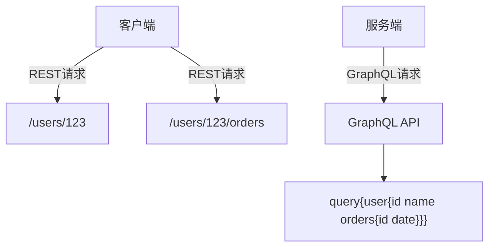
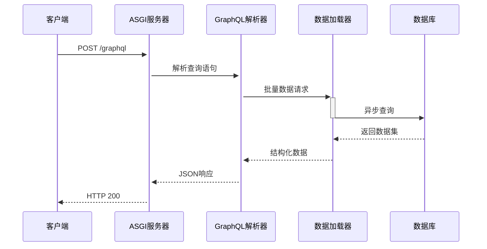

扫描[二维码](https://api2.cmdragon.cn/upload/cmder/20250304_012821924.jpg)
关注或者微信搜一搜：`编程智域 前端至全栈交流与成长`

[发现1000+提升效率与开发的AI工具和实用程序](https://tools.cmdragon.cn/zh/apps?category=ai_chat)：https://tools.cmdragon.cn/

1. GraphQL与RESTful API对比分析  
   通过对比REST的固定端点与GraphQL的单一智能端点，理解为何现代API开发更倾向选择GraphQL。当客户端请求用户数据及其订单记录时：



REST需要两次请求获取关联数据，而GraphQL通过嵌套查询单次获取，减少网络开销的同时避免数据冗余。

2. FastAPI集成GraphQL的技术原理  
   FastAPI通过Starlette中间件实现GraphQL路由挂载，核心处理流程包含四个关键阶段：



3. 异步解析器开发模式详解  
   使用Python 3.11的async/await语法实现高效IO操作，示例用户数据解析器：

```python
# 环境依赖：python3.11 fastapi==0.95.0 graphene==3.2.0 uvicorn==0.21.1
from graphene import ObjectType, String, Field, List
from pydantic import BaseModel


class UserModel(BaseModel):
    id: int
    name: str
    email: str = None  # 可选字段标注


class Query(ObjectType):
    get_users = List(UserModel)

    async def resolve_get_users(self, info):
        # 模拟异步数据库查询
        async def fetch_db():
            return [{'id': 1, 'name': 'Alice'}, {'id': 2, 'name': 'Bob'}]

        raw_data = await fetch_db()
        return [UserModel(**item) for item in raw_data]
```

4. N+1查询优化策略  
   通过DataLoader实现批量加载机制，将多个离散请求合并为单个批量操作：

```python
from promise import Promise
from promise.dataloader import DataLoader


class UserLoader(DataLoader):
    async def batch_load_fn(self, keys):
        # keys是用户ID列表如[1,2,3]
        async with AsyncSession() as session:
            stmt = select(User).where(User.id.in_(keys))
            result = await session.execute(stmt)
            users = result.scalars().all()
            user_map = {u.id: u for u in users}
            return [user_map.get(k) for k in keys]
```

5. 课后Quiz  
   问题：当GraphQL查询包含多层嵌套时，如何避免数据库查询风暴？  
   答案：采用DataLoader批量加载机制，通过缓存和请求合并技术。例如用户查询及其订单记录时，DataLoader会将所有需要的用户ID收集后执行单次IN查询，而非为每个用户单独查询。

6. 常见报错解决方案  
   报错现象：  
   `"message": "Cannot return null for non-nullable field User.email"`

原因分析：

- 数据库记录缺少email字段
- 权限设置禁止返回该字段

解决步骤：

1. 检查schema定义是否包含`required=True`标注
2. 验证数据源是否包含该字段
3. 在解析器中添加字段级权限校验

预防建议：

```python
class UserType(ObjectType):
    email = String(required=False)  # 显式声明可选性
```

余下文章内容请点击跳转至 个人博客页面 或者 扫码关注或者微信搜一搜：`编程智域 前端至全栈交流与成长`
，阅读完整的文章：[GraphQL为何能成为现代API开发的首选？](https://blog.cmdragon.cn/posts/35fced261e8ff834e68e07c93902cc13/)

## 往期文章归档：

- [GraphQL的N+1问题如何被DataLoader巧妙化解？ - cmdragon's Blog](https://blog.cmdragon.cn/posts/72629304782a121fbf89b151c436f9aa/)
- [FastAPI与GraphQL的完美邂逅：如何打造高效API？ - cmdragon's Blog](https://blog.cmdragon.cn/posts/fb5c5c7b00bbe57b3a5346b8ee5bc289/)
- [GraphQL类型系统如何让FastAPI开发更高效？ - cmdragon's Blog](https://blog.cmdragon.cn/posts/31c152e531e1cbe5b5cfe15e7ff053c9/)
- [REST和GraphQL究竟谁才是API设计的终极赢家？ - cmdragon's Blog](https://blog.cmdragon.cn/posts/218ad2370eab6197f42fdc9c52f0fc19/)
- [IoT设备的OTA升级是如何通过MQTT协议实现无缝对接的？ - cmdragon's Blog](https://blog.cmdragon.cn/posts/071e9a3b9792beea63f134f5ad28df67/)
- [如何在FastAPI中玩转STOMP协议升级，让你的消息传递更高效？ - cmdragon's Blog](https://blog.cmdragon.cn/posts/16744b2f460346805c45314bc0c6f751/)
- [如何用WebSocket打造毫秒级实时协作系统？ - cmdragon's Blog](https://blog.cmdragon.cn/posts/da5b64cb0ded23e4d5b1f19ffd5ac53d/)
- [如何用WebSocket打造毫秒级实时协作系统？ - cmdragon's Blog](https://blog.cmdragon.cn/posts/da5b64cb0ded23e4d5b1f19ffd5ac53d/)
- [如何让你的WebSocket连接既安全又高效？](https://blog.cmdragon.cn/posts/eb598d50b76ea1823746ab7cdf49ce05/)
- [如何让多客户端会话管理不再成为你的技术噩梦？ - cmdragon's Blog](https://blog.cmdragon.cn/posts/08ba771dbb2eec087c4bc6dc584113c5/)
- [如何在FastAPI中玩转WebSocket消息处理？](https://blog.cmdragon.cn/posts/fbf7d6843e430133547057254deb2dfb/)
- [如何在FastAPI中玩转WebSocket，让实时通信不再烦恼？ - cmdragon's Blog](https://blog.cmdragon.cn/posts/0faebb0f6c2b1bde4ba75869f4f67b76/)
- [WebSocket与HTTP协议究竟有何不同？FastAPI如何让长连接变得如此简单？ - cmdragon's Blog](https://blog.cmdragon.cn/posts/903448c85701a6a747fc9a4417e2bdc8/)
- [FastAPI如何玩转安全防护，让黑客望而却步？](https://blog.cmdragon.cn/posts/c1314c623211c9269f36053179a53d5c/)
- [如何用三层防护体系打造坚不可摧的 API 安全堡垒？ - cmdragon's Blog](https://blog.cmdragon.cn/posts/0bbb4a455ef36bf6f81ac97189586fda/#%E4%B8%80jwt-%E8%AE%A4%E8%AF%81%E8%81%94%E8%B0%83%E6%96%B9%E6%A1%88)
- [FastAPI安全加固：密钥轮换、限流策略与安全头部如何实现三重防护？ - cmdragon's Blog](https://blog.cmdragon.cn/posts/f96ba438de34dc197fd2598f91ae133d/)
- [如何在FastAPI中巧妙玩转数据脱敏，让敏感信息安全无忧？ - cmdragon's Blog](https://blog.cmdragon.cn/posts/045021f8831a03bcdf71e44cb793baf4/)
- [RBAC权限模型如何让API访问控制既安全又灵活？ - cmdragon's Blog](https://blog.cmdragon.cn/posts/9f01e838545ae8d34016c759ef461423/)
- [FastAPI中的敏感数据如何在不泄露的情况下翩翩起舞？](https://blog.cmdragon.cn/posts/88e8615e4c961e7a4f0ef31c0e41cb0b/)
- [FastAPI安全认证的终极秘籍：OAuth2与JWT如何完美融合？ - cmdragon's Blog](https://blog.cmdragon.cn/posts/17d5c40ff6c84ad652f962fed0ce46ab/)
- [如何在FastAPI中打造坚不可摧的Web安全防线？ - cmdragon's Blog](https://blog.cmdragon.cn/posts/9d6200ae7ce0a1a1a523591e3d65a82e/)
- [如何用 FastAPI 和 RBAC 打造坚不可摧的安全堡垒？ - cmdragon's Blog](https://blog.cmdragon.cn/posts/d878b5dbef959058b8098551c70594f8/)
- [FastAPI权限配置：你的系统真的安全吗？ - cmdragon's Blog](https://blog.cmdragon.cn/posts/96b6ede65030daa4613ab92da1d739a6/#%E5%BE%80%E6%9C%9F%E6%96%87%E7%AB%A0%E5%BD%92%E6%A1%A3)
- [FastAPI权限缓存：你的性能瓶颈是否藏在这只“看不见的手”里？ | cmdragon's Blog](https://blog.cmdragon.cn/posts/0c8c5a3fdaf69250ac3db7429b102625/)
- [FastAPI日志审计：你的权限系统是否真的安全无虞？ | cmdragon's Blog](https://blog.cmdragon.cn/posts/84bf7b11b342415bddb50e0521c64dfe/)
- [如何在FastAPI中打造坚不可摧的安全防线？ | cmdragon's Blog](https://blog.cmdragon.cn/posts/e2ec1e31dd5d97e0f32d2125385fd955/)
- [如何在FastAPI中实现权限隔离并让用户乖乖听话？ | cmdragon's Blog](https://blog.cmdragon.cn/posts/74777546a240b16b32196e5eb29ec8f7/)
- [如何在FastAPI中玩转权限控制与测试，让代码安全又优雅？ | cmdragon's Blog](https://blog.cmdragon.cn/posts/9dd24a9753ba15f98f24c1e5134fe40e/)
- [如何在FastAPI中打造一个既安全又灵活的权限管理系统？ | cmdragon's Blog](https://blog.cmdragon.cn/posts/277aa1628a2fa9855cdfe5f7c302bd92/)
- [FastAPI访问令牌的权限声明与作用域管理：你的API安全真的无懈可击吗？ | cmdragon's Blog](https://blog.cmdragon.cn/posts/82bae833ad460aec0965cc77b7d6f652/)
- [如何在FastAPI中构建一个既安全又灵活的多层级权限系统？ | cmdragon's Blog](https://blog.cmdragon.cn/posts/13fc113ef1dff03927d46235ad333a7f/)
- [FastAPI如何用角色权限让Web应用安全又灵活？ | cmdragon's Blog](https://blog.cmdragon.cn/posts/cc7aa0af577ae2bc0694e76886373e12/)
- [FastAPI权限验证依赖项究竟藏着什么秘密？ | cmdragon's Blog](https://blog.cmdragon.cn/posts/3e287e8b907561728ded1be34a19b22c/)
- [如何用FastAPI和Tortoise-ORM打造一个既高效又灵活的角色管理系统？ | cmdragon's Blog](https://blog.cmdragon.cn/posts/2b0a2003074eba56a6f6c57aa9690900/)
- [JWT令牌如何在FastAPI中实现安全又高效的生成与验证？ | cmdragon's Blog](https://blog.cmdragon.cn/posts/031a4b22bb8d624cf23ef593f72d1ec6/)
- [你的密码存储方式是否在向黑客招手？ | cmdragon's Blog](https://blog.cmdragon.cn/posts/5f8821250c5a4e9cc08bd08faef76c77/)

## 免费好用的热门在线工具

- [CMDragon 在线工具 - 高级AI工具箱与开发者套件 | 免费好用的在线工具](https://tools.cmdragon.cn/zh)
- [应用商店 - 发现1000+提升效率与开发的AI工具和实用程序 | 免费好用的在线工具](https://tools.cmdragon.cn/zh/apps?category=trending)
- [CMDragon 更新日志 - 最新更新、功能与改进 | 免费好用的在线工具](https://tools.cmdragon.cn/zh/changelog)
- [支持我们 - 成为赞助者 | 免费好用的在线工具](https://tools.cmdragon.cn/zh/sponsor)
- [AI文本生成图像 - 应用商店 | 免费好用的在线工具](https://tools.cmdragon.cn/zh/apps/text-to-image-ai)
- [临时邮箱 - 应用商店 | 免费好用的在线工具](https://tools.cmdragon.cn/zh/apps/temp-email)
- [二维码解析器 - 应用商店 | 免费好用的在线工具](https://tools.cmdragon.cn/zh/apps/qrcode-parser)
- [文本转思维导图 - 应用商店 | 免费好用的在线工具](https://tools.cmdragon.cn/zh/apps/text-to-mindmap)
- [正则表达式可视化工具 - 应用商店 | 免费好用的在线工具](https://tools.cmdragon.cn/zh/apps/regex-visualizer)
- [文件隐写工具 - 应用商店 | 免费好用的在线工具](https://tools.cmdragon.cn/zh/apps/steganography-tool)
- [IPTV 频道探索器 - 应用商店 | 免费好用的在线工具](https://tools.cmdragon.cn/zh/apps/iptv-explorer)
- [快传 - 应用商店 | 免费好用的在线工具](https://tools.cmdragon.cn/zh/apps/snapdrop)
- [随机抽奖工具 - 应用商店 | 免费好用的在线工具](https://tools.cmdragon.cn/zh/apps/lucky-draw)
- [动漫场景查找器 - 应用商店 | 免费好用的在线工具](https://tools.cmdragon.cn/zh/apps/anime-scene-finder)
- [时间工具箱 - 应用商店 | 免费好用的在线工具](https://tools.cmdragon.cn/zh/apps/time-toolkit)
- [网速测试 - 应用商店 | 免费好用的在线工具](https://tools.cmdragon.cn/zh/apps/speed-test)
- [AI 智能抠图工具 - 应用商店 | 免费好用的在线工具](https://tools.cmdragon.cn/zh/apps/background-remover)
- [背景替换工具 - 应用商店 | 免费好用的在线工具](https://tools.cmdragon.cn/zh/apps/background-replacer)
- [艺术二维码生成器 - 应用商店 | 免费好用的在线工具](https://tools.cmdragon.cn/zh/apps/artistic-qrcode)
- [Open Graph 元标签生成器 - 应用商店 | 免费好用的在线工具](https://tools.cmdragon.cn/zh/apps/open-graph-generator)
- [图像对比工具 - 应用商店 | 免费好用的在线工具](https://tools.cmdragon.cn/zh/apps/image-comparison)
- [图片压缩专业版 - 应用商店 | 免费好用的在线工具](https://tools.cmdragon.cn/zh/apps/image-compressor)
- [密码生成器 - 应用商店 | 免费好用的在线工具](https://tools.cmdragon.cn/zh/apps/password-generator)
- [SVG优化器 - 应用商店 | 免费好用的在线工具](https://tools.cmdragon.cn/zh/apps/svg-optimizer)
- [调色板生成器 - 应用商店 | 免费好用的在线工具](https://tools.cmdragon.cn/zh/apps/color-palette)
- [在线节拍器 - 应用商店 | 免费好用的在线工具](https://tools.cmdragon.cn/zh/apps/online-metronome)
- [IP归属地查询 - 应用商店 | 免费好用的在线工具](https://tools.cmdragon.cn/zh/apps/ip-geolocation)
- [CSS网格布局生成器 - 应用商店 | 免费好用的在线工具](https://tools.cmdragon.cn/zh/apps/css-grid-layout)
- [邮箱验证工具 - 应用商店 | 免费好用的在线工具](https://tools.cmdragon.cn/zh/apps/email-validator)
- [书法练习字帖 - 应用商店 | 免费好用的在线工具](https://tools.cmdragon.cn/zh/apps/calligraphy-practice)
- [金融计算器套件 - 应用商店 | 免费好用的在线工具](https://tools.cmdragon.cn/zh/apps/finance-calculator-suite)
- [中国亲戚关系计算器 - 应用商店 | 免费好用的在线工具](https://tools.cmdragon.cn/zh/apps/chinese-kinship-calculator)
- [Protocol Buffer 工具箱 - 应用商店 | 免费好用的在线工具](https://tools.cmdragon.cn/zh/apps/protobuf-toolkit)
- [IP归属地查询 - 应用商店 | 免费好用的在线工具](https://tools.cmdragon.cn/zh/apps/ip-geolocation)
- [图片无损放大 - 应用商店 | 免费好用的在线工具](https://tools.cmdragon.cn/zh/apps/image-upscaler)
- [文本比较工具 - 应用商店 | 免费好用的在线工具](https://tools.cmdragon.cn/zh/apps/text-compare)
- [IP批量查询工具 - 应用商店 | 免费好用的在线工具](https://tools.cmdragon.cn/zh/apps/ip-batch-lookup)
- [域名查询工具 - 应用商店 | 免费好用的在线工具](https://tools.cmdragon.cn/zh/apps/domain-finder)
- [DNS工具箱 - 应用商店 | 免费好用的在线工具](https://tools.cmdragon.cn/zh/apps/dns-toolkit)
- [网站图标生成器 - 应用商店 | 免费好用的在线工具](https://tools.cmdragon.cn/zh/apps/favicon-generator)
- [XML Sitemap](https://tools.cmdragon.cn/sitemap_index.xml)