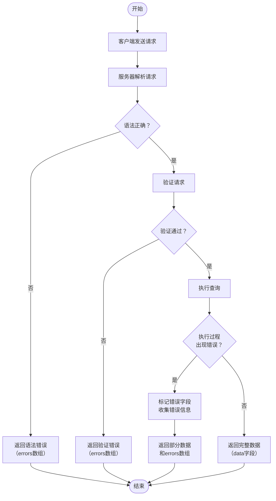

扫描[二维码](https://api2.cmdragon.cn/upload/cmder/20250304_012821924.jpg)
关注或者微信搜一搜：`编程智域 前端至全栈交流与成长`

[发现1000+提升效率与开发的AI工具和实用程序](https://tools.cmdragon.cn/zh/apps?category=ai_chat)：https://tools.cmdragon.cn/


---

## 一、GraphQL错误处理机制解析

### 1.1 错误处理的重要性

在API开发中，错误处理是确保系统可靠性的核心环节。GraphQL特有的错误处理机制与传统REST API相比具有以下优势：

- 错误信息结构化：响应中独立包含`errors`数组字段
- 细粒度控制：支持字段级错误标记
- 错误分类：可区分语法错误、验证错误、执行错误等类型



### 1.2 FastAPI中间件原理

FastAPI基于Starlette中间件系统，采用管道式处理架构：

```python
请求 -> 中间件链 -> 路由处理 -> 中间件链 -> 响应
```

中间件可捕获请求全生命周期的异常，包括未处理的异常和业务逻辑主动抛出的错误。

---

## 二、统一错误处理中间件实现

### 2.1 开发环境配置

```bash
# 安装依赖库
pip install fastapi==0.95.2 
pip install ariadne==0.19.1
pip install uvicorn==0.21.1
```

## 2.2 错误模型定义

```python
from pydantic import BaseModel


class UnifiedError(BaseModel):
    code: int
    message: str
    path: list[str] = []
    extensions: dict = {}
```

### 2.3 中间件实现代码

```python
from ariadne import format_error
from fastapi import Request


async def graphql_error_middleware(request: Request, call_next):
    try:
        response = await call_next(request)
    except Exception as exc:
        error = UnifiedError(
            code=500,
            message="Internal Server Error",
            extensions={"original": str(exc)}
        )
        return JSONResponse(
            status_code=500,
            content={"errors": [error.dict()]}
        )

    if "errors" in response.body:
        errors = json.loads(response.body)["errors"]
        formatted_errors = [format_error(error) for error in errors]
        return JSONResponse(
            content={"errors": formatted_errors},
            status_code=response.status_code
        )
    return response
```

### 2.4 中间件注册

```python
from fastapi import FastAPI

app = FastAPI()
app.add_middleware(BaseHTTPMiddleware, dispatch=graphql_error_middleware)
```

---

## 三、场景化错误处理

### 3.1 验证错误处理

```graphql
{
  user(id: "invalid_id") {
    name
  }
}
```

中间件自动捕获并格式化为：

```json
{
  "errors": [
    {
      "code": 422,
      "message": "ID格式验证失败",
      "path": [
        "user"
      ],
      "extensions": {
        "rule": "uuid_validation"
      }
    }
  ]
}
```

### 3.2 业务异常处理

```python
class InsufficientPermission(Exception):
    def __init__(self, resource: str):
        self.resource = resource


@app.exception_handler(InsufficientPermission)
async def handle_perm_error(request, exc):
    error = UnifiedError(
        code=403,
        message=f"无权限访问资源: {exc.resource}",
        path=request.query_params.get("operationName", "")
    )
    return JSONResponse(
        status_code=403,
        content={"errors": [error.dict()]}
    )
```

---

## 四、常见报错解决方案

### 4.1 422 Validation Error

**现象**：请求参数格式校验失败  
**解决方案**：

1. 检查请求体是否符合GraphQL Schema定义
2. 使用自定义标量类型加强参数验证
3. 在中间件中统一转换验证错误格式

**预防建议**：

```python
from ariadne import ScalarType

datetime_scalar = ScalarType("DateTime")


@datetime_scalar.serializer
def serialize_datetime(value):
    return value.isoformat()
```

---

## 五、课后Quiz

**问题1**：当同时存在多个字段级错误时，中间件如何保证错误路径的准确性？  
**答案解析**：  
通过解析GraphQL响应中的`path`字段，中间件会自动构建错误定位路径。例如`path: ["queryUser", "email"]`表示在`queryUser`
操作的`email`字段发生验证错误。

**问题2**：如何处理第三方服务异常导致的级联错误？  
**答案解析**：

1. 在中间件中设置异常传播拦截
2. 使用`try-except`封装外部服务调用
3. 记录错误上下文到日志系统：

```python
@app.middleware("http")
async def log_errors(request: Request, call_next):
    try:
        return await call_next(request)
    except ExternalServiceError as e:
        logger.error(f"第三方服务异常: {str(e)}")
        raise HTTPException(status_code=503)
```

---

**运行验证**：

```bash
uvicorn main:app --reload
```

测试包含错误条件的GraphQL查询，观察返回的错误格式是否符合UnifiedError模型定义。建议使用Postman或GraphQL Playground进行端到端测试。

余下文章内容请点击跳转至 个人博客页面 或者 扫码关注或者微信搜一搜：`编程智域 前端至全栈交流与成长`
，阅读完整的文章：[GraphQL错误处理为何让你又爱又恨？FastAPI中间件能否成为你的救星？](https://blog.cmdragon.cn/posts/a28d5c1b32feadb18b406a849455dfe5/)

## 往期文章归档：

- [FastAPI遇上GraphQL：异步解析器如何让API性能飙升？ - cmdragon's Blog](https://blog.cmdragon.cn/posts/35fced261e8ff834e68e07c93902cc13/)
- [GraphQL的N+1问题如何被DataLoader巧妙化解？ - cmdragon's Blog](https://blog.cmdragon.cn/posts/72629304782a121fbf89b151c436f9aa/)
- [FastAPI与GraphQL的完美邂逅：如何打造高效API？ - cmdragon's Blog](https://blog.cmdragon.cn/posts/fb5c5c7b00bbe57b3a5346b8ee5bc289/)
- [GraphQL类型系统如何让FastAPI开发更高效？ - cmdragon's Blog](https://blog.cmdragon.cn/posts/31c152e531e1cbe5b5cfe15e7ff053c9/)
- [REST和GraphQL究竟谁才是API设计的终极赢家？ - cmdragon's Blog](https://blog.cmdragon.cn/posts/218ad2370eab6197f42fdc9c52f0fc19/)
- [IoT设备的OTA升级是如何通过MQTT协议实现无缝对接的？ - cmdragon's Blog](https://blog.cmdragon.cn/posts/071e9a3b9792beea63f134f5ad28df67/)
- [如何在FastAPI中玩转STOMP协议升级，让你的消息传递更高效？ - cmdragon's Blog](https://blog.cmdragon.cn/posts/16744b2f460346805c45314bc0c6f751/)
- [如何用WebSocket打造毫秒级实时协作系统？ - cmdragon's Blog](https://blog.cmdragon.cn/posts/da5b64cb0ded23e4d5b1f19ffd5ac53d/)
- [如何用WebSocket打造毫秒级实时协作系统？ - cmdragon's Blog](https://blog.cmdragon.cn/posts/da5b64cb0ded23e4d5b1f19ffd5ac53d/)
- [如何让你的WebSocket连接既安全又高效？](https://blog.cmdragon.cn/posts/eb598d50b76ea1823746ab7cdf49ce05/)
- [如何让多客户端会话管理不再成为你的技术噩梦？ - cmdragon's Blog](https://blog.cmdragon.cn/posts/08ba771dbb2eec087c4bc6dc584113c5/)
- [如何在FastAPI中玩转WebSocket消息处理？](https://blog.cmdragon.cn/posts/fbf7d6843e430133547057254deb2dfb/)
- [如何在FastAPI中玩转WebSocket，让实时通信不再烦恼？ - cmdragon's Blog](https://blog.cmdragon.cn/posts/0faebb0f6c2b1bde4ba75869f4f67b76/)
- [WebSocket与HTTP协议究竟有何不同？FastAPI如何让长连接变得如此简单？ - cmdragon's Blog](https://blog.cmdragon.cn/posts/903448c85701a6a747fc9a4417e2bdc8/)
- [FastAPI如何玩转安全防护，让黑客望而却步？](https://blog.cmdragon.cn/posts/c1314c623211c9269f36053179a53d5c/)
- [如何用三层防护体系打造坚不可摧的 API 安全堡垒？ - cmdragon's Blog](https://blog.cmdragon.cn/posts/0bbb4a455ef36bf6f81ac97189586fda/#%E4%B8%80jwt-%E8%AE%A4%E8%AF%81%E8%81%94%E8%B0%83%E6%96%B9%E6%A1%88)
- [FastAPI安全加固：密钥轮换、限流策略与安全头部如何实现三重防护？ - cmdragon's Blog](https://blog.cmdragon.cn/posts/f96ba438de34dc197fd2598f91ae133d/)
- [如何在FastAPI中巧妙玩转数据脱敏，让敏感信息安全无忧？ - cmdragon's Blog](https://blog.cmdragon.cn/posts/045021f8831a03bcdf71e44cb793baf4/)
- [RBAC权限模型如何让API访问控制既安全又灵活？ - cmdragon's Blog](https://blog.cmdragon.cn/posts/9f01e838545ae8d34016c759ef461423/)
- [FastAPI中的敏感数据如何在不泄露的情况下翩翩起舞？](https://blog.cmdragon.cn/posts/88e8615e4c961e7a4f0ef31c0e41cb0b/)
- [FastAPI安全认证的终极秘籍：OAuth2与JWT如何完美融合？ - cmdragon's Blog](https://blog.cmdragon.cn/posts/17d5c40ff6c84ad652f962fed0ce46ab/)
- [如何在FastAPI中打造坚不可摧的Web安全防线？ - cmdragon's Blog](https://blog.cmdragon.cn/posts/9d6200ae7ce0a1a1a523591e3d65a82e/)
- [如何用 FastAPI 和 RBAC 打造坚不可摧的安全堡垒？ - cmdragon's Blog](https://blog.cmdragon.cn/posts/d878b5dbef959058b8098551c70594f8/)
- [FastAPI权限配置：你的系统真的安全吗？ - cmdragon's Blog](https://blog.cmdragon.cn/posts/96b6ede65030daa4613ab92da1d739a6/#%E5%BE%80%E6%9C%9F%E6%96%87%E7%AB%A0%E5%BD%92%E6%A1%A3)
- [FastAPI权限缓存：你的性能瓶颈是否藏在这只“看不见的手”里？ | cmdragon's Blog](https://blog.cmdragon.cn/posts/0c8c5a3fdaf69250ac3db7429b102625/)
- [FastAPI日志审计：你的权限系统是否真的安全无虞？ | cmdragon's Blog](https://blog.cmdragon.cn/posts/84bf7b11b342415bddb50e0521c64dfe/)
- [如何在FastAPI中打造坚不可摧的安全防线？ | cmdragon's Blog](https://blog.cmdragon.cn/posts/e2ec1e31dd5d97e0f32d2125385fd955/)
- [如何在FastAPI中实现权限隔离并让用户乖乖听话？ | cmdragon's Blog](https://blog.cmdragon.cn/posts/74777546a240b16b32196e5eb29ec8f7/)
- [如何在FastAPI中玩转权限控制与测试，让代码安全又优雅？ | cmdragon's Blog](https://blog.cmdragon.cn/posts/9dd24a9753ba15f98f24c1e5134fe40e/)
- [如何在FastAPI中打造一个既安全又灵活的权限管理系统？ | cmdragon's Blog](https://blog.cmdragon.cn/posts/277aa1628a2fa9855cdfe5f7c302bd92/)
- [FastAPI访问令牌的权限声明与作用域管理：你的API安全真的无懈可击吗？ | cmdragon's Blog](https://blog.cmdragon.cn/posts/82bae833ad460aec0965cc77b7d6f652/)
- [如何在FastAPI中构建一个既安全又灵活的多层级权限系统？ | cmdragon's Blog](https://blog.cmdragon.cn/posts/13fc113ef1dff03927d46235ad333a7f/)
- [FastAPI如何用角色权限让Web应用安全又灵活？ | cmdragon's Blog](https://blog.cmdragon.cn/posts/cc7aa0af577ae2bc0694e76886373e12/)
- [FastAPI权限验证依赖项究竟藏着什么秘密？ | cmdragon's Blog](https://blog.cmdragon.cn/posts/3e287e8b907561728ded1be34a19b22c/)
- [如何用FastAPI和Tortoise-ORM打造一个既高效又灵活的角色管理系统？ | cmdragon's Blog](https://blog.cmdragon.cn/posts/2b0a2003074eba56a6f6c57aa9690900/)
- [JWT令牌如何在FastAPI中实现安全又高效的生成与验证？ | cmdragon's Blog](https://blog.cmdragon.cn/posts/031a4b22bb8d624cf23ef593f72d1ec6/)

## 免费好用的热门在线工具

- [CMDragon 在线工具 - 高级AI工具箱与开发者套件 | 免费好用的在线工具](https://tools.cmdragon.cn/zh)
- [应用商店 - 发现1000+提升效率与开发的AI工具和实用程序 | 免费好用的在线工具](https://tools.cmdragon.cn/zh/apps?category=trending)
- [CMDragon 更新日志 - 最新更新、功能与改进 | 免费好用的在线工具](https://tools.cmdragon.cn/zh/changelog)
- [支持我们 - 成为赞助者 | 免费好用的在线工具](https://tools.cmdragon.cn/zh/sponsor)
- [AI文本生成图像 - 应用商店 | 免费好用的在线工具](https://tools.cmdragon.cn/zh/apps/text-to-image-ai)
- [临时邮箱 - 应用商店 | 免费好用的在线工具](https://tools.cmdragon.cn/zh/apps/temp-email)
- [二维码解析器 - 应用商店 | 免费好用的在线工具](https://tools.cmdragon.cn/zh/apps/qrcode-parser)
- [文本转思维导图 - 应用商店 | 免费好用的在线工具](https://tools.cmdragon.cn/zh/apps/text-to-mindmap)
- [正则表达式可视化工具 - 应用商店 | 免费好用的在线工具](https://tools.cmdragon.cn/zh/apps/regex-visualizer)
- [文件隐写工具 - 应用商店 | 免费好用的在线工具](https://tools.cmdragon.cn/zh/apps/steganography-tool)
- [IPTV 频道探索器 - 应用商店 | 免费好用的在线工具](https://tools.cmdragon.cn/zh/apps/iptv-explorer)
- [快传 - 应用商店 | 免费好用的在线工具](https://tools.cmdragon.cn/zh/apps/snapdrop)
- [随机抽奖工具 - 应用商店 | 免费好用的在线工具](https://tools.cmdragon.cn/zh/apps/lucky-draw)
- [动漫场景查找器 - 应用商店 | 免费好用的在线工具](https://tools.cmdragon.cn/zh/apps/anime-scene-finder)
- [时间工具箱 - 应用商店 | 免费好用的在线工具](https://tools.cmdragon.cn/zh/apps/time-toolkit)
- [网速测试 - 应用商店 | 免费好用的在线工具](https://tools.cmdragon.cn/zh/apps/speed-test)
- [AI 智能抠图工具 - 应用商店 | 免费好用的在线工具](https://tools.cmdragon.cn/zh/apps/background-remover)
- [背景替换工具 - 应用商店 | 免费好用的在线工具](https://tools.cmdragon.cn/zh/apps/background-replacer)
- [艺术二维码生成器 - 应用商店 | 免费好用的在线工具](https://tools.cmdragon.cn/zh/apps/artistic-qrcode)
- [Open Graph 元标签生成器 - 应用商店 | 免费好用的在线工具](https://tools.cmdragon.cn/zh/apps/open-graph-generator)
- [图像对比工具 - 应用商店 | 免费好用的在线工具](https://tools.cmdragon.cn/zh/apps/image-comparison)
- [图片压缩专业版 - 应用商店 | 免费好用的在线工具](https://tools.cmdragon.cn/zh/apps/image-compressor)
- [密码生成器 - 应用商店 | 免费好用的在线工具](https://tools.cmdragon.cn/zh/apps/password-generator)
- [SVG优化器 - 应用商店 | 免费好用的在线工具](https://tools.cmdragon.cn/zh/apps/svg-optimizer)
- [调色板生成器 - 应用商店 | 免费好用的在线工具](https://tools.cmdragon.cn/zh/apps/color-palette)
- [在线节拍器 - 应用商店 | 免费好用的在线工具](https://tools.cmdragon.cn/zh/apps/online-metronome)
- [IP归属地查询 - 应用商店 | 免费好用的在线工具](https://tools.cmdragon.cn/zh/apps/ip-geolocation)
- [CSS网格布局生成器 - 应用商店 | 免费好用的在线工具](https://tools.cmdragon.cn/zh/apps/css-grid-layout)
- [邮箱验证工具 - 应用商店 | 免费好用的在线工具](https://tools.cmdragon.cn/zh/apps/email-validator)
- [书法练习字帖 - 应用商店 | 免费好用的在线工具](https://tools.cmdragon.cn/zh/apps/calligraphy-practice)
- [金融计算器套件 - 应用商店 | 免费好用的在线工具](https://tools.cmdragon.cn/zh/apps/finance-calculator-suite)
- [中国亲戚关系计算器 - 应用商店 | 免费好用的在线工具](https://tools.cmdragon.cn/zh/apps/chinese-kinship-calculator)
- [Protocol Buffer 工具箱 - 应用商店 | 免费好用的在线工具](https://tools.cmdragon.cn/zh/apps/protobuf-toolkit)
- [IP归属地查询 - 应用商店 | 免费好用的在线工具](https://tools.cmdragon.cn/zh/apps/ip-geolocation)
- [图片无损放大 - 应用商店 | 免费好用的在线工具](https://tools.cmdragon.cn/zh/apps/image-upscaler)
- [文本比较工具 - 应用商店 | 免费好用的在线工具](https://tools.cmdragon.cn/zh/apps/text-compare)
- [IP批量查询工具 - 应用商店 | 免费好用的在线工具](https://tools.cmdragon.cn/zh/apps/ip-batch-lookup)
- [域名查询工具 - 应用商店 | 免费好用的在线工具](https://tools.cmdragon.cn/zh/apps/domain-finder)
- [DNS工具箱 - 应用商店 | 免费好用的在线工具](https://tools.cmdragon.cn/zh/apps/dns-toolkit)
- [网站图标生成器 - 应用商店 | 免费好用的在线工具](https://tools.cmdragon.cn/zh/apps/favicon-generator)
- [XML Sitemap](https://tools.cmdragon.cn/sitemap_index.xml)