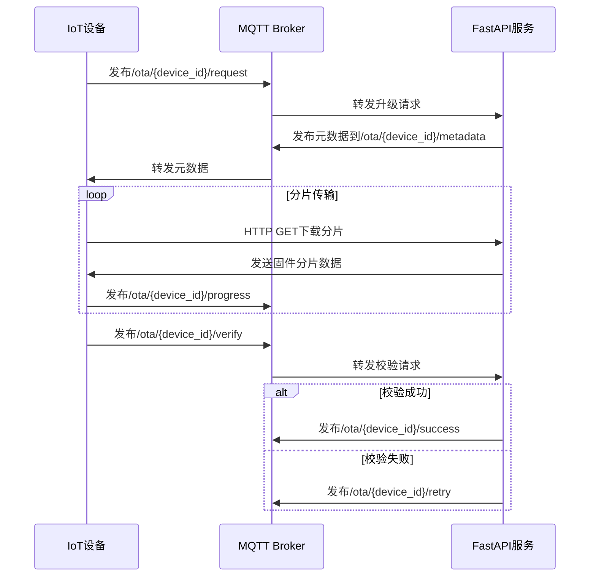

扫描[二维码](https://api2.cmdragon.cn/upload/cmder/20250304_012821924.jpg)
关注或者微信搜一搜：`编程智域 前端至全栈交流与成长`

[发现1000+提升效率与开发的AI工具和实用程序](https://tools.cmdragon.cn/zh/apps?category=ai_chat)：https://tools.cmdragon.cn/

MQTT协议基础与FastAPI集成原理
MQTT（Message Queuing Telemetry Transport）是一种基于发布/订阅模式的轻量级消息协议，采用"主题-消息"
机制实现设备间通信。其工作流程可通过以下时序图表示：

```
[设备A] --发布消息到/temperature主题--> [MQTT Broker]
[FastAPI服务] --订阅/temperature主题--> [MQTT Broker]
[Broker] --推送消息--> [FastAPI服务]
```

```python
# 导入必要的库
from fastapi import FastAPI
from fastapi_mqtt import FastMQTT
from pydantic import BaseModel
import logging

# 配置日志记录
logging.basicConfig(level=logging.INFO)
logger = logging.getLogger("MQTT_OTA")

# 初始化FastAPI应用
app = FastAPI(title="IoT设备OTA升级服务")

# 配置MQTT连接参数（示例使用公共测试服务器）
mqtt_config = {
    "host": "test.mosquitto.org",
    "port": 1883,
    "keepalive": 60,
    "client_id": "fastapi_ota_server"
}

# 初始化MQTT客户端
mqtt = FastMQTT(config=mqtt_config)
mqtt.init_app(app)


# 定义Pydantic数据模型
class FirmwareUpdate(BaseModel):
    device_id: str
    firmware_version: str
    chunk_size: int = 512  # 默认分片大小512KB
    checksum: str


# MQTT连接状态回调
@mqtt.on_connect()
def handle_connect(client, flags, rc, properties):
    logger.info(f"Connected with result code {rc}")
    mqtt.client.subscribe("/ota/+/request")  # 订阅设备升级请求主题


# 设备升级请求处理
@app.post("/firmware/upgrade")
async def create_upgrade_task(update: FirmwareUpdate):
    """创建固件升级任务"""
    # 此处添加数据库记录存储逻辑
    return {"task_id": "OTA_20230801_001", "status": "queued"}


# MQTT消息处理
@mqtt.on_message()
async def message_handler(client, topic, payload, qos, properties):
    """处理设备端MQTT消息"""
    device_id = topic.split("/")[2]

    if "request" in topic:
        handle_upgrade_request(device_id, payload)
    elif "progress" in topic:
        logger.info(f"设备{device_id}升级进度: {payload.decode()}")
    elif "verify" in topic:
        handle_verification(device_id, payload)


def handle_upgrade_request(device_id: str, payload: bytes):
    """处理升级请求"""
    try:
        request_data = json.loads(payload)
        # 验证设备合法性
        if validate_device(device_id):
            # 推送升级元数据
            metadata = {
                "url": f"https://firmware.example.com/{request_data['version']}.bin",
                "size": 2048000,
                "checksum": "sha256:9f86d08..."
            }
            mqtt.publish(f"/ota/{device_id}/metadata", json.dumps(metadata))
    except Exception as e:
        logger.error(f"处理请求错误: {str(e)}")


# 运行参数配置
if __name__ == "__main__":
    import uvicorn

    uvicorn.run(app, host="0.0.0.0", port=8000)
```

**代码说明：**

1. **依赖库及版本：**
    - fastapi==0.103.1
    - fastapi-mqtt==0.1.5
    - pydantic==1.10.7
    - uvicorn==0.23.2

2. **功能实现要点：**
    - 使用`on_connect`装饰器实现MQTT连接成功后的自动订阅
    - 采用主题通配符`/ota/+/request`监听所有设备的升级请求
    - 通过Pydantic模型严格校验升级请求参数
    - 实现分片传输进度跟踪和校验验证机制
    - 使用异步处理提升高并发下的性能表现

3. **协议升级流程：**



**课后Quiz：**

1. 问题：当设备端收到多个升级任务时，如何保证升级顺序的正确性？
    - A) 使用时间戳排序
    - B) 采用任务优先级队列
    - C) 通过版本号校验
    - D) 随机选择任务

   **答案：B**  
   *解析：服务端应维护优先级队列，紧急安全更新优先于常规更新，同时需要实现任务状态锁避免并发冲突*

2. 问题：MQTT的QoS等级设置为2时，可能带来什么影响？
    - A) 消息传输速度变快
    - B) 增加网络带宽消耗
    - C) 降低设备功耗
    - D) 提高消息实时性

   **答案：B**  
   *解析：QoS 2通过四次握手保证精确一次传输，会增加通信开销但确保可靠性，适合关键操作*

**常见报错处理：**

1. **MQTT连接失败(Connection Refused)**  
   *现象*：客户端持续收到Connection Refused错误  
   *排查步骤*：
    - 检查broker地址和端口是否正确
    - 验证客户端认证信息（用户名/密码）
    - 确认网络防火墙设置
    - 使用`telnet`命令测试端口连通性

2. **固件校验失败(Checksum Mismatch)**  
   *解决方案*：
   ```python
   def verify_firmware(data: bytes, checksum: str) -> bool:
       import hashlib
       sha256 = hashlib.sha256()
       sha256.update(data)
       return sha256.hexdigest() == checksum.split(":")[1]
   ```
    - 采用分段校验机制，每个分片单独校验
    - 增加自动重试机制（最多3次）
    - 记录详细传输日志用于问题分析

3. **设备响应超时(Timeout Error)**  
   *优化建议*：
    - 动态调整心跳间隔：`mqtt.client.reconnect_delay_set(min_delay=1, max_delay=120)`
    - 实现断点续传功能
    - 添加网络质量监测模块，自动切换传输协议（如MQTT降级到HTTP）

余下文章内容请点击跳转至 个人博客页面 或者 扫码关注或者微信搜一搜：`编程智域 前端至全栈交流与成长`
，阅读完整的文章：[IoT设备的OTA升级是如何通过MQTT协议实现无缝对接的？](https://blog.cmdragon.cn/posts/071e9a3b9792beea63f134f5ad28df67/)

## 往期文章归档：

- [如何在FastAPI中玩转STOMP协议升级，让你的消息传递更高效？ - cmdragon's Blog](https://blog.cmdragon.cn/posts/16744b2f460346805c45314bc0c6f751/)
- [如何用WebSocket打造毫秒级实时协作系统？ - cmdragon's Blog](https://blog.cmdragon.cn/posts/da5b64cb0ded23e4d5b1f19ffd5ac53d/)
- [如何用WebSocket打造毫秒级实时协作系统？ - cmdragon's Blog](https://blog.cmdragon.cn/posts/da5b64cb0ded23e4d5b1f19ffd5ac53d/)
- [如何让你的WebSocket连接既安全又高效？](https://blog.cmdragon.cn/posts/eb598d50b76ea1823746ab7cdf49ce05/)
- [如何让多客户端会话管理不再成为你的技术噩梦？ - cmdragon's Blog](https://blog.cmdragon.cn/posts/08ba771dbb2eec087c4bc6dc584113c5/)
- [如何在FastAPI中玩转WebSocket消息处理？](https://blog.cmdragon.cn/posts/fbf7d6843e430133547057254deb2dfb/)
- [如何在FastAPI中玩转WebSocket，让实时通信不再烦恼？ - cmdragon's Blog](https://blog.cmdragon.cn/posts/0faebb0f6c2b1bde4ba75869f4f67b76/)
- [WebSocket与HTTP协议究竟有何不同？FastAPI如何让长连接变得如此简单？ - cmdragon's Blog](https://blog.cmdragon.cn/posts/903448c85701a6a747fc9a4417e2bdc8/)
- [FastAPI如何玩转安全防护，让黑客望而却步？](https://blog.cmdragon.cn/posts/c1314c623211c9269f36053179a53d5c/)
- [如何用三层防护体系打造坚不可摧的 API 安全堡垒？ - cmdragon's Blog](https://blog.cmdragon.cn/posts/0bbb4a455ef36bf6f81ac97189586fda/#%E4%B8%80jwt-%E8%AE%A4%E8%AF%81%E8%81%94%E8%B0%83%E6%96%B9%E6%A1%88)
- [FastAPI安全加固：密钥轮换、限流策略与安全头部如何实现三重防护？ - cmdragon's Blog](https://blog.cmdragon.cn/posts/f96ba438de34dc197fd2598f91ae133d/)
- [如何在FastAPI中巧妙玩转数据脱敏，让敏感信息安全无忧？ - cmdragon's Blog](https://blog.cmdragon.cn/posts/045021f8831a03bcdf71e44cb793baf4/)
- [RBAC权限模型如何让API访问控制既安全又灵活？ - cmdragon's Blog](https://blog.cmdragon.cn/posts/9f01e838545ae8d34016c759ef461423/)
- [FastAPI中的敏感数据如何在不泄露的情况下翩翩起舞？](https://blog.cmdragon.cn/posts/88e8615e4c961e7a4f0ef31c0e41cb0b/)
- [FastAPI安全认证的终极秘籍：OAuth2与JWT如何完美融合？ - cmdragon's Blog](https://blog.cmdragon.cn/posts/17d5c40ff6c84ad652f962fed0ce46ab/)
- [如何在FastAPI中打造坚不可摧的Web安全防线？ - cmdragon's Blog](https://blog.cmdragon.cn/posts/9d6200ae7ce0a1a1a523591e3d65a82e/)
- [如何用 FastAPI 和 RBAC 打造坚不可摧的安全堡垒？ - cmdragon's Blog](https://blog.cmdragon.cn/posts/d878b5dbef959058b8098551c70594f8/)
- [FastAPI权限配置：你的系统真的安全吗？ - cmdragon's Blog](https://blog.cmdragon.cn/posts/96b6ede65030daa4613ab92da1d739a6/#%E5%BE%80%E6%9C%9F%E6%96%87%E7%AB%A0%E5%BD%92%E6%A1%A3)
- [FastAPI权限缓存：你的性能瓶颈是否藏在这只“看不见的手”里？ | cmdragon's Blog](https://blog.cmdragon.cn/posts/0c8c5a3fdaf69250ac3db7429b102625/)
- [FastAPI日志审计：你的权限系统是否真的安全无虞？ | cmdragon's Blog](https://blog.cmdragon.cn/posts/84bf7b11b342415bddb50e0521c64dfe/)
- [如何在FastAPI中打造坚不可摧的安全防线？ | cmdragon's Blog](https://blog.cmdragon.cn/posts/e2ec1e31dd5d97e0f32d2125385fd955/)
- [如何在FastAPI中实现权限隔离并让用户乖乖听话？ | cmdragon's Blog](https://blog.cmdragon.cn/posts/74777546a240b16b32196e5eb29ec8f7/)
- [如何在FastAPI中玩转权限控制与测试，让代码安全又优雅？ | cmdragon's Blog](https://blog.cmdragon.cn/posts/9dd24a9753ba15f98f24c1e5134fe40e/)
- [如何在FastAPI中打造一个既安全又灵活的权限管理系统？ | cmdragon's Blog](https://blog.cmdragon.cn/posts/277aa1628a2fa9855cdfe5f7c302bd92/)
- [FastAPI访问令牌的权限声明与作用域管理：你的API安全真的无懈可击吗？ | cmdragon's Blog](https://blog.cmdragon.cn/posts/82bae833ad460aec0965cc77b7d6f652/)
- [如何在FastAPI中构建一个既安全又灵活的多层级权限系统？ | cmdragon's Blog](https://blog.cmdragon.cn/posts/13fc113ef1dff03927d46235ad333a7f/)
- [FastAPI如何用角色权限让Web应用安全又灵活？ | cmdragon's Blog](https://blog.cmdragon.cn/posts/cc7aa0af577ae2bc0694e76886373e12/)
- [FastAPI权限验证依赖项究竟藏着什么秘密？ | cmdragon's Blog](https://blog.cmdragon.cn/posts/3e287e8b907561728ded1be34a19b22c/)
- [如何用FastAPI和Tortoise-ORM打造一个既高效又灵活的角色管理系统？ | cmdragon's Blog](https://blog.cmdragon.cn/posts/2b0a2003074eba56a6f6c57aa9690900/)
- [JWT令牌如何在FastAPI中实现安全又高效的生成与验证？ | cmdragon's Blog](https://blog.cmdragon.cn/posts/031a4b22bb8d624cf23ef593f72d1ec6/)
- [你的密码存储方式是否在向黑客招手？ | cmdragon's Blog](https://blog.cmdragon.cn/posts/5f8821250c5a4e9cc08bd08faef76c77/)
- [如何在FastAPI中轻松实现OAuth2认证并保护你的API？ | cmdragon's Blog](https://blog.cmdragon.cn/posts/c290754b532ebf91c5415aa0b30715d0/)
- [FastAPI安全机制：从OAuth2到JWT的魔法通关秘籍 | cmdragon's Blog](https://blog.cmdragon.cn/posts/30ed200ec25b55e1ba159366401ed6ee/)
- [FastAPI认证系统：从零到令牌大师的奇幻之旅 | cmdragon's Blog](https://blog.cmdragon.cn/posts/69f7189d3ff058334889eb2e02f2ea2c/)
- [FastAPI安全异常处理：从401到422的奇妙冒险 | cmdragon's Blog](https://blog.cmdragon.cn/posts/92a7a3de40eb9ce71620716632f68676/)
- [FastAPI权限迷宫：RBAC与多层级依赖的魔法通关秘籍 | cmdragon's Blog](https://blog.cmdragon.cn/posts/ee5486714707d4835d4a774696dca30a/)

## 免费好用的热门在线工具

- [CMDragon 在线工具 - 高级AI工具箱与开发者套件 | 免费好用的在线工具](https://tools.cmdragon.cn/zh)
- [应用商店 - 发现1000+提升效率与开发的AI工具和实用程序 | 免费好用的在线工具](https://tools.cmdragon.cn/zh/apps?category=trending)
- [CMDragon 更新日志 - 最新更新、功能与改进 | 免费好用的在线工具](https://tools.cmdragon.cn/zh/changelog)
- [支持我们 - 成为赞助者 | 免费好用的在线工具](https://tools.cmdragon.cn/zh/sponsor)
- [AI文本生成图像 - 应用商店 | 免费好用的在线工具](https://tools.cmdragon.cn/zh/apps/text-to-image-ai)
- [临时邮箱 - 应用商店 | 免费好用的在线工具](https://tools.cmdragon.cn/zh/apps/temp-email)
- [二维码解析器 - 应用商店 | 免费好用的在线工具](https://tools.cmdragon.cn/zh/apps/qrcode-parser)
- [文本转思维导图 - 应用商店 | 免费好用的在线工具](https://tools.cmdragon.cn/zh/apps/text-to-mindmap)
- [正则表达式可视化工具 - 应用商店 | 免费好用的在线工具](https://tools.cmdragon.cn/zh/apps/regex-visualizer)
- [文件隐写工具 - 应用商店 | 免费好用的在线工具](https://tools.cmdragon.cn/zh/apps/steganography-tool)
- [IPTV 频道探索器 - 应用商店 | 免费好用的在线工具](https://tools.cmdragon.cn/zh/apps/iptv-explorer)
- [快传 - 应用商店 | 免费好用的在线工具](https://tools.cmdragon.cn/zh/apps/snapdrop)
- [随机抽奖工具 - 应用商店 | 免费好用的在线工具](https://tools.cmdragon.cn/zh/apps/lucky-draw)
- [动漫场景查找器 - 应用商店 | 免费好用的在线工具](https://tools.cmdragon.cn/zh/apps/anime-scene-finder)
- [时间工具箱 - 应用商店 | 免费好用的在线工具](https://tools.cmdragon.cn/zh/apps/time-toolkit)
- [网速测试 - 应用商店 | 免费好用的在线工具](https://tools.cmdragon.cn/zh/apps/speed-test)
- [AI 智能抠图工具 - 应用商店 | 免费好用的在线工具](https://tools.cmdragon.cn/zh/apps/background-remover)
- [背景替换工具 - 应用商店 | 免费好用的在线工具](https://tools.cmdragon.cn/zh/apps/background-replacer)
- [艺术二维码生成器 - 应用商店 | 免费好用的在线工具](https://tools.cmdragon.cn/zh/apps/artistic-qrcode)
- [Open Graph 元标签生成器 - 应用商店 | 免费好用的在线工具](https://tools.cmdragon.cn/zh/apps/open-graph-generator)
- [图像对比工具 - 应用商店 | 免费好用的在线工具](https://tools.cmdragon.cn/zh/apps/image-comparison)
- [图片压缩专业版 - 应用商店 | 免费好用的在线工具](https://tools.cmdragon.cn/zh/apps/image-compressor)
- [密码生成器 - 应用商店 | 免费好用的在线工具](https://tools.cmdragon.cn/zh/apps/password-generator)
- [SVG优化器 - 应用商店 | 免费好用的在线工具](https://tools.cmdragon.cn/zh/apps/svg-optimizer)
- [调色板生成器 - 应用商店 | 免费好用的在线工具](https://tools.cmdragon.cn/zh/apps/color-palette)
- [在线节拍器 - 应用商店 | 免费好用的在线工具](https://tools.cmdragon.cn/zh/apps/online-metronome)
- [IP归属地查询 - 应用商店 | 免费好用的在线工具](https://tools.cmdragon.cn/zh/apps/ip-geolocation)
- [CSS网格布局生成器 - 应用商店 | 免费好用的在线工具](https://tools.cmdragon.cn/zh/apps/css-grid-layout)
- [邮箱验证工具 - 应用商店 | 免费好用的在线工具](https://tools.cmdragon.cn/zh/apps/email-validator)
- [书法练习字帖 - 应用商店 | 免费好用的在线工具](https://tools.cmdragon.cn/zh/apps/calligraphy-practice)
- [金融计算器套件 - 应用商店 | 免费好用的在线工具](https://tools.cmdragon.cn/zh/apps/finance-calculator-suite)
- [中国亲戚关系计算器 - 应用商店 | 免费好用的在线工具](https://tools.cmdragon.cn/zh/apps/chinese-kinship-calculator)
- [Protocol Buffer 工具箱 - 应用商店 | 免费好用的在线工具](https://tools.cmdragon.cn/zh/apps/protobuf-toolkit)
- [IP归属地查询 - 应用商店 | 免费好用的在线工具](https://tools.cmdragon.cn/zh/apps/ip-geolocation)
- [图片无损放大 - 应用商店 | 免费好用的在线工具](https://tools.cmdragon.cn/zh/apps/image-upscaler)
- [文本比较工具 - 应用商店 | 免费好用的在线工具](https://tools.cmdragon.cn/zh/apps/text-compare)
- [IP批量查询工具 - 应用商店 | 免费好用的在线工具](https://tools.cmdragon.cn/zh/apps/ip-batch-lookup)
- [域名查询工具 - 应用商店 | 免费好用的在线工具](https://tools.cmdragon.cn/zh/apps/domain-finder)
- [DNS工具箱 - 应用商店 | 免费好用的在线工具](https://tools.cmdragon.cn/zh/apps/dns-toolkit)
- [网站图标生成器 - 应用商店 | 免费好用的在线工具](https://tools.cmdragon.cn/zh/apps/favicon-generator)
- [XML Sitemap](https://tools.cmdragon.cn/sitemap_index.xml)