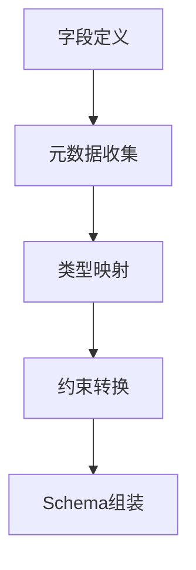

扫描[二维码](https://api2.cmdragon.cn/upload/cmder/20250304_012821924.jpg)
关注或者微信搜一搜：`编程智域 前端至全栈交流与成长`

[探索数千个预构建的 AI 应用，开启你的下一个伟大创意](https://tools.cmdragon.cn/zh/apps?category=ai_chat)


---

### **第一章：Schema生成基础**

#### **1.1 默认Schema生成机制**

```python
from pydantic import BaseModel


class User(BaseModel):
    id: int
    name: str = Field(..., max_length=50)


print(User.schema_json(indent=2))
```

**输出特征**：

```json
{
  "title": "User",
  "type": "object",
  "properties": {
    "id": {
      "title": "Id",
      "type": "integer"
    },
    "name": {
      "title": "Name",
      "type": "string",
      "maxLength": 50
    }
  },
  "required": [
    "id",
    "name"
  ]
}
```

#### **1.2 Schema生成流程**



---

### **第二章：核心定制技术**

#### **2.1 字段级元数据注入**

```python
from pydantic import BaseModel, Field


class Product(BaseModel):
    sku: str = Field(
        ...,
        json_schema_extra={
            "x-frontend": {"widget": "search-input"},
            "x-docs": {"example": "ABC-123"}
        }
    )


print(Product.schema()["properties"]["sku"])
```

**输出**：

```json
{
  "title": "Sku",
  "type": "string",
  "x-frontend": {
    "widget": "search-input"
  },
  "x-docs": {
    "example": "ABC-123"
  }
}
```

#### **2.2 类型映射重载**

```python
from pydantic import BaseModel
from pydantic.json_schema import GenerateJsonSchema


class CustomSchemaGenerator(GenerateJsonSchema):
    def generate(self, schema):
        if schema["type"] == "string":
            schema["format"] = "custom-string"
        return schema


class DataModel(BaseModel):
    content: str


print(DataModel.schema(schema_generator=CustomSchemaGenerator))
```

---

### **第三章：动态Schema生成**

#### **3.1 运行时Schema构建**

```python
from pydantic import create_model
from pydantic.fields import FieldInfo


def dynamic_model(field_defs: dict):
    fields = {}
    for name, config in field_defs.items():
        fields[name] = (
            config["type"],
            FieldInfo(**config["field_params"])
        )
    return create_model('DynamicModel', **fields)


model = dynamic_model({
    "timestamp": {
        "type": int,
        "field_params": {"ge": 0, "json_schema_extra": {"unit": "ms"}}
    }
})
```

#### **3.2 环境感知Schema**

```python
from pydantic import BaseModel, ConfigDict


class EnvAwareSchema(BaseModel):
    model_config = ConfigDict(json_schema_mode="dynamic")

    @classmethod
    def __get_pydantic_json_schema__(cls, core_schema, handler):
        schema = handler(core_schema)
        if os.getenv("ENV") == "prod":
            schema["required"].append("audit_info")
        return schema
```

---

### **第四章：企业级应用模式**

#### **4.1 OpenAPI增强方案**

```python
from pydantic import BaseModel


class OpenAPICompatible(BaseModel):
    model_config = dict(
        json_schema_extra={
            "components": {
                "schemas": {
                    "ErrorResponse": {
                        "type": "object",
                        "properties": {
                            "code": {"type": "integer"},
                            "message": {"type": "string"}
                        }
                    }
                }
            }
        }
    )
```

#### **4.2 版本化Schema管理**

```python
from pydantic import BaseModel, field_validator


class VersionedModel(BaseModel):
    model_config = ConfigDict(extra="allow")

    @classmethod
    def __get_pydantic_json_schema__(cls, core_schema, handler):
        schema = handler(core_schema)
        schema["x-api-version"] = "2.3"
        return schema


class V1Model(VersionedModel):
    @classmethod
    def __get_pydantic_json_schema__(cls, *args):
        schema = super().__get_pydantic_json_schema__(*args)
        schema["x-api-version"] = "1.2"
        return schema
```

---

### **第五章：错误处理与优化**

#### **5.1 Schema验证错误**

```python
try:
    class InvalidSchemaModel(BaseModel):
        data: dict = Field(format="invalid-format")
except ValueError as e:
    print(f"Schema配置错误: {e}")
```

#### **5.2 性能优化策略**

```python
from functools import lru_cache


class CachedSchemaModel(BaseModel):
    @classmethod
    @lru_cache(maxsize=128)
    def schema(cls, **kwargs):
        return super().schema(**kwargs)
```

---

### **课后Quiz**

**Q1：如何添加自定义Schema属性？**  
A) 使用json_schema_extra  
B) 修改全局配置  
C) 继承GenerateJsonSchema

**Q2：处理版本兼容的正确方式？**

1) 动态注入版本号
2) 创建子类覆盖Schema
3) 维护多个模型

**Q3：优化Schema生成性能应使用？**

- [x] LRU缓存
- [ ] 增加校验步骤
- [ ] 禁用所有缓存

---

### **错误解决方案速查表**

| 错误信息                    | 原因分析          | 解决方案                             |
|-------------------------|---------------|----------------------------------|
| ValueError: 无效的format类型 | 不支持的Schema格式  | 检查字段类型与格式的兼容性                    |
| KeyError: 缺失必需字段        | 动态Schema未正确注入 | 验证__get_pydantic_json_schema__实现 |
| SchemaGenerationError   | 自定义生成器逻辑错误    | 检查类型映射逻辑                         |
| MemoryError             | 大规模模型未缓存      | 启用模型Schema缓存                     |

---


**架构箴言**：Schema设计应遵循"契约优先"原则，建议使用Git版本控制管理Schema变更，通过CI/CD流水线实现Schema的自动化测试与文档生成，建立Schema变更通知机制保障多团队协作。

余下文章内容请点击跳转至 个人博客页面 或者 扫码关注或者微信搜一搜：`编程智域 前端至全栈交流与成长`，阅读完整的文章：

## 往期文章归档：

- [Pydantic递归模型深度校验36计：从无限嵌套到亿级数据的优化法则 | cmdragon's Blog](https://blog.cmdragon.cn/posts/448b2f4522926a7bdf477332fa57df2b/)
- [Pydantic异步校验器深：构建高并发验证系统 | cmdragon's Blog](https://blog.cmdragon.cn/posts/38a93fe6312bbee008f3c11d9ecbb557/)
- [Pydantic根校验器：构建跨字段验证系统 | cmdragon's Blog](https://blog.cmdragon.cn/posts/3c17dfcf84fdc8190e40286d114cebb7/)
- [Pydantic配置继承抽象基类模式 | cmdragon's Blog](https://blog.cmdragon.cn/posts/48005c4f39db6b2ac899df96448a6fd2/)
- [Pydantic多态模型：用鉴别器构建类型安全的API接口 | cmdragon's Blog](https://blog.cmdragon.cn/posts/fc7b42c24414cb24dd920fb2eae164f5/)
- [FastAPI性能优化指南：参数解析与惰性加载 | cmdragon's Blog](https://blog.cmdragon.cn/posts/d2210ab0f56b1e3ae62117530498ee85/)
- [FastAPI依赖注入：参数共享与逻辑复用 | cmdragon's Blog](https://blog.cmdragon.cn/posts/1821d820e2f8526b106ce0747b811faf/)
- [FastAPI安全防护指南：构建坚不可摧的参数处理体系 | cmdragon's Blog](https://blog.cmdragon.cn/posts/ed25f1c3c737f67a6474196cc8394113/)
- [FastAPI复杂查询终极指南：告别if-else的现代化过滤架构 | cmdragon's Blog](https://blog.cmdragon.cn/posts/eab4df2bac65cb8cde7f6a04b2aa624c/)
- [FastAPI 核心机制：分页参数的实现与最佳实践 | cmdragon's Blog](https://blog.cmdragon.cn/posts/8821ab1186b05252feda20836609463e/)
- [FastAPI 错误处理与自定义错误消息完全指南：构建健壮的 API 应用 🛠️ | cmdragon's Blog](https://blog.cmdragon.cn/posts/cebad7a36a676e5e20b90d616b726489/)
- [FastAPI 自定义参数验证器完全指南：从基础到高级实战 | cmdragon's Blog](https://blog.cmdragon.cn/posts/9d0a403c8be2b1dc31f54f2a32e4af6d/)
- [FastAPI 参数别名与自动文档生成完全指南：从基础到高级实战 🚀 | cmdragon's Blog](https://blog.cmdragon.cn/posts/2a912968ba048bad95a092487126f2ed/)
- [FastAPI Cookie 和 Header 参数完全指南：从基础到高级实战 🚀 | cmdragon's Blog](https://blog.cmdragon.cn/posts/f4cd8ed98ef3989d7c5c627f9adf7dea/)
- [FastAPI 表单参数与文件上传完全指南：从基础到高级实战 🚀 | cmdragon's Blog](https://blog.cmdragon.cn/posts/d386eb9996fa2245ce3ed0fa4473ce2b/)
- [FastAPI 请求体参数与 Pydantic 模型完全指南：从基础到嵌套模型实战 🚀 | cmdragon's Blog](https://blog.cmdragon.cn/posts/068b69e100a8e9ec06b2685908e6ae96/)
- [FastAPI 查询参数完全指南：从基础到高级用法 🚀 | cmdragon's Blog](https://blog.cmdragon.cn/posts/20e3eee2e462e49827506244c90c065a/)
- [FastAPI 路径参数完全指南：从基础到高级校验实战 🚀 | cmdragon's Blog](https://blog.cmdragon.cn/posts/c2afc335d7e290e99c72969806120f32/)
- [FastAPI路由专家课：微服务架构下的路由艺术与工程实践 🌐 | cmdragon's Blog](https://blog.cmdragon.cn/posts/be774b3724c7f10ca55defb76ff99656/)
- [FastAPI路由与请求处理进阶指南：解锁企业级API开发黑科技 🔥 | cmdragon's Blog](https://blog.cmdragon.cn/posts/23320e6c7e7736b3faeeea06c6fa2a9b/)
- [FastAPI路由与请求处理全解：手把手打造用户管理系统 🔌 | cmdragon's Blog](https://blog.cmdragon.cn/posts/9d842fb802a1650ff94a76ccf85e38bf/)
- [FastAPI极速入门：15分钟搭建你的首个智能API（附自动文档生成）🚀 | cmdragon's Blog](https://blog.cmdragon.cn/posts/f00c92e523b0105ed423cb8edeeb0266/)
- [HTTP协议与RESTful API实战手册（终章）：构建企业级API的九大秘籍 🔐 | cmdragon's Blog](https://blog.cmdragon.cn/posts/1aaea6dee0155d4100825ddc61d600c0/)
- [HTTP协议与RESTful API实战手册（二）：用披萨店故事说透API设计奥秘 🍕 | cmdragon's Blog](https://blog.cmdragon.cn/posts/c8336c13112f68c7f9fe1490aa8d43fe/)
- [从零构建你的第一个RESTful API：HTTP协议与API设计超图解指南 🌐 | cmdragon's Blog](https://blog.cmdragon.cn/posts/1960fe96ab7bb621305c9524cc451a2f/)
- [Python异步编程进阶指南：破解高并发系统的七重封印 | cmdragon's Blog](https://blog.cmdragon.cn/posts/6163781e0bba17626978fadf63b3e92e/)
- [Python异步编程终极指南：用协程与事件循环重构你的高并发系统 | cmdragon's Blog](https://blog.cmdragon.cn/posts/bac9c0badd47defc03ac5508af4b6e1a/)
- [Python类型提示完全指南：用类型安全重构你的代码，提升10倍开发效率 | cmdragon's Blog](https://blog.cmdragon.cn/posts/ca8d996ad2a9a8a8175899872ebcba85/)
- [三大平台云数据库生态服务对决 | cmdragon's Blog](https://blog.cmdragon.cn/posts/acbd74fc659aaa3d2e0c76387bc3e2d5/)
- [分布式数据库解析 | cmdragon's Blog](https://blog.cmdragon.cn/posts/4c553fe22df1e15c19d37a7dc10c5b3a/)
- [深入解析NoSQL数据库：从文档存储到图数据库的全场景实践 | cmdragon's Blog](https://blog.cmdragon.cn/posts/deed11eed0f84c915ed9e9d5aad6c06d/)
- [数据库审计与智能监控：从日志分析到异常检测 | cmdragon's Blog](https://blog.cmdragon.cn/posts/9c2a135562a18261d70cc5637df435e5/)
-

## 免费好用的热门在线工具

- [CMDragon 在线工具 - 高级AI工具箱与开发者套件 | 免费好用的在线工具](https://tools.cmdragon.cn/zh)
- [应用商店 - 发现1000+提升效率与开发的AI工具和实用程序 | 免费好用的在线工具](https://tools.cmdragon.cn/zh/apps?category=trending)
- [CMDragon 更新日志 - 最新更新、功能与改进 | 免费好用的在线工具](https://tools.cmdragon.cn/zh/changelog)
- [支持我们 - 成为赞助者 | 免费好用的在线工具](https://tools.cmdragon.cn/zh/sponsor)
- [AI文本生成图像 - 应用商店 | 免费好用的在线工具](https://tools.cmdragon.cn/zh/apps/text-to-image-ai)
- [临时邮箱 - 应用商店 | 免费好用的在线工具](https://tools.cmdragon.cn/zh/apps/temp-email)
- [二维码解析器 - 应用商店 | 免费好用的在线工具](https://tools.cmdragon.cn/zh/apps/qrcode-parser)
- [文本转思维导图 - 应用商店 | 免费好用的在线工具](https://tools.cmdragon.cn/zh/apps/text-to-mindmap)
- [正则表达式可视化工具 - 应用商店 | 免费好用的在线工具](https://tools.cmdragon.cn/zh/apps/regex-visualizer)
- [文件隐写工具 - 应用商店 | 免费好用的在线工具](https://tools.cmdragon.cn/zh/apps/steganography-tool)
- [IPTV 频道探索器 - 应用商店 | 免费好用的在线工具](https://tools.cmdragon.cn/zh/apps/iptv-explorer)
- [快传 - 应用商店 | 免费好用的在线工具](https://tools.cmdragon.cn/zh/apps/snapdrop)
- [随机抽奖工具 - 应用商店 | 免费好用的在线工具](https://tools.cmdragon.cn/zh/apps/lucky-draw)
- [动漫场景查找器 - 应用商店 | 免费好用的在线工具](https://tools.cmdragon.cn/zh/apps/anime-scene-finder)
- [时间工具箱 - 应用商店 | 免费好用的在线工具](https://tools.cmdragon.cn/zh/apps/time-toolkit)
- [网速测试 - 应用商店 | 免费好用的在线工具](https://tools.cmdragon.cn/zh/apps/speed-test)
- [AI 智能抠图工具 - 应用商店 | 免费好用的在线工具](https://tools.cmdragon.cn/zh/apps/background-remover)
- [背景替换工具 - 应用商店 | 免费好用的在线工具](https://tools.cmdragon.cn/zh/apps/background-replacer)
- [艺术二维码生成器 - 应用商店 | 免费好用的在线工具](https://tools.cmdragon.cn/zh/apps/artistic-qrcode)
- [Open Graph 元标签生成器 - 应用商店 | 免费好用的在线工具](https://tools.cmdragon.cn/zh/apps/open-graph-generator)
- [图像对比工具 - 应用商店 | 免费好用的在线工具](https://tools.cmdragon.cn/zh/apps/image-comparison)
- [图片压缩专业版 - 应用商店 | 免费好用的在线工具](https://tools.cmdragon.cn/zh/apps/image-compressor)
- [密码生成器 - 应用商店 | 免费好用的在线工具](https://tools.cmdragon.cn/zh/apps/password-generator)
- [SVG优化器 - 应用商店 | 免费好用的在线工具](https://tools.cmdragon.cn/zh/apps/svg-optimizer)
- [调色板生成器 - 应用商店 | 免费好用的在线工具](https://tools.cmdragon.cn/zh/apps/color-palette)
- [在线节拍器 - 应用商店 | 免费好用的在线工具](https://tools.cmdragon.cn/zh/apps/online-metronome)
- [IP归属地查询 - 应用商店 | 免费好用的在线工具](https://tools.cmdragon.cn/zh/apps/ip-geolocation)
- [CSS网格布局生成器 - 应用商店 | 免费好用的在线工具](https://tools.cmdragon.cn/zh/apps/css-grid-layout)
- [邮箱验证工具 - 应用商店 | 免费好用的在线工具](https://tools.cmdragon.cn/zh/apps/email-validator)
- [书法练习字帖 - 应用商店 | 免费好用的在线工具](https://tools.cmdragon.cn/zh/apps/calligraphy-practice)
- [金融计算器套件 - 应用商店 | 免费好用的在线工具](https://tools.cmdragon.cn/zh/apps/finance-calculator-suite)
- [中国亲戚关系计算器 - 应用商店 | 免费好用的在线工具](https://tools.cmdragon.cn/zh/apps/chinese-kinship-calculator)
- [Protocol Buffer 工具箱 - 应用商店 | 免费好用的在线工具](https://tools.cmdragon.cn/zh/apps/protobuf-toolkit)
- [IP归属地查询 - 应用商店 | 免费好用的在线工具](https://tools.cmdragon.cn/zh/apps/ip-geolocation)
- [图片无损放大 - 应用商店 | 免费好用的在线工具](https://tools.cmdragon.cn/zh/apps/image-upscaler)
- [文本比较工具 - 应用商店 | 免费好用的在线工具](https://tools.cmdragon.cn/zh/apps/text-compare)
- [IP批量查询工具 - 应用商店 | 免费好用的在线工具](https://tools.cmdragon.cn/zh/apps/ip-batch-lookup)
- [域名查询工具 - 应用商店 | 免费好用的在线工具](https://tools.cmdragon.cn/zh/apps/domain-finder)
- [DNS工具箱 - 应用商店 | 免费好用的在线工具](https://tools.cmdragon.cn/zh/apps/dns-toolkit)
- [网站图标生成器 - 应用商店 | 免费好用的在线工具](https://tools.cmdragon.cn/zh/apps/favicon-generator)
- [XML Sitemap](https://tools.cmdragon.cn/sitemap_index.xml)