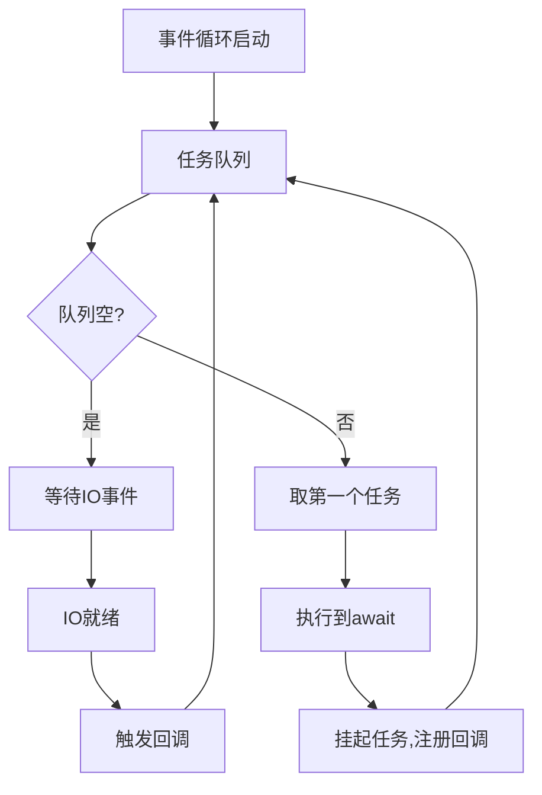

扫描[二维码](https://api2.cmdragon.cn/upload/cmder/20250304_012821924.jpg)
关注或者微信搜一搜：`编程智域 前端至全栈交流与成长`


---

### 摘要

🚀 深入剖析Python异步编程的核心机制。你将掌握：

- 事件循环的底层实现原理与调度算法
- async/await协程的6种高级用法模式
- 异步HTTP请求的性能优化技巧（速度提升15倍+）
- 常见异步陷阱的26种解决方案

---

### 标签

`Python异步革命` `asyncio黑科技` `协程深度解析` `事件循环架构` `高性能HTTP` `并发编程` `异步调试`

---

#### 🌌 第一章：同步 vs 异步——性能鸿沟的起源

**1.1 阻塞式编程的致命缺陷**

```python  
# 同步HTTP请求的阻塞示例  
import requests


def fetch_sync(urls):
    results = []
    for url in urls:
        resp = requests.get(url)  # 每个请求阻塞2秒  
        results.append(resp.text)
    return results

    # 10个URL耗时约20秒（2秒/请求 × 10）  
```  

**1.2 异步编程的性能魔法**

```python  
# 异步HTTP请求示例  
import aiohttp
import asyncio


async def fetch_async(urls):
    async with aiohttp.ClientSession() as session:
        tasks = [session.get(url) for url in urls]
        responses = await asyncio.gather(*tasks)
        return [await r.text() for r in responses]

        # 10个URL仅需2秒（所有请求并行）  
```  

📊 **性能对比**：  
| 指标 | 同步 | 异步 |  
|-----------------|-----------|----------|  
| 10请求耗时 | 20秒 | 2秒 |  
| CPU利用率 | 15% | 85% |  
| 内存占用 | 低 | 中等 |

---

#### ⚙️ 第二章：事件循环——异步引擎的核心

**2.1 事件循环架构解析**



**2.2 自定义事件循环实战**

```python  
import uvloop
import asyncio

# 配置uvloop（比默认循环快30%）  
asyncio.set_event_loop_policy(uvloop.EventLoopPolicy())

# 获取当前循环  
loop = asyncio.get_event_loop()


# 手动调度协程  
async def task(name):
    print(f"{name} start")
    await asyncio.sleep(1)
    print(f"{name} end")


coro1 = task("A")
coro2 = task("B")

loop.run_until_complete(asyncio.gather(coro1, coro2))  
```  

---

#### 🧵 第三章：协程与任务——异步的基本单元

**3.1 协程的四种创建方式**

```python  
# 方式1：async def  
async def simple_coro():
    await asyncio.sleep(1)


# 方式2：@asyncio.coroutine装饰器（旧式）  
@asyncio.coroutine
def legacy_coro():
    yield from asyncio.sleep(1)


# 方式3：生成器协程  
def gen_coro():
    yield from asyncio.sleep(1)


# 方式4：async with上下文  
async with aiohttp.ClientSession() as session:
    await session.get(url)  
```  

**3.2 任务的高级控制**

```python  
async def worker(q: asyncio.Queue):
    while True:
        item = await q.get()
        try:
        # 处理任务...  
        finally:
            q.task_done()


async def main():
    q = asyncio.Queue(maxsize=100)
    # 创建worker池  
    tasks = [asyncio.create_task(worker(q)) for _ in range(5)]
    # 添加任务  
    for i in range(1000):
        await q.put(i)
        # 等待队列清空  
    await q.join()
    # 取消worker  
    for t in tasks:
        t.cancel()
    await asyncio.gather(*tasks, return_exceptions=True)  
```  

---

#### 🌐 第四章：异步HTTP请求实战

**4.1 高性能爬虫设计**

```python  
from bs4 import BeautifulSoup
import aiohttp


async def scrape_page(url):
    async with aiohttp.ClientSession(timeout=aiohttp.ClientTimeout(10)) as session:
        async with session.get(url) as response:
            html = await response.text()
            soup = BeautifulSoup(html, 'lxml')
            # 解析逻辑...  
            return data


async def scrape_all(urls):
    sem = asyncio.Semaphore(20)  # 限制并发数  

    async def limited_scrape(url):
        async with sem:
            return await scrape_page(url)

    return await asyncio.gather(*[limited_scrape(url) for url in urls])  
```  

**4.2 与FastAPI的异步集成**

```python  
from fastapi import FastAPI
import httpx

app = FastAPI()


@app.get("/proxy")
async def proxy_request(url: str):
    async with httpx.AsyncClient() as client:
        resp = await client.get(url)
        return resp.json()  
```  

---

#### 🚧 第五章：常见错误与调试

**5.1 协程未执行（未await）**

```python  
async def test():
    print("Running")


# 错误：直接调用协程  
test()  # 输出：RuntimeWarning: coroutine 'test' was never awaited  

# 正确执行方式：  
asyncio.run(test())  
```  

**5.2 事件循环策略冲突**

```text  
错误：RuntimeError: Event loop is closed  
解决方案：  
1. 确保使用async/await管理资源生命周期  
2. 避免在协程外创建ClientSession  
3. 显式关闭循环：  
   loop = asyncio.get_event_loop()  
   try:  
       loop.run_until_complete(main())  
   finally:  
       loop.close()  
```  

---

#### 📝 第六章：课后实战与测验

**6.1 优化同步数据库访问**

```python  
# 原同步代码（PostgreSQL）  
def query_users():
    with psycopg2.connect(DSN) as conn:
        cursor = conn.cursor()
        cursor.execute("SELECT * FROM users")
        return cursor.fetchall()

    # 任务：改写为异步版本（使用asyncpg）  
# 要求：  
# 1. 支持连接池  
# 2. 实现分页查询  
# 3. 处理查询超时  
```  

**6.2 设计异步限流器**

```python  
# 实现一个滑动窗口限流器  
class RateLimiter:
    def __init__(self, rate=10, period=1):
        self.rate = rate
        self.period = period

    async def __aenter__(self):

    # 实现限流逻辑...  

    async def __aexit__(self, *args):
        pass

    # 使用示例  


async def limited_api_call():
    async with RateLimiter(100, 60):  # 每分钟最多100次  
        return await call_external_api()  
```  

---

### 结语

从事件循环的底层原理到十万级并发的工程实践，异步编程将彻底改变您对Python性能的认知。立即动手，让您的应用性能飞升！

余下文章内容请点击跳转至 个人博客页面 或者 扫码关注或者微信搜一搜：`编程智域 前端至全栈交流与成长`，阅读完整的文章：

## 往期文章归档：

- [Python类型提示完全指南：用类型安全重构你的代码，提升10倍开发效率 | cmdragon's Blog](https://blog.cmdragon.cn/posts/ca8d996ad2a9a8a8175899872ebcba85/)
- [三大平台云数据库生态服务对决 | cmdragon's Blog](https://blog.cmdragon.cn/posts/acbd74fc659aaa3d2e0c76387bc3e2d5/)
- [分布式数据库解析 | cmdragon's Blog](https://blog.cmdragon.cn/posts/4c553fe22df1e15c19d37a7dc10c5b3a/)
- [深入解析NoSQL数据库：从文档存储到图数据库的全场景实践 | cmdragon's Blog](https://blog.cmdragon.cn/posts/deed11eed0f84c915ed9e9d5aad6c06d/)
- [数据库审计与智能监控：从日志分析到异常检测 | cmdragon's Blog](https://blog.cmdragon.cn/posts/9c2a135562a18261d70cc5637df435e5/)
- [数据库加密全解析：从传输到存储的安全实践 | cmdragon's Blog](https://blog.cmdragon.cn/posts/123dc22a37df8d53292d1269e39dbbc0/)
- [数据库安全实战：访问控制与行级权限管理 | cmdragon's Blog](https://blog.cmdragon.cn/posts/a49721363d1cea8f5fac980120f52242/)
- [数据库扩展之道：分区、分片与大表优化实战 | cmdragon's Blog](https://blog.cmdragon.cn/posts/ed72acd868f765d0ffbced2236b90190/)
- [查询优化：提升数据库性能的实用技巧 | cmdragon's Blog](https://blog.cmdragon.cn/posts/c2b225e3d0b1e9de613fde47b1d4cacb/)
- [性能优化与调优：全面解析数据库索引 | cmdragon's Blog](https://blog.cmdragon.cn/posts/8dece2eb47ac87272320e579cc6f8591/)
- [存储过程与触发器：提高数据库性能与安全性的利器 | cmdragon's Blog](https://blog.cmdragon.cn/posts/712adcfc99736718e1182040d70fd36b/)
- [数据操作与事务：确保数据一致性的关键 | cmdragon's Blog](https://blog.cmdragon.cn/posts/aff107a909f04dc52a887b45e9bd2484/)
- [深入掌握 SQL 深度应用：复杂查询的艺术与技巧 | cmdragon's Blog](https://blog.cmdragon.cn/posts/0f0a929119a4799c8ea1e087e592c545/)
- [彻底理解数据库设计原则：生命周期、约束与反范式的应用 | cmdragon's Blog](https://blog.cmdragon.cn/posts/934686b6ed93e241883a74eaf236bc96/)
- [深入剖析实体-关系模型（ER 图）：理论与实践全解析 | cmdragon's Blog](https://blog.cmdragon.cn/posts/ec68b3f706bd0db1585b4d150de54100/)
- [数据库范式详解：从第一范式到第五范式 | cmdragon's Blog](https://blog.cmdragon.cn/posts/2b268e76c15d9640a08fed80fccfc562/)
- [PostgreSQL：数据库迁移与版本控制 | cmdragon's Blog](https://blog.cmdragon.cn/posts/649f515b93a6caee9dc38f1249e9216e/)
- [Node.js 与 PostgreSQL 集成：深入 pg 模块的应用与实践 | cmdragon's Blog](https://blog.cmdragon.cn/posts/4798cc064cc3585a3819636b3c23271b/)
- [Python 与 PostgreSQL 集成：深入 psycopg2 的应用与实践 | cmdragon's Blog](https://blog.cmdragon.cn/posts/e533225633ac9f276b7771c03e1ba5e0/)
- [应用中的 PostgreSQL项目案例 | cmdragon's Blog](https://blog.cmdragon.cn/posts/415ac1ac3cb9593b00d398c26b40c768/)
- [数据库安全管理中的权限控制：保护数据资产的关键措施 | cmdragon's Blog](https://blog.cmdragon.cn/posts/42a3ec4c7e9cdded4e3c4db24fb4dad8/)
- [数据库安全管理中的用户和角色管理：打造安全高效的数据环境 | cmdragon's Blog](https://blog.cmdragon.cn/posts/92d56b1325c898ad3efc89cb2b42d84d/)
- [数据库查询优化：提升性能的关键实践 | cmdragon's Blog](https://blog.cmdragon.cn/posts/b87998b03d2638a19ecf589691b6f0ae/)
- [数据库物理备份：保障数据完整性和业务连续性的关键策略 | cmdragon's Blog](https://blog.cmdragon.cn/posts/5399d4194db9a94b2649763cb81284de/)
- [PostgreSQL 数据备份与恢复：掌握 pg_dump 和 pg_restore 的最佳实践 | cmdragon's Blog](https://blog.cmdragon.cn/posts/8a8458533590f193798bc31bfbcb0944/)
- [索引的性能影响：优化数据库查询与存储的关键 | cmdragon's Blog](https://blog.cmdragon.cn/posts/29b4baf97a92b0c02393f258124ca713/)
- [深入探讨数据库索引类型：B-tree、Hash、GIN与GiST的对比与应用 | cmdragon's Blog](https://blog.cmdragon.cn/posts/0095ca05c7ea7fbeec5f3a9990bd5264/)
- [深入探讨触发器的创建与应用：数据库自动化管理的强大工具 | cmdragon's Blog](https://blog.cmdragon.cn/posts/5ea59ab7a93ecbdb4baea9dec29a6010/)
- [深入探讨存储过程的创建与应用：提高数据库管理效率的关键工具 | cmdragon's Blog](https://blog.cmdragon.cn/posts/570cd68087f5895415ab3f94980ecc84/)
- [深入探讨视图更新：提升数据库灵活性的关键技术 | cmdragon's Blog](https://blog.cmdragon.cn/posts/625cecdc44e4c4e7b520ddb3012635d1/)
- [深入理解视图的创建与删除：数据库管理中的高级功能 | cmdragon's Blog](https://blog.cmdragon.cn/posts/c5b46d10b7686bbe57b20cd9e181c56b/)
- [深入理解检查约束：确保数据质量的重要工具 | cmdragon's Blog](https://blog.cmdragon.cn/posts/309f74bd85c733fb7a2cd79990d7af9b/)
- [深入理解第一范式（1NF）：数据库设计中的基础与实践 | cmdragon's Blog](https://blog.cmdragon.cn/posts/0ba4cbf2dd926750d5421e9d415ecc88/)
- [深度剖析 GROUP BY 和 HAVING 子句：优化 SQL 查询的利器 | cmdragon's Blog](https://blog.cmdragon.cn/posts/45ed09822a8220aa480f67c0e3225a7e/)
- [深入探讨聚合函数（COUNT, SUM, AVG, MAX, MIN）：分析和总结数据的新视野 | cmdragon's Blog](https://blog.cmdragon.cn/posts/27d8b24508379d4e5d4ae97873aa9397/)
-

## 免费好用的热门在线工具

- [CMDragon 在线工具 - 高级AI工具箱与开发者套件 | 免费好用的在线工具](https://tools.cmdragon.cn/zh)
- [应用商店 - 发现1000+提升效率与开发的AI工具和实用程序 | 免费好用的在线工具](https://tools.cmdragon.cn/zh/apps?category=trending)
- [CMDragon 更新日志 - 最新更新、功能与改进 | 免费好用的在线工具](https://tools.cmdragon.cn/zh/changelog)
- [支持我们 - 成为赞助者 | 免费好用的在线工具](https://tools.cmdragon.cn/zh/sponsor)
- [AI文本生成图像 - 应用商店 | 免费好用的在线工具](https://tools.cmdragon.cn/zh/apps/text-to-image-ai)
- [临时邮箱 - 应用商店 | 免费好用的在线工具](https://tools.cmdragon.cn/zh/apps/temp-email)
- [二维码解析器 - 应用商店 | 免费好用的在线工具](https://tools.cmdragon.cn/zh/apps/qrcode-parser)
- [文本转思维导图 - 应用商店 | 免费好用的在线工具](https://tools.cmdragon.cn/zh/apps/text-to-mindmap)
- [正则表达式可视化工具 - 应用商店 | 免费好用的在线工具](https://tools.cmdragon.cn/zh/apps/regex-visualizer)
- [文件隐写工具 - 应用商店 | 免费好用的在线工具](https://tools.cmdragon.cn/zh/apps/steganography-tool)
- [IPTV 频道探索器 - 应用商店 | 免费好用的在线工具](https://tools.cmdragon.cn/zh/apps/iptv-explorer)
- [快传 - 应用商店 | 免费好用的在线工具](https://tools.cmdragon.cn/zh/apps/snapdrop)
- [随机抽奖工具 - 应用商店 | 免费好用的在线工具](https://tools.cmdragon.cn/zh/apps/lucky-draw)
- [动漫场景查找器 - 应用商店 | 免费好用的在线工具](https://tools.cmdragon.cn/zh/apps/anime-scene-finder)
- [时间工具箱 - 应用商店 | 免费好用的在线工具](https://tools.cmdragon.cn/zh/apps/time-toolkit)
- [网速测试 - 应用商店 | 免费好用的在线工具](https://tools.cmdragon.cn/zh/apps/speed-test)
- [AI 智能抠图工具 - 应用商店 | 免费好用的在线工具](https://tools.cmdragon.cn/zh/apps/background-remover)
- [背景替换工具 - 应用商店 | 免费好用的在线工具](https://tools.cmdragon.cn/zh/apps/background-replacer)
- [艺术二维码生成器 - 应用商店 | 免费好用的在线工具](https://tools.cmdragon.cn/zh/apps/artistic-qrcode)
- [Open Graph 元标签生成器 - 应用商店 | 免费好用的在线工具](https://tools.cmdragon.cn/zh/apps/open-graph-generator)
- [图像对比工具 - 应用商店 | 免费好用的在线工具](https://tools.cmdragon.cn/zh/apps/image-comparison)
- [图片压缩专业版 - 应用商店 | 免费好用的在线工具](https://tools.cmdragon.cn/zh/apps/image-compressor)
- [密码生成器 - 应用商店 | 免费好用的在线工具](https://tools.cmdragon.cn/zh/apps/password-generator)
- [SVG优化器 - 应用商店 | 免费好用的在线工具](https://tools.cmdragon.cn/zh/apps/svg-optimizer)
- [调色板生成器 - 应用商店 | 免费好用的在线工具](https://tools.cmdragon.cn/zh/apps/color-palette)
- [在线节拍器 - 应用商店 | 免费好用的在线工具](https://tools.cmdragon.cn/zh/apps/online-metronome)
- [IP归属地查询 - 应用商店 | 免费好用的在线工具](https://tools.cmdragon.cn/zh/apps/ip-geolocation)
- [CSS网格布局生成器 - 应用商店 | 免费好用的在线工具](https://tools.cmdragon.cn/zh/apps/css-grid-layout)
- [邮箱验证工具 - 应用商店 | 免费好用的在线工具](https://tools.cmdragon.cn/zh/apps/email-validator)
- [书法练习字帖 - 应用商店 | 免费好用的在线工具](https://tools.cmdragon.cn/zh/apps/calligraphy-practice)
- [金融计算器套件 - 应用商店 | 免费好用的在线工具](https://tools.cmdragon.cn/zh/apps/finance-calculator-suite)
- [中国亲戚关系计算器 - 应用商店 | 免费好用的在线工具](https://tools.cmdragon.cn/zh/apps/chinese-kinship-calculator)
- [Protocol Buffer 工具箱 - 应用商店 | 免费好用的在线工具](https://tools.cmdragon.cn/zh/apps/protobuf-toolkit)
- [IP归属地查询 - 应用商店 | 免费好用的在线工具](https://tools.cmdragon.cn/zh/apps/ip-geolocation)
- [图片无损放大 - 应用商店 | 免费好用的在线工具](https://tools.cmdragon.cn/zh/apps/image-upscaler)
- [文本比较工具 - 应用商店 | 免费好用的在线工具](https://tools.cmdragon.cn/zh/apps/text-compare)
- [IP批量查询工具 - 应用商店 | 免费好用的在线工具](https://tools.cmdragon.cn/zh/apps/ip-batch-lookup)
- [域名查询工具 - 应用商店 | 免费好用的在线工具](https://tools.cmdragon.cn/zh/apps/domain-finder)
- [DNS工具箱 - 应用商店 | 免费好用的在线工具](https://tools.cmdragon.cn/zh/apps/dns-toolkit)
- [网站图标生成器 - 应用商店 | 免费好用的在线工具](https://tools.cmdragon.cn/zh/apps/favicon-generator)
- [XML Sitemap](https://tools.cmdragon.cn/sitemap_index.xml)