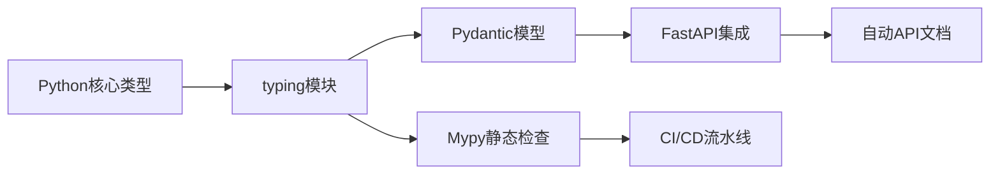

扫描[二维码](https://api2.cmdragon.cn/upload/cmder/20250304_012821924.jpg)
关注或者微信搜一搜：`编程智域 前端至全栈交流与成长`

🔥 深入解析类型系统的底层原理与工程实践。你将掌握：

- 类型注解的7种高级写法（含泛型/嵌套类型/异步类型）
- Pydantic与FastAPI的深度类型集成技巧
- 10个常见类型错误的诊断与修复方案
- 类型驱动开发（TDD）在大型项目中的落地实践

#### 🚀 第一章：类型革命——为什么你的代码需要类型提示？

**1.1 从血泪案例看动态类型陷阱**

```python  
# 线上事故复盘：类型错误导致的数据污染  
def calculate_tax(income):
    return income * 0.2 + 500


# 调用时传入字符串参数  
print(calculate_tax("100000"))  # 返回"100000000.0"，静默错误！  
```  

✅ **类型提示解决方案**：

```python  
def calculate_tax(income: int | float) -> float:
    return float(income) * 0.2 + 500  
```  

📌 **优势对比**：

| 指标     | 无类型提示 | 有类型提示 |  
|--------|-------|-------|  
| 错误发现时机 | 运行时   | 编码时   |  
| 代码可读性  | 低     | 自文档化  |  
| 重构安全性  | 高风险   | IDE保障 |  

**1.2 类型生态系统全景图**



---

#### 🛠 第二章：类型语法精要——从青铜到王者

**2.1 基础类型三阶训练**

```python  
# 青铜：简单注解  
def greet(name: str) -> str:
    return f"Hello {name}"


# 白银：联合类型与可选参数  
from typing import Union, Optional


def parse_input(value: Union[int, str]) -> Optional[float]:
    try:
        return float(value)
    except ValueError:
        return None

    # 王者：类型别名与回调函数  


from typing import TypeAlias, Callable

Vector = TypeAlias("Vector", list[float])
OnSuccess = Callable[[Vector], None]


def process_data(data: Vector, callback: OnSuccess) -> None:
    # ...处理逻辑...  
    callback(normalized_data)  
```  

**2.2 泛型编程深度解析**

```python  
from typing import Generic, TypeVar, Iterable

T = TypeVar('T', bound=Comparable)


class PriorityQueue(Generic[T]):
    def __init__(self, items: Iterable[T]) -> None:
        self._items = sorted(items)

    def pop(self) -> T:
        return self._items.pop(0)

    # 使用示例  


pq_int = PriorityQueue([5, 2, 8])
pq_str = PriorityQueue(["apple", "banana"])  # 自动类型推导  
```  

🔍 **设计原理**：

- 通过`TypeVar`定义类型变量
- `bound`参数约束允许的类型范围
- 实现通用数据结构的类型安全

---

#### 🧩 第三章：嵌套类型与领域建模

**3.1 复杂数据结构建模**

```python  
from typing import TypedDict, Literal
from datetime import datetime


class GeoPoint(TypedDict):
    lat: float
    lng: float
    precision: Literal["low", "medium", "high"]


class UserActivity(TypedDict):
    user_id: int
    locations: list[GeoPoint]
    last_active: datetime


def analyze_activity(activity: UserActivity) -> dict[str, int]:
# 实现分析逻辑...  
```  

📊 **类型可视化**：

```json  
{
  "user_id": 123,
  "locations": [
    {
      "lat": 40.7128,
      "lng": -74.0060,
      "precision": "high"
    }
    // ...更多坐标点  
  ],
  "last_active": "2023-08-20T14:30:00"
}  
```  

**3.2 与Pydantic的化学反应**

```python  
from pydantic import BaseModel, conint, EmailStr
from typing import Annotated


class Address(BaseModel):
    street: str
    city: str
    zip_code: Annotated[str, Field(pattern=r"^\d{6}$")]


class UserProfile(BaseModel):
    name: str
    age: conint(gt=0)
    email: EmailStr
    addresses: list[Address]  
```  

✅ **验证过程**：

1. 自动转换输入数据类型
2. 递归验证嵌套模型
3. 生成JSON Schema文档

---

#### 🛡 第四章：类型安全防御——从SQL注入到数据污染

**4.1 参数化查询的类型屏障**

```python  
from typing import Annotated
from fastapi import Query


@app.get("/search")
def safe_search(
        keyword: Annotated[str, Query(min_length=2)]
) -> list[Product]:
    # 正确做法  
    query = "SELECT * FROM products WHERE name LIKE :name"
    params = {"name": f"%{keyword}%"}
    results = db.execute(query, params)
    return parse_products(results)  
```  

❌ **危险写法**：

```python  
def unsafe_search(keyword: str):
    # SQL注入漏洞！  
    db.execute(f"SELECT * FROM products WHERE name = '{keyword}'")  
```  

**4.2 课后实战任务**

1. 将以下危险代码改造为类型安全版本：
   ```python  
   def user_login(username: str, raw_password: str):  
       query = f"SELECT * FROM users WHERE username='{username}' AND password='{raw_password}'"  
       return db.execute(query)  
   ```  
2. 使用Pydantic模型验证密码复杂度

---

#### 🚨 第五章：错误诊疗室——从报错到精通

**5.1 422 Validation Error全解**

```python  
# 错误触发场景  
@app.post("/users")
def create_user(user: UserProfile):
    ...


# 发送非法请求体  
{
    "name": "Alice",
    "age": -5,
    "email": "invalid-email",
    "addresses": [{"street": "Main St", "city": "NYC"}]
}  
```  

🔧 **排查步骤**：

1. 查看Swagger文档验证规则
2. 使用`try: user = UserProfile(**data)`捕获异常
3. 检查错误详情中的`loc`和`msg`字段

**5.2 Mypy错误代码**

| 错误代码                                    | 含义       | 修复示例                   |  
|-----------------------------------------|----------|------------------------|  
| error: Missing return statement         | 函数缺少返回语句 | 添加`return`或声明`-> None` |  
| error: Incompatible types in assignment | 类型不匹配    | 检查变量赋值的一致性             |  

---

### 结语

现在，您可以将任意Python代码升级为类型安全的工业级实现。记住：优秀的开发者不是不会犯错，而是通过工具让错误无处遁形！

余下文章内容请点击跳转至 个人博客页面 或者 扫码关注或者微信搜一搜：`编程智域 前端至全栈交流与成长`，阅读完整的文章：

## 往期文章归档：

- [三大平台云数据库生态服务对决 | cmdragon's Blog](https://blog.cmdragon.cn/posts/acbd74fc659aaa3d2e0c76387bc3e2d5/)
- [分布式数据库解析 | cmdragon's Blog](https://blog.cmdragon.cn/posts/4c553fe22df1e15c19d37a7dc10c5b3a/)
- [深入解析NoSQL数据库：从文档存储到图数据库的全场景实践 | cmdragon's Blog](https://blog.cmdragon.cn/posts/deed11eed0f84c915ed9e9d5aad6c06d/)
- [数据库审计与智能监控：从日志分析到异常检测 | cmdragon's Blog](https://blog.cmdragon.cn/posts/9c2a135562a18261d70cc5637df435e5/)
- [数据库加密全解析：从传输到存储的安全实践 | cmdragon's Blog](https://blog.cmdragon.cn/posts/123dc22a37df8d53292d1269e39dbbc0/)
- [数据库安全实战：访问控制与行级权限管理 | cmdragon's Blog](https://blog.cmdragon.cn/posts/a49721363d1cea8f5fac980120f52242/)
- [数据库扩展之道：分区、分片与大表优化实战 | cmdragon's Blog](https://blog.cmdragon.cn/posts/ed72acd868f765d0ffbced2236b90190/)
- [查询优化：提升数据库性能的实用技巧 | cmdragon's Blog](https://blog.cmdragon.cn/posts/c2b225e3d0b1e9de613fde47b1d4cacb/)
- [性能优化与调优：全面解析数据库索引 | cmdragon's Blog](https://blog.cmdragon.cn/posts/8dece2eb47ac87272320e579cc6f8591/)
- [存储过程与触发器：提高数据库性能与安全性的利器 | cmdragon's Blog](https://blog.cmdragon.cn/posts/712adcfc99736718e1182040d70fd36b/)
- [数据操作与事务：确保数据一致性的关键 | cmdragon's Blog](https://blog.cmdragon.cn/posts/aff107a909f04dc52a887b45e9bd2484/)
- [深入掌握 SQL 深度应用：复杂查询的艺术与技巧 | cmdragon's Blog](https://blog.cmdragon.cn/posts/0f0a929119a4799c8ea1e087e592c545/)
- [彻底理解数据库设计原则：生命周期、约束与反范式的应用 | cmdragon's Blog](https://blog.cmdragon.cn/posts/934686b6ed93e241883a74eaf236bc96/)
- [深入剖析实体-关系模型（ER 图）：理论与实践全解析 | cmdragon's Blog](https://blog.cmdragon.cn/posts/ec68b3f706bd0db1585b4d150de54100/)
- [数据库范式详解：从第一范式到第五范式 | cmdragon's Blog](https://blog.cmdragon.cn/posts/2b268e76c15d9640a08fed80fccfc562/)
- [PostgreSQL：数据库迁移与版本控制 | cmdragon's Blog](https://blog.cmdragon.cn/posts/649f515b93a6caee9dc38f1249e9216e/)
- [Node.js 与 PostgreSQL 集成：深入 pg 模块的应用与实践 | cmdragon's Blog](https://blog.cmdragon.cn/posts/4798cc064cc3585a3819636b3c23271b/)
- [Python 与 PostgreSQL 集成：深入 psycopg2 的应用与实践 | cmdragon's Blog](https://blog.cmdragon.cn/posts/e533225633ac9f276b7771c03e1ba5e0/)
- [应用中的 PostgreSQL项目案例 | cmdragon's Blog](https://blog.cmdragon.cn/posts/415ac1ac3cb9593b00d398c26b40c768/)
- [数据库安全管理中的权限控制：保护数据资产的关键措施 | cmdragon's Blog](https://blog.cmdragon.cn/posts/42a3ec4c7e9cdded4e3c4db24fb4dad8/)
- [数据库安全管理中的用户和角色管理：打造安全高效的数据环境 | cmdragon's Blog](https://blog.cmdragon.cn/posts/92d56b1325c898ad3efc89cb2b42d84d/)
- [数据库查询优化：提升性能的关键实践 | cmdragon's Blog](https://blog.cmdragon.cn/posts/b87998b03d2638a19ecf589691b6f0ae/)
- [数据库物理备份：保障数据完整性和业务连续性的关键策略 | cmdragon's Blog](https://blog.cmdragon.cn/posts/5399d4194db9a94b2649763cb81284de/)
- [PostgreSQL 数据备份与恢复：掌握 pg_dump 和 pg_restore 的最佳实践 | cmdragon's Blog](https://blog.cmdragon.cn/posts/8a8458533590f193798bc31bfbcb0944/)
- [索引的性能影响：优化数据库查询与存储的关键 | cmdragon's Blog](https://blog.cmdragon.cn/posts/29b4baf97a92b0c02393f258124ca713/)
- [深入探讨数据库索引类型：B-tree、Hash、GIN与GiST的对比与应用 | cmdragon's Blog](https://blog.cmdragon.cn/posts/0095ca05c7ea7fbeec5f3a9990bd5264/)
- [深入探讨触发器的创建与应用：数据库自动化管理的强大工具 | cmdragon's Blog](https://blog.cmdragon.cn/posts/5ea59ab7a93ecbdb4baea9dec29a6010/)
- [深入探讨存储过程的创建与应用：提高数据库管理效率的关键工具 | cmdragon's Blog](https://blog.cmdragon.cn/posts/570cd68087f5895415ab3f94980ecc84/)
- [深入探讨视图更新：提升数据库灵活性的关键技术 | cmdragon's Blog](https://blog.cmdragon.cn/posts/625cecdc44e4c4e7b520ddb3012635d1/)
- [深入理解视图的创建与删除：数据库管理中的高级功能 | cmdragon's Blog](https://blog.cmdragon.cn/posts/c5b46d10b7686bbe57b20cd9e181c56b/)
- [深入理解检查约束：确保数据质量的重要工具 | cmdragon's Blog](https://blog.cmdragon.cn/posts/309f74bd85c733fb7a2cd79990d7af9b/)
- [深入理解第一范式（1NF）：数据库设计中的基础与实践 | cmdragon's Blog](https://blog.cmdragon.cn/posts/0ba4cbf2dd926750d5421e9d415ecc88/)
- [深度剖析 GROUP BY 和 HAVING 子句：优化 SQL 查询的利器 | cmdragon's Blog](https://blog.cmdragon.cn/posts/45ed09822a8220aa480f67c0e3225a7e/)
- [深入探讨聚合函数（COUNT, SUM, AVG, MAX, MIN）：分析和总结数据的新视野 | cmdragon's Blog](https://blog.cmdragon.cn/posts/27d8b24508379d4e5d4ae97873aa9397/)
- [深入解析子查询（SUBQUERY）：增强 SQL 查询灵活性的强大工具 | cmdragon's Blog](https://blog.cmdragon.cn/posts/3fb3175a31a273d40bef042297f877ad/)
-

## 免费好用的热门在线工具

- [CMDragon 在线工具 - 高级AI工具箱与开发者套件 | 免费好用的在线工具](https://tools.cmdragon.cn/zh)
- [应用商店 - 发现1000+提升效率与开发的AI工具和实用程序 | 免费好用的在线工具](https://tools.cmdragon.cn/zh/apps?category=trending)
- [CMDragon 更新日志 - 最新更新、功能与改进 | 免费好用的在线工具](https://tools.cmdragon.cn/zh/changelog)
- [支持我们 - 成为赞助者 | 免费好用的在线工具](https://tools.cmdragon.cn/zh/sponsor)
- [AI文本生成图像 - 应用商店 | 免费好用的在线工具](https://tools.cmdragon.cn/zh/apps/text-to-image-ai)
- [临时邮箱 - 应用商店 | 免费好用的在线工具](https://tools.cmdragon.cn/zh/apps/temp-email)
- [二维码解析器 - 应用商店 | 免费好用的在线工具](https://tools.cmdragon.cn/zh/apps/qrcode-parser)
- [文本转思维导图 - 应用商店 | 免费好用的在线工具](https://tools.cmdragon.cn/zh/apps/text-to-mindmap)
- [正则表达式可视化工具 - 应用商店 | 免费好用的在线工具](https://tools.cmdragon.cn/zh/apps/regex-visualizer)
- [文件隐写工具 - 应用商店 | 免费好用的在线工具](https://tools.cmdragon.cn/zh/apps/steganography-tool)
- [IPTV 频道探索器 - 应用商店 | 免费好用的在线工具](https://tools.cmdragon.cn/zh/apps/iptv-explorer)
- [快传 - 应用商店 | 免费好用的在线工具](https://tools.cmdragon.cn/zh/apps/snapdrop)
- [随机抽奖工具 - 应用商店 | 免费好用的在线工具](https://tools.cmdragon.cn/zh/apps/lucky-draw)
- [动漫场景查找器 - 应用商店 | 免费好用的在线工具](https://tools.cmdragon.cn/zh/apps/anime-scene-finder)
- [时间工具箱 - 应用商店 | 免费好用的在线工具](https://tools.cmdragon.cn/zh/apps/time-toolkit)
- [网速测试 - 应用商店 | 免费好用的在线工具](https://tools.cmdragon.cn/zh/apps/speed-test)
- [AI 智能抠图工具 - 应用商店 | 免费好用的在线工具](https://tools.cmdragon.cn/zh/apps/background-remover)
- [背景替换工具 - 应用商店 | 免费好用的在线工具](https://tools.cmdragon.cn/zh/apps/background-replacer)
- [艺术二维码生成器 - 应用商店 | 免费好用的在线工具](https://tools.cmdragon.cn/zh/apps/artistic-qrcode)
- [Open Graph 元标签生成器 - 应用商店 | 免费好用的在线工具](https://tools.cmdragon.cn/zh/apps/open-graph-generator)
- [图像对比工具 - 应用商店 | 免费好用的在线工具](https://tools.cmdragon.cn/zh/apps/image-comparison)
- [图片压缩专业版 - 应用商店 | 免费好用的在线工具](https://tools.cmdragon.cn/zh/apps/image-compressor)
- [密码生成器 - 应用商店 | 免费好用的在线工具](https://tools.cmdragon.cn/zh/apps/password-generator)
- [SVG优化器 - 应用商店 | 免费好用的在线工具](https://tools.cmdragon.cn/zh/apps/svg-optimizer)
- [调色板生成器 - 应用商店 | 免费好用的在线工具](https://tools.cmdragon.cn/zh/apps/color-palette)
- [在线节拍器 - 应用商店 | 免费好用的在线工具](https://tools.cmdragon.cn/zh/apps/online-metronome)
- [IP归属地查询 - 应用商店 | 免费好用的在线工具](https://tools.cmdragon.cn/zh/apps/ip-geolocation)
- [CSS网格布局生成器 - 应用商店 | 免费好用的在线工具](https://tools.cmdragon.cn/zh/apps/css-grid-layout)
- [邮箱验证工具 - 应用商店 | 免费好用的在线工具](https://tools.cmdragon.cn/zh/apps/email-validator)
- [书法练习字帖 - 应用商店 | 免费好用的在线工具](https://tools.cmdragon.cn/zh/apps/calligraphy-practice)
- [金融计算器套件 - 应用商店 | 免费好用的在线工具](https://tools.cmdragon.cn/zh/apps/finance-calculator-suite)
- [中国亲戚关系计算器 - 应用商店 | 免费好用的在线工具](https://tools.cmdragon.cn/zh/apps/chinese-kinship-calculator)
- [Protocol Buffer 工具箱 - 应用商店 | 免费好用的在线工具](https://tools.cmdragon.cn/zh/apps/protobuf-toolkit)
- [IP归属地查询 - 应用商店 | 免费好用的在线工具](https://tools.cmdragon.cn/zh/apps/ip-geolocation)
- [图片无损放大 - 应用商店 | 免费好用的在线工具](https://tools.cmdragon.cn/zh/apps/image-upscaler)
- [文本比较工具 - 应用商店 | 免费好用的在线工具](https://tools.cmdragon.cn/zh/apps/text-compare)
- [IP批量查询工具 - 应用商店 | 免费好用的在线工具](https://tools.cmdragon.cn/zh/apps/ip-batch-lookup)
- [域名查询工具 - 应用商店 | 免费好用的在线工具](https://tools.cmdragon.cn/zh/apps/domain-finder)
- [DNS工具箱 - 应用商店 | 免费好用的在线工具](https://tools.cmdragon.cn/zh/apps/dns-toolkit)
- [网站图标生成器 - 应用商店 | 免费好用的在线工具](https://tools.cmdragon.cn/zh/apps/favicon-generator)
- [XML Sitemap](https://tools.cmdragon.cn/sitemap_index.xml)