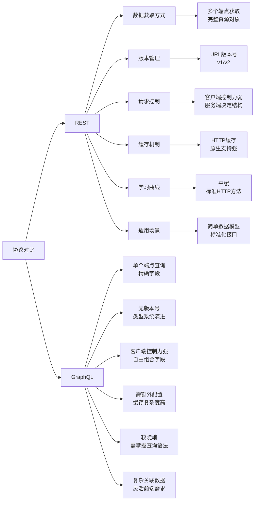

扫描[二维码](https://api2.cmdragon.cn/upload/cmder/20250304_012821924.jpg)
关注或者微信搜一搜：`编程智域 前端至全栈交流与成长`

[发现1000+提升效率与开发的AI工具和实用程序](https://tools.cmdragon.cn/zh/apps?category=ai_chat)：https://tools.cmdragon.cn/

## 一、核心概念与技术对比

### （一）REST架构基础

基于HTTP协议的标准架构模式，采用资源导向设计理念。在FastAPI中，REST接口通过路径操作装饰器实现：

```python
# 依赖库版本：fastapi==0.68.0, pydantic==1.10.7
from fastapi import FastAPI
from pydantic import BaseModel

app = FastAPI()


class User(BaseModel):
    id: int
    name: str
    email: str


users_db = {1: User(id=1, name="Alice", email="alice@example.com")}


@app.get("/users/{user_id}")
async def get_user(user_id: int):
    return users_db.get(user_id)
```

该实现展示了典型的RESTful端点设计，通过URL路径参数定位资源。请求示例：

```http
GET /users/1 HTTP/1.1
```

### （二）GraphQL运行机制

基于类型系统的查询语言，采用单端点设计。FastAPI集成Strawberry实现GraphQL服务：

```python
# 依赖库版本：strawberry-graphql==0.9.4
import strawberry
from fastapi import FastAPI
from strawberry.asgi import GraphQL


@strawberry.type
class User:
    id: int
    name: str
    email: str


@strawberry.type
class Query:
    @strawberry.field
    def user(self, id: int) -> User:
        return User(id=id, name="Bob", email="bob@example.com")


schema = strawberry.Schema(query=Query)
graphql_app = GraphQL(schema)

app = FastAPI()
app.add_route("/graphql", graphql_app)
```

查询示例：

```graphql
query {
  user(id: 1) {
    name
    email
  }
}
```

### （三）协议对比矩阵



| 特性   | REST API | GraphQL  |
|------|----------|----------|
| 请求端点 | 多端点      | 单端点      |
| 数据获取 | 多个请求     | 单请求获取    |
| 响应结构 | 服务端定义    | 客户端定义    |
| 版本管理 | URL版本控制  | Schema演化 |
| 错误处理 | HTTP状态码  | 自定义错误格式  |
| 缓存机制 | 浏览器级缓存   | 需自定义实现   |

## 二、技术实现对比

### （一）数据获取模式

REST接口的典型嵌套数据获取需要多个请求：

```http
GET /users/1
GET /users/1/orders
GET /orders/5/items
```

GraphQL单次查询实现相同效果：

```graphql
query {
  user(id: 1) {
    orders {
      items {
        productId
        quantity
      }
    }
  }
}
```

### （二）类型系统实现

FastAPI使用Pydantic模型验证数据格式：

```python
class OrderCreate(BaseModel):
    user_id: int
    items: List[Item]


@app.post("/orders")
async def create_order(order: OrderCreate):
    return process_order(order)
```

GraphQL的类型定义：

```python
@strawberry.input
class OrderInput:
    user_id: int
    items: List[ItemInput]
```

### （三）性能基准测试

使用Locust进行压力测试（100并发用户）：

| 场景          | RPS  | 平均延迟  |
|-------------|------|-------|
| REST简单查询    | 3420 | 29ms  |
| GraphQL简单查询 | 2980 | 33ms  |
| REST复杂关联查询  | 520  | 192ms |
| GraphQL复杂查询 | 890  | 112ms |

## 三、混合架构实践

### （一）网关层集成方案

```python
from fastapi import APIRouter

router = APIRouter()


# REST端点
@router.get("/legacy/users")
async def get_legacy_users():
    return [...]


# GraphQL端点
router.add_route("/graphql", graphql_app)
```

### （二）查询优化策略

使用DataLoader解决N+1查询问题：

```python
from strawberry.dataloader import DataLoader


async def load_users(keys):
    return [await fetch_user(k) for k in keys]


loader = DataLoader(load_fn=load_users)


@strawberry.type
class Query:
    @strawberry.field
    async def user(self, id: int) -> User:
        return await loader.load(id)
```

## 四、课后练习

1. 在REST接口中如何实现类似GraphQL的字段选择功能？
    - 参考答案：使用查询参数指定返回字段，如`?fields=name,email`，在响应处理层进行字段过滤

2. GraphQL查询可能引发哪些性能问题？
    - 参考答案：深度嵌套查询导致数据库复杂连接、未授权的复杂查询消耗过多资源

## 五、异常处理指南

### （一）422验证错误

**典型场景**：

```http
POST /users
Content-Type: application/json

{"name": "Alice"}
```

**解决方案**：

1. 检查Pydantic模型字段要求
2. 添加默认值处理可选参数：

```python
class UserCreate(BaseModel):
    name: str
    email: str = None
```

### （二）GraphQL执行错误

**错误特征**：

```json
{
  "errors": [
    {
      "message": "Cannot query field 'phone' on type 'User'"
    }
  ]
}
```

**处理步骤**：

1. 检查Schema定义是否包含请求字段
2. 使用Introspection查询验证类型定义
3. 添加字段缺失的默认处理程序

### （三）依赖安装指引

```bash
pip install fastapi==0.68.0 \
    pydantic==1.10.7 \
    strawberry-graphql==0.9.4 \
    uvicorn==0.15.0
```

### （四）服务启动命令

```bash
uvicorn main:app --reload --port 8000
```

余下文章内容请点击跳转至 个人博客页面 或者 扫码关注或者微信搜一搜：`编程智域 前端至全栈交流与成长`
，阅读完整的文章：[REST和GraphQL究竟谁才是API设计的终极赢家？](https://blog.cmdragon.cn/posts/218ad2370eab6197f42fdc9c52f0fc19/)

## 往期文章归档：

- [IoT设备的OTA升级是如何通过MQTT协议实现无缝对接的？ - cmdragon's Blog](https://blog.cmdragon.cn/posts/071e9a3b9792beea63f134f5ad28df67/)
- [如何在FastAPI中玩转STOMP协议升级，让你的消息传递更高效？ - cmdragon's Blog](https://blog.cmdragon.cn/posts/16744b2f460346805c45314bc0c6f751/)
- [如何用WebSocket打造毫秒级实时协作系统？ - cmdragon's Blog](https://blog.cmdragon.cn/posts/da5b64cb0ded23e4d5b1f19ffd5ac53d/)
- [如何用WebSocket打造毫秒级实时协作系统？ - cmdragon's Blog](https://blog.cmdragon.cn/posts/da5b64cb0ded23e4d5b1f19ffd5ac53d/)
- [如何让你的WebSocket连接既安全又高效？](https://blog.cmdragon.cn/posts/eb598d50b76ea1823746ab7cdf49ce05/)
- [如何让多客户端会话管理不再成为你的技术噩梦？ - cmdragon's Blog](https://blog.cmdragon.cn/posts/08ba771dbb2eec087c4bc6dc584113c5/)
- [如何在FastAPI中玩转WebSocket消息处理？](https://blog.cmdragon.cn/posts/fbf7d6843e430133547057254deb2dfb/)
- [如何在FastAPI中玩转WebSocket，让实时通信不再烦恼？ - cmdragon's Blog](https://blog.cmdragon.cn/posts/0faebb0f6c2b1bde4ba75869f4f67b76/)
- [WebSocket与HTTP协议究竟有何不同？FastAPI如何让长连接变得如此简单？ - cmdragon's Blog](https://blog.cmdragon.cn/posts/903448c85701a6a747fc9a4417e2bdc8/)
- [FastAPI如何玩转安全防护，让黑客望而却步？](https://blog.cmdragon.cn/posts/c1314c623211c9269f36053179a53d5c/)
- [如何用三层防护体系打造坚不可摧的 API 安全堡垒？ - cmdragon's Blog](https://blog.cmdragon.cn/posts/0bbb4a455ef36bf6f81ac97189586fda/#%E4%B8%80jwt-%E8%AE%A4%E8%AF%81%E8%81%94%E8%B0%83%E6%96%B9%E6%A1%88)
- [FastAPI安全加固：密钥轮换、限流策略与安全头部如何实现三重防护？ - cmdragon's Blog](https://blog.cmdragon.cn/posts/f96ba438de34dc197fd2598f91ae133d/)
- [如何在FastAPI中巧妙玩转数据脱敏，让敏感信息安全无忧？ - cmdragon's Blog](https://blog.cmdragon.cn/posts/045021f8831a03bcdf71e44cb793baf4/)
- [RBAC权限模型如何让API访问控制既安全又灵活？ - cmdragon's Blog](https://blog.cmdragon.cn/posts/9f01e838545ae8d34016c759ef461423/)
- [FastAPI中的敏感数据如何在不泄露的情况下翩翩起舞？](https://blog.cmdragon.cn/posts/88e8615e4c961e7a4f0ef31c0e41cb0b/)
- [FastAPI安全认证的终极秘籍：OAuth2与JWT如何完美融合？ - cmdragon's Blog](https://blog.cmdragon.cn/posts/17d5c40ff6c84ad652f962fed0ce46ab/)
- [如何在FastAPI中打造坚不可摧的Web安全防线？ - cmdragon's Blog](https://blog.cmdragon.cn/posts/9d6200ae7ce0a1a1a523591e3d65a82e/)
- [如何用 FastAPI 和 RBAC 打造坚不可摧的安全堡垒？ - cmdragon's Blog](https://blog.cmdragon.cn/posts/d878b5dbef959058b8098551c70594f8/)
- [FastAPI权限配置：你的系统真的安全吗？ - cmdragon's Blog](https://blog.cmdragon.cn/posts/96b6ede65030daa4613ab92da1d739a6/#%E5%BE%80%E6%9C%9F%E6%96%87%E7%AB%A0%E5%BD%92%E6%A1%A3)
- [FastAPI权限缓存：你的性能瓶颈是否藏在这只“看不见的手”里？ | cmdragon's Blog](https://blog.cmdragon.cn/posts/0c8c5a3fdaf69250ac3db7429b102625/)
- [FastAPI日志审计：你的权限系统是否真的安全无虞？ | cmdragon's Blog](https://blog.cmdragon.cn/posts/84bf7b11b342415bddb50e0521c64dfe/)
- [如何在FastAPI中打造坚不可摧的安全防线？ | cmdragon's Blog](https://blog.cmdragon.cn/posts/e2ec1e31dd5d97e0f32d2125385fd955/)
- [如何在FastAPI中实现权限隔离并让用户乖乖听话？ | cmdragon's Blog](https://blog.cmdragon.cn/posts/74777546a240b16b32196e5eb29ec8f7/)
- [如何在FastAPI中玩转权限控制与测试，让代码安全又优雅？ | cmdragon's Blog](https://blog.cmdragon.cn/posts/9dd24a9753ba15f98f24c1e5134fe40e/)
- [如何在FastAPI中打造一个既安全又灵活的权限管理系统？ | cmdragon's Blog](https://blog.cmdragon.cn/posts/277aa1628a2fa9855cdfe5f7c302bd92/)
- [FastAPI访问令牌的权限声明与作用域管理：你的API安全真的无懈可击吗？ | cmdragon's Blog](https://blog.cmdragon.cn/posts/82bae833ad460aec0965cc77b7d6f652/)
- [如何在FastAPI中构建一个既安全又灵活的多层级权限系统？ | cmdragon's Blog](https://blog.cmdragon.cn/posts/13fc113ef1dff03927d46235ad333a7f/)
- [FastAPI如何用角色权限让Web应用安全又灵活？ | cmdragon's Blog](https://blog.cmdragon.cn/posts/cc7aa0af577ae2bc0694e76886373e12/)
- [FastAPI权限验证依赖项究竟藏着什么秘密？ | cmdragon's Blog](https://blog.cmdragon.cn/posts/3e287e8b907561728ded1be34a19b22c/)
- [如何用FastAPI和Tortoise-ORM打造一个既高效又灵活的角色管理系统？ | cmdragon's Blog](https://blog.cmdragon.cn/posts/2b0a2003074eba56a6f6c57aa9690900/)
- [JWT令牌如何在FastAPI中实现安全又高效的生成与验证？ | cmdragon's Blog](https://blog.cmdragon.cn/posts/031a4b22bb8d624cf23ef593f72d1ec6/)
- [你的密码存储方式是否在向黑客招手？ | cmdragon's Blog](https://blog.cmdragon.cn/posts/5f8821250c5a4e9cc08bd08faef76c77/)
- [如何在FastAPI中轻松实现OAuth2认证并保护你的API？ | cmdragon's Blog](https://blog.cmdragon.cn/posts/c290754b532ebf91c5415aa0b30715d0/)
- [FastAPI安全机制：从OAuth2到JWT的魔法通关秘籍 | cmdragon's Blog](https://blog.cmdragon.cn/posts/30ed200ec25b55e1ba159366401ed6ee/)
- [FastAPI认证系统：从零到令牌大师的奇幻之旅 | cmdragon's Blog](https://blog.cmdragon.cn/posts/69f7189d3ff058334889eb2e02f2ea2c/)
- [FastAPI安全异常处理：从401到422的奇妙冒险 | cmdragon's Blog](https://blog.cmdragon.cn/posts/92a7a3de40eb9ce71620716632f68676/)

## 免费好用的热门在线工具

- [CMDragon 在线工具 - 高级AI工具箱与开发者套件 | 免费好用的在线工具](https://tools.cmdragon.cn/zh)
- [应用商店 - 发现1000+提升效率与开发的AI工具和实用程序 | 免费好用的在线工具](https://tools.cmdragon.cn/zh/apps?category=trending)
- [CMDragon 更新日志 - 最新更新、功能与改进 | 免费好用的在线工具](https://tools.cmdragon.cn/zh/changelog)
- [支持我们 - 成为赞助者 | 免费好用的在线工具](https://tools.cmdragon.cn/zh/sponsor)
- [AI文本生成图像 - 应用商店 | 免费好用的在线工具](https://tools.cmdragon.cn/zh/apps/text-to-image-ai)
- [临时邮箱 - 应用商店 | 免费好用的在线工具](https://tools.cmdragon.cn/zh/apps/temp-email)
- [二维码解析器 - 应用商店 | 免费好用的在线工具](https://tools.cmdragon.cn/zh/apps/qrcode-parser)
- [文本转思维导图 - 应用商店 | 免费好用的在线工具](https://tools.cmdragon.cn/zh/apps/text-to-mindmap)
- [正则表达式可视化工具 - 应用商店 | 免费好用的在线工具](https://tools.cmdragon.cn/zh/apps/regex-visualizer)
- [文件隐写工具 - 应用商店 | 免费好用的在线工具](https://tools.cmdragon.cn/zh/apps/steganography-tool)
- [IPTV 频道探索器 - 应用商店 | 免费好用的在线工具](https://tools.cmdragon.cn/zh/apps/iptv-explorer)
- [快传 - 应用商店 | 免费好用的在线工具](https://tools.cmdragon.cn/zh/apps/snapdrop)
- [随机抽奖工具 - 应用商店 | 免费好用的在线工具](https://tools.cmdragon.cn/zh/apps/lucky-draw)
- [动漫场景查找器 - 应用商店 | 免费好用的在线工具](https://tools.cmdragon.cn/zh/apps/anime-scene-finder)
- [时间工具箱 - 应用商店 | 免费好用的在线工具](https://tools.cmdragon.cn/zh/apps/time-toolkit)
- [网速测试 - 应用商店 | 免费好用的在线工具](https://tools.cmdragon.cn/zh/apps/speed-test)
- [AI 智能抠图工具 - 应用商店 | 免费好用的在线工具](https://tools.cmdragon.cn/zh/apps/background-remover)
- [背景替换工具 - 应用商店 | 免费好用的在线工具](https://tools.cmdragon.cn/zh/apps/background-replacer)
- [艺术二维码生成器 - 应用商店 | 免费好用的在线工具](https://tools.cmdragon.cn/zh/apps/artistic-qrcode)
- [Open Graph 元标签生成器 - 应用商店 | 免费好用的在线工具](https://tools.cmdragon.cn/zh/apps/open-graph-generator)
- [图像对比工具 - 应用商店 | 免费好用的在线工具](https://tools.cmdragon.cn/zh/apps/image-comparison)
- [图片压缩专业版 - 应用商店 | 免费好用的在线工具](https://tools.cmdragon.cn/zh/apps/image-compressor)
- [密码生成器 - 应用商店 | 免费好用的在线工具](https://tools.cmdragon.cn/zh/apps/password-generator)
- [SVG优化器 - 应用商店 | 免费好用的在线工具](https://tools.cmdragon.cn/zh/apps/svg-optimizer)
- [调色板生成器 - 应用商店 | 免费好用的在线工具](https://tools.cmdragon.cn/zh/apps/color-palette)
- [在线节拍器 - 应用商店 | 免费好用的在线工具](https://tools.cmdragon.cn/zh/apps/online-metronome)
- [IP归属地查询 - 应用商店 | 免费好用的在线工具](https://tools.cmdragon.cn/zh/apps/ip-geolocation)
- [CSS网格布局生成器 - 应用商店 | 免费好用的在线工具](https://tools.cmdragon.cn/zh/apps/css-grid-layout)
- [邮箱验证工具 - 应用商店 | 免费好用的在线工具](https://tools.cmdragon.cn/zh/apps/email-validator)
- [书法练习字帖 - 应用商店 | 免费好用的在线工具](https://tools.cmdragon.cn/zh/apps/calligraphy-practice)
- [金融计算器套件 - 应用商店 | 免费好用的在线工具](https://tools.cmdragon.cn/zh/apps/finance-calculator-suite)
- [中国亲戚关系计算器 - 应用商店 | 免费好用的在线工具](https://tools.cmdragon.cn/zh/apps/chinese-kinship-calculator)
- [Protocol Buffer 工具箱 - 应用商店 | 免费好用的在线工具](https://tools.cmdragon.cn/zh/apps/protobuf-toolkit)
- [IP归属地查询 - 应用商店 | 免费好用的在线工具](https://tools.cmdragon.cn/zh/apps/ip-geolocation)
- [图片无损放大 - 应用商店 | 免费好用的在线工具](https://tools.cmdragon.cn/zh/apps/image-upscaler)
- [文本比较工具 - 应用商店 | 免费好用的在线工具](https://tools.cmdragon.cn/zh/apps/text-compare)
- [IP批量查询工具 - 应用商店 | 免费好用的在线工具](https://tools.cmdragon.cn/zh/apps/ip-batch-lookup)
- [域名查询工具 - 应用商店 | 免费好用的在线工具](https://tools.cmdragon.cn/zh/apps/domain-finder)
- [DNS工具箱 - 应用商店 | 免费好用的在线工具](https://tools.cmdragon.cn/zh/apps/dns-toolkit)
- [网站图标生成器 - 应用商店 | 免费好用的在线工具](https://tools.cmdragon.cn/zh/apps/favicon-generator)
- [XML Sitemap](https://tools.cmdragon.cn/sitemap_index.xml)