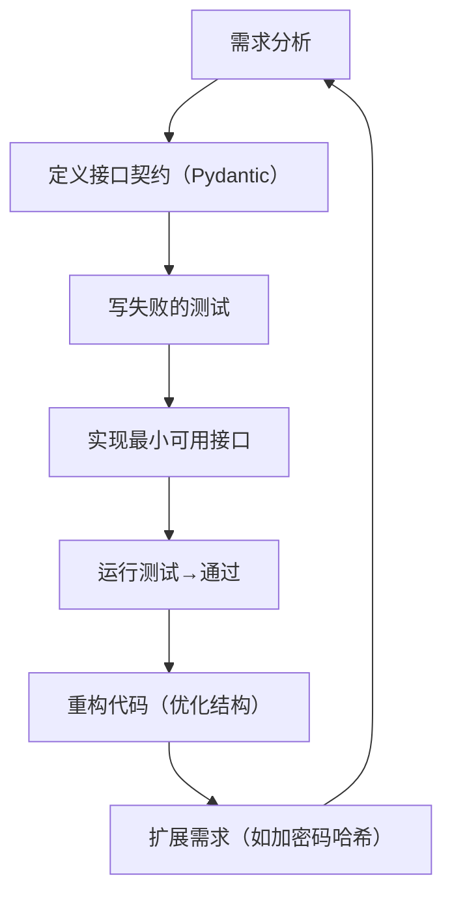

扫描[二维码](https://api2.cmdragon.cn/upload/cmder/20250304_012821924.jpg)
关注或者微信搜一搜：`编程智域 前端至全栈交流与成长`

[发现1000+提升效率与开发的AI工具和实用程序](https://tools.cmdragon.cn/zh/apps?category=ai_chat)：https://tools.cmdragon.cn/

### 1. 迭代式接口开发验证流程的核心逻辑

#### 1.1 什么是“迭代式”？

迭代式开发不是“一次性写完所有功能”，而是把接口拆成**多个小周期**
：每个周期只解决一个具体问题（比如“实现用户创建”→“加密码哈希”→“加邮箱唯一性校验”），每个周期都遵循“定义契约→写测试→实现功能→重构”的闭环。这种方式的好处是
**风险可控**——每一步都能验证功能正确性，避免最后发现“全盘错误”的情况。

#### 1.2 FastAPI下的TDD适配：从接口契约到测试

FastAPI的**类型提示**和**Pydantic模型**天然支持TDD的“契约优先”原则。接口的“契约”就是**请求/响应的数据格式**
（比如“创建用户需要传哪些字段？返回哪些字段？”），而Pydantic模型就是这个契约的“文字版”。测试则是“验证契约是否被遵守”——比如测试接口是否返回契约规定的字段，是否拒绝不符合契约的请求。

### 2. 第一步：定义接口契约（红）

TDD的第一步是“写失败的测试”，但在FastAPI中，我们需要先**明确接口的“契约”**——用Pydantic定义请求和响应模型。这一步的核心是：*
*先和前端/客户端约定“数据格式”，再写测试验证这个约定是否被遵守**。

#### 2.1 用Pydantic定义契约模型

比如，我们要做一个“用户创建接口”，需要接收`用户名、邮箱、密码`，返回`用户ID、用户名、邮箱`（不返回密码）。用Pydantic定义如下：

```python
# models.py（接口契约文件）
from pydantic import BaseModel, EmailStr, Field


# 请求模型：客户端需要传的参数
class UserCreate(BaseModel):
    username: str = Field(..., min_length=3, max_length=50)  # 必须，3-50字符
    email: EmailStr  # 必须是合法邮箱格式
    password: str = Field(..., min_length=8)  # 必须，至少8位


# 响应模型：服务器返回的结果
class UserOut(BaseModel):
    id: int
    username: str
    email: EmailStr

    class Config:
        orm_mode = True  # 后续对接ORM（如SQLAlchemy）时用
```

#### 2.2 编写第一个失败的测试

契约定义好后，我们写**测试验证接口是否存在并遵守契约**。此时接口还没实现，测试会失败（红阶段）。

```python
# test_users.py（测试文件）
from fastapi.testclient import TestClient
from main import app  # 先创建空的main.py，后续填充

client = TestClient(app)


def test_create_user_success():
    # 1. 构造符合契约的请求数据
    user_data = {
        "username": "testuser",
        "email": "test@example.com",
        "password": "testpass123"
    }
    # 2. 发送请求（此时接口未实现，会返回404）
    response = client.post("users", json=user_data)
    # 3. 断言：期望接口返回201（创建成功），但实际返回404，测试失败
    assert response.status_code == 201
    # 4. 断言：响应数据符合UserOut模型（比如没有password字段）
    response_json = response.json()
    assert "password" not in response_json
    assert response_json["username"] == "testuser"
```

### 3. 第二步：实现最小可用接口（绿）

红阶段的测试失败后，我们需要**写最少的代码让测试通过**——这就是“最小可用接口”。核心原则是：**只实现契约规定的功能，不做额外扩展
**。

#### 3.1 编写FastAPI路由

在`main.py`中写路由，直接返回符合契约的响应：

```python
# main.py
from fastapi import FastAPI
from models import UserCreate, UserOut  # 导入契约模型

app = FastAPI()


# 路由：POST /users/，响应模型是UserOut（遵守契约）
@app.post(

    "users", response_model=UserOut, status_code=201)
def create_user(user_data: UserCreate):  # 自动校验请求数据是否符合UserCreate
    # 最小实现：固定ID为1，忽略密码（后续迭代再优化）
    return UserOut(
        id=1,
        username=user_data.username,
        email=user_data.email
    )
```

#### 3.2 让测试通过的关键：匹配契约

此时重新运行`pytest test_users.py`，`test_create_user_success`会**通过**（绿阶段）——因为：

- 接口`/users/`存在了（返回201）；
- 响应数据符合`UserOut`模型（没有`password`字段，`username`和`email`正确）。

### 4. 第三步：重构与扩展（蓝）

绿阶段的代码能“用”但不一定“好”，比如上面的`create_user`直接把业务逻辑写在路由里，不利于维护。重构的目标是*
*优化代码结构，但不改变接口的外部行为**（测试仍然通过）。

#### 4.1 分离业务逻辑（重构）

把用户创建的业务逻辑抽到`crud.py`中，让路由只负责“接收请求→调用业务逻辑→返回响应”：

```python
# crud.py（业务逻辑文件）
from models import UserCreate, UserOut


def create_user(user_in: UserCreate) -> UserOut:
    # 这里可以后续加密码哈希、数据库操作等逻辑
    return UserOut(
        id=1,
        username=user_in.username,
        email=user_in.email
    )
```

修改`main.py`的路由：

```python
# main.py（重构后）
from fastapi import FastAPI
from models import UserCreate, UserOut
from crud import create_user  # 导入业务逻辑

app = FastAPI()


@app.post(

    "users", response_model=UserOut, status_code=201)
def create_user_route(user_data: UserCreate):
    return create_user(user_data)  # 调用业务逻辑
```

此时运行测试，仍然通过——因为接口的输入输出没有变，只是内部结构更清晰了。

#### 4.2 扩展：新增密码哈希功能（迭代）

接下来我们要加“密码哈希”的需求，这时候需要**新增测试→修改代码→保持测试通过**：

1. **新增测试**：验证密码不是明文存储（用SQLAlchemy做数据库）：
   ```python
   # test_users.py（新增测试）
   from sqlalchemy import create_engine
   from sqlalchemy.orm import sessionmaker
   from models import Base, UserDB  # 新增UserDB数据库模型

   # 测试用数据库（内存SQLite）
   engine = create_engine("sqlite://:memory:")
   TestingSessionLocal = sessionmaker(autocommit=False, autoflush=False, bind=engine)
   Base.metadata.create_all(bind=engine)  # 创建表

   def test_password_hashed():
       db = TestingSessionLocal()
       user = db.query(UserDB).filter(UserDB.username == "testuser").first()
       assert user.hashed_password != "testpass123"  # 密码不是明文
       db.close()
   ```

2. **修改业务逻辑**：用`passlib`哈希密码：
   ```python
   # crud.py（修改后）
   from passlib.context import CryptContext
   from sqlalchemy.orm import Session
   from models import UserCreate, UserOut, UserDB

   pwd_context = CryptContext(schemes=["bcrypt"], deprecated="auto")

   def get_password_hash(password: str) -> str:
       return pwd_context.hash(password)

   def create_user(db: Session, user_in: UserCreate) -> UserOut:
       # 哈希密码
       hashed_password = get_password_hash(user_in.password)
       # 存入数据库
       db_user = UserDB(
           username=user_in.username,
           email=user_in.email,
           hashed_password=hashed_password
       )
       db.add(db_user)
       db.commit()
       db.refresh(db_user)
       # 转换为响应模型
       return UserOut(
           id=db_user.id,
           username=db_user.username,
           email=db_user.email
       )
   ```

3. **修改路由**：注入数据库会话：
   ```python
   # main.py（修改后）
   from fastapi import FastAPI, Depends
   from sqlalchemy.orm import Session
   from models import UserCreate, UserOut, Base, UserDB
   from crud import create_user
   from database import get_db  # 数据库依赖（比如获取Session）

   app = FastAPI()

   @app.post("users", response_model=UserOut, status_code=201)
   def create_user_route(user_data: UserCreate, db: Session = Depends(get_db)):
       return create_user(db, user_data)
   ```

此时运行测试，`test_password_hashed`会通过——这就是**迭代扩展**：每加一个功能，都用测试覆盖，确保不破坏原有功能。

### 5. 迭代循环：从单接口到复杂场景

#### 5.1 示例：用户认证接口的迭代

假设我们要做“用户登录接口”，迭代流程如下：

1. **契约定义**：请求模型`UserLogin`（`email`+`password`），响应模型`Token`（`access_token`+`token_type`）；
2. **红**：写测试`test_login_success`（期望返回200和Token，但接口未实现，测试失败）；
3. **绿**：写路由`/login/`，验证密码是否正确，返回Token；
4. **重构**：把认证逻辑抽到`auth.py`中；
5. **扩展**：加“Token过期时间”需求，新增测试`test_token_expired`，修改代码。

#### 5.2 流程图：迭代式流程的闭环



### 6. 课后Quiz

#### 问题1：为什么在迭代式TDD中，要先定义Pydantic模型而不是直接写路由？

**答案**
：Pydantic模型是接口的“契约”——它明确了“客户端要传什么”“服务器要返回什么”。如果先写路由再补模型，容易出现“接口返回的字段和客户端预期不一致”的问题（比如客户端期待`user_id`
，但路由返回`id`），后期修改成本很高。先定义模型，相当于“先和客户端签合同”，再按合同干活。

#### 问题2：测试时返回422错误，可能的原因是什么？如何排查？

**答案**：422错误是“请求数据不符合Pydantic模型约束”，常见原因：

- 缺少必填字段（比如`UserCreate`的`password`没传）；
- 字段类型错误（比如给`age`字段传字符串）；
- 格式不符合要求（比如`email`字段传了无效邮箱）。

**排查步骤**：

1. 看测试中的请求数据，对比Pydantic模型的字段；
2. 用FastAPI的`/docs`接口测试，看返回的具体错误信息（比如“field required”或“value is not a valid email”）；
3. 检查模型的验证规则（比如`Field(min_length=8)`是否被遵守）。

### 7. 常见报错解决方案

#### 报错1：422 Unprocessable Entity（Validation Error）

**原因**：请求数据不符合Pydantic模型的约束（比如`UserCreate`的`password`长度不足8位）。  
**解决**：

1. 检查请求数据的字段名、类型、格式是否和模型一致；
2. 用`print(response.json())`看具体错误信息（比如“password must be at least 8 characters”）。  
   **预防**：在测试中覆盖所有验证场景（比如测试“密码长度不足8位”时返回422）。

#### 报错2：500 Internal Server Error

**原因**：接口实现中有未捕获的异常（比如数据库查询时`user = db.query(UserDB).first()`返回`None`，后续调用`user.id`
会报错）。  
**解决**：

1. 看FastAPI的日志（运行时加`--reload`参数），定位异常位置；
2. 在代码中加`try-except`
   块捕获异常，返回有意义的状态码（比如`raise HTTPException(status_code=404, detail="User not found")`）。  
   **预防**：编写测试覆盖异常场景（比如测试“查询不存在的用户”时返回404）。

#### 报错3：404 Not Found

**原因**：测试中的URL和路由定义不一致（比如路由是`/users/`，但测试用了`/user/`）。  
**解决**：复制粘贴路由的路径到测试中，避免手敲错误。  
**预防**：用`app.url_path_for("create_user_route")`
获取路由路径（比如`client.post(app.url_path_for("create_user_route"), json=user_data)`）。

### 第三方库版本说明

- `fastapi==0.109.0`（FastAPI最新稳定版）
- `pydantic==2.5.3`（Pydantic v2，支持更严格的验证）
- `pytest==7.4.4`（Python测试框架）
- `httpx==0.26.0`（TestClient依赖）
- `sqlalchemy==2.0.25`（ORM框架，用于数据库操作）
- `passlib==1.7.4`（密码哈希库）
- `python-multipart==0.0.6`（处理表单数据，可选）

**安装命令**：

```bash
pip install fastapi pydantic pytest httpx sqlalchemy passlib python-multipart
```

余下文章内容请点击跳转至 个人博客页面 或者 扫码关注或者微信搜一搜：`编程智域 前端至全栈交流与成长`
，阅读完整的文章：[为什么TDD能让你的FastAPI开发飞起来？](https://blog.cmdragon.cn/posts/c9c1e3bb0fdc15303b9b3b1f20124b0b/)


<details>
<summary>往期文章归档</summary>

- [如何用FastAPI玩转多模块测试与异步任务，让代码不再“闹脾气”？ - cmdragon's Blog](https://blog.cmdragon.cn/posts/ddbfa0447a5d0d6f9af12e7a6b206f70/)
- [如何在FastAPI中玩转“时光倒流”的数据库事务回滚测试？](https://blog.cmdragon.cn/posts/bf9883a75ffa46b523a03b16ec56ce48/)
- [如何在FastAPI中优雅地模拟多模块集成测试？ - cmdragon's Blog](https://blog.cmdragon.cn/posts/be553dbd5d51835d2c69553f4a773e2d/)
- [多环境配置切换机制能否让开发与生产无缝衔接？ - cmdragon's Blog](https://blog.cmdragon.cn/posts/533874f5700b8506d4c68781597db659/)
- [如何在 FastAPI 中巧妙覆盖依赖注入并拦截第三方服务调用？ - cmdragon's Blog](https://blog.cmdragon.cn/posts/2d992ef9e8962dc0a4a0b5348d486114/)
- [为什么你的单元测试需要Mock数据库才能飞起来？ - cmdragon's Blog](https://blog.cmdragon.cn/posts/6e69c0eedd8b1e5a74a148d36c85d7ce/)
- [如何在FastAPI中巧妙隔离依赖项，让单元测试不再头疼？ - cmdragon's Blog](https://blog.cmdragon.cn/posts/77ae327dc941b0e74ecc6a8794c084d0/)
- [如何在FastAPI中巧妙隔离依赖项，让单元测试不再头疼？ - cmdragon's Blog](https://blog.cmdragon.cn/posts/77ae327dc941b0e74ecc6a8794c084d0/)
- [测试覆盖率不够高？这些技巧让你的FastAPI测试无懈可击！ - cmdragon's Blog](https://blog.cmdragon.cn/posts/0577d0e24f48b3153b510e74d3d1a822/)
- [为什么你的FastAPI测试覆盖率总是低得让人想哭？ - cmdragon's Blog](https://blog.cmdragon.cn/posts/985c18ca802f1b6da828b92e082b4d4e/)
- [如何让FastAPI测试不再成为你的噩梦？ - cmdragon's Blog](https://blog.cmdragon.cn/posts/29858a7a10d20b4e4649cb75fb422eab/)
- [FastAPI测试环境配置的秘诀，你真的掌握了吗？ - cmdragon's Blog](https://blog.cmdragon.cn/posts/6f9e71e8313db6de8c1431877a70b67e/)
- [全链路追踪如何让FastAPI微服务架构的每个请求都无所遁形？ - cmdragon's Blog](https://blog.cmdragon.cn/posts/30e1d2fbf1ad8123eaf0e1e0dbe7c675/)
- [如何在API高并发中玩转资源隔离与限流策略？ - cmdragon's Blog](https://blog.cmdragon.cn/posts/4ad4ec1dbd80bcf5670fb397ca7cc68c/)
- [任务分片执行模式如何让你的FastAPI性能飙升？ - cmdragon's Blog](https://blog.cmdragon.cn/posts/c6a598639f6a831e9e82e171b8d71857/)
- [冷热任务分离：是提升Web性能的终极秘籍还是技术噱头？ - cmdragon's Blog](https://blog.cmdragon.cn/posts/9c3dc7767a9282f7ef02daad42539f2c/)
- [如何让FastAPI在百万级任务处理中依然游刃有余？ - cmdragon's Blog](https://blog.cmdragon.cn/posts/469aae0e0f88c642ed8bc82e102b960b/)
- [如何让FastAPI与消息队列的联姻既甜蜜又可靠？ - cmdragon's Blog](https://blog.cmdragon.cn/posts/1bebb53f4d9d6fbd0ecbba97562c07b0/)
- [如何在FastAPI中巧妙实现延迟队列，让任务乖乖等待？ - cmdragon's Blog](https://blog.cmdragon.cn/posts/174450702d9e609a072a7d1aaa84750b/)
- [FastAPI的死信队列处理机制：为何你的消息系统需要它？ - cmdragon's Blog](https://blog.cmdragon.cn/posts/047b08957a0d617a87b72da6c3131e5d/)
- [如何让FastAPI任务系统在失败时自动告警并自我修复？ - cmdragon's Blog](https://blog.cmdragon.cn/posts/2f104637ecc916e906c002fa79ab8c80/)
- [如何用Prometheus和FastAPI打造任务监控的“火眼金睛”？ - cmdragon's Blog](https://blog.cmdragon.cn/posts/e7464e5b4d558ede1a7413fa0a2f96f3/)
- [如何用APScheduler和FastAPI打造永不宕机的分布式定时任务系统？ - cmdragon's Blog](https://blog.cmdragon.cn/posts/51a0ff47f509fb6238150a96f551b317/)
- [如何在 FastAPI 中玩转 APScheduler，让任务定时自动执行？ - cmdragon's Blog](https://blog.cmdragon.cn/posts/85564dd901c6d9b1a79d320970843caa/)
- [定时任务系统如何让你的Web应用自动完成那些烦人的重复工作？ - cmdragon's Blog](https://blog.cmdragon.cn/posts/2b27950aab76203a1af4e9e3deda8699/)
- [Celery任务监控的魔法背后藏着什么秘密？ - cmdragon's Blog](https://blog.cmdragon.cn/posts/f43335725bb3372ebc774db1b9f28d2d/)
- [如何让Celery任务像VIP客户一样享受优先待遇？ - cmdragon's Blog](https://blog.cmdragon.cn/posts/c24491a7ac7f7c5e9cf77596ebb27c51/)
- [如何让你的FastAPI Celery Worker在压力下优雅起舞？ - cmdragon's Blog](https://blog.cmdragon.cn/posts/c3129f4b424d2ed2330484b82ec31875/)
- [FastAPI与Celery的完美邂逅，如何让异步任务飞起来？ - cmdragon's Blog](https://blog.cmdragon.cn/posts/b79c2c1805fe9b1ea28326b5b8f3b709/)
- [FastAPI消息持久化与ACK机制：如何确保你的任务永不迷路？ - cmdragon's Blog](https://blog.cmdragon.cn/posts/13a59846aaab71b44ab6f3dadc5b5ec7/)
- [FastAPI的BackgroundTasks如何玩转生产者-消费者模式？ - cmdragon's Blog](https://blog.cmdragon.cn/posts/1549a6bd7e47e7006e7ba8f52bcfe8eb/)
- [BackgroundTasks 还是 RabbitMQ？你的异步任务到底该选谁？ - cmdragon's Blog](https://blog.cmdragon.cn/posts/d26fdc150ff9dd70c7482381ff4c77c4/)
- [BackgroundTasks与Celery：谁才是异步任务的终极赢家？ - cmdragon's Blog](https://blog.cmdragon.cn/posts/792cac4ce6eb96b5001da15b0d52ef83/)
- [如何在 FastAPI 中优雅处理后台任务异常并实现智能重试？ - cmdragon's Blog](https://blog.cmdragon.cn/posts/d5c1d2efbaf6fe4c9e13acc6be6d929a/)
- [BackgroundTasks 如何巧妙驾驭多任务并发？ - cmdragon's Blog](https://blog.cmdragon.cn/posts/8661dc74944bd6fb28092e90d4060161/)
- [如何让FastAPI后台任务像多米诺骨牌一样井然有序地执行？ - cmdragon's Blog](https://blog.cmdragon.cn/posts/7693d3430a6256c2abefc1e4aba21a4a/)
- [FastAPI后台任务：是时候让你的代码飞起来了吗？ - cmdragon's Blog](https://blog.cmdragon.cn/posts/6145d88d5154d5cd38cee7ddc2d46e1d/)

</details>


<details>
<summary>免费好用的热门在线工具</summary>

- [歌词生成工具 - 应用商店 | By cmdragon](https://tools.cmdragon.cn/zh/apps/lyrics-generator)
- [网盘资源聚合搜索 - 应用商店 | By cmdragon](https://tools.cmdragon.cn/zh/apps/cloud-drive-search)
- [ASCII字符画生成器 - 应用商店 | By cmdragon](https://tools.cmdragon.cn/zh/apps/ascii-art-generator)
- [JSON Web Tokens 工具 - 应用商店 | By cmdragon](https://tools.cmdragon.cn/zh/apps/jwt-tool)
- [Bcrypt 密码工具 - 应用商店 | By cmdragon](https://tools.cmdragon.cn/zh/apps/bcrypt-tool)
- [GIF 合成器 - 应用商店 | By cmdragon](https://tools.cmdragon.cn/zh/apps/gif-composer)
- [GIF 分解器 - 应用商店 | By cmdragon](https://tools.cmdragon.cn/zh/apps/gif-decomposer)
- [文本隐写术 - 应用商店 | By cmdragon](https://tools.cmdragon.cn/zh/apps/text-steganography)
- [CMDragon 在线工具 - 高级AI工具箱与开发者套件 | 免费好用的在线工具](https://tools.cmdragon.cn/zh)
- [应用商店 - 发现1000+提升效率与开发的AI工具和实用程序 | 免费好用的在线工具](https://tools.cmdragon.cn/zh/apps?category=trending)
- [CMDragon 更新日志 - 最新更新、功能与改进 | 免费好用的在线工具](https://tools.cmdragon.cn/zh/changelog)
- [支持我们 - 成为赞助者 | 免费好用的在线工具](https://tools.cmdragon.cn/zh/sponsor)
- [AI文本生成图像 - 应用商店 | 免费好用的在线工具](https://tools.cmdragon.cn/zh/apps/text-to-image-ai)
- [临时邮箱 - 应用商店 | 免费好用的在线工具](https://tools.cmdragon.cn/zh/apps/temp-email)
- [二维码解析器 - 应用商店 | 免费好用的在线工具](https://tools.cmdragon.cn/zh/apps/qrcode-parser)
- [文本转思维导图 - 应用商店 | 免费好用的在线工具](https://tools.cmdragon.cn/zh/apps/text-to-mindmap)
- [正则表达式可视化工具 - 应用商店 | 免费好用的在线工具](https://tools.cmdragon.cn/zh/apps/regex-visualizer)
- [文件隐写工具 - 应用商店 | 免费好用的在线工具](https://tools.cmdragon.cn/zh/apps/steganography-tool)
- [IPTV 频道探索器 - 应用商店 | 免费好用的在线工具](https://tools.cmdragon.cn/zh/apps/iptv-explorer)
- [快传 - 应用商店 | 免费好用的在线工具](https://tools.cmdragon.cn/zh/apps/snapdrop)
- [随机抽奖工具 - 应用商店 | 免费好用的在线工具](https://tools.cmdragon.cn/zh/apps/lucky-draw)
- [动漫场景查找器 - 应用商店 | 免费好用的在线工具](https://tools.cmdragon.cn/zh/apps/anime-scene-finder)
- [时间工具箱 - 应用商店 | 免费好用的在线工具](https://tools.cmdragon.cn/zh/apps/time-toolkit)
- [网速测试 - 应用商店 | 免费好用的在线工具](https://tools.cmdragon.cn/zh/apps/speed-test)
- [AI 智能抠图工具 - 应用商店 | 免费好用的在线工具](https://tools.cmdragon.cn/zh/apps/background-remover)
- [背景替换工具 - 应用商店 | 免费好用的在线工具](https://tools.cmdragon.cn/zh/apps/background-replacer)
- [艺术二维码生成器 - 应用商店 | 免费好用的在线工具](https://tools.cmdragon.cn/zh/apps/artistic-qrcode)
- [Open Graph 元标签生成器 - 应用商店 | 免费好用的在线工具](https://tools.cmdragon.cn/zh/apps/open-graph-generator)
- [图像对比工具 - 应用商店 | 免费好用的在线工具](https://tools.cmdragon.cn/zh/apps/image-comparison)
- [图片压缩专业版 - 应用商店 | 免费好用的在线工具](https://tools.cmdragon.cn/zh/apps/image-compressor)
- [密码生成器 - 应用商店 | 免费好用的在线工具](https://tools.cmdragon.cn/zh/apps/password-generator)
- [SVG优化器 - 应用商店 | 免费好用的在线工具](https://tools.cmdragon.cn/zh/apps/svg-optimizer)
- [调色板生成器 - 应用商店 | 免费好用的在线工具](https://tools.cmdragon.cn/zh/apps/color-palette)
- [在线节拍器 - 应用商店 | 免费好用的在线工具](https://tools.cmdragon.cn/zh/apps/online-metronome)
- [IP归属地查询 - 应用商店 | 免费好用的在线工具](https://tools.cmdragon.cn/zh/apps/ip-geolocation)
- [CSS网格布局生成器 - 应用商店 | 免费好用的在线工具](https://tools.cmdragon.cn/zh/apps/css-grid-layout)
- [邮箱验证工具 - 应用商店 | 免费好用的在线工具](https://tools.cmdragon.cn/zh/apps/email-validator)
- [书法练习字帖 - 应用商店 | 免费好用的在线工具](https://tools.cmdragon.cn/zh/apps/calligraphy-practice)
- [金融计算器套件 - 应用商店 | 免费好用的在线工具](https://tools.cmdragon.cn/zh/apps/finance-calculator-suite)
- [中国亲戚关系计算器 - 应用商店 | 免费好用的在线工具](https://tools.cmdragon.cn/zh/apps/chinese-kinship-calculator)
- [Protocol Buffer 工具箱 - 应用商店 | 免费好用的在线工具](https://tools.cmdragon.cn/zh/apps/protobuf-toolkit)
- [IP归属地查询 - 应用商店 | 免费好用的在线工具](https://tools.cmdragon.cn/zh/apps/ip-geolocation)
- [图片无损放大 - 应用商店 | 免费好用的在线工具](https://tools.cmdragon.cn/zh/apps/image-upscaler)
- [文本比较工具 - 应用商店 | 免费好用的在线工具](https://tools.cmdragon.cn/zh/apps/text-compare)
- [IP批量查询工具 - 应用商店 | 免费好用的在线工具](https://tools.cmdragon.cn/zh/apps/ip-batch-lookup)
- [域名查询工具 - 应用商店 | 免费好用的在线工具](https://tools.cmdragon.cn/zh/apps/domain-finder)
- [DNS工具箱 - 应用商店 | 免费好用的在线工具](https://tools.cmdragon.cn/zh/apps/dns-toolkit)
- [网站图标生成器 - 应用商店 | 免费好用的在线工具](https://tools.cmdragon.cn/zh/apps/favicon-generator)
- [XML Sitemap](https://tools.cmdragon.cn/sitemap_index.xml)

</details>