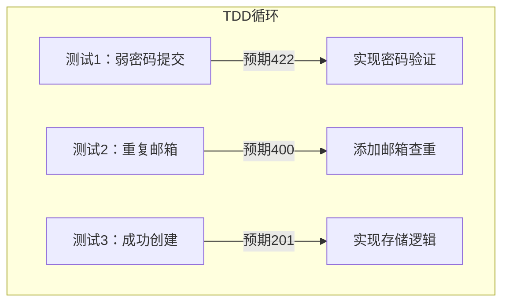

扫描[二维码](https://api2.cmdragon.cn/upload/cmder/20250304_012821924.jpg)
关注或者微信搜一搜：`编程智域 前端至全栈交流与成长`

[发现1000+提升效率与开发的AI工具和实用程序](https://tools.cmdragon.cn/zh/apps?category=ai_chat)：https://tools.cmdragon.cn/

### 5.1 测试驱动开发(TDD)核心思想

TDD(Test-Driven Development)是一种先写测试再写代码的开发模式，核心遵循“红-绿-重构”循环：


**为什么在FastAPI中使用TDD？**

1. ⚡ 接口契约优先：先定义API行为再实现
2. 🔒 防止回归错误：每次修改自动验证功能
3. 🚀 加速开发：明确目标减少过度设计
4. 📄 测试即文档：测试案例展示接口用法

### 5.2 TDD迭代开发实战

#### 5.2.1 创建测试环境

```bash
# 安装依赖
pip install fastapi==0.103.2 pytest==7.4.3 httpx==0.25.0
```

#### 5.2.2 创建测试文件

`tests/test_users.py`

```python
from httpx import AsyncClient


async def test_create_user(client: AsyncClient):
    # 1. 定义失败测试（红）
    response = await client.post(
        "/users/",
        json={"email": "test@example.com", "password": "weak"}
    )
    assert response.status_code == 422  # 预期验证失败


async def test_create_user_success(client: AsyncClient):
    # 2. 实现成功路径（绿）
    response = await client.post(
        "/users/",
        json={
            "email": "valid@example.com",
            "password": "Str0ngP@ss!"
        }
    )
    assert response.status_code == 201
    assert "id" in response.json()
```

#### 5.2.3 实现业务代码

`app/main.py`

```python
from fastapi import FastAPI, HTTPException
from pydantic import BaseModel, EmailStr, constr

app = FastAPI()


# 定义数据模型
class UserCreate(BaseModel):
    email: EmailStr
    password: constr(min_length=8, regex=r"^(?=.*\d)(?=.*[A-Z])")


# 临时存储
users_db = []


@app.post("/users/", status_code=201)
async def create_user(user: UserCreate):
    # 密码验证逻辑
    if any(user.email == u["email"] for u in users_db):
        raise HTTPException(400, "Email exists")

    new_user = {"id": len(users_db) + 1, **user.dict()}
    users_db.append(new_user)
    return new_user
```

### 5.3 验证流程完整案例

**需求：用户注册接口**

1. ✅ 必须字段：email(格式验证)、password(强度验证)
2. ❌ 禁止重复邮箱
3. ⚠️ 返回201状态码及用户ID



**运行测试**

```bash
pytest -v
# 输出示例
test_users.py::test_create_user PASSED
test_users.py::test_create_user_success PASSED
```

### 5.4 课后 Quiz

1. 当收到422状态码时，主要问题是什么？
   > 🔍 **答案解析**：表示请求体未通过Pydantic验证，检查错误响应中的`detail`字段，常见原因包括：邮件格式错误、密码不符合强度规则

2. 如何测试需要认证的接口？
   > 🔑 **解决方案**：
   > ```python
   > async def test_auth_endpoint(client: AsyncClient):
   >     # 先获取token
   >     auth = await client.post("/login", data={"username":...})
   >     token = auth.json()["access_token"]
   >     
   >     # 带token请求
   >     response = await client.get(
   >         "/protected",
   >         headers={"Authorization": f"Bearer {token}"}
   >     )
   >     assert response.status_code == 200
   > ```

### 5.5 常见报错解决方案

| 错误代码                         | 原因分析     | 解决方案                                              |
|------------------------------|----------|---------------------------------------------------|
| **422 Unprocessable Entity** | 请求体验证失败  | 检查Pydantic模型规则，使用`try/except`捕获`ValidationError`  |
| **405 Method Not Allowed**   | 路由未定义该方法 | 确认路由装饰器（如`@app.get`）使用正确HTTP方法                    |
| **500 Internal Error**       | 未处理的异常   | 添加全局异常处理器：<br>`@app.exception_handler(Exception)` |
| **401 Unauthorized**         | 缺少认证凭证   | 检查依赖注入的`Depends`逻辑是否正确执行                          | 

**预防建议：**

```python
# 配置全局错误处理
from fastapi import FastAPI, Request
from fastapi.responses import JSONResponse

app = FastAPI()


@app.exception_handler(ValidationError)
async def validation_exception_handler(request, exc):
    return JSONResponse(
        status_code=422,
        content={"detail": exc.errors()}
    )
```

余下文章内容请点击跳转至 个人博客页面 或者 扫码关注或者微信搜一搜：`编程智域 前端至全栈交流与成长`
，阅读完整的文章：[为什么TDD能让你的FastAPI开发飞起来？](https://blog.cmdragon.cn/posts/c9c1e3bb0fdc15303b9b3b1f20124b0b/)


<details>
<summary>往期文章归档</summary>

- [如何用FastAPI玩转多模块测试与异步任务，让代码不再“闹脾气”？ - cmdragon's Blog](https://blog.cmdragon.cn/posts/ddbfa0447a5d0d6f9af12e7a6b206f70/)
- [如何在FastAPI中玩转“时光倒流”的数据库事务回滚测试？](https://blog.cmdragon.cn/posts/bf9883a75ffa46b523a03b16ec56ce48/)
- [如何在FastAPI中优雅地模拟多模块集成测试？ - cmdragon's Blog](https://blog.cmdragon.cn/posts/be553dbd5d51835d2c69553f4a773e2d/)
- [多环境配置切换机制能否让开发与生产无缝衔接？ - cmdragon's Blog](https://blog.cmdragon.cn/posts/533874f5700b8506d4c68781597db659/)
- [如何在 FastAPI 中巧妙覆盖依赖注入并拦截第三方服务调用？ - cmdragon's Blog](https://blog.cmdragon.cn/posts/2d992ef9e8962dc0a4a0b5348d486114/)
- [为什么你的单元测试需要Mock数据库才能飞起来？ - cmdragon's Blog](https://blog.cmdragon.cn/posts/6e69c0eedd8b1e5a74a148d36c85d7ce/)
- [如何在FastAPI中巧妙隔离依赖项，让单元测试不再头疼？ - cmdragon's Blog](https://blog.cmdragon.cn/posts/77ae327dc941b0e74ecc6a8794c084d0/)
- [如何在FastAPI中巧妙隔离依赖项，让单元测试不再头疼？ - cmdragon's Blog](https://blog.cmdragon.cn/posts/77ae327dc941b0e74ecc6a8794c084d0/)
- [测试覆盖率不够高？这些技巧让你的FastAPI测试无懈可击！ - cmdragon's Blog](https://blog.cmdragon.cn/posts/0577d0e24f48b3153b510e74d3d1a822/)
- [为什么你的FastAPI测试覆盖率总是低得让人想哭？ - cmdragon's Blog](https://blog.cmdragon.cn/posts/985c18ca802f1b6da828b92e082b4d4e/)
- [如何让FastAPI测试不再成为你的噩梦？ - cmdragon's Blog](https://blog.cmdragon.cn/posts/29858a7a10d20b4e4649cb75fb422eab/)
- [FastAPI测试环境配置的秘诀，你真的掌握了吗？ - cmdragon's Blog](https://blog.cmdragon.cn/posts/6f9e71e8313db6de8c1431877a70b67e/)
- [全链路追踪如何让FastAPI微服务架构的每个请求都无所遁形？ - cmdragon's Blog](https://blog.cmdragon.cn/posts/30e1d2fbf1ad8123eaf0e1e0dbe7c675/)
- [如何在API高并发中玩转资源隔离与限流策略？ - cmdragon's Blog](https://blog.cmdragon.cn/posts/4ad4ec1dbd80bcf5670fb397ca7cc68c/)
- [任务分片执行模式如何让你的FastAPI性能飙升？ - cmdragon's Blog](https://blog.cmdragon.cn/posts/c6a598639f6a831e9e82e171b8d71857/)
- [冷热任务分离：是提升Web性能的终极秘籍还是技术噱头？ - cmdragon's Blog](https://blog.cmdragon.cn/posts/9c3dc7767a9282f7ef02daad42539f2c/)
- [如何让FastAPI在百万级任务处理中依然游刃有余？ - cmdragon's Blog](https://blog.cmdragon.cn/posts/469aae0e0f88c642ed8bc82e102b960b/)
- [如何让FastAPI与消息队列的联姻既甜蜜又可靠？ - cmdragon's Blog](https://blog.cmdragon.cn/posts/1bebb53f4d9d6fbd0ecbba97562c07b0/)
- [如何在FastAPI中巧妙实现延迟队列，让任务乖乖等待？ - cmdragon's Blog](https://blog.cmdragon.cn/posts/174450702d9e609a072a7d1aaa84750b/)
- [FastAPI的死信队列处理机制：为何你的消息系统需要它？ - cmdragon's Blog](https://blog.cmdragon.cn/posts/047b08957a0d617a87b72da6c3131e5d/)
- [如何让FastAPI任务系统在失败时自动告警并自我修复？ - cmdragon's Blog](https://blog.cmdragon.cn/posts/2f104637ecc916e906c002fa79ab8c80/)
- [如何用Prometheus和FastAPI打造任务监控的“火眼金睛”？ - cmdragon's Blog](https://blog.cmdragon.cn/posts/e7464e5b4d558ede1a7413fa0a2f96f3/)
- [如何用APScheduler和FastAPI打造永不宕机的分布式定时任务系统？ - cmdragon's Blog](https://blog.cmdragon.cn/posts/51a0ff47f509fb6238150a96f551b317/)
- [如何在 FastAPI 中玩转 APScheduler，让任务定时自动执行？ - cmdragon's Blog](https://blog.cmdragon.cn/posts/85564dd901c6d9b1a79d320970843caa/)
- [定时任务系统如何让你的Web应用自动完成那些烦人的重复工作？ - cmdragon's Blog](https://blog.cmdragon.cn/posts/2b27950aab76203a1af4e9e3deda8699/)
- [Celery任务监控的魔法背后藏着什么秘密？ - cmdragon's Blog](https://blog.cmdragon.cn/posts/f43335725bb3372ebc774db1b9f28d2d/)
- [如何让Celery任务像VIP客户一样享受优先待遇？ - cmdragon's Blog](https://blog.cmdragon.cn/posts/c24491a7ac7f7c5e9cf77596ebb27c51/)
- [如何让你的FastAPI Celery Worker在压力下优雅起舞？ - cmdragon's Blog](https://blog.cmdragon.cn/posts/c3129f4b424d2ed2330484b82ec31875/)
- [FastAPI与Celery的完美邂逅，如何让异步任务飞起来？ - cmdragon's Blog](https://blog.cmdragon.cn/posts/b79c2c1805fe9b1ea28326b5b8f3b709/)
- [FastAPI消息持久化与ACK机制：如何确保你的任务永不迷路？ - cmdragon's Blog](https://blog.cmdragon.cn/posts/13a59846aaab71b44ab6f3dadc5b5ec7/)
- [FastAPI的BackgroundTasks如何玩转生产者-消费者模式？ - cmdragon's Blog](https://blog.cmdragon.cn/posts/1549a6bd7e47e7006e7ba8f52bcfe8eb/)
- [BackgroundTasks 还是 RabbitMQ？你的异步任务到底该选谁？ - cmdragon's Blog](https://blog.cmdragon.cn/posts/d26fdc150ff9dd70c7482381ff4c77c4/)
- [BackgroundTasks与Celery：谁才是异步任务的终极赢家？ - cmdragon's Blog](https://blog.cmdragon.cn/posts/792cac4ce6eb96b5001da15b0d52ef83/)
- [如何在 FastAPI 中优雅处理后台任务异常并实现智能重试？ - cmdragon's Blog](https://blog.cmdragon.cn/posts/d5c1d2efbaf6fe4c9e13acc6be6d929a/)
- [BackgroundTasks 如何巧妙驾驭多任务并发？ - cmdragon's Blog](https://blog.cmdragon.cn/posts/8661dc74944bd6fb28092e90d4060161/)
- [如何让FastAPI后台任务像多米诺骨牌一样井然有序地执行？ - cmdragon's Blog](https://blog.cmdragon.cn/posts/7693d3430a6256c2abefc1e4aba21a4a/)
- [FastAPI后台任务：是时候让你的代码飞起来了吗？ - cmdragon's Blog](https://blog.cmdragon.cn/posts/6145d88d5154d5cd38cee7ddc2d46e1d/)

</details>


<details>
<summary>免费好用的热门在线工具</summary>

- [歌词生成工具 - 应用商店 | By cmdragon](https://tools.cmdragon.cn/zh/apps/lyrics-generator)
- [网盘资源聚合搜索 - 应用商店 | By cmdragon](https://tools.cmdragon.cn/zh/apps/cloud-drive-search)
- [ASCII字符画生成器 - 应用商店 | By cmdragon](https://tools.cmdragon.cn/zh/apps/ascii-art-generator)
- [JSON Web Tokens 工具 - 应用商店 | By cmdragon](https://tools.cmdragon.cn/zh/apps/jwt-tool)
- [Bcrypt 密码工具 - 应用商店 | By cmdragon](https://tools.cmdragon.cn/zh/apps/bcrypt-tool)
- [GIF 合成器 - 应用商店 | By cmdragon](https://tools.cmdragon.cn/zh/apps/gif-composer)
- [GIF 分解器 - 应用商店 | By cmdragon](https://tools.cmdragon.cn/zh/apps/gif-decomposer)
- [文本隐写术 - 应用商店 | By cmdragon](https://tools.cmdragon.cn/zh/apps/text-steganography)
- [CMDragon 在线工具 - 高级AI工具箱与开发者套件 | 免费好用的在线工具](https://tools.cmdragon.cn/zh)
- [应用商店 - 发现1000+提升效率与开发的AI工具和实用程序 | 免费好用的在线工具](https://tools.cmdragon.cn/zh/apps?category=trending)
- [CMDragon 更新日志 - 最新更新、功能与改进 | 免费好用的在线工具](https://tools.cmdragon.cn/zh/changelog)
- [支持我们 - 成为赞助者 | 免费好用的在线工具](https://tools.cmdragon.cn/zh/sponsor)
- [AI文本生成图像 - 应用商店 | 免费好用的在线工具](https://tools.cmdragon.cn/zh/apps/text-to-image-ai)
- [临时邮箱 - 应用商店 | 免费好用的在线工具](https://tools.cmdragon.cn/zh/apps/temp-email)
- [二维码解析器 - 应用商店 | 免费好用的在线工具](https://tools.cmdragon.cn/zh/apps/qrcode-parser)
- [文本转思维导图 - 应用商店 | 免费好用的在线工具](https://tools.cmdragon.cn/zh/apps/text-to-mindmap)
- [正则表达式可视化工具 - 应用商店 | 免费好用的在线工具](https://tools.cmdragon.cn/zh/apps/regex-visualizer)
- [文件隐写工具 - 应用商店 | 免费好用的在线工具](https://tools.cmdragon.cn/zh/apps/steganography-tool)
- [IPTV 频道探索器 - 应用商店 | 免费好用的在线工具](https://tools.cmdragon.cn/zh/apps/iptv-explorer)
- [快传 - 应用商店 | 免费好用的在线工具](https://tools.cmdragon.cn/zh/apps/snapdrop)
- [随机抽奖工具 - 应用商店 | 免费好用的在线工具](https://tools.cmdragon.cn/zh/apps/lucky-draw)
- [动漫场景查找器 - 应用商店 | 免费好用的在线工具](https://tools.cmdragon.cn/zh/apps/anime-scene-finder)
- [时间工具箱 - 应用商店 | 免费好用的在线工具](https://tools.cmdragon.cn/zh/apps/time-toolkit)
- [网速测试 - 应用商店 | 免费好用的在线工具](https://tools.cmdragon.cn/zh/apps/speed-test)
- [AI 智能抠图工具 - 应用商店 | 免费好用的在线工具](https://tools.cmdragon.cn/zh/apps/background-remover)
- [背景替换工具 - 应用商店 | 免费好用的在线工具](https://tools.cmdragon.cn/zh/apps/background-replacer)
- [艺术二维码生成器 - 应用商店 | 免费好用的在线工具](https://tools.cmdragon.cn/zh/apps/artistic-qrcode)
- [Open Graph 元标签生成器 - 应用商店 | 免费好用的在线工具](https://tools.cmdragon.cn/zh/apps/open-graph-generator)
- [图像对比工具 - 应用商店 | 免费好用的在线工具](https://tools.cmdragon.cn/zh/apps/image-comparison)
- [图片压缩专业版 - 应用商店 | 免费好用的在线工具](https://tools.cmdragon.cn/zh/apps/image-compressor)
- [密码生成器 - 应用商店 | 免费好用的在线工具](https://tools.cmdragon.cn/zh/apps/password-generator)
- [SVG优化器 - 应用商店 | 免费好用的在线工具](https://tools.cmdragon.cn/zh/apps/svg-optimizer)
- [调色板生成器 - 应用商店 | 免费好用的在线工具](https://tools.cmdragon.cn/zh/apps/color-palette)
- [在线节拍器 - 应用商店 | 免费好用的在线工具](https://tools.cmdragon.cn/zh/apps/online-metronome)
- [IP归属地查询 - 应用商店 | 免费好用的在线工具](https://tools.cmdragon.cn/zh/apps/ip-geolocation)
- [CSS网格布局生成器 - 应用商店 | 免费好用的在线工具](https://tools.cmdragon.cn/zh/apps/css-grid-layout)
- [邮箱验证工具 - 应用商店 | 免费好用的在线工具](https://tools.cmdragon.cn/zh/apps/email-validator)
- [书法练习字帖 - 应用商店 | 免费好用的在线工具](https://tools.cmdragon.cn/zh/apps/calligraphy-practice)
- [金融计算器套件 - 应用商店 | 免费好用的在线工具](https://tools.cmdragon.cn/zh/apps/finance-calculator-suite)
- [中国亲戚关系计算器 - 应用商店 | 免费好用的在线工具](https://tools.cmdragon.cn/zh/apps/chinese-kinship-calculator)
- [Protocol Buffer 工具箱 - 应用商店 | 免费好用的在线工具](https://tools.cmdragon.cn/zh/apps/protobuf-toolkit)
- [IP归属地查询 - 应用商店 | 免费好用的在线工具](https://tools.cmdragon.cn/zh/apps/ip-geolocation)
- [图片无损放大 - 应用商店 | 免费好用的在线工具](https://tools.cmdragon.cn/zh/apps/image-upscaler)
- [文本比较工具 - 应用商店 | 免费好用的在线工具](https://tools.cmdragon.cn/zh/apps/text-compare)
- [IP批量查询工具 - 应用商店 | 免费好用的在线工具](https://tools.cmdragon.cn/zh/apps/ip-batch-lookup)
- [域名查询工具 - 应用商店 | 免费好用的在线工具](https://tools.cmdragon.cn/zh/apps/domain-finder)
- [DNS工具箱 - 应用商店 | 免费好用的在线工具](https://tools.cmdragon.cn/zh/apps/dns-toolkit)
- [网站图标生成器 - 应用商店 | 免费好用的在线工具](https://tools.cmdragon.cn/zh/apps/favicon-generator)
- [XML Sitemap](https://tools.cmdragon.cn/sitemap_index.xml)

</details>