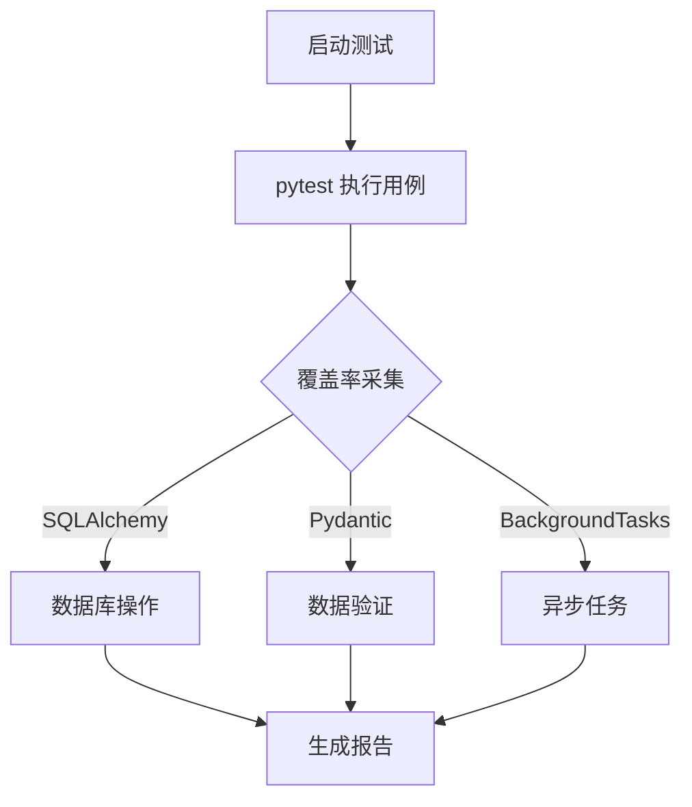

扫描[二维码](https://api2.cmdragon.cn/upload/cmder/20250304_012821924.jpg)
关注或者微信搜一搜：`编程智域 前端至全栈交流与成长`

[发现1000+提升效率与开发的AI工具和实用程序](https://tools.cmdragon.cn/zh/apps?category=ai_chat)：https://tools.cmdragon.cn/

### 一、测试环境配置与基础框架搭建

在 FastAPI 开发中，完善的测试环境和基础框架是保证代码质量和可维护性的关键。以下是具体实现步骤：

#### 1.1 环境配置与依赖管理

使用 `pipenv` 或 `poetry` 管理虚拟环境和依赖：

```bash
# 安装 pipenv  
pip install pipenv  

# 创建虚拟环境并安装依赖  
pipenv install fastapi uvicorn pytest httpx pydantic==2.0.0 sqlalchemy==2.0.0
```

依赖说明：

- `fastapi`: Web 框架核心
- `uvicorn`: ASGI 服务器
- `pytest`: 测试框架
- `httpx`: 测试 HTTP 请求
- `pydantic`: 数据验证（v2.0 新特性支持严格类型校验）
- `sqlalchemy`: ORM 工具

#### 1.2 基础框架结构

创建项目目录结构：

```
project/
├── app/
│   ├── main.py           # 应用入口
│   ├── routes/           # API 路由
│   ├── models/           # Pydantic 数据模型
│   ├── database.py       # 数据库连接
│   └── config.py         # 配置文件
├── tests/
│   ├── conftest.py       # 测试配置
│   └── test_api.py       # API 测试用例
└── requirements.txt
```

#### 1.3 核心框架代码

**database.py** (SQLAlchemy 配置):

```python
from sqlalchemy import create_engine
from sqlalchemy.ext.declarative import declarative_base
from sqlalchemy.orm import sessionmaker

SQLALCHEMY_DATABASE_URL = "sqlite:///./test.db"
engine = create_engine(SQLALCHEMY_DATABASE_URL, connect_args={"check_same_thread": False})
SessionLocal = sessionmaker(autocommit=False, autoflush=False, bind=engine)
Base = declarative_base()


# 依赖注入数据库会话
def get_db():
    db = SessionLocal()
    try:
        yield db
    finally:
        db.close()
```

**config.py** (Pydantic 配置管理):

```python
from pydantic_settings import BaseSettings


class Settings(BaseSettings):
    app_name: str = "FastAPI Demo"
    debug_mode: bool = False

    class Config:
        env_file = ".env"


settings = Settings()
```

**main.py** (FastAPI 入口):

```python
from fastapi import FastAPI, Depends
from .database import get_db
from .routes import items_router
from .config import settings

app = FastAPI(title=settings.app_name)

# 挂载路由
app.include_router(items_router, prefix="/items")


@app.get("/")
async def root():
    return {"message": "Hello World"}
```

---

### 🔍 课后 Quiz 1

**问题**: 为什么使用 `yield` 而不是 `return` 提供数据库会话？  
**答案解析**:  
在 `get_db` 中使用 `yield` 实现依赖注入的生命周期管理：

1. `yield` 前的代码在请求开始时执行（创建会话）
2. `yield` 后的代码在请求结束时执行（关闭会话）
3. 这种方式确保即使出现异常也能正确释放资源

---

### ⚠️ 常见报错解决方案 (1.X)

**报错**: `422 Unprocessable Entity`  
**原因**: 请求体不符合 Pydantic 模型定义  
**解决方案**:

1. 检查请求的 JSON 数据结构
2. 验证模型字段是否匹配，例如:
   ```python
   class Item(BaseModel):
       name: str  # 要求必须字符串类型
       price: float
   ```  
3. 使用 `curl -v` 查看详细错误信息

**预防建议**:

- 为模型字段添加默认值，如 `name: str = "default"`
- 使用 `Union` 支持多类型，如 `price: Union[float, None] = None`

---

### 二、测试覆盖率检测工具配置

测试覆盖率是衡量代码质量的核心指标。FastAPI 推荐使用：

- **pytest**：测试运行器
- **coverage.py**：覆盖率检测
- **pytest-cov**：集成插件

#### 2.1 配置 pytest

**tests/conftest.py** (测试依赖注入):

```python
import pytest
from httpx import AsyncClient
from app.main import app


@pytest.fixture
async def client():
    async with AsyncClient(app=app, base_url="http://test") as ac:
        yield ac
```

#### 2.2 编写测试用例

**tests/test_api.py**：

```python
import pytest


# 测试 API 端点
@pytest.mark.asyncio
async def test_create_item(client):
    response = await client.post(
        "/items/",
        json={"name": "Test Item", "price": 9.99}  # 符合 Pydantic 模型
    )
    assert response.status_code == 200
    assert response.json()["name"] == "Test Item"


# 测试无效数据
@pytest.mark.asyncio
async def test_invalid_item(client):
    response = await client.post(
        "/items/",
        json={"price": "invalid"}  # 缺少必要字段 name
    )
    assert response.status_code == 422  # 触发 Pydantic 验证错误
```

#### 2.3 覆盖率检测配置

1. 安装依赖：
   ```bash
   pipenv install coverage pytest-cov
   ```  
2. 运行测试并生成报告：
   ```bash
   pytest --cov=app --cov-report=html tests/
   ```  
3. 查看 HTML 报告：
   ```
   open htmlcov/index.html
   ```  

#### 2.4 持续集成集成

在 `.github/workflows/ci.yml` 中配置：

```yaml
name: CI Pipeline
on: [ push ]

jobs:
  test:
    runs-on: ubuntu-latest
    steps:
      - uses: actions/checkout@v3
      - name: Set up Python
        uses: actions/setup-python@v4
      - name: Install dependencies
        run: pip install pipenv && pipenv install --dev
      - name: Run tests
        run: pytest --cov=app --cov-fail-under=80  # 要求覆盖率≥80%
```

---

### 🔍 课后 Quiz 2

**问题**: 覆盖率报告中 `--cov-fail-under=80` 参数的作用是什么？  
**答案解析**:  
该参数设置最低覆盖率阈值：

1. 如果整体覆盖率低于 80%，测试将失败
2. 防止未经充分测试的代码合并到主分支
3. 在 CI/CD 流程中强制质量门禁

---

### ⚠️ 常见报错解决方案 (2.X)

**报错**: `ModuleNotFoundError: No module named 'app'`  
**原因**: 测试运行路径错误  
**解决方案**:

1. 从项目根目录运行测试：
   ```bash
   cd /project && pytest
   ```  
2. 在 `pytest.ini` 中添加：
   ```ini
   [pytest]
   pythonpath = .
   ```  

**预防建议**:

- 使用 `__init__.py` 将目录转为 Python 包
- 避免在测试中硬编码绝对路径

---

### 三、测试覆盖率优化策略

#### 3.1 分支覆盖率测试

```python
# 测试不同业务分支
@pytest.mark.parametrize("price, discount", [
    (100, 10),  # 正常折扣
    (50, 0),  # 无折扣
    (30, -5)  # 无效折扣
])
async def test_discount_logic(client, price, discount):
    response = await client.post(
        "/items/",
        json={"name": "Test", "price": price, "discount": discount}
    )
    if discount < 0:
        assert response.status_code == 400  # 验证业务规则
    else:
        assert response.status_code == 200
```

#### 3.2 异步任务覆盖率

对于后台异步任务：

```python
from fastapi import BackgroundTasks


async def notify_admins(email: str):
    # 模拟发送邮件
    print(f"Sending email to {email}")


@app.post("/report")
async def create_report(background_tasks: BackgroundTasks):
    background_tasks.add_task(notify_admins, "admin@example.com")
    return {"message": "Report scheduled"}
```

测试策略：

```python
# Mock 后台任务
from unittest.mock import MagicMock


@pytest.mark.asyncio
async def test_background_task(client):
    app.notify_admins = MagicMock()  # 替换为 Mock 函数
    response = await client.post("/report")
    app.notify_admins.assert_called_once_with("admin@example.com")
```

#### 3.3 目标覆盖率报告

```text
----------- coverage: platform linux -----------
Name                  Stmts   Miss  Cover
-----------------------------------------
app/__init__.py          0      0   100%
app/main.py             15      0   100%
app/routes.py           20      1    95%   # 缺失分支
-----------------------------------------
TOTAL                   35      1    97%
```

---



余下文章内容请点击跳转至 个人博客页面 或者 扫码关注或者微信搜一搜：`编程智域 前端至全栈交流与成长`
，阅读完整的文章：[为什么你的FastAPI测试覆盖率总是低得让人想哭？](https://blog.cmdragon.cn/posts/985c18ca802f1b6da828b92e082b4d4e/)


<details>
<summary>往期文章归档</summary>

- [如何让FastAPI测试不再成为你的噩梦？ - cmdragon's Blog](https://blog.cmdragon.cn/posts/29858a7a10d20b4e4649cb75fb422eab/)
- [FastAPI测试环境配置的秘诀，你真的掌握了吗？ - cmdragon's Blog](https://blog.cmdragon.cn/posts/6f9e71e8313db6de8c1431877a70b67e/)
- [全链路追踪如何让FastAPI微服务架构的每个请求都无所遁形？ - cmdragon's Blog](https://blog.cmdragon.cn/posts/30e1d2fbf1ad8123eaf0e1e0dbe7c675/)
- [如何在API高并发中玩转资源隔离与限流策略？ - cmdragon's Blog](https://blog.cmdragon.cn/posts/4ad4ec1dbd80bcf5670fb397ca7cc68c/)
- [任务分片执行模式如何让你的FastAPI性能飙升？ - cmdragon's Blog](https://blog.cmdragon.cn/posts/c6a598639f6a831e9e82e171b8d71857/)
- [冷热任务分离：是提升Web性能的终极秘籍还是技术噱头？ - cmdragon's Blog](https://blog.cmdragon.cn/posts/9c3dc7767a9282f7ef02daad42539f2c/)
- [如何让FastAPI在百万级任务处理中依然游刃有余？ - cmdragon's Blog](https://blog.cmdragon.cn/posts/469aae0e0f88c642ed8bc82e102b960b/)
- [如何让FastAPI与消息队列的联姻既甜蜜又可靠？ - cmdragon's Blog](https://blog.cmdragon.cn/posts/1bebb53f4d9d6fbd0ecbba97562c07b0/)
- [如何在FastAPI中巧妙实现延迟队列，让任务乖乖等待？ - cmdragon's Blog](https://blog.cmdragon.cn/posts/174450702d9e609a072a7d1aaa84750b/)
- [FastAPI的死信队列处理机制：为何你的消息系统需要它？ - cmdragon's Blog](https://blog.cmdragon.cn/posts/047b08957a0d617a87b72da6c3131e5d/)
- [如何让FastAPI任务系统在失败时自动告警并自我修复？ - cmdragon's Blog](https://blog.cmdragon.cn/posts/2f104637ecc916e906c002fa79ab8c80/)
- [如何用Prometheus和FastAPI打造任务监控的“火眼金睛”？ - cmdragon's Blog](https://blog.cmdragon.cn/posts/e7464e5b4d558ede1a7413fa0a2f96f3/)
- [如何用APScheduler和FastAPI打造永不宕机的分布式定时任务系统？ - cmdragon's Blog](https://blog.cmdragon.cn/posts/51a0ff47f509fb6238150a96f551b317/)
- [如何在 FastAPI 中玩转 APScheduler，让任务定时自动执行？ - cmdragon's Blog](https://blog.cmdragon.cn/posts/85564dd901c6d9b1a79d320970843caa/)
- [定时任务系统如何让你的Web应用自动完成那些烦人的重复工作？ - cmdragon's Blog](https://blog.cmdragon.cn/posts/2b27950aab76203a1af4e9e3deda8699/)
- [Celery任务监控的魔法背后藏着什么秘密？ - cmdragon's Blog](https://blog.cmdragon.cn/posts/f43335725bb3372ebc774db1b9f28d2d/)
- [如何让Celery任务像VIP客户一样享受优先待遇？ - cmdragon's Blog](https://blog.cmdragon.cn/posts/c24491a7ac7f7c5e9cf77596ebb27c51/)
- [如何让你的FastAPI Celery Worker在压力下优雅起舞？ - cmdragon's Blog](https://blog.cmdragon.cn/posts/c3129f4b424d2ed2330484b82ec31875/)
- [FastAPI与Celery的完美邂逅，如何让异步任务飞起来？ - cmdragon's Blog](https://blog.cmdragon.cn/posts/b79c2c1805fe9b1ea28326b5b8f3b709/)
- [FastAPI消息持久化与ACK机制：如何确保你的任务永不迷路？ - cmdragon's Blog](https://blog.cmdragon.cn/posts/13a59846aaab71b44ab6f3dadc5b5ec7/)
- [FastAPI的BackgroundTasks如何玩转生产者-消费者模式？ - cmdragon's Blog](https://blog.cmdragon.cn/posts/1549a6bd7e47e7006e7ba8f52bcfe8eb/)
- [BackgroundTasks 还是 RabbitMQ？你的异步任务到底该选谁？ - cmdragon's Blog](https://blog.cmdragon.cn/posts/d26fdc150ff9dd70c7482381ff4c77c4/)
- [BackgroundTasks与Celery：谁才是异步任务的终极赢家？ - cmdragon's Blog](https://blog.cmdragon.cn/posts/792cac4ce6eb96b5001da15b0d52ef83/)
- [如何在 FastAPI 中优雅处理后台任务异常并实现智能重试？ - cmdragon's Blog](https://blog.cmdragon.cn/posts/d5c1d2efbaf6fe4c9e13acc6be6d929a/)
- [BackgroundTasks 如何巧妙驾驭多任务并发？ - cmdragon's Blog](https://blog.cmdragon.cn/posts/8661dc74944bd6fb28092e90d4060161/)
- [如何让FastAPI后台任务像多米诺骨牌一样井然有序地执行？ - cmdragon's Blog](https://blog.cmdragon.cn/posts/7693d3430a6256c2abefc1e4aba21a4a/)
- [FastAPI后台任务：是时候让你的代码飞起来了吗？ - cmdragon's Blog](https://blog.cmdragon.cn/posts/6145d88d5154d5cd38cee7ddc2d46e1d/)
- [FastAPI后台任务为何能让邮件发送如此丝滑？ - cmdragon's Blog](https://blog.cmdragon.cn/posts/19241679a1852122f740391cbdc21bae/)
- [FastAPI的请求-响应周期为何需要后台任务分离？ - cmdragon's Blog](https://blog.cmdragon.cn/posts/c7b54d6b3b6b5041654e69e5610bf3b9/)
- [如何在FastAPI中让后台任务既高效又不会让你的应用崩溃？ - cmdragon's Blog](https://blog.cmdragon.cn/posts/5ad8d0a4c8f2d05e9c1a42d828aad7b3/)
- [FastAPI后台任务：异步魔法还是同步噩梦？ - cmdragon's Blog](https://blog.cmdragon.cn/posts/6a69eca9fd14ba8f6fa41502c5014edd/)
- [如何在FastAPI中玩转Schema版本管理和灰度发布？ - cmdragon's Blog](https://blog.cmdragon.cn/posts/6d9d20cd8d8528da4193f13aaf98575c/)
- [FastAPI的查询白名单和安全沙箱机制如何确保你的API坚不可摧？ - cmdragon's Blog](https://blog.cmdragon.cn/posts/ca141239cfc5c0d510960acd266de9cd/)
- [如何在 FastAPI 中玩转 GraphQL 性能监控与 APM 集成？ - cmdragon's Blog](https://blog.cmdragon.cn/posts/52fe9ea73b0e26de308ae0e539df21d2/)
- [如何在 FastAPI 中玩转 GraphQL 和 WebSocket 的实时数据推送魔法？ - cmdragon's Blog](https://blog.cmdragon.cn/posts/ae484cf6bcf3f44fd8392a8272e57db4/)
- [如何在FastAPI中玩转GraphQL联邦架构，让数据源手拉手跳探戈？ - cmdragon's Blog](https://blog.cmdragon.cn/posts/9b9086ff5d8464b0810cfb55f7768513/)
- [GraphQL批量查询优化：DataLoader如何让数据库访问速度飞起来？ - cmdragon's Blog](https://blog.cmdragon.cn/posts/0e236dbe717bde52bda290e89f4f6eca/)

</details>


<details>
<summary>免费好用的热门在线工具</summary>

- [ASCII字符画生成器 - 应用商店 | By cmdragon](https://tools.cmdragon.cn/zh/apps/ascii-art-generator)
- [JSON Web Tokens 工具 - 应用商店 | By cmdragon](https://tools.cmdragon.cn/zh/apps/jwt-tool)
- [Bcrypt 密码工具 - 应用商店 | By cmdragon](https://tools.cmdragon.cn/zh/apps/bcrypt-tool)
- [GIF 合成器 - 应用商店 | By cmdragon](https://tools.cmdragon.cn/zh/apps/gif-composer)
- [GIF 分解器 - 应用商店 | By cmdragon](https://tools.cmdragon.cn/zh/apps/gif-decomposer)
- [文本隐写术 - 应用商店 | By cmdragon](https://tools.cmdragon.cn/zh/apps/text-steganography)
- [CMDragon 在线工具 - 高级AI工具箱与开发者套件 | 免费好用的在线工具](https://tools.cmdragon.cn/zh)
- [应用商店 - 发现1000+提升效率与开发的AI工具和实用程序 | 免费好用的在线工具](https://tools.cmdragon.cn/zh/apps?category=trending)
- [CMDragon 更新日志 - 最新更新、功能与改进 | 免费好用的在线工具](https://tools.cmdragon.cn/zh/changelog)
- [支持我们 - 成为赞助者 | 免费好用的在线工具](https://tools.cmdragon.cn/zh/sponsor)
- [AI文本生成图像 - 应用商店 | 免费好用的在线工具](https://tools.cmdragon.cn/zh/apps/text-to-image-ai)
- [临时邮箱 - 应用商店 | 免费好用的在线工具](https://tools.cmdragon.cn/zh/apps/temp-email)
- [二维码解析器 - 应用商店 | 免费好用的在线工具](https://tools.cmdragon.cn/zh/apps/qrcode-parser)
- [文本转思维导图 - 应用商店 | 免费好用的在线工具](https://tools.cmdragon.cn/zh/apps/text-to-mindmap)
- [正则表达式可视化工具 - 应用商店 | 免费好用的在线工具](https://tools.cmdragon.cn/zh/apps/regex-visualizer)
- [文件隐写工具 - 应用商店 | 免费好用的在线工具](https://tools.cmdragon.cn/zh/apps/steganography-tool)
- [IPTV 频道探索器 - 应用商店 | 免费好用的在线工具](https://tools.cmdragon.cn/zh/apps/iptv-explorer)
- [快传 - 应用商店 | 免费好用的在线工具](https://tools.cmdragon.cn/zh/apps/snapdrop)
- [随机抽奖工具 - 应用商店 | 免费好用的在线工具](https://tools.cmdragon.cn/zh/apps/lucky-draw)
- [动漫场景查找器 - 应用商店 | 免费好用的在线工具](https://tools.cmdragon.cn/zh/apps/anime-scene-finder)
- [时间工具箱 - 应用商店 | 免费好用的在线工具](https://tools.cmdragon.cn/zh/apps/time-toolkit)
- [网速测试 - 应用商店 | 免费好用的在线工具](https://tools.cmdragon.cn/zh/apps/speed-test)
- [AI 智能抠图工具 - 应用商店 | 免费好用的在线工具](https://tools.cmdragon.cn/zh/apps/background-remover)
- [背景替换工具 - 应用商店 | 免费好用的在线工具](https://tools.cmdragon.cn/zh/apps/background-replacer)
- [艺术二维码生成器 - 应用商店 | 免费好用的在线工具](https://tools.cmdragon.cn/zh/apps/artistic-qrcode)
- [Open Graph 元标签生成器 - 应用商店 | 免费好用的在线工具](https://tools.cmdragon.cn/zh/apps/open-graph-generator)
- [图像对比工具 - 应用商店 | 免费好用的在线工具](https://tools.cmdragon.cn/zh/apps/image-comparison)
- [图片压缩专业版 - 应用商店 | 免费好用的在线工具](https://tools.cmdragon.cn/zh/apps/image-compressor)
- [密码生成器 - 应用商店 | 免费好用的在线工具](https://tools.cmdragon.cn/zh/apps/password-generator)
- [SVG优化器 - 应用商店 | 免费好用的在线工具](https://tools.cmdragon.cn/zh/apps/svg-optimizer)
- [调色板生成器 - 应用商店 | 免费好用的在线工具](https://tools.cmdragon.cn/zh/apps/color-palette)
- [在线节拍器 - 应用商店 | 免费好用的在线工具](https://tools.cmdragon.cn/zh/apps/online-metronome)
- [IP归属地查询 - 应用商店 | 免费好用的在线工具](https://tools.cmdragon.cn/zh/apps/ip-geolocation)
- [CSS网格布局生成器 - 应用商店 | 免费好用的在线工具](https://tools.cmdragon.cn/zh/apps/css-grid-layout)
- [邮箱验证工具 - 应用商店 | 免费好用的在线工具](https://tools.cmdragon.cn/zh/apps/email-validator)
- [书法练习字帖 - 应用商店 | 免费好用的在线工具](https://tools.cmdragon.cn/zh/apps/calligraphy-practice)
- [金融计算器套件 - 应用商店 | 免费好用的在线工具](https://tools.cmdragon.cn/zh/apps/finance-calculator-suite)
- [中国亲戚关系计算器 - 应用商店 | 免费好用的在线工具](https://tools.cmdragon.cn/zh/apps/chinese-kinship-calculator)
- [Protocol Buffer 工具箱 - 应用商店 | 免费好用的在线工具](https://tools.cmdragon.cn/zh/apps/protobuf-toolkit)
- [IP归属地查询 - 应用商店 | 免费好用的在线工具](https://tools.cmdragon.cn/zh/apps/ip-geolocation)
- [图片无损放大 - 应用商店 | 免费好用的在线工具](https://tools.cmdragon.cn/zh/apps/image-upscaler)
- [文本比较工具 - 应用商店 | 免费好用的在线工具](https://tools.cmdragon.cn/zh/apps/text-compare)
- [IP批量查询工具 - 应用商店 | 免费好用的在线工具](https://tools.cmdragon.cn/zh/apps/ip-batch-lookup)
- [域名查询工具 - 应用商店 | 免费好用的在线工具](https://tools.cmdragon.cn/zh/apps/domain-finder)
- [DNS工具箱 - 应用商店 | 免费好用的在线工具](https://tools.cmdragon.cn/zh/apps/dns-toolkit)
- [网站图标生成器 - 应用商店 | 免费好用的在线工具](https://tools.cmdragon.cn/zh/apps/favicon-generator)
- [XML Sitemap](https://tools.cmdragon.cn/sitemap_index.xml)

</details>