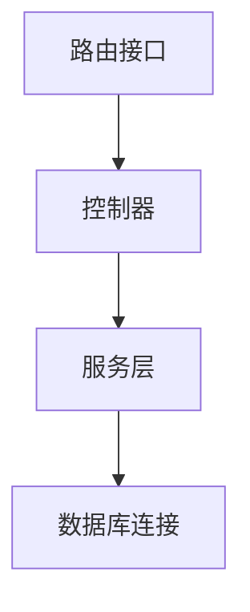

扫描[二维码](https://api2.cmdragon.cn/upload/cmder/20250304_012821924.jpg)
关注或者微信搜一搜：`编程智域 前端至全栈交流与成长`

[发现1000+提升效率与开发的AI工具和实用程序](https://tools.cmdragon.cn/zh/apps?category=ai_chat)：https://tools.cmdragon.cn/

### 1. 依赖注入系统与 Mock 基础

FastAPI 的依赖注入系统(Dependency Injection)是其核心特性之一，它通过自动解析和管理组件间的依赖关系，极大提高了代码的可测试性和可维护性。

🔧 **什么是 Mock？**  
Mock（模拟对象）是测试中创建的虚拟对象，用于替代真实依赖（如数据库连接）。核心作用：

- 隔离测试：避免测试时操作真实数据库
- 控制行为：模拟各种响应（成功/异常）
- 加速执行：绕过耗时的网络请求

```python
from fastapi import Depends, FastAPI


# 真实数据库连接函数
def get_db():
    print("Connecting to real database...")
    return "RealDB Connection"


app = FastAPI()


@app.get("/")
def read_data(db: str = Depends(get_db)):
    return {"database": db}
```

### 2. 为什么需要模拟数据库依赖？

当编写单元测试时，直接调用真实数据库会引发三大问题：

1. **数据污染**：测试数据混入生产环境
2. **执行效率**：网络请求显著拖慢测试速度
3. **不可控性**：无法模拟网络故障等边界情况

📌 典型案例：用户注册接口的测试

- 需要测试：重复注册、异常邮箱等场景
- 真实数据库难以快速重置测试状态
- Mock 数据库可立即返回预设响应

### 3. 依赖注入系统深度解析

#### 3.1 依赖注入的工作原理

FastAPI 的依赖系统本质是**层级解析器**：

1. 声明依赖链：`Route → Controller → Service → DB`
2. 自动构建依赖树
3. 执行递归解析



#### 3.2 可覆盖性的设计优势

通过 `Depends()` 声明的依赖都是**接口可替换**的：

```python
from fastapi import Depends


# 真实数据库连接
def real_db():
    return PostgreSQLConnection()


# 测试用Mock数据库
def mock_db():
    return InMemoryDB()


# 在测试中可动态替换
@app.get("/users")
def get_users(db=Depends(real_db)):  # 切换为 mock_db 即可覆盖
```

### 4. 数据库依赖 Mock 实战策略

#### 4.1 函数依赖的模拟方案

使用 `unittest.mock.patch` 替换目标函数：

```python
from unittest.mock import patch
from fastapi.testclient import TestClient

client = TestClient(app)


def test_read_data():
    # 模拟 get_db 函数返回指定值
    with patch("main.get_db", return_value="MockDB"):
        response = client.get("/")
        assert response.json() == {"database": "MockDB"}
```

#### 4.2 生成器依赖的精细控制

处理 `yield` 型依赖（如数据库会话）：

```python
from contextlib import contextmanager

@contextmanager
def mock_db_session():
    print("Start mock session")
    yield "MockSession"
    print("Cleanup mock")

# 测试中覆盖依赖
app.dependency_overrides[get_db] = mock_db_session

def test_with_session():
    response = client.get("/")
    assert "MockSession" in response.text
```

#### 4.3 Pydantic 模型的集成验证

结合 Pydantic 实现类型安全的 Mock：

```python
from pydantic import BaseModel


class MockUser(BaseModel):
    id: int = 1
    name: str = "Test User"


def test_user_create():
    # 创建符合接口契约的Mock数据
    mock_data = MockUser().dict()
    with patch("user_service.create_user", return_value=mock_data):
        response = client.post("/users", json={"name": "Alice"})
        assert response.json()["id"] == 1  # 验证模型字段
```

### 5. 生产级 Mock 最佳实践

#### 5.1 分层 Mock 策略

| 层级  | 模拟对象    | 工具示例              |
|-----|---------|-------------------|
| 路由层 | HTTP 响应 | `TestClient`      |
| 服务层 | 业务逻辑    | `unittest.mock`   |
| 存储层 | 数据库     | `SQLAlchemy-mock` |

#### 5.2 动态依赖覆盖

通过 `app.dependency_overrides` 实现全局替换：

```python
def override_get_db():
    return "GlobalMockDB"


app.dependency_overrides[get_db] = override_get_db
```

#### 5.3 自动化 Fixture 管理

使用 pytest 高效管理 Mock 生命周期：

```python
import pytest
from fastapi import FastAPI

@pytest.fixture
def mock_app():
    app = FastAPI()
    app.dependency_overrides[get_db] = lambda: "PytestMockDB"
    return app

def test_with_fixture(mock_app):
    client = TestClient(mock_app)
    response = client.get("/")
    assert "PytestMockDB" in response.text
```

---

### 📝 课后 Quiz

1. **为什么单元测试中不能直接使用真实数据库？**  
   A. 会导致测试数据污染生产环境  
   B. 数据库查询会拖慢测试速度  
   C. 无法模拟异常情况  
   D. 以上全部

2. **如何快速验证依赖注入是否被正确覆盖？**  
   A. 查看日志输出  
   B. 在 Mock 函数中添加 print 语句  
   C. 断言接口返回的特定标识  
   D. 使用调试器逐步执行

3. **以下哪种场景最适合使用 Pydantic 模型 Mock？**  
   A. 模拟 HTTP 超时错误  
   B. 验证接口返回的数据结构  
   C. 替换第三方支付网关  
   D. 生成测试用的 JWT Token

<details><summary>🔍 查看答案及解析</summary>

1. **答案：D**
    - 解析：直接使用真实数据库会污染数据、降低测试速度、且难以控制边界情况，Mock 能解决所有这些问题。

2. **答案：C**
    - 解析：最可靠的方式是在 Mock 返回中包含特定标识（如 "MockDB"），通过接口响应直接验证覆盖结果。

3. **答案：B**
    - 解析：Pydantic 的核心价值是数据结构验证，适合确保 Mock 数据符合接口契约要求。

</details>

---

### ⚠️ 常见报错解决方案

#### 报错：`AttributeError: module 'unittest.mock' has no attribute 'patch'`

- **原因**：Python 版本低于 3.3 或错误导入
- **修复**：
  ```python
  # 正确导入方式
  from unittest.mock import patch  # Python >=3.3
  ```

#### 报错：`DependencyOverrideError: No dependency found for <function get_db>`

- **原因**：依赖未在 FastAPI 中正确注册
- **修复**：
    1. 检查依赖函数是否使用 `Depends()`
    2. 确认覆盖时代码路径一致
    3. 使用全限定名：`app.dependency_overrides[module.get_db] = ...`

#### 报错：`TypeError: object NoneType can't be used in 'await' expression`

- **原因**：异步依赖未正确 Mock
- **修复**：
  ```python
  # 为异步函数返回 awaitable 对象
  async def mock_async_db():
      return "AsyncMock"
  ```

#### 🛡️ 预防建议：

1. 对每个依赖编写独立测试用例
2. 使用 `typing.AsyncGenerator` 明确异步依赖类型
3. 在 conftest.py 中集中管理公共 Mock

---

**环境要求**

```bash
Python >=3.7
fastapi==0.103.1
pydantic==2.4.2
httpx==0.25.0
pytest==7.4.2
```

余下文章内容请点击跳转至 个人博客页面 或者 扫码关注或者微信搜一搜：`编程智域 前端至全栈交流与成长`
，阅读完整的文章：[为什么你的单元测试需要Mock数据库才能飞起来？](https://blog.cmdragon.cn/posts/6e69c0eedd8b1e5a74a148d36c85d7ce/)


<details>
<summary>往期文章归档</summary>

- [如何在FastAPI中巧妙隔离依赖项，让单元测试不再头疼？ - cmdragon's Blog](https://blog.cmdragon.cn/posts/77ae327dc941b0e74ecc6a8794c084d0/)
- [如何在FastAPI中巧妙隔离依赖项，让单元测试不再头疼？ - cmdragon's Blog](https://blog.cmdragon.cn/posts/77ae327dc941b0e74ecc6a8794c084d0/)
- [测试覆盖率不够高？这些技巧让你的FastAPI测试无懈可击！ - cmdragon's Blog](https://blog.cmdragon.cn/posts/0577d0e24f48b3153b510e74d3d1a822/)
- [为什么你的FastAPI测试覆盖率总是低得让人想哭？ - cmdragon's Blog](https://blog.cmdragon.cn/posts/985c18ca802f1b6da828b92e082b4d4e/)
- [如何让FastAPI测试不再成为你的噩梦？ - cmdragon's Blog](https://blog.cmdragon.cn/posts/29858a7a10d20b4e4649cb75fb422eab/)
- [FastAPI测试环境配置的秘诀，你真的掌握了吗？ - cmdragon's Blog](https://blog.cmdragon.cn/posts/6f9e71e8313db6de8c1431877a70b67e/)
- [全链路追踪如何让FastAPI微服务架构的每个请求都无所遁形？ - cmdragon's Blog](https://blog.cmdragon.cn/posts/30e1d2fbf1ad8123eaf0e1e0dbe7c675/)
- [如何在API高并发中玩转资源隔离与限流策略？ - cmdragon's Blog](https://blog.cmdragon.cn/posts/4ad4ec1dbd80bcf5670fb397ca7cc68c/)
- [任务分片执行模式如何让你的FastAPI性能飙升？ - cmdragon's Blog](https://blog.cmdragon.cn/posts/c6a598639f6a831e9e82e171b8d71857/)
- [冷热任务分离：是提升Web性能的终极秘籍还是技术噱头？ - cmdragon's Blog](https://blog.cmdragon.cn/posts/9c3dc7767a9282f7ef02daad42539f2c/)
- [如何让FastAPI在百万级任务处理中依然游刃有余？ - cmdragon's Blog](https://blog.cmdragon.cn/posts/469aae0e0f88c642ed8bc82e102b960b/)
- [如何让FastAPI与消息队列的联姻既甜蜜又可靠？ - cmdragon's Blog](https://blog.cmdragon.cn/posts/1bebb53f4d9d6fbd0ecbba97562c07b0/)
- [如何在FastAPI中巧妙实现延迟队列，让任务乖乖等待？ - cmdragon's Blog](https://blog.cmdragon.cn/posts/174450702d9e609a072a7d1aaa84750b/)
- [FastAPI的死信队列处理机制：为何你的消息系统需要它？ - cmdragon's Blog](https://blog.cmdragon.cn/posts/047b08957a0d617a87b72da6c3131e5d/)
- [如何让FastAPI任务系统在失败时自动告警并自我修复？ - cmdragon's Blog](https://blog.cmdragon.cn/posts/2f104637ecc916e906c002fa79ab8c80/)
- [如何用Prometheus和FastAPI打造任务监控的“火眼金睛”？ - cmdragon's Blog](https://blog.cmdragon.cn/posts/e7464e5b4d558ede1a7413fa0a2f96f3/)
- [如何用APScheduler和FastAPI打造永不宕机的分布式定时任务系统？ - cmdragon's Blog](https://blog.cmdragon.cn/posts/51a0ff47f509fb6238150a96f551b317/)
- [如何在 FastAPI 中玩转 APScheduler，让任务定时自动执行？ - cmdragon's Blog](https://blog.cmdragon.cn/posts/85564dd901c6d9b1a79d320970843caa/)
- [定时任务系统如何让你的Web应用自动完成那些烦人的重复工作？ - cmdragon's Blog](https://blog.cmdragon.cn/posts/2b27950aab76203a1af4e9e3deda8699/)
- [Celery任务监控的魔法背后藏着什么秘密？ - cmdragon's Blog](https://blog.cmdragon.cn/posts/f43335725bb3372ebc774db1b9f28d2d/)
- [如何让Celery任务像VIP客户一样享受优先待遇？ - cmdragon's Blog](https://blog.cmdragon.cn/posts/c24491a7ac7f7c5e9cf77596ebb27c51/)
- [如何让你的FastAPI Celery Worker在压力下优雅起舞？ - cmdragon's Blog](https://blog.cmdragon.cn/posts/c3129f4b424d2ed2330484b82ec31875/)
- [FastAPI与Celery的完美邂逅，如何让异步任务飞起来？ - cmdragon's Blog](https://blog.cmdragon.cn/posts/b79c2c1805fe9b1ea28326b5b8f3b709/)
- [FastAPI消息持久化与ACK机制：如何确保你的任务永不迷路？ - cmdragon's Blog](https://blog.cmdragon.cn/posts/13a59846aaab71b44ab6f3dadc5b5ec7/)
- [FastAPI的BackgroundTasks如何玩转生产者-消费者模式？ - cmdragon's Blog](https://blog.cmdragon.cn/posts/1549a6bd7e47e7006e7ba8f52bcfe8eb/)
- [BackgroundTasks 还是 RabbitMQ？你的异步任务到底该选谁？ - cmdragon's Blog](https://blog.cmdragon.cn/posts/d26fdc150ff9dd70c7482381ff4c77c4/)
- [BackgroundTasks与Celery：谁才是异步任务的终极赢家？ - cmdragon's Blog](https://blog.cmdragon.cn/posts/792cac4ce6eb96b5001da15b0d52ef83/)
- [如何在 FastAPI 中优雅处理后台任务异常并实现智能重试？ - cmdragon's Blog](https://blog.cmdragon.cn/posts/d5c1d2efbaf6fe4c9e13acc6be6d929a/)
- [BackgroundTasks 如何巧妙驾驭多任务并发？ - cmdragon's Blog](https://blog.cmdragon.cn/posts/8661dc74944bd6fb28092e90d4060161/)
- [如何让FastAPI后台任务像多米诺骨牌一样井然有序地执行？ - cmdragon's Blog](https://blog.cmdragon.cn/posts/7693d3430a6256c2abefc1e4aba21a4a/)
- [FastAPI后台任务：是时候让你的代码飞起来了吗？ - cmdragon's Blog](https://blog.cmdragon.cn/posts/6145d88d5154d5cd38cee7ddc2d46e1d/)
- [FastAPI后台任务为何能让邮件发送如此丝滑？ - cmdragon's Blog](https://blog.cmdragon.cn/posts/19241679a1852122f740391cbdc21bae/)
- [FastAPI的请求-响应周期为何需要后台任务分离？ - cmdragon's Blog](https://blog.cmdragon.cn/posts/c7b54d6b3b6b5041654e69e5610bf3b9/)
- [如何在FastAPI中让后台任务既高效又不会让你的应用崩溃？ - cmdragon's Blog](https://blog.cmdragon.cn/posts/5ad8d0a4c8f2d05e9c1a42d828aad7b3/)
- [FastAPI后台任务：异步魔法还是同步噩梦？ - cmdragon's Blog](https://blog.cmdragon.cn/posts/6a69eca9fd14ba8f6fa41502c5014edd/)
- [如何在FastAPI中玩转Schema版本管理和灰度发布？ - cmdragon's Blog](https://blog.cmdragon.cn/posts/6d9d20cd8d8528da4193f13aaf98575c/)
- [FastAPI的查询白名单和安全沙箱机制如何确保你的API坚不可摧？ - cmdragon's Blog](https://blog.cmdragon.cn/posts/ca141239cfc5c0d510960acd266de9cd/)

</details>


<details>
<summary>免费好用的热门在线工具</summary>

- [ASCII字符画生成器 - 应用商店 | By cmdragon](https://tools.cmdragon.cn/zh/apps/ascii-art-generator)
- [JSON Web Tokens 工具 - 应用商店 | By cmdragon](https://tools.cmdragon.cn/zh/apps/jwt-tool)
- [Bcrypt 密码工具 - 应用商店 | By cmdragon](https://tools.cmdragon.cn/zh/apps/bcrypt-tool)
- [GIF 合成器 - 应用商店 | By cmdragon](https://tools.cmdragon.cn/zh/apps/gif-composer)
- [GIF 分解器 - 应用商店 | By cmdragon](https://tools.cmdragon.cn/zh/apps/gif-decomposer)
- [文本隐写术 - 应用商店 | By cmdragon](https://tools.cmdragon.cn/zh/apps/text-steganography)
- [CMDragon 在线工具 - 高级AI工具箱与开发者套件 | 免费好用的在线工具](https://tools.cmdragon.cn/zh)
- [应用商店 - 发现1000+提升效率与开发的AI工具和实用程序 | 免费好用的在线工具](https://tools.cmdragon.cn/zh/apps?category=trending)
- [CMDragon 更新日志 - 最新更新、功能与改进 | 免费好用的在线工具](https://tools.cmdragon.cn/zh/changelog)
- [支持我们 - 成为赞助者 | 免费好用的在线工具](https://tools.cmdragon.cn/zh/sponsor)
- [AI文本生成图像 - 应用商店 | 免费好用的在线工具](https://tools.cmdragon.cn/zh/apps/text-to-image-ai)
- [临时邮箱 - 应用商店 | 免费好用的在线工具](https://tools.cmdragon.cn/zh/apps/temp-email)
- [二维码解析器 - 应用商店 | 免费好用的在线工具](https://tools.cmdragon.cn/zh/apps/qrcode-parser)
- [文本转思维导图 - 应用商店 | 免费好用的在线工具](https://tools.cmdragon.cn/zh/apps/text-to-mindmap)
- [正则表达式可视化工具 - 应用商店 | 免费好用的在线工具](https://tools.cmdragon.cn/zh/apps/regex-visualizer)
- [文件隐写工具 - 应用商店 | 免费好用的在线工具](https://tools.cmdragon.cn/zh/apps/steganography-tool)
- [IPTV 频道探索器 - 应用商店 | 免费好用的在线工具](https://tools.cmdragon.cn/zh/apps/iptv-explorer)
- [快传 - 应用商店 | 免费好用的在线工具](https://tools.cmdragon.cn/zh/apps/snapdrop)
- [随机抽奖工具 - 应用商店 | 免费好用的在线工具](https://tools.cmdragon.cn/zh/apps/lucky-draw)
- [动漫场景查找器 - 应用商店 | 免费好用的在线工具](https://tools.cmdragon.cn/zh/apps/anime-scene-finder)
- [时间工具箱 - 应用商店 | 免费好用的在线工具](https://tools.cmdragon.cn/zh/apps/time-toolkit)
- [网速测试 - 应用商店 | 免费好用的在线工具](https://tools.cmdragon.cn/zh/apps/speed-test)
- [AI 智能抠图工具 - 应用商店 | 免费好用的在线工具](https://tools.cmdragon.cn/zh/apps/background-remover)
- [背景替换工具 - 应用商店 | 免费好用的在线工具](https://tools.cmdragon.cn/zh/apps/background-replacer)
- [艺术二维码生成器 - 应用商店 | 免费好用的在线工具](https://tools.cmdragon.cn/zh/apps/artistic-qrcode)
- [Open Graph 元标签生成器 - 应用商店 | 免费好用的在线工具](https://tools.cmdragon.cn/zh/apps/open-graph-generator)
- [图像对比工具 - 应用商店 | 免费好用的在线工具](https://tools.cmdragon.cn/zh/apps/image-comparison)
- [图片压缩专业版 - 应用商店 | 免费好用的在线工具](https://tools.cmdragon.cn/zh/apps/image-compressor)
- [密码生成器 - 应用商店 | 免费好用的在线工具](https://tools.cmdragon.cn/zh/apps/password-generator)
- [SVG优化器 - 应用商店 | 免费好用的在线工具](https://tools.cmdragon.cn/zh/apps/svg-optimizer)
- [调色板生成器 - 应用商店 | 免费好用的在线工具](https://tools.cmdragon.cn/zh/apps/color-palette)
- [在线节拍器 - 应用商店 | 免费好用的在线工具](https://tools.cmdragon.cn/zh/apps/online-metronome)
- [IP归属地查询 - 应用商店 | 免费好用的在线工具](https://tools.cmdragon.cn/zh/apps/ip-geolocation)
- [CSS网格布局生成器 - 应用商店 | 免费好用的在线工具](https://tools.cmdragon.cn/zh/apps/css-grid-layout)
- [邮箱验证工具 - 应用商店 | 免费好用的在线工具](https://tools.cmdragon.cn/zh/apps/email-validator)
- [书法练习字帖 - 应用商店 | 免费好用的在线工具](https://tools.cmdragon.cn/zh/apps/calligraphy-practice)
- [金融计算器套件 - 应用商店 | 免费好用的在线工具](https://tools.cmdragon.cn/zh/apps/finance-calculator-suite)
- [中国亲戚关系计算器 - 应用商店 | 免费好用的在线工具](https://tools.cmdragon.cn/zh/apps/chinese-kinship-calculator)
- [Protocol Buffer 工具箱 - 应用商店 | 免费好用的在线工具](https://tools.cmdragon.cn/zh/apps/protobuf-toolkit)
- [IP归属地查询 - 应用商店 | 免费好用的在线工具](https://tools.cmdragon.cn/zh/apps/ip-geolocation)
- [图片无损放大 - 应用商店 | 免费好用的在线工具](https://tools.cmdragon.cn/zh/apps/image-upscaler)
- [文本比较工具 - 应用商店 | 免费好用的在线工具](https://tools.cmdragon.cn/zh/apps/text-compare)
- [IP批量查询工具 - 应用商店 | 免费好用的在线工具](https://tools.cmdragon.cn/zh/apps/ip-batch-lookup)
- [域名查询工具 - 应用商店 | 免费好用的在线工具](https://tools.cmdragon.cn/zh/apps/domain-finder)
- [DNS工具箱 - 应用商店 | 免费好用的在线工具](https://tools.cmdragon.cn/zh/apps/dns-toolkit)
- [网站图标生成器 - 应用商店 | 免费好用的在线工具](https://tools.cmdragon.cn/zh/apps/favicon-generator)
- [XML Sitemap](https://tools.cmdragon.cn/sitemap_index.xml)

</details>