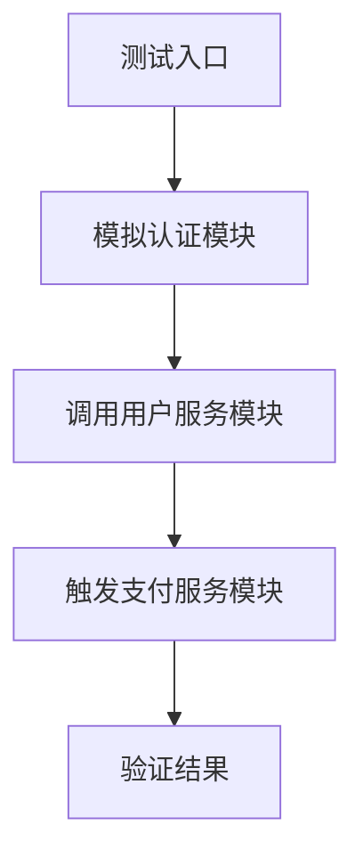
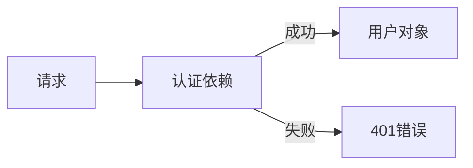

扫描[二维码](https://api2.cmdragon.cn/upload/cmder/20250304_012821924.jpg)
关注或者微信搜一搜：`编程智域 前端至全栈交流与成长`

[发现1000+提升效率与开发的AI工具和实用程序](https://tools.cmdragon.cn/zh/apps?category=ai_chat)：https://tools.cmdragon.cn/

## 1. 多模块集成测试实践

FastAPI 的集成测试核心在于模拟真实环境中的多个服务模块交互，尤其针对认证、数据库、外部服务等场景。

### 1.1 测试框架与工具链

- **工具选择**：使用 `pytest` + `httpx` + `asyncio` 组合
- **Mock 策略**：通过 `unittest.mock` 替换外部依赖
- **数据库隔离**：使用 `pytest-asyncio` 管理异步事务回滚

```python
# 安装依赖
# pip install pytest==7.4.0 httpx==0.25.0 pytest-asyncio==0.21.1
```

### 1.2 多模块协同测试模型



### 1.3 实战案例：订单支付链路测试

```python
from fastapi.testclient import TestClient
from unittest.mock import patch
import pytest


# 依赖模拟
@pytest.fixture
def mock_payment_gateway():
    with patch("app.services.payment.PaymentGateway.charge") as mock:
        mock.return_value = {"status": "success"}
        yield


# 测试逻辑
def test_payment_flow(client: TestClient, mock_payment_gateway):
    # 1. 获取认证Token
    auth = client.post("/auth/login", json={"username": "test", "password": "pass"})
    token = auth.json()["access_token"]

    # 2. 创建订单
    order = client.post(
        "/orders",
        json={"product_id": "p123", "qty": 2},
        headers={"Authorization": f"Bearer {token}"}
    )
    order_id = order.json()["id"]

    # 3. 执行支付
    payment = client.post(
        f"/orders/{order_id}/pay",
        json={"card": "4111111111111111"},
        headers={"Authorization": f"Bearer {token}"}
    )

    # 4. 验证结果
    assert payment.status_code == 200
    assert payment.json()["status"] == "completed"
```

**关键点说明**：

1. 通过 `mock_payment_gateway` 隔离第三方支付服务
2. 复用同一个 `TestClient` 维护请求上下文
3. 使用 `fixture` 管理测试生命周期

---

## 2. 带认证上下文的端到端测试

### 2.1 认证机制实现原理

FastAPI 通过依赖注入系统管理认证流程：



### 2.2 OAuth2 测试策略

```python
from fastapi.security import OAuth2PasswordBearer

oauth2_scheme = OAuth2PasswordBearer(tokenUrl="/auth/token")


async def get_current_user(token: str = Depends(oauth2_scheme)):
    # 验证逻辑（实际项目需连接数据库）
    return {"username": "test"} if token == "valid_token" else None


# 测试中伪造Token
def test_protected_route():
    client = TestClient(app)
    response = client.get("/protected", headers={"Authorization": "Bearer valid_token"})
    assert response.status_code == 200
```

### 2.3 自动化认证流水线

```python
class AuthContext:
    def __init__(self, client: TestClient):
        self.client = client
        self.token = None

    def login(self, username, password):
        res = self.client.post("/auth/login", json={"username": username, "password": password})
        self.token = res.json().get("access_token")
        return self

    def get_headers(self):
        return {"Authorization": f"Bearer {self.token}"}


# 测试用例
def test_user_profile():
    auth = AuthContext(client).login("test", "pass")
    res = client.get("/profile", headers=auth.get_headers())
    assert res.json()["username"] == "test"
```

---

## 课后 Quiz

**问题：如何避免认证测试中的Token硬编码风险？**  
**解析**：采用动态Token生成策略：

1. 在测试配置中引入真实认证服务
2. 使用环境变量管理测试账户凭证
3. 通过 `@pytest.fixture` 动态获取Token

**正确实践**：

```python
@pytest.fixture
def valid_token(client: TestClient):
    res = client.post("/auth/login", json={"username": "test", "password": "pass"})
    return res.json()["access_token"]


def test_with_dynamic_token(client: TestClient, valid_token):
    res = client.get("/protected", headers={"Authorization": f"Bearer {valid_token}"})
    assert res.status_code == 200
```

---

## 常见报错解决方案

### 报错：422 Validation Error

**原因分析**：

- 请求体数据结构不符合Pydantic模型
- 路径参数类型错误

**解决方案**：

```python
# 错误示例
client.post("/orders", json={"product": "p123"})  # 缺少必要字段qty

# 正确方式
client.post("/orders", json={"product_id": "p123", "qty": 1})
```

**预防建议**：

1. 在路由中使用 `response_model` 自动校验

```python
@app.post("/orders", response_model=OrderResponse)
```

2. 为模型字段设置默认值或可选标记

```python
class Order(BaseModel):
    product_id: str
    qty: int = 1  # 默认值
    notes: Optional[str] = None  # 可选字段
```

### 报错：401 Unauthorized

**解决方案**：

1. 检查依赖的 `get_current_user` 逻辑
2. 验证测试中Token的生成算法与认证逻辑是否一致
3. 使用中间件打印请求头信息：

```python
@app.middleware("http")
async def debug_middleware(request: Request, call_next):
    print("Headers:", request.headers)
    return await call_next(request)
```

余下文章内容请点击跳转至 个人博客页面 或者 扫码关注或者微信搜一搜：`编程智域 前端至全栈交流与成长`
，阅读完整的文章：[如何在FastAPI中优雅地模拟多模块集成测试？](https://blog.cmdragon.cn/posts/be553dbd5d51835d2c69553f4a773e2d/)


<details>
<summary>往期文章归档</summary>

- [多环境配置切换机制能否让开发与生产无缝衔接？ - cmdragon's Blog](https://blog.cmdragon.cn/posts/533874f5700b8506d4c68781597db659/)
- [如何在 FastAPI 中巧妙覆盖依赖注入并拦截第三方服务调用？ - cmdragon's Blog](https://blog.cmdragon.cn/posts/2d992ef9e8962dc0a4a0b5348d486114/)
- [为什么你的单元测试需要Mock数据库才能飞起来？ - cmdragon's Blog](https://blog.cmdragon.cn/posts/6e69c0eedd8b1e5a74a148d36c85d7ce/)
- [如何在FastAPI中巧妙隔离依赖项，让单元测试不再头疼？ - cmdragon's Blog](https://blog.cmdragon.cn/posts/77ae327dc941b0e74ecc6a8794c084d0/)
- [如何在FastAPI中巧妙隔离依赖项，让单元测试不再头疼？ - cmdragon's Blog](https://blog.cmdragon.cn/posts/77ae327dc941b0e74ecc6a8794c084d0/)
- [测试覆盖率不够高？这些技巧让你的FastAPI测试无懈可击！ - cmdragon's Blog](https://blog.cmdragon.cn/posts/0577d0e24f48b3153b510e74d3d1a822/)
- [为什么你的FastAPI测试覆盖率总是低得让人想哭？ - cmdragon's Blog](https://blog.cmdragon.cn/posts/985c18ca802f1b6da828b92e082b4d4e/)
- [如何让FastAPI测试不再成为你的噩梦？ - cmdragon's Blog](https://blog.cmdragon.cn/posts/29858a7a10d20b4e4649cb75fb422eab/)
- [FastAPI测试环境配置的秘诀，你真的掌握了吗？ - cmdragon's Blog](https://blog.cmdragon.cn/posts/6f9e71e8313db6de8c1431877a70b67e/)
- [全链路追踪如何让FastAPI微服务架构的每个请求都无所遁形？ - cmdragon's Blog](https://blog.cmdragon.cn/posts/30e1d2fbf1ad8123eaf0e1e0dbe7c675/)
- [如何在API高并发中玩转资源隔离与限流策略？ - cmdragon's Blog](https://blog.cmdragon.cn/posts/4ad4ec1dbd80bcf5670fb397ca7cc68c/)
- [任务分片执行模式如何让你的FastAPI性能飙升？ - cmdragon's Blog](https://blog.cmdragon.cn/posts/c6a598639f6a831e9e82e171b8d71857/)
- [冷热任务分离：是提升Web性能的终极秘籍还是技术噱头？ - cmdragon's Blog](https://blog.cmdragon.cn/posts/9c3dc7767a9282f7ef02daad42539f2c/)
- [如何让FastAPI在百万级任务处理中依然游刃有余？ - cmdragon's Blog](https://blog.cmdragon.cn/posts/469aae0e0f88c642ed8bc82e102b960b/)
- [如何让FastAPI与消息队列的联姻既甜蜜又可靠？ - cmdragon's Blog](https://blog.cmdragon.cn/posts/1bebb53f4d9d6fbd0ecbba97562c07b0/)
- [如何在FastAPI中巧妙实现延迟队列，让任务乖乖等待？ - cmdragon's Blog](https://blog.cmdragon.cn/posts/174450702d9e609a072a7d1aaa84750b/)
- [FastAPI的死信队列处理机制：为何你的消息系统需要它？ - cmdragon's Blog](https://blog.cmdragon.cn/posts/047b08957a0d617a87b72da6c3131e5d/)
- [如何让FastAPI任务系统在失败时自动告警并自我修复？ - cmdragon's Blog](https://blog.cmdragon.cn/posts/2f104637ecc916e906c002fa79ab8c80/)
- [如何用Prometheus和FastAPI打造任务监控的“火眼金睛”？ - cmdragon's Blog](https://blog.cmdragon.cn/posts/e7464e5b4d558ede1a7413fa0a2f96f3/)
- [如何用APScheduler和FastAPI打造永不宕机的分布式定时任务系统？ - cmdragon's Blog](https://blog.cmdragon.cn/posts/51a0ff47f509fb6238150a96f551b317/)
- [如何在 FastAPI 中玩转 APScheduler，让任务定时自动执行？ - cmdragon's Blog](https://blog.cmdragon.cn/posts/85564dd901c6d9b1a79d320970843caa/)
- [定时任务系统如何让你的Web应用自动完成那些烦人的重复工作？ - cmdragon's Blog](https://blog.cmdragon.cn/posts/2b27950aab76203a1af4e9e3deda8699/)
- [Celery任务监控的魔法背后藏着什么秘密？ - cmdragon's Blog](https://blog.cmdragon.cn/posts/f43335725bb3372ebc774db1b9f28d2d/)
- [如何让Celery任务像VIP客户一样享受优先待遇？ - cmdragon's Blog](https://blog.cmdragon.cn/posts/c24491a7ac7f7c5e9cf77596ebb27c51/)
- [如何让你的FastAPI Celery Worker在压力下优雅起舞？ - cmdragon's Blog](https://blog.cmdragon.cn/posts/c3129f4b424d2ed2330484b82ec31875/)
- [FastAPI与Celery的完美邂逅，如何让异步任务飞起来？ - cmdragon's Blog](https://blog.cmdragon.cn/posts/b79c2c1805fe9b1ea28326b5b8f3b709/)
- [FastAPI消息持久化与ACK机制：如何确保你的任务永不迷路？ - cmdragon's Blog](https://blog.cmdragon.cn/posts/13a59846aaab71b44ab6f3dadc5b5ec7/)
- [FastAPI的BackgroundTasks如何玩转生产者-消费者模式？ - cmdragon's Blog](https://blog.cmdragon.cn/posts/1549a6bd7e47e7006e7ba8f52bcfe8eb/)
- [BackgroundTasks 还是 RabbitMQ？你的异步任务到底该选谁？ - cmdragon's Blog](https://blog.cmdragon.cn/posts/d26fdc150ff9dd70c7482381ff4c77c4/)
- [BackgroundTasks与Celery：谁才是异步任务的终极赢家？ - cmdragon's Blog](https://blog.cmdragon.cn/posts/792cac4ce6eb96b5001da15b0d52ef83/)
- [如何在 FastAPI 中优雅处理后台任务异常并实现智能重试？ - cmdragon's Blog](https://blog.cmdragon.cn/posts/d5c1d2efbaf6fe4c9e13acc6be6d929a/)
- [BackgroundTasks 如何巧妙驾驭多任务并发？ - cmdragon's Blog](https://blog.cmdragon.cn/posts/8661dc74944bd6fb28092e90d4060161/)
- [如何让FastAPI后台任务像多米诺骨牌一样井然有序地执行？ - cmdragon's Blog](https://blog.cmdragon.cn/posts/7693d3430a6256c2abefc1e4aba21a4a/)
- [FastAPI后台任务：是时候让你的代码飞起来了吗？ - cmdragon's Blog](https://blog.cmdragon.cn/posts/6145d88d5154d5cd38cee7ddc2d46e1d/)
- [FastAPI后台任务为何能让邮件发送如此丝滑？ - cmdragon's Blog](https://blog.cmdragon.cn/posts/19241679a1852122f740391cbdc21bae/)
- [FastAPI的请求-响应周期为何需要后台任务分离？ - cmdragon's Blog](https://blog.cmdragon.cn/posts/c7b54d6b3b6b5041654e69e5610bf3b9/)
- [如何在FastAPI中让后台任务既高效又不会让你的应用崩溃？ - cmdragon's Blog](https://blog.cmdragon.cn/posts/5ad8d0a4c8f2d05e9c1a42d828aad7b3/)

</details>


<details>
<summary>免费好用的热门在线工具</summary>

- [歌词生成工具 - 应用商店 | By cmdragon](https://tools.cmdragon.cn/zh/apps/lyrics-generator)
- [网盘资源聚合搜索 - 应用商店 | By cmdragon](https://tools.cmdragon.cn/zh/apps/cloud-drive-search)
- [ASCII字符画生成器 - 应用商店 | By cmdragon](https://tools.cmdragon.cn/zh/apps/ascii-art-generator)
- [JSON Web Tokens 工具 - 应用商店 | By cmdragon](https://tools.cmdragon.cn/zh/apps/jwt-tool)
- [Bcrypt 密码工具 - 应用商店 | By cmdragon](https://tools.cmdragon.cn/zh/apps/bcrypt-tool)
- [GIF 合成器 - 应用商店 | By cmdragon](https://tools.cmdragon.cn/zh/apps/gif-composer)
- [GIF 分解器 - 应用商店 | By cmdragon](https://tools.cmdragon.cn/zh/apps/gif-decomposer)
- [文本隐写术 - 应用商店 | By cmdragon](https://tools.cmdragon.cn/zh/apps/text-steganography)
- [CMDragon 在线工具 - 高级AI工具箱与开发者套件 | 免费好用的在线工具](https://tools.cmdragon.cn/zh)
- [应用商店 - 发现1000+提升效率与开发的AI工具和实用程序 | 免费好用的在线工具](https://tools.cmdragon.cn/zh/apps?category=trending)
- [CMDragon 更新日志 - 最新更新、功能与改进 | 免费好用的在线工具](https://tools.cmdragon.cn/zh/changelog)
- [支持我们 - 成为赞助者 | 免费好用的在线工具](https://tools.cmdragon.cn/zh/sponsor)
- [AI文本生成图像 - 应用商店 | 免费好用的在线工具](https://tools.cmdragon.cn/zh/apps/text-to-image-ai)
- [临时邮箱 - 应用商店 | 免费好用的在线工具](https://tools.cmdragon.cn/zh/apps/temp-email)
- [二维码解析器 - 应用商店 | 免费好用的在线工具](https://tools.cmdragon.cn/zh/apps/qrcode-parser)
- [文本转思维导图 - 应用商店 | 免费好用的在线工具](https://tools.cmdragon.cn/zh/apps/text-to-mindmap)
- [正则表达式可视化工具 - 应用商店 | 免费好用的在线工具](https://tools.cmdragon.cn/zh/apps/regex-visualizer)
- [文件隐写工具 - 应用商店 | 免费好用的在线工具](https://tools.cmdragon.cn/zh/apps/steganography-tool)
- [IPTV 频道探索器 - 应用商店 | 免费好用的在线工具](https://tools.cmdragon.cn/zh/apps/iptv-explorer)
- [快传 - 应用商店 | 免费好用的在线工具](https://tools.cmdragon.cn/zh/apps/snapdrop)
- [随机抽奖工具 - 应用商店 | 免费好用的在线工具](https://tools.cmdragon.cn/zh/apps/lucky-draw)
- [动漫场景查找器 - 应用商店 | 免费好用的在线工具](https://tools.cmdragon.cn/zh/apps/anime-scene-finder)
- [时间工具箱 - 应用商店 | 免费好用的在线工具](https://tools.cmdragon.cn/zh/apps/time-toolkit)
- [网速测试 - 应用商店 | 免费好用的在线工具](https://tools.cmdragon.cn/zh/apps/speed-test)
- [AI 智能抠图工具 - 应用商店 | 免费好用的在线工具](https://tools.cmdragon.cn/zh/apps/background-remover)
- [背景替换工具 - 应用商店 | 免费好用的在线工具](https://tools.cmdragon.cn/zh/apps/background-replacer)
- [艺术二维码生成器 - 应用商店 | 免费好用的在线工具](https://tools.cmdragon.cn/zh/apps/artistic-qrcode)
- [Open Graph 元标签生成器 - 应用商店 | 免费好用的在线工具](https://tools.cmdragon.cn/zh/apps/open-graph-generator)
- [图像对比工具 - 应用商店 | 免费好用的在线工具](https://tools.cmdragon.cn/zh/apps/image-comparison)
- [图片压缩专业版 - 应用商店 | 免费好用的在线工具](https://tools.cmdragon.cn/zh/apps/image-compressor)
- [密码生成器 - 应用商店 | 免费好用的在线工具](https://tools.cmdragon.cn/zh/apps/password-generator)
- [SVG优化器 - 应用商店 | 免费好用的在线工具](https://tools.cmdragon.cn/zh/apps/svg-optimizer)
- [调色板生成器 - 应用商店 | 免费好用的在线工具](https://tools.cmdragon.cn/zh/apps/color-palette)
- [在线节拍器 - 应用商店 | 免费好用的在线工具](https://tools.cmdragon.cn/zh/apps/online-metronome)
- [IP归属地查询 - 应用商店 | 免费好用的在线工具](https://tools.cmdragon.cn/zh/apps/ip-geolocation)
- [CSS网格布局生成器 - 应用商店 | 免费好用的在线工具](https://tools.cmdragon.cn/zh/apps/css-grid-layout)
- [邮箱验证工具 - 应用商店 | 免费好用的在线工具](https://tools.cmdragon.cn/zh/apps/email-validator)
- [书法练习字帖 - 应用商店 | 免费好用的在线工具](https://tools.cmdragon.cn/zh/apps/calligraphy-practice)
- [金融计算器套件 - 应用商店 | 免费好用的在线工具](https://tools.cmdragon.cn/zh/apps/finance-calculator-suite)
- [中国亲戚关系计算器 - 应用商店 | 免费好用的在线工具](https://tools.cmdragon.cn/zh/apps/chinese-kinship-calculator)
- [Protocol Buffer 工具箱 - 应用商店 | 免费好用的在线工具](https://tools.cmdragon.cn/zh/apps/protobuf-toolkit)
- [IP归属地查询 - 应用商店 | 免费好用的在线工具](https://tools.cmdragon.cn/zh/apps/ip-geolocation)
- [图片无损放大 - 应用商店 | 免费好用的在线工具](https://tools.cmdragon.cn/zh/apps/image-upscaler)
- [文本比较工具 - 应用商店 | 免费好用的在线工具](https://tools.cmdragon.cn/zh/apps/text-compare)
- [IP批量查询工具 - 应用商店 | 免费好用的在线工具](https://tools.cmdragon.cn/zh/apps/ip-batch-lookup)
- [域名查询工具 - 应用商店 | 免费好用的在线工具](https://tools.cmdragon.cn/zh/apps/domain-finder)
- [DNS工具箱 - 应用商店 | 免费好用的在线工具](https://tools.cmdragon.cn/zh/apps/dns-toolkit)
- [网站图标生成器 - 应用商店 | 免费好用的在线工具](https://tools.cmdragon.cn/zh/apps/favicon-generator)
- [XML Sitemap](https://tools.cmdragon.cn/sitemap_index.xml)

</details>