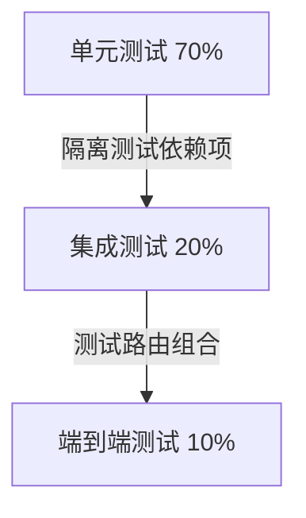

扫描[二维码](https://api2.cmdragon.cn/upload/cmder/20250304_012821924.jpg)
关注或者微信搜一搜：`编程智域 前端至全栈交流与成长`

[发现1000+提升效率与开发的AI工具和实用程序](https://tools.cmdragon.cn/zh/apps?category=ai_chat)：https://tools.cmdragon.cn/

## 一、FastAPI单元测试核心概念

### 1.1 单元测试在FastAPI中的重要性

单元测试是确保FastAPI应用质量的核心环节，能有效验证各个组件独立工作的正确性。在开发中，我们特别关注**依赖注入系统的隔离测试
**，因为FastAPI的核心特性——依赖注入机制——将直接影响路由行为和业务逻辑。优秀的单元测试能：

1. 快速定位接口边界问题
2. 防止依赖修改引发的连锁错误
3. 验证参数验证逻辑（Pydantic模型）
4. 保障中间件和依赖项按预期工作

### 1.2 测试金字塔与FastAPI测试策略



在FastAPI实践中，单元测试应占据最大比重，核心在于**隔离测试依赖项函数**，避免因外部服务（数据库、API等）不可用导致测试失败。

## 二、依赖项函数隔离测试实践

### 2.1 依赖注入系统的工作原理

FastAPI的依赖注入通过 `Depends()` 实现自动解析：

1. 框架自动分析函数参数签名
2. 解析依赖树并执行依赖函数
3. 将返回值注入到路由处理函数
4. 支持同步/异步依赖

### 2.2 依赖项隔离测试技巧

#### 技巧1：模拟依赖返回

```python
from fastapi import Depends, FastAPI
from unittest.mock import MagicMock

app = FastAPI()


def get_db():
    """模拟数据库连接"""
    return "real_db_connection"


@app.get("/items")
async def read_items(db: str = Depends(get_db)):
    return {"db": db}


# 测试时替换真实依赖
def test_read_items():
    app.dependency_overrides[get_db] = lambda: "mocked_db"  # 🎯 核心替换技巧
    response = client.get("/items")
    assert response.json() == {"db": "mocked_db"}
```

#### 技巧2：依赖项层级隔离

```python
def auth_check(token: str = Header(...)):
    return {"user": "admin"}


def get_data(auth: dict = Depends(auth_check)):
    return f"data_for_{auth['user']}"


# 测试时只替换底层依赖
def test_get_data():
    app.dependency_overrides[auth_check] = lambda: {"user": "test"}
    result = get_data()
    assert "data_for_test" in result
```

#### 技巧3：异步依赖处理

```python
async def async_dep():
    return {"status": "ok"}


# 测试异步依赖
def test_async_dep():
    app.dependency_overrides[async_dep] = lambda: {"status": "mocked"}
    response = client.get("/async-route")
    assert response.json()["status"] == "mocked"
```

### 2.3 案例：用户认证测试

```python
from pydantic import BaseModel


class User(BaseModel):
    id: int
    name: str


def current_user(token: str = Header(...)) -> User:
    # 实际会查数据库或验证JWT
    return User(id=1, name="admin")


# 测试用例
def test_admin_access():
    # 1. 创建模拟管理员用户
    app.dependency_overrides[current_user] = lambda: User(id=1, name="admin")

    # 2. 调用需要管理员权限的路由
    response = client.get("/admin/dashboard")

    # 3. 验证访问结果
    assert response.status_code == 200


def test_guest_access():
    # 1. 模拟访客用户
    app.dependency_overrides[current_user] = lambda: User(id=0, name="guest")

    # 2. 验证权限错误
    response = client.get("/admin/dashboard")
    assert response.status_code == 403  # 🚫 禁止访问
```

## 三、测试示例

### 3.1 测试环境配置

```python
# requirements.txt
fastapi == 0.103
.2
pydantic == 2.5
.2
uvicorn == 0.23
.2
pytest == 7.4
.3
httpx == 0.25
.2
```

```python
# test_dependencies.py
from fastapi.testclient import TestClient
from main import app  # 导入FastAPI实例

client = TestClient(app)


# 测试后清理依赖覆盖
def teardown_function():
    app.dependency_overrides.clear()
```

### 3.2 复杂依赖树测试

```python
def dep_a():
    return "a"


def dep_b(a: str = Depends(dep_a)):
    return f"b_{a}"


@app.get("/combined")
def get_combined(
        a: str = Depends(dep_a),
        b: str = Depends(dep_b)
):
    return {"a": a, "b": b}


def test_dependency_chaining():
    # 只替换最底层依赖
    app.dependency_overrides[dep_a] = lambda: "mock"

    response = client.get("/combined")
    data = response.json()

    assert data["a"] == "mock"
    assert data["b"] == "b_mock"  # 验证依赖链传递
```

## 四、课后Quiz

1. **问题**：如何测试需要验证HTTP头信息的依赖项？
   ```python
   def check_token(authorization: str = Header(...)):
       return authorization.split()[-1]
   ```
   **选项**：  
   A. 直接在测试函数中设置头信息  
   B. 使用`dependency_overrides`替换依赖项  
   C. 修改全局配置禁用认证  
   **答案与解析**：  
   A ✅ - 正确方式是在HTTP请求中添加Header：
   ```python
   response = client.get("/secure", headers={"authorization": "Bearer test_token"})
   ```
   因为Header参数是直接从请求中提取的，应通过客户端模拟真实请求上下文测试

2. **问题**：当看到`401 Unauthorized`错误时，最可能的依赖注入问题是什么？  
   **解析**：该错误表明依赖项中的认证逻辑拒绝了请求，需要检查：
    - 测试是否提供了正确的认证凭据
    - 模拟的依赖项是否返回了有效身份对象
    - 路由的依赖项声明是否正确

## 五、常见报错解决方案

### 5.1 错误：`422 Validation Error`

**产生原因**：

1. Pydantic模型验证失败
2. 依赖项返回值类型与声明不符
3. 路由参数缺失或类型错误

**解决方案**：

1. 检查依赖项返回类型是否匹配路由预期：
   ```python
   # 错误示例：返回字符串但路由期望User对象
   def current_user() -> str:
       return "user"
   
   @app.get("/")
   def home(user: User = Depends(current_user)): ...
   ```
2. 使用TestClient时打印详细错误：
   ```python
   response = client.get(...)
   print(response.json())  # 查看detail字段中的具体错误
   ```
3. 验证路由参数是否符合OpenAPI文档定义

### 5.2 错误：`AttributeError: module has no attribute 'dependency_overrides'`

**产生原因**：  
测试脚本未正确初始化FastAPP实例  
**解决方案**：  
确保从主模块导入app实例：

```python
# 正确导入方式
from main import app

client = TestClient(app)
```

### 5.3 错误：`RuntimeError: Event loop is closed`

**产生原因**：  
异步依赖项未正确处理  
**解决方案**：

1. 使用`anyio`作为异步测试后端：
   ```python
   pip install anyio==3.7.1
   ```
2. 在测试用例中添加异步支持：
   ```python
   import anyio
   
   def test_async_dep():
       async def inner():
           response = client.get("/async")
           assert response.status_code == 200
       anyio.run(inner)
   ```

余下文章内容请点击跳转至 个人博客页面 或者 扫码关注或者微信搜一搜：`编程智域 前端至全栈交流与成长`
，阅读完整的文章：[如何在FastAPI中玩转依赖注入的单元测试魔法？](https://blog.cmdragon.cn/posts/77ae327dc941b0e74ecc6a8794c084d0/)


<details>
<summary>往期文章归档</summary>

- [测试覆盖率不够高？这些技巧让你的FastAPI测试无懈可击！ - cmdragon's Blog](https://blog.cmdragon.cn/posts/0577d0e24f48b3153b510e74d3d1a822/)
- [为什么你的FastAPI测试覆盖率总是低得让人想哭？ - cmdragon's Blog](https://blog.cmdragon.cn/posts/985c18ca802f1b6da828b92e082b4d4e/)
- [如何让FastAPI测试不再成为你的噩梦？ - cmdragon's Blog](https://blog.cmdragon.cn/posts/29858a7a10d20b4e4649cb75fb422eab/)
- [FastAPI测试环境配置的秘诀，你真的掌握了吗？ - cmdragon's Blog](https://blog.cmdragon.cn/posts/6f9e71e8313db6de8c1431877a70b67e/)
- [全链路追踪如何让FastAPI微服务架构的每个请求都无所遁形？ - cmdragon's Blog](https://blog.cmdragon.cn/posts/30e1d2fbf1ad8123eaf0e1e0dbe7c675/)
- [如何在API高并发中玩转资源隔离与限流策略？ - cmdragon's Blog](https://blog.cmdragon.cn/posts/4ad4ec1dbd80bcf5670fb397ca7cc68c/)
- [任务分片执行模式如何让你的FastAPI性能飙升？ - cmdragon's Blog](https://blog.cmdragon.cn/posts/c6a598639f6a831e9e82e171b8d71857/)
- [冷热任务分离：是提升Web性能的终极秘籍还是技术噱头？ - cmdragon's Blog](https://blog.cmdragon.cn/posts/9c3dc7767a9282f7ef02daad42539f2c/)
- [如何让FastAPI在百万级任务处理中依然游刃有余？ - cmdragon's Blog](https://blog.cmdragon.cn/posts/469aae0e0f88c642ed8bc82e102b960b/)
- [如何让FastAPI与消息队列的联姻既甜蜜又可靠？ - cmdragon's Blog](https://blog.cmdragon.cn/posts/1bebb53f4d9d6fbd0ecbba97562c07b0/)
- [如何在FastAPI中巧妙实现延迟队列，让任务乖乖等待？ - cmdragon's Blog](https://blog.cmdragon.cn/posts/174450702d9e609a072a7d1aaa84750b/)
- [FastAPI的死信队列处理机制：为何你的消息系统需要它？ - cmdragon's Blog](https://blog.cmdragon.cn/posts/047b08957a0d617a87b72da6c3131e5d/)
- [如何让FastAPI任务系统在失败时自动告警并自我修复？ - cmdragon's Blog](https://blog.cmdragon.cn/posts/2f104637ecc916e906c002fa79ab8c80/)
- [如何用Prometheus和FastAPI打造任务监控的“火眼金睛”？ - cmdragon's Blog](https://blog.cmdragon.cn/posts/e7464e5b4d558ede1a7413fa0a2f96f3/)
- [如何用APScheduler和FastAPI打造永不宕机的分布式定时任务系统？ - cmdragon's Blog](https://blog.cmdragon.cn/posts/51a0ff47f509fb6238150a96f551b317/)
- [如何在 FastAPI 中玩转 APScheduler，让任务定时自动执行？ - cmdragon's Blog](https://blog.cmdragon.cn/posts/85564dd901c6d9b1a79d320970843caa/)
- [定时任务系统如何让你的Web应用自动完成那些烦人的重复工作？ - cmdragon's Blog](https://blog.cmdragon.cn/posts/2b27950aab76203a1af4e9e3deda8699/)
- [Celery任务监控的魔法背后藏着什么秘密？ - cmdragon's Blog](https://blog.cmdragon.cn/posts/f43335725bb3372ebc774db1b9f28d2d/)
- [如何让Celery任务像VIP客户一样享受优先待遇？ - cmdragon's Blog](https://blog.cmdragon.cn/posts/c24491a7ac7f7c5e9cf77596ebb27c51/)
- [如何让你的FastAPI Celery Worker在压力下优雅起舞？ - cmdragon's Blog](https://blog.cmdragon.cn/posts/c3129f4b424d2ed2330484b82ec31875/)
- [FastAPI与Celery的完美邂逅，如何让异步任务飞起来？ - cmdragon's Blog](https://blog.cmdragon.cn/posts/b79c2c1805fe9b1ea28326b5b8f3b709/)
- [FastAPI消息持久化与ACK机制：如何确保你的任务永不迷路？ - cmdragon's Blog](https://blog.cmdragon.cn/posts/13a59846aaab71b44ab6f3dadc5b5ec7/)
- [FastAPI的BackgroundTasks如何玩转生产者-消费者模式？ - cmdragon's Blog](https://blog.cmdragon.cn/posts/1549a6bd7e47e7006e7ba8f52bcfe8eb/)
- [BackgroundTasks 还是 RabbitMQ？你的异步任务到底该选谁？ - cmdragon's Blog](https://blog.cmdragon.cn/posts/d26fdc150ff9dd70c7482381ff4c77c4/)
- [BackgroundTasks与Celery：谁才是异步任务的终极赢家？ - cmdragon's Blog](https://blog.cmdragon.cn/posts/792cac4ce6eb96b5001da15b0d52ef83/)
- [如何在 FastAPI 中优雅处理后台任务异常并实现智能重试？ - cmdragon's Blog](https://blog.cmdragon.cn/posts/d5c1d2efbaf6fe4c9e13acc6be6d929a/)
- [BackgroundTasks 如何巧妙驾驭多任务并发？ - cmdragon's Blog](https://blog.cmdragon.cn/posts/8661dc74944bd6fb28092e90d4060161/)
- [如何让FastAPI后台任务像多米诺骨牌一样井然有序地执行？ - cmdragon's Blog](https://blog.cmdragon.cn/posts/7693d3430a6256c2abefc1e4aba21a4a/)
- [FastAPI后台任务：是时候让你的代码飞起来了吗？ - cmdragon's Blog](https://blog.cmdragon.cn/posts/6145d88d5154d5cd38cee7ddc2d46e1d/)
- [FastAPI后台任务为何能让邮件发送如此丝滑？ - cmdragon's Blog](https://blog.cmdragon.cn/posts/19241679a1852122f740391cbdc21bae/)
- [FastAPI的请求-响应周期为何需要后台任务分离？ - cmdragon's Blog](https://blog.cmdragon.cn/posts/c7b54d6b3b6b5041654e69e5610bf3b9/)
- [如何在FastAPI中让后台任务既高效又不会让你的应用崩溃？ - cmdragon's Blog](https://blog.cmdragon.cn/posts/5ad8d0a4c8f2d05e9c1a42d828aad7b3/)
- [FastAPI后台任务：异步魔法还是同步噩梦？ - cmdragon's Blog](https://blog.cmdragon.cn/posts/6a69eca9fd14ba8f6fa41502c5014edd/)
- [如何在FastAPI中玩转Schema版本管理和灰度发布？ - cmdragon's Blog](https://blog.cmdragon.cn/posts/6d9d20cd8d8528da4193f13aaf98575c/)
- [FastAPI的查询白名单和安全沙箱机制如何确保你的API坚不可摧？ - cmdragon's Blog](https://blog.cmdragon.cn/posts/ca141239cfc5c0d510960acd266de9cd/)
- [如何在 FastAPI 中玩转 GraphQL 性能监控与 APM 集成？ - cmdragon's Blog](https://blog.cmdragon.cn/posts/52fe9ea73b0e26de308ae0e539df21d2/)
- [如何在 FastAPI 中玩转 GraphQL 和 WebSocket 的实时数据推送魔法？ - cmdragon's Blog](https://blog.cmdragon.cn/posts/ae484cf6bcf3f44fd8392a8272e57db4/)

</details>


<details>
<summary>免费好用的热门在线工具</summary>

- [ASCII字符画生成器 - 应用商店 | By cmdragon](https://tools.cmdragon.cn/zh/apps/ascii-art-generator)
- [JSON Web Tokens 工具 - 应用商店 | By cmdragon](https://tools.cmdragon.cn/zh/apps/jwt-tool)
- [Bcrypt 密码工具 - 应用商店 | By cmdragon](https://tools.cmdragon.cn/zh/apps/bcrypt-tool)
- [GIF 合成器 - 应用商店 | By cmdragon](https://tools.cmdragon.cn/zh/apps/gif-composer)
- [GIF 分解器 - 应用商店 | By cmdragon](https://tools.cmdragon.cn/zh/apps/gif-decomposer)
- [文本隐写术 - 应用商店 | By cmdragon](https://tools.cmdragon.cn/zh/apps/text-steganography)
- [CMDragon 在线工具 - 高级AI工具箱与开发者套件 | 免费好用的在线工具](https://tools.cmdragon.cn/zh)
- [应用商店 - 发现1000+提升效率与开发的AI工具和实用程序 | 免费好用的在线工具](https://tools.cmdragon.cn/zh/apps?category=trending)
- [CMDragon 更新日志 - 最新更新、功能与改进 | 免费好用的在线工具](https://tools.cmdragon.cn/zh/changelog)
- [支持我们 - 成为赞助者 | 免费好用的在线工具](https://tools.cmdragon.cn/zh/sponsor)
- [AI文本生成图像 - 应用商店 | 免费好用的在线工具](https://tools.cmdragon.cn/zh/apps/text-to-image-ai)
- [临时邮箱 - 应用商店 | 免费好用的在线工具](https://tools.cmdragon.cn/zh/apps/temp-email)
- [二维码解析器 - 应用商店 | 免费好用的在线工具](https://tools.cmdragon.cn/zh/apps/qrcode-parser)
- [文本转思维导图 - 应用商店 | 免费好用的在线工具](https://tools.cmdragon.cn/zh/apps/text-to-mindmap)
- [正则表达式可视化工具 - 应用商店 | 免费好用的在线工具](https://tools.cmdragon.cn/zh/apps/regex-visualizer)
- [文件隐写工具 - 应用商店 | 免费好用的在线工具](https://tools.cmdragon.cn/zh/apps/steganography-tool)
- [IPTV 频道探索器 - 应用商店 | 免费好用的在线工具](https://tools.cmdragon.cn/zh/apps/iptv-explorer)
- [快传 - 应用商店 | 免费好用的在线工具](https://tools.cmdragon.cn/zh/apps/snapdrop)
- [随机抽奖工具 - 应用商店 | 免费好用的在线工具](https://tools.cmdragon.cn/zh/apps/lucky-draw)
- [动漫场景查找器 - 应用商店 | 免费好用的在线工具](https://tools.cmdragon.cn/zh/apps/anime-scene-finder)
- [时间工具箱 - 应用商店 | 免费好用的在线工具](https://tools.cmdragon.cn/zh/apps/time-toolkit)
- [网速测试 - 应用商店 | 免费好用的在线工具](https://tools.cmdragon.cn/zh/apps/speed-test)
- [AI 智能抠图工具 - 应用商店 | 免费好用的在线工具](https://tools.cmdragon.cn/zh/apps/background-remover)
- [背景替换工具 - 应用商店 | 免费好用的在线工具](https://tools.cmdragon.cn/zh/apps/background-replacer)
- [艺术二维码生成器 - 应用商店 | 免费好用的在线工具](https://tools.cmdragon.cn/zh/apps/artistic-qrcode)
- [Open Graph 元标签生成器 - 应用商店 | 免费好用的在线工具](https://tools.cmdragon.cn/zh/apps/open-graph-generator)
- [图像对比工具 - 应用商店 | 免费好用的在线工具](https://tools.cmdragon.cn/zh/apps/image-comparison)
- [图片压缩专业版 - 应用商店 | 免费好用的在线工具](https://tools.cmdragon.cn/zh/apps/image-compressor)
- [密码生成器 - 应用商店 | 免费好用的在线工具](https://tools.cmdragon.cn/zh/apps/password-generator)
- [SVG优化器 - 应用商店 | 免费好用的在线工具](https://tools.cmdragon.cn/zh/apps/svg-optimizer)
- [调色板生成器 - 应用商店 | 免费好用的在线工具](https://tools.cmdragon.cn/zh/apps/color-palette)
- [在线节拍器 - 应用商店 | 免费好用的在线工具](https://tools.cmdragon.cn/zh/apps/online-metronome)
- [IP归属地查询 - 应用商店 | 免费好用的在线工具](https://tools.cmdragon.cn/zh/apps/ip-geolocation)
- [CSS网格布局生成器 - 应用商店 | 免费好用的在线工具](https://tools.cmdragon.cn/zh/apps/css-grid-layout)
- [邮箱验证工具 - 应用商店 | 免费好用的在线工具](https://tools.cmdragon.cn/zh/apps/email-validator)
- [书法练习字帖 - 应用商店 | 免费好用的在线工具](https://tools.cmdragon.cn/zh/apps/calligraphy-practice)
- [金融计算器套件 - 应用商店 | 免费好用的在线工具](https://tools.cmdragon.cn/zh/apps/finance-calculator-suite)
- [中国亲戚关系计算器 - 应用商店 | 免费好用的在线工具](https://tools.cmdragon.cn/zh/apps/chinese-kinship-calculator)
- [Protocol Buffer 工具箱 - 应用商店 | 免费好用的在线工具](https://tools.cmdragon.cn/zh/apps/protobuf-toolkit)
- [IP归属地查询 - 应用商店 | 免费好用的在线工具](https://tools.cmdragon.cn/zh/apps/ip-geolocation)
- [图片无损放大 - 应用商店 | 免费好用的在线工具](https://tools.cmdragon.cn/zh/apps/image-upscaler)
- [文本比较工具 - 应用商店 | 免费好用的在线工具](https://tools.cmdragon.cn/zh/apps/text-compare)
- [IP批量查询工具 - 应用商店 | 免费好用的在线工具](https://tools.cmdragon.cn/zh/apps/ip-batch-lookup)
- [域名查询工具 - 应用商店 | 免费好用的在线工具](https://tools.cmdragon.cn/zh/apps/domain-finder)
- [DNS工具箱 - 应用商店 | 免费好用的在线工具](https://tools.cmdragon.cn/zh/apps/dns-toolkit)
- [网站图标生成器 - 应用商店 | 免费好用的在线工具](https://tools.cmdragon.cn/zh/apps/favicon-generator)
- [XML Sitemap](https://tools.cmdragon.cn/sitemap_index.xml)

</details>