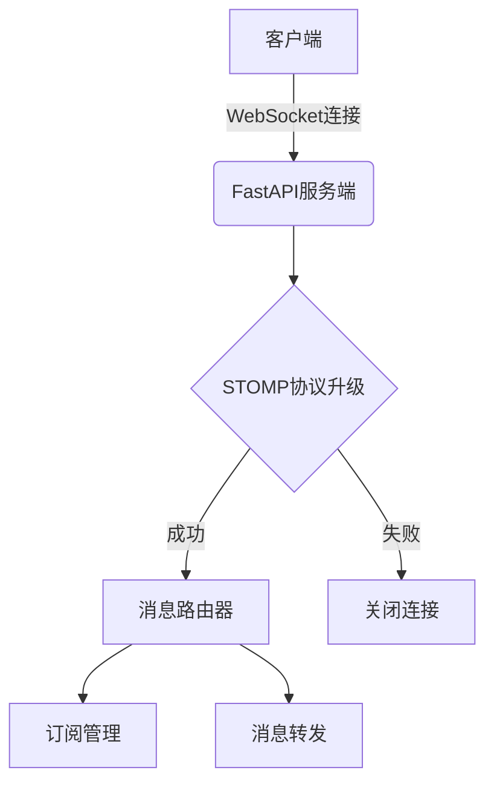

扫描[二维码](https://api2.cmdragon.cn/upload/cmder/20250304_012821924.jpg)
关注或者微信搜一搜：`编程智域 前端至全栈交流与成长`

[发现1000+提升效率与开发的AI工具和实用程序](https://tools.cmdragon.cn/zh/apps?category=ai_chat)：https://tools.cmdragon.cn/

---

### 1. STOMP协议基础

STOMP（Simple Text Oriented Messaging Protocol）是一种基于文本的轻量级消息协议，常用于实现发布/订阅模式。与直接使用WebSocket相比，STOMP提供了更结构化的消息格式，支持以下核心功能：

- **消息目的地**（Destination）：消息发送的目标地址（如"/topic/news"）
- **消息头**（Headers）：包含元数据的键值对（如消息类型、内容长度）
- **消息体**（Body）：实际传输的数据内容（JSON/文本格式）

在FastAPI中实现STOMP协议的核心思路是通过WebSocket建立连接后，在消息处理层添加STOMP协议解析器。整个过程分为三个阶段：

1. 客户端发送`CONNECT`帧建立STOMP会话
2. 使用`SUBSCRIBE`命令订阅消息通道
3. 通过`SEND`命令向指定目的地发送消息



---

### 2. FastAPI实现STOMP协议

以下示例代码演示了如何在FastAPI中实现STOMP协议支持：

```python
# 环境依赖：fastapi==0.103.0 uvicorn==0.23.2 stomp.py==8.0.1
from fastapi import FastAPI, WebSocket
from stomp import parse_frame, Frame

app = FastAPI()


class StompManager:
    def __init__(self):
        self.subscriptions = {}

    async def handle_connect(self, frame, websocket):
        # 协议版本验证
        if frame.headers.get('accept-version') != '1.2':
            await websocket.send_text('ERROR\nversion-not-supported\n\n')
            return False
        return True

    async def handle_subscribe(self, frame, websocket):
        destination = frame.headers['destination']
        sub_id = frame.headers['id']
        self.subscriptions[sub_id] = {
            'destination': destination,
            'websocket': websocket
        }


@app.websocket("/stomp")
async def websocket_endpoint(websocket: WebSocket):
    await websocket.accept()
    manager = StompManager()

    try:
        while True:
            data = await websocket.receive_text()
            frame = parse_frame(data)

            if frame.command == 'CONNECT':
                if await manager.handle_connect(frame, websocket):
                    await websocket.send_text("CONNECTED\nversion:1.2\n\n")
            elif frame.command == 'SUBSCRIBE':
                await manager.handle_subscribe(frame, websocket)
            elif frame.command == 'SEND':
                # 消息路由逻辑
                pass

    except Exception as e:
        print(f"连接异常: {str(e)}")
```

#### 代码解析：

1. **STOMP帧解析**：使用`stomp.py`库的`parse_frame`方法解析原始消息
2. **会话管理**：通过`StompManager`类维护订阅关系
3. **协议协商**：在`CONNECT`阶段验证协议版本兼容性
4. **订阅管理**：使用字典存储订阅ID与WebSocket的映射关系

---

### 3. 最佳实践示例

实现消息广播功能的核心代码：

```python
from typing import Dict
from fastapi import WebSocket
from pydantic import BaseModel


class Subscription(BaseModel):
    destination: str
    websocket: WebSocket


class MessageRouter:
    def __init__(self):
        self.channels: Dict[str, list] = {}

    async def add_subscriber(self, channel: str, websocket: WebSocket):
        if channel not in self.channels:
            self.channels[channel] = []
        self.channels[channel].append(websocket)

    async def broadcast(self, channel: str, message: str):
        for ws in self.channels.get(channel, []):
            await ws.send_text(message)


# 在SEND命令处理中调用
async def handle_send(frame, router: MessageRouter):
    destination = frame.headers['destination']
    await router.broadcast(destination, frame.body)
```

---

### 4. 课后Quiz

**问题1**：当客户端发送的STOMP协议版本不匹配时，服务端应该返回什么响应？  
*答案*：服务端应返回`ERROR`帧，并在headers中包含`version-not-supported`错误码，立即关闭连接。

**问题2**：如何防止消息路由时的循环广播？  
*答案*：在消息头中添加`message-id`字段，服务端维护已处理消息ID的缓存，对重复ID的消息直接丢弃。

---

### 5. 常见报错处理

**报错1**：`STOMP Protocol Error: Missing required header 'destination'`  
*原因*：SEND或SUBSCRIBE帧缺少destination头  
*解决方案*：

1. 检查客户端代码是否正确设置destination
2. 服务端添加头校验逻辑：

```python
if 'destination' not in frame.headers:
    await websocket.send_text('ERROR\nmissing-destination\n\n')
```

**报错2**：`WebSocket connection is already closed`  
*原因*：尝试向已关闭的连接发送消息  
*解决方案*：

```python
# 发送前检查连接状态
for ws in list(self.channels[channel]):
    if ws.client_state == WebSocketState.DISCONNECTED:
        self.channels[channel].remove(ws)
```

余下文章内容请点击跳转至 个人博客页面 或者 扫码关注或者微信搜一搜：`编程智域 前端至全栈交流与成长`
，阅读完整的文章：[如何在FastAPI中玩转STOMP协议升级，让你的消息传递更高效？](https://blog.cmdragon.cn/posts/16744b2f460346805c45314bc0c6f751/)

## 往期文章归档：

- [如何用WebSocket打造毫秒级实时协作系统？ - cmdragon's Blog](https://blog.cmdragon.cn/posts/da5b64cb0ded23e4d5b1f19ffd5ac53d/)
- [如何用WebSocket打造毫秒级实时协作系统？ - cmdragon's Blog](https://blog.cmdragon.cn/posts/da5b64cb0ded23e4d5b1f19ffd5ac53d/)
- [如何让你的WebSocket连接既安全又高效？](https://blog.cmdragon.cn/posts/eb598d50b76ea1823746ab7cdf49ce05/)
- [如何让多客户端会话管理不再成为你的技术噩梦？ - cmdragon's Blog](https://blog.cmdragon.cn/posts/08ba771dbb2eec087c4bc6dc584113c5/)
- [如何在FastAPI中玩转WebSocket消息处理？](https://blog.cmdragon.cn/posts/fbf7d6843e430133547057254deb2dfb/)
- [如何在FastAPI中玩转WebSocket，让实时通信不再烦恼？ - cmdragon's Blog](https://blog.cmdragon.cn/posts/0faebb0f6c2b1bde4ba75869f4f67b76/)
- [WebSocket与HTTP协议究竟有何不同？FastAPI如何让长连接变得如此简单？ - cmdragon's Blog](https://blog.cmdragon.cn/posts/903448c85701a6a747fc9a4417e2bdc8/)
- [FastAPI如何玩转安全防护，让黑客望而却步？](https://blog.cmdragon.cn/posts/c1314c623211c9269f36053179a53d5c/)
- [如何用三层防护体系打造坚不可摧的 API 安全堡垒？ - cmdragon's Blog](https://blog.cmdragon.cn/posts/0bbb4a455ef36bf6f81ac97189586fda/#%E4%B8%80jwt-%E8%AE%A4%E8%AF%81%E8%81%94%E8%B0%83%E6%96%B9%E6%A1%88)
- [FastAPI安全加固：密钥轮换、限流策略与安全头部如何实现三重防护？ - cmdragon's Blog](https://blog.cmdragon.cn/posts/f96ba438de34dc197fd2598f91ae133d/)
- [如何在FastAPI中巧妙玩转数据脱敏，让敏感信息安全无忧？ - cmdragon's Blog](https://blog.cmdragon.cn/posts/045021f8831a03bcdf71e44cb793baf4/)
- [RBAC权限模型如何让API访问控制既安全又灵活？ - cmdragon's Blog](https://blog.cmdragon.cn/posts/9f01e838545ae8d34016c759ef461423/)
- [FastAPI中的敏感数据如何在不泄露的情况下翩翩起舞？](https://blog.cmdragon.cn/posts/88e8615e4c961e7a4f0ef31c0e41cb0b/)
- [FastAPI安全认证的终极秘籍：OAuth2与JWT如何完美融合？ - cmdragon's Blog](https://blog.cmdragon.cn/posts/17d5c40ff6c84ad652f962fed0ce46ab/)
- [如何在FastAPI中打造坚不可摧的Web安全防线？ - cmdragon's Blog](https://blog.cmdragon.cn/posts/9d6200ae7ce0a1a1a523591e3d65a82e/)
- [如何用 FastAPI 和 RBAC 打造坚不可摧的安全堡垒？ - cmdragon's Blog](https://blog.cmdragon.cn/posts/d878b5dbef959058b8098551c70594f8/)
- [FastAPI权限配置：你的系统真的安全吗？ - cmdragon's Blog](https://blog.cmdragon.cn/posts/96b6ede65030daa4613ab92da1d739a6/#%E5%BE%80%E6%9C%9F%E6%96%87%E7%AB%A0%E5%BD%92%E6%A1%A3)
- [FastAPI权限缓存：你的性能瓶颈是否藏在这只“看不见的手”里？ | cmdragon's Blog](https://blog.cmdragon.cn/posts/0c8c5a3fdaf69250ac3db7429b102625/)
- [FastAPI日志审计：你的权限系统是否真的安全无虞？ | cmdragon's Blog](https://blog.cmdragon.cn/posts/84bf7b11b342415bddb50e0521c64dfe/)
- [如何在FastAPI中打造坚不可摧的安全防线？ | cmdragon's Blog](https://blog.cmdragon.cn/posts/e2ec1e31dd5d97e0f32d2125385fd955/)
- [如何在FastAPI中实现权限隔离并让用户乖乖听话？ | cmdragon's Blog](https://blog.cmdragon.cn/posts/74777546a240b16b32196e5eb29ec8f7/)
- [如何在FastAPI中玩转权限控制与测试，让代码安全又优雅？ | cmdragon's Blog](https://blog.cmdragon.cn/posts/9dd24a9753ba15f98f24c1e5134fe40e/)
- [如何在FastAPI中打造一个既安全又灵活的权限管理系统？ | cmdragon's Blog](https://blog.cmdragon.cn/posts/277aa1628a2fa9855cdfe5f7c302bd92/)
- [FastAPI访问令牌的权限声明与作用域管理：你的API安全真的无懈可击吗？ | cmdragon's Blog](https://blog.cmdragon.cn/posts/82bae833ad460aec0965cc77b7d6f652/)
- [如何在FastAPI中构建一个既安全又灵活的多层级权限系统？ | cmdragon's Blog](https://blog.cmdragon.cn/posts/13fc113ef1dff03927d46235ad333a7f/)
- [FastAPI如何用角色权限让Web应用安全又灵活？ | cmdragon's Blog](https://blog.cmdragon.cn/posts/cc7aa0af577ae2bc0694e76886373e12/)
- [FastAPI权限验证依赖项究竟藏着什么秘密？ | cmdragon's Blog](https://blog.cmdragon.cn/posts/3e287e8b907561728ded1be34a19b22c/)
- [如何用FastAPI和Tortoise-ORM打造一个既高效又灵活的角色管理系统？ | cmdragon's Blog](https://blog.cmdragon.cn/posts/2b0a2003074eba56a6f6c57aa9690900/)
- [JWT令牌如何在FastAPI中实现安全又高效的生成与验证？ | cmdragon's Blog](https://blog.cmdragon.cn/posts/031a4b22bb8d624cf23ef593f72d1ec6/)
- [你的密码存储方式是否在向黑客招手？ | cmdragon's Blog](https://blog.cmdragon.cn/posts/5f8821250c5a4e9cc08bd08faef76c77/)
- [如何在FastAPI中轻松实现OAuth2认证并保护你的API？ | cmdragon's Blog](https://blog.cmdragon.cn/posts/c290754b532ebf91c5415aa0b30715d0/)
- [FastAPI安全机制：从OAuth2到JWT的魔法通关秘籍 | cmdragon's Blog](https://blog.cmdragon.cn/posts/30ed200ec25b55e1ba159366401ed6ee/)
- [FastAPI认证系统：从零到令牌大师的奇幻之旅 | cmdragon's Blog](https://blog.cmdragon.cn/posts/69f7189d3ff058334889eb2e02f2ea2c/)
- [FastAPI安全异常处理：从401到422的奇妙冒险 | cmdragon's Blog](https://blog.cmdragon.cn/posts/92a7a3de40eb9ce71620716632f68676/)
- [FastAPI权限迷宫：RBAC与多层级依赖的魔法通关秘籍 | cmdragon's Blog](https://blog.cmdragon.cn/posts/ee5486714707d4835d4a774696dca30a/)
- [JWT令牌：从身份证到代码防伪的奇妙之旅 | cmdragon's Blog](https://blog.cmdragon.cn/posts/a39277914464b007ac61874292578de0/)

## 免费好用的热门在线工具

- [CMDragon 在线工具 - 高级AI工具箱与开发者套件 | 免费好用的在线工具](https://tools.cmdragon.cn/zh)
- [应用商店 - 发现1000+提升效率与开发的AI工具和实用程序 | 免费好用的在线工具](https://tools.cmdragon.cn/zh/apps?category=trending)
- [CMDragon 更新日志 - 最新更新、功能与改进 | 免费好用的在线工具](https://tools.cmdragon.cn/zh/changelog)
- [支持我们 - 成为赞助者 | 免费好用的在线工具](https://tools.cmdragon.cn/zh/sponsor)
- [AI文本生成图像 - 应用商店 | 免费好用的在线工具](https://tools.cmdragon.cn/zh/apps/text-to-image-ai)
- [临时邮箱 - 应用商店 | 免费好用的在线工具](https://tools.cmdragon.cn/zh/apps/temp-email)
- [二维码解析器 - 应用商店 | 免费好用的在线工具](https://tools.cmdragon.cn/zh/apps/qrcode-parser)
- [文本转思维导图 - 应用商店 | 免费好用的在线工具](https://tools.cmdragon.cn/zh/apps/text-to-mindmap)
- [正则表达式可视化工具 - 应用商店 | 免费好用的在线工具](https://tools.cmdragon.cn/zh/apps/regex-visualizer)
- [文件隐写工具 - 应用商店 | 免费好用的在线工具](https://tools.cmdragon.cn/zh/apps/steganography-tool)
- [IPTV 频道探索器 - 应用商店 | 免费好用的在线工具](https://tools.cmdragon.cn/zh/apps/iptv-explorer)
- [快传 - 应用商店 | 免费好用的在线工具](https://tools.cmdragon.cn/zh/apps/snapdrop)
- [随机抽奖工具 - 应用商店 | 免费好用的在线工具](https://tools.cmdragon.cn/zh/apps/lucky-draw)
- [动漫场景查找器 - 应用商店 | 免费好用的在线工具](https://tools.cmdragon.cn/zh/apps/anime-scene-finder)
- [时间工具箱 - 应用商店 | 免费好用的在线工具](https://tools.cmdragon.cn/zh/apps/time-toolkit)
- [网速测试 - 应用商店 | 免费好用的在线工具](https://tools.cmdragon.cn/zh/apps/speed-test)
- [AI 智能抠图工具 - 应用商店 | 免费好用的在线工具](https://tools.cmdragon.cn/zh/apps/background-remover)
- [背景替换工具 - 应用商店 | 免费好用的在线工具](https://tools.cmdragon.cn/zh/apps/background-replacer)
- [艺术二维码生成器 - 应用商店 | 免费好用的在线工具](https://tools.cmdragon.cn/zh/apps/artistic-qrcode)
- [Open Graph 元标签生成器 - 应用商店 | 免费好用的在线工具](https://tools.cmdragon.cn/zh/apps/open-graph-generator)
- [图像对比工具 - 应用商店 | 免费好用的在线工具](https://tools.cmdragon.cn/zh/apps/image-comparison)
- [图片压缩专业版 - 应用商店 | 免费好用的在线工具](https://tools.cmdragon.cn/zh/apps/image-compressor)
- [密码生成器 - 应用商店 | 免费好用的在线工具](https://tools.cmdragon.cn/zh/apps/password-generator)
- [SVG优化器 - 应用商店 | 免费好用的在线工具](https://tools.cmdragon.cn/zh/apps/svg-optimizer)
- [调色板生成器 - 应用商店 | 免费好用的在线工具](https://tools.cmdragon.cn/zh/apps/color-palette)
- [在线节拍器 - 应用商店 | 免费好用的在线工具](https://tools.cmdragon.cn/zh/apps/online-metronome)
- [IP归属地查询 - 应用商店 | 免费好用的在线工具](https://tools.cmdragon.cn/zh/apps/ip-geolocation)
- [CSS网格布局生成器 - 应用商店 | 免费好用的在线工具](https://tools.cmdragon.cn/zh/apps/css-grid-layout)
- [邮箱验证工具 - 应用商店 | 免费好用的在线工具](https://tools.cmdragon.cn/zh/apps/email-validator)
- [书法练习字帖 - 应用商店 | 免费好用的在线工具](https://tools.cmdragon.cn/zh/apps/calligraphy-practice)
- [金融计算器套件 - 应用商店 | 免费好用的在线工具](https://tools.cmdragon.cn/zh/apps/finance-calculator-suite)
- [中国亲戚关系计算器 - 应用商店 | 免费好用的在线工具](https://tools.cmdragon.cn/zh/apps/chinese-kinship-calculator)
- [Protocol Buffer 工具箱 - 应用商店 | 免费好用的在线工具](https://tools.cmdragon.cn/zh/apps/protobuf-toolkit)
- [IP归属地查询 - 应用商店 | 免费好用的在线工具](https://tools.cmdragon.cn/zh/apps/ip-geolocation)
- [图片无损放大 - 应用商店 | 免费好用的在线工具](https://tools.cmdragon.cn/zh/apps/image-upscaler)
- [文本比较工具 - 应用商店 | 免费好用的在线工具](https://tools.cmdragon.cn/zh/apps/text-compare)
- [IP批量查询工具 - 应用商店 | 免费好用的在线工具](https://tools.cmdragon.cn/zh/apps/ip-batch-lookup)
- [域名查询工具 - 应用商店 | 免费好用的在线工具](https://tools.cmdragon.cn/zh/apps/domain-finder)
- [DNS工具箱 - 应用商店 | 免费好用的在线工具](https://tools.cmdragon.cn/zh/apps/dns-toolkit)
- [网站图标生成器 - 应用商店 | 免费好用的在线工具](https://tools.cmdragon.cn/zh/apps/favicon-generator)
- [XML Sitemap](https://tools.cmdragon.cn/sitemap_index.xml)