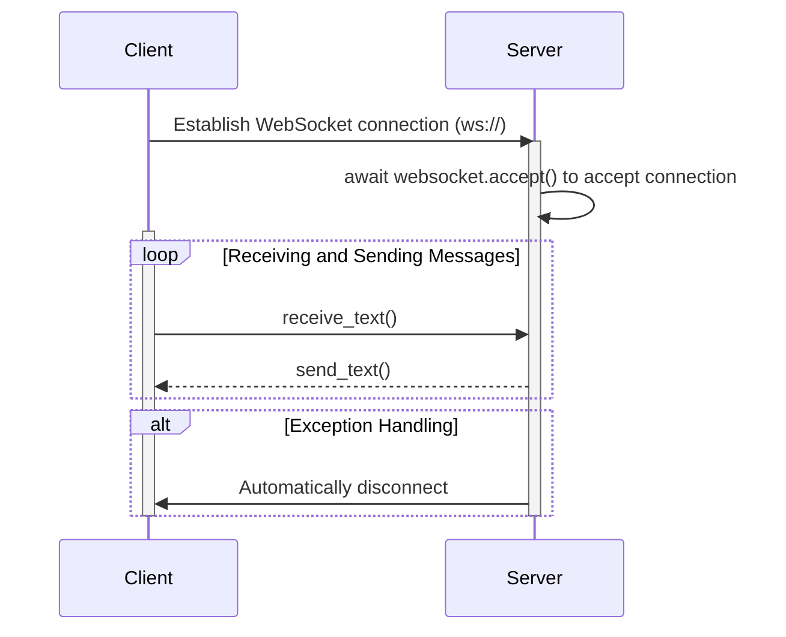

扫描[二维码](https://api2.cmdragon.cn/upload/cmder/20250304_012821924.jpg)
关注或者微信搜一搜：`编程智域 前端至全栈交流与成长`

[发现1000+提升效率与开发的AI工具和实用程序](https://tools.cmdragon.cn/zh/apps?category=ai_chat)：https://tools.cmdragon.cn/

---

### 一、文本消息接收与发送

```python
# 运行环境：Python 3.8+
# 安装依赖：pip install fastapi==0.68.0 uvicorn==0.15.0 websockets==10.3 pydantic==1.10.7

from fastapi import FastAPI, WebSocket

app = FastAPI()


@app.websocket("/ws/chat")
async def websocket_chat(websocket: WebSocket):
    await websocket.accept()
    try:
        while True:
            # 接收文本消息
            client_msg = await websocket.receive_text()
            # 处理消息（示例：添加时间戳）
            server_response = f"[{datetime.now()}] Server received: {client_msg}"
            # 发送文本响应
            await websocket.send_text(server_response)
    except WebSocketDisconnect:
        print("Client disconnected")
```

#### 消息处理流程：

1. 客户端通过`ws://`协议建立WebSocket连接
2. 服务端使用`await websocket.accept()`接受连接
3. 进入接收循环处理`receive_text()`和`send_text()`
4. 异常处理自动断开连接



**应用场景**：实时聊天室、协同编辑系统、实时日志监控

---

### 二、二进制数据传输处理

```python
@app.websocket("/ws/file-transfer")
async def websocket_file(websocket: WebSocket):
    await websocket.accept()
    try:
        while True:
            # 接收二进制数据
            binary_data = await websocket.receive_bytes()
            # 保存文件示例
            with open("received_file.bin", "wb") as f:
                f.write(binary_data)
            # 发送确认消息
            await websocket.send_bytes(b"FILE_RECEIVED")
    except WebSocketDisconnect:
        print("File transfer interrupted")
```

#### 二进制处理要点：

- 使用`receive_bytes()`和`send_bytes()`方法
- 适合传输图片、音频、视频等二进制格式
- 建议分块传输大文件（结合消息头协议）

---

### 三、JSON消息序列化与自动解析

```python
from pydantic import BaseModel


class MessageModel(BaseModel):
    user: str
    content: str
    timestamp: float


@app.websocket("/ws/json-demo")
async def websocket_json(websocket: WebSocket):
    await websocket.accept()
    try:
        while True:
            json_data = await websocket.receive_json()
            # 自动验证JSON结构
            message = MessageModel(**json_data)
            # 处理业务逻辑
            processed_data = message.dict()
            processed_data["status"] = "PROCESSED"
            # 返回处理结果
            await websocket.send_json(processed_data)
    except ValidationError as e:
        await websocket.send_json({"error": str(e)})
```

#### 自动验证流程：

1. 接收原始JSON数据
2. 通过Pydantic模型进行数据清洗
3. 自动类型转换和字段验证
4. 结构化错误响应返回

---

### 四、消息接收循环与超时控制

```python
from websockets.exceptions import ConnectionClosed


@app.websocket("/ws/with-timeout")
async def websocket_timeout(websocket: WebSocket):
    await websocket.accept()
    try:
        while True:
            try:
                # 设置10秒接收超时
                data = await asyncio.wait_for(websocket.receive_text(), timeout=10)
                await process_message(data)
            except asyncio.TimeoutError:
                # 发送心跳包保持连接
                await websocket.send_text("HEARTBEAT")
    except ConnectionClosed:
        print("Connection closed normally")
```

#### 超时控制策略：

- 使用`asyncio.wait_for`设置单次接收超时
- 定期发送心跳包维持连接
- 异常分类处理（正常关闭/异常断开）

---

### 课后Quiz

**Q1：如何处理同时接收文本和二进制消息的场景？**
A：通过`receive()`方法获取消息类型判断：

```python
message = await websocket.receive()
if message["type"] == "websocket.receive.text":
    handle_text(message["text"])
elif message["type"] == "websocket.receive.bytes":
    handle_bytes(message["bytes"])
```

**Q2：为什么推荐使用Pydantic进行JSON验证？**
A：① 自动类型转换 ② 字段约束检查 ③ 防御无效数据 ④ 生成API文档

---

### 常见报错解决方案

**422 Validation Error**

```json
{
  "detail": [
    {
      "loc": [
        "body",
        "timestamp"
      ],
      "msg": "field required",
      "type": "value_error.missing"
    }
  ]
}
```

解决方法：

1. 检查客户端发送的JSON字段是否完整
2. 验证时间戳是否为数字类型
3. 添加默认值字段：`timestamp: float = None`

**WebSocketTimeoutException**

- 成因：长时间未发送/接收消息
- 解决：调整`wait_for`超时参数，添加心跳机制

--- 

余下文章内容请点击跳转至 个人博客页面 或者 扫码关注或者微信搜一搜：`编程智域 前端至全栈交流与成长`
，阅读完整的文章：[如何在FastAPI中玩转WebSocket消息处理？](https://blog.cmdragon.cn/posts/fbf7d6843e430133547057254deb2dfb/)

## 往期文章归档：

- [如何在FastAPI中玩转WebSocket，让实时通信不再烦恼？ - cmdragon's Blog](https://blog.cmdragon.cn/posts/0faebb0f6c2b1bde4ba75869f4f67b76/)
- [WebSocket与HTTP协议究竟有何不同？FastAPI如何让长连接变得如此简单？ - cmdragon's Blog](https://blog.cmdragon.cn/posts/903448c85701a6a747fc9a4417e2bdc8/)
- [FastAPI如何玩转安全防护，让黑客望而却步？](https://blog.cmdragon.cn/posts/c1314c623211c9269f36053179a53d5c/)
- [如何用三层防护体系打造坚不可摧的 API 安全堡垒？ - cmdragon's Blog](https://blog.cmdragon.cn/posts/0bbb4a455ef36bf6f81ac97189586fda/#%E4%B8%80jwt-%E8%AE%A4%E8%AF%81%E8%81%94%E8%B0%83%E6%96%B9%E6%A1%88)
- [FastAPI安全加固：密钥轮换、限流策略与安全头部如何实现三重防护？ - cmdragon's Blog](https://blog.cmdragon.cn/posts/f96ba438de34dc197fd2598f91ae133d/)
- [如何在FastAPI中巧妙玩转数据脱敏，让敏感信息安全无忧？ - cmdragon's Blog](https://blog.cmdragon.cn/posts/045021f8831a03bcdf71e44cb793baf4/)
- [RBAC权限模型如何让API访问控制既安全又灵活？ - cmdragon's Blog](https://blog.cmdragon.cn/posts/9f01e838545ae8d34016c759ef461423/)
- [FastAPI中的敏感数据如何在不泄露的情况下翩翩起舞？](https://blog.cmdragon.cn/posts/88e8615e4c961e7a4f0ef31c0e41cb0b/)
- [FastAPI安全认证的终极秘籍：OAuth2与JWT如何完美融合？ - cmdragon's Blog](https://blog.cmdragon.cn/posts/17d5c40ff6c84ad652f962fed0ce46ab/)
- [如何在FastAPI中打造坚不可摧的Web安全防线？ - cmdragon's Blog](https://blog.cmdragon.cn/posts/9d6200ae7ce0a1a1a523591e3d65a82e/)
- [如何用 FastAPI 和 RBAC 打造坚不可摧的安全堡垒？ - cmdragon's Blog](https://blog.cmdragon.cn/posts/d878b5dbef959058b8098551c70594f8/)
- [FastAPI权限配置：你的系统真的安全吗？ - cmdragon's Blog](https://blog.cmdragon.cn/posts/96b6ede65030daa4613ab92da1d739a6/#%E5%BE%80%E6%9C%9F%E6%96%87%E7%AB%A0%E5%BD%92%E6%A1%A3)
- [FastAPI权限缓存：你的性能瓶颈是否藏在这只“看不见的手”里？ | cmdragon's Blog](https://blog.cmdragon.cn/posts/0c8c5a3fdaf69250ac3db7429b102625/)
- [FastAPI日志审计：你的权限系统是否真的安全无虞？ | cmdragon's Blog](https://blog.cmdragon.cn/posts/84bf7b11b342415bddb50e0521c64dfe/)
- [如何在FastAPI中打造坚不可摧的安全防线？ | cmdragon's Blog](https://blog.cmdragon.cn/posts/e2ec1e31dd5d97e0f32d2125385fd955/)
- [如何在FastAPI中实现权限隔离并让用户乖乖听话？ | cmdragon's Blog](https://blog.cmdragon.cn/posts/74777546a240b16b32196e5eb29ec8f7/)
- [如何在FastAPI中玩转权限控制与测试，让代码安全又优雅？ | cmdragon's Blog](https://blog.cmdragon.cn/posts/9dd24a9753ba15f98f24c1e5134fe40e/)
- [如何在FastAPI中打造一个既安全又灵活的权限管理系统？ | cmdragon's Blog](https://blog.cmdragon.cn/posts/277aa1628a2fa9855cdfe5f7c302bd92/)
- [FastAPI访问令牌的权限声明与作用域管理：你的API安全真的无懈可击吗？ | cmdragon's Blog](https://blog.cmdragon.cn/posts/82bae833ad460aec0965cc77b7d6f652/)
- [如何在FastAPI中构建一个既安全又灵活的多层级权限系统？ | cmdragon's Blog](https://blog.cmdragon.cn/posts/13fc113ef1dff03927d46235ad333a7f/)
- [FastAPI如何用角色权限让Web应用安全又灵活？ | cmdragon's Blog](https://blog.cmdragon.cn/posts/cc7aa0af577ae2bc0694e76886373e12/)
- [FastAPI权限验证依赖项究竟藏着什么秘密？ | cmdragon's Blog](https://blog.cmdragon.cn/posts/3e287e8b907561728ded1be34a19b22c/)
- [如何用FastAPI和Tortoise-ORM打造一个既高效又灵活的角色管理系统？ | cmdragon's Blog](https://blog.cmdragon.cn/posts/2b0a2003074eba56a6f6c57aa9690900/)
- [JWT令牌如何在FastAPI中实现安全又高效的生成与验证？ | cmdragon's Blog](https://blog.cmdragon.cn/posts/031a4b22bb8d624cf23ef593f72d1ec6/)
- [你的密码存储方式是否在向黑客招手？ | cmdragon's Blog](https://blog.cmdragon.cn/posts/5f8821250c5a4e9cc08bd08faef76c77/)
- [如何在FastAPI中轻松实现OAuth2认证并保护你的API？ | cmdragon's Blog](https://blog.cmdragon.cn/posts/c290754b532ebf91c5415aa0b30715d0/)
- [FastAPI安全机制：从OAuth2到JWT的魔法通关秘籍 | cmdragon's Blog](https://blog.cmdragon.cn/posts/30ed200ec25b55e1ba159366401ed6ee/)
- [FastAPI认证系统：从零到令牌大师的奇幻之旅 | cmdragon's Blog](https://blog.cmdragon.cn/posts/69f7189d3ff058334889eb2e02f2ea2c/)
- [FastAPI安全异常处理：从401到422的奇妙冒险 | cmdragon's Blog](https://blog.cmdragon.cn/posts/92a7a3de40eb9ce71620716632f68676/)
- [FastAPI权限迷宫：RBAC与多层级依赖的魔法通关秘籍 | cmdragon's Blog](https://blog.cmdragon.cn/posts/ee5486714707d4835d4a774696dca30a/)
- [JWT令牌：从身份证到代码防伪的奇妙之旅 | cmdragon's Blog](https://blog.cmdragon.cn/posts/a39277914464b007ac61874292578de0/)
- [FastAPI安全认证：从密码到令牌的魔法之旅 | cmdragon's Blog](https://blog.cmdragon.cn/posts/7d79b5a5c4a3adad15117a45d7976554/)
- [密码哈希：Bcrypt的魔法与盐值的秘密 | cmdragon's Blog](https://blog.cmdragon.cn/posts/f3671b2501c23bd156bfd75c5b56ce4c/)
- [用户认证的魔法配方：从模型设计到密码安全的奇幻之旅 | cmdragon's Blog](https://blog.cmdragon.cn/posts/ac5bec89ea446ce4f6b01891f640fbfe/)
- [FastAPI安全门神：OAuth2PasswordBearer的奇妙冒险 | cmdragon's Blog](https://blog.cmdragon.cn/posts/53653fa69249a339b6727107deaf2608/)
- [OAuth2密码模式：信任的甜蜜陷阱与安全指南 | cmdragon's Blog](https://blog.cmdragon.cn/posts/c27c69799af51ce0bde2ccea9d456fe4/)

## 免费好用的热门在线工具

- [CMDragon 在线工具 - 高级AI工具箱与开发者套件 | 免费好用的在线工具](https://tools.cmdragon.cn/zh)
- [应用商店 - 发现1000+提升效率与开发的AI工具和实用程序 | 免费好用的在线工具](https://tools.cmdragon.cn/zh/apps?category=trending)
- [CMDragon 更新日志 - 最新更新、功能与改进 | 免费好用的在线工具](https://tools.cmdragon.cn/zh/changelog)
- [支持我们 - 成为赞助者 | 免费好用的在线工具](https://tools.cmdragon.cn/zh/sponsor)
- [AI文本生成图像 - 应用商店 | 免费好用的在线工具](https://tools.cmdragon.cn/zh/apps/text-to-image-ai)
- [临时邮箱 - 应用商店 | 免费好用的在线工具](https://tools.cmdragon.cn/zh/apps/temp-email)
- [二维码解析器 - 应用商店 | 免费好用的在线工具](https://tools.cmdragon.cn/zh/apps/qrcode-parser)
- [文本转思维导图 - 应用商店 | 免费好用的在线工具](https://tools.cmdragon.cn/zh/apps/text-to-mindmap)
- [正则表达式可视化工具 - 应用商店 | 免费好用的在线工具](https://tools.cmdragon.cn/zh/apps/regex-visualizer)
- [文件隐写工具 - 应用商店 | 免费好用的在线工具](https://tools.cmdragon.cn/zh/apps/steganography-tool)
- [IPTV 频道探索器 - 应用商店 | 免费好用的在线工具](https://tools.cmdragon.cn/zh/apps/iptv-explorer)
- [快传 - 应用商店 | 免费好用的在线工具](https://tools.cmdragon.cn/zh/apps/snapdrop)
- [随机抽奖工具 - 应用商店 | 免费好用的在线工具](https://tools.cmdragon.cn/zh/apps/lucky-draw)
- [动漫场景查找器 - 应用商店 | 免费好用的在线工具](https://tools.cmdragon.cn/zh/apps/anime-scene-finder)
- [时间工具箱 - 应用商店 | 免费好用的在线工具](https://tools.cmdragon.cn/zh/apps/time-toolkit)
- [网速测试 - 应用商店 | 免费好用的在线工具](https://tools.cmdragon.cn/zh/apps/speed-test)
- [AI 智能抠图工具 - 应用商店 | 免费好用的在线工具](https://tools.cmdragon.cn/zh/apps/background-remover)
- [背景替换工具 - 应用商店 | 免费好用的在线工具](https://tools.cmdragon.cn/zh/apps/background-replacer)
- [艺术二维码生成器 - 应用商店 | 免费好用的在线工具](https://tools.cmdragon.cn/zh/apps/artistic-qrcode)
- [Open Graph 元标签生成器 - 应用商店 | 免费好用的在线工具](https://tools.cmdragon.cn/zh/apps/open-graph-generator)
- [图像对比工具 - 应用商店 | 免费好用的在线工具](https://tools.cmdragon.cn/zh/apps/image-comparison)
- [图片压缩专业版 - 应用商店 | 免费好用的在线工具](https://tools.cmdragon.cn/zh/apps/image-compressor)
- [密码生成器 - 应用商店 | 免费好用的在线工具](https://tools.cmdragon.cn/zh/apps/password-generator)
- [SVG优化器 - 应用商店 | 免费好用的在线工具](https://tools.cmdragon.cn/zh/apps/svg-optimizer)
- [调色板生成器 - 应用商店 | 免费好用的在线工具](https://tools.cmdragon.cn/zh/apps/color-palette)
- [在线节拍器 - 应用商店 | 免费好用的在线工具](https://tools.cmdragon.cn/zh/apps/online-metronome)
- [IP归属地查询 - 应用商店 | 免费好用的在线工具](https://tools.cmdragon.cn/zh/apps/ip-geolocation)
- [CSS网格布局生成器 - 应用商店 | 免费好用的在线工具](https://tools.cmdragon.cn/zh/apps/css-grid-layout)
- [邮箱验证工具 - 应用商店 | 免费好用的在线工具](https://tools.cmdragon.cn/zh/apps/email-validator)
- [书法练习字帖 - 应用商店 | 免费好用的在线工具](https://tools.cmdragon.cn/zh/apps/calligraphy-practice)
- [金融计算器套件 - 应用商店 | 免费好用的在线工具](https://tools.cmdragon.cn/zh/apps/finance-calculator-suite)
- [中国亲戚关系计算器 - 应用商店 | 免费好用的在线工具](https://tools.cmdragon.cn/zh/apps/chinese-kinship-calculator)
- [Protocol Buffer 工具箱 - 应用商店 | 免费好用的在线工具](https://tools.cmdragon.cn/zh/apps/protobuf-toolkit)
- [IP归属地查询 - 应用商店 | 免费好用的在线工具](https://tools.cmdragon.cn/zh/apps/ip-geolocation)
- [图片无损放大 - 应用商店 | 免费好用的在线工具](https://tools.cmdragon.cn/zh/apps/image-upscaler)
- [文本比较工具 - 应用商店 | 免费好用的在线工具](https://tools.cmdragon.cn/zh/apps/text-compare)
- [IP批量查询工具 - 应用商店 | 免费好用的在线工具](https://tools.cmdragon.cn/zh/apps/ip-batch-lookup)
- [域名查询工具 - 应用商店 | 免费好用的在线工具](https://tools.cmdragon.cn/zh/apps/domain-finder)
- [DNS工具箱 - 应用商店 | 免费好用的在线工具](https://tools.cmdragon.cn/zh/apps/dns-toolkit)
- [网站图标生成器 - 应用商店 | 免费好用的在线工具](https://tools.cmdragon.cn/zh/apps/favicon-generator)
- [XML Sitemap](https://tools.cmdragon.cn/sitemap_index.xml)