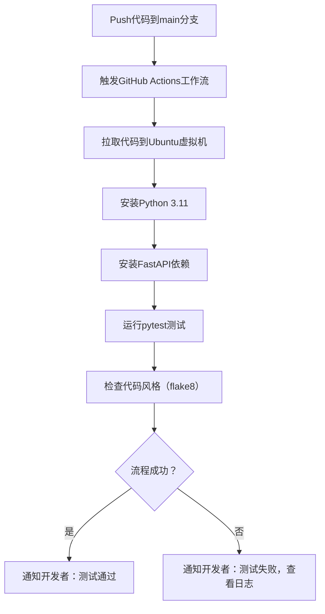

扫描[二维码](https://api2.cmdragon.cn/upload/cmder/20250304_012821924.jpg)
关注或者微信搜一搜：`编程智域 前端至全栈交流与成长`

[发现1000+提升效率与开发的AI工具和实用程序](https://tools.cmdragon.cn/zh/apps?category=ai_chat)：https://tools.cmdragon.cn/

### 1. 持续集成与GitHub Actions基础

#### 1.1 什么是持续集成（CI）？

持续集成（Continuous Integration，简称CI）是一种**自动化开发实践**：每当开发者向代码仓库推送（Push）或提交合并请求（Pull
Request）时，系统会自动运行一系列预先定义的流程（如安装依赖、运行测试、检查代码风格），快速验证代码变更的正确性。

对于FastAPI项目，CI的核心价值是：

- 避免“集成地狱”：尽早发现代码中的bug（比如API端点逻辑错误、依赖冲突）；
- 保证代码质量：强制遵循团队代码规范（如PEP 8）；
- 加速协作：合并请求时自动验证，减少人工review的负担。

#### 1.2 GitHub Actions 核心概念快速理解

GitHub Actions是GitHub内置的自动化工具，用于实现CI/CD流程。你可以把它想象成一个“自动化机器人”，根据你写的“指令清单”（工作流文件）执行任务。以下是几个关键概念：

- **工作流（Workflow）**：一个完整的自动化流程（如“运行FastAPI测试”），用YAML文件定义，存放在项目根目录的`.github/workflows/`下；
- **事件（Event）**：触发工作流的“开关”（如Push代码、提交PR）；
- **作业（Job）**：工作流中的独立任务（如“安装依赖”“运行测试”），默认并行执行；
- **步骤（Step）**：作业中的具体操作（如“拉取代码”“运行pytest”），顺序执行；
- **动作（Action）**：可复用的“代码块”（如`actions/checkout@v4`用于拉取代码），避免重复造轮子。

### 2. FastAPI项目初始化与测试准备

在搭建CI流水线前，我们需要先准备一个**标准化的FastAPI项目结构**，并编写可自动化的测试用例。

#### 2.1 标准项目结构设计

一个清晰的项目结构能让CI流程更易维护，推荐结构如下：

```
fastapi-ci-demo/          # 项目根目录
├── app/                  # 应用核心代码目录
│   ├── __init__.py       # 标识app为Python模块
│   └── main.py           # FastAPI主程序
├── tests/                # 测试用例目录
│   ├── __init__.py       # 标识tests为Python模块
│   └── test_api.py       # API测试用例
├── requirements.txt      # 依赖清单（或用pyproject.toml+Poetry）
└── .flake8               # flake8代码风格配置文件
```

#### 2.2 编写FastAPI核心代码

我们以“用户管理API”为例，编写`app/main.py`：

```python
from fastapi import FastAPI
from pydantic import BaseModel, EmailStr  # 导入Pydantic类型

# 1. 初始化FastAPI应用
app = FastAPI(title="用户管理API", version="1.0")


# 2. 定义数据模型（Pydantic v2）
class UserCreate(BaseModel):
    name: str  # 用户名：必填，字符串
    email: EmailStr  # 邮箱：必填，符合邮箱格式（如xxx@example.com）
    age: int | None = None  # 年龄：可选，整数


# 3. 模拟数据库（实际项目用SQLAlchemy/Redis）
users_db = []


# 4. 定义API端点
@app.post("/users/", response_model=UserCreate)
def create_user(user: UserCreate):
    """创建用户：接收UserCreate模型数据，存入模拟数据库"""
    users_db.append(user.model_dump())  # 将Pydantic模型转为字典存库
    return user  # 返回创建的用户数据（自动序列化为JSON）
```

**关键说明**：

- 使用Pydantic v2的`BaseModel`定义数据模型，自动完成请求数据的验证；
- `response_model`指定端点的返回格式，确保返回数据符合`UserCreate`规则；
- 模拟数据库`users_db`用于快速测试，实际项目需替换为真实数据库（如PostgreSQL）。

#### 2.3 用pytest编写测试用例

测试是CI的核心，我们用`pytest`+`FastAPI TestClient`编写测试用例（`tests/test_api.py`）：

```python
from fastapi.testclient import TestClient  # 导入TestClient用于模拟HTTP请求
from app.main import app  # 导入FastAPI应用实例

# 创建TestClient实例（相当于“模拟浏览器”）
client = TestClient(app)


def test_create_user_success():
    """测试：成功创建用户（预期200 OK）"""
    test_data = {
        "name": "张三",
        "email": "zhangsan@example.com",
        "age": 28
    }
    # 发送POST请求到/users/端点，用json参数传递JSON数据
    response = client.post("/users/", json=test_data)

    # 断言：状态码是200，返回数据与测试数据一致
    assert response.status_code == 200
    assert response.json() == test_data


def test_create_user_missing_email():
    """测试：缺少必填字段email（预期422验证错误）"""
    test_data = {
        "name": "李四",
        "age": 30
    }
    response = client.post("/users/", json=test_data)

    # 断言：状态码是422，错误信息包含“email”字段
    assert response.status_code == 422
    assert "email" in response.json()["detail"][0]["loc"]


def test_create_user_invalid_email():
    """测试：邮箱格式无效（预期422验证错误）"""
    test_data = {
        "name": "王五",
        "email": "wangwu.example.com",  # 缺少@符号
        "age": 25
    }
    response = client.post("/users/", json=test_data)

    assert response.status_code == 422
    assert "email" in response.json()["detail"][0]["loc"]
```

**关键说明**：

- `TestClient`能模拟真实HTTP请求，无需启动Uvicorn服务器；
- 测试用例覆盖了**正常场景**（成功创建）和**异常场景**（缺少字段、格式错误），确保API的鲁棒性；
- 使用`assert`语句验证结果，pytest会自动识别并运行这些用例。

#### 2.3 依赖清单与版本管理

在`requirements.txt`中列出项目依赖（**需使用最新稳定版**，可通过PyPI查询）：

```txt
# FastAPI核心依赖
fastapi==0.104.1         
uvicorn==0.24.0.post1     # ASGI服务器
# 测试依赖
pytest==7.4.3             # 测试框架
requests==2.31.0          # HTTP请求库（TestClient依赖）
# 代码风格检查
flake8==6.1.0             # 代码风格检查工具
# Pydantic
pydantic==2.5.2           # Pydantic v2最新版
```

### 3. GitHub Actions自动化测试流水线搭建

现在，我们编写**工作流文件**（`.github/workflows/ci.yml`），告诉GitHub Actions要做什么。

#### 3.1 工作流文件基础结构

一个完整的CI工作流文件包含以下部分：

```yaml
name: FastAPI CI  # 工作流名称（显示在GitHub Actions页面）
on: # 触发条件：Push或PR到main分支时运行
  push:
    branches: [ "main" ]
  pull_request:
    branches: [ "main" ]

jobs: # 作业列表：一个工作流可包含多个作业
  build: # 作业名称：“构建与测试”
    runs-on: ubuntu-latest  # 运行环境：Ubuntu最新版虚拟机
    steps: # 作业步骤：顺序执行
      # 步骤1：拉取代码到虚拟机
      - name: Checkout code
        uses: actions/checkout@v4  # 官方动作：拉取代码

      # 步骤2：设置Python环境
      - name: Set up Python 3.11
        uses: actions/setup-python@v5  # 官方动作：安装Python
        with:
          python-version: "3.11"  # 指定Python版本（FastAPI支持3.8+）
          cache: "pip"  # 缓存pip依赖，加速后续运行

      # 步骤3：安装项目依赖
      - name: Install dependencies
        run: |  # 运行命令行指令
          python -m pip install --upgrade pip  # 升级pip
          pip install -r requirements.txt     # 安装依赖

      # 步骤4：运行pytest测试
      - name: Run tests
        run: pytest tests/ -v  # 运行tests目录下的所有测试，-v显示详细输出

      # 步骤5：检查代码风格（flake8）
      - name: Check code style
        run: flake8 app/ tests/  # 检查app和tests目录下的代码
```

#### 3.2 配置说明与扩展

- **触发条件**：`on.push.branches: [ "main" ]`表示只有Push到`main`分支才触发；若想让`develop`分支也触发，可添加`"develop"`；
- **Python版本**：`setup-python`动作支持多个Python版本（如3.10、3.11），可添加`matrix`参数实现多版本测试（见扩展部分）；
- **缓存依赖**：`cache: "pip"`会缓存`~/.cache/pip`目录，避免每次重新下载依赖，大幅加快运行速度；
- **代码风格检查**：`flake8`会按照`.flake8`配置文件的规则检查代码，示例`.flake8`配置：
  ```ini
  [flake8]
  max-line-length = 120  # 允许最长行120字符（默认79）
  exclude = .git,__pycache__,venv/  # 排除不需要检查的目录
  ```

#### 3.3 扩展：多Python版本测试

若想验证FastAPI在多个Python版本下的兼容性，可添加`matrix`参数：

```yaml
jobs:
  build:
    runs-on: ubuntu-latest
    strategy: # 策略：多版本并行测试
      matrix:
        python-version: [ "3.8", "3.9", "3.10", "3.11" ]  # 测试4个Python版本
    steps:
      - name: Checkout code
        uses: actions/checkout@v4

      - name: Set up Python ${{ matrix.python-version }}  # 动态使用Python版本
        uses: actions/setup-python@v5
        with:
          python-version: ${{ matrix.python-version }}
          cache: "pip"

      # 后续步骤与之前一致...
```

### 4. 流水线运行与结果验证

当你将代码Push到GitHub的`main`分支（或提交PR到`main`），GitHub Actions会**自动触发**工作流。你可以在GitHub仓库的**Actions**
标签页中查看运行结果：

#### 4.1 查看运行日志

点击具体的工作流运行记录（如“Push to main by Alice”），可以看到每个步骤的详细日志：

- 若所有步骤显示绿色的“√”，说明流水线运行成功；
- 若某步骤显示红色的“×”，说明该步骤失败（如pytest测试不通过），点击该步骤可查看错误详情。

#### 4.2 失败场景分析与修复

以“pytest测试失败”为例，假设`test_create_user_missing_email`用例失败，日志显示：

```
AssertionError: assert 200 == 422
```

这说明缺少`email`字段时，API返回了200而不是预期的422。原因可能是`UserCreate`模型中的`email`字段被误设为可选：

```python
# 错误写法（email可选）
class UserCreate(BaseModel):
    email: EmailStr | None = None  # 错误：| None = None让email可选
```

**修复方法**：去掉`| None = None`，让`email`成为必填字段：

```python
# 正确写法（email必填）
class UserCreate(BaseModel):
    email: EmailStr  # 正确：无默认值，必填
```

修改后重新Push代码，CI流水线会再次运行，测试用例将恢复正常。

### 5. 课后Quiz：巩固你的CI知识

#### 问题1

如何修改工作流配置，让流水线在**Push到develop分支**或**提交PR到main分支**时触发？
**答案**：

```yaml
on:
  push:
    branches: [ "main", "develop" ]  # Push到main或develop触发
  pull_request:
    branches: [ "main" ]  # PR到main触发
```

#### 问题2

FastAPI中用`TestClient`测试POST请求时，为什么推荐用`json`参数而不是`data`参数？
**答案**：
`json`参数会自动将Python字典转为JSON字符串，并设置请求头`Content-Type: application/json`（FastAPI默认接收JSON）；而`data`
参数会将数据作为表单提交（`Content-Type: application/x-www-form-urlencoded`），不符合API的预期格式。

#### 问题3

若pytest运行时提示“ModuleNotFoundError: No module named 'app'”，可能的原因是什么？
**答案**：
Python的模块搜索路径未包含项目根目录。解决方法：

1. 确保运行pytest时的当前目录是项目根目录（如`fastapi-ci-demo/`）；
2. 在`tests`目录下创建`__init__.py`，标识`tests`为Python模块；
3. 运行pytest时添加`--rootdir`参数：`pytest --rootdir . tests/`。

### 6. 常见报错与解决方案

在CI流水线运行中，你可能会遇到以下常见错误，提前掌握解决方案能节省大量时间。

#### 报错1：422 Validation Error（测试或API请求中）

- **原因**：请求数据不符合Pydantic模型的验证规则（如缺少必填字段、类型错误）；
- **解决步骤**：
    1. 查看响应的`detail`字段（如`response.json()["detail"]`），找到错误位置（`loc`字段）和原因（`msg`字段）；
    2. 修改请求数据，使其符合模型规则（如补充缺少的`email`字段）；
- **预防建议**：编写测试用例时覆盖所有异常场景（如缺少字段、格式错误）。

#### 报错2：pytest找不到测试用例（collected 0 items）

- **原因**：测试文件/函数的命名不符合pytest的默认规则（文件以`test_`开头/结尾，函数以`test_`开头）；
- **解决步骤**：
    1. 将测试文件重命名为`test_api.py`（而非`api.py`）；
    2. 将测试函数重命名为`test_create_user`（而非`create_user`）；
- **预防建议**：遵循pytest命名规范，避免手动指定测试文件路径。

#### 报错3：GitHub Actions中“Install dependencies”失败

- **原因**：
    1. `requirements.txt`中的版本号错误（如`fastapi==999.0`，不存在的版本）；
    2. pip源无法访问（如默认源被墙）；
- **解决步骤**：
    1. 验证依赖版本（通过PyPI查询最新版）；
    2. 更换pip源（如使用阿里云源）：
       ```yaml
       - name: Install dependencies
         run: |
           python -m pip install --upgrade pip
           pip install -r requirements.txt -i https://mirrors.aliyun.com/pypi/simple/
       ```

### 附：CI流水线流程图



通过以上步骤，你已经掌握了如何用GitHub Actions为FastAPI项目搭建**自动化测试流水线**
。CI的核心价值是“提前发现问题”，它能让你在代码合并前就消灭bug，大幅提升项目的稳定性和开发效率。

下一步，你可以尝试扩展流水线功能，比如：

- 自动部署FastAPI到云服务器（如AWS EC2、Vercel）；
- 生成测试覆盖率报告（用`pytest-cov`）；
- 发送Slack/钉钉通知（用`act1ons/slack@v3`）。

祝你在FastAPI的CI之路上越走越顺！

余下文章内容请点击跳转至 个人博客页面 或者 扫码关注或者微信搜一搜：`编程智域 前端至全栈交流与成长`
，阅读完整的文章：[如何用GitHub Actions为FastAPI项目打造自动化测试流水线？](https://blog.cmdragon.cn/posts/6157d87338ce894d18c013c3c4777abb/)


<details>
<summary>往期文章归档</summary>

- [如何用Git Hook和CI流水线为FastAPI项目保驾护航？ - cmdragon's Blog](https://blog.cmdragon.cn/posts/fc4ef84559e04693a620d0714cb30787/)
- [FastAPI如何用契约测试确保API的「菜单」与「菜品」一致？](https://blog.cmdragon.cn/posts/02b0c96842d1481c72dab63a149ce0dd/)
- [为什么TDD能让你的FastAPI开发飞起来？ - cmdragon's Blog](https://blog.cmdragon.cn/posts/c9c1e3bb0fdc15303b9b3b1f20124b0b/)
- [如何用FastAPI玩转多模块测试与异步任务，让代码不再“闹脾气”？ - cmdragon's Blog](https://blog.cmdragon.cn/posts/ddbfa0447a5d0d6f9af12e7a6b206f70/)
- [如何在FastAPI中玩转“时光倒流”的数据库事务回滚测试？](https://blog.cmdragon.cn/posts/bf9883a75ffa46b523a03b16ec56ce48/)
- [如何在FastAPI中优雅地模拟多模块集成测试？ - cmdragon's Blog](https://blog.cmdragon.cn/posts/be553dbd5d51835d2c69553f4a773e2d/)
- [多环境配置切换机制能否让开发与生产无缝衔接？ - cmdragon's Blog](https://blog.cmdragon.cn/posts/533874f5700b8506d4c68781597db659/)
- [如何在 FastAPI 中巧妙覆盖依赖注入并拦截第三方服务调用？ - cmdragon's Blog](https://blog.cmdragon.cn/posts/2d992ef9e8962dc0a4a0b5348d486114/)
- [为什么你的单元测试需要Mock数据库才能飞起来？ - cmdragon's Blog](https://blog.cmdragon.cn/posts/6e69c0eedd8b1e5a74a148d36c85d7ce/)
- [如何在FastAPI中巧妙隔离依赖项，让单元测试不再头疼？ - cmdragon's Blog](https://blog.cmdragon.cn/posts/77ae327dc941b0e74ecc6a8794c084d0/)
- [如何在FastAPI中巧妙隔离依赖项，让单元测试不再头疼？ - cmdragon's Blog](https://blog.cmdragon.cn/posts/77ae327dc941b0e74ecc6a8794c084d0/)
- [测试覆盖率不够高？这些技巧让你的FastAPI测试无懈可击！ - cmdragon's Blog](https://blog.cmdragon.cn/posts/0577d0e24f48b3153b510e74d3d1a822/)
- [为什么你的FastAPI测试覆盖率总是低得让人想哭？ - cmdragon's Blog](https://blog.cmdragon.cn/posts/985c18ca802f1b6da828b92e082b4d4e/)
- [如何让FastAPI测试不再成为你的噩梦？ - cmdragon's Blog](https://blog.cmdragon.cn/posts/29858a7a10d20b4e4649cb75fb422eab/)
- [FastAPI测试环境配置的秘诀，你真的掌握了吗？ - cmdragon's Blog](https://blog.cmdragon.cn/posts/6f9e71e8313db6de8c1431877a70b67e/)
- [全链路追踪如何让FastAPI微服务架构的每个请求都无所遁形？ - cmdragon's Blog](https://blog.cmdragon.cn/posts/30e1d2fbf1ad8123eaf0e1e0dbe7c675/)
- [如何在API高并发中玩转资源隔离与限流策略？ - cmdragon's Blog](https://blog.cmdragon.cn/posts/4ad4ec1dbd80bcf5670fb397ca7cc68c/)
- [任务分片执行模式如何让你的FastAPI性能飙升？ - cmdragon's Blog](https://blog.cmdragon.cn/posts/c6a598639f6a831e9e82e171b8d71857/)
- [冷热任务分离：是提升Web性能的终极秘籍还是技术噱头？ - cmdragon's Blog](https://blog.cmdragon.cn/posts/9c3dc7767a9282f7ef02daad42539f2c/)
- [如何让FastAPI在百万级任务处理中依然游刃有余？ - cmdragon's Blog](https://blog.cmdragon.cn/posts/469aae0e0f88c642ed8bc82e102b960b/)
- [如何让FastAPI与消息队列的联姻既甜蜜又可靠？ - cmdragon's Blog](https://blog.cmdragon.cn/posts/1bebb53f4d9d6fbd0ecbba97562c07b0/)
- [如何在FastAPI中巧妙实现延迟队列，让任务乖乖等待？ - cmdragon's Blog](https://blog.cmdragon.cn/posts/174450702d9e609a072a7d1aaa84750b/)
- [FastAPI的死信队列处理机制：为何你的消息系统需要它？ - cmdragon's Blog](https://blog.cmdragon.cn/posts/047b08957a0d617a87b72da6c3131e5d/)
- [如何让FastAPI任务系统在失败时自动告警并自我修复？ - cmdragon's Blog](https://blog.cmdragon.cn/posts/2f104637ecc916e906c002fa79ab8c80/)
- [如何用Prometheus和FastAPI打造任务监控的“火眼金睛”？ - cmdragon's Blog](https://blog.cmdragon.cn/posts/e7464e5b4d558ede1a7413fa0a2f96f3/)
- [如何用APScheduler和FastAPI打造永不宕机的分布式定时任务系统？ - cmdragon's Blog](https://blog.cmdragon.cn/posts/51a0ff47f509fb6238150a96f551b317/)
- [如何在 FastAPI 中玩转 APScheduler，让任务定时自动执行？ - cmdragon's Blog](https://blog.cmdragon.cn/posts/85564dd901c6d9b1a79d320970843caa/)
- [定时任务系统如何让你的Web应用自动完成那些烦人的重复工作？ - cmdragon's Blog](https://blog.cmdragon.cn/posts/2b27950aab76203a1af4e9e3deda8699/)
- [Celery任务监控的魔法背后藏着什么秘密？ - cmdragon's Blog](https://blog.cmdragon.cn/posts/f43335725bb3372ebc774db1b9f28d2d/)
- [如何让Celery任务像VIP客户一样享受优先待遇？ - cmdragon's Blog](https://blog.cmdragon.cn/posts/c24491a7ac7f7c5e9cf77596ebb27c51/)
- [如何让你的FastAPI Celery Worker在压力下优雅起舞？ - cmdragon's Blog](https://blog.cmdragon.cn/posts/c3129f4b424d2ed2330484b82ec31875/)
- [FastAPI与Celery的完美邂逅，如何让异步任务飞起来？ - cmdragon's Blog](https://blog.cmdragon.cn/posts/b79c2c1805fe9b1ea28326b5b8f3b709/)
- [FastAPI消息持久化与ACK机制：如何确保你的任务永不迷路？ - cmdragon's Blog](https://blog.cmdragon.cn/posts/13a59846aaab71b44ab6f3dadc5b5ec7/)
- [FastAPI的BackgroundTasks如何玩转生产者-消费者模式？ - cmdragon's Blog](https://blog.cmdragon.cn/posts/1549a6bd7e47e7006e7ba8f52bcfe8eb/)
- [BackgroundTasks 还是 RabbitMQ？你的异步任务到底该选谁？ - cmdragon's Blog](https://blog.cmdragon.cn/posts/d26fdc150ff9dd70c7482381ff4c77c4/)
- [BackgroundTasks与Celery：谁才是异步任务的终极赢家？ - cmdragon's Blog](https://blog.cmdragon.cn/posts/792cac4ce6eb96b5001da15b0d52ef83/)
- [如何在 FastAPI 中优雅处理后台任务异常并实现智能重试？ - cmdragon's Blog](https://blog.cmdragon.cn/posts/d5c1d2efbaf6fe4c9e13acc6be6d929a/)

</details>


<details>
<summary>免费好用的热门在线工具</summary>

- [歌词生成工具 - 应用商店 | By cmdragon](https://tools.cmdragon.cn/zh/apps/lyrics-generator)
- [网盘资源聚合搜索 - 应用商店 | By cmdragon](https://tools.cmdragon.cn/zh/apps/cloud-drive-search)
- [ASCII字符画生成器 - 应用商店 | By cmdragon](https://tools.cmdragon.cn/zh/apps/ascii-art-generator)
- [JSON Web Tokens 工具 - 应用商店 | By cmdragon](https://tools.cmdragon.cn/zh/apps/jwt-tool)
- [Bcrypt 密码工具 - 应用商店 | By cmdragon](https://tools.cmdragon.cn/zh/apps/bcrypt-tool)
- [GIF 合成器 - 应用商店 | By cmdragon](https://tools.cmdragon.cn/zh/apps/gif-composer)
- [GIF 分解器 - 应用商店 | By cmdragon](https://tools.cmdragon.cn/zh/apps/gif-decomposer)
- [文本隐写术 - 应用商店 | By cmdragon](https://tools.cmdragon.cn/zh/apps/text-steganography)
- [CMDragon 在线工具 - 高级AI工具箱与开发者套件 | 免费好用的在线工具](https://tools.cmdragon.cn/zh)
- [应用商店 - 发现1000+提升效率与开发的AI工具和实用程序 | 免费好用的在线工具](https://tools.cmdragon.cn/zh/apps?category=trending)
- [CMDragon 更新日志 - 最新更新、功能与改进 | 免费好用的在线工具](https://tools.cmdragon.cn/zh/changelog)
- [支持我们 - 成为赞助者 | 免费好用的在线工具](https://tools.cmdragon.cn/zh/sponsor)
- [AI文本生成图像 - 应用商店 | 免费好用的在线工具](https://tools.cmdragon.cn/zh/apps/text-to-image-ai)
- [临时邮箱 - 应用商店 | 免费好用的在线工具](https://tools.cmdragon.cn/zh/apps/temp-email)
- [二维码解析器 - 应用商店 | 免费好用的在线工具](https://tools.cmdragon.cn/zh/apps/qrcode-parser)
- [文本转思维导图 - 应用商店 | 免费好用的在线工具](https://tools.cmdragon.cn/zh/apps/text-to-mindmap)
- [正则表达式可视化工具 - 应用商店 | 免费好用的在线工具](https://tools.cmdragon.cn/zh/apps/regex-visualizer)
- [文件隐写工具 - 应用商店 | 免费好用的在线工具](https://tools.cmdragon.cn/zh/apps/steganography-tool)
- [IPTV 频道探索器 - 应用商店 | 免费好用的在线工具](https://tools.cmdragon.cn/zh/apps/iptv-explorer)
- [快传 - 应用商店 | 免费好用的在线工具](https://tools.cmdragon.cn/zh/apps/snapdrop)
- [随机抽奖工具 - 应用商店 | 免费好用的在线工具](https://tools.cmdragon.cn/zh/apps/lucky-draw)
- [动漫场景查找器 - 应用商店 | 免费好用的在线工具](https://tools.cmdragon.cn/zh/apps/anime-scene-finder)
- [时间工具箱 - 应用商店 | 免费好用的在线工具](https://tools.cmdragon.cn/zh/apps/time-toolkit)
- [网速测试 - 应用商店 | 免费好用的在线工具](https://tools.cmdragon.cn/zh/apps/speed-test)
- [AI 智能抠图工具 - 应用商店 | 免费好用的在线工具](https://tools.cmdragon.cn/zh/apps/background-remover)
- [背景替换工具 - 应用商店 | 免费好用的在线工具](https://tools.cmdragon.cn/zh/apps/background-replacer)
- [艺术二维码生成器 - 应用商店 | 免费好用的在线工具](https://tools.cmdragon.cn/zh/apps/artistic-qrcode)
- [Open Graph 元标签生成器 - 应用商店 | 免费好用的在线工具](https://tools.cmdragon.cn/zh/apps/open-graph-generator)
- [图像对比工具 - 应用商店 | 免费好用的在线工具](https://tools.cmdragon.cn/zh/apps/image-comparison)
- [图片压缩专业版 - 应用商店 | 免费好用的在线工具](https://tools.cmdragon.cn/zh/apps/image-compressor)
- [密码生成器 - 应用商店 | 免费好用的在线工具](https://tools.cmdragon.cn/zh/apps/password-generator)
- [SVG优化器 - 应用商店 | 免费好用的在线工具](https://tools.cmdragon.cn/zh/apps/svg-optimizer)
- [调色板生成器 - 应用商店 | 免费好用的在线工具](https://tools.cmdragon.cn/zh/apps/color-palette)
- [在线节拍器 - 应用商店 | 免费好用的在线工具](https://tools.cmdragon.cn/zh/apps/online-metronome)
- [IP归属地查询 - 应用商店 | 免费好用的在线工具](https://tools.cmdragon.cn/zh/apps/ip-geolocation)
- [CSS网格布局生成器 - 应用商店 | 免费好用的在线工具](https://tools.cmdragon.cn/zh/apps/css-grid-layout)
- [邮箱验证工具 - 应用商店 | 免费好用的在线工具](https://tools.cmdragon.cn/zh/apps/email-validator)
- [书法练习字帖 - 应用商店 | 免费好用的在线工具](https://tools.cmdragon.cn/zh/apps/calligraphy-practice)
- [金融计算器套件 - 应用商店 | 免费好用的在线工具](https://tools.cmdragon.cn/zh/apps/finance-calculator-suite)
- [中国亲戚关系计算器 - 应用商店 | 免费好用的在线工具](https://tools.cmdragon.cn/zh/apps/chinese-kinship-calculator)
- [Protocol Buffer 工具箱 - 应用商店 | 免费好用的在线工具](https://tools.cmdragon.cn/zh/apps/protobuf-toolkit)
- [IP归属地查询 - 应用商店 | 免费好用的在线工具](https://tools.cmdragon.cn/zh/apps/ip-geolocation)
- [图片无损放大 - 应用商店 | 免费好用的在线工具](https://tools.cmdragon.cn/zh/apps/image-upscaler)
- [文本比较工具 - 应用商店 | 免费好用的在线工具](https://tools.cmdragon.cn/zh/apps/text-compare)
- [IP批量查询工具 - 应用商店 | 免费好用的在线工具](https://tools.cmdragon.cn/zh/apps/ip-batch-lookup)
- [域名查询工具 - 应用商店 | 免费好用的在线工具](https://tools.cmdragon.cn/zh/apps/domain-finder)
- [DNS工具箱 - 应用商店 | 免费好用的在线工具](https://tools.cmdragon.cn/zh/apps/dns-toolkit)
- [网站图标生成器 - 应用商店 | 免费好用的在线工具](https://tools.cmdragon.cn/zh/apps/favicon-generator)
- [XML Sitemap](https://tools.cmdragon.cn/sitemap_index.xml)

</details>