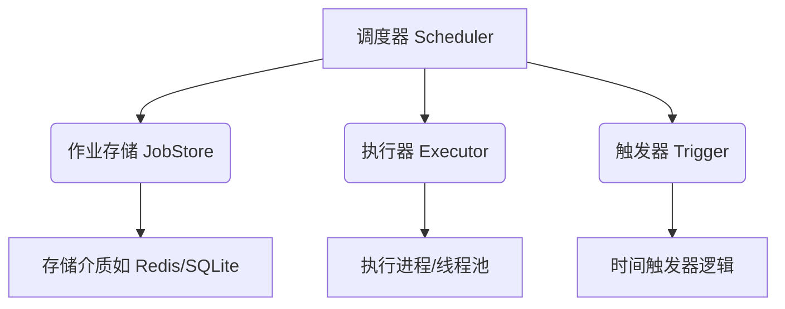

扫描[二维码](https://api2.cmdragon.cn/upload/cmder/20250304_012821924.jpg)
关注或者微信搜一搜：`编程智域 前端至全栈交流与成长`

[发现1000+提升效率与开发的AI工具和实用程序](https://tools.cmdragon.cn/zh/apps?category=ai_chat)：https://tools.cmdragon.cn/

### 1. APScheduler分布式定时任务协调核心概念

#### 1.1 为什么需要分布式定时任务？

在分布式系统中部署定时任务时，会遇到两个核心挑战：

1. **单点故障问题**：传统单节点调度器故障会导致所有定时任务中断
2. **任务重复执行**：多节点同时运行时可能触发同一个任务多次执行  
   分布式协调就是为解决这些问题而生的技术方案。

#### 1.2 APScheduler架构解析

APScheduler的核心组件和工作流程：



- **作业存储(JobStore)**：持久化任务信息（Redis/SQLite等）
- **执行器(Executor)**：管理任务执行线程/进程
- **触发器(Trigger)**：决定任务执行时间规则

#### 1.3 分布式协调核心原理

关键协调机制：

1. **分布式锁**：通过Redis的`SETNX`实现互斥锁
2. **心跳检测**：节点定期更新Redis中的存活标记
3. **故障转移**：当leader节点故障时，其他节点通过选举接管任务

### 2. FastAPI集成APScheduler实战

#### 2.1 环境准备与依赖

安装所需库：

```bash
pip install fastapi==0.103.1 uvicorn==0.23.2 
pip install apscheduler==3.10.1 redis==4.5.5 pydantic==2.4.2
```

#### 2.2 核心代码实现

创建分布式任务调度系统：

```python
from fastapi import FastAPI
from apscheduler.schedulers.background import BackgroundScheduler
from apscheduler.jobstores.redis import RedisJobStore
from pydantic import BaseModel
import redis


# 定义任务参数模型
class TaskConfig(BaseModel):
    task_name: str
    interval: int  # 执行间隔(秒)


app = FastAPI()

# 配置Redis连接
redis_client = redis.Redis(host='redis', port=6379, db=0)
jobstores = {
    'default': RedisJobStore(redis=redis_client)
}

# 创建分布式调度器
scheduler = BackgroundScheduler(jobstores=jobstores)
scheduler.start()


@app.post("/schedule")
def create_scheduled_task(config: TaskConfig):
    def job_function():
        # 获取分布式锁
        with redis_client.lock(f"lock:{config.task_name}", timeout=10):
            print(f"执行任务: {config.task_name}")
            # 实际任务逻辑放这里

    # 添加定时任务
    scheduler.add_job(
        job_function,
        'interval',
        seconds=config.interval,
        id=config.task_name,
        replace_existing=True
    )
    return {"status": "scheduled", "task": config.task_name}


@app.on_event("shutdown")
def shutdown_event():
    scheduler.shutdown()
```

#### 2.3 关键代码解析

1. **RedisJobStore**：使用Redis作为任务存储后端
2. **分布式锁**：`redis_client.lock()`确保任务单节点执行
3. **Pydantic验证**：通过`TaskConfig`模型校验输入参数
4. **优雅关闭**：`shutdown_event`确保服务停止时释放资源

### 3. 应用场景案例

#### 3.1 电商优惠券过期系统

需求：每天凌晨2点批量作废过期优惠券

```python
def expire_coupons():
    with redis_client.lock("coupon_expire_lock", timeout=30):
        print("执行优惠券过期处理...")
        # 连接数据库执行更新操作


# 在FastAPI启动时添加任务
if not scheduler.get_job("coupon_expiration"):
    scheduler.add_job(
        expire_coupons,
        'cron',
        hour=2,
        minute=0,
        id="coupon_expiration"
    )
```

#### 3.2 分布式日志清理系统

需求：每30分钟清理过期日志文件

```python
def clean_log_files():
    leader_key = "log_clean_leader"

    # 竞选主节点
    if redis_client.setnx(leader_key, "active"):
        redis_client.expire(leader_key, 1800)  # 持有30分钟领导权
        print("当前节点成为leader执行日志清理")
        # 实际清理逻辑
    else:
        print("当前节点为follower")


scheduler.add_job(
    clean_log_files,
    'interval',
    minutes=30,
    id="log_clean"
)
```

### 4. 常见问题与解决方案

#### 4.1 任务重复执行（错误示例）

```bash
[ERROR] 任务被执行了多次
```

**原因分析**：

1. 未正确实现分布式锁
2. 锁超时时间小于任务执行时间  
   **解决方案**：
1. 使用Redis的原子操作确保锁机制可靠
2. 根据任务执行时间动态调整锁超时

```python
# 正确加锁方式
with redis_client.lock("my_lock", blocking_timeout=5, timeout=60):
# 任务代码
```

#### 4.2 节点状态不同步

```bash
[WARNING] 节点心跳丢失
```

**预防措施**：

1. 实现双心跳检测机制：

```python
def heartbeat():
    # 更新最近心跳时间
    redis_client.setex(f"heartbeat:{node_id}", 30, "alive")

    # 检查其他节点状态
    for node in all_nodes:
        if not redis_client.exists(f"heartbeat:{node}"):
            print(f"{node}节点失效，触发故障转移")
```

### 5. Quiz：巩固知识点

**问题1**：  
当使用`RedisJobStore`时，如果Redis服务器重启，定时任务会丢失吗？为什么？

**答案解析**：  
不会丢失。因为`RedisJobStore`默认将任务序列化后持久存储在Redis中，只要Redis配置了持久化（RDB/AOF），重启后任务信息可以恢复。但要注意：

1. 需确保Redis配置了`appendonly yes`
2. 任务添加时设置`replace_existing=True`防止重复

**问题2**：  
如何在不停机的情况下修改已存在定时任务的触发时间？

**答案解析**：  
使用`modify_job`方法：

```python
scheduler.modify_job(
    job_id='my_task',
    trigger='interval',
    minutes=45  # 修改为45分钟间隔
)
```

原理：调度器会重新计算下次触发时间，并更新JobStore中的元数据

### 6. 进阶技巧与实践建议

#### 6.1 任务监控与告警

实现任务执行状态监控：

```python
def monitoring_wrapper(job_func):
    def wrapper(*args, **kwargs):
        start = time.time()
        try:
            result = job_func(*args, **kwargs)
            status = "success"
        except Exception as e:
            status = "failed"
            # 发送告警
            send_alert(f"任务失败: {str(e)}")
        finally:
            duration = time.time() - start
            log_execution(job_id, status, duration)
        return result

    return wrapper


# 使用装饰器应用监控
scheduler.add_job(monitoring_wrapper(task_function), ...)
```

#### 6.2 动态扩缩容策略

根据负载动态调整任务密度：

```python
def dynamic_scaling():
    current_load = get_system_load()

    if current_load > 70:
        # 降低任务频率
        for job in scheduler.get_jobs():
            if job.id.startswith("batch_"):
                new_interval = min(300, job.trigger.interval * 1.5)
                scheduler.modify_job(job.id, minutes=new_interval)
```

#### 6.3 最佳实践建议

1. 总是为任务设置唯一的`job_id`
2. 使用`try/except`包裹任务函数主体代码
3. 为分布式锁设置合理的超时时间（建议任务执行时间×2）
4. 定期备份Redis任务数据
5. 实现任务执行历史记录：

```python
class TaskLog(BaseModel):
    job_id: str
    status: Literal["success", "failed"]
    timestamp: datetime
    duration: float


@app.post("/log")
def save_log(log: TaskLog):
    redis_client.lpush("task_logs", log.json())
```

余下文章内容请点击跳转至 个人博客页面 或者 扫码关注或者微信搜一搜：`编程智域 前端至全栈交流与成长`
，阅读完整的文章：[如何用APScheduler和FastAPI打造永不宕机的分布式定时任务系统？](https://blog.cmdragon.cn/posts/51a0ff47f509fb6238150a96f551b317/)


<details>
<summary>往期文章归档</summary>

- [如何在FastAPI中玩转APScheduler，实现动态定时任务的魔法？ - cmdragon's Blog](https://blog.cmdragon.cn/posts/4fb9e30bb20956319c783e21897a667a/)
- [如何在 FastAPI 中玩转 APScheduler，让任务定时自动执行？ - cmdragon's Blog](https://blog.cmdragon.cn/posts/85564dd901c6d9b1a79d320970843caa/)
- [定时任务系统如何让你的Web应用自动完成那些烦人的重复工作？ - cmdragon's Blog](https://blog.cmdragon.cn/posts/2b27950aab76203a1af4e9e3deda8699/)
- [Celery任务监控的魔法背后藏着什么秘密？ - cmdragon's Blog](https://blog.cmdragon.cn/posts/f43335725bb3372ebc774db1b9f28d2d/)
- [如何让Celery任务像VIP客户一样享受优先待遇？ - cmdragon's Blog](https://blog.cmdragon.cn/posts/c24491a7ac7f7c5e9cf77596ebb27c51/)
- [如何让你的FastAPI Celery Worker在压力下优雅起舞？ - cmdragon's Blog](https://blog.cmdragon.cn/posts/c3129f4b424d2ed2330484b82ec31875/)
- [FastAPI与Celery的完美邂逅，如何让异步任务飞起来？ - cmdragon's Blog](https://blog.cmdragon.cn/posts/b79c2c1805fe9b1ea28326b5b8f3b709/)
- [FastAPI消息持久化与ACK机制：如何确保你的任务永不迷路？ - cmdragon's Blog](https://blog.cmdragon.cn/posts/13a59846aaab71b44ab6f3dadc5b5ec7/)
- [FastAPI的BackgroundTasks如何玩转生产者-消费者模式？ - cmdragon's Blog](https://blog.cmdragon.cn/posts/1549a6bd7e47e7006e7ba8f52bcfe8eb/)
- [BackgroundTasks 还是 RabbitMQ？你的异步任务到底该选谁？ - cmdragon's Blog](https://blog.cmdragon.cn/posts/d26fdc150ff9dd70c7482381ff4c77c4/)
- [BackgroundTasks与Celery：谁才是异步任务的终极赢家？ - cmdragon's Blog](https://blog.cmdragon.cn/posts/792cac4ce6eb96b5001da15b0d52ef83/)
- [如何在 FastAPI 中优雅处理后台任务异常并实现智能重试？ - cmdragon's Blog](https://blog.cmdragon.cn/posts/d5c1d2efbaf6fe4c9e13acc6be6d929a/)
- [BackgroundTasks 如何巧妙驾驭多任务并发？ - cmdragon's Blog](https://blog.cmdragon.cn/posts/8661dc74944bd6fb28092e90d4060161/)
- [如何让FastAPI后台任务像多米诺骨牌一样井然有序地执行？ - cmdragon's Blog](https://blog.cmdragon.cn/posts/7693d3430a6256c2abefc1e4aba21a4a/)
- [FastAPI后台任务：是时候让你的代码飞起来了吗？ - cmdragon's Blog](https://blog.cmdragon.cn/posts/6145d88d5154d5cd38cee7ddc2d46e1d/)
- [FastAPI后台任务为何能让邮件发送如此丝滑？ - cmdragon's Blog](https://blog.cmdragon.cn/posts/19241679a1852122f740391cbdc21bae/)
- [FastAPI的请求-响应周期为何需要后台任务分离？ - cmdragon's Blog](https://blog.cmdragon.cn/posts/c7b54d6b3b6b5041654e69e5610bf3b9/)
- [如何在FastAPI中让后台任务既高效又不会让你的应用崩溃？ - cmdragon's Blog](https://blog.cmdragon.cn/posts/5ad8d0a4c8f2d05e9c1a42d828aad7b3/)
- [FastAPI后台任务：异步魔法还是同步噩梦？ - cmdragon's Blog](https://blog.cmdragon.cn/posts/6a69eca9fd14ba8f6fa41502c5014edd/)
- [如何在FastAPI中玩转Schema版本管理和灰度发布？ - cmdragon's Blog](https://blog.cmdragon.cn/posts/6d9d20cd8d8528da4193f13aaf98575c/)
- [FastAPI的查询白名单和安全沙箱机制如何确保你的API坚不可摧？ - cmdragon's Blog](https://blog.cmdragon.cn/posts/ca141239cfc5c0d510960acd266de9cd/)
- [如何在 FastAPI 中玩转 GraphQL 性能监控与 APM 集成？ - cmdragon's Blog](https://blog.cmdragon.cn/posts/52fe9ea73b0e26de308ae0e539df21d2/)
- [如何在 FastAPI 中玩转 GraphQL 和 WebSocket 的实时数据推送魔法？ - cmdragon's Blog](https://blog.cmdragon.cn/posts/ae484cf6bcf3f44fd8392a8272e57db4/)
- [如何在FastAPI中玩转GraphQL联邦架构，让数据源手拉手跳探戈？ - cmdragon's Blog](https://blog.cmdragon.cn/posts/9b9086ff5d8464b0810cfb55f7768513/)
- [GraphQL批量查询优化：DataLoader如何让数据库访问速度飞起来？ - cmdragon's Blog](https://blog.cmdragon.cn/posts/0e236dbe717bde52bda290e89f4f6eca/)
- [如何在FastAPI中整合GraphQL的复杂度与限流？ - cmdragon's Blog](https://blog.cmdragon.cn/posts/ace8bb3f01589994f51d748ab5c73652/)
- [GraphQL错误处理为何让你又爱又恨？FastAPI中间件能否成为你的救星？ - cmdragon's Blog](https://blog.cmdragon.cn/posts/a28d5c1b32feadb18b406a849455dfe5/)
- [FastAPI遇上GraphQL：异步解析器如何让API性能飙升？ - cmdragon's Blog](https://blog.cmdragon.cn/posts/35fced261e8ff834e68e07c93902cc13/)
- [GraphQL的N+1问题如何被DataLoader巧妙化解？ - cmdragon's Blog](https://blog.cmdragon.cn/posts/72629304782a121fbf89b151c436f9aa/)
- [FastAPI与GraphQL的完美邂逅：如何打造高效API？ - cmdragon's Blog](https://blog.cmdragon.cn/posts/fb5c5c7b00bbe57b3a5346b8ee5bc289/)
- [GraphQL类型系统如何让FastAPI开发更高效？ - cmdragon's Blog](https://blog.cmdragon.cn/posts/31c152e531e1cbe5b5cfe15e7ff053c9/)
- [REST和GraphQL究竟谁才是API设计的终极赢家？ - cmdragon's Blog](https://blog.cmdragon.cn/posts/218ad2370eab6197f42fdc9c52f0fc19/)
- [IoT设备的OTA升级是如何通过MQTT协议实现无缝对接的？ - cmdragon's Blog](https://blog.cmdragon.cn/posts/071e9a3b9792beea63f134f5ad28df67/)
- [如何在FastAPI中玩转STOMP协议升级，让你的消息传递更高效？ - cmdragon's Blog](https://blog.cmdragon.cn/posts/16744b2f460346805c45314bc0c6f751/)
- [如何用WebSocket打造毫秒级实时协作系统？ - cmdragon's Blog](https://blog.cmdragon.cn/posts/da5b64cb0ded23e4d5b1f19ffd5ac53d/)
- [如何让你的WebSocket连接既安全又高效？](https://blog.cmdragon.cn/posts/eb598d50b76ea1823746ab7cdf49ce05/)

</details>


<details>
<summary>免费好用的热门在线工具</summary>

- [ASCII字符画生成器 - 应用商店 | By cmdragon](https://tools.cmdragon.cn/zh/apps/ascii-art-generator)
- [JSON Web Tokens 工具 - 应用商店 | By cmdragon](https://tools.cmdragon.cn/zh/apps/jwt-tool)
- [Bcrypt 密码工具 - 应用商店 | By cmdragon](https://tools.cmdragon.cn/zh/apps/bcrypt-tool)
- [GIF 合成器 - 应用商店 | By cmdragon](https://tools.cmdragon.cn/zh/apps/gif-composer)
- [GIF 分解器 - 应用商店 | By cmdragon](https://tools.cmdragon.cn/zh/apps/gif-decomposer)
- [文本隐写术 - 应用商店 | By cmdragon](https://tools.cmdragon.cn/zh/apps/text-steganography)
- [CMDragon 在线工具 - 高级AI工具箱与开发者套件 | 免费好用的在线工具](https://tools.cmdragon.cn/zh)
- [应用商店 - 发现1000+提升效率与开发的AI工具和实用程序 | 免费好用的在线工具](https://tools.cmdragon.cn/zh/apps?category=trending)
- [CMDragon 更新日志 - 最新更新、功能与改进 | 免费好用的在线工具](https://tools.cmdragon.cn/zh/changelog)
- [支持我们 - 成为赞助者 | 免费好用的在线工具](https://tools.cmdragon.cn/zh/sponsor)
- [AI文本生成图像 - 应用商店 | 免费好用的在线工具](https://tools.cmdragon.cn/zh/apps/text-to-image-ai)
- [临时邮箱 - 应用商店 | 免费好用的在线工具](https://tools.cmdragon.cn/zh/apps/temp-email)
- [二维码解析器 - 应用商店 | 免费好用的在线工具](https://tools.cmdragon.cn/zh/apps/qrcode-parser)
- [文本转思维导图 - 应用商店 | 免费好用的在线工具](https://tools.cmdragon.cn/zh/apps/text-to-mindmap)
- [正则表达式可视化工具 - 应用商店 | 免费好用的在线工具](https://tools.cmdragon.cn/zh/apps/regex-visualizer)
- [文件隐写工具 - 应用商店 | 免费好用的在线工具](https://tools.cmdragon.cn/zh/apps/steganography-tool)
- [IPTV 频道探索器 - 应用商店 | 免费好用的在线工具](https://tools.cmdragon.cn/zh/apps/iptv-explorer)
- [快传 - 应用商店 | 免费好用的在线工具](https://tools.cmdragon.cn/zh/apps/snapdrop)
- [随机抽奖工具 - 应用商店 | 免费好用的在线工具](https://tools.cmdragon.cn/zh/apps/lucky-draw)
- [动漫场景查找器 - 应用商店 | 免费好用的在线工具](https://tools.cmdragon.cn/zh/apps/anime-scene-finder)
- [时间工具箱 - 应用商店 | 免费好用的在线工具](https://tools.cmdragon.cn/zh/apps/time-toolkit)
- [网速测试 - 应用商店 | 免费好用的在线工具](https://tools.cmdragon.cn/zh/apps/speed-test)
- [AI 智能抠图工具 - 应用商店 | 免费好用的在线工具](https://tools.cmdragon.cn/zh/apps/background-remover)
- [背景替换工具 - 应用商店 | 免费好用的在线工具](https://tools.cmdragon.cn/zh/apps/background-replacer)
- [艺术二维码生成器 - 应用商店 | 免费好用的在线工具](https://tools.cmdragon.cn/zh/apps/artistic-qrcode)
- [Open Graph 元标签生成器 - 应用商店 | 免费好用的在线工具](https://tools.cmdragon.cn/zh/apps/open-graph-generator)
- [图像对比工具 - 应用商店 | 免费好用的在线工具](https://tools.cmdragon.cn/zh/apps/image-comparison)
- [图片压缩专业版 - 应用商店 | 免费好用的在线工具](https://tools.cmdragon.cn/zh/apps/image-compressor)
- [密码生成器 - 应用商店 | 免费好用的在线工具](https://tools.cmdragon.cn/zh/apps/password-generator)
- [SVG优化器 - 应用商店 | 免费好用的在线工具](https://tools.cmdragon.cn/zh/apps/svg-optimizer)
- [调色板生成器 - 应用商店 | 免费好用的在线工具](https://tools.cmdragon.cn/zh/apps/color-palette)
- [在线节拍器 - 应用商店 | 免费好用的在线工具](https://tools.cmdragon.cn/zh/apps/online-metronome)
- [IP归属地查询 - 应用商店 | 免费好用的在线工具](https://tools.cmdragon.cn/zh/apps/ip-geolocation)
- [CSS网格布局生成器 - 应用商店 | 免费好用的在线工具](https://tools.cmdragon.cn/zh/apps/css-grid-layout)
- [邮箱验证工具 - 应用商店 | 免费好用的在线工具](https://tools.cmdragon.cn/zh/apps/email-validator)
- [书法练习字帖 - 应用商店 | 免费好用的在线工具](https://tools.cmdragon.cn/zh/apps/calligraphy-practice)
- [金融计算器套件 - 应用商店 | 免费好用的在线工具](https://tools.cmdragon.cn/zh/apps/finance-calculator-suite)
- [中国亲戚关系计算器 - 应用商店 | 免费好用的在线工具](https://tools.cmdragon.cn/zh/apps/chinese-kinship-calculator)
- [Protocol Buffer 工具箱 - 应用商店 | 免费好用的在线工具](https://tools.cmdragon.cn/zh/apps/protobuf-toolkit)
- [IP归属地查询 - 应用商店 | 免费好用的在线工具](https://tools.cmdragon.cn/zh/apps/ip-geolocation)
- [图片无损放大 - 应用商店 | 免费好用的在线工具](https://tools.cmdragon.cn/zh/apps/image-upscaler)
- [文本比较工具 - 应用商店 | 免费好用的在线工具](https://tools.cmdragon.cn/zh/apps/text-compare)
- [IP批量查询工具 - 应用商店 | 免费好用的在线工具](https://tools.cmdragon.cn/zh/apps/ip-batch-lookup)
- [域名查询工具 - 应用商店 | 免费好用的在线工具](https://tools.cmdragon.cn/zh/apps/domain-finder)
- [DNS工具箱 - 应用商店 | 免费好用的在线工具](https://tools.cmdragon.cn/zh/apps/dns-toolkit)
- [网站图标生成器 - 应用商店 | 免费好用的在线工具](https://tools.cmdragon.cn/zh/apps/favicon-generator)
- [XML Sitemap](https://tools.cmdragon.cn/sitemap_index.xml)

</details>

