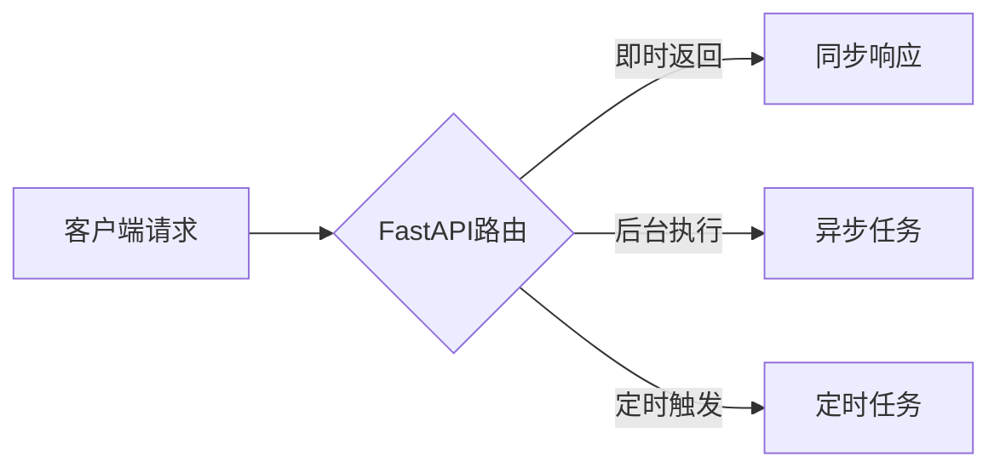

扫描[二维码](https://api2.cmdragon.cn/upload/cmder/20250304_012821924.jpg)
关注或者微信搜一搜：`编程智域 前端至全栈交流与成长`

[发现1000+提升效率与开发的AI工具和实用程序](https://tools.cmdragon.cn/zh/apps?category=ai_chat)：https://tools.cmdragon.cn/

#### 一、 **多模块集成测试实践**

在大型项目中，FastAPI应用通常拆分为多个模块（如路由模块、服务层、数据层）。集成测试的重点是验证模块间的交互是否符合预期。

**实现方案**：

1. **测试数据库隔离**：使用`pytest`的`fixture`创建临时数据库，避免污染生产数据。
   ```python
   # conftest.py
   import pytest
   from sqlalchemy import create_engine
   from sqlalchemy.orm import sessionmaker
   
   @pytest.fixture(scope="module")
   def test_db():
       # 使用SQLite内存数据库
       engine = create_engine("sqlite:///:memory:")
       SessionLocal = sessionmaker(bind=engine)
       # 创建所有表
       Base.metadata.create_all(bind=engine)
       yield SessionLocal()
       engine.dispose()
   ```

2. **模拟外部依赖**：使用`unittest.mock`替换第三方服务（如API调用）。
   ```python
   # test_payment.py
   from unittest.mock import patch

   def test_process_payment(test_db):
       # 模拟支付网关响应
       with patch("services.payment_gateway.charge") as mock_charge:
           mock_charge.return_value = {"status": "success"}
           response = client.post("/payments", json={"amount": 100})
           assert response.status_code == 200
   ```

**流程图**：


### 二、异步任务实现

在Web应用中，**耗时操作**（如邮件发送、文件处理）和**定时任务**（如数据备份、报表生成）是常见需求。如果同步执行这些操作：

1. 会阻塞请求处理线程
2. 导致用户等待时间过长
3. 降低系统整体吞吐量

FastAPI通过异步架构提供了两种解决方案：



#### 2.1 核心组件：BackgroundTasks

使用`BackgroundTasks`将耗时操作放入后台执行：

```python
from fastapi import BackgroundTasks, FastAPI
from pydantic import BaseModel

app = FastAPI()


class UserRequest(BaseModel):
    email: str
    message: str


def send_email(email: str, message: str):
    # 模拟邮件发送耗时操作
    print(f"Sending email to {email}: {message}")
    # 实际项目中可使用smtplib或SendGrid库


@app.post("/notify")
async def notify_user(
        request: UserRequest,
        background_tasks: BackgroundTasks
):
    # 添加后台任务（非阻塞）
    background_tasks.add_task(
        send_email,
        request.email,
        request.message
    )
    return {"status": "Notification queued"}
```

#### 2.2 实现原理

- **异步调度器**：FastAPI内置线程池管理后台任务
- **任务隔离**：每个任务在独立线程中执行
- **自动清理**：任务完成后释放资源

### 三、定时任务实现

#### 3.1 使用APScheduler

APScheduler提供多种触发器类型：

```python
from apscheduler.schedulers.background import BackgroundScheduler
from datetime import datetime

# 创建调度器实例
scheduler = BackgroundScheduler()


# 定时任务示例：每60秒执行
@scheduler.scheduled_job('interval', seconds=60)
def database_backup():
    print(f"{datetime.now()}: Database backup started")
    # 实际备份逻辑


# 在FastAPI启动时初始化
@app.on_event("startup")
def init_scheduler():
    scheduler.start()


# 关闭时清理
@app.on_event("shutdown")
def shutdown_scheduler():
    scheduler.shutdown()
```

#### 3.2 定时规则配置

| 触发类型    | 代码示例                  | 说明         |
|---------|-----------------------|------------|
| 固定间隔    | `seconds=30`          | 每30秒执行一次   |
| 特定时间    | `hour=3, minute=30`   | 每天03:30执行  |
| Cron表达式 | `cron='0 12 * * 1-5'` | 工作日中午12点执行 |
| 一次性任务   | `trigger='date'`      | 指定具体时间执行   |

### 四、集成验证与测试

#### 4.1 异步任务测试策略

```python
from fastapi.testclient import TestClient
from unittest.mock import patch

client = TestClient(app)


def test_notify_user():
    # 模拟后台任务函数
    with patch("main.send_email") as mock_send:
        # 发送请求
        response = client.post(
            "/notify",
            json={"email": "test@ex.com", "message": "Hello"}
        )

        # 验证即时响应
        assert response.status_code == 200
        assert response.json() == {"status": "Notification queued"}

        # 验证任务被调用
        mock_send.assert_called_once_with("test@ex.com", "Hello")
```

#### 4.2 定时任务验证技巧

```python
# 手动触发任务进行验证
def test_scheduler_job():
    # 直接调用定时任务函数
    database_backup()

    # 验证日志输出或状态变更
    # (需在实际项目中添加检测点)
```

### 五、最佳实践指南

1. **任务幂等性**：确保相同任务重复执行不会产生副作用
2. **异常处理**：所有任务必须包含异常捕获

```python
def send_email(email, message):
    try:
    # 发送逻辑
    except Exception as e:
        logger.error(f"邮件发送失败: {str(e)}")
```

3. **资源限制**：配置任务并发量防止系统过载

```python
# 限制最大并发线程数
background_tasks.add_task(..., max_workers=5)
```

4. **监控集成**：添加Prometheus指标暴露

```python
from prometheus_fastapi_instrumentator import Instrumentator


@app.on_event("startup")
def init_monitoring():
    Instrumentator().instrument(app).expose(app)
```

### 六、课后 Quiz

1. **Q: 当添加100个后台任务但线程池只有10个线程时会发生什么？**  
   A: 任务进入队列依次执行  
   B: 第11个任务直接失败  
   C: 自动扩容线程池  
   D: 阻塞主线程

   **答案: A**  
   *解析：FastAPI使用队列管理超额任务，当线程池满时新任务排队等候*

2. **Q: 如何确保定时任务在服务器重启后不丢失？**  
   A: 使用数据库持久化任务状态  
   B: 配置APScheduler的持久化存储  
   C: 每次启动重新注册任务  
   D: 使用外部任务队列如Celery

   **答案: B**  
   *解析：APScheduler支持SQLite/Redis等持久化存储：*
   ```python
   scheduler = BackgroundScheduler(
       jobstores={'default': SQLAlchemyJobStore(url='sqlite:///jobs.sqlite')}
   )
   ```

### 七、常见报错解决方案

#### 7.1 报错：`RuntimeError: No active scheduler`

- **原因**：在路由中直接访问未初始化的scheduler
- **修复**：通过依赖注入获取实例

```python
def get_scheduler():
    return scheduler


@app.get("/jobs")
def list_jobs(sched: BackgroundScheduler = Depends(get_scheduler)):
    return [str(job) for job in sched.get_jobs()]
```

#### 7.2 报错：`JobNotFound` 定时任务消失

- **场景**：修改代码后重启服务导致任务丢失
- **预防**：
    1. 启用持久化存储
    2. 添加任务前检查是否已存在
  ```python
  if not scheduler.get_job('backup_job'):
      scheduler.add_job(..., id='backup_job')
  ```

#### 7.3 报错：`422 Validation Error`

- **高频场景**：任务参数类型错误
- **调试步骤**：
    1. 使用Pydantic验证输入参数
  ```python
  def send_email(email: EmailStr, message: str):
      # EmailStr会自动验证邮箱格式
  ```
    2. 测试时强制触发验证
  ```python
  from pydantic import ValidationError
  try:
      UserRequest(email="invalid", message="test")
  except ValidationError as e:
      print(e.json())
  ```

### 第三方依赖清单

在`requirements.txt`中声明：

```
fastapi==0.104.0
pydantic==2.6.1
apscheduler==3.10.1
pytest==7.4.0
requests==2.31.0
prometheus-fastapi-instrumentator==6.1.0
```

余下文章内容请点击跳转至 个人博客页面 或者 扫码关注或者微信搜一搜：`编程智域 前端至全栈交流与成长`
，阅读完整的文章：[如何用FastAPI玩转多模块测试与异步任务，让代码不再“闹脾气”？](https://blog.cmdragon.cn/posts/ddbfa0447a5d0d6f9af12e7a6b206f70/)


<details>
<summary>往期文章归档</summary>

- [如何在FastAPI中玩转“时光倒流”的数据库事务回滚测试？](https://blog.cmdragon.cn/posts/bf9883a75ffa46b523a03b16ec56ce48/)
- [如何在FastAPI中优雅地模拟多模块集成测试？ - cmdragon's Blog](https://blog.cmdragon.cn/posts/be553dbd5d51835d2c69553f4a773e2d/)
- [多环境配置切换机制能否让开发与生产无缝衔接？ - cmdragon's Blog](https://blog.cmdragon.cn/posts/533874f5700b8506d4c68781597db659/)
- [如何在 FastAPI 中巧妙覆盖依赖注入并拦截第三方服务调用？ - cmdragon's Blog](https://blog.cmdragon.cn/posts/2d992ef9e8962dc0a4a0b5348d486114/)
- [为什么你的单元测试需要Mock数据库才能飞起来？ - cmdragon's Blog](https://blog.cmdragon.cn/posts/6e69c0eedd8b1e5a74a148d36c85d7ce/)
- [如何在FastAPI中巧妙隔离依赖项，让单元测试不再头疼？ - cmdragon's Blog](https://blog.cmdragon.cn/posts/77ae327dc941b0e74ecc6a8794c084d0/)
- [如何在FastAPI中巧妙隔离依赖项，让单元测试不再头疼？ - cmdragon's Blog](https://blog.cmdragon.cn/posts/77ae327dc941b0e74ecc6a8794c084d0/)
- [测试覆盖率不够高？这些技巧让你的FastAPI测试无懈可击！ - cmdragon's Blog](https://blog.cmdragon.cn/posts/0577d0e24f48b3153b510e74d3d1a822/)
- [为什么你的FastAPI测试覆盖率总是低得让人想哭？ - cmdragon's Blog](https://blog.cmdragon.cn/posts/985c18ca802f1b6da828b92e082b4d4e/)
- [如何让FastAPI测试不再成为你的噩梦？ - cmdragon's Blog](https://blog.cmdragon.cn/posts/29858a7a10d20b4e4649cb75fb422eab/)
- [FastAPI测试环境配置的秘诀，你真的掌握了吗？ - cmdragon's Blog](https://blog.cmdragon.cn/posts/6f9e71e8313db6de8c1431877a70b67e/)
- [全链路追踪如何让FastAPI微服务架构的每个请求都无所遁形？ - cmdragon's Blog](https://blog.cmdragon.cn/posts/30e1d2fbf1ad8123eaf0e1e0dbe7c675/)
- [如何在API高并发中玩转资源隔离与限流策略？ - cmdragon's Blog](https://blog.cmdragon.cn/posts/4ad4ec1dbd80bcf5670fb397ca7cc68c/)
- [任务分片执行模式如何让你的FastAPI性能飙升？ - cmdragon's Blog](https://blog.cmdragon.cn/posts/c6a598639f6a831e9e82e171b8d71857/)
- [冷热任务分离：是提升Web性能的终极秘籍还是技术噱头？ - cmdragon's Blog](https://blog.cmdragon.cn/posts/9c3dc7767a9282f7ef02daad42539f2c/)
- [如何让FastAPI在百万级任务处理中依然游刃有余？ - cmdragon's Blog](https://blog.cmdragon.cn/posts/469aae0e0f88c642ed8bc82e102b960b/)
- [如何让FastAPI与消息队列的联姻既甜蜜又可靠？ - cmdragon's Blog](https://blog.cmdragon.cn/posts/1bebb53f4d9d6fbd0ecbba97562c07b0/)
- [如何在FastAPI中巧妙实现延迟队列，让任务乖乖等待？ - cmdragon's Blog](https://blog.cmdragon.cn/posts/174450702d9e609a072a7d1aaa84750b/)
- [FastAPI的死信队列处理机制：为何你的消息系统需要它？ - cmdragon's Blog](https://blog.cmdragon.cn/posts/047b08957a0d617a87b72da6c3131e5d/)
- [如何让FastAPI任务系统在失败时自动告警并自我修复？ - cmdragon's Blog](https://blog.cmdragon.cn/posts/2f104637ecc916e906c002fa79ab8c80/)
- [如何用Prometheus和FastAPI打造任务监控的“火眼金睛”？ - cmdragon's Blog](https://blog.cmdragon.cn/posts/e7464e5b4d558ede1a7413fa0a2f96f3/)
- [如何用APScheduler和FastAPI打造永不宕机的分布式定时任务系统？ - cmdragon's Blog](https://blog.cmdragon.cn/posts/51a0ff47f509fb6238150a96f551b317/)
- [如何在 FastAPI 中玩转 APScheduler，让任务定时自动执行？ - cmdragon's Blog](https://blog.cmdragon.cn/posts/85564dd901c6d9b1a79d320970843caa/)
- [定时任务系统如何让你的Web应用自动完成那些烦人的重复工作？ - cmdragon's Blog](https://blog.cmdragon.cn/posts/2b27950aab76203a1af4e9e3deda8699/)
- [Celery任务监控的魔法背后藏着什么秘密？ - cmdragon's Blog](https://blog.cmdragon.cn/posts/f43335725bb3372ebc774db1b9f28d2d/)
- [如何让Celery任务像VIP客户一样享受优先待遇？ - cmdragon's Blog](https://blog.cmdragon.cn/posts/c24491a7ac7f7c5e9cf77596ebb27c51/)
- [如何让你的FastAPI Celery Worker在压力下优雅起舞？ - cmdragon's Blog](https://blog.cmdragon.cn/posts/c3129f4b424d2ed2330484b82ec31875/)
- [FastAPI与Celery的完美邂逅，如何让异步任务飞起来？ - cmdragon's Blog](https://blog.cmdragon.cn/posts/b79c2c1805fe9b1ea28326b5b8f3b709/)
- [FastAPI消息持久化与ACK机制：如何确保你的任务永不迷路？ - cmdragon's Blog](https://blog.cmdragon.cn/posts/13a59846aaab71b44ab6f3dadc5b5ec7/)
- [FastAPI的BackgroundTasks如何玩转生产者-消费者模式？ - cmdragon's Blog](https://blog.cmdragon.cn/posts/1549a6bd7e47e7006e7ba8f52bcfe8eb/)
- [BackgroundTasks 还是 RabbitMQ？你的异步任务到底该选谁？ - cmdragon's Blog](https://blog.cmdragon.cn/posts/d26fdc150ff9dd70c7482381ff4c77c4/)
- [BackgroundTasks与Celery：谁才是异步任务的终极赢家？ - cmdragon's Blog](https://blog.cmdragon.cn/posts/792cac4ce6eb96b5001da15b0d52ef83/)
- [如何在 FastAPI 中优雅处理后台任务异常并实现智能重试？ - cmdragon's Blog](https://blog.cmdragon.cn/posts/d5c1d2efbaf6fe4c9e13acc6be6d929a/)
- [BackgroundTasks 如何巧妙驾驭多任务并发？ - cmdragon's Blog](https://blog.cmdragon.cn/posts/8661dc74944bd6fb28092e90d4060161/)
- [如何让FastAPI后台任务像多米诺骨牌一样井然有序地执行？ - cmdragon's Blog](https://blog.cmdragon.cn/posts/7693d3430a6256c2abefc1e4aba21a4a/)
- [FastAPI后台任务：是时候让你的代码飞起来了吗？ - cmdragon's Blog](https://blog.cmdragon.cn/posts/6145d88d5154d5cd38cee7ddc2d46e1d/)
- [FastAPI后台任务为何能让邮件发送如此丝滑？ - cmdragon's Blog](https://blog.cmdragon.cn/posts/19241679a1852122f740391cbdc21bae/)

</details>


<details>
<summary>免费好用的热门在线工具</summary>

- [歌词生成工具 - 应用商店 | By cmdragon](https://tools.cmdragon.cn/zh/apps/lyrics-generator)
- [网盘资源聚合搜索 - 应用商店 | By cmdragon](https://tools.cmdragon.cn/zh/apps/cloud-drive-search)
- [ASCII字符画生成器 - 应用商店 | By cmdragon](https://tools.cmdragon.cn/zh/apps/ascii-art-generator)
- [JSON Web Tokens 工具 - 应用商店 | By cmdragon](https://tools.cmdragon.cn/zh/apps/jwt-tool)
- [Bcrypt 密码工具 - 应用商店 | By cmdragon](https://tools.cmdragon.cn/zh/apps/bcrypt-tool)
- [GIF 合成器 - 应用商店 | By cmdragon](https://tools.cmdragon.cn/zh/apps/gif-composer)
- [GIF 分解器 - 应用商店 | By cmdragon](https://tools.cmdragon.cn/zh/apps/gif-decomposer)
- [文本隐写术 - 应用商店 | By cmdragon](https://tools.cmdragon.cn/zh/apps/text-steganography)
- [CMDragon 在线工具 - 高级AI工具箱与开发者套件 | 免费好用的在线工具](https://tools.cmdragon.cn/zh)
- [应用商店 - 发现1000+提升效率与开发的AI工具和实用程序 | 免费好用的在线工具](https://tools.cmdragon.cn/zh/apps?category=trending)
- [CMDragon 更新日志 - 最新更新、功能与改进 | 免费好用的在线工具](https://tools.cmdragon.cn/zh/changelog)
- [支持我们 - 成为赞助者 | 免费好用的在线工具](https://tools.cmdragon.cn/zh/sponsor)
- [AI文本生成图像 - 应用商店 | 免费好用的在线工具](https://tools.cmdragon.cn/zh/apps/text-to-image-ai)
- [临时邮箱 - 应用商店 | 免费好用的在线工具](https://tools.cmdragon.cn/zh/apps/temp-email)
- [二维码解析器 - 应用商店 | 免费好用的在线工具](https://tools.cmdragon.cn/zh/apps/qrcode-parser)
- [文本转思维导图 - 应用商店 | 免费好用的在线工具](https://tools.cmdragon.cn/zh/apps/text-to-mindmap)
- [正则表达式可视化工具 - 应用商店 | 免费好用的在线工具](https://tools.cmdragon.cn/zh/apps/regex-visualizer)
- [文件隐写工具 - 应用商店 | 免费好用的在线工具](https://tools.cmdragon.cn/zh/apps/steganography-tool)
- [IPTV 频道探索器 - 应用商店 | 免费好用的在线工具](https://tools.cmdragon.cn/zh/apps/iptv-explorer)
- [快传 - 应用商店 | 免费好用的在线工具](https://tools.cmdragon.cn/zh/apps/snapdrop)
- [随机抽奖工具 - 应用商店 | 免费好用的在线工具](https://tools.cmdragon.cn/zh/apps/lucky-draw)
- [动漫场景查找器 - 应用商店 | 免费好用的在线工具](https://tools.cmdragon.cn/zh/apps/anime-scene-finder)
- [时间工具箱 - 应用商店 | 免费好用的在线工具](https://tools.cmdragon.cn/zh/apps/time-toolkit)
- [网速测试 - 应用商店 | 免费好用的在线工具](https://tools.cmdragon.cn/zh/apps/speed-test)
- [AI 智能抠图工具 - 应用商店 | 免费好用的在线工具](https://tools.cmdragon.cn/zh/apps/background-remover)
- [背景替换工具 - 应用商店 | 免费好用的在线工具](https://tools.cmdragon.cn/zh/apps/background-replacer)
- [艺术二维码生成器 - 应用商店 | 免费好用的在线工具](https://tools.cmdragon.cn/zh/apps/artistic-qrcode)
- [Open Graph 元标签生成器 - 应用商店 | 免费好用的在线工具](https://tools.cmdragon.cn/zh/apps/open-graph-generator)
- [图像对比工具 - 应用商店 | 免费好用的在线工具](https://tools.cmdragon.cn/zh/apps/image-comparison)
- [图片压缩专业版 - 应用商店 | 免费好用的在线工具](https://tools.cmdragon.cn/zh/apps/image-compressor)
- [密码生成器 - 应用商店 | 免费好用的在线工具](https://tools.cmdragon.cn/zh/apps/password-generator)
- [SVG优化器 - 应用商店 | 免费好用的在线工具](https://tools.cmdragon.cn/zh/apps/svg-optimizer)
- [调色板生成器 - 应用商店 | 免费好用的在线工具](https://tools.cmdragon.cn/zh/apps/color-palette)
- [在线节拍器 - 应用商店 | 免费好用的在线工具](https://tools.cmdragon.cn/zh/apps/online-metronome)
- [IP归属地查询 - 应用商店 | 免费好用的在线工具](https://tools.cmdragon.cn/zh/apps/ip-geolocation)
- [CSS网格布局生成器 - 应用商店 | 免费好用的在线工具](https://tools.cmdragon.cn/zh/apps/css-grid-layout)
- [邮箱验证工具 - 应用商店 | 免费好用的在线工具](https://tools.cmdragon.cn/zh/apps/email-validator)
- [书法练习字帖 - 应用商店 | 免费好用的在线工具](https://tools.cmdragon.cn/zh/apps/calligraphy-practice)
- [金融计算器套件 - 应用商店 | 免费好用的在线工具](https://tools.cmdragon.cn/zh/apps/finance-calculator-suite)
- [中国亲戚关系计算器 - 应用商店 | 免费好用的在线工具](https://tools.cmdragon.cn/zh/apps/chinese-kinship-calculator)
- [Protocol Buffer 工具箱 - 应用商店 | 免费好用的在线工具](https://tools.cmdragon.cn/zh/apps/protobuf-toolkit)
- [IP归属地查询 - 应用商店 | 免费好用的在线工具](https://tools.cmdragon.cn/zh/apps/ip-geolocation)
- [图片无损放大 - 应用商店 | 免费好用的在线工具](https://tools.cmdragon.cn/zh/apps/image-upscaler)
- [文本比较工具 - 应用商店 | 免费好用的在线工具](https://tools.cmdragon.cn/zh/apps/text-compare)
- [IP批量查询工具 - 应用商店 | 免费好用的在线工具](https://tools.cmdragon.cn/zh/apps/ip-batch-lookup)
- [域名查询工具 - 应用商店 | 免费好用的在线工具](https://tools.cmdragon.cn/zh/apps/domain-finder)
- [DNS工具箱 - 应用商店 | 免费好用的在线工具](https://tools.cmdragon.cn/zh/apps/dns-toolkit)
- [网站图标生成器 - 应用商店 | 免费好用的在线工具](https://tools.cmdragon.cn/zh/apps/favicon-generator)
- [XML Sitemap](https://tools.cmdragon.cn/sitemap_index.xml)

</details>