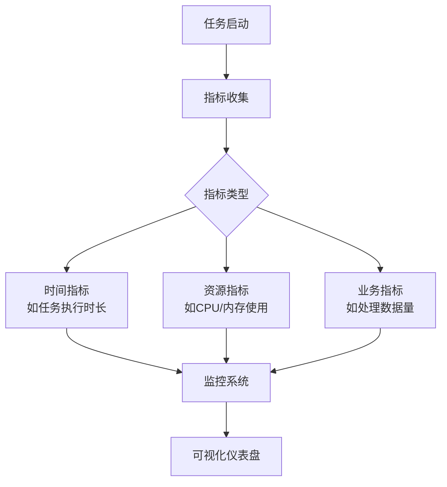
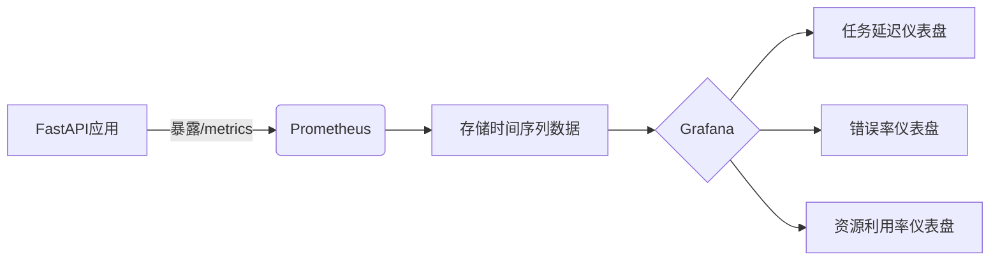

扫描[二维码](https://api2.cmdragon.cn/upload/cmder/20250304_012821924.jpg)
关注或者微信搜一搜：`编程智域 前端至全栈交流与成长`

[发现1000+提升效率与开发的AI工具和实用程序](https://tools.cmdragon.cn/zh/apps?category=ai_chat)：https://tools.cmdragon.cn/

### 1. 生产级任务系统任务性能监控

在现代 Web 应用中，任务性能监控是保障系统稳定性的关键环节。FastAPI 提供了强大的工具来实现对后台任务、异步任务和定时任务的性能监控。

#### 1.1 性能监控架构原理

任务性能监控的本质是通过收集关键指标来评估系统健康状况：



核心监控指标包括：

1. **任务执行时长**：从任务启动到完成的耗时
2. **任务吞吐量**：单位时间内处理的任务数量
3. **错误率**：失败任务占总任务的比例
4. **资源利用率**：CPU、内存、网络等资源消耗

#### 1.2 集成 Prometheus 监控方案

以下是使用 Prometheus 进行任务监控的实现：

```python
# requirements.txt
fastapi == 0.95.2
prometheus_client == 0.17.0
uvicorn == 0.22.0
```

```python
from fastapi import FastAPI, BackgroundTasks
from prometheus_client import Counter, Summary, generate_latest, REGISTRY
import time

app = FastAPI()

# 定义监控指标
TASK_DURATION = Summary(
    'task_processing_seconds',
    'Time spent processing task',
    ['task_type']
)

TASK_COUNT = Counter(
    'tasks_processed_total',
    'Total number of processed tasks',
    ['task_type', 'status']
)


@app.get("/metrics")
async def metrics():
    return generate_latest(REGISTRY)


def background_task(task_id: int):
    """后台任务示例"""
    start_time = time.time()
    task_type = "background"

    try:
        # 模拟任务处理
        time.sleep(0.5)
        # 业务逻辑...

        # 记录成功指标
        TASK_COUNT.labels(task_type=task_type, status="success").inc()
    except Exception:
        # 记录失败指标
        TASK_COUNT.labels(task_type=task_type, status="fail").inc()
    finally:
        # 记录执行时间
        duration = time.time() - start_time
        TASK_DURATION.labels(task_type=task_type).observe(duration)


@app.post("/start-task")
async def start_task(background_tasks: BackgroundTasks):
    """启动后台任务"""
    task_id = 42  # 实际应用中应生成唯一ID
    background_tasks.add_task(background_task, task_id)
    return {"message": "Task started", "task_id": task_id}
```

#### 1.3 关键实现解析

1. **指标定义**：
    - `Summary`：用于统计任务执行时间的分布
    - `Counter`：用于统计任务成功/失败次数
    - 标签系统（label）允许按任务类型分类

2. 监控端点：
    - `/metrics` 端点暴露 Prometheus 格式的指标数据
    - Prometheus 服务器定时拉取这些数据进行存储

3. 任务监控：
    - `start_time` 精确记录任务开始时间
    - `try/finally` 确保异常情况下仍能记录指标
    - 标签系统区分不同任务类型的指标

#### 1.4 可视化方案

配置 Grafana 仪表板可以直观展示监控数据：



典型仪表盘应包含：

1. 任务延迟的 95 百分位线
2. 每分钟任务吞吐量
3. 错误率的趋势变化
4. 资源使用热力图

#### 1.5 应用场景

电商订单处理系统案例：

```python
ORDER_PROCESS_TIME = Summary('order_processing_seconds', 'Order processing time')


def process_order(order: OrderSchema):
    with ORDER_PROCESS_TIME.time():
        validate_order(order)  # 验证订单
        process_payment(order)  # 处理支付
        update_inventory(order)  # 更新库存
        send_confirmation(order)  # 发送确认
```

通过监控可以：

1. 识别支付处理的性能瓶颈
2. 发现库存更新时的异常延迟
3. 预警邮件服务失败率的升高
4. 优化整个订单处理流水线

---

### 课后 Quiz

1. 当任务执行时间监控显示 P99 延迟显著增加时，首先应该检查什么？
    - A) 增加服务器数量
    - B) 检查下游依赖服务
    - C) 降低日志级别
    - D) 忽略短期波动

2. 如何实现对特定类型任务（如"email_send"）的错误率监控？
    - A) 增加全局计数器
    - B) 使用带标签的指标
    - C) 修改日志格式
    - D) 单独部署监控服务

3. 为什么在 finally 块中记录任务持续时间？
    - A) 确保异常情况下也能记录
    - B) 提高代码可读性
    - C) 减少指标采集开销
    - D) 避免竞争条件

4. Prometheus 的 Summary 类型指标最适合监控什么？
    - A) 简单计数
    - B) 固定阈值告警
    - C) 时间分布统计
    - D) 资源消耗总量

<details>
<summary>答案解析</summary>

1. **正确答案：B**  
   P99 延迟增长通常是下游服务性能下降导致的，应优先检查数据库、第三方API等依赖服务。

2. **正确答案：B**  
   使用带标签的计数器：`Counter('tasks_failed', 'Failed tasks', ['task_type'])`  
   然后通过 `labels(task_type="email_send")` 进行标记。

3. **正确答案：A**  
   finally 块保证无论任务是否成功完成，都能准确记录任务持续时间。

4. **正确答案：C**  
   Summary 类型会自动计算分位数（quantiles），非常适合监控响应时间的分布情况。

</details>

---

### 常见报错解决方案

**报错：`[500] PrometheusRegistryError: Duplicate metrics collector registration`**

**原因分析**：

- 应用重启时尝试重复注册同名的指标收集器
- 在开发模式下热重载导致多次初始化

**解决方案**：

1. 单次初始化保证：

```python
if not hasattr(app.state, 'metrics_registered'):
    setup_metrics()
    app.state.metrics_registered = True
```

2. 使用显式重置（测试环境）：

```python
from prometheus_client import REGISTRY

REGISTRY.unregister(REGISTRY._names_to_collectors['your_metric'])
```

3. 指标命名空间隔离：

```python
from prometheus_client import CollectorRegistry

custom_registry = CollectorRegistry()
```

**预防建议**：

- 应用启动时单次初始化监控组件
- 使用单独的注册表管理自定义指标
- 避免在路由处理函数内部创建指标实例

**报错：`[422] ValidationError: Invalid label value`**

**原因分析**：

- 指标标签包含 Prometheus 不允许的字符（如-、空格等）
- 标签值类型不符合要求（必须为字符串）

**解决方案**：

1. 清理标签值：

```python
safe_label = original_label.replace(' ', '_').replace('-', '')
```

2. 使用固定标签集合：

```python
allowed_labels = ['success', 'fail', 'timeout']
if status not in allowed_labels:
    status = 'unknown'
```

3. 添加类型转换：

```python
TASK_COUNT.labels(status=str(task_status)).inc()
```

**最佳实践**：

1. 提前定义所有可能的标签值
2. 对用户输入进行严格校验
3. 日志记录无效标签案例
4. 使用 enum 管理状态标签

余下文章内容请点击跳转至 个人博客页面 或者 扫码关注或者微信搜一搜：`编程智域 前端至全栈交流与成长`
，阅读完整的文章：[如何用Prometheus和FastAPI打造任务监控的“火眼金睛”？](https://blog.cmdragon.cn/posts/e7464e5b4d558ede1a7413fa0a2f96f3/)


<details>
<summary>往期文章归档</summary>

- [如何用APScheduler和FastAPI打造永不宕机的分布式定时任务系统？ - cmdragon's Blog](https://blog.cmdragon.cn/posts/51a0ff47f509fb6238150a96f551b317/)
- [如何在 FastAPI 中玩转 APScheduler，让任务定时自动执行？ - cmdragon's Blog](https://blog.cmdragon.cn/posts/85564dd901c6d9b1a79d320970843caa/)
- [定时任务系统如何让你的Web应用自动完成那些烦人的重复工作？ - cmdragon's Blog](https://blog.cmdragon.cn/posts/2b27950aab76203a1af4e9e3deda8699/)
- [Celery任务监控的魔法背后藏着什么秘密？ - cmdragon's Blog](https://blog.cmdragon.cn/posts/f43335725bb3372ebc774db1b9f28d2d/)
- [如何让Celery任务像VIP客户一样享受优先待遇？ - cmdragon's Blog](https://blog.cmdragon.cn/posts/c24491a7ac7f7c5e9cf77596ebb27c51/)
- [如何让你的FastAPI Celery Worker在压力下优雅起舞？ - cmdragon's Blog](https://blog.cmdragon.cn/posts/c3129f4b424d2ed2330484b82ec31875/)
- [FastAPI与Celery的完美邂逅，如何让异步任务飞起来？ - cmdragon's Blog](https://blog.cmdragon.cn/posts/b79c2c1805fe9b1ea28326b5b8f3b709/)
- [FastAPI消息持久化与ACK机制：如何确保你的任务永不迷路？ - cmdragon's Blog](https://blog.cmdragon.cn/posts/13a59846aaab71b44ab6f3dadc5b5ec7/)
- [FastAPI的BackgroundTasks如何玩转生产者-消费者模式？ - cmdragon's Blog](https://blog.cmdragon.cn/posts/1549a6bd7e47e7006e7ba8f52bcfe8eb/)
- [BackgroundTasks 还是 RabbitMQ？你的异步任务到底该选谁？ - cmdragon's Blog](https://blog.cmdragon.cn/posts/d26fdc150ff9dd70c7482381ff4c77c4/)
- [BackgroundTasks与Celery：谁才是异步任务的终极赢家？ - cmdragon's Blog](https://blog.cmdragon.cn/posts/792cac4ce6eb96b5001da15b0d52ef83/)
- [如何在 FastAPI 中优雅处理后台任务异常并实现智能重试？ - cmdragon's Blog](https://blog.cmdragon.cn/posts/d5c1d2efbaf6fe4c9e13acc6be6d929a/)
- [BackgroundTasks 如何巧妙驾驭多任务并发？ - cmdragon's Blog](https://blog.cmdragon.cn/posts/8661dc74944bd6fb28092e90d4060161/)
- [如何让FastAPI后台任务像多米诺骨牌一样井然有序地执行？ - cmdragon's Blog](https://blog.cmdragon.cn/posts/7693d3430a6256c2abefc1e4aba21a4a/)
- [FastAPI后台任务：是时候让你的代码飞起来了吗？ - cmdragon's Blog](https://blog.cmdragon.cn/posts/6145d88d5154d5cd38cee7ddc2d46e1d/)
- [FastAPI后台任务为何能让邮件发送如此丝滑？ - cmdragon's Blog](https://blog.cmdragon.cn/posts/19241679a1852122f740391cbdc21bae/)
- [FastAPI的请求-响应周期为何需要后台任务分离？ - cmdragon's Blog](https://blog.cmdragon.cn/posts/c7b54d6b3b6b5041654e69e5610bf3b9/)
- [如何在FastAPI中让后台任务既高效又不会让你的应用崩溃？ - cmdragon's Blog](https://blog.cmdragon.cn/posts/5ad8d0a4c8f2d05e9c1a42d828aad7b3/)
- [FastAPI后台任务：异步魔法还是同步噩梦？ - cmdragon's Blog](https://blog.cmdragon.cn/posts/6a69eca9fd14ba8f6fa41502c5014edd/)
- [如何在FastAPI中玩转Schema版本管理和灰度发布？ - cmdragon's Blog](https://blog.cmdragon.cn/posts/6d9d20cd8d8528da4193f13aaf98575c/)
- [FastAPI的查询白名单和安全沙箱机制如何确保你的API坚不可摧？ - cmdragon's Blog](https://blog.cmdragon.cn/posts/ca141239cfc5c0d510960acd266de9cd/)
- [如何在 FastAPI 中玩转 GraphQL 性能监控与 APM 集成？ - cmdragon's Blog](https://blog.cmdragon.cn/posts/52fe9ea73b0e26de308ae0e539df21d2/)
- [如何在 FastAPI 中玩转 GraphQL 和 WebSocket 的实时数据推送魔法？ - cmdragon's Blog](https://blog.cmdragon.cn/posts/ae484cf6bcf3f44fd8392a8272e57db4/)
- [如何在FastAPI中玩转GraphQL联邦架构，让数据源手拉手跳探戈？ - cmdragon's Blog](https://blog.cmdragon.cn/posts/9b9086ff5d8464b0810cfb55f7768513/)
- [GraphQL批量查询优化：DataLoader如何让数据库访问速度飞起来？ - cmdragon's Blog](https://blog.cmdragon.cn/posts/0e236dbe717bde52bda290e89f4f6eca/)
- [如何在FastAPI中整合GraphQL的复杂度与限流？ - cmdragon's Blog](https://blog.cmdragon.cn/posts/ace8bb3f01589994f51d748ab5c73652/)
- [GraphQL错误处理为何让你又爱又恨？FastAPI中间件能否成为你的救星？ - cmdragon's Blog](https://blog.cmdragon.cn/posts/a28d5c1b32feadb18b406a849455dfe5/)
- [FastAPI遇上GraphQL：异步解析器如何让API性能飙升？ - cmdragon's Blog](https://blog.cmdragon.cn/posts/35fced261e8ff834e68e07c93902cc13/)
- [GraphQL的N+1问题如何被DataLoader巧妙化解？ - cmdragon's Blog](https://blog.cmdragon.cn/posts/72629304782a121fbf89b151c436f9aa/)
- [FastAPI与GraphQL的完美邂逅：如何打造高效API？ - cmdragon's Blog](https://blog.cmdragon.cn/posts/fb5c5c7b00bbe57b3a5346b8ee5bc289/)
- [GraphQL类型系统如何让FastAPI开发更高效？ - cmdragon's Blog](https://blog.cmdragon.cn/posts/31c152e531e1cbe5b5cfe15e7ff053c9/)
- [REST和GraphQL究竟谁才是API设计的终极赢家？ - cmdragon's Blog](https://blog.cmdragon.cn/posts/218ad2370eab6197f42fdc9c52f0fc19/)
- [IoT设备的OTA升级是如何通过MQTT协议实现无缝对接的？ - cmdragon's Blog](https://blog.cmdragon.cn/posts/071e9a3b9792beea63f134f5ad28df67/)
- [如何在FastAPI中玩转STOMP协议升级，让你的消息传递更高效？ - cmdragon's Blog](https://blog.cmdragon.cn/posts/16744b2f460346805c45314bc0c6f751/)
- [如何用WebSocket打造毫秒级实时协作系统？ - cmdragon's Blog](https://blog.cmdragon.cn/posts/da5b64cb0ded23e4d5b1f19ffd5ac53d/)
- [如何让你的WebSocket连接既安全又高效？](https://blog.cmdragon.cn/posts/eb598d50b76ea1823746ab7cdf49ce05/)
- [如何让多客户端会话管理不再成为你的技术噩梦？ - cmdragon's Blog](https://blog.cmdragon.cn/posts/08ba771dbb2eec087c4bc6dc584113c5/)

</details>


<details>
<summary>免费好用的热门在线工具</summary>

- [ASCII字符画生成器 - 应用商店 | By cmdragon](https://tools.cmdragon.cn/zh/apps/ascii-art-generator)
- [JSON Web Tokens 工具 - 应用商店 | By cmdragon](https://tools.cmdragon.cn/zh/apps/jwt-tool)
- [Bcrypt 密码工具 - 应用商店 | By cmdragon](https://tools.cmdragon.cn/zh/apps/bcrypt-tool)
- [GIF 合成器 - 应用商店 | By cmdragon](https://tools.cmdragon.cn/zh/apps/gif-composer)
- [GIF 分解器 - 应用商店 | By cmdragon](https://tools.cmdragon.cn/zh/apps/gif-decomposer)
- [文本隐写术 - 应用商店 | By cmdragon](https://tools.cmdragon.cn/zh/apps/text-steganography)
- [CMDragon 在线工具 - 高级AI工具箱与开发者套件 | 免费好用的在线工具](https://tools.cmdragon.cn/zh)
- [应用商店 - 发现1000+提升效率与开发的AI工具和实用程序 | 免费好用的在线工具](https://tools.cmdragon.cn/zh/apps?category=trending)
- [CMDragon 更新日志 - 最新更新、功能与改进 | 免费好用的在线工具](https://tools.cmdragon.cn/zh/changelog)
- [支持我们 - 成为赞助者 | 免费好用的在线工具](https://tools.cmdragon.cn/zh/sponsor)
- [AI文本生成图像 - 应用商店 | 免费好用的在线工具](https://tools.cmdragon.cn/zh/apps/text-to-image-ai)
- [临时邮箱 - 应用商店 | 免费好用的在线工具](https://tools.cmdragon.cn/zh/apps/temp-email)
- [二维码解析器 - 应用商店 | 免费好用的在线工具](https://tools.cmdragon.cn/zh/apps/qrcode-parser)
- [文本转思维导图 - 应用商店 | 免费好用的在线工具](https://tools.cmdragon.cn/zh/apps/text-to-mindmap)
- [正则表达式可视化工具 - 应用商店 | 免费好用的在线工具](https://tools.cmdragon.cn/zh/apps/regex-visualizer)
- [文件隐写工具 - 应用商店 | 免费好用的在线工具](https://tools.cmdragon.cn/zh/apps/steganography-tool)
- [IPTV 频道探索器 - 应用商店 | 免费好用的在线工具](https://tools.cmdragon.cn/zh/apps/iptv-explorer)
- [快传 - 应用商店 | 免费好用的在线工具](https://tools.cmdragon.cn/zh/apps/snapdrop)
- [随机抽奖工具 - 应用商店 | 免费好用的在线工具](https://tools.cmdragon.cn/zh/apps/lucky-draw)
- [动漫场景查找器 - 应用商店 | 免费好用的在线工具](https://tools.cmdragon.cn/zh/apps/anime-scene-finder)
- [时间工具箱 - 应用商店 | 免费好用的在线工具](https://tools.cmdragon.cn/zh/apps/time-toolkit)
- [网速测试 - 应用商店 | 免费好用的在线工具](https://tools.cmdragon.cn/zh/apps/speed-test)
- [AI 智能抠图工具 - 应用商店 | 免费好用的在线工具](https://tools.cmdragon.cn/zh/apps/background-remover)
- [背景替换工具 - 应用商店 | 免费好用的在线工具](https://tools.cmdragon.cn/zh/apps/background-replacer)
- [艺术二维码生成器 - 应用商店 | 免费好用的在线工具](https://tools.cmdragon.cn/zh/apps/artistic-qrcode)
- [Open Graph 元标签生成器 - 应用商店 | 免费好用的在线工具](https://tools.cmdragon.cn/zh/apps/open-graph-generator)
- [图像对比工具 - 应用商店 | 免费好用的在线工具](https://tools.cmdragon.cn/zh/apps/image-comparison)
- [图片压缩专业版 - 应用商店 | 免费好用的在线工具](https://tools.cmdragon.cn/zh/apps/image-compressor)
- [密码生成器 - 应用商店 | 免费好用的在线工具](https://tools.cmdragon.cn/zh/apps/password-generator)
- [SVG优化器 - 应用商店 | 免费好用的在线工具](https://tools.cmdragon.cn/zh/apps/svg-optimizer)
- [调色板生成器 - 应用商店 | 免费好用的在线工具](https://tools.cmdragon.cn/zh/apps/color-palette)
- [在线节拍器 - 应用商店 | 免费好用的在线工具](https://tools.cmdragon.cn/zh/apps/online-metronome)
- [IP归属地查询 - 应用商店 | 免费好用的在线工具](https://tools.cmdragon.cn/zh/apps/ip-geolocation)
- [CSS网格布局生成器 - 应用商店 | 免费好用的在线工具](https://tools.cmdragon.cn/zh/apps/css-grid-layout)
- [邮箱验证工具 - 应用商店 | 免费好用的在线工具](https://tools.cmdragon.cn/zh/apps/email-validator)
- [书法练习字帖 - 应用商店 | 免费好用的在线工具](https://tools.cmdragon.cn/zh/apps/calligraphy-practice)
- [金融计算器套件 - 应用商店 | 免费好用的在线工具](https://tools.cmdragon.cn/zh/apps/finance-calculator-suite)
- [中国亲戚关系计算器 - 应用商店 | 免费好用的在线工具](https://tools.cmdragon.cn/zh/apps/chinese-kinship-calculator)
- [Protocol Buffer 工具箱 - 应用商店 | 免费好用的在线工具](https://tools.cmdragon.cn/zh/apps/protobuf-toolkit)
- [IP归属地查询 - 应用商店 | 免费好用的在线工具](https://tools.cmdragon.cn/zh/apps/ip-geolocation)
- [图片无损放大 - 应用商店 | 免费好用的在线工具](https://tools.cmdragon.cn/zh/apps/image-upscaler)
- [文本比较工具 - 应用商店 | 免费好用的在线工具](https://tools.cmdragon.cn/zh/apps/text-compare)
- [IP批量查询工具 - 应用商店 | 免费好用的在线工具](https://tools.cmdragon.cn/zh/apps/ip-batch-lookup)
- [域名查询工具 - 应用商店 | 免费好用的在线工具](https://tools.cmdragon.cn/zh/apps/domain-finder)
- [DNS工具箱 - 应用商店 | 免费好用的在线工具](https://tools.cmdragon.cn/zh/apps/dns-toolkit)
- [网站图标生成器 - 应用商店 | 免费好用的在线工具](https://tools.cmdragon.cn/zh/apps/favicon-generator)
- [XML Sitemap](https://tools.cmdragon.cn/sitemap_index.xml)

</details>

