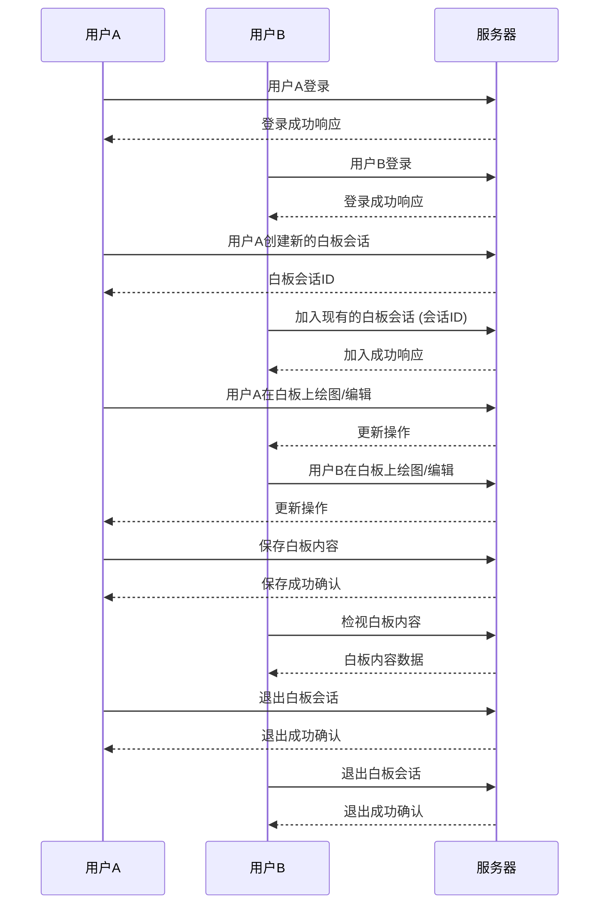
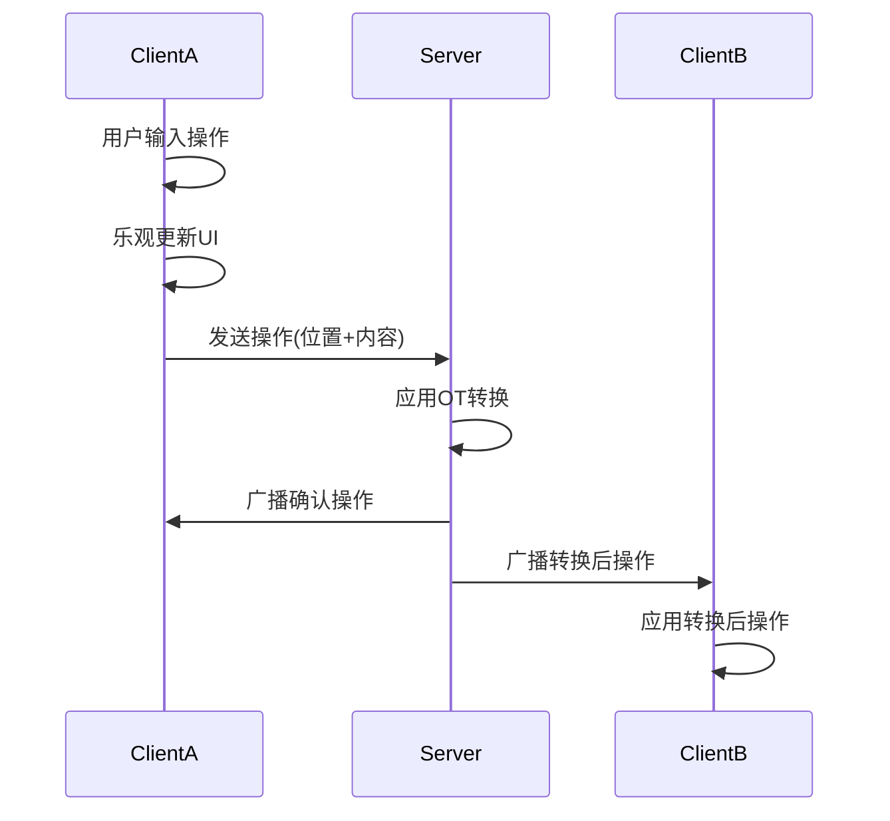

扫描[二维码](https://api2.cmdragon.cn/upload/cmder/20250304_012821924.jpg)
关注或者微信搜一搜：`编程智域 前端至全栈交流与成长`

[发现1000+提升效率与开发的AI工具和实用程序](https://tools.cmdragon.cn/zh/apps?category=ai_chat)：https://tools.cmdragon.cn/

## 第六章：全栈项目实战示例：实时协作系统

### 一、需求分析：实时白板/协同编辑场景

实时协作系统需要实现多用户同时操作同一文档/白板，并实时同步所有变更。核心需求包括：

1. **毫秒级延迟**：用户操作需在300ms内同步给所有参与者
2. **操作一致性**：保证最终所有客户端呈现相同内容
3. **冲突处理**：解决多用户同时修改同一区域的问题
4. **状态恢复**：断线重连后自动同步最新状态



### 二、后端WebSocket服务搭建

**依赖安装**：

```bash
pip install fastapi==0.104.0 websockets==12.0 uvicorn==0.23.2 pydantic==2.5.2
```

**核心代码实现**：

```python
import asyncio
import logging
from typing import List, Dict

from fastapi import FastAPI, WebSocket
from pydantic import BaseModel

app = FastAPI()
logger = logging.getLogger("uvicorn.error")


class Operation(BaseModel):
    type: str  # "insert" or "delete"
    position: int
    content: str = ""  # 插入内容
    length: int = 1  # 删除长度
    client_id: str = ""  # 客户端标识
    version: int = 0  # 操作版本号


# OT转换引擎（示例）
class OTEngine:
    @staticmethod
    def transform(op1: Operation, op2: Operation) -> Operation:
        """操作转换核心算法"""
        # 插入 vs 插入
        if op1.type == "insert" and op2.type == "insert":
            if op1.position < op2.position:
                return Operation(**{**op2.dict(), "position": op2.position + len(op1.content)})
            elif op1.position > op2.position:
                return op2
            else:  # 相同位置按客户端ID排序
                return op2 if op1.client_id < op2.client_id else Operation(
                    **{**op2.dict(), "position": op2.position + len(op1.content)})

        # 插入 vs 删除
        elif op1.type == "insert" and op2.type == "delete":
            if op1.position <= op2.position:
                return Operation(**{**op2.dict(), "position": op2.position + len(op1.content)})
            else:
                return Operation(**{**op2.dict(), "position": op2.position})

        # 删除 vs 插入
        elif op1.type == "delete" and op2.type == "insert":
            if op1.position < op2.position:
                return Operation(**{**op2.dict(), "position": max(op2.position - op1.length, 0)})
            else:
                return op2

        # 删除 vs 删除
        else:
            if op1.position < op2.position:
                return Operation(**{**op2.dict(), "position": max(op2.position - op1.length, 0)})
            elif op1.position > op2.position:
                return Operation(**{**op2.dict(), "position": op2.position})
            else:  # 相同位置取范围更大的删除
                return op2 if op1.length >= op2.length else Operation(**{**op2.dict(), "length": op1.length})


# 协同编辑房间管理器
class CollaborationRoom:
    def __init__(self, room_id: str):
        self.room_id = room_id
        self.connections = set()  # 实际使用redis实现, 这里使用set模拟
        self.document = ""
        self.version = 0
        self.pending_ops: List[Operation] = []
        self.lock = asyncio.Lock()
        self.client_states: Dict[str, int] = {}  # 客户端最后确认版本

    async def add_connection(self, websocket: WebSocket, client_id: str):
        async with self.lock:
            self.connections.add(websocket)
            self.client_states[client_id] = self.version
            # 发送初始状态
            await websocket.send_json({
                "type": "snapshot",
                "document": self.document,
                "version": self.version
            })

    async def remove_connection(self, websocket: WebSocket, client_id: str):
        async with self.lock:
            self.connections.discard(websocket)
            if client_id in self.client_states:
                del self.client_states[client_id]

    async def apply_operation(self, operation: Operation):
        """应用操作转换并更新文档"""
        async with self.lock:
            # 转换所有待处理操作
            transformed_op = operation
            for pending in self.pending_ops:
                transformed_op = OTEngine.transform(pending, transformed_op)

            # 应用转换后的操作
            if transformed_op.type == "insert":
                self.document = (self.document[:transformed_op.position] +
                                 transformed_op.content +
                                 self.document[transformed_op.position:])
            elif transformed_op.type == "delete":
                start = transformed_op.position
                end = min(start + transformed_op.length, len(self.document))
                self.document = self.document[:start] + self.document[end:]

            # 更新状态
            self.version += 1
            self.pending_ops.append(transformed_op)

            # 广播转换后的操作
            broadcast_tasks = []
            for conn in self.connections:
                try:
                    broadcast_tasks.append(conn.send_json({
                        "type": "operation",
                        "operation": transformed_op.dict(),
                        "document": self.document,
                        "version": self.version
                    }))
                except:
                    pass
            await asyncio.gather(*broadcast_tasks, return_exceptions=True)

            # 清除已处理的操作
            min_client_version = min(self.client_states.values(), default=self.version)
            self.pending_ops = [op for op in self.pending_ops if op.version >= min_client_version]


# 全局房间管理
room_manager: Dict[str, CollaborationRoom] = {}  # 实际使用redis实现, 这里使用字典模拟
global_lock = asyncio.Lock()


@app.websocket("/ws/{room_id}/{client_id}")
async def websocket_endpoint(websocket: WebSocket, room_id: str, client_id: str):
    await websocket.accept()

    # 获取或创建房间
    async with global_lock:
        if room_id not in room_manager:
            room_manager[room_id] = CollaborationRoom(room_id)
        room = room_manager[room_id]

    # 加入房间
    await room.add_connection(websocket, client_id)
    logger.info(f"Client {client_id} joined room {room_id}")

    try:
        while True:
            data = await websocket.receive_json()
            op = Operation(**data)
            op.client_id = client_id

            # 应用操作转换
            await room.apply_operation(op)

    except Exception as e:
        logger.error(f"Error in room {room_id}: {str(e)}")
    finally:
        # 离开房间
        await room.remove_connection(websocket, client_id)
        logger.info(f"Client {client_id} left room {room_id}")

        # 清理空房间
        async with global_lock:
            if not room.connections:
                del room_manager[room_id]
                logger.info(f"Room {room_id} closed")
```

**关键机制**：

1. 使用`WebSocket`协议替代HTTP长轮询
2. 维护活动连接池`active_connections`
3. 通过Pydantic模型验证操作格式
4. 广播模式实现实时同步

**优化技巧**：

1. 使用`requestAnimationFrame`合并高频操作
2. 添加操作版本号解决时序问题
3. 实现本地缓存防止数据丢失
4. 添加心跳机制检测连接状态

### 三、前端Vue.js连接实现

**组件核心代码**：

```vue

<template>
  <div class="collaborative-editor">
    <div class="toolbar">
      <div class="room-info">房间: {{ roomId }} | 用户: {{ clientId }}</div>
      <div :class="connectionStatus" class="status">{{ statusText }}</div>
    </div>

    <div class="editor-container">
      <div
          ref="editor"
          class="editor"
          contenteditable="true"
          @input="handleInput"
          @keydown="handleKeyDown"
          @mousedown="saveCaretPosition"
          @mouseup="saveCaretPosition"
          @paste="handlePaste"
          @touchend="saveCaretPosition"
      ></div>
    </div>

    <div class="participants">
      <div class="title">在线用户 ({{ users.length }})</div>
      <div v-for="user in users" :key="user" class="user">
        <span :style="{ backgroundColor: getUserColor(user) }" class="indicator"></span>
        {{ user }}
      </div>
    </div>
  </div>
</template>

<script>
  import {onMounted, onUnmounted, ref} from 'vue';

  export default {
    props: {
      roomId: String,
      clientId: String
    },
    setup(props) {
      const editor = ref(null);
      const document = ref('');
      const version = ref(0);
      const users = ref([]);
      const connectionStatus = ref('connecting');
      const statusText = ref('连接中...');
      const caretPosition = ref(0);
      const pendingOperations = ref([]);
      const ws = ref(null);
      const userColors = ref({});

      // 初始化WebSocket连接
      const initWebSocket = () => {
        const protocol = window.location.protocol === 'https:' ? 'wss:' : 'ws:';
        const host = window.location.host;
        ws.value = new WebSocket(`${protocol}//${host}/ws/${props.roomId}/${props.clientId}`);

        ws.value.onopen = () => {
          connectionStatus.value = 'connected';
          statusText.value = '已连接';
        };

        ws.value.onmessage = (event) => {
          const data = JSON.parse(event.data);
          handleServerMessage(data);
        };

        ws.value.onerror = (error) => {
          console.error('WebSocket error:', error);
          connectionStatus.value = 'error';
          statusText.value = '连接错误';
        };

        ws.value.onclose = () => {
          connectionStatus.value = 'disconnected';
          statusText.value = '已断开';
        };
      };

      // 处理服务器消息
      const handleServerMessage = (data) => {
        switch (data.type) {
          case 'snapshot':
            document.value = data.document;
            version.value = data.version;
            updateEditorContent();
            break;

          case 'operation':
            applyRemoteOperation(data.operation);
            version.value = data.version;
            break;

          case 'participants':
            users.value = data.users;
            assignUserColors(data.users);
            break;

          default:
            console.warn('Unknown message type:', data.type);
        }
      };

      // 应用远程操作
      const applyRemoteOperation = (operation) => {
        // 跳过自己发送的操作（已乐观更新）
        if (operation.client_id === props.clientId) {
          // 移除已确认的本地操作
          pendingOperations.value = pendingOperations.value.filter(
              op => op.client_id !== operation.client_id
          );
          return;
        }

        // 应用操作到文档
        if (operation.type === 'insert') {
          document.value =
              document.value.slice(0, operation.position) +
              operation.content +
              document.value.slice(operation.position);
        } else if (operation.type === 'delete') {
          document.value =
              document.value.slice(0, operation.position) +
              document.value.slice(operation.position + operation.length);
        }

        // 更新编辑器内容
        updateEditorContent();
      };

      // 保存光标位置
      const saveCaretPosition = () => {
        const selection = window.getSelection();
        if (selection.rangeCount > 0) {
          const range = selection.getRangeAt(0);
          const preCaretRange = range.cloneRange();
          preCaretRange.selectNodeContents(editor.value);
          preCaretRange.setEnd(range.endContainer, range.endOffset);
          caretPosition.value = preCaretRange.toString().length;
        }
      };

      // 恢复光标位置
      const restoreCaretPosition = () => {
        const selection = window.getSelection();
        selection.removeAllRanges();

        const range = document.createRange();
        range.setStart(editor.value, 0);

        let pos = 0;
        let found = false;

        const findNode = (node) => {
          if (node.nodeType === Node.TEXT_NODE) {
            const nextPos = pos + node.length;

            if (!found && nextPos >= caretPosition.value) {
              const offset = caretPosition.value - pos;
              range.setStart(node, offset);
              range.setEnd(node, offset);
              found = true;
            }

            pos = nextPos;
          } else {
            for (let i = 0; i < node.childNodes.length && !found; i++) {
              findNode(node.childNodes[i]);
            }
          }
        };

        findNode(editor.value);
        selection.addRange(range);
      };

      // 更新编辑器内容
      const updateEditorContent = () => {
        // 保存当前滚动位置
        const scrollTop = editor.value.scrollTop;

        // 更新内容
        editor.value.innerHTML = document.value
            .replace(/\n/g, '<br>')
            .replace(/ /g, '&nbsp;');

        // 恢复滚动位置
        editor.value.scrollTop = scrollTop;

        // 恢复光标位置
        if (document.activeElement === editor.value) {
          restoreCaretPosition();
        }
      };

      // 处理输入事件
      const handleInput = (event) => {
        const oldDocument = document.value;
        const newDocument = getEditorText();

        // 计算变化
        const diff = calculateDiff(oldDocument, newDocument);

        if (diff) {
          // 乐观更新本地文档
          document.value = newDocument;

          // 创建操作对象
          const operation = {
            type: diff.type,
            position: diff.position,
            client_id: props.clientId,
            version: version.value
          };

          if (diff.type === 'insert') {
            operation.content = diff.text;
          } else {
            operation.length = diff.length;
          }

          // 添加到待处理队列
          pendingOperations.value.push(operation);

          // 发送到服务器
          ws.value.send(JSON.stringify(operation));
        }
      };

      // 获取编辑器纯文本内容
      const getEditorText = () => {
        return editor.value.innerText
            .replace(/\u00A0/g, ' ')  // 替换 &nbsp;
            .replace(/\u200B/g, '');  // 移除零宽空格
      };

      // 计算文本差异
      const calculateDiff = (oldText, newText) => {
        let start = 0;
        const oldEnd = oldText.length;
        const newEnd = newText.length;

        // 查找开始不同的位置
        while (start < oldEnd && start < newEnd && oldText[start] === newText[start]) {
          start++;
        }

        // 查找结束不同的位置
        let oldEndIndex = oldEnd;
        let newEndIndex = newEnd;
        while (
            oldEndIndex > start &&
            newEndIndex > start &&
            oldText[oldEndIndex - 1] === newText[newEndIndex - 1]
            ) {
          oldEndIndex--;
          newEndIndex--;
        }

        // 判断操作类型
        const insertedLength = newEndIndex - start;
        const deletedLength = oldEndIndex - start;

        if (insertedLength > 0 && deletedLength === 0) {
          // 插入操作
          return {
            type: 'insert',
            position: start,
            text: newText.substring(start, newEndIndex)
          };
        } else if (deletedLength > 0 && insertedLength === 0) {
          // 删除操作
          return {
            type: 'delete',
            position: start,
            length: deletedLength
          };
        } else if (insertedLength > 0 && deletedLength > 0) {
          // 替换操作（分解为删除+插入）
          // 先发送删除操作
          ws.value.send(JSON.stringify({
            type: 'delete',
            position: start,
            length: deletedLength,
            client_id: props.clientId,
            version: version.value
          }));

          // 再发送插入操作
          return {
            type: 'insert',
            position: start,
            text: newText.substring(start, newEndIndex)
          };
        }

        return null;
      };

      // 处理删除键
      const handleKeyDown = (event) => {
        if (event.key === 'Backspace' || event.key === 'Delete') {
          saveCaretPosition();
        }
      };

      // 处理粘贴事件
      const handlePaste = (event) => {
        event.preventDefault();
        const text = event.clipboardData.getData('text/plain');

        if (text) {
          const selection = window.getSelection();
          if (selection.rangeCount > 0) {
            const range = selection.getRangeAt(0);
            range.deleteContents();

            const textNode = document.createTextNode(text);
            range.insertNode(textNode);

            // 移动光标到插入内容后
            range.setStart(textNode, text.length);
            range.setEnd(textNode, text.length);
            selection.removeAllRanges();
            selection.addRange(range);

            // 触发输入事件
            const inputEvent = new Event('input', {bubbles: true});
            editor.value.dispatchEvent(inputEvent);
          }
        }
      };

      // 分配用户颜色
      const assignUserColors = (userList) => {
        const colors = [
          '#FF6B6B', '#4ECDC4', '#FFD166', '#6A0572',
          '#1A535C', '#FF9F1C', '#2EC4B6', '#E71D36'
        ];

        userList.forEach(user => {
          if (!userColors.value[user]) {
            // 简单哈希算法分配颜色
            const hash = Array.from(user).reduce(
                (acc, char) => acc + char.charCodeAt(0),
                0
            );
            userColors.value[user] = colors[hash % colors.length];
          }
        });
      };

      // 获取用户颜色
      const getUserColor = (userId) => {
        return userColors.value[userId] || '#999';
      };

      // 初始化编辑器
      onMounted(() => {
        initWebSocket();
        editor.value.focus();
      });

      // 清理资源
      onUnmounted(() => {
        if (ws.value) {
          ws.value.close();
        }
      });

      return {
        editor,
        document,
        version,
        users,
        connectionStatus,
        statusText,
        handleInput,
        handleKeyDown,
        handlePaste,
        saveCaretPosition,
        getUserColor
      };
    }
  };
</script>

<style scoped>
  .collaborative-editor {
    display: flex;
    flex-direction: column;
    height: 100vh;
    font-family: 'Segoe UI', Tahoma, Geneva, Verdana, sans-serif;
  }

  .toolbar {
    display: flex;
    justify-content: space-between;
    padding: 12px 16px;
    background: #2c3e50;
    color: white;
    box-shadow: 0 2px 10px rgba(0, 0, 0, 0.1);
  }

  .room-info {
    font-weight: 600;
  }

  .status {
    padding: 2px 8px;
    border-radius: 12px;
    font-size: 0.85rem;
  }

  .status.connecting {
    background: #f39c12;
  }

  .status.connected {
    background: #27ae60;
  }

  .status.disconnected {
    background: #7f8c8d;
  }

  .status.error {
    background: #e74c3c;
  }

  .editor-container {
    flex: 1;
    overflow: auto;
    padding: 20px;
    background: #f8f9fa;
  }

  .editor {
    min-height: 100%;
    padding: 20px;
    background: white;
    border-radius: 8px;
    box-shadow: 0 2px 10px rgba(0, 0, 0, 0.05);
    outline: none;
    line-height: 1.6;
    font-size: 16px;
    white-space: pre-wrap;
  }

  .participants {
    padding: 16px;
    background: white;
    border-top: 1px solid #eee;
  }

  .title {
    font-weight: 600;
    margin-bottom: 12px;
    color: #2c3e50;
  }

  .user {
    display: flex;
    align-items: center;
    padding: 8px 0;
    border-bottom: 1px solid #f0f0f0;
  }

  .user:last-child {
    border-bottom: none;
  }

  .indicator {
    display: inline-block;
    width: 12px;
    height: 12px;
    border-radius: 50%;
    margin-right: 10px;
  }
</style>

```



### 四、消息同步策略与冲突解决

1. **状态同步机制**：
   ```mermaid
   sequenceDiagram
       participant ClientA
       participant Server
       participant ClientB
       
       ClientA->>Server: 发送操作OP_A(位置P)
       Server->>Server: 转换操作：OP_A' = OT(OP_A, 待处理操作)
       Server->>Server: 更新文档状态
       Server->>ClientA: 广播转换后的OP_A'
       Server->>ClientB: 广播转换后的OP_A'
       ClientB->>ClientB: 应用OP_A'更新本地文档
       ClientB->>Server: 发送新操作OP_B
   ```

2. **冲突解决流程**：
    - 客户端发送操作时携带当前位置和版本
    - 服务端对并发操作进行转换排序
    - 转换后操作广播给所有客户端
    - 客户端收到操作后无条件应用

3. **消息协议设计**：
   ```json
   // 快照消息（初始同步）
   {
     "type": "snapshot",
     "document": "当前文本",
     "version": 15
   }
   
   // 操作消息
   {
     "type": "operation",
     "operation": {
        "type": "insert",
        "position": 5,
        "content": "hello",
        "client_id": "user1",
        "version": 16
     },
     "document": "更新后文本",
     "version": 16
   }

**同步策略对比**：

| 策略       | 优点     | 缺点       |
|----------|--------|----------|
| 最后写入优先   | 实现简单   | 可能丢失用户操作 |
| 操作转换(OT) | 精确解决冲突 | 算法复杂度高   |
| CRDT     | 无需中心协调 | 内存消耗较大   |

### 五、压力测试与部署方案

**压力测试命令**：

```bash
pip install websocket-client
python -m websockets ws://localhost:8000/ws/room1 -c 1000 -m "测试消息"
```

**部署架构**：

```
客户端 → Nginx → FastAPI (Uvicorn) → Redis Cluster
```

**Nginx配置要点**：

```nginx
http {
    map $http_upgrade $connection_upgrade {
        default upgrade;
        '' close;
    }

    server {
        location /ws/ {
            proxy_pass http://backend;
            proxy_http_version 1.1;
            proxy_set_header Upgrade $http_upgrade;
            proxy_set_header Connection $connection_upgrade;
        }
    }
}
```

---

### 课后 Quiz

**Q1：当两个用户同时在第5个字符位置插入不同内容时，如何保证最终一致性？**

**答案**：采用操作转换算法，根据操作逻辑时间戳调整插入位置。例如用户A插入"X"，用户B插入"Y"，最终在第5位显示"YX"或"XY"
，取决于操作到达服务器的顺序。

**Q2：WebSocket连接频繁断开可能是什么原因？**

**解决方案**：

1. 检查防火墙设置是否允许WS协议
2. 配置合理的心跳间隔（建议30秒）
3. 增加Nginx的超时设置：
   ```nginx
   proxy_read_timeout 3600s;
   proxy_send_timeout 3600s;
   ```

---

### 常见报错处理

**错误1：403 Forbidden**

- **原因**：跨域请求被阻止
- **解决**：添加CORS中间件
  ```python
  from fastapi.middleware.cors import CORSMiddleware

  app.add_middleware(
      CORSMiddleware,
      allow_origins=["*"],
      allow_credentials=True,
      allow_methods=["*"],
      allow_headers=["*"],
  )
  ```

**错误2：1006 Connection Closed Abnormally**

- **原因**：客户端未正确处理断开事件
- **解决**：添加重连机制
  ```javascript
  function connect() {
    const ws = new WebSocket(url)
    ws.onclose = () => setTimeout(connect, 1000)
  }
  ```

---

通过本文的实践，开发者可以掌握实时协作系统的核心实现技术。建议在开发过程中使用`wireshark`
工具监控WebSocket流量，并配合`Chrome DevTools`的Performance面板进行前端性能优化。

余下文章内容请点击跳转至 个人博客页面 或者 扫码关注或者微信搜一搜：`编程智域 前端至全栈交流与成长`
，阅读完整的文章：[如何用WebSocket打造毫秒级实时协作系统？](https://blog.cmdragon.cn/posts/da5b64cb0ded23e4d5b1f19ffd5ac53d/)

## 往期文章归档：

- [如何让你的WebSocket连接既安全又高效？](https://blog.cmdragon.cn/posts/eb598d50b76ea1823746ab7cdf49ce05/)
- [如何让多客户端会话管理不再成为你的技术噩梦？ - cmdragon's Blog](https://blog.cmdragon.cn/posts/08ba771dbb2eec087c4bc6dc584113c5/)
- [如何在FastAPI中玩转WebSocket消息处理？](https://blog.cmdragon.cn/posts/fbf7d6843e430133547057254deb2dfb/)
- [如何在FastAPI中玩转WebSocket，让实时通信不再烦恼？ - cmdragon's Blog](https://blog.cmdragon.cn/posts/0faebb0f6c2b1bde4ba75869f4f67b76/)
- [WebSocket与HTTP协议究竟有何不同？FastAPI如何让长连接变得如此简单？ - cmdragon's Blog](https://blog.cmdragon.cn/posts/903448c85701a6a747fc9a4417e2bdc8/)
- [FastAPI如何玩转安全防护，让黑客望而却步？](https://blog.cmdragon.cn/posts/c1314c623211c9269f36053179a53d5c/)
- [如何用三层防护体系打造坚不可摧的 API 安全堡垒？ - cmdragon's Blog](https://blog.cmdragon.cn/posts/0bbb4a455ef36bf6f81ac97189586fda/#%E4%B8%80jwt-%E8%AE%A4%E8%AF%81%E8%81%94%E8%B0%83%E6%96%B9%E6%A1%88)
- [FastAPI安全加固：密钥轮换、限流策略与安全头部如何实现三重防护？ - cmdragon's Blog](https://blog.cmdragon.cn/posts/f96ba438de34dc197fd2598f91ae133d/)
- [如何在FastAPI中巧妙玩转数据脱敏，让敏感信息安全无忧？ - cmdragon's Blog](https://blog.cmdragon.cn/posts/045021f8831a03bcdf71e44cb793baf4/)
- [RBAC权限模型如何让API访问控制既安全又灵活？ - cmdragon's Blog](https://blog.cmdragon.cn/posts/9f01e838545ae8d34016c759ef461423/)
- [FastAPI中的敏感数据如何在不泄露的情况下翩翩起舞？](https://blog.cmdragon.cn/posts/88e8615e4c961e7a4f0ef31c0e41cb0b/)
- [FastAPI安全认证的终极秘籍：OAuth2与JWT如何完美融合？ - cmdragon's Blog](https://blog.cmdragon.cn/posts/17d5c40ff6c84ad652f962fed0ce46ab/)
- [如何在FastAPI中打造坚不可摧的Web安全防线？ - cmdragon's Blog](https://blog.cmdragon.cn/posts/9d6200ae7ce0a1a1a523591e3d65a82e/)
- [如何用 FastAPI 和 RBAC 打造坚不可摧的安全堡垒？ - cmdragon's Blog](https://blog.cmdragon.cn/posts/d878b5dbef959058b8098551c70594f8/)
- [FastAPI权限配置：你的系统真的安全吗？ - cmdragon's Blog](https://blog.cmdragon.cn/posts/96b6ede65030daa4613ab92da1d739a6/#%E5%BE%80%E6%9C%9F%E6%96%87%E7%AB%A0%E5%BD%92%E6%A1%A3)
- [FastAPI权限缓存：你的性能瓶颈是否藏在这只“看不见的手”里？ | cmdragon's Blog](https://blog.cmdragon.cn/posts/0c8c5a3fdaf69250ac3db7429b102625/)
- [FastAPI日志审计：你的权限系统是否真的安全无虞？ | cmdragon's Blog](https://blog.cmdragon.cn/posts/84bf7b11b342415bddb50e0521c64dfe/)
- [如何在FastAPI中打造坚不可摧的安全防线？ | cmdragon's Blog](https://blog.cmdragon.cn/posts/e2ec1e31dd5d97e0f32d2125385fd955/)
- [如何在FastAPI中实现权限隔离并让用户乖乖听话？ | cmdragon's Blog](https://blog.cmdragon.cn/posts/74777546a240b16b32196e5eb29ec8f7/)
- [如何在FastAPI中玩转权限控制与测试，让代码安全又优雅？ | cmdragon's Blog](https://blog.cmdragon.cn/posts/9dd24a9753ba15f98f24c1e5134fe40e/)
- [如何在FastAPI中打造一个既安全又灵活的权限管理系统？ | cmdragon's Blog](https://blog.cmdragon.cn/posts/277aa1628a2fa9855cdfe5f7c302bd92/)
- [FastAPI访问令牌的权限声明与作用域管理：你的API安全真的无懈可击吗？ | cmdragon's Blog](https://blog.cmdragon.cn/posts/82bae833ad460aec0965cc77b7d6f652/)
- [如何在FastAPI中构建一个既安全又灵活的多层级权限系统？ | cmdragon's Blog](https://blog.cmdragon.cn/posts/13fc113ef1dff03927d46235ad333a7f/)
- [FastAPI如何用角色权限让Web应用安全又灵活？ | cmdragon's Blog](https://blog.cmdragon.cn/posts/cc7aa0af577ae2bc0694e76886373e12/)
- [FastAPI权限验证依赖项究竟藏着什么秘密？ | cmdragon's Blog](https://blog.cmdragon.cn/posts/3e287e8b907561728ded1be34a19b22c/)
- [如何用FastAPI和Tortoise-ORM打造一个既高效又灵活的角色管理系统？ | cmdragon's Blog](https://blog.cmdragon.cn/posts/2b0a2003074eba56a6f6c57aa9690900/)
- [JWT令牌如何在FastAPI中实现安全又高效的生成与验证？ | cmdragon's Blog](https://blog.cmdragon.cn/posts/031a4b22bb8d624cf23ef593f72d1ec6/)
- [你的密码存储方式是否在向黑客招手？ | cmdragon's Blog](https://blog.cmdragon.cn/posts/5f8821250c5a4e9cc08bd08faef76c77/)
- [如何在FastAPI中轻松实现OAuth2认证并保护你的API？ | cmdragon's Blog](https://blog.cmdragon.cn/posts/c290754b532ebf91c5415aa0b30715d0/)
- [FastAPI安全机制：从OAuth2到JWT的魔法通关秘籍 | cmdragon's Blog](https://blog.cmdragon.cn/posts/30ed200ec25b55e1ba159366401ed6ee/)
- [FastAPI认证系统：从零到令牌大师的奇幻之旅 | cmdragon's Blog](https://blog.cmdragon.cn/posts/69f7189d3ff058334889eb2e02f2ea2c/)
- [FastAPI安全异常处理：从401到422的奇妙冒险 | cmdragon's Blog](https://blog.cmdragon.cn/posts/92a7a3de40eb9ce71620716632f68676/)
- [FastAPI权限迷宫：RBAC与多层级依赖的魔法通关秘籍 | cmdragon's Blog](https://blog.cmdragon.cn/posts/ee5486714707d4835d4a774696dca30a/)
- [JWT令牌：从身份证到代码防伪的奇妙之旅 | cmdragon's Blog](https://blog.cmdragon.cn/posts/a39277914464b007ac61874292578de0/)
- [FastAPI安全认证：从密码到令牌的魔法之旅 | cmdragon's Blog](https://blog.cmdragon.cn/posts/7d79b5a5c4a3adad15117a45d7976554/)
- [密码哈希：Bcrypt的魔法与盐值的秘密 | cmdragon's Blog](https://blog.cmdragon.cn/posts/f3671b2501c23bd156bfd75c5b56ce4c/)

## 免费好用的热门在线工具

- [CMDragon 在线工具 - 高级AI工具箱与开发者套件 | 免费好用的在线工具](https://tools.cmdragon.cn/zh)
- [应用商店 - 发现1000+提升效率与开发的AI工具和实用程序 | 免费好用的在线工具](https://tools.cmdragon.cn/zh/apps?category=trending)
- [CMDragon 更新日志 - 最新更新、功能与改进 | 免费好用的在线工具](https://tools.cmdragon.cn/zh/changelog)
- [支持我们 - 成为赞助者 | 免费好用的在线工具](https://tools.cmdragon.cn/zh/sponsor)
- [AI文本生成图像 - 应用商店 | 免费好用的在线工具](https://tools.cmdragon.cn/zh/apps/text-to-image-ai)
- [临时邮箱 - 应用商店 | 免费好用的在线工具](https://tools.cmdragon.cn/zh/apps/temp-email)
- [二维码解析器 - 应用商店 | 免费好用的在线工具](https://tools.cmdragon.cn/zh/apps/qrcode-parser)
- [文本转思维导图 - 应用商店 | 免费好用的在线工具](https://tools.cmdragon.cn/zh/apps/text-to-mindmap)
- [正则表达式可视化工具 - 应用商店 | 免费好用的在线工具](https://tools.cmdragon.cn/zh/apps/regex-visualizer)
- [文件隐写工具 - 应用商店 | 免费好用的在线工具](https://tools.cmdragon.cn/zh/apps/steganography-tool)
- [IPTV 频道探索器 - 应用商店 | 免费好用的在线工具](https://tools.cmdragon.cn/zh/apps/iptv-explorer)
- [快传 - 应用商店 | 免费好用的在线工具](https://tools.cmdragon.cn/zh/apps/snapdrop)
- [随机抽奖工具 - 应用商店 | 免费好用的在线工具](https://tools.cmdragon.cn/zh/apps/lucky-draw)
- [动漫场景查找器 - 应用商店 | 免费好用的在线工具](https://tools.cmdragon.cn/zh/apps/anime-scene-finder)
- [时间工具箱 - 应用商店 | 免费好用的在线工具](https://tools.cmdragon.cn/zh/apps/time-toolkit)
- [网速测试 - 应用商店 | 免费好用的在线工具](https://tools.cmdragon.cn/zh/apps/speed-test)
- [AI 智能抠图工具 - 应用商店 | 免费好用的在线工具](https://tools.cmdragon.cn/zh/apps/background-remover)
- [背景替换工具 - 应用商店 | 免费好用的在线工具](https://tools.cmdragon.cn/zh/apps/background-replacer)
- [艺术二维码生成器 - 应用商店 | 免费好用的在线工具](https://tools.cmdragon.cn/zh/apps/artistic-qrcode)
- [Open Graph 元标签生成器 - 应用商店 | 免费好用的在线工具](https://tools.cmdragon.cn/zh/apps/open-graph-generator)
- [图像对比工具 - 应用商店 | 免费好用的在线工具](https://tools.cmdragon.cn/zh/apps/image-comparison)
- [图片压缩专业版 - 应用商店 | 免费好用的在线工具](https://tools.cmdragon.cn/zh/apps/image-compressor)
- [密码生成器 - 应用商店 | 免费好用的在线工具](https://tools.cmdragon.cn/zh/apps/password-generator)
- [SVG优化器 - 应用商店 | 免费好用的在线工具](https://tools.cmdragon.cn/zh/apps/svg-optimizer)
- [调色板生成器 - 应用商店 | 免费好用的在线工具](https://tools.cmdragon.cn/zh/apps/color-palette)
- [在线节拍器 - 应用商店 | 免费好用的在线工具](https://tools.cmdragon.cn/zh/apps/online-metronome)
- [IP归属地查询 - 应用商店 | 免费好用的在线工具](https://tools.cmdragon.cn/zh/apps/ip-geolocation)
- [CSS网格布局生成器 - 应用商店 | 免费好用的在线工具](https://tools.cmdragon.cn/zh/apps/css-grid-layout)
- [邮箱验证工具 - 应用商店 | 免费好用的在线工具](https://tools.cmdragon.cn/zh/apps/email-validator)
- [书法练习字帖 - 应用商店 | 免费好用的在线工具](https://tools.cmdragon.cn/zh/apps/calligraphy-practice)
- [金融计算器套件 - 应用商店 | 免费好用的在线工具](https://tools.cmdragon.cn/zh/apps/finance-calculator-suite)
- [中国亲戚关系计算器 - 应用商店 | 免费好用的在线工具](https://tools.cmdragon.cn/zh/apps/chinese-kinship-calculator)
- [Protocol Buffer 工具箱 - 应用商店 | 免费好用的在线工具](https://tools.cmdragon.cn/zh/apps/protobuf-toolkit)
- [IP归属地查询 - 应用商店 | 免费好用的在线工具](https://tools.cmdragon.cn/zh/apps/ip-geolocation)
- [图片无损放大 - 应用商店 | 免费好用的在线工具](https://tools.cmdragon.cn/zh/apps/image-upscaler)
- [文本比较工具 - 应用商店 | 免费好用的在线工具](https://tools.cmdragon.cn/zh/apps/text-compare)
- [IP批量查询工具 - 应用商店 | 免费好用的在线工具](https://tools.cmdragon.cn/zh/apps/ip-batch-lookup)
- [域名查询工具 - 应用商店 | 免费好用的在线工具](https://tools.cmdragon.cn/zh/apps/domain-finder)
- [DNS工具箱 - 应用商店 | 免费好用的在线工具](https://tools.cmdragon.cn/zh/apps/dns-toolkit)
- [网站图标生成器 - 应用商店 | 免费好用的在线工具](https://tools.cmdragon.cn/zh/apps/favicon-generator)
- [XML Sitemap](https://tools.cmdragon.cn/sitemap_index.xml)