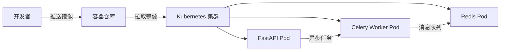

扫描[二维码](https://api2.cmdragon.cn/upload/cmder/20250304_012821924.jpg)
关注或者微信搜一搜：`编程智域 前端至全栈交流与成长`

[发现1000+提升效率与开发的AI工具和实用程序](https://tools.cmdragon.cn/zh/apps?category=ai_chat)：https://tools.cmdragon.cn/

## 一、容器化部署的核心价值

### 1.1 为什么需要容器化部署

在生产环境中部署 FastAPI 应用时，容器化能解决以下核心问题：

- **环境一致性**：解决 "在我机器上是好的" 问题，确保开发/测试/生产环境完全一致
- **资源隔离**：避免应用间的资源竞争和依赖冲突
- **快速扩展**：秒级启动新容器应对流量高峰
- **部署标准化**：统一交付物格式，简化 CI/CD 流程

### 1.2 容器化部署架构图



## 二、FastAPI 容器化实战

### 2.1 Dockerfile 最佳实践

```Dockerfile
# 使用官方 Python 基础镜像
FROM python:3.11-slim-bullseye

# 设置工作目录
WORKDIR /app

# 先安装依赖 - 利用 Docker 缓存层
COPY requirements.txt .
RUN pip install --no-cache-dir -r requirements.txt

# 复制应用代码
COPY . .

# 设置环境变量
ENV PYTHONPATH=/app \
    PORT=8000

# 暴露端口
EXPOSE $PORT

# 启动命令
CMD ["uvicorn", "main:app", "--host", "0.0.0.0", "--port", "8000"]
```

依赖文件 `requirements.txt`:

```
fastapi==0.110.0
uvicorn==0.29.0
pydantic==2.6.4
celery==5.4.0
redis==5.0.3
```

### 2.2 多阶段构建优化

```Dockerfile
# 构建阶段
FROM python:3.11 as builder
WORKDIR /app
COPY requirements.txt .
RUN pip install --user -r requirements.txt

# 运行时阶段
FROM python:3.11-slim
WORKDIR /app
COPY --from=builder /root/.local /root/.local
COPY . .
ENV PATH=/root/.local/bin:$PATH
CMD ["uvicorn", "main:app", "--host", "0.0.0.0"]
```

### 2.3 Kubernetes 部署配置

`fastapi-deployment.yaml`:

```yaml
apiVersion: apps/v1
kind: Deployment
metadata:
  name: fastapi-app
spec:
  replicas: 3
  selector:
    matchLabels:
      app: fastapi
  template:
    metadata:
      labels:
        app: fastapi
    spec:
      containers:
        - name: fastapi
          image: your-registry/fastapi-app:v1.0
          ports:
            - containerPort: 8000
          env:
            - name: REDIS_HOST
              value: "redis-service"
          readinessProbe:
            httpGet:
              path: /health
              port: 8000
            initialDelaySeconds: 5
            periodSeconds: 10
```

## 三、异步任务系统集成

### 3.1 Celery 任务示例

```python
from celery import Celery
from pydantic import BaseModel

app = Celery(
    'tasks',
    broker='redis://redis-service:6379/0',
    backend='redis://redis-service:6379/1'
)


class ProcessRequest(BaseModel):
    user_id: int
    data: str


@app.task
def process_data(request: dict):
    # 使用 Pydantic 验证输入数据
    validated = ProcessRequest(**request)

    # 模拟耗时操作
    result = f"Processed {validated.data} for user {validated.user_id}"

    # 返回处理结果
    return {"status": "success", "result": result}
```

### 3.2 FastAPI 任务触发端点

```python
from fastapi import APIRouter
from .tasks import process_data

router = APIRouter()


@router.post("/submit-task")
async def submit_task(request: dict):
    # 异步发送任务到 Celery
    task = process_data.delay(request)

    return {
        "message": "Task submitted successfully",
        "task_id": task.id
    }
```

### 3.3 任务状态检查端点

```python
@router.get("/task-status/{task_id}")
async def get_task_status(task_id: str):
    # 获取 Celery 任务结果
    result = AsyncResult(task_id)

    return {
        "task_id": task_id,
        "status": result.status,
        "result": result.result if result.ready() else None
    }
```

## 四、健康检查与监控

### 4.1 健康检查端点

```python
from fastapi import APIRouter, Depends
from redis import Redis

router = APIRouter()


def get_redis():
    return Redis(host="redis-service", port=6379)


@router.get("/health")
async def health_check(redis: Redis = Depends(get_redis)):
    # 检查 Redis 连接
    redis.ping()

    # 检查数据库连接等
    return {"status": "healthy"}
```

### 4.2 Prometheus 监控集成

在 `requirements.txt` 添加：

```
prometheus-fastapi-instrumentator==6.3.0
```

配置代码：

```python
from prometheus_fastapi_instrumentator import Instrumentator


def setup_metrics(app):
    Instrumentator().instrument(app).expose(app)
```

## 五、配置管理策略

### 5.1 环境变量优先配置

```python
from pydantic_settings import BaseSettings


class Settings(BaseSettings):
    redis_host: str = "localhost"
    redis_port: int = 6379
    worker_count: int = 4

    class Config:
        env_file = ".env"


settings = Settings()
```

### 5.2 Kubernetes ConfigMap 示例

```yaml
apiVersion: v1
kind: ConfigMap
metadata:
  name: fastapi-config
data:
  REDIS_HOST: "redis-cluster"
  MAX_WORKERS: "8"
```

## 六、安全加固措施

### 6.1 容器安全配置

```Dockerfile
# 添加安全用户
RUN groupadd -g 999 appuser && \
    useradd -r -u 999 -g appuser appuser
USER appuser

# 设置只读文件系统
RUN chmod -R 544 /app
```

### 6.2 API 请求限制

使用中间件实现速率限制：

```python
from fastapi import FastAPI, Request
from slowapi import Limiter, _rate_limit_exceeded_handler
from slowapi.util import get_remote_address

limiter = Limiter(key_func=get_remote_address)
app = FastAPI()
app.state.limiter = limiter
app.add_exception_handler(429, _rate_limit_exceeded_handler)


@app.get("/api/resource")
@limiter.limit("100/minute")
async def get_resource(request: Request):
    return {"data": "protected resource"}
```

---

## 课后 Quiz

1. **问题：为什么在 Dockerfile 中使用多阶段构建？**  
   **答案**：多阶段构建可以显著减小最终镜像大小。第一阶段安装依赖生成 wheel 文件，第二阶段仅复制运行时所需文件，避免将构建工具和中间文件包含在最终镜像中

2. **问题：如何确保 Celery 任务在容器重启后不丢失？**  
   **答案**：需要配置可靠的消息中间件（如 Redis/RabbitMQ）和结果后端持久化策略。同时设置 `task_acks_late=True`
   和 `task_reject_on_worker_lost=True`

---

## 常见报错解决方案

### 问题 1：422 Unprocessable Entity

**错误示例**：

```json
{
  "detail": [
    {
      "loc": [
        "body",
        "user_id"
      ],
      "msg": "field required",
      "type": "value_error.missing"
    }
  ]
}
```

**解决方案**：

1. 检查请求体是否包含所有必填字段
2. 使用 Pydantic 模型验证数据：

```python
class UserRequest(BaseModel):
    user_id: int
    username: str = Field(min_length=3)


@app.post("/create")
def create_user(user: UserRequest):
    ...
```

### 问题 2：Celery 任务状态一直为 PENDING

**可能原因**：

1. 未正确配置消息代理（Redis/RabbitMQ）
2. Worker 未连接到消息队列
3. 任务路由配置错误

**解决步骤**：

1. 检查 Redis 服务是否运行：`redis-cli ping`
2. 确认 Worker 连接状态：`celery -A tasks inspect ping`
3. 验证队列绑定：`celery -A tasks list bindings`

余下文章内容请点击跳转至 个人博客页面 或者 扫码关注或者微信搜一搜：`编程智域 前端至全栈交流与成长`
，阅读完整的文章：[容器化部署FastAPI应用：如何让你的代码在云端跳舞？](https://blog.cmdragon.cn/posts/d949a268c7ab60f7b56b7f9ed71690cc/)


<details>
<summary>往期文章归档</summary>

- [如何用APScheduler和FastAPI打造永不宕机的分布式定时任务系统？ - cmdragon's Blog](https://blog.cmdragon.cn/posts/51a0ff47f509fb6238150a96f551b317/)
- [如何在 FastAPI 中玩转 APScheduler，让任务定时自动执行？ - cmdragon's Blog](https://blog.cmdragon.cn/posts/85564dd901c6d9b1a79d320970843caa/)
- [定时任务系统如何让你的Web应用自动完成那些烦人的重复工作？ - cmdragon's Blog](https://blog.cmdragon.cn/posts/2b27950aab76203a1af4e9e3deda8699/)
- [Celery任务监控的魔法背后藏着什么秘密？ - cmdragon's Blog](https://blog.cmdragon.cn/posts/f43335725bb3372ebc774db1b9f28d2d/)
- [如何让Celery任务像VIP客户一样享受优先待遇？ - cmdragon's Blog](https://blog.cmdragon.cn/posts/c24491a7ac7f7c5e9cf77596ebb27c51/)
- [如何让你的FastAPI Celery Worker在压力下优雅起舞？ - cmdragon's Blog](https://blog.cmdragon.cn/posts/c3129f4b424d2ed2330484b82ec31875/)
- [FastAPI与Celery的完美邂逅，如何让异步任务飞起来？ - cmdragon's Blog](https://blog.cmdragon.cn/posts/b79c2c1805fe9b1ea28326b5b8f3b709/)
- [FastAPI消息持久化与ACK机制：如何确保你的任务永不迷路？ - cmdragon's Blog](https://blog.cmdragon.cn/posts/13a59846aaab71b44ab6f3dadc5b5ec7/)
- [FastAPI的BackgroundTasks如何玩转生产者-消费者模式？ - cmdragon's Blog](https://blog.cmdragon.cn/posts/1549a6bd7e47e7006e7ba8f52bcfe8eb/)
- [BackgroundTasks 还是 RabbitMQ？你的异步任务到底该选谁？ - cmdragon's Blog](https://blog.cmdragon.cn/posts/d26fdc150ff9dd70c7482381ff4c77c4/)
- [BackgroundTasks与Celery：谁才是异步任务的终极赢家？ - cmdragon's Blog](https://blog.cmdragon.cn/posts/792cac4ce6eb96b5001da15b0d52ef83/)
- [如何在 FastAPI 中优雅处理后台任务异常并实现智能重试？ - cmdragon's Blog](https://blog.cmdragon.cn/posts/d5c1d2efbaf6fe4c9e13acc6be6d929a/)
- [BackgroundTasks 如何巧妙驾驭多任务并发？ - cmdragon's Blog](https://blog.cmdragon.cn/posts/8661dc74944bd6fb28092e90d4060161/)
- [如何让FastAPI后台任务像多米诺骨牌一样井然有序地执行？ - cmdragon's Blog](https://blog.cmdragon.cn/posts/7693d3430a6256c2abefc1e4aba21a4a/)
- [FastAPI后台任务：是时候让你的代码飞起来了吗？ - cmdragon's Blog](https://blog.cmdragon.cn/posts/6145d88d5154d5cd38cee7ddc2d46e1d/)
- [FastAPI后台任务为何能让邮件发送如此丝滑？ - cmdragon's Blog](https://blog.cmdragon.cn/posts/19241679a1852122f740391cbdc21bae/)
- [FastAPI的请求-响应周期为何需要后台任务分离？ - cmdragon's Blog](https://blog.cmdragon.cn/posts/c7b54d6b3b6b5041654e69e5610bf3b9/)
- [如何在FastAPI中让后台任务既高效又不会让你的应用崩溃？ - cmdragon's Blog](https://blog.cmdragon.cn/posts/5ad8d0a4c8f2d05e9c1a42d828aad7b3/)
- [FastAPI后台任务：异步魔法还是同步噩梦？ - cmdragon's Blog](https://blog.cmdragon.cn/posts/6a69eca9fd14ba8f6fa41502c5014edd/)
- [如何在FastAPI中玩转Schema版本管理和灰度发布？ - cmdragon's Blog](https://blog.cmdragon.cn/posts/6d9d20cd8d8528da4193f13aaf98575c/)
- [FastAPI的查询白名单和安全沙箱机制如何确保你的API坚不可摧？ - cmdragon's Blog](https://blog.cmdragon.cn/posts/ca141239cfc5c0d510960acd266de9cd/)
- [如何在 FastAPI 中玩转 GraphQL 性能监控与 APM 集成？ - cmdragon's Blog](https://blog.cmdragon.cn/posts/52fe9ea73b0e26de308ae0e539df21d2/)
- [如何在 FastAPI 中玩转 GraphQL 和 WebSocket 的实时数据推送魔法？ - cmdragon's Blog](https://blog.cmdragon.cn/posts/ae484cf6bcf3f44fd8392a8272e57db4/)
- [如何在FastAPI中玩转GraphQL联邦架构，让数据源手拉手跳探戈？ - cmdragon's Blog](https://blog.cmdragon.cn/posts/9b9086ff5d8464b0810cfb55f7768513/)
- [GraphQL批量查询优化：DataLoader如何让数据库访问速度飞起来？ - cmdragon's Blog](https://blog.cmdragon.cn/posts/0e236dbe717bde52bda290e89f4f6eca/)
- [如何在FastAPI中整合GraphQL的复杂度与限流？ - cmdragon's Blog](https://blog.cmdragon.cn/posts/ace8bb3f01589994f51d748ab5c73652/)
- [GraphQL错误处理为何让你又爱又恨？FastAPI中间件能否成为你的救星？ - cmdragon's Blog](https://blog.cmdragon.cn/posts/a28d5c1b32feadb18b406a849455dfe5/)
- [FastAPI遇上GraphQL：异步解析器如何让API性能飙升？ - cmdragon's Blog](https://blog.cmdragon.cn/posts/35fced261e8ff834e68e07c93902cc13/)
- [GraphQL的N+1问题如何被DataLoader巧妙化解？ - cmdragon's Blog](https://blog.cmdragon.cn/posts/72629304782a121fbf89b151c436f9aa/)
- [FastAPI与GraphQL的完美邂逅：如何打造高效API？ - cmdragon's Blog](https://blog.cmdragon.cn/posts/fb5c5c7b00bbe57b3a5346b8ee5bc289/)
- [GraphQL类型系统如何让FastAPI开发更高效？ - cmdragon's Blog](https://blog.cmdragon.cn/posts/31c152e531e1cbe5b5cfe15e7ff053c9/)
- [REST和GraphQL究竟谁才是API设计的终极赢家？ - cmdragon's Blog](https://blog.cmdragon.cn/posts/218ad2370eab6197f42fdc9c52f0fc19/)
- [IoT设备的OTA升级是如何通过MQTT协议实现无缝对接的？ - cmdragon's Blog](https://blog.cmdragon.cn/posts/071e9a3b9792beea63f134f5ad28df67/)
- [如何在FastAPI中玩转STOMP协议升级，让你的消息传递更高效？ - cmdragon's Blog](https://blog.cmdragon.cn/posts/16744b2f460346805c45314bc0c6f751/)
- [如何用WebSocket打造毫秒级实时协作系统？ - cmdragon's Blog](https://blog.cmdragon.cn/posts/da5b64cb0ded23e4d5b1f19ffd5ac53d/)
- [如何让你的WebSocket连接既安全又高效？](https://blog.cmdragon.cn/posts/eb598d50b76ea1823746ab7cdf49ce05/)

</details>


<details>
<summary>免费好用的热门在线工具</summary>

- [ASCII字符画生成器 - 应用商店 | By cmdragon](https://tools.cmdragon.cn/zh/apps/ascii-art-generator)
- [JSON Web Tokens 工具 - 应用商店 | By cmdragon](https://tools.cmdragon.cn/zh/apps/jwt-tool)
- [Bcrypt 密码工具 - 应用商店 | By cmdragon](https://tools.cmdragon.cn/zh/apps/bcrypt-tool)
- [GIF 合成器 - 应用商店 | By cmdragon](https://tools.cmdragon.cn/zh/apps/gif-composer)
- [GIF 分解器 - 应用商店 | By cmdragon](https://tools.cmdragon.cn/zh/apps/gif-decomposer)
- [文本隐写术 - 应用商店 | By cmdragon](https://tools.cmdragon.cn/zh/apps/text-steganography)
- [CMDragon 在线工具 - 高级AI工具箱与开发者套件 | 免费好用的在线工具](https://tools.cmdragon.cn/zh)
- [应用商店 - 发现1000+提升效率与开发的AI工具和实用程序 | 免费好用的在线工具](https://tools.cmdragon.cn/zh/apps?category=trending)
- [CMDragon 更新日志 - 最新更新、功能与改进 | 免费好用的在线工具](https://tools.cmdragon.cn/zh/changelog)
- [支持我们 - 成为赞助者 | 免费好用的在线工具](https://tools.cmdragon.cn/zh/sponsor)
- [AI文本生成图像 - 应用商店 | 免费好用的在线工具](https://tools.cmdragon.cn/zh/apps/text-to-image-ai)
- [临时邮箱 - 应用商店 | 免费好用的在线工具](https://tools.cmdragon.cn/zh/apps/temp-email)
- [二维码解析器 - 应用商店 | 免费好用的在线工具](https://tools.cmdragon.cn/zh/apps/qrcode-parser)
- [文本转思维导图 - 应用商店 | 免费好用的在线工具](https://tools.cmdragon.cn/zh/apps/text-to-mindmap)
- [正则表达式可视化工具 - 应用商店 | 免费好用的在线工具](https://tools.cmdragon.cn/zh/apps/regex-visualizer)
- [文件隐写工具 - 应用商店 | 免费好用的在线工具](https://tools.cmdragon.cn/zh/apps/steganography-tool)
- [IPTV 频道探索器 - 应用商店 | 免费好用的在线工具](https://tools.cmdragon.cn/zh/apps/iptv-explorer)
- [快传 - 应用商店 | 免费好用的在线工具](https://tools.cmdragon.cn/zh/apps/snapdrop)
- [随机抽奖工具 - 应用商店 | 免费好用的在线工具](https://tools.cmdragon.cn/zh/apps/lucky-draw)
- [动漫场景查找器 - 应用商店 | 免费好用的在线工具](https://tools.cmdragon.cn/zh/apps/anime-scene-finder)
- [时间工具箱 - 应用商店 | 免费好用的在线工具](https://tools.cmdragon.cn/zh/apps/time-toolkit)
- [网速测试 - 应用商店 | 免费好用的在线工具](https://tools.cmdragon.cn/zh/apps/speed-test)
- [AI 智能抠图工具 - 应用商店 | 免费好用的在线工具](https://tools.cmdragon.cn/zh/apps/background-remover)
- [背景替换工具 - 应用商店 | 免费好用的在线工具](https://tools.cmdragon.cn/zh/apps/background-replacer)
- [艺术二维码生成器 - 应用商店 | 免费好用的在线工具](https://tools.cmdragon.cn/zh/apps/artistic-qrcode)
- [Open Graph 元标签生成器 - 应用商店 | 免费好用的在线工具](https://tools.cmdragon.cn/zh/apps/open-graph-generator)
- [图像对比工具 - 应用商店 | 免费好用的在线工具](https://tools.cmdragon.cn/zh/apps/image-comparison)
- [图片压缩专业版 - 应用商店 | 免费好用的在线工具](https://tools.cmdragon.cn/zh/apps/image-compressor)
- [密码生成器 - 应用商店 | 免费好用的在线工具](https://tools.cmdragon.cn/zh/apps/password-generator)
- [SVG优化器 - 应用商店 | 免费好用的在线工具](https://tools.cmdragon.cn/zh/apps/svg-optimizer)
- [调色板生成器 - 应用商店 | 免费好用的在线工具](https://tools.cmdragon.cn/zh/apps/color-palette)
- [在线节拍器 - 应用商店 | 免费好用的在线工具](https://tools.cmdragon.cn/zh/apps/online-metronome)
- [IP归属地查询 - 应用商店 | 免费好用的在线工具](https://tools.cmdragon.cn/zh/apps/ip-geolocation)
- [CSS网格布局生成器 - 应用商店 | 免费好用的在线工具](https://tools.cmdragon.cn/zh/apps/css-grid-layout)
- [邮箱验证工具 - 应用商店 | 免费好用的在线工具](https://tools.cmdragon.cn/zh/apps/email-validator)
- [书法练习字帖 - 应用商店 | 免费好用的在线工具](https://tools.cmdragon.cn/zh/apps/calligraphy-practice)
- [金融计算器套件 - 应用商店 | 免费好用的在线工具](https://tools.cmdragon.cn/zh/apps/finance-calculator-suite)
- [中国亲戚关系计算器 - 应用商店 | 免费好用的在线工具](https://tools.cmdragon.cn/zh/apps/chinese-kinship-calculator)
- [Protocol Buffer 工具箱 - 应用商店 | 免费好用的在线工具](https://tools.cmdragon.cn/zh/apps/protobuf-toolkit)
- [IP归属地查询 - 应用商店 | 免费好用的在线工具](https://tools.cmdragon.cn/zh/apps/ip-geolocation)
- [图片无损放大 - 应用商店 | 免费好用的在线工具](https://tools.cmdragon.cn/zh/apps/image-upscaler)
- [文本比较工具 - 应用商店 | 免费好用的在线工具](https://tools.cmdragon.cn/zh/apps/text-compare)
- [IP批量查询工具 - 应用商店 | 免费好用的在线工具](https://tools.cmdragon.cn/zh/apps/ip-batch-lookup)
- [域名查询工具 - 应用商店 | 免费好用的在线工具](https://tools.cmdragon.cn/zh/apps/domain-finder)
- [DNS工具箱 - 应用商店 | 免费好用的在线工具](https://tools.cmdragon.cn/zh/apps/dns-toolkit)
- [网站图标生成器 - 应用商店 | 免费好用的在线工具](https://tools.cmdragon.cn/zh/apps/favicon-generator)
- [XML Sitemap](https://tools.cmdragon.cn/sitemap_index.xml)

</details>

