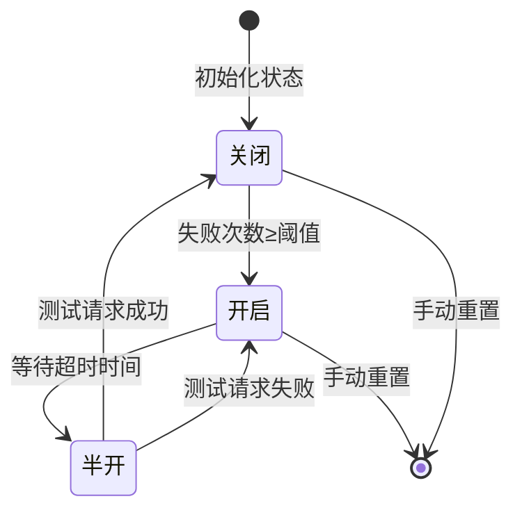

扫描[二维码](https://api2.cmdragon.cn/upload/cmder/20250304_012821924.jpg)
关注或者微信搜一搜：`编程智域 前端至全栈交流与成长`

[发现1000+提升效率与开发的AI工具和实用程序](https://tools.cmdragon.cn/zh/apps?category=ai_chat)：https://tools.cmdragon.cn/

### 1 熔断测试的基本概念与原理

#### 1.1 什么是熔断机制？

熔断机制（Circuit Breaker）是**系统自我保护的“保险丝”**——当API面临流量突增或下游服务故障时，它能快速切断异常请求链路，防止故障扩散导致“雪崩效应”（一个服务失败→整个调用链崩溃）。

举个例子：电商秒杀活动中，大量用户同时请求“创建订单”API，若下游库存服务因压力过大频繁返回500错误，未做熔断的API会持续转发请求，导致服务器连接池耗尽、CPU飙升，最终整个API服务崩溃。而开启熔断后，当库存服务失败次数达到阈值，熔断器会“跳闸”，直接返回“服务繁忙”的错误，避免系统资源被无效请求耗尽。

#### 1.2 熔断器的状态机模型

熔断器的核心是**三状态转换逻辑**，通过状态机管理请求转发策略。以下是Mermaid流程图展示状态转换：



各状态的核心逻辑：

1. **闭合（Closed）**：正常状态，所有请求转发至下游服务。此时统计**连续失败次数**，若达到阈值则转为“打开”状态。
2. **打开（Open）**：熔断状态，拒绝所有请求，直接返回错误（如503）。持续时间由`reset_timeout`配置（默认10秒），到期后转为“半开”状态。
3. **半开（Half-Open）**：试探恢复状态，允许少量请求（默认1次）转发至下游。若试探成功，说明下游服务已恢复，转回“闭合”；若失败，重新回到“打开”状态。

### 2 FastAPI中熔断测试的应用场景

熔断机制主要解决**“流量突增+下游故障”的叠加风险**，典型场景包括：

- **大促/秒杀**：电商活动期间，突发流量可能压垮下游库存、支付服务。
- **恶意爬取**：API被爬虫高频调用，导致数据库连接池耗尽。
- **依赖服务故障**：下游第三方API（如短信、物流）宕机，需快速切断依赖。

### 3 基于pybreaker的FastAPI熔断实现

pybreaker是Python生态中**最成熟的熔断库**，支持状态管理、异常过滤、回调函数，完美适配FastAPI的装饰器语法。

#### 3.1 依赖库安装与版本说明

需安装以下库（版本为2024年5月最新稳定版）：

```bash
pip install fastapi==0.111.0  
pip install uvicorn==0.30.1   
pip install pybreaker==1.3.1  # 熔断器库
pip install httpx==0.27.0     # 异步HTTP客户端（模拟下游服务）
```

#### 3.2 完整示例代码与解释

以下代码实现了一个**带熔断的“创建订单”API**，模拟下游服务在高负载时失败的场景：

```python
from fastapi import FastAPI, HTTPException
from pybreaker import CircuitBreaker, BreakerError, CircuitBreakerListener
import httpx
import random


# 1. 自定义熔断器监听器（记录状态变化）
class ServiceListener(CircuitBreakerListener):
    def state_change(self, breaker, old_state, new_state):
        """状态变化时打印日志"""
        print(f"[熔断器状态变化] {old_state.name} → {new_state.name}")

    def failure(self, breaker, exc):
        """请求失败时打印日志"""
        print(f"[请求失败] {exc.__class__.__name__}: {str(exc)}")

    def success(self, breaker):
        """请求成功时打印日志"""
        print(f"[请求成功] 下游服务恢复正常")


# 2. 配置熔断器参数
breaker = CircuitBreaker(
    listener=ServiceListener(),  # 绑定监听器
    failure_threshold=3,  # 失败3次后熔断
    reset_timeout=10,  # 熔断10秒后进入半开
    exclude=[HTTPException],  # 排除FastAPI的业务异常（如404）
    name="order_service_breaker"  # 熔断器名称（用于区分多个熔断器）
)

# 3. 初始化FastAPI应用
app = FastAPI(title="熔断测试示例", version="1.0")


# 4. 模拟下游服务（库存查询）
async def check_stock() -> dict:
    """模拟下游库存服务，70%概率返回500错误"""
    async with httpx.AsyncClient() as client:
        # 故意让请求70%概率失败（模拟高负载）
        if random.random() < 0.7:
            raise httpx.HTTPStatusError(
                "库存服务繁忙",
                request=httpx.Request("GET", "http://mock-stock-service"),
                response=httpx.Response(500, content=b"Internal Server Error")
            )
        return {"stock": 100, "message": "库存充足"}


# 5. 带熔断的API路由
@app.get("/api/order")
@breaker  # 应用熔断器装饰器
async def create_order():
    """创建订单API，依赖库存服务"""
    try:
        stock_info = await check_stock()
        return {
            "status": "success",
            "order_id": f"ORD-{random.randint(1000, 9999)}",
            "stock": stock_info["stock"]
        }
    except BreakerError:
        # 熔断器打开时，返回503错误
        raise HTTPException(
            status_code=503,
            detail="服务繁忙，请稍后重试（错误码：CB-001）"
        )
    except Exception as e:
        # 其他未知错误，返回500
        raise HTTPException(status_code=500, detail=f"内部错误: {str(e)}")


# 6. 运行服务
if __name__ == "__main__":
    import uvicorn

    uvicorn.run("main:app", host="0.0.0.0", port=8000, reload=True)
```

##### 代码关键逻辑解释

1. **ServiceListener**：自定义监听器，通过`state_change`、`failure`、`success`方法记录熔断器状态和请求结果，方便调试。
2. **CircuitBreaker配置**：
    - `failure_threshold=3`：连续3次请求失败→熔断。
    - `reset_timeout=10`：熔断10秒后进入半开状态。
    - `exclude=[HTTPException]`：FastAPI的业务异常（如404）不会触发熔断（比如“商品不存在”是正常业务逻辑，不需要熔断）。
3. **@breaker装饰器**：将熔断器绑定到`/api/order`路由，所有请求都会经过熔断器的状态检查。
4. **BreakerError捕获**：当熔断器打开时，会抛出`BreakerError`，此时返回503错误（符合RESTful规范）。

### 4 熔断测试的验证方法：用Locust模拟流量突增

为了验证熔断效果，我们用**Locust**（性能测试工具）模拟100并发用户的流量突增。

#### 4.1 安装Locust

```bash
pip install locust==2.22.0
```

#### 4.2 编写性能测试脚本（locustfile.py）

```python
from locust import HttpUser, task, between


class OrderUser(HttpUser):
    wait_time = between(0.1, 0.5)  # 每个用户的请求间隔（0.1~0.5秒）

    @task  # 标记为测试任务
    def call_create_order(self):
        """模拟用户调用创建订单API"""
        self.client.get("/api/order")
```

#### 4.3 运行测试并观察结果

1. 启动FastAPI服务：`python main.py`。
2. 启动Locust：`locust -f locustfile.py --host=http://localhost:8000`。
3. 打开浏览器访问`http://localhost:8089`，配置：
    - **Number of users**：并发用户数（如100）。
    - **Spawn rate**：每秒新增用户数（如10）。
4. 点击“Start Swarming”开始测试，观察终端输出：
    - 初始状态：`[熔断器状态变化] Closed → Closed`（正常服务）。
    - 失败次数达3次：`[熔断器状态变化] Closed → Open`（熔断打开），后续请求返回503。
    - 10秒后：`[熔断器状态变化] Open → Half-Open`（进入半开）。
    - 试探请求成功：`[请求成功] 下游服务恢复正常` → `[熔断器状态变化] Half-Open → Closed`（恢复正常）。

### 5 课后Quiz：巩固熔断知识

#### 问题1

pybreaker中`reset_timeout`参数的作用是什么？  
**答案**：`reset_timeout`是熔断器从“打开”状态转为“半开”状态的等待时长。例如`reset_timeout=10`表示熔断10秒后，允许试探请求验证下游服务是否恢复。

#### 问题2

为什么要在`CircuitBreaker`中配置`exclude`参数？  
**答案**：`exclude`用于排除**不需要触发熔断的异常**。例如，FastAPI的`HTTPException`（如404“商品不存在”）是正常业务错误，不应计入失败次数，否则会误触发熔断。

#### 问题3

熔断器处于“半开”状态时，若试探请求失败，会发生什么？  
**答案**：试探请求失败会触发状态回滚——熔断器从“半开”转回“打开”状态，继续熔断`reset_timeout`时长。

### 6 常见报错与解决方案

#### 报错1：`pybreaker.BreakerError: Circuit breaker is open`

- **原因**：熔断器处于“打开”状态，拒绝所有请求。
- **解决步骤**：
    1. 检查下游服务是否正常（如库存服务是否恢复）。
    2. 调整熔断器参数：若下游恢复慢，可增大`reset_timeout`（如从10秒改为20秒）。
    3. 查看监听器日志，确认失败原因（是下游故障还是业务逻辑错误）。

#### 报错2：`ModuleNotFoundError: No module named 'pybreaker'`

- **原因**：未安装pybreaker库。
- **解决**：执行`pip install pybreaker==1.3.1`安装最新版本。

#### 报错3：`pybreaker.InvalidStateError: Cannot call a circuit breaker that is open`

- **原因**：手动调用了处于“打开”状态的熔断器（如直接调用`breaker.call()`）。
- **解决**：不要手动干预熔断器状态，让状态机自动管理；若需强制重置，可调用`breaker.reset()`。

### 7 预防熔断误触发的建议

1. **合理配置失败阈值**：根据下游服务的稳定性调整`failure_threshold`（如稳定服务设为5，不稳定服务设为3）。
2. **区分业务异常与系统异常**：用`exclude`参数排除业务错误（如404、400），避免误熔断。
3. **监控熔断器状态**：通过监听器或APM工具（如Prometheus）监控熔断器状态，提前预警故障。

余下文章内容请点击跳转至 个人博客页面 或者 扫码关注或者微信搜一搜：`编程智域 前端至全栈交流与成长`
，阅读完整的文章：[流量突增要搞崩FastAPI？熔断测试是怎么防系统雪崩的？](https://blog.cmdragon.cn/posts/46d05151c5bd31cf37a7bcf0b8f5b0b8/)


<details>
<summary>往期文章归档</summary>

- [FastAPI秒杀库存总变负数？Redis分布式锁能帮你守住底线吗 - cmdragon's Blog](https://blog.cmdragon.cn/posts/65ce343cc5df9faf3a8e2eeaab42ae45/)
- [FastAPI的CI流水线怎么自动测端点，还能让Allure报告美到犯规？ - cmdragon's Blog](https://blog.cmdragon.cn/posts/eed6cd8985d9be0a4b092a7da38b3e0c/)
- [如何用GitHub Actions为FastAPI项目打造自动化测试流水线？ - cmdragon's Blog](https://blog.cmdragon.cn/posts/6157d87338ce894d18c013c3c4777abb/)
- [如何用Git Hook和CI流水线为FastAPI项目保驾护航？ - cmdragon's Blog](https://blog.cmdragon.cn/posts/fc4ef84559e04693a620d0714cb30787/)
- [FastAPI如何用契约测试确保API的「菜单」与「菜品」一致？](https://blog.cmdragon.cn/posts/02b0c96842d1481c72dab63a149ce0dd/)
- [为什么TDD能让你的FastAPI开发飞起来？ - cmdragon's Blog](https://blog.cmdragon.cn/posts/c9c1e3bb0fdc15303b9b3b1f20124b0b/)
- [如何用FastAPI玩转多模块测试与异步任务，让代码不再“闹脾气”？ - cmdragon's Blog](https://blog.cmdragon.cn/posts/ddbfa0447a5d0d6f9af12e7a6b206f70/)
- [如何在FastAPI中玩转“时光倒流”的数据库事务回滚测试？](https://blog.cmdragon.cn/posts/bf9883a75ffa46b523a03b16ec56ce48/)
- [如何在FastAPI中优雅地模拟多模块集成测试？ - cmdragon's Blog](https://blog.cmdragon.cn/posts/be553dbd5d51835d2c69553f4a773e2d/)
- [多环境配置切换机制能否让开发与生产无缝衔接？ - cmdragon's Blog](https://blog.cmdragon.cn/posts/533874f5700b8506d4c68781597db659/)
- [如何在 FastAPI 中巧妙覆盖依赖注入并拦截第三方服务调用？ - cmdragon's Blog](https://blog.cmdragon.cn/posts/2d992ef9e8962dc0a4a0b5348d486114/)
- [为什么你的单元测试需要Mock数据库才能飞起来？ - cmdragon's Blog](https://blog.cmdragon.cn/posts/6e69c0eedd8b1e5a74a148d36c85d7ce/)
- [如何在FastAPI中巧妙隔离依赖项，让单元测试不再头疼？ - cmdragon's Blog](https://blog.cmdragon.cn/posts/77ae327dc941b0e74ecc6a8794c084d0/)
- [如何在FastAPI中巧妙隔离依赖项，让单元测试不再头疼？ - cmdragon's Blog](https://blog.cmdragon.cn/posts/77ae327dc941b0e74ecc6a8794c084d0/)
- [测试覆盖率不够高？这些技巧让你的FastAPI测试无懈可击！ - cmdragon's Blog](https://blog.cmdragon.cn/posts/0577d0e24f48b3153b510e74d3d1a822/)
- [为什么你的FastAPI测试覆盖率总是低得让人想哭？ - cmdragon's Blog](https://blog.cmdragon.cn/posts/985c18ca802f1b6da828b92e082b4d4e/)
- [如何让FastAPI测试不再成为你的噩梦？ - cmdragon's Blog](https://blog.cmdragon.cn/posts/29858a7a10d20b4e4649cb75fb422eab/)
- [FastAPI测试环境配置的秘诀，你真的掌握了吗？ - cmdragon's Blog](https://blog.cmdragon.cn/posts/6f9e71e8313db6de8c1431877a70b67e/)
- [全链路追踪如何让FastAPI微服务架构的每个请求都无所遁形？ - cmdragon's Blog](https://blog.cmdragon.cn/posts/30e1d2fbf1ad8123eaf0e1e0dbe7c675/)
- [如何在API高并发中玩转资源隔离与限流策略？ - cmdragon's Blog](https://blog.cmdragon.cn/posts/4ad4ec1dbd80bcf5670fb397ca7cc68c/)
- [任务分片执行模式如何让你的FastAPI性能飙升？ - cmdragon's Blog](https://blog.cmdragon.cn/posts/c6a598639f6a831e9e82e171b8d71857/)
- [冷热任务分离：是提升Web性能的终极秘籍还是技术噱头？ - cmdragon's Blog](https://blog.cmdragon.cn/posts/9c3dc7767a9282f7ef02daad42539f2c/)
- [如何让FastAPI在百万级任务处理中依然游刃有余？ - cmdragon's Blog](https://blog.cmdragon.cn/posts/469aae0e0f88c642ed8bc82e102b960b/)
- [如何让FastAPI与消息队列的联姻既甜蜜又可靠？ - cmdragon's Blog](https://blog.cmdragon.cn/posts/1bebb53f4d9d6fbd0ecbba97562c07b0/)
- [如何在FastAPI中巧妙实现延迟队列，让任务乖乖等待？ - cmdragon's Blog](https://blog.cmdragon.cn/posts/174450702d9e609a072a7d1aaa84750b/)
- [FastAPI的死信队列处理机制：为何你的消息系统需要它？ - cmdragon's Blog](https://blog.cmdragon.cn/posts/047b08957a0d617a87b72da6c3131e5d/)
- [如何让FastAPI任务系统在失败时自动告警并自我修复？ - cmdragon's Blog](https://blog.cmdragon.cn/posts/2f104637ecc916e906c002fa79ab8c80/)
- [如何用Prometheus和FastAPI打造任务监控的“火眼金睛”？ - cmdragon's Blog](https://blog.cmdragon.cn/posts/e7464e5b4d558ede1a7413fa0a2f96f3/)
- [如何用APScheduler和FastAPI打造永不宕机的分布式定时任务系统？ - cmdragon's Blog](https://blog.cmdragon.cn/posts/51a0ff47f509fb6238150a96f551b317/)
- [如何在 FastAPI 中玩转 APScheduler，让任务定时自动执行？ - cmdragon's Blog](https://blog.cmdragon.cn/posts/85564dd901c6d9b1a79d320970843caa/)
- [定时任务系统如何让你的Web应用自动完成那些烦人的重复工作？ - cmdragon's Blog](https://blog.cmdragon.cn/posts/2b27950aab76203a1af4e9e3deda8699/)
- [Celery任务监控的魔法背后藏着什么秘密？ - cmdragon's Blog](https://blog.cmdragon.cn/posts/f43335725bb3372ebc774db1b9f28d2d/)
- [如何让Celery任务像VIP客户一样享受优先待遇？ - cmdragon's Blog](https://blog.cmdragon.cn/posts/c24491a7ac7f7c5e9cf77596ebb27c51/)
- [如何让你的FastAPI Celery Worker在压力下优雅起舞？ - cmdragon's Blog](https://blog.cmdragon.cn/posts/c3129f4b424d2ed2330484b82ec31875/)
- [FastAPI与Celery的完美邂逅，如何让异步任务飞起来？ - cmdragon's Blog](https://blog.cmdragon.cn/posts/b79c2c1805fe9b1ea28326b5b8f3b709/)
- [FastAPI消息持久化与ACK机制：如何确保你的任务永不迷路？ - cmdragon's Blog](https://blog.cmdragon.cn/posts/13a59846aaab71b44ab6f3dadc5b5ec7/)
- [FastAPI的BackgroundTasks如何玩转生产者-消费者模式？ - cmdragon's Blog](https://blog.cmdragon.cn/posts/1549a6bd7e47e7006e7ba8f52bcfe8eb/)

</details>


<details>
<summary>免费好用的热门在线工具</summary>

- [歌词生成工具 - 应用商店 | By cmdragon](https://tools.cmdragon.cn/zh/apps/lyrics-generator)
- [网盘资源聚合搜索 - 应用商店 | By cmdragon](https://tools.cmdragon.cn/zh/apps/cloud-drive-search)
- [ASCII字符画生成器 - 应用商店 | By cmdragon](https://tools.cmdragon.cn/zh/apps/ascii-art-generator)
- [JSON Web Tokens 工具 - 应用商店 | By cmdragon](https://tools.cmdragon.cn/zh/apps/jwt-tool)
- [Bcrypt 密码工具 - 应用商店 | By cmdragon](https://tools.cmdragon.cn/zh/apps/bcrypt-tool)
- [GIF 合成器 - 应用商店 | By cmdragon](https://tools.cmdragon.cn/zh/apps/gif-composer)
- [GIF 分解器 - 应用商店 | By cmdragon](https://tools.cmdragon.cn/zh/apps/gif-decomposer)
- [文本隐写术 - 应用商店 | By cmdragon](https://tools.cmdragon.cn/zh/apps/text-steganography)
- [CMDragon 在线工具 - 高级AI工具箱与开发者套件 | 免费好用的在线工具](https://tools.cmdragon.cn/zh)
- [应用商店 - 发现1000+提升效率与开发的AI工具和实用程序 | 免费好用的在线工具](https://tools.cmdragon.cn/zh/apps?category=trending)
- [CMDragon 更新日志 - 最新更新、功能与改进 | 免费好用的在线工具](https://tools.cmdragon.cn/zh/changelog)
- [支持我们 - 成为赞助者 | 免费好用的在线工具](https://tools.cmdragon.cn/zh/sponsor)
- [AI文本生成图像 - 应用商店 | 免费好用的在线工具](https://tools.cmdragon.cn/zh/apps/text-to-image-ai)
- [临时邮箱 - 应用商店 | 免费好用的在线工具](https://tools.cmdragon.cn/zh/apps/temp-email)
- [二维码解析器 - 应用商店 | 免费好用的在线工具](https://tools.cmdragon.cn/zh/apps/qrcode-parser)
- [文本转思维导图 - 应用商店 | 免费好用的在线工具](https://tools.cmdragon.cn/zh/apps/text-to-mindmap)
- [正则表达式可视化工具 - 应用商店 | 免费好用的在线工具](https://tools.cmdragon.cn/zh/apps/regex-visualizer)
- [文件隐写工具 - 应用商店 | 免费好用的在线工具](https://tools.cmdragon.cn/zh/apps/steganography-tool)
- [IPTV 频道探索器 - 应用商店 | 免费好用的在线工具](https://tools.cmdragon.cn/zh/apps/iptv-explorer)
- [快传 - 应用商店 | 免费好用的在线工具](https://tools.cmdragon.cn/zh/apps/snapdrop)
- [随机抽奖工具 - 应用商店 | 免费好用的在线工具](https://tools.cmdragon.cn/zh/apps/lucky-draw)
- [动漫场景查找器 - 应用商店 | 免费好用的在线工具](https://tools.cmdragon.cn/zh/apps/anime-scene-finder)
- [时间工具箱 - 应用商店 | 免费好用的在线工具](https://tools.cmdragon.cn/zh/apps/time-toolkit)
- [网速测试 - 应用商店 | 免费好用的在线工具](https://tools.cmdragon.cn/zh/apps/speed-test)
- [AI 智能抠图工具 - 应用商店 | 免费好用的在线工具](https://tools.cmdragon.cn/zh/apps/background-remover)
- [背景替换工具 - 应用商店 | 免费好用的在线工具](https://tools.cmdragon.cn/zh/apps/background-replacer)
- [艺术二维码生成器 - 应用商店 | 免费好用的在线工具](https://tools.cmdragon.cn/zh/apps/artistic-qrcode)
- [Open Graph 元标签生成器 - 应用商店 | 免费好用的在线工具](https://tools.cmdragon.cn/zh/apps/open-graph-generator)
- [图像对比工具 - 应用商店 | 免费好用的在线工具](https://tools.cmdragon.cn/zh/apps/image-comparison)
- [图片压缩专业版 - 应用商店 | 免费好用的在线工具](https://tools.cmdragon.cn/zh/apps/image-compressor)
- [密码生成器 - 应用商店 | 免费好用的在线工具](https://tools.cmdragon.cn/zh/apps/password-generator)
- [SVG优化器 - 应用商店 | 免费好用的在线工具](https://tools.cmdragon.cn/zh/apps/svg-optimizer)
- [调色板生成器 - 应用商店 | 免费好用的在线工具](https://tools.cmdragon.cn/zh/apps/color-palette)
- [在线节拍器 - 应用商店 | 免费好用的在线工具](https://tools.cmdragon.cn/zh/apps/online-metronome)
- [IP归属地查询 - 应用商店 | 免费好用的在线工具](https://tools.cmdragon.cn/zh/apps/ip-geolocation)
- [CSS网格布局生成器 - 应用商店 | 免费好用的在线工具](https://tools.cmdragon.cn/zh/apps/css-grid-layout)
- [邮箱验证工具 - 应用商店 | 免费好用的在线工具](https://tools.cmdragon.cn/zh/apps/email-validator)
- [书法练习字帖 - 应用商店 | 免费好用的在线工具](https://tools.cmdragon.cn/zh/apps/calligraphy-practice)
- [金融计算器套件 - 应用商店 | 免费好用的在线工具](https://tools.cmdragon.cn/zh/apps/finance-calculator-suite)
- [中国亲戚关系计算器 - 应用商店 | 免费好用的在线工具](https://tools.cmdragon.cn/zh/apps/chinese-kinship-calculator)
- [Protocol Buffer 工具箱 - 应用商店 | 免费好用的在线工具](https://tools.cmdragon.cn/zh/apps/protobuf-toolkit)
- [IP归属地查询 - 应用商店 | 免费好用的在线工具](https://tools.cmdragon.cn/zh/apps/ip-geolocation)
- [图片无损放大 - 应用商店 | 免费好用的在线工具](https://tools.cmdragon.cn/zh/apps/image-upscaler)
- [文本比较工具 - 应用商店 | 免费好用的在线工具](https://tools.cmdragon.cn/zh/apps/text-compare)
- [IP批量查询工具 - 应用商店 | 免费好用的在线工具](https://tools.cmdragon.cn/zh/apps/ip-batch-lookup)
- [域名查询工具 - 应用商店 | 免费好用的在线工具](https://tools.cmdragon.cn/zh/apps/domain-finder)
- [DNS工具箱 - 应用商店 | 免费好用的在线工具](https://tools.cmdragon.cn/zh/apps/dns-toolkit)
- [网站图标生成器 - 应用商店 | 免费好用的在线工具](https://tools.cmdragon.cn/zh/apps/favicon-generator)
- [XML Sitemap](https://tools.cmdragon.cn/sitemap_index.xml)

</details>