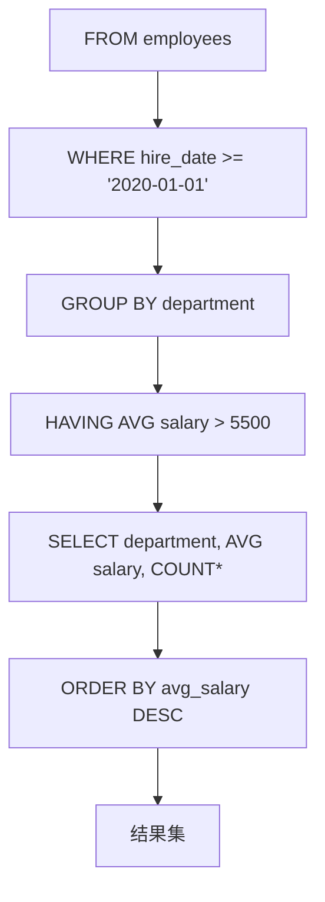

扫描[二维码](https://api2.cmdragon.cn/upload/cmder/20250304_012821924.jpg)
关注或者微信搜一搜：`编程智域 前端至全栈交流与成长`

[发现1000+提升效率与开发的AI工具和实用程序](https://tools.cmdragon.cn/zh/apps?category=ai_chat)：https://tools.cmdragon.cn/

### 一、过滤数据：用WHERE子句精准筛选

查询的核心是“找对数据”，**WHERE子句**就是PostgreSQL给你的“数据筛子”——它通过条件判断，只保留符合要求的行。

#### 1.1 基本比较与逻辑运算

最基础的过滤用**比较运算符**（`=`、`<>/!=`、`>`、`<`、`>=`、`<=`）和**逻辑运算符**（`AND`、`OR`、`NOT`）组合实现。

举个例子（假设我们有一张`employees`表，包含`employee_id`、`name`、`department`、`salary`等字段）：

```sql
-- 1. 筛选「工程部」的员工
SELECT employee_id, name, department, salary
FROM employees
WHERE department = 'Engineering';
-- 等于判断

-- 2. 筛选「销售部」且「工资>6000」的员工（AND组合条件）
SELECT employee_id, name, department, salary
FROM employees
WHERE department = 'Sales'
  AND salary > 6000;

-- 3. 筛选「销售部」或「市场部」的员工（OR组合条件）
SELECT employee_id, name, department, salary
FROM employees
WHERE department = 'Sales'
   OR department = 'Marketing';

-- 4. 筛选「非工程部」的员工（NOT取反）
SELECT employee_id, name, department, salary
FROM employees
WHERE NOT department = 'Engineering';
```

#### 1.2 常用过滤谓词：IN、BETWEEN、LIKE、IS NULL

除了基础比较，PostgreSQL还提供了更灵活的**谓词**（Predicate），帮你处理复杂场景：

- **IN**：判断值是否在指定集合中（替代多个`OR`）
  ```sql
  -- 筛选「销售/市场/工程」三个部门的员工
  SELECT * FROM employees
  WHERE department IN ('Sales', 'Marketing', 'Engineering');
  ```

- **BETWEEN**：判断值是否在某个区间内（包含边界）
  ```sql
  -- 筛选工资在5000~8000之间的员工
  SELECT * FROM employees
  WHERE salary BETWEEN 5000 AND 8000;
  ```

- **LIKE**：模糊匹配（`%`代表任意字符，`_`代表单个字符）
  ```sql
  -- 1. 名字以「J」开头的员工（%匹配后面任意字符）
  SELECT * FROM employees WHERE name LIKE 'J%';
  -- 2. 名字第二个字符是「a」的员工（_匹配单个字符）
  SELECT * FROM employees WHERE name LIKE '_a%';
  ```

- **IS NULL/IS NOT NULL**：判断值是否为NULL（注意：`NULL`不能用`=`或`!=`判断）
  ```sql
  -- 筛选「没有上级」的员工（manager_id为NULL）
  SELECT * FROM employees WHERE manager_id IS NULL;
  -- 筛选「有上级」的员工
  SELECT * FROM employees WHERE manager_id IS NOT NULL;
  ```

#### 1.3 NULL值的特殊处理

`NULL`代表“未知”或“缺失”，它的逻辑很特殊：

- 任何与`NULL`的比较（如`= NULL`、`> NULL`）结果都是`NULL`（不是`true`或`false`）；
- 聚合函数（如`SUM`、`AVG`）会**自动忽略`NULL`**。

比如：

```sql
-- 错误：无法用=判断NULL（结果为空）
SELECT *
FROM employees
WHERE manager_id = NULL;
-- 正确：必须用IS NULL
SELECT *
FROM employees
WHERE manager_id IS NULL;
```

### 二、排序数据：用ORDER BY掌控结果顺序

默认情况下，查询结果的顺序是“插入顺序”（不可靠）。**ORDER BY子句**帮你按指定规则排序，让结果更易读。

#### 2.1 单列排序：升序与降序

- **升序（ASC）**：默认规则（从小到大，如数字1→10，字符串A→Z）；
- **降序（DESC）**：从大到小（如工资从高到低）。

例子：

```sql
-- 按工资降序排序（高薪在前）
SELECT name, salary
FROM employees
ORDER BY salary DESC;
-- 按入职日期升序排序（老员工在前）
SELECT name, hire_date
FROM employees
ORDER BY hire_date ASC;
```

#### 2.2 多列排序：优先级与组合

当单列无法区分顺序时，可以用**多列排序**——先按第一列排，第一列相同的再按第二列排。

例子：

```sql
-- 先按部门升序（A→Z），同一部门内按工资降序（高薪在前）
SELECT name, department, salary
FROM employees
ORDER BY department ASC, salary DESC;
```

#### 2.3 基于计算列或别名排序

你可以用**计算结果**或**列别名**排序，不用重复写计算逻辑。

例子：

```sql
-- 按「年薪」降序排序（年薪=月薪*12）
SELECT name, salary, salary * 12 AS annual_salary
FROM employees
ORDER BY annual_salary DESC;
-- 用别名排序（更清晰）

-- 也可以直接用计算式排序（但可读性差）
SELECT name, salary, salary * 12 AS annual_salary
FROM employees
ORDER BY salary * 12 DESC;
```

### 三、聚合数据：用聚合函数提炼关键信息

聚合函数（Aggregate Function）是“数据 summarizer”——它把多行数据合并成一个结果（如统计总数、计算平均值）。

#### 3.1 常用聚合函数

PostgreSQL提供了5类核心聚合函数：

| 函数      | 作用         | 例子                                         |
|---------|------------|--------------------------------------------|
| `COUNT` | 统计行数       | `COUNT(*)`（总人数）、`COUNT(employee_id)`（非空人数） |
| `SUM`   | 求和（仅数值型）   | `SUM(salary)`（总工资）                         |
| `AVG`   | 求平均值（仅数值型） | `AVG(salary)`（平均工资）                        |
| `MIN`   | 求最小值       | `MIN(salary)`（最低工资）                        |
| `MAX`   | 求最大值       | `MAX(salary)`（最高工资）                        |

例子：

```sql
-- 1. 统计员工总数
SELECT COUNT(*) AS total_employees
FROM employees;

-- 2. 计算「销售部」的总工资
SELECT SUM(salary) AS total_sales_salary
FROM employees
WHERE department = 'Sales';

-- 3. 计算「市场部」的平均工资
SELECT AVG(salary) AS avg_marketing_salary
FROM employees
WHERE department = 'Marketing';

-- 4. 找最高/最低工资
SELECT MAX(salary) AS max_sal, MIN(salary) AS min_sal
FROM employees;
```

#### 3.2 DISTINCT与聚合：去重统计

`DISTINCT`可以和聚合函数结合，**统计不重复的值**。

例子：

```sql
-- 统计公司有多少个不同的部门（去重）
SELECT COUNT(DISTINCT department) AS unique_departments
FROM employees;
```

#### 3.3 空值对聚合的影响

所有聚合函数都会**自动忽略`NULL`值**。比如：

```sql
-- 统计「有上级」的员工数（manager_id不为NULL）
SELECT COUNT(manager_id) AS employees_with_manager
FROM employees;
-- 结果 = 总人数 - manager_id为NULL的人数
```

### 四、分组聚合：用GROUP BY与HAVING分组分析

如果想按“类别”聚合（比如“每个部门的平均工资”），需要用**GROUP BY子句**——它把数据分成多个“组”，每个组单独计算聚合值。

#### 4.1 GROUP BY：按列分组

`GROUP BY`的规则：**SELECT的列要么是分组列，要么是聚合函数**（否则PostgreSQL不知道如何处理非分组列的多个值）。

例子：

```sql
-- 按部门分组，统计每个部门的员工数和平均工资
SELECT department,                    -- 分组列
       COUNT(*)    AS employee_count, -- 聚合函数
       AVG(salary) AS avg_salary      -- 聚合函数
FROM employees
GROUP BY department; -- 按department分组
```

#### 4.2 HAVING：过滤分组结果

`WHERE`过滤的是**行**，`HAVING`过滤的是**分组后的结果**（比如“平均工资>6000的部门”）。

例子：

```sql
-- 筛选「平均工资>6000」的部门
SELECT department,
       COUNT(*)    AS employee_count,
       AVG(salary) AS avg_salary
FROM employees
GROUP BY department
HAVING AVG(salary) > 6000; -- 过滤分组结果
```

#### 4.3 WHERE与HAVING的区别

| 特征   | WHERE      | HAVING      |
|------|------------|-------------|
| 作用对象 | 行（分组前）     | 分组（分组后）     |
| 可用条件 | 任意行条件      | 只能用聚合函数或分组列 |
| 执行顺序 | 先于GROUP BY | 后于GROUP BY  |

比如：

```sql
-- 先过滤「工资>4000」的员工，再按部门分组，最后筛选「平均工资>5000」的部门
SELECT department,
       AVG(salary) AS avg_salary
FROM employees
WHERE salary > 4000 -- 先过滤行
GROUP BY department
HAVING AVG(salary) > 5000; -- 再过滤分组
```

### 五、综合实践：组合过滤、排序与聚合

我们用一个**真实需求**串联所有知识点：
> 统计每个部门中「2020年以后入职」的员工的平均工资，要求：
> 1. 平均工资超过5500；
> 2. 按平均工资降序排序；
> 3. 显示部门名称、平均工资、员工数。

对应的SQL：

```sql
SELECT department,                   -- 分组列
       AVG(salary) AS avg_salary,    -- 平均工资（聚合函数）
       COUNT(*)    AS employee_count -- 员工数（聚合函数）
FROM employees
WHERE hire_date >= '2020-01-01' -- 过滤2020年后入职的员工（行级过滤）
GROUP BY department -- 按部门分组
HAVING AVG(salary) > 5500 -- 过滤平均工资>5500的部门（分组过滤）
ORDER BY avg_salary DESC; -- 按平均工资降序排序
```

**执行顺序**（关键！）：



### 六、课后Quiz：巩固你的查询技能

通过问题强化理解，答案附解析：

#### 问题1

如何筛选出「工资在5000~8000之间」且「属于销售部或市场部」的员工？

**答案**：

```sql
SELECT *
FROM employees
WHERE salary BETWEEN 5000 AND 8000
  AND department IN ('Sales', 'Marketing');
```

**解析**：用`BETWEEN`处理区间，`IN`处理多值，`AND`组合条件。

#### 问题2

如何按部门分组，统计每个部门的「最高工资」和「最低工资」，并且只显示「最高工资>8000」的部门？

**答案**：

```sql
SELECT department,
       MAX(salary) AS max_sal,
       MIN(salary) AS min_sal
FROM employees
GROUP BY department
HAVING MAX(salary) > 8000;
```

**解析**：`GROUP BY`分组，`MAX`/`MIN`计算极值，`HAVING`过滤分组结果。

#### 问题3

如何按「入职年份」升序排序，入职年份相同的按「工资降序」排序？（提示：用`EXTRACT`函数取年份）

**答案**：

```sql
SELECT name, hire_date, salary
FROM employees
ORDER BY EXTRACT(YEAR FROM hire_date) ASC, -- 按入职年份升序
         salary DESC; -- 同一年份按工资降序
```

**解析**：`EXTRACT(YEAR FROM hire_date)`提取入职年份作为排序键，多列排序按顺序优先级。

### 七、常见报错与解决方法

学习中遇到报错别慌，以下是高频问题的解决方案：

#### 报错1：`ERROR: syntax error at or near "WHERE"`

**原因**：`WHERE`放错位置（比如`GROUP BY`后用`WHERE`过滤分组，应该用`HAVING`）。  
错误示例：

```sql
SELECT department, AVG(salary)
FROM employees
GROUP BY department WHERE AVG(salary) > 5000; -- 错误：GROUP BY后不能用WHERE
```

**解决**：将`WHERE`改为`HAVING`：

```sql
SELECT department, AVG(salary)
FROM employees
GROUP BY department
HAVING AVG(salary) > 5000;
```

#### 报错2：`ERROR: column "employees.name" must appear in the GROUP BY clause or be used in an aggregate function`

**原因**：`GROUP BY`后，`SELECT`的列不是“分组列”或“聚合函数”（PostgreSQL不知道如何处理非分组列的值）。  
错误示例：

```sql
SELECT name, department, AVG(salary) -- name不是分组列，也不是聚合函数
FROM employees
GROUP BY department;
```

**解决**：

- 方案1：将`name`加入`GROUP BY`（按`name+department`分组）；
- 方案2：用聚合函数（如`MAX(name)`）；
- 方案3：去掉`name`列（最常见）。

正确示例（去掉`name`）：

```sql
SELECT department, AVG(salary)
FROM employees
GROUP BY department;
```

#### 报错3：`ERROR: operator does not exist: integer = text`

**原因**：数据类型不匹配（比如用整数和字符串比较）。  
错误示例：

```sql
SELECT *
FROM employees
WHERE department = 100; -- department是字符串，100是整数
```

**解决**：将整数转为字符串（用单引号）：

```sql
SELECT *
FROM employees
WHERE department = '100';
```

#### 报错4：`ERROR: null value in column "salary" violates not-null constraint`

**原因**：`salary`列设置了`NOT NULL`约束，但插入了`NULL`值。  
**解决**：

- 确保插入的`salary`非空；
- 若业务允许，修改约束（`ALTER TABLE employees ALTER COLUMN salary DROP NOT NULL`）。

### 参考链接

- WHERE子句：https://www.postgresql.org/docs/17/queries-table-expressions.html#QUERIES-WHERE
- ORDER BY子句：https://www.postgresql.org/docs/17/queries-order.html
- 聚合函数：https://www.postgresql.org/docs/17/functions-aggregate.html
- GROUP BY与HAVING：https://www.postgresql.org/docs/17/queries-table-expressions.html#QUERIES-GROUP

余下文章内容请点击跳转至 个人博客页面 或者 扫码关注或者微信搜一搜：`编程智域 前端至全栈交流与成长`
，阅读完整的文章：[PostgreSQL查询的筛子、排序、聚合、分组？你会用它们搞定数据吗？](https://blog.cmdragon.cn/posts/ef4800975ffa84f1ca51976a70a1585b/)


<details>
<summary>往期文章归档</summary>

- [PostgreSQL数据类型怎么选才高效不踩坑？ - cmdragon's Blog](https://blog.cmdragon.cn/posts/bf54711525c507c5eacfa7b0151c39d2/)
- [想解锁PostgreSQL查询从基础到进阶的核心知识点？你都get了吗？ - cmdragon's Blog](https://blog.cmdragon.cn/posts/887809b3e0375f5956873cd442f516d8/)
- [PostgreSQL DELETE居然有这些操作？返回数据、连表删你试过没？ - cmdragon's Blog](https://blog.cmdragon.cn/posts/934be1203725e8be9d6f6e9104e5abcc/)
- [PostgreSQL UPDATE语句怎么玩？从改邮箱到批量更新的避坑技巧你都会吗？ - cmdragon's Blog](https://blog.cmdragon.cn/posts/0f0622e9b7402b599e618150d0596ffe/)
    - [PostgreSQL插入数据还在逐条敲？批量、冲突处理、返回自增ID的技巧你会吗？ - cmdragon's Blog](https://blog.cmdragon.cn/posts/0e3bf7efc030b024ea67ee855a00f2de/)
    - [PostgreSQL的“仓库-房间-货架”游戏，你能建出电商数据库和表吗？ - cmdragon's Blog](https://blog.cmdragon.cn/posts/b6cd3c86da6aac26ed829e472d34078e/)
    - [PostgreSQL 17安装总翻车？Windows/macOS/Linux避坑指南帮你搞定？ - cmdragon's Blog](https://blog.cmdragon.cn/posts/ba1f545a3410144552fbdbfcf31b5265/)
    - [能当关系型数据库还能玩对象特性，能拆复杂查询还能自动管库存，PostgreSQL凭什么这么香？ - cmdragon's Blog](https://blog.cmdragon.cn/posts/b5474d1480509c5072085abc80b3dd9f/)
- [给接口加新字段又不搞崩老客户端？FastAPI的多版本API靠哪三招实现？ - cmdragon's Blog](https://blog.cmdragon.cn/posts/cc098d8836e787baa8a4d92e4d56d5c5/)
- [流量突增要搞崩FastAPI？熔断测试是怎么防系统雪崩的？ - cmdragon's Blog](https://blog.cmdragon.cn/posts/46d05151c5bd31cf37a7bcf0b8f5b0b8/)
    - [FastAPI秒杀库存总变负数？Redis分布式锁能帮你守住底线吗 - cmdragon's Blog](https://blog.cmdragon.cn/posts/65ce343cc5df9faf3a8e2eeaab42ae45/)
    - [FastAPI的CI流水线怎么自动测端点，还能让Allure报告美到犯规？ - cmdragon's Blog](https://blog.cmdragon.cn/posts/eed6cd8985d9be0a4b092a7da38b3e0c/)
    - [如何用GitHub Actions为FastAPI项目打造自动化测试流水线？ - cmdragon's Blog](https://blog.cmdragon.cn/posts/6157d87338ce894d18c013c3c4777abb/)
    - [如何用Git Hook和CI流水线为FastAPI项目保驾护航？ - cmdragon's Blog](https://blog.cmdragon.cn/posts/fc4ef84559e04693a620d0714cb30787/)
    - [FastAPI如何用契约测试确保API的「菜单」与「菜品」一致？](https://blog.cmdragon.cn/posts/02b0c96842d1481c72dab63a149ce0dd/)
    - [为什么TDD能让你的FastAPI开发飞起来？ - cmdragon's Blog](https://blog.cmdragon.cn/posts/c9c1e3bb0fdc15303b9b3b1f20124b0b/)
- [如何用FastAPI玩转多模块测试与异步任务，让代码不再“闹脾气”？ - cmdragon's Blog](https://blog.cmdragon.cn/posts/ddbfa0447a5d0d6f9af12e7a6b206f70/)
- [如何在FastAPI中玩转“时光倒流”的数据库事务回滚测试？](https://blog.cmdragon.cn/posts/bf9883a75ffa46b523a03b16ec56ce48/)
- [如何在FastAPI中优雅地模拟多模块集成测试？ - cmdragon's Blog](https://blog.cmdragon.cn/posts/be553dbd5d51835d2c69553f4a773e2d/)
- [多环境配置切换机制能否让开发与生产无缝衔接？ - cmdragon's Blog](https://blog.cmdragon.cn/posts/533874f5700b8506d4c68781597db659/)
- [如何在 FastAPI 中巧妙覆盖依赖注入并拦截第三方服务调用？ - cmdragon's Blog](https://blog.cmdragon.cn/posts/2d992ef9e8962dc0a4a0b5348d486114/)
- [为什么你的单元测试需要Mock数据库才能飞起来？ - cmdragon's Blog](https://blog.cmdragon.cn/posts/6e69c0eedd8b1e5a74a148d36c85d7ce/)
- [如何在FastAPI中巧妙隔离依赖项，让单元测试不再头疼？ - cmdragon's Blog](https://blog.cmdragon.cn/posts/77ae327dc941b0e74ecc6a8794c084d0/)
- [如何在FastAPI中巧妙隔离依赖项，让单元测试不再头疼？ - cmdragon's Blog](https://blog.cmdragon.cn/posts/77ae327dc941b0e74ecc6a8794c084d0/)
- [测试覆盖率不够高？这些技巧让你的FastAPI测试无懈可击！ - cmdragon's Blog](https://blog.cmdragon.cn/posts/0577d0e24f48b3153b510e74d3d1a822/)
- [为什么你的FastAPI测试覆盖率总是低得让人想哭？ - cmdragon's Blog](https://blog.cmdragon.cn/posts/985c18ca802f1b6da828b92e082b4d4e/)
- [如何让FastAPI测试不再成为你的噩梦？ - cmdragon's Blog](https://blog.cmdragon.cn/posts/29858a7a10d20b4e4649cb75fb422eab/)
- [FastAPI测试环境配置的秘诀，你真的掌握了吗？ - cmdragon's Blog](https://blog.cmdragon.cn/posts/6f9e71e8313db6de8c1431877a70b67e/)
- [全链路追踪如何让FastAPI微服务架构的每个请求都无所遁形？ - cmdragon's Blog](https://blog.cmdragon.cn/posts/30e1d2fbf1ad8123eaf0e1e0dbe7c675/)
- [如何在API高并发中玩转资源隔离与限流策略？ - cmdragon's Blog](https://blog.cmdragon.cn/posts/4ad4ec1dbd80bcf5670fb397ca7cc68c/)
- [任务分片执行模式如何让你的FastAPI性能飙升？ - cmdragon's Blog](https://blog.cmdragon.cn/posts/c6a598639f6a831e9e82e171b8d71857/)
- [冷热任务分离：是提升Web性能的终极秘籍还是技术噱头？ - cmdragon's Blog](https://blog.cmdragon.cn/posts/9c3dc7767a9282f7ef02daad42539f2c/)
- [如何让FastAPI在百万级任务处理中依然游刃有余？ - cmdragon's Blog](https://blog.cmdragon.cn/posts/469aae0e0f88c642ed8bc82e102b960b/)
- [如何让FastAPI与消息队列的联姻既甜蜜又可靠？ - cmdragon's Blog](https://blog.cmdragon.cn/posts/1bebb53f4d9d6fbd0ecbba97562c07b0/)
- [如何在FastAPI中巧妙实现延迟队列，让任务乖乖等待？ - cmdragon's Blog](https://blog.cmdragon.cn/posts/174450702d9e609a072a7d1aaa84750b/)
- [FastAPI的死信队列处理机制：为何你的消息系统需要它？ - cmdragon's Blog](https://blog.cmdragon.cn/posts/047b08957a0d617a87b72da6c3131e5d/)
- [如何让FastAPI任务系统在失败时自动告警并自我修复？ - cmdragon's Blog](https://blog.cmdragon.cn/posts/2f104637ecc916e906c002fa79ab8c80/)
- [如何用Prometheus和FastAPI打造任务监控的“火眼金睛”？ - cmdragon's Blog](https://blog.cmdragon.cn/posts/e7464e5b4d558ede1a7413fa0a2f96f3/)
- [如何用APScheduler和FastAPI打造永不宕机的分布式定时任务系统？ - cmdragon's Blog](https://blog.cmdragon.cn/posts/51a0ff47f509fb6238150a96f551b317/)
- [如何在 FastAPI 中玩转 APScheduler，让任务定时自动执行？ - cmdragon's Blog](https://blog.cmdragon.cn/posts/85564dd901c6d9b1a79d320970843caa/)

</details>


<details>
<summary>免费好用的热门在线工具</summary>

- [智能提词器 - 应用商店 | By cmdragon](https://tools.cmdragon.cn/zh/apps/smart-teleprompter)
- [魔法简历 - 应用商店 | By cmdragon](https://tools.cmdragon.cn/zh/apps/magic-resume)
- [Image Puzzle Tool - 图片拼图工具 | By cmdragon](https://tools.cmdragon.cn/zh/apps/image-puzzle-tool)
- [字幕下载工具 - 应用商店 | By cmdragon](https://tools.cmdragon.cn/zh/apps/subtitle-downloader)
- [歌词生成工具 - 应用商店 | By cmdragon](https://tools.cmdragon.cn/zh/apps/lyrics-generator)
- [网盘资源聚合搜索 - 应用商店 | By cmdragon](https://tools.cmdragon.cn/zh/apps/cloud-drive-search)
- [ASCII字符画生成器 - 应用商店 | By cmdragon](https://tools.cmdragon.cn/zh/apps/ascii-art-generator)
- [JSON Web Tokens 工具 - 应用商店 | By cmdragon](https://tools.cmdragon.cn/zh/apps/jwt-tool)
- [Bcrypt 密码工具 - 应用商店 | By cmdragon](https://tools.cmdragon.cn/zh/apps/bcrypt-tool)
- [GIF 合成器 - 应用商店 | By cmdragon](https://tools.cmdragon.cn/zh/apps/gif-composer)
- [GIF 分解器 - 应用商店 | By cmdragon](https://tools.cmdragon.cn/zh/apps/gif-decomposer)
- [文本隐写术 - 应用商店 | By cmdragon](https://tools.cmdragon.cn/zh/apps/text-steganography)
- [CMDragon 在线工具 - 高级AI工具箱与开发者套件 | 免费好用的在线工具](https://tools.cmdragon.cn/zh)
- [应用商店 - 发现1000+提升效率与开发的AI工具和实用程序 | 免费好用的在线工具](https://tools.cmdragon.cn/zh/apps?category=trending)
- [CMDragon 更新日志 - 最新更新、功能与改进 | 免费好用的在线工具](https://tools.cmdragon.cn/zh/changelog)
- [支持我们 - 成为赞助者 | 免费好用的在线工具](https://tools.cmdragon.cn/zh/sponsor)
- [AI文本生成图像 - 应用商店 | 免费好用的在线工具](https://tools.cmdragon.cn/zh/apps/text-to-image-ai)
- [临时邮箱 - 应用商店 | 免费好用的在线工具](https://tools.cmdragon.cn/zh/apps/temp-email)
- [二维码解析器 - 应用商店 | 免费好用的在线工具](https://tools.cmdragon.cn/zh/apps/qrcode-parser)
- [文本转思维导图 - 应用商店 | 免费好用的在线工具](https://tools.cmdragon.cn/zh/apps/text-to-mindmap)
- [正则表达式可视化工具 - 应用商店 | 免费好用的在线工具](https://tools.cmdragon.cn/zh/apps/regex-visualizer)
- [文件隐写工具 - 应用商店 | 免费好用的在线工具](https://tools.cmdragon.cn/zh/apps/steganography-tool)
- [IPTV 频道探索器 - 应用商店 | 免费好用的在线工具](https://tools.cmdragon.cn/zh/apps/iptv-explorer)
- [快传 - 应用商店 | 免费好用的在线工具](https://tools.cmdragon.cn/zh/apps/snapdrop)
- [随机抽奖工具 - 应用商店 | 免费好用的在线工具](https://tools.cmdragon.cn/zh/apps/lucky-draw)
- [动漫场景查找器 - 应用商店 | 免费好用的在线工具](https://tools.cmdragon.cn/zh/apps/anime-scene-finder)
- [时间工具箱 - 应用商店 | 免费好用的在线工具](https://tools.cmdragon.cn/zh/apps/time-toolkit)
- [网速测试 - 应用商店 | 免费好用的在线工具](https://tools.cmdragon.cn/zh/apps/speed-test)
- [AI 智能抠图工具 - 应用商店 | 免费好用的在线工具](https://tools.cmdragon.cn/zh/apps/background-remover)
- [背景替换工具 - 应用商店 | 免费好用的在线工具](https://tools.cmdragon.cn/zh/apps/background-replacer)
- [艺术二维码生成器 - 应用商店 | 免费好用的在线工具](https://tools.cmdragon.cn/zh/apps/artistic-qrcode)
- [Open Graph 元标签生成器 - 应用商店 | 免费好用的在线工具](https://tools.cmdragon.cn/zh/apps/open-graph-generator)
- [图像对比工具 - 应用商店 | 免费好用的在线工具](https://tools.cmdragon.cn/zh/apps/image-comparison)
- [图片压缩专业版 - 应用商店 | 免费好用的在线工具](https://tools.cmdragon.cn/zh/apps/image-compressor)
- [密码生成器 - 应用商店 | 免费好用的在线工具](https://tools.cmdragon.cn/zh/apps/password-generator)
- [SVG优化器 - 应用商店 | 免费好用的在线工具](https://tools.cmdragon.cn/zh/apps/svg-optimizer)
- [调色板生成器 - 应用商店 | 免费好用的在线工具](https://tools.cmdragon.cn/zh/apps/color-palette)
- [在线节拍器 - 应用商店 | 免费好用的在线工具](https://tools.cmdragon.cn/zh/apps/online-metronome)
- [IP归属地查询 - 应用商店 | 免费好用的在线工具](https://tools.cmdragon.cn/zh/apps/ip-geolocation)
- [CSS网格布局生成器 - 应用商店 | 免费好用的在线工具](https://tools.cmdragon.cn/zh/apps/css-grid-layout)
- [邮箱验证工具 - 应用商店 | 免费好用的在线工具](https://tools.cmdragon.cn/zh/apps/email-validator)
- [书法练习字帖 - 应用商店 | 免费好用的在线工具](https://tools.cmdragon.cn/zh/apps/calligraphy-practice)
- [金融计算器套件 - 应用商店 | 免费好用的在线工具](https://tools.cmdragon.cn/zh/apps/finance-calculator-suite)
- [中国亲戚关系计算器 - 应用商店 | 免费好用的在线工具](https://tools.cmdragon.cn/zh/apps/chinese-kinship-calculator)
- [Protocol Buffer 工具箱 - 应用商店 | 免费好用的在线工具](https://tools.cmdragon.cn/zh/apps/protobuf-toolkit)
- [IP归属地查询 - 应用商店 | 免费好用的在线工具](https://tools.cmdragon.cn/zh/apps/ip-geolocation)
- [图片无损放大 - 应用商店 | 免费好用的在线工具](https://tools.cmdragon.cn/zh/apps/image-upscaler)
- [文本比较工具 - 应用商店 | 免费好用的在线工具](https://tools.cmdragon.cn/zh/apps/text-compare)
- [IP批量查询工具 - 应用商店 | 免费好用的在线工具](https://tools.cmdragon.cn/zh/apps/ip-batch-lookup)
- [域名查询工具 - 应用商店 | 免费好用的在线工具](https://tools.cmdragon.cn/zh/apps/domain-finder)
- [DNS工具箱 - 应用商店 | 免费好用的在线工具](https://tools.cmdragon.cn/zh/apps/dns-toolkit)
- [网站图标生成器 - 应用商店 | 免费好用的在线工具](https://tools.cmdragon.cn/zh/apps/favicon-generator)
- [XML Sitemap](https://tools.cmdragon.cn/sitemap_index.xml)

</details>