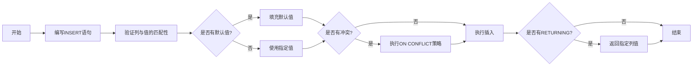

扫描[二维码](https://api2.cmdragon.cn/upload/cmder/20250304_012821924.jpg)
关注或者微信搜一搜：`编程智域 前端至全栈交流与成长`

[发现1000+提升效率与开发的AI工具和实用程序](https://tools.cmdragon.cn/zh/apps?category=ai_chat)：https://tools.cmdragon.cn/

## 一、INSERT语句的基本结构与核心概念

INSERT是PostgreSQL中用于向表中**插入新行**的核心语句，其语法框架（基于PostgreSQL 17官方文档）可拆解为以下关键部分：

```sql
[ WITH [ RECURSIVE ] with_query [, ...] ]  -- 可选：预处理临时结果集
INSERT INTO table_name [ AS alias ]       -- 目标表（可指定别名）
    [ ( column_name [, ...] ) ]           -- 可选：指定要插入的列（未指定则用所有列）
    [ OVERRIDING { SYSTEM | USER } VALUE ]-- 可选：覆盖身份列的默认值（如自增序列）
    { DEFAULT VALUES | VALUES (...) | query }  -- 插入源（默认值、值列表、查询结果）
    [ ON CONFLICT [ conflict_target ] conflict_action ]  -- 可选：处理唯一约束冲突
    [ RETURNING { * | output_expression } [, ...] ]       -- 可选：返回插入/更新的结果
```

## 二、基础插入操作：从单条到多条数据

### 2.1 插入单条数据（指定所有列）

当插入的列顺序与表定义**完全一致**时，可直接用`VALUES`传递所有值：

```sql
-- 假设films表结构：code(text)、title(text)、did(int)、date_prod(date)、kind(text)、len(text)
INSERT INTO films
VALUES ('UA502', 'Bananas', 105, '1971-07-13', 'Comedy', '82 minutes');
```

### 2.2 插入单条数据（指定部分列）

若只插入**部分列**，未指定的列将使用**默认值**（若未定义默认值则为`NULL`）：

```sql
-- 省略len列（默认值为NULL）
INSERT INTO films (code, title, did, date_prod, kind)
VALUES ('T_601', 'Yojimbo', 106, '1961-06-16', 'Drama');
```

### 2.3 使用DEFAULT值

对于希望保留默认值的列，可显式写`DEFAULT`（适用于任何列，包括自增序列）：

```sql
-- 方法1：在VALUES中用DEFAULT（date_prod使用默认值）
INSERT INTO films
VALUES ('UA502', 'Bananas', 105, DEFAULT, 'Comedy', '82 minutes');
-- 方法2：指定列时用DEFAULT
INSERT INTO films (code, title, did, date_prod, kind)
VALUES ('T_601', 'Yojimbo', 106, DEFAULT, 'Drama');
```

### 2.4 插入多条数据

通过`VALUES`后追加**多个括号组**，可一次性插入多条数据（比多次单条插入更高效）：

```sql
INSERT INTO films (code, title, did, date_prod, kind)
VALUES ('B6717', 'Tampopo', 110, '1985-02-10', 'Comedy'),
       ('HG120', 'The Dinner Game', 140, DEFAULT, 'Comedy');
```

### 2.5 插入全默认值的行

若所有列都使用默认值，可简化为`DEFAULT VALUES`：

```sql
INSERT INTO films DEFAULT
VALUES;
```

## 三、进阶用法：处理复杂场景

用WITH子句预处理数据
`WITH`（公共表表达式，CTE）允许在插入前先定义临时结果集，适用于**复杂数据过滤或转换**：

```sql
-- 先从tmp_films筛选出2004年前的电影，再插入films表
WITH old_films AS (SELECT *
                   FROM tmp_films
                   WHERE date_prod < '2004-05-07')
INSERT
INTO films
SELECT *
FROM old_films;
```

## 四、从查询结果插入（`INSERT ... SELECT`）

当需要将一个表的查询结果复制到另一个表时（比如归档历史数据、拆分大表），`INSERT ... SELECT`是最佳选择。

#### 4.1 场景：数据归档

假设我们要把`users`表中**2023年之前注册的用户**归档到`archived_users`表：

```sql
-- 1. 创建归档表（结构与users一致）
CREATE TABLE archived_users
(
    id         INT PRIMARY KEY,
    name       VARCHAR(50)         NOT NULL,
    email      VARCHAR(100) UNIQUE NOT NULL,
    phone      VARCHAR(20),
    created_at TIMESTAMP
);

-- 2. 插入查询结果（筛选2023年前的用户）
INSERT INTO archived_users (id, name, email, phone, created_at)
SELECT id, name, email, phone, created_at
FROM users
WHERE created_at < '2023-01-01 00:00:00';
```

**注意事项**：

- 列顺序匹配：`SELECT`的列顺序必须和`INSERT INTO`的列顺序一致（或明确指定列名）。
- 性能：如果数据量很大，建议分批次插入（比如每次插1000条），避免锁表。

### 五、处理插入冲突（`ON CONFLICT`）

在实际开发中，**唯一约束冲突**是高频问题（比如用户注册时邮箱已存在）。PostgreSQL提供`ON CONFLICT`子句，允许我们优雅处理冲突，而不是直接报错。

#### 5.1 冲突处理的两种策略

`ON CONFLICT`支持两种核心策略：

1. **`DO NOTHING`**：忽略冲突的记录（不插入、不报错）。
2. **`DO UPDATE`**：更新现有记录（用新值覆盖旧值）。

##### 场景1：忽略重复数据（`DO NOTHING`）

导入产品数据时，跳过已存在的产品名称：

```sql
-- 创建products表（product_name唯一）
CREATE TABLE products
(
    id           SERIAL PRIMARY KEY,
    product_name VARCHAR(100) UNIQUE NOT NULL,
    price        NUMERIC(10, 2)      NOT NULL,
    stock        INT                 NOT NULL DEFAULT 0
);

-- 插入产品，重复名称则忽略
INSERT INTO products (product_name, price, stock)
VALUES ('Laptop', 999.99, 10),
       ('Phone', 599.99, 20) ON CONFLICT (product_name) DO NOTHING;
```

##### 场景2：更新现有记录（`DO UPDATE`）

用户注册时，若邮箱已存在，则**更新昵称和最后登录时间**：

```sql
-- 给users表添加last_login_at列（默认当前时间）
ALTER TABLE users
    ADD COLUMN last_login_at TIMESTAMP DEFAULT CURRENT_TIMESTAMP;

-- 插入或更新用户
INSERT INTO users (name, email, last_login_at)
VALUES ('Alice Smith', 'alice@example.com', CURRENT_TIMESTAMP) ON CONFLICT (email) DO
UPDATE
    SET name = EXCLUDED.name, -- 用新昵称更新旧昵称
    last_login_at = EXCLUDED.last_login_at; -- 用新登录时间更新旧时间
```

**关键概念**：`EXCLUDED`  
`EXCLUDED`是PostgreSQL的“临时变量”，保存了你**原本要插入的那条记录的值**。比如`EXCLUDED.name`
就是这次要插入的Alice的新昵称，而`users.name`是数据库中已有的旧昵称。

##### 场景3：复杂更新（库存累加）

产品重复时，**现有库存 + 新库存**（适合库存管理）：

```sql
-- 插入产品，重复时累加库存
INSERT INTO products (product_name, price, stock)
VALUES ('Laptop', 999.99, 10),
       ('Phone', 599.99, 20) ON CONFLICT (product_name) DO
UPDATE
    SET stock = products.stock + EXCLUDED.stock; -- 现有库存 + 新库存
```

### 六、插入后返回结果（`RETURNING`子句）

插入数据后，常常需要立即获取**自动生成的ID**（比如用户ID），用于后续操作（如创建用户Profile）。`RETURNING`
子句可以直接返回插入的记录的指定列，无需再查一次数据库。

#### 6.1 场景：获取自增ID

插入用户后，返回`id`用于创建Profile：

```sql
-- 插入用户并返回id
INSERT INTO users (name, email)
VALUES ('Jack Wilson', 'jack@example.com') RETURNING id;
```

**执行结果**：

```
 id  
-----
 1001
(1 row)
```

用返回的`id`创建Profile：

```sql
-- 创建user_profiles表
CREATE TABLE user_profiles
(
    user_id    INT PRIMARY KEY REFERENCES users (id), -- 关联users表的id
    bio        TEXT,
    avatar_url VARCHAR(200)
);

-- 用返回的id插入Profile
INSERT INTO user_profiles (user_id, bio, avatar_url)
VALUES (1001, 'Hi, I''m Jack!', 'https://example.com/avatars/jack.png');
```

#### 6.2 返回多列

`RETURNING`可以返回多个列（比如`id`和`created_at`）：

```sql
-- 返回id和created_at
INSERT INTO users (name, email)
VALUES ('Kelly Moore', 'kelly@example.com') RETURNING id, created_at;
```

**执行结果**：

```
 id  |          created_at
-----+-------------------------------
 1002 | 2024-05-20 14:30:00.123456
(1 row)
```

### 七、插入流程的可视化

为了更清晰理解插入的逻辑，我们用流程图总结**完整插入流程**：



### 八、课后Quiz

#### 问题1（冲突处理）

假设`orders`表有`order_id`（自增主键）、`user_id`（关联users.id）、`order_no`（唯一约束，订单号）、`total_amount`
。现在要插入一批订单，若`order_no`已存在，则**更新总金额为现有金额 + 新金额**。请写出INSERT语句。

#### 答案解析

```sql
INSERT INTO orders (user_id, order_no, total_amount)
VALUES (1001, '20240520001', 199.99),
       (1002, '20240520002', 299.99) ON CONFLICT (order_no) DO
UPDATE
    SET total_amount = orders.total_amount + EXCLUDED.total_amount;
```

#### 问题2（INSERT ... SELECT）

将`orders`表中**2024年5月的订单**复制到`may_2024_orders`表（结构与orders一致），请写出SQL语句。

#### 答案解析

```sql
-- 创建may_2024_orders表（结构与orders一致）
CREATE TABLE may_2024_orders
(
    order_id     INT PRIMARY KEY,
    user_id      INT REFERENCES users (id),
    order_no     VARCHAR(50) UNIQUE NOT NULL,
    total_amount NUMERIC(10, 2)     NOT NULL
);

-- 插入5月的订单
INSERT INTO may_2024_orders (order_id, user_id, order_no, total_amount)
SELECT order_id, user_id, order_no, total_amount
FROM orders
WHERE order_time BETWEEN '2024-05-01 00:00:00' AND '2024-05-31 23:59:59';
```

### 九、常见报错及解决方案

插入数据时，以下报错最常见，我们逐一分析原因和解决办法：

#### 报错1：`ERROR: duplicate key value violates unique constraint "users_email_key"`

**原因**：插入了重复的唯一键值（比如email已存在）。  
**解决办法**：

1. 用`ON CONFLICT`处理（`DO NOTHING`或`DO UPDATE`）。
2. 插入前检查数据是否重复（应用层或SQL查询）。  
   **预防建议**：在应用层做唯一性校验（比如注册时提示“邮箱已存在”）。

#### 报错2：`ERROR: null value in column "name" violates not-null constraint`

**原因**：`name`列有`NOT NULL`约束，但插入时未提供值。  
**解决办法**：

1. 确保插入时填写`name`的值。
2. 若`name`可默认，修改表结构添加`DEFAULT`（如`DEFAULT 'Unknown'`）。  
   **预防建议**：应用层做必填字段校验（比如前端表单必填）。

#### 报错3：`ERROR: column "created_at" is of type timestamp but expression is of type integer`

**原因**：`created_at`是`TIMESTAMP`类型，但插入了整数（比如时间戳1620000000）。  
**解决办法**：用`TO_TIMESTAMP`函数将整数转为`TIMESTAMP`：

```sql
-- 将时间戳转为TIMESTAMP
INSERT INTO users (name, email, created_at)
VALUES ('Frank', 'frank@example.com', TO_TIMESTAMP(1620000000));
```

### 九、参考链接

- PostgreSQL官方INSERT语句文档：https://www.postgresql.org/docs/17/sql-insert.html
- ON CONFLICT子句文档：https://www.postgresql.org/docs/17/sql-insert.html#SQL-INSERT-ON-CONFLICT
- RETURNING子句文档：https://www.postgresql.org/docs/17/sql-insert.html#SQL-INSERT-RETURNING

余下文章内容请点击跳转至 个人博客页面 或者 扫码关注或者微信搜一搜：`编程智域 前端至全栈交流与成长`
，阅读完整的文章：[PostgreSQL插入数据时，批量、去重、返回ID的技巧你都掌握了吗？](https://blog.cmdragon.cn/posts/0f43e9c3de2e49dbbc9c02839ea41bfe/)


<details>
<summary>往期文章归档</summary>

- [PostgreSQL的“仓库-房间-货架”游戏，你能建出电商数据库和表吗？ - cmdragon's Blog](https://blog.cmdragon.cn/posts/b6cd3c86da6aac26ed829e472d34078e/)
- [PostgreSQL 17安装总翻车？Windows/macOS/Linux避坑指南帮你搞定？ - cmdragon's Blog](https://blog.cmdragon.cn/posts/ba1f545a3410144552fbdbfcf31b5265/)
- [能当关系型数据库还能玩对象特性，能拆复杂查询还能自动管库存，PostgreSQL凭什么这么香？ - cmdragon's Blog](https://blog.cmdragon.cn/posts/b5474d1480509c5072085abc80b3dd9f/)
- [给接口加新字段又不搞崩老客户端？FastAPI的多版本API靠哪三招实现？ - cmdragon's Blog](https://blog.cmdragon.cn/posts/cc098d8836e787baa8a4d92e4d56d5c5/)
- [流量突增要搞崩FastAPI？熔断测试是怎么防系统雪崩的？ - cmdragon's Blog](https://blog.cmdragon.cn/posts/46d05151c5bd31cf37a7bcf0b8f5b0b8/)
    - [FastAPI秒杀库存总变负数？Redis分布式锁能帮你守住底线吗 - cmdragon's Blog](https://blog.cmdragon.cn/posts/65ce343cc5df9faf3a8e2eeaab42ae45/)
    - [FastAPI的CI流水线怎么自动测端点，还能让Allure报告美到犯规？ - cmdragon's Blog](https://blog.cmdragon.cn/posts/eed6cd8985d9be0a4b092a7da38b3e0c/)
    - [如何用GitHub Actions为FastAPI项目打造自动化测试流水线？ - cmdragon's Blog](https://blog.cmdragon.cn/posts/6157d87338ce894d18c013c3c4777abb/)
    - [如何用Git Hook和CI流水线为FastAPI项目保驾护航？ - cmdragon's Blog](https://blog.cmdragon.cn/posts/fc4ef84559e04693a620d0714cb30787/)
    - [FastAPI如何用契约测试确保API的「菜单」与「菜品」一致？](https://blog.cmdragon.cn/posts/02b0c96842d1481c72dab63a149ce0dd/)
    - [为什么TDD能让你的FastAPI开发飞起来？ - cmdragon's Blog](https://blog.cmdragon.cn/posts/c9c1e3bb0fdc15303b9b3b1f20124b0b/)
- [如何用FastAPI玩转多模块测试与异步任务，让代码不再“闹脾气”？ - cmdragon's Blog](https://blog.cmdragon.cn/posts/ddbfa0447a5d0d6f9af12e7a6b206f70/)
- [如何在FastAPI中玩转“时光倒流”的数据库事务回滚测试？](https://blog.cmdragon.cn/posts/bf9883a75ffa46b523a03b16ec56ce48/)
- [如何在FastAPI中优雅地模拟多模块集成测试？ - cmdragon's Blog](https://blog.cmdragon.cn/posts/be553dbd5d51835d2c69553f4a773e2d/)
- [多环境配置切换机制能否让开发与生产无缝衔接？ - cmdragon's Blog](https://blog.cmdragon.cn/posts/533874f5700b8506d4c68781597db659/)
- [如何在 FastAPI 中巧妙覆盖依赖注入并拦截第三方服务调用？ - cmdragon's Blog](https://blog.cmdragon.cn/posts/2d992ef9e8962dc0a4a0b5348d486114/)
- [为什么你的单元测试需要Mock数据库才能飞起来？ - cmdragon's Blog](https://blog.cmdragon.cn/posts/6e69c0eedd8b1e5a74a148d36c85d7ce/)
- [如何在FastAPI中巧妙隔离依赖项，让单元测试不再头疼？ - cmdragon's Blog](https://blog.cmdragon.cn/posts/77ae327dc941b0e74ecc6a8794c084d0/)
- [如何在FastAPI中巧妙隔离依赖项，让单元测试不再头疼？ - cmdragon's Blog](https://blog.cmdragon.cn/posts/77ae327dc941b0e74ecc6a8794c084d0/)
- [测试覆盖率不够高？这些技巧让你的FastAPI测试无懈可击！ - cmdragon's Blog](https://blog.cmdragon.cn/posts/0577d0e24f48b3153b510e74d3d1a822/)
- [为什么你的FastAPI测试覆盖率总是低得让人想哭？ - cmdragon's Blog](https://blog.cmdragon.cn/posts/985c18ca802f1b6da828b92e082b4d4e/)
- [如何让FastAPI测试不再成为你的噩梦？ - cmdragon's Blog](https://blog.cmdragon.cn/posts/29858a7a10d20b4e4649cb75fb422eab/)
- [FastAPI测试环境配置的秘诀，你真的掌握了吗？ - cmdragon's Blog](https://blog.cmdragon.cn/posts/6f9e71e8313db6de8c1431877a70b67e/)
- [全链路追踪如何让FastAPI微服务架构的每个请求都无所遁形？ - cmdragon's Blog](https://blog.cmdragon.cn/posts/30e1d2fbf1ad8123eaf0e1e0dbe7c675/)
- [如何在API高并发中玩转资源隔离与限流策略？ - cmdragon's Blog](https://blog.cmdragon.cn/posts/4ad4ec1dbd80bcf5670fb397ca7cc68c/)
- [任务分片执行模式如何让你的FastAPI性能飙升？ - cmdragon's Blog](https://blog.cmdragon.cn/posts/c6a598639f6a831e9e82e171b8d71857/)
- [冷热任务分离：是提升Web性能的终极秘籍还是技术噱头？ - cmdragon's Blog](https://blog.cmdragon.cn/posts/9c3dc7767a9282f7ef02daad42539f2c/)
- [如何让FastAPI在百万级任务处理中依然游刃有余？ - cmdragon's Blog](https://blog.cmdragon.cn/posts/469aae0e0f88c642ed8bc82e102b960b/)
- [如何让FastAPI与消息队列的联姻既甜蜜又可靠？ - cmdragon's Blog](https://blog.cmdragon.cn/posts/1bebb53f4d9d6fbd0ecbba97562c07b0/)
- [如何在FastAPI中巧妙实现延迟队列，让任务乖乖等待？ - cmdragon's Blog](https://blog.cmdragon.cn/posts/174450702d9e609a072a7d1aaa84750b/)
- [FastAPI的死信队列处理机制：为何你的消息系统需要它？ - cmdragon's Blog](https://blog.cmdragon.cn/posts/047b08957a0d617a87b72da6c3131e5d/)
- [如何让FastAPI任务系统在失败时自动告警并自我修复？ - cmdragon's Blog](https://blog.cmdragon.cn/posts/2f104637ecc916e906c002fa79ab8c80/)
- [如何用Prometheus和FastAPI打造任务监控的“火眼金睛”？ - cmdragon's Blog](https://blog.cmdragon.cn/posts/e7464e5b4d558ede1a7413fa0a2f96f3/)
- [如何用APScheduler和FastAPI打造永不宕机的分布式定时任务系统？ - cmdragon's Blog](https://blog.cmdragon.cn/posts/51a0ff47f509fb6238150a96f551b317/)
- [如何在 FastAPI 中玩转 APScheduler，让任务定时自动执行？ - cmdragon's Blog](https://blog.cmdragon.cn/posts/85564dd901c6d9b1a79d320970843caa/)
- [定时任务系统如何让你的Web应用自动完成那些烦人的重复工作？ - cmdragon's Blog](https://blog.cmdragon.cn/posts/2b27950aab76203a1af4e9e3deda8699/)
- [Celery任务监控的魔法背后藏着什么秘密？ - cmdragon's Blog](https://blog.cmdragon.cn/posts/f43335725bb3372ebc774db1b9f28d2d/)
- [如何让Celery任务像VIP客户一样享受优先待遇？ - cmdragon's Blog](https://blog.cmdragon.cn/posts/c24491a7ac7f7c5e9cf77596ebb27c51/)

</details>


<details>
<summary>免费好用的热门在线工具</summary>

- [智能提词器 - 应用商店 | By cmdragon](https://tools.cmdragon.cn/zh/apps/smart-teleprompter)
- [魔法简历 - 应用商店 | By cmdragon](https://tools.cmdragon.cn/zh/apps/magic-resume)
- [Image Puzzle Tool - 图片拼图工具 | By cmdragon](https://tools.cmdragon.cn/zh/apps/image-puzzle-tool)
- [字幕下载工具 - 应用商店 | By cmdragon](https://tools.cmdragon.cn/zh/apps/subtitle-downloader)
- [歌词生成工具 - 应用商店 | By cmdragon](https://tools.cmdragon.cn/zh/apps/lyrics-generator)
- [网盘资源聚合搜索 - 应用商店 | By cmdragon](https://tools.cmdragon.cn/zh/apps/cloud-drive-search)
- [ASCII字符画生成器 - 应用商店 | By cmdragon](https://tools.cmdragon.cn/zh/apps/ascii-art-generator)
- [JSON Web Tokens 工具 - 应用商店 | By cmdragon](https://tools.cmdragon.cn/zh/apps/jwt-tool)
- [Bcrypt 密码工具 - 应用商店 | By cmdragon](https://tools.cmdragon.cn/zh/apps/bcrypt-tool)
- [GIF 合成器 - 应用商店 | By cmdragon](https://tools.cmdragon.cn/zh/apps/gif-composer)
- [GIF 分解器 - 应用商店 | By cmdragon](https://tools.cmdragon.cn/zh/apps/gif-decomposer)
- [文本隐写术 - 应用商店 | By cmdragon](https://tools.cmdragon.cn/zh/apps/text-steganography)
- [CMDragon 在线工具 - 高级AI工具箱与开发者套件 | 免费好用的在线工具](https://tools.cmdragon.cn/zh)
- [应用商店 - 发现1000+提升效率与开发的AI工具和实用程序 | 免费好用的在线工具](https://tools.cmdragon.cn/zh/apps?category=trending)
- [CMDragon 更新日志 - 最新更新、功能与改进 | 免费好用的在线工具](https://tools.cmdragon.cn/zh/changelog)
- [支持我们 - 成为赞助者 | 免费好用的在线工具](https://tools.cmdragon.cn/zh/sponsor)
- [AI文本生成图像 - 应用商店 | 免费好用的在线工具](https://tools.cmdragon.cn/zh/apps/text-to-image-ai)
- [临时邮箱 - 应用商店 | 免费好用的在线工具](https://tools.cmdragon.cn/zh/apps/temp-email)
- [二维码解析器 - 应用商店 | 免费好用的在线工具](https://tools.cmdragon.cn/zh/apps/qrcode-parser)
- [文本转思维导图 - 应用商店 | 免费好用的在线工具](https://tools.cmdragon.cn/zh/apps/text-to-mindmap)
- [正则表达式可视化工具 - 应用商店 | 免费好用的在线工具](https://tools.cmdragon.cn/zh/apps/regex-visualizer)
- [文件隐写工具 - 应用商店 | 免费好用的在线工具](https://tools.cmdragon.cn/zh/apps/steganography-tool)
- [IPTV 频道探索器 - 应用商店 | 免费好用的在线工具](https://tools.cmdragon.cn/zh/apps/iptv-explorer)
- [快传 - 应用商店 | 免费好用的在线工具](https://tools.cmdragon.cn/zh/apps/snapdrop)
- [随机抽奖工具 - 应用商店 | 免费好用的在线工具](https://tools.cmdragon.cn/zh/apps/lucky-draw)
- [动漫场景查找器 - 应用商店 | 免费好用的在线工具](https://tools.cmdragon.cn/zh/apps/anime-scene-finder)
- [时间工具箱 - 应用商店 | 免费好用的在线工具](https://tools.cmdragon.cn/zh/apps/time-toolkit)
- [网速测试 - 应用商店 | 免费好用的在线工具](https://tools.cmdragon.cn/zh/apps/speed-test)
- [AI 智能抠图工具 - 应用商店 | 免费好用的在线工具](https://tools.cmdragon.cn/zh/apps/background-remover)
- [背景替换工具 - 应用商店 | 免费好用的在线工具](https://tools.cmdragon.cn/zh/apps/background-replacer)
- [艺术二维码生成器 - 应用商店 | 免费好用的在线工具](https://tools.cmdragon.cn/zh/apps/artistic-qrcode)
- [Open Graph 元标签生成器 - 应用商店 | 免费好用的在线工具](https://tools.cmdragon.cn/zh/apps/open-graph-generator)
- [图像对比工具 - 应用商店 | 免费好用的在线工具](https://tools.cmdragon.cn/zh/apps/image-comparison)
- [图片压缩专业版 - 应用商店 | 免费好用的在线工具](https://tools.cmdragon.cn/zh/apps/image-compressor)
- [密码生成器 - 应用商店 | 免费好用的在线工具](https://tools.cmdragon.cn/zh/apps/password-generator)
- [SVG优化器 - 应用商店 | 免费好用的在线工具](https://tools.cmdragon.cn/zh/apps/svg-optimizer)
- [调色板生成器 - 应用商店 | 免费好用的在线工具](https://tools.cmdragon.cn/zh/apps/color-palette)
- [在线节拍器 - 应用商店 | 免费好用的在线工具](https://tools.cmdragon.cn/zh/apps/online-metronome)
- [IP归属地查询 - 应用商店 | 免费好用的在线工具](https://tools.cmdragon.cn/zh/apps/ip-geolocation)
- [CSS网格布局生成器 - 应用商店 | 免费好用的在线工具](https://tools.cmdragon.cn/zh/apps/css-grid-layout)
- [邮箱验证工具 - 应用商店 | 免费好用的在线工具](https://tools.cmdragon.cn/zh/apps/email-validator)
- [书法练习字帖 - 应用商店 | 免费好用的在线工具](https://tools.cmdragon.cn/zh/apps/calligraphy-practice)
- [金融计算器套件 - 应用商店 | 免费好用的在线工具](https://tools.cmdragon.cn/zh/apps/finance-calculator-suite)
- [中国亲戚关系计算器 - 应用商店 | 免费好用的在线工具](https://tools.cmdragon.cn/zh/apps/chinese-kinship-calculator)
- [Protocol Buffer 工具箱 - 应用商店 | 免费好用的在线工具](https://tools.cmdragon.cn/zh/apps/protobuf-toolkit)
- [IP归属地查询 - 应用商店 | 免费好用的在线工具](https://tools.cmdragon.cn/zh/apps/ip-geolocation)
- [图片无损放大 - 应用商店 | 免费好用的在线工具](https://tools.cmdragon.cn/zh/apps/image-upscaler)
- [文本比较工具 - 应用商店 | 免费好用的在线工具](https://tools.cmdragon.cn/zh/apps/text-compare)
- [IP批量查询工具 - 应用商店 | 免费好用的在线工具](https://tools.cmdragon.cn/zh/apps/ip-batch-lookup)
- [域名查询工具 - 应用商店 | 免费好用的在线工具](https://tools.cmdragon.cn/zh/apps/domain-finder)
- [DNS工具箱 - 应用商店 | 免费好用的在线工具](https://tools.cmdragon.cn/zh/apps/dns-toolkit)
- [网站图标生成器 - 应用商店 | 免费好用的在线工具](https://tools.cmdragon.cn/zh/apps/favicon-generator)
- [XML Sitemap](https://tools.cmdragon.cn/sitemap_index.xml)

</details>