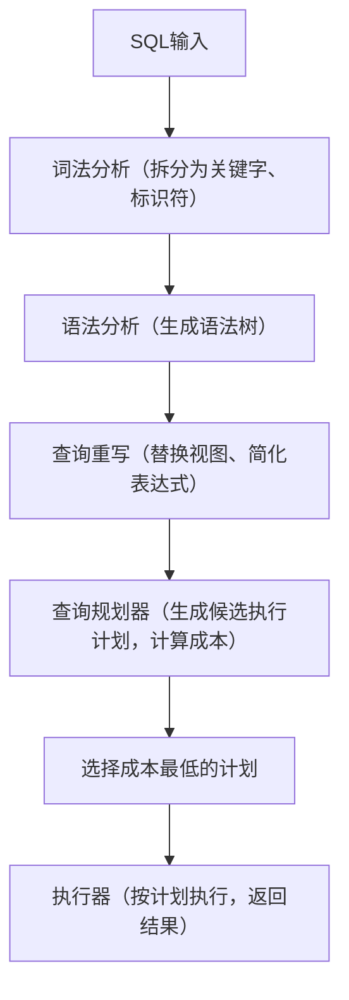

扫描[二维码](https://api2.cmdragon.cn/upload/cmder/20250304_012821924.jpg)
关注或者微信搜一搜：`编程智域 前端至全栈交流与成长`

[发现1000+提升效率与开发的AI工具和实用程序](https://tools.cmdragon.cn/zh/apps?category=ai_chat)：https://tools.cmdragon.cn/

### 一、理解PostgreSQL的查询执行流程

要规避SQL性能陷阱，首先得明白PostgreSQL如何处理你的查询。PostgreSQL的查询执行分为**5个核心步骤**，流程图如下：



关键环节是**查询规划器（Query Planner）**：它会根据表的统计信息（如行数、数据分布）生成多个候选执行计划，并选择**成本最低**
的那个（成本包括IO、CPU、内存开销）。

如果你的SQL写法导致规划器选了“坏计划”（比如全表扫描而非索引扫描），性能就会暴跌。因此，写SQL时要“引导”规划器做出正确选择。

### 二、常见性能陷阱及规避方法

下面是新手最常踩的7个性能陷阱，每个陷阱都附**可复现的例子**和**官网解决方案**。

#### 1. 陷阱1：忽略索引导致全表扫描

**问题**：当查询过滤条件（`WHERE`子句）没有对应的索引时，PostgreSQL会遍历表的所有行（全表扫描，`Seq Scan`），数据量大时极慢。

**例子**：  
假设你有一张`users`表（10万行），查询`name = 'User50000'`：

```sql
-- 创建表（含10万行测试数据）
CREATE TABLE users
(
    id    SERIAL PRIMARY KEY,
    name  VARCHAR(50)  NOT NULL,
    email VARCHAR(100) NOT NULL
);
INSERT INTO users (name, email)
SELECT 'User' || generate_series(1, 100000),
       'user' || generate_series(1, 100000) || '@example.com';

-- 无索引时，执行计划显示全表扫描
EXPLAIN
ANALYZE
SELECT *
FROM users
WHERE name = 'User50000';
-- 输出：Seq Scan on users (cost=0.00..1814.00 rows=1 width=44) (actual time=12.345..23.678 rows=1 loops=1)
```  

**解决**：为`name`列创建索引，引导规划器使用**索引扫描（Index Scan）**：

```sql
-- 创建B树索引（PostgreSQL默认索引类型）
CREATE INDEX idx_users_name ON users (name);

-- 再次执行，执行计划显示索引扫描
EXPLAIN
ANALYZE
SELECT *
FROM users
WHERE name = 'User50000';
-- 输出：Index Scan using idx_users_name on users (cost=0.29..8.30 rows=1 width=44) (actual time=0.012..0.013 rows=1 loops=1)
```  

**官网参考**：

- 索引基础：https://www.postgresql.org/docs/17/indexes.html
- 分析执行计划：https://www.postgresql.org/docs/17/using-explain.html

#### 2. 陷阱2：函数/表达式导致索引失效

**问题**：如果在索引列上使用函数或表达式（如`LOWER(email)`、`age > 20 + 5`），PostgreSQL无法直接使用索引——因为索引存储的是*
*原始值**，而非函数处理后的值。

**例子**：  
用`LOWER(email)`过滤，但`email`列只有普通索引：

```sql
-- 普通索引无法匹配函数处理后的值，执行计划显示全表扫描
EXPLAIN
ANALYZE
SELECT *
FROM users
WHERE LOWER(email) = 'user50000@example.com';
```  

**解决**：创建**函数索引（Functional Index）**，直接存储函数处理后的值：

```sql
-- 创建函数索引（存储LOWER(email)的结果）
CREATE INDEX idx_users_email_lower ON users (LOWER(email));

-- 再次执行，执行计划显示索引扫描
EXPLAIN
ANALYZE
SELECT *
FROM users
WHERE LOWER(email) = 'user50000@example.com';
```  

**注意**：函数索引会增加写入开销（插入/更新时需重新计算函数值），只在频繁查询的场景使用。

#### 3. 陷阱3：隐式类型转换破坏索引

**问题**：如果查询值的类型与索引列类型不一致，PostgreSQL会进行**隐式类型转换**，导致索引失效。

**例子**：  
`id`是`INT`类型，但查询用了字符串`'50000'`：

```sql
-- 隐式转换（id::TEXT = '50000'），索引失效，全表扫描
EXPLAIN
ANALYZE
SELECT *
FROM users
WHERE id = '50000';
```  

**解决**：始终使用与列类型一致的值（去掉字符串引号）：

```sql
-- 正确写法，执行计划显示索引扫描（id是主键，自带索引）
EXPLAIN
ANALYZE
SELECT *
FROM users
WHERE id = 50000;
```  

**官网参考**：

- 类型转换规则：https://www.postgresql.org/docs/17/typeconv.html

#### 4. 陷阱4：复合索引的顺序错误

**问题**：复合索引（多列索引）的顺序至关重要——PostgreSQL的B树索引是**前缀匹配**的，只有当查询条件包含索引的“前缀列”时，才能高效使用索引。

**例子**：  
假设`orders`表有`user_id`（频繁过滤）和`order_date`（范围查询），正确的复合索引顺序是`(user_id, order_date)`：

```sql
-- 创建表（含20万行测试数据）
CREATE TABLE orders
(
    id         SERIAL PRIMARY KEY,
    user_id    INT         NOT NULL,
    product    VARCHAR(50) NOT NULL,
    order_date TIMESTAMP DEFAULT CURRENT_TIMESTAMP
);
INSERT INTO orders (user_id, product)
SELECT floor(random() * 100000) + 1, -- 随机user_id（1-10万）
       'Product' || floor(random() * 100) + 1
FROM generate_series(1, 200000);

-- 正确的复合索引：user_id在前（前缀列），order_date在后
CREATE INDEX idx_orders_userid_orderdate ON orders (user_id, order_date);

-- 查询会高效使用索引：先匹配user_id=50000，再范围扫描order_date
EXPLAIN
ANALYZE
SELECT *
FROM orders
WHERE user_id = 5000
  AND order_date > '2023-01-01';
```  

**错误案例**：如果索引顺序是`(order_date, user_id)`，上述查询会无法利用前缀匹配，只能全表扫描或低效的索引扫描。

**官网参考**：

- 复合索引：https://www.postgresql.org/docs/17/indexes-multicolumn.html

#### 5. 陷阱5：不必要的`SELECT *`浪费资源

**问题**：`SELECT *`会返回表的所有列，包括你不需要的大字段（如`text`、`bytea`、`JSONB`），增加**IO开销**（读更多磁盘数据）和*
*网络开销**（传更多数据）。

**例子**：  
`users`表有`profile_photo`（`bytea`类型，存储头像），但你只需要`name`和`email`：

```sql
-- 坏写法：返回所有列（包括profile_photo）
EXPLAIN
ANALYZE
SELECT *
FROM users
WHERE id = 50000;

-- 好写法：只返回需要的列，IO和网络开销减少90%
EXPLAIN
ANALYZE
SELECT name, email
FROM users
WHERE id = 50000;
```  

**建议**：永远只选你需要的列，除非表只有几列且你确实需要全部数据。

#### 6. 陷阱6：JOIN操作的笛卡尔积与顺序

**问题**：

- 忘记写`ON`条件会导致**笛卡尔积**（`A JOIN B`返回`A行数×B行数`，数据量爆炸）；
- 统计信息过时会导致规划器选错误的`JOIN`顺序（比如小表驱动大表变成大表驱动小表）。

**例子**：

```sql
-- 错误：无ON条件，笛卡尔积（10万×20万=20亿行，切勿执行！）
SELECT *
FROM users
         JOIN orders;

-- 正确：添加ON条件，使用索引关联
EXPLAIN
ANALYZE
SELECT u.name, o.product
FROM users u
         JOIN orders o ON u.id = o.user_id -- 关键：ON条件
WHERE u.name = 'User50000';
```  

**优化JOIN顺序**：  
PostgreSQL会自动优化`JOIN`顺序，但如果表数据变化大（比如插入了10万行但没更新统计信息），规划器可能选“坏顺序”。此时需手动更新统计信息：

```sql
-- 更新表的统计信息（让规划器知道表的真实数据分布）
ANALYZE
users;
ANALYZE
orders;
```  

#### 7. 陷阱7：CTE的“优化围栏”问题（PostgreSQL 12前）

**问题**：CTE（`WITH`子句）在PostgreSQL 12之前是**优化围栏（Optimization Fence）**——即CTE会被强制先执行，无法与外层查询合并优化，导致性能下降。

**例子**：  
PostgreSQL 11及更早版本中，以下查询会先执行CTE`recent_orders`（全表扫描`orders`），再与`users`关联：

```sql
WITH recent_orders AS (SELECT *
                       FROM orders
                       WHERE order_date > '2023-01-01')
SELECT u.name, ro.product
FROM users u
         JOIN recent_orders ro ON u.id = ro.user_id;
```  

**解决**：

- PostgreSQL
  12+：可折叠的CTE（无副作用、非递归）会被合并优化，上述查询等价于`SELECT u.name, o.product FROM users u JOIN orders o ON u.id = o.user_id WHERE o.order_date > '2023-01-01'`；
- 若使用旧版本：优先用子查询代替CTE（除非需要重复使用结果集）。

**官网参考**：

- CTE使用说明：https://www.postgresql.org/docs/17/queries-with.html

### 三、用`EXPLAIN ANALYZE`诊断性能问题

要知道你的SQL有没有踩陷阱，**必须看执行计划**！`EXPLAIN ANALYZE`会显示PostgreSQL实际执行的步骤和时间。

**关键执行计划术语**：

- `Seq Scan`：全表扫描（要避免）；
- `Index Scan`：索引扫描（高效）；
- `Bitmap Heap Scan`：结合位图索引的扫描（适合多条件过滤）；
- `Nested Loop Join`：嵌套循环（适合小表关联）；
- `Hash Join`：哈希连接（适合大表关联）。

**例子**：

```sql
-- 分析JOIN查询的执行计划
EXPLAIN
ANALYZE
SELECT u.name, o.product
FROM users u
         JOIN orders o ON u.id = o.user_id
WHERE u.name = 'User50000';
```  

**输出解读**：

1. 首先用`idx_users_name`索引找到`User50000`的`id`（`Index Scan on users`）；
2. 然后用`orders`的`user_id`索引关联（`Nested Loop Join`）；
3. 最后返回结果。

### 课后Quiz：巩固你的理解

#### 问题1：为什么`WHERE LOWER(email) = 'alice@example.com'`无法使用`email`列的普通索引？如何解决？

**答案解析**：  
普通索引存储的是`email`的原始值（如`Alice@example.com`），而`LOWER(email)`转换后的值（`alice@example.com`
）不在索引中，因此无法匹配。  
**解决**：创建函数索引：

```sql
CREATE INDEX idx_users_email_lower ON users (LOWER(email));
```  

#### 问题2：复合索引`(user_id, order_date)`和`(order_date, user_id)`有什么区别？哪种更适合`WHERE user_id = 123 AND order_date > '2023-06-01'`？

**答案解析**：

- `(user_id, order_date)`：优先匹配`user_id`（前缀），适合`user_id`过滤+`order_date`范围查询；
- `(order_date, user_id)`：优先匹配`order_date`，适合`order_date`过滤+`user_id`查询。  
  **更适合的索引**：`(user_id, order_date)`。

#### 问题3：为什么要避免`SELECT *`？举一个实际场景说明危害。

**答案解析**：  
`SELECT *`会返回不必要的大字段（如`profile_photo`），增加IO和网络开销。  
**场景**：`users`表有`profile_photo`（`bytea`类型），`SELECT *`会返回头像数据，但你只需要`name`和`email`
——改用`SELECT name, email`可减少90%以上的传输数据量。

### 常见报错及解决方案

#### 报错1：`ERROR:  syntax error at or near "WHERE"`

**例子**：`SELECT name FROM users WHERE name = 'Alice' WHERE age > 18;`  
**原因**：重复`WHERE`关键字（SQL中`WHERE`只能出现一次）。  
**解决**：用`AND`合并条件：`SELECT name FROM users WHERE name = 'Alice' AND age > 18;`

#### 报错2：`ERROR:  column "namee" does not exist`

**例子**：`SELECT namee FROM users;`  
**原因**：列名拼写错误（`namee`应为`name`）。  
**解决**：用`\d users`（psql命令）查看表结构，或使用SQL编辑器的自动补全。

#### 报错3：`ERROR:  operator does not exist: integer = text`

**例子**：`SELECT * FROM users WHERE id = '5';`  
**原因**：`id`是`INT`类型，`'5'`是`TEXT`类型，类型不匹配。  
**解决**：去掉引号：`SELECT * FROM users WHERE id = 5;`

参考链接：

- 索引使用指南：https://www.postgresql.org/docs/17/indexes.html
- 使用EXPLAIN分析执行计划：https://www.postgresql.org/docs/17/using-explain.html
- CTE使用说明：https://www.postgresql.org/docs/17/queries-with.html
- 统计信息与autovacuum：https://www.postgresql.org/docs/17/planner-stats.html

余下文章内容请点击跳转至 个人博客页面 或者 扫码关注或者微信搜一搜：`编程智域 前端至全栈交流与成长`
，阅读完整的文章：[PostgreSQL新手SQL总翻车？这7个性能陷阱你踩过没？](https://blog.cmdragon.cn/posts/068ecb772a87d7df20a8c9fb4b233f8e/)


<details>
<summary>往期文章归档</summary>

- [PostgreSQL索引选B-Tree还是GiST？“瑞士军刀”和“多面手”的差别你居然还不知道？ - cmdragon's Blog](https://blog.cmdragon.cn/posts/d498f63cd0a2d5a77e445c688a8b88db/)
- [想知道数据库怎么给查询“算成本选路线”？EXPLAIN能帮你看明白？ - cmdragon's Blog](https://blog.cmdragon.cn/posts/9101b75bdec6faea9b35d54f14e37f36/)
- [PostgreSQL处理SQL居然像做蛋糕？解析到执行的4步里藏着多少查询优化的小心机？ - cmdragon's Blog](https://blog.cmdragon.cn/posts/d527f8ebb6e3dae2c7dfe4c8d8979444/)
- [PostgreSQL备份不是复制文件？物理vs逻辑咋选？误删还能精准恢复到1分钟前？ - cmdragon's Blog](https://blog.cmdragon.cn/posts/6bfdae84f313cf7ad0bb7045c4392347/)
- [转账不翻车、并发不干扰，PostgreSQL的ACID特性到底有啥魔法？ - cmdragon's Blog](https://blog.cmdragon.cn/posts/de3672803de34dbad244d0a8d48b0eb5/)
- [银行转账不白扣钱、电商下单不超卖，PostgreSQL事务的诀窍是啥？ - cmdragon's Blog](https://blog.cmdragon.cn/posts/e463e8a2668abdf00a228c9b79324ded/)
- [PostgreSQL里的PL/pgSQL到底是啥？能让SQL从“说目标”变“讲步骤”？ - cmdragon's Blog](https://blog.cmdragon.cn/posts/5c967e595058c4a1fc4474a68e64031d/)
- [PostgreSQL视图不存数据？那它怎么简化查询还能递归生成序列和控制权限？ - cmdragon's Blog](https://blog.cmdragon.cn/posts/325047855e3e23b5ef82f7d2db134fbd/)
- [PostgreSQL索引这么玩，才能让你的查询真的“飞”起来？ - cmdragon's Blog](https://blog.cmdragon.cn/posts/d2dba50bb6e4df7b27e735245a06a2a2/)
- [PostgreSQL的表关系和约束，咋帮你搞定用户订单不混乱、学生选课不重复？ - cmdragon's Blog](https://blog.cmdragon.cn/posts/849ae5bab0f8c66e94c2f6ad1bb798e3/)
- [PostgreSQL查询的筛子、排序、聚合、分组？你会用它们搞定数据吗？ - cmdragon's Blog](https://blog.cmdragon.cn/posts/ef4800975ffa84f1ca51976a70a1585b/)
- [PostgreSQL数据类型怎么选才高效不踩坑？ - cmdragon's Blog](https://blog.cmdragon.cn/posts/bf54711525c507c5eacfa7b0151c39d2/)
- [想解锁PostgreSQL查询从基础到进阶的核心知识点？你都get了吗？ - cmdragon's Blog](https://blog.cmdragon.cn/posts/887809b3e0375f5956873cd442f516d8/)
- [PostgreSQL DELETE居然有这些操作？返回数据、连表删你试过没？ - cmdragon's Blog](https://blog.cmdragon.cn/posts/934be1203725e8be9d6f6e9104e5abcc/)
- [PostgreSQL UPDATE语句怎么玩？从改邮箱到批量更新的避坑技巧你都会吗？ - cmdragon's Blog](https://blog.cmdragon.cn/posts/0f0622e9b7402b599e618150d0596ffe/)
- [PostgreSQL插入数据还在逐条敲？批量、冲突处理、返回自增ID的技巧你会吗？ - cmdragon's Blog](https://blog.cmdragon.cn/posts/0e3bf7efc030b024ea67ee855a00f2de/)
- [PostgreSQL的“仓库-房间-货架”游戏，你能建出电商数据库和表吗？ - cmdragon's Blog](https://blog.cmdragon.cn/posts/b6cd3c86da6aac26ed829e472d34078e/)
- [PostgreSQL 17安装总翻车？Windows/macOS/Linux避坑指南帮你搞定？ - cmdragon's Blog](https://blog.cmdragon.cn/posts/ba1f545a3410144552fbdbfcf31b5265/)
- [能当关系型数据库还能玩对象特性，能拆复杂查询还能自动管库存，PostgreSQL凭什么这么香？ - cmdragon's Blog](https://blog.cmdragon.cn/posts/b5474d1480509c5072085abc80b3dd9f/)
- [给接口加新字段又不搞崩老客户端？FastAPI的多版本API靠哪三招实现？ - cmdragon's Blog](https://blog.cmdragon.cn/posts/cc098d8836e787baa8a4d92e4d56d5c5/)
- [流量突增要搞崩FastAPI？熔断测试是怎么防系统雪崩的？ - cmdragon's Blog](https://blog.cmdragon.cn/posts/46d05151c5bd31cf37a7bcf0b8f5b0b8/)
- [FastAPI秒杀库存总变负数？Redis分布式锁能帮你守住底线吗 - cmdragon's Blog](https://blog.cmdragon.cn/posts/65ce343cc5df9faf3a8e2eeaab42ae45/)
- [FastAPI的CI流水线怎么自动测端点，还能让Allure报告美到犯规？ - cmdragon's Blog](https://blog.cmdragon.cn/posts/eed6cd8985d9be0a4b092a7da38b3e0c/)
- [如何用GitHub Actions为FastAPI项目打造自动化测试流水线？ - cmdragon's Blog](https://blog.cmdragon.cn/posts/6157d87338ce894d18c013c3c4777abb/)
- [如何用Git Hook和CI流水线为FastAPI项目保驾护航？ - cmdragon's Blog](https://blog.cmdragon.cn/posts/fc4ef84559e04693a620d0714cb30787/)
- [FastAPI如何用契约测试确保API的「菜单」与「菜品」一致？](https://blog.cmdragon.cn/posts/02b0c96842d1481c72dab63a149ce0dd/)
- [为什么TDD能让你的FastAPI开发飞起来？ - cmdragon's Blog](https://blog.cmdragon.cn/posts/c9c1e3bb0fdc15303b9b3b1f20124b0b/)
- [如何用FastAPI玩转多模块测试与异步任务，让代码不再“闹脾气”？ - cmdragon's Blog](https://blog.cmdragon.cn/posts/ddbfa0447a5d0d6f9af12e7a6b206f70/)
- [如何在FastAPI中玩转“时光倒流”的数据库事务回滚测试？](https://blog.cmdragon.cn/posts/bf9883a75ffa46b523a03b16ec56ce48/)
- [如何在FastAPI中优雅地模拟多模块集成测试？ - cmdragon's Blog](https://blog.cmdragon.cn/posts/be553dbd5d51835d2c69553f4a773e2d/)
- [多环境配置切换机制能否让开发与生产无缝衔接？ - cmdragon's Blog](https://blog.cmdragon.cn/posts/533874f5700b8506d4c68781597db659/)
- [如何在 FastAPI 中巧妙覆盖依赖注入并拦截第三方服务调用？ - cmdragon's Blog](https://blog.cmdragon.cn/posts/2d992ef9e8962dc0a4a0b5348d486114/)
- [为什么你的单元测试需要Mock数据库才能飞起来？ - cmdragon's Blog](https://blog.cmdragon.cn/posts/6e69c0eedd8b1e5a74a148d36c85d7ce/)
- [如何在FastAPI中巧妙隔离依赖项，让单元测试不再头疼？ - cmdragon's Blog](https://blog.cmdragon.cn/posts/77ae327dc941b0e74ecc6a8794c084d0/)
- [如何在FastAPI中巧妙隔离依赖项，让单元测试不再头疼？ - cmdragon's Blog](https://blog.cmdragon.cn/posts/77ae327dc941b0e74ecc6a8794c084d0/)
- [测试覆盖率不够高？这些技巧让你的FastAPI测试无懈可击！ - cmdragon's Blog](https://blog.cmdragon.cn/posts/0577d0e24f48b3153b510e74d3d1a822/)
- [为什么你的FastAPI测试覆盖率总是低得让人想哭？ - cmdragon's Blog](https://blog.cmdragon.cn/posts/985c18ca802f1b6da828b92e082b4d4e/)
- [如何让FastAPI测试不再成为你的噩梦？ - cmdragon's Blog](https://blog.cmdragon.cn/posts/29858a7a10d20b4e4649cb75fb422eab/)
- [FastAPI测试环境配置的秘诀，你真的掌握了吗？ - cmdragon's Blog](https://blog.cmdragon.cn/posts/6f9e71e8313db6de8c1431877a70b67e/)
- [全链路追踪如何让FastAPI微服务架构的每个请求都无所遁形？ - cmdragon's Blog](https://blog.cmdragon.cn/posts/30e1d2fbf1ad8123eaf0e1e0dbe7c675/)
- [如何在API高并发中玩转资源隔离与限流策略？ - cmdragon's Blog](https://blog.cmdragon.cn/posts/4ad4ec1dbd80bcf5670fb397ca7cc68c/)
- [任务分片执行模式如何让你的FastAPI性能飙升？ - cmdragon's Blog](https://blog.cmdragon.cn/posts/c6a598639f6a831e9e82e171b8d71857/)
- [冷热任务分离：是提升Web性能的终极秘籍还是技术噱头？ - cmdragon's Blog](https://blog.cmdragon.cn/posts/9c3dc7767a9282f7ef02daad42539f2c/)

</details>


<details>
<summary>免费好用的热门在线工具</summary>

- [Mermaid 在线编辑器 - 应用商店 | By cmdragon](https://tools.cmdragon.cn/zh/apps/mermaid-live-editor)
- [数学求解计算器 - 应用商店 | By cmdragon](https://tools.cmdragon.cn/zh/apps/math-solver-calculator)
- [智能提词器 - 应用商店 | By cmdragon](https://tools.cmdragon.cn/zh/apps/smart-teleprompter)
- [魔法简历 - 应用商店 | By cmdragon](https://tools.cmdragon.cn/zh/apps/magic-resume)
- [Image Puzzle Tool - 图片拼图工具 | By cmdragon](https://tools.cmdragon.cn/zh/apps/image-puzzle-tool)
- [字幕下载工具 - 应用商店 | By cmdragon](https://tools.cmdragon.cn/zh/apps/subtitle-downloader)
- [歌词生成工具 - 应用商店 | By cmdragon](https://tools.cmdragon.cn/zh/apps/lyrics-generator)
- [网盘资源聚合搜索 - 应用商店 | By cmdragon](https://tools.cmdragon.cn/zh/apps/cloud-drive-search)
- [ASCII字符画生成器 - 应用商店 | By cmdragon](https://tools.cmdragon.cn/zh/apps/ascii-art-generator)
- [JSON Web Tokens 工具 - 应用商店 | By cmdragon](https://tools.cmdragon.cn/zh/apps/jwt-tool)
- [Bcrypt 密码工具 - 应用商店 | By cmdragon](https://tools.cmdragon.cn/zh/apps/bcrypt-tool)
- [GIF 合成器 - 应用商店 | By cmdragon](https://tools.cmdragon.cn/zh/apps/gif-composer)
- [GIF 分解器 - 应用商店 | By cmdragon](https://tools.cmdragon.cn/zh/apps/gif-decomposer)
- [文本隐写术 - 应用商店 | By cmdragon](https://tools.cmdragon.cn/zh/apps/text-steganography)
- [CMDragon 在线工具 - 高级AI工具箱与开发者套件 | 免费好用的在线工具](https://tools.cmdragon.cn/zh)
- [应用商店 - 发现1000+提升效率与开发的AI工具和实用程序 | 免费好用的在线工具](https://tools.cmdragon.cn/zh/apps?category=trending)
- [CMDragon 更新日志 - 最新更新、功能与改进 | 免费好用的在线工具](https://tools.cmdragon.cn/zh/changelog)
- [支持我们 - 成为赞助者 | 免费好用的在线工具](https://tools.cmdragon.cn/zh/sponsor)
- [AI文本生成图像 - 应用商店 | 免费好用的在线工具](https://tools.cmdragon.cn/zh/apps/text-to-image-ai)
- [临时邮箱 - 应用商店 | 免费好用的在线工具](https://tools.cmdragon.cn/zh/apps/temp-email)
- [二维码解析器 - 应用商店 | 免费好用的在线工具](https://tools.cmdragon.cn/zh/apps/qrcode-parser)
- [文本转思维导图 - 应用商店 | 免费好用的在线工具](https://tools.cmdragon.cn/zh/apps/text-to-mindmap)
- [正则表达式可视化工具 - 应用商店 | 免费好用的在线工具](https://tools.cmdragon.cn/zh/apps/regex-visualizer)
- [文件隐写工具 - 应用商店 | 免费好用的在线工具](https://tools.cmdragon.cn/zh/apps/steganography-tool)
- [IPTV 频道探索器 - 应用商店 | 免费好用的在线工具](https://tools.cmdragon.cn/zh/apps/iptv-explorer)
- [快传 - 应用商店 | 免费好用的在线工具](https://tools.cmdragon.cn/zh/apps/snapdrop)
- [随机抽奖工具 - 应用商店 | 免费好用的在线工具](https://tools.cmdragon.cn/zh/apps/lucky-draw)
- [动漫场景查找器 - 应用商店 | 免费好用的在线工具](https://tools.cmdragon.cn/zh/apps/anime-scene-finder)
- [时间工具箱 - 应用商店 | 免费好用的在线工具](https://tools.cmdragon.cn/zh/apps/time-toolkit)
- [网速测试 - 应用商店 | 免费好用的在线工具](https://tools.cmdragon.cn/zh/apps/speed-test)
- [AI 智能抠图工具 - 应用商店 | 免费好用的在线工具](https://tools.cmdragon.cn/zh/apps/background-remover)
- [背景替换工具 - 应用商店 | 免费好用的在线工具](https://tools.cmdragon.cn/zh/apps/background-replacer)
- [艺术二维码生成器 - 应用商店 | 免费好用的在线工具](https://tools.cmdragon.cn/zh/apps/artistic-qrcode)
- [Open Graph 元标签生成器 - 应用商店 | 免费好用的在线工具](https://tools.cmdragon.cn/zh/apps/open-graph-generator)
- [图像对比工具 - 应用商店 | 免费好用的在线工具](https://tools.cmdragon.cn/zh/apps/image-comparison)
- [图片压缩专业版 - 应用商店 | 免费好用的在线工具](https://tools.cmdragon.cn/zh/apps/image-compressor)
- [密码生成器 - 应用商店 | 免费好用的在线工具](https://tools.cmdragon.cn/zh/apps/password-generator)
- [SVG优化器 - 应用商店 | 免费好用的在线工具](https://tools.cmdragon.cn/zh/apps/svg-optimizer)
- [调色板生成器 - 应用商店 | 免费好用的在线工具](https://tools.cmdragon.cn/zh/apps/color-palette)
- [在线节拍器 - 应用商店 | 免费好用的在线工具](https://tools.cmdragon.cn/zh/apps/online-metronome)
- [IP归属地查询 - 应用商店 | 免费好用的在线工具](https://tools.cmdragon.cn/zh/apps/ip-geolocation)
- [CSS网格布局生成器 - 应用商店 | 免费好用的在线工具](https://tools.cmdragon.cn/zh/apps/css-grid-layout)
- [邮箱验证工具 - 应用商店 | 免费好用的在线工具](https://tools.cmdragon.cn/zh/apps/email-validator)
- [书法练习字帖 - 应用商店 | 免费好用的在线工具](https://tools.cmdragon.cn/zh/apps/calligraphy-practice)
- [金融计算器套件 - 应用商店 | 免费好用的在线工具](https://tools.cmdragon.cn/zh/apps/finance-calculator-suite)
- [中国亲戚关系计算器 - 应用商店 | 免费好用的在线工具](https://tools.cmdragon.cn/zh/apps/chinese-kinship-calculator)
- [Protocol Buffer 工具箱 - 应用商店 | 免费好用的在线工具](https://tools.cmdragon.cn/zh/apps/protobuf-toolkit)
- [IP归属地查询 - 应用商店 | 免费好用的在线工具](https://tools.cmdragon.cn/zh/apps/ip-geolocation)
- [图片无损放大 - 应用商店 | 免费好用的在线工具](https://tools.cmdragon.cn/zh/apps/image-upscaler)
- [文本比较工具 - 应用商店 | 免费好用的在线工具](https://tools.cmdragon.cn/zh/apps/text-compare)
- [IP批量查询工具 - 应用商店 | 免费好用的在线工具](https://tools.cmdragon.cn/zh/apps/ip-batch-lookup)
- [域名查询工具 - 应用商店 | 免费好用的在线工具](https://tools.cmdragon.cn/zh/apps/domain-finder)
- [DNS工具箱 - 应用商店 | 免费好用的在线工具](https://tools.cmdragon.cn/zh/apps/dns-toolkit)
- [网站图标生成器 - 应用商店 | 免费好用的在线工具](https://tools.cmdragon.cn/zh/apps/favicon-generator)
- [XML Sitemap](https://tools.cmdragon.cn/sitemap_index.xml)

</details>