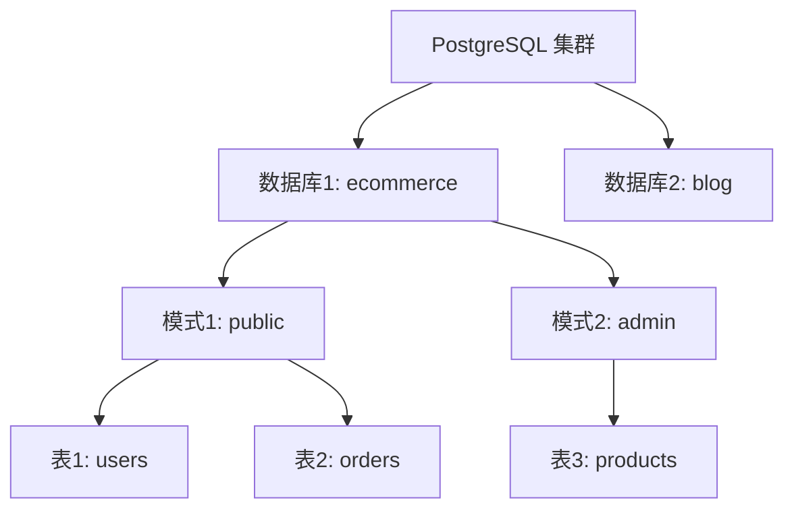

扫描[二维码](https://api2.cmdragon.cn/upload/cmder/20250304_012821924.jpg)
关注或者微信搜一搜：`编程智域 前端至全栈交流与成长`

[发现1000+提升效率与开发的AI工具和实用程序](https://tools.cmdragon.cn/zh/apps?category=ai_chat)：https://tools.cmdragon.cn/

### 一、PostgreSQL 数据库的层级结构

在开始创建数据库和表之前，我们需要先理解 PostgreSQL 的**数据组织层级**——这是后续操作的基础。PostgreSQL
用“集群-数据库-模式-表”的层级结构管理数据，就像一个“仓库-房间-货架-盒子”的模型：

1. **数据库集群（Cluster）**：整个 PostgreSQL 服务实例，相当于一个大仓库，包含所有数据文件和配置。
2. **数据库（Database）**：集群中的独立“房间”，每个数据库完全隔离（比如电商系统的`ecommerce`数据库和博客系统的`blog`数据库互不干扰）。
3. **模式（Schema）**：数据库内的“货架”，用来组织表、视图等对象（默认模式是`public`）。
4. **表（Table）**：模式中的“盒子”，存储具体的行和列数据。

我们可以用流程图直观展示这种关系：



### 二、创建 PostgreSQL 数据库

数据库是存储表的容器，创建数据库有**命令行工具**和**SQL语句**两种方式，我们逐一讲解。

#### 2.1 用 `createdb` 命令行工具创建

`createdb` 是 PostgreSQL 自带的命令行工具，适合快速创建数据库。语法如下：

```bash
createdb [选项] 数据库名
```

常见选项：

- `-h`：指定数据库主机（默认`localhost`）；
- `-p`：指定端口（默认`5432`）；
- `-U`：指定连接用户（默认当前系统用户）；
- `-O`：指定数据库所有者。

**示例**：创建一个名为`ecommerce`的数据库，所有者为`postgres`用户：

```bash
createdb -U postgres ecommerce
```

#### 2.2 用 `CREATE DATABASE` SQL 语句创建

如果已经通过`psql`或其他客户端连接到 PostgreSQL，可以用 SQL 语句创建数据库，灵活性更高。语法如下：

```sql
CREATE DATABASE 数据库名
[WITH 参数1 = 值1 参数2 = 值2 ...];
```

常用参数：

- `OWNER`：数据库所有者（默认当前用户）；
- `ENCODING`：字符编码（推荐`UTF8`，支持中文）；
- `LC_COLLATE`：排序规则（比如`en_US.utf8`或`zh_CN.utf8`）；
- `TEMPLATE`：基于哪个模板创建（默认`template1`）。

**示例**：创建一个支持中文的电商数据库：

```sql
CREATE DATABASE ecommerce
WITH 
  OWNER = postgres
  ENCODING = 'UTF8'
  LC_COLLATE = 'zh_CN.utf8'  -- 中文排序规则（提示：排序规则不兼容，可更换或删除）
  LC_CTYPE = 'zh_CN.utf8'    -- 中文字符分类（提示：排序规则不兼容，可更换或删除）
  TABLESPACE = pg_default    -- 表空间（默认即可）
  CONNECTION LIMIT = -1;     -- 无连接数限制
```

查询当前数据库支持的中文排序规则：

```sql
SELECT collname FROM pg_collation WHERE collname LIKE 'zh%';
```

#### 2.3 验证数据库是否创建成功

用`psql`连接到 PostgreSQL，输入`\l`命令（List Databases），如果看到`ecommerce`出现在列表中，说明创建成功：

```bash
psql -U postgres
postgres=# \l
```

### 三、创建 PostgreSQL 表

表是存储数据的核心对象，创建表需要定义**列名**、**数据类型**和**约束**（确保数据的完整性）。

#### 3.1 表的基本结构

创建表的 SQL 语句是`CREATE TABLE`，基本语法：

```sql
CREATE TABLE 表名 (
    列名1 数据类型 [约束],
    列名2 数据类型 [约束],
    ...
    [表级约束]
);
```

#### 3.2 关键概念：数据类型

PostgreSQL 支持丰富的数据类型，常用的有：
| 类型分类 | 示例类型 | 说明 |
|----------|----------|------|
| 数值型 | `INT`（整数）、`BIGINT`（长整数）、`NUMERIC(10,2)`（精确小数，保留2位） | 存储金额、数量等 |
| 字符串型 | `VARCHAR(50)`（可变长度字符串，最长50）、`TEXT`（无长度限制） | 存储用户名、邮箱等 |
| 日期时间型 | `TIMESTAMP`（带时区的时间戳）、`DATE`（日期）、`TIME`（时间） | 存储下单时间、注册时间等 |
| 布尔型 | `BOOLEAN` | 存储状态（比如`is_active`表示用户是否激活） |

详细数据类型参考：[PostgreSQL 数据类型文档](https://www.postgresql.org/docs/17/datatype.html)

#### 3.3 关键概念：约束

约束是保证数据正确性的规则，常用约束包括：

1. **主键（PRIMARY KEY）**：唯一标识表中的行，非空且唯一（一个表只能有一个主键）；
2. **外键（FOREIGN KEY）**：关联其他表的主键，保证数据一致性；
3. **非空（NOT NULL）**：字段不能为`NULL`；
4. **唯一（UNIQUE）**：字段值唯一；
5. **检查（CHECK）**：自定义条件（比如`age >= 18`）。

#### 3.4 实战：创建电商系统的表

我们以电商系统为例，创建`users`（用户表）和`orders`（订单表），完整流程如下：

##### 步骤1：连接到目标数据库

首先用`\c`命令切换到`ecommerce`数据库：

```sql
\c
ecommerce;
```

##### 步骤2：创建`users`表（用户表）

`users`表需要存储用户的ID、用户名、邮箱、密码哈希和注册时间：

```sql
CREATE TABLE users (
    user_id SERIAL PRIMARY KEY,  -- SERIAL：自增整数（自动创建序列），作为主键
    username VARCHAR(50) NOT NULL UNIQUE,  -- 用户名：非空且唯一
    email VARCHAR(100) NOT NULL UNIQUE,    -- 邮箱：非空且唯一
    password_hash VARCHAR(255) NOT NULL,   -- 密码哈希：非空（不能存明文！）
    created_at TIMESTAMP DEFAULT CURRENT_TIMESTAMP  -- 注册时间：默认当前时间
);
```

**说明**：

- `SERIAL`类型会自动创建一个序列（比如`users_user_id_seq`），每次插入数据时自动生成下一个ID；
- `DEFAULT CURRENT_TIMESTAMP`表示如果插入时不指定`created_at`，自动填充当前时间。

##### 步骤3：创建`orders`表（订单表）

`orders`表需要关联`users`表（通过`user_id`外键），并记录订单金额、时间：

```sql
CREATE TABLE orders (
    order_id SERIAL PRIMARY KEY,
    user_id INT NOT NULL,  -- 关联用户表的user_id
    order_total NUMERIC(10,2) NOT NULL CHECK (order_total > 0),  -- 订单金额：精确到分，且必须大于0
    order_date TIMESTAMP DEFAULT CURRENT_TIMESTAMP,
    -- 外键约束：user_id必须存在于users表的user_id中
    FOREIGN KEY (user_id) REFERENCES users(user_id) ON DELETE CASCADE
);
```

**关键约束说明**：

- `CHECK (order_total > 0)`：确保订单金额不为0或负数；
- `FOREIGN KEY (user_id) REFERENCES users(user_id)`：`orders`的`user_id`必须是`users`表中已有的ID；
- `ON DELETE CASCADE`：如果删除`users`表中的某条用户数据，`orders`表中关联的订单会自动删除（避免无效订单）。

##### 步骤4：验证表是否创建成功

用`\d`命令（List Tables）查看当前数据库的表：

```sql
\d
```

会看到`users`和`orders`表出现在列表中，说明创建成功。

### 四、插入与查询数据（验证表结构）

创建表后，我们插入一些测试数据，验证表的约束是否生效。

#### 4.1 插入用户数据

```sql
INSERT INTO users (username, email, password_hash)
VALUES 
('alice', 'alice@example.com', 'hashed_pass_123'),  -- 有效数据
('bob', 'bob@example.com', 'hashed_pass_456');     -- 有效数据
```

**注意**：不需要指定`user_id`和`created_at`，因为`SERIAL`和`DEFAULT`会自动填充。

#### 4.2 插入订单数据

```sql
INSERT INTO orders (user_id, order_total)
VALUES 
(1, 99.99),  -- 用户1（alice）的订单，金额99.99
(2, 199.50); -- 用户2（bob）的订单，金额199.50
```

**测试无效数据**：如果尝试插入`order_total = 0`的订单：

```sql
INSERT INTO orders (user_id, order_total) VALUES (1, 0);
```

会报错：

```
ERROR:  check constraint "orders_order_total_check" violated
```

这说明检查约束生效了！

#### 4.3 查询关联数据

用`JOIN`语句查询用户的订单信息：

```sql
SELECT 
    u.username,    -- 用户名
    o.order_id,    -- 订单ID
    o.order_total, -- 订单金额
    o.order_date   -- 下单时间
FROM users u
JOIN orders o ON u.user_id = o.user_id;
```

**结果**：
| username | order_id | order_total | order_date |
|----------|----------|--------------|---------------------|
| alice | 1 | 99.99 | 2024-05-20 14:30:00 |
| bob | 2 | 199.50 | 2024-05-20 14:31:00 |

### 五、课后 Quiz：巩固所学知识

1. **题目1**：写出创建名为`blog`的数据库的SQL语句，要求：
    - 所有者为`admin`用户；
    - 字符编码为`UTF8`；
    - 连接数限制为`100`。
      **答案**：
   ```sql
   CREATE DATABASE blog
   WITH 
     OWNER = admin
     ENCODING = 'UTF8'
     CONNECTION LIMIT = 100;
   ```
   **解析**：参考`CREATE DATABASE`的参数说明（[链接](https://www.postgresql.org/docs/17/sql-createdatabase.html)）。

2. **题目2**：为什么`orders`表要使用`FOREIGN KEY (user_id) REFERENCES users(user_id)`？
   **答案**：确保订单数据的一致性——不能存在“属于不存在的用户”的订单。如果删除`users`表中的某条用户数据，`ON DELETE CASCADE`
   会自动删除关联的订单（避免无效数据）。
   **解析**
   ：参考外键约束文档（[链接](https://www.postgresql.org/docs/17/ddl-constraints.html#DDL-CONSTRAINTS-FOREIGN-KEYS)）。

3. **题目3**：`users`表中的`username`字段有`UNIQUE`约束，插入重复的用户名会发生什么？
   **答案**：会报错`ERROR: duplicate key value violates unique constraint "users_username_key"`，因为违反了唯一约束。
   **解析**
   ：参考唯一约束文档（[链接](https://www.postgresql.org/docs/17/ddl-constraints.html#DDL-CONSTRAINTS-UNIQUE-CONSTRAINTS)）。

### 六、常见报错及解决方案

在创建数据库或表时，你可能遇到以下错误，我们给出**原因**、**解决办法**和**预防建议**：

#### 6.1 错误1：`ERROR: database "ecommerce" already exists`

- **原因**：要创建的数据库已经存在。
- **解决**：删除现有数据库（`DROP DATABASE ecommerce;`），或换一个数据库名。
- **预防**：用`\l`命令查看现有数据库，避免重复。

#### 6.2 错误2：`ERROR: syntax error at or near "SERIAL"`

- **原因**：`SERIAL`拼写错误（比如写成`SERAL`），或在不支持的位置使用（比如外键字段不能用`SERIAL`）。
- **解决**：检查`SERIAL`的拼写，确保只在**主键或自增字段**使用。
- **预防**：参考`SERIAL`类型文档（[链接](https://www.postgresql.org/docs/17/datatype-numeric.html#DATATYPE-SERIAL)）。

#### 6.3 错误3：`ERROR: insert or update on table "orders" violates foreign key constraint "orders_user_id_fkey"`

- **原因**：插入的`user_id`在`users`表中不存在（比如插入`user_id = 3`，但`users`表中只有`1`和`2`）。
- **解决**：先插入对应的用户数据，或修正`user_id`为存在的值。
- **预防**：插入订单前，用`SELECT * FROM users WHERE user_id = ?`检查用户是否存在。

#### 6.4 错误4：`ERROR: permission denied to create database`

- **原因**：当前用户没有创建数据库的权限。
- **解决**：切换到超级用户（比如`postgres`）创建，或给用户授予`CREATEDB`权限：
  ```sql
  ALTER USER myuser CREATEDB;
  ```
- **预防**：创建用户时明确授予权限（`CREATE USER myuser WITH CREATEDB;`）。

### 参考链接

以下是本文参考的 PostgreSQL 官方文档链接，建议深入阅读：

1. 数据库概念：https://www.postgresql.org/docs/17/
2. 创建数据库：https://www.postgresql.org/docs/17/tutorial-table.html
3. 创建表：https://www.postgresql.org/docs/17/tutorial-create.html
4. `CREATE DATABASE` 语句：https://www.postgresql.org/docs/17/sql-createdatabase.html
5. `CREATE TABLE` 语句：https://www.postgresql.org/docs/17/sql-createtable.html
6. 数据类型：https://www.postgresql.org/docs/17/datatype.html
7. 约束：https://www.postgresql.org/docs/17/ddl-constraints.html
8. 错误代码：https://www.postgresql.org/docs/17/errcodes-appendix.html

余下文章内容请点击跳转至 个人博客页面 或者 扫码关注或者微信搜一搜：`编程智域 前端至全栈交流与成长`
，阅读完整的文章：[PostgreSQL的“仓库-房间-货架”游戏，你能建出电商数据库和表吗？](https://blog.cmdragon.cn/posts/b6cd3c86da6aac26ed829e472d34078e/)


<details>
<summary>往期文章归档</summary>

- [PostgreSQL 17安装总翻车？Windows/macOS/Linux避坑指南帮你搞定？ - cmdragon's Blog](https://blog.cmdragon.cn/posts/ba1f545a3410144552fbdbfcf31b5265/)
- [能当关系型数据库还能玩对象特性，能拆复杂查询还能自动管库存，PostgreSQL凭什么这么香？ - cmdragon's Blog](https://blog.cmdragon.cn/posts/b5474d1480509c5072085abc80b3dd9f/)
- [给接口加新字段又不搞崩老客户端？FastAPI的多版本API靠哪三招实现？ - cmdragon's Blog](https://blog.cmdragon.cn/posts/cc098d8836e787baa8a4d92e4d56d5c5/)
- [流量突增要搞崩FastAPI？熔断测试是怎么防系统雪崩的？ - cmdragon's Blog](https://blog.cmdragon.cn/posts/46d05151c5bd31cf37a7bcf0b8f5b0b8/)
    - [FastAPI秒杀库存总变负数？Redis分布式锁能帮你守住底线吗 - cmdragon's Blog](https://blog.cmdragon.cn/posts/65ce343cc5df9faf3a8e2eeaab42ae45/)
    - [FastAPI的CI流水线怎么自动测端点，还能让Allure报告美到犯规？ - cmdragon's Blog](https://blog.cmdragon.cn/posts/eed6cd8985d9be0a4b092a7da38b3e0c/)
    - [如何用GitHub Actions为FastAPI项目打造自动化测试流水线？ - cmdragon's Blog](https://blog.cmdragon.cn/posts/6157d87338ce894d18c013c3c4777abb/)
    - [如何用Git Hook和CI流水线为FastAPI项目保驾护航？ - cmdragon's Blog](https://blog.cmdragon.cn/posts/fc4ef84559e04693a620d0714cb30787/)
    - [FastAPI如何用契约测试确保API的「菜单」与「菜品」一致？](https://blog.cmdragon.cn/posts/02b0c96842d1481c72dab63a149ce0dd/)
    - [为什么TDD能让你的FastAPI开发飞起来？ - cmdragon's Blog](https://blog.cmdragon.cn/posts/c9c1e3bb0fdc15303b9b3b1f20124b0b/)
- [如何用FastAPI玩转多模块测试与异步任务，让代码不再“闹脾气”？ - cmdragon's Blog](https://blog.cmdragon.cn/posts/ddbfa0447a5d0d6f9af12e7a6b206f70/)
- [如何在FastAPI中玩转“时光倒流”的数据库事务回滚测试？](https://blog.cmdragon.cn/posts/bf9883a75ffa46b523a03b16ec56ce48/)
- [如何在FastAPI中优雅地模拟多模块集成测试？ - cmdragon's Blog](https://blog.cmdragon.cn/posts/be553dbd5d51835d2c69553f4a773e2d/)
- [多环境配置切换机制能否让开发与生产无缝衔接？ - cmdragon's Blog](https://blog.cmdragon.cn/posts/533874f5700b8506d4c68781597db659/)
- [如何在 FastAPI 中巧妙覆盖依赖注入并拦截第三方服务调用？ - cmdragon's Blog](https://blog.cmdragon.cn/posts/2d992ef9e8962dc0a4a0b5348d486114/)
- [为什么你的单元测试需要Mock数据库才能飞起来？ - cmdragon's Blog](https://blog.cmdragon.cn/posts/6e69c0eedd8b1e5a74a148d36c85d7ce/)
- [如何在FastAPI中巧妙隔离依赖项，让单元测试不再头疼？ - cmdragon's Blog](https://blog.cmdragon.cn/posts/77ae327dc941b0e74ecc6a8794c084d0/)
- [如何在FastAPI中巧妙隔离依赖项，让单元测试不再头疼？ - cmdragon's Blog](https://blog.cmdragon.cn/posts/77ae327dc941b0e74ecc6a8794c084d0/)
- [测试覆盖率不够高？这些技巧让你的FastAPI测试无懈可击！ - cmdragon's Blog](https://blog.cmdragon.cn/posts/0577d0e24f48b3153b510e74d3d1a822/)
- [为什么你的FastAPI测试覆盖率总是低得让人想哭？ - cmdragon's Blog](https://blog.cmdragon.cn/posts/985c18ca802f1b6da828b92e082b4d4e/)
- [如何让FastAPI测试不再成为你的噩梦？ - cmdragon's Blog](https://blog.cmdragon.cn/posts/29858a7a10d20b4e4649cb75fb422eab/)
- [FastAPI测试环境配置的秘诀，你真的掌握了吗？ - cmdragon's Blog](https://blog.cmdragon.cn/posts/6f9e71e8313db6de8c1431877a70b67e/)
- [全链路追踪如何让FastAPI微服务架构的每个请求都无所遁形？ - cmdragon's Blog](https://blog.cmdragon.cn/posts/30e1d2fbf1ad8123eaf0e1e0dbe7c675/)
- [如何在API高并发中玩转资源隔离与限流策略？ - cmdragon's Blog](https://blog.cmdragon.cn/posts/4ad4ec1dbd80bcf5670fb397ca7cc68c/)
- [任务分片执行模式如何让你的FastAPI性能飙升？ - cmdragon's Blog](https://blog.cmdragon.cn/posts/c6a598639f6a831e9e82e171b8d71857/)
- [冷热任务分离：是提升Web性能的终极秘籍还是技术噱头？ - cmdragon's Blog](https://blog.cmdragon.cn/posts/9c3dc7767a9282f7ef02daad42539f2c/)
- [如何让FastAPI在百万级任务处理中依然游刃有余？ - cmdragon's Blog](https://blog.cmdragon.cn/posts/469aae0e0f88c642ed8bc82e102b960b/)
- [如何让FastAPI与消息队列的联姻既甜蜜又可靠？ - cmdragon's Blog](https://blog.cmdragon.cn/posts/1bebb53f4d9d6fbd0ecbba97562c07b0/)
- [如何在FastAPI中巧妙实现延迟队列，让任务乖乖等待？ - cmdragon's Blog](https://blog.cmdragon.cn/posts/174450702d9e609a072a7d1aaa84750b/)
- [FastAPI的死信队列处理机制：为何你的消息系统需要它？ - cmdragon's Blog](https://blog.cmdragon.cn/posts/047b08957a0d617a87b72da6c3131e5d/)
- [如何让FastAPI任务系统在失败时自动告警并自我修复？ - cmdragon's Blog](https://blog.cmdragon.cn/posts/2f104637ecc916e906c002fa79ab8c80/)
- [如何用Prometheus和FastAPI打造任务监控的“火眼金睛”？ - cmdragon's Blog](https://blog.cmdragon.cn/posts/e7464e5b4d558ede1a7413fa0a2f96f3/)
- [如何用APScheduler和FastAPI打造永不宕机的分布式定时任务系统？ - cmdragon's Blog](https://blog.cmdragon.cn/posts/51a0ff47f509fb6238150a96f551b317/)
- [如何在 FastAPI 中玩转 APScheduler，让任务定时自动执行？ - cmdragon's Blog](https://blog.cmdragon.cn/posts/85564dd901c6d9b1a79d320970843caa/)
- [定时任务系统如何让你的Web应用自动完成那些烦人的重复工作？ - cmdragon's Blog](https://blog.cmdragon.cn/posts/2b27950aab76203a1af4e9e3deda8699/)
- [Celery任务监控的魔法背后藏着什么秘密？ - cmdragon's Blog](https://blog.cmdragon.cn/posts/f43335725bb3372ebc774db1b9f28d2d/)
- [如何让Celery任务像VIP客户一样享受优先待遇？ - cmdragon's Blog](https://blog.cmdragon.cn/posts/c24491a7ac7f7c5e9cf77596ebb27c51/)
- [如何让你的FastAPI Celery Worker在压力下优雅起舞？ - cmdragon's Blog](https://blog.cmdragon.cn/posts/c3129f4b424d2ed2330484b82ec31875/)

</details>


<details>
<summary>免费好用的热门在线工具</summary>

- [智能提词器 - 应用商店 | By cmdragon](https://tools.cmdragon.cn/zh/apps/smart-teleprompter)
- [魔法简历 - 应用商店 | By cmdragon](https://tools.cmdragon.cn/zh/apps/magic-resume)
- [Image Puzzle Tool - 图片拼图工具 | By cmdragon](https://tools.cmdragon.cn/zh/apps/image-puzzle-tool)
- [字幕下载工具 - 应用商店 | By cmdragon](https://tools.cmdragon.cn/zh/apps/subtitle-downloader)
- [歌词生成工具 - 应用商店 | By cmdragon](https://tools.cmdragon.cn/zh/apps/lyrics-generator)
- [网盘资源聚合搜索 - 应用商店 | By cmdragon](https://tools.cmdragon.cn/zh/apps/cloud-drive-search)
- [ASCII字符画生成器 - 应用商店 | By cmdragon](https://tools.cmdragon.cn/zh/apps/ascii-art-generator)
- [JSON Web Tokens 工具 - 应用商店 | By cmdragon](https://tools.cmdragon.cn/zh/apps/jwt-tool)
- [Bcrypt 密码工具 - 应用商店 | By cmdragon](https://tools.cmdragon.cn/zh/apps/bcrypt-tool)
- [GIF 合成器 - 应用商店 | By cmdragon](https://tools.cmdragon.cn/zh/apps/gif-composer)
- [GIF 分解器 - 应用商店 | By cmdragon](https://tools.cmdragon.cn/zh/apps/gif-decomposer)
- [文本隐写术 - 应用商店 | By cmdragon](https://tools.cmdragon.cn/zh/apps/text-steganography)
- [CMDragon 在线工具 - 高级AI工具箱与开发者套件 | 免费好用的在线工具](https://tools.cmdragon.cn/zh)
- [应用商店 - 发现1000+提升效率与开发的AI工具和实用程序 | 免费好用的在线工具](https://tools.cmdragon.cn/zh/apps?category=trending)
- [CMDragon 更新日志 - 最新更新、功能与改进 | 免费好用的在线工具](https://tools.cmdragon.cn/zh/changelog)
- [支持我们 - 成为赞助者 | 免费好用的在线工具](https://tools.cmdragon.cn/zh/sponsor)
- [AI文本生成图像 - 应用商店 | 免费好用的在线工具](https://tools.cmdragon.cn/zh/apps/text-to-image-ai)
- [临时邮箱 - 应用商店 | 免费好用的在线工具](https://tools.cmdragon.cn/zh/apps/temp-email)
- [二维码解析器 - 应用商店 | 免费好用的在线工具](https://tools.cmdragon.cn/zh/apps/qrcode-parser)
- [文本转思维导图 - 应用商店 | 免费好用的在线工具](https://tools.cmdragon.cn/zh/apps/text-to-mindmap)
- [正则表达式可视化工具 - 应用商店 | 免费好用的在线工具](https://tools.cmdragon.cn/zh/apps/regex-visualizer)
- [文件隐写工具 - 应用商店 | 免费好用的在线工具](https://tools.cmdragon.cn/zh/apps/steganography-tool)
- [IPTV 频道探索器 - 应用商店 | 免费好用的在线工具](https://tools.cmdragon.cn/zh/apps/iptv-explorer)
- [快传 - 应用商店 | 免费好用的在线工具](https://tools.cmdragon.cn/zh/apps/snapdrop)
- [随机抽奖工具 - 应用商店 | 免费好用的在线工具](https://tools.cmdragon.cn/zh/apps/lucky-draw)
- [动漫场景查找器 - 应用商店 | 免费好用的在线工具](https://tools.cmdragon.cn/zh/apps/anime-scene-finder)
- [时间工具箱 - 应用商店 | 免费好用的在线工具](https://tools.cmdragon.cn/zh/apps/time-toolkit)
- [网速测试 - 应用商店 | 免费好用的在线工具](https://tools.cmdragon.cn/zh/apps/speed-test)
- [AI 智能抠图工具 - 应用商店 | 免费好用的在线工具](https://tools.cmdragon.cn/zh/apps/background-remover)
- [背景替换工具 - 应用商店 | 免费好用的在线工具](https://tools.cmdragon.cn/zh/apps/background-replacer)
- [艺术二维码生成器 - 应用商店 | 免费好用的在线工具](https://tools.cmdragon.cn/zh/apps/artistic-qrcode)
- [Open Graph 元标签生成器 - 应用商店 | 免费好用的在线工具](https://tools.cmdragon.cn/zh/apps/open-graph-generator)
- [图像对比工具 - 应用商店 | 免费好用的在线工具](https://tools.cmdragon.cn/zh/apps/image-comparison)
- [图片压缩专业版 - 应用商店 | 免费好用的在线工具](https://tools.cmdragon.cn/zh/apps/image-compressor)
- [密码生成器 - 应用商店 | 免费好用的在线工具](https://tools.cmdragon.cn/zh/apps/password-generator)
- [SVG优化器 - 应用商店 | 免费好用的在线工具](https://tools.cmdragon.cn/zh/apps/svg-optimizer)
- [调色板生成器 - 应用商店 | 免费好用的在线工具](https://tools.cmdragon.cn/zh/apps/color-palette)
- [在线节拍器 - 应用商店 | 免费好用的在线工具](https://tools.cmdragon.cn/zh/apps/online-metronome)
- [IP归属地查询 - 应用商店 | 免费好用的在线工具](https://tools.cmdragon.cn/zh/apps/ip-geolocation)
- [CSS网格布局生成器 - 应用商店 | 免费好用的在线工具](https://tools.cmdragon.cn/zh/apps/css-grid-layout)
- [邮箱验证工具 - 应用商店 | 免费好用的在线工具](https://tools.cmdragon.cn/zh/apps/email-validator)
- [书法练习字帖 - 应用商店 | 免费好用的在线工具](https://tools.cmdragon.cn/zh/apps/calligraphy-practice)
- [金融计算器套件 - 应用商店 | 免费好用的在线工具](https://tools.cmdragon.cn/zh/apps/finance-calculator-suite)
- [中国亲戚关系计算器 - 应用商店 | 免费好用的在线工具](https://tools.cmdragon.cn/zh/apps/chinese-kinship-calculator)
- [Protocol Buffer 工具箱 - 应用商店 | 免费好用的在线工具](https://tools.cmdragon.cn/zh/apps/protobuf-toolkit)
- [IP归属地查询 - 应用商店 | 免费好用的在线工具](https://tools.cmdragon.cn/zh/apps/ip-geolocation)
- [图片无损放大 - 应用商店 | 免费好用的在线工具](https://tools.cmdragon.cn/zh/apps/image-upscaler)
- [文本比较工具 - 应用商店 | 免费好用的在线工具](https://tools.cmdragon.cn/zh/apps/text-compare)
- [IP批量查询工具 - 应用商店 | 免费好用的在线工具](https://tools.cmdragon.cn/zh/apps/ip-batch-lookup)
- [域名查询工具 - 应用商店 | 免费好用的在线工具](https://tools.cmdragon.cn/zh/apps/domain-finder)
- [DNS工具箱 - 应用商店 | 免费好用的在线工具](https://tools.cmdragon.cn/zh/apps/dns-toolkit)
- [网站图标生成器 - 应用商店 | 免费好用的在线工具](https://tools.cmdragon.cn/zh/apps/favicon-generator)
- [XML Sitemap](https://tools.cmdragon.cn/sitemap_index.xml)

</details>