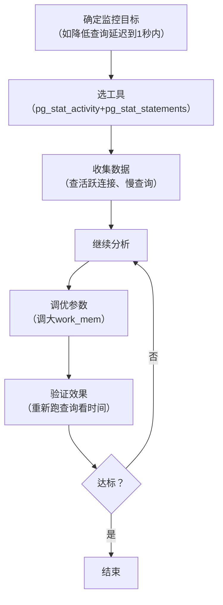

扫描[二维码](https://api2.cmdragon.cn/upload/cmder/20250304_012821924.jpg)
关注或者微信搜一搜：`编程智域 前端至全栈交流与成长`

[发现1000+提升效率与开发的AI工具和实用程序](https://tools.cmdragon.cn/zh/apps?category=ai_chat)：https://tools.cmdragon.cn/

### 1. 性能监控：找到数据库的“健康密码”

要调优PostgreSQL性能，首先得**知道问题在哪儿**——这就是性能监控的核心价值。它像医院的“体检仪”，帮你排查数据库的“亚健康”状态。

#### 1.1 性能监控的3个核心维度

监控不是“瞎看数据”，要聚焦3个关键方向：

- **资源使用**：CPU、内存、磁盘IO、网络带宽的占用情况（比如磁盘IO持续100%，说明有严重的IO瓶颈）；
- **查询性能**：慢查询、频繁的临时文件排序、索引未使用的情况（比如一个查询跑了5分钟，肯定有问题）；
- **系统状态**：活跃连接数、checkpoint频率、WAL日志生成速度（比如每分钟一次checkpoint，会导致IO峰值）。

#### 1.2 PostgreSQL自带的“监控工具箱”

PostgreSQL内置了多个工具，不用额外安装就能用：

##### （1）pg_stat_activity：实时查看“正在发生的事”

它像“数据库的监控摄像头”，能看到当前所有连接的状态、执行的查询、耗时等。比如：

```sql
-- 查看活跃连接（正在执行查询的连接）
SELECT
    pid, -- 进程ID
    usename, -- 用户名
    datname, -- 数据库名
    application_name, -- 客户端应用
    state, -- 连接状态（active=正在执行）
    query, -- 正在执行的查询
    query_start -- 查询开始时间
FROM pg_stat_activity
WHERE state = 'active';
```

如果发现某个查询的`query_start`是10分钟前，说明它“卡住了”，需要排查（比如锁冲突）。

##### （2）pg_stat_user_tables：看表的“使用情况”

它能告诉你表的全表扫描次数、索引扫描次数、插入/更新/删除的行数。比如：

```sql
-- 查看表的扫描情况（全表扫描多说明可能缺索引）
SELECT
    relname, -- 表名
    seq_scan, -- 全表扫描次数
    idx_scan, -- 索引扫描次数
    n_tup_ins, -- 插入行数
    n_tup_upd, -- 更新行数
    n_tup_del -- 删除行数
FROM pg_stat_user_tables
ORDER BY seq_scan DESC LIMIT 5;
```

如果`seq_scan`很高但`idx_scan`很低，说明表**缺少合适的索引**，需要优化。

##### （3）pg_stat_statements：慢查询的“黑匣子”

它是PostgreSQL的“慢查询日志增强版”，能记录所有查询的执行统计（比如总耗时、调用次数、临时文件使用量）。使用前需要**启用扩展**：

1. 修改`postgresql.conf`（通常在`/var/lib/postgresql/17/main/`）：
   ```ini
   shared_preload_libraries = 'pg_stat_statements' # 加载扩展
   pg_stat_statements.track = all # 跟踪所有查询
   ```
2. 重启PostgreSQL：`sudo systemctl restart postgresql`
3. 创建扩展：
   ```sql
   CREATE EXTENSION IF NOT EXISTS pg_stat_statements;
   ```

之后就能查询**最耗时的10条查询**：

```sql
SELECT
    queryid, -- 查询唯一ID
    query, -- 查询语句
    total_time / 1000 AS total_time_seconds, -- 总耗时（秒）
    calls, -- 调用次数
    total_time / calls AS avg_time_seconds, -- 平均耗时（秒）
    temp_blks_written -- 临时文件写入量（越多说明排序/哈希溢出越严重）
FROM pg_stat_statements
ORDER BY total_time DESC
LIMIT 10;
```

#### 1.3 性能监控的“标准流程”

监控不是“看一眼就完了”，要 follow 闭环流程（附流程图）：



### 2. 配置参数调优：给数据库“换引擎”

性能调优的核心是**调整配置参数**，让数据库更匹配硬件和业务场景。以下是5个**最影响性能**的参数：

#### 2.1 共享缓冲区：shared_buffers（数据库的“私人缓存”）

- **作用**：PostgreSQL自己管理的内存区域，用来缓存常用的数据块（比如表、索引），避免每次都读磁盘。
- **默认值**：128MB（很小，适合小内存机器）。
- **调优建议**：
    - 一般设置为**系统内存的25%**（比如16GB内存→4GB）；
    - 不要超过8GB（PostgreSQL对大缓冲区的管理效率会下降）；
    - 例子：`ALTER SYSTEM SET shared_buffers = '4GB';`（修改后需重启数据库）。
- **为什么？**
  ：shared_buffers是PostgreSQL的“私人仓库”，OS的文件缓存是“公共仓库”——两者结合能把磁盘IO降到最低。比如读一个数据块，先看shared_buffers有没有，没有再看OS缓存，还没有才读磁盘。

#### 2.2 操作内存：work_mem（每个操作的“工作台”）

- **作用**：控制**单个操作**（比如排序、哈希连接、分组）能使用的最大内存。如果内存不够，会把数据写到**临时文件**（磁盘），速度慢10倍以上。
- **默认值**：4MB（很小，容易溢出）。
- **调优建议**：
    - 根据查询的实际需求调整（比如排序10MB的数据，work_mem至少要10MB）；
    - 注意：**work_mem是“ per operation”**（每个操作），不是“per session”（每个连接）。比如一个查询有2个排序操作，每个都能用到work_mem的量；
    - 例子：`ALTER SYSTEM SET work_mem = '20MB';`（无需重启，执行`SELECT pg_reload_conf();`生效）。
- **案例**：某电商订单查询`SELECT * FROM orders ORDER BY total_amount DESC`
  跑了30秒，用pg_stat_statements发现`temp_blks_written`很高（说明排序溢出到磁盘）。调大work_mem到20MB后，查询时间降到5秒。

#### 2.3 维护内存：maintenance_work_mem（“大扫除”的工具）

- **作用**：控制维护操作（比如CREATE INDEX、VACUUM、ALTER TABLE）的内存。这些操作需要大量内存（比如创建大索引），内存不够会很慢。
- **默认值**：64MB。
- **调优建议**：设置为**系统内存的5%-10%**（比如16GB内存→1GB），但不超过2GB（避免影响其他进程）。
- **例子**：`ALTER SYSTEM SET maintenance_work_mem = '1GB';`

#### 2.4 缓存估算：effective_cache_size（告诉优化器“有多少缓存可用”）

- **作用**：不是实际分配内存，而是**告诉查询优化器“预计能用到的缓存总量”**（包括shared_buffers +
  OS缓存）。优化器会根据这个值选择更优的执行计划（比如缓存足够时，优先选索引扫描）。
- **默认值**：4GB。
- **调优建议**：设置为**系统内存的50%-75%**（比如16GB内存→12GB）。
- **为什么？**：比如系统有16GB内存，effective_cache_size设为12GB，优化器会认为“有12GB缓存可用”，所以更倾向于选择索引扫描（因为索引扫描需要缓存支持），而不是全表扫描。

#### 2.5 Checkpoint优化：避免“IO风暴”

Checkpoint是PostgreSQL的“数据持久化操作”——把shared_buffers里的脏数据（修改过但没写磁盘的数据）写到磁盘，并生成新的WAL日志。如果Checkpoint太频繁，会导致
**IO峰值**（比如每分钟一次Checkpoint，磁盘IO突然涨到100%）。

关键参数：

- **checkpoint_timeout**：两次Checkpoint的最长间隔（默认5分钟）；
- **max_wal_size**：WAL日志的最大大小（默认1GB）。

调优建议：

- 延长`checkpoint_timeout`到15-30分钟（减少Checkpoint次数）；
- 调大`max_wal_size`到4-8GB（让WAL日志能存更多数据，减少Checkpoint触发）；
- 例子：
  ```sql
  ALTER SYSTEM SET checkpoint_timeout = '15min';
  ALTER SYSTEM SET max_wal_size = '4GB';
  ```

### 3. 课后Quiz：巩固你的知识

**问题1**：当查询出现“大量临时文件排序”时，应该调整哪个参数？为什么？  
**答案**：调整`work_mem`。因为`work_mem`控制单个排序操作的内存，内存不足时会用临时文件（磁盘），速度慢。调大`work_mem`
能让排序在内存中完成，提升性能。

**问题2**：`shared_buffers`的建议值是系统内存的25%，为什么不能设置太大（比如超过8GB）？  
**答案**：因为PostgreSQL对大缓冲区的管理效率会下降，而且OS的文件缓存也需要内存——设置太大可能导致OS缓存不足，反而影响整体性能。

**问题3**：`effective_cache_size`是实际分配的内存吗？它的作用是什么？  
**答案**：不是。它是告诉查询优化器“预计能用到的缓存总量”，优化器会根据这个值选择更优的执行计划（比如缓存足够时选索引扫描）。

### 4. 常见报错与解决方案

#### （1）错误：`ERROR:  out of memory for query result`

- **原因**：查询需要的内存超过了`work_mem`或`maintenance_work_mem`的限制，或返回数据量太大。
- **解决**：
    1. 调大`work_mem`（比如从4MB→20MB）；
    2. 优化查询（比如添加`WHERE`条件过滤数据，或`LIMIT`限制返回行数）。
- **预防**：根据查询需求设置`work_mem`，避免过度分配（比如不要设为1GB，否则多并发时会OOM）。

#### （2）警告：`WARNING:  checkpoints are occurring too frequently`

- **原因**：Checkpoint太频繁（比如每分钟一次），通常是`max_wal_size`太小或`checkpoint_timeout`太短。
- **解决**：
    1. 调大`max_wal_size`（比如从1GB→4GB）；
    2. 延长`checkpoint_timeout`（比如从5分钟→15分钟）。
- **预防**：根据业务的写入负载调整——写入频繁的数据库（比如电商），`max_wal_size`可以设大一些。

#### （3）错误：`ERROR:  could not resize shared memory segment`

- **原因**：`shared_buffers`设置太大，系统没有足够的共享内存。
- **解决**：
    1. 调小`shared_buffers`（比如从8GB→4GB）；
    2. 修改系统共享内存限制（比如Linux下修改`/etc/sysctl.conf`的`kernel.shmmax`，然后执行`sysctl -p`）。

### 参考链接

- PostgreSQL监控文档：https://www.postgresql.org/docs/17/monitoring.html
- 配置参数总览：https://www.postgresql.org/docs/17/runtime-config.html
- pg_stat_statements扩展：https://www.postgresql.org/docs/17/pgstatstatements.html
- 内存配置参数：https://www.postgresql.org/docs/17/runtime-config-resource.html#RUNTIME-CONFIG-RESOURCE-MEMORY
- Checkpoint配置参数：https://www.postgresql.org/docs/17/runtime-config-wal.html#RUNTIME-CONFIG-WAL-CHECKPOINTS

余下文章内容请点击跳转至 个人博客页面 或者 扫码关注或者微信搜一搜：`编程智域 前端至全栈交流与成长`
，阅读完整的文章：[想让PostgreSQL快到飞起？先找健康密码还是先换引擎？](https://blog.cmdragon.cn/posts/a6997d81b49cd232b87e1cf603888ad1/)


<details>
<summary>往期文章归档</summary>

- [想让PostgreSQL查询快到飞起？分区表、物化视图、并行查询这三招灵不灵？ - cmdragon's Blog](https://blog.cmdragon.cn/posts/1fee7afbb9abd4540b8aa9c141d6845d/)
- [子查询总拖慢查询？把它变成连接就能解决？ - cmdragon's Blog](https://blog.cmdragon.cn/posts/79c590fbd87ece535b11a71c9667884f/)
- [PostgreSQL全表扫描慢到崩溃？建索引+改查询+更统计信息三招能破？ - cmdragon's Blog](https://blog.cmdragon.cn/posts/748cdac2536008199abf8a8a2cd0ec85/)
- [复杂查询总拖后腿？PostgreSQL多列索引+覆盖索引的神仙技巧你get没？ - cmdragon's Blog](https://blog.cmdragon.cn/posts/32ca943703226d317d4276a8fb53b0dd/)
- [只给表子集建索引？用函数结果建索引？PostgreSQL这俩操作凭啥能省空间又加速？ - cmdragon's Blog](https://blog.cmdragon.cn/posts/ca93f1d53aa910e7ba5ffd8df611c12b/)
- [B-tree索引像字典查词一样工作？那哪些数据库查询它能加速，哪些不能？ - cmdragon's Blog](https://blog.cmdragon.cn/posts/f507856ebfddd592448813c510a53669/)
- [想抓PostgreSQL里的慢SQL？pg_stat_statements基础黑匣子和pg_stat_monitor时间窗，谁能帮你更准揪出性能小偷？ - cmdragon's Blog](https://blog.cmdragon.cn/posts/b2213bfcb5b88a862f2138404c03d596/)
- [PostgreSQL的“时光机”MVCC和锁机制是怎么搞定高并发的？ - cmdragon's Blog](https://blog.cmdragon.cn/posts/26614eb7da6c476dde41d367ad888d2f/)
- [PostgreSQL性能暴涨的关键？内存IO并发参数居然要这么设置？ - cmdragon's Blog](https://blog.cmdragon.cn/posts/69f99bc6972a860d559c74aad7280da4/)
- [大表查询慢到翻遍整个书架？PostgreSQL分区表教你怎么“分类”才高效](https://blog.cmdragon.cn/posts/7b7053f392147a8b3b1a16bebeb08d0a/)
- [PostgreSQL 查询慢？是不是忘了优化 GROUP BY、ORDER BY 和窗口函数？ - cmdragon's Blog](https://blog.cmdragon.cn/posts/c856e3cb073822349f3bf2d29995dcfc/)
- [PostgreSQL里的子查询和CTE居然在性能上“掐架”？到底该站哪边？ - cmdragon's Blog](https://blog.cmdragon.cn/posts/c096347d18e67b7431faacd2c4757093/)
- [PostgreSQL选Join策略有啥小九九？Nested Loop/Merge/Hash谁是它的菜？ - cmdragon's Blog](https://blog.cmdragon.cn/posts/2eca89463454fd4250d7b66243b9fe5a/)
- [PostgreSQL新手SQL总翻车？这7个性能陷阱你踩过没？ - cmdragon's Blog](https://blog.cmdragon.cn/posts/068ecb772a87d7df20a8c9fb4b233f8e/)
- [PostgreSQL索引选B-Tree还是GiST？“瑞士军刀”和“多面手”的差别你居然还不知道？ - cmdragon's Blog](https://blog.cmdragon.cn/posts/d498f63cd0a2d5a77e445c688a8b88db/)
- [想知道数据库怎么给查询“算成本选路线”？EXPLAIN能帮你看明白？ - cmdragon's Blog](https://blog.cmdragon.cn/posts/9101b75bdec6faea9b35d54f14e37f36/)
- [PostgreSQL处理SQL居然像做蛋糕？解析到执行的4步里藏着多少查询优化的小心机？ - cmdragon's Blog](https://blog.cmdragon.cn/posts/d527f8ebb6e3dae2c7dfe4c8d8979444/)
- [PostgreSQL备份不是复制文件？物理vs逻辑咋选？误删还能精准恢复到1分钟前？ - cmdragon's Blog](https://blog.cmdragon.cn/posts/6bfdae84f313cf7ad0bb7045c4392347/)
- [转账不翻车、并发不干扰，PostgreSQL的ACID特性到底有啥魔法？ - cmdragon's Blog](https://blog.cmdragon.cn/posts/de3672803de34dbad244d0a8d48b0eb5/)
- [银行转账不白扣钱、电商下单不超卖，PostgreSQL事务的诀窍是啥？ - cmdragon's Blog](https://blog.cmdragon.cn/posts/e463e8a2668abdf00a228c9b79324ded/)
- [PostgreSQL里的PL/pgSQL到底是啥？能让SQL从“说目标”变“讲步骤”？ - cmdragon's Blog](https://blog.cmdragon.cn/posts/5c967e595058c4a1fc4474a68e64031d/)
- [PostgreSQL视图不存数据？那它怎么简化查询还能递归生成序列和控制权限？ - cmdragon's Blog](https://blog.cmdragon.cn/posts/325047855e3e23b5ef82f7d2db134fbd/)
- [PostgreSQL索引这么玩，才能让你的查询真的“飞”起来？ - cmdragon's Blog](https://blog.cmdragon.cn/posts/d2dba50bb6e4df7b27e735245a06a2a2/)
- [PostgreSQL的表关系和约束，咋帮你搞定用户订单不混乱、学生选课不重复？ - cmdragon's Blog](https://blog.cmdragon.cn/posts/849ae5bab0f8c66e94c2f6ad1bb798e3/)
- [PostgreSQL查询的筛子、排序、聚合、分组？你会用它们搞定数据吗？ - cmdragon's Blog](https://blog.cmdragon.cn/posts/ef4800975ffa84f1ca51976a70a1585b/)
- [PostgreSQL数据类型怎么选才高效不踩坑？ - cmdragon's Blog](https://blog.cmdragon.cn/posts/bf54711525c507c5eacfa7b0151c39d2/)
- [想解锁PostgreSQL查询从基础到进阶的核心知识点？你都get了吗？ - cmdragon's Blog](https://blog.cmdragon.cn/posts/887809b3e0375f5956873cd442f516d8/)
- [PostgreSQL DELETE居然有这些操作？返回数据、连表删你试过没？ - cmdragon's Blog](https://blog.cmdragon.cn/posts/934be1203725e8be9d6f6e9104e5abcc/)
- [PostgreSQL UPDATE语句怎么玩？从改邮箱到批量更新的避坑技巧你都会吗？ - cmdragon's Blog](https://blog.cmdragon.cn/posts/0f0622e9b7402b599e618150d0596ffe/)
- [PostgreSQL插入数据还在逐条敲？批量、冲突处理、返回自增ID的技巧你会吗？ - cmdragon's Blog](https://blog.cmdragon.cn/posts/0e3bf7efc030b024ea67ee855a00f2de/)
- [PostgreSQL的“仓库-房间-货架”游戏，你能建出电商数据库和表吗？ - cmdragon's Blog](https://blog.cmdragon.cn/posts/b6cd3c86da6aac26ed829e472d34078e/)
- [PostgreSQL 17安装总翻车？Windows/macOS/Linux避坑指南帮你搞定？ - cmdragon's Blog](https://blog.cmdragon.cn/posts/ba1f545a3410144552fbdbfcf31b5265/)
- [能当关系型数据库还能玩对象特性，能拆复杂查询还能自动管库存，PostgreSQL凭什么这么香？ - cmdragon's Blog](https://blog.cmdragon.cn/posts/b5474d1480509c5072085abc80b3dd9f/)
- [给接口加新字段又不搞崩老客户端？FastAPI的多版本API靠哪三招实现？ - cmdragon's Blog](https://blog.cmdragon.cn/posts/cc098d8836e787baa8a4d92e4d56d5c5/)
- [流量突增要搞崩FastAPI？熔断测试是怎么防系统雪崩的？ - cmdragon's Blog](https://blog.cmdragon.cn/posts/46d05151c5bd31cf37a7bcf0b8f5b0b8/)
- [FastAPI秒杀库存总变负数？Redis分布式锁能帮你守住底线吗 - cmdragon's Blog](https://blog.cmdragon.cn/posts/65ce343cc5df9faf3a8e2eeaab42ae45/)
- [FastAPI的CI流水线怎么自动测端点，还能让Allure报告美到犯规？ - cmdragon's Blog](https://blog.cmdragon.cn/posts/eed6cd8985d9be0a4b092a7da38b3e0c/)
- [如何用GitHub Actions为FastAPI项目打造自动化测试流水线？ - cmdragon's Blog](https://blog.cmdragon.cn/posts/6157d87338ce894d18c013c3c4777abb/)
- [如何用Git Hook和CI流水线为FastAPI项目保驾护航？ - cmdragon's Blog](https://blog.cmdragon.cn/posts/fc4ef84559e04693a620d0714cb30787/)
- [FastAPI如何用契约测试确保API的「菜单」与「菜品」一致？](https://blog.cmdragon.cn/posts/02b0c96842d1481c72dab63a149ce0dd/)
- [为什么TDD能让你的FastAPI开发飞起来？ - cmdragon's Blog](https://blog.cmdragon.cn/posts/c9c1e3bb0fdc15303b9b3b1f20124b0b/)
- [如何用FastAPI玩转多模块测试与异步任务，让代码不再“闹脾气”？ - cmdragon's Blog](https://blog.cmdragon.cn/posts/ddbfa0447a5d0d6f9af12e7a6b206f70/)
- [如何在FastAPI中玩转“时光倒流”的数据库事务回滚测试？](https://blog.cmdragon.cn/posts/bf9883a75ffa46b523a03b16ec56ce48/)
- [如何在FastAPI中优雅地模拟多模块集成测试？ - cmdragon's Blog](https://blog.cmdragon.cn/posts/be553dbd5d51835d2c69553f4a773e2d/)
- [多环境配置切换机制能否让开发与生产无缝衔接？ - cmdragon's Blog](https://blog.cmdragon.cn/posts/533874f5700b8506d4c68781597db659/)
- [如何在 FastAPI 中巧妙覆盖依赖注入并拦截第三方服务调用？ - cmdragon's Blog](https://blog.cmdragon.cn/posts/2d992ef9e8962dc0a4a0b5348d486114/)
- [为什么你的单元测试需要Mock数据库才能飞起来？ - cmdragon's Blog](https://blog.cmdragon.cn/posts/6e69c0eedd8b1e5a74a148d36c85d7ce/)
- [如何在FastAPI中巧妙隔离依赖项，让单元测试不再头疼？ - cmdragon's Blog](https://blog.cmdragon.cn/posts/77ae327dc941b0e74ecc6a8794c084d0/)
- [如何在FastAPI中巧妙隔离依赖项，让单元测试不再头疼？ - cmdragon's Blog](https://blog.cmdragon.cn/posts/77ae327dc941b0e74ecc6a8794c084d0/)

</details>


<details>
<summary>免费好用的热门在线工具</summary>

- [Mermaid 在线编辑器 - 应用商店 | By cmdragon](https://tools.cmdragon.cn/zh/apps/mermaid-live-editor)
- [数学求解计算器 - 应用商店 | By cmdragon](https://tools.cmdragon.cn/zh/apps/math-solver-calculator)
- [智能提词器 - 应用商店 | By cmdragon](https://tools.cmdragon.cn/zh/apps/smart-teleprompter)
- [魔法简历 - 应用商店 | By cmdragon](https://tools.cmdragon.cn/zh/apps/magic-resume)
- [Image Puzzle Tool - 图片拼图工具 | By cmdragon](https://tools.cmdragon.cn/zh/apps/image-puzzle-tool)
- [字幕下载工具 - 应用商店 | By cmdragon](https://tools.cmdragon.cn/zh/apps/subtitle-downloader)
- [歌词生成工具 - 应用商店 | By cmdragon](https://tools.cmdragon.cn/zh/apps/lyrics-generator)
- [网盘资源聚合搜索 - 应用商店 | By cmdragon](https://tools.cmdragon.cn/zh/apps/cloud-drive-search)
- [ASCII字符画生成器 - 应用商店 | By cmdragon](https://tools.cmdragon.cn/zh/apps/ascii-art-generator)
- [JSON Web Tokens 工具 - 应用商店 | By cmdragon](https://tools.cmdragon.cn/zh/apps/jwt-tool)
- [Bcrypt 密码工具 - 应用商店 | By cmdragon](https://tools.cmdragon.cn/zh/apps/bcrypt-tool)
- [GIF 合成器 - 应用商店 | By cmdragon](https://tools.cmdragon.cn/zh/apps/gif-composer)
- [GIF 分解器 - 应用商店 | By cmdragon](https://tools.cmdragon.cn/zh/apps/gif-decomposer)
- [文本隐写术 - 应用商店 | By cmdragon](https://tools.cmdragon.cn/zh/apps/text-steganography)
- [CMDragon 在线工具 - 高级AI工具箱与开发者套件 | 免费好用的在线工具](https://tools.cmdragon.cn/zh)
- [应用商店 - 发现1000+提升效率与开发的AI工具和实用程序 | 免费好用的在线工具](https://tools.cmdragon.cn/zh/apps?category=trending)
- [CMDragon 更新日志 - 最新更新、功能与改进 | 免费好用的在线工具](https://tools.cmdragon.cn/zh/changelog)
- [支持我们 - 成为赞助者 | 免费好用的在线工具](https://tools.cmdragon.cn/zh/sponsor)
- [AI文本生成图像 - 应用商店 | 免费好用的在线工具](https://tools.cmdragon.cn/zh/apps/text-to-image-ai)
- [临时邮箱 - 应用商店 | 免费好用的在线工具](https://tools.cmdragon.cn/zh/apps/temp-email)
- [二维码解析器 - 应用商店 | 免费好用的在线工具](https://tools.cmdragon.cn/zh/apps/qrcode-parser)
- [文本转思维导图 - 应用商店 | 免费好用的在线工具](https://tools.cmdragon.cn/zh/apps/text-to-mindmap)
- [正则表达式可视化工具 - 应用商店 | 免费好用的在线工具](https://tools.cmdragon.cn/zh/apps/regex-visualizer)
- [文件隐写工具 - 应用商店 | 免费好用的在线工具](https://tools.cmdragon.cn/zh/apps/steganography-tool)
- [IPTV 频道探索器 - 应用商店 | 免费好用的在线工具](https://tools.cmdragon.cn/zh/apps/iptv-explorer)
- [快传 - 应用商店 | 免费好用的在线工具](https://tools.cmdragon.cn/zh/apps/snapdrop)
- [随机抽奖工具 - 应用商店 | 免费好用的在线工具](https://tools.cmdragon.cn/zh/apps/lucky-draw)
- [动漫场景查找器 - 应用商店 | 免费好用的在线工具](https://tools.cmdragon.cn/zh/apps/anime-scene-finder)
- [时间工具箱 - 应用商店 | 免费好用的在线工具](https://tools.cmdragon.cn/zh/apps/time-toolkit)
- [网速测试 - 应用商店 | 免费好用的在线工具](https://tools.cmdragon.cn/zh/apps/speed-test)
- [AI 智能抠图工具 - 应用商店 | 免费好用的在线工具](https://tools.cmdragon.cn/zh/apps/background-remover)
- [背景替换工具 - 应用商店 | 免费好用的在线工具](https://tools.cmdragon.cn/zh/apps/background-replacer)
- [艺术二维码生成器 - 应用商店 | 免费好用的在线工具](https://tools.cmdragon.cn/zh/apps/artistic-qrcode)
- [Open Graph 元标签生成器 - 应用商店 | 免费好用的在线工具](https://tools.cmdragon.cn/zh/apps/open-graph-generator)
- [图像对比工具 - 应用商店 | 免费好用的在线工具](https://tools.cmdragon.cn/zh/apps/image-comparison)
- [图片压缩专业版 - 应用商店 | 免费好用的在线工具](https://tools.cmdragon.cn/zh/apps/image-compressor)
- [密码生成器 - 应用商店 | 免费好用的在线工具](https://tools.cmdragon.cn/zh/apps/password-generator)
- [SVG优化器 - 应用商店 | 免费好用的在线工具](https://tools.cmdragon.cn/zh/apps/svg-optimizer)
- [调色板生成器 - 应用商店 | 免费好用的在线工具](https://tools.cmdragon.cn/zh/apps/color-palette)
- [在线节拍器 - 应用商店 | 免费好用的在线工具](https://tools.cmdragon.cn/zh/apps/online-metronome)
- [IP归属地查询 - 应用商店 | 免费好用的在线工具](https://tools.cmdragon.cn/zh/apps/ip-geolocation)
- [CSS网格布局生成器 - 应用商店 | 免费好用的在线工具](https://tools.cmdragon.cn/zh/apps/css-grid-layout)
- [邮箱验证工具 - 应用商店 | 免费好用的在线工具](https://tools.cmdragon.cn/zh/apps/email-validator)
- [书法练习字帖 - 应用商店 | 免费好用的在线工具](https://tools.cmdragon.cn/zh/apps/calligraphy-practice)
- [金融计算器套件 - 应用商店 | 免费好用的在线工具](https://tools.cmdragon.cn/zh/apps/finance-calculator-suite)
- [中国亲戚关系计算器 - 应用商店 | 免费好用的在线工具](https://tools.cmdragon.cn/zh/apps/chinese-kinship-calculator)
- [Protocol Buffer 工具箱 - 应用商店 | 免费好用的在线工具](https://tools.cmdragon.cn/zh/apps/protobuf-toolkit)
- [IP归属地查询 - 应用商店 | 免费好用的在线工具](https://tools.cmdragon.cn/zh/apps/ip-geolocation)
- [图片无损放大 - 应用商店 | 免费好用的在线工具](https://tools.cmdragon.cn/zh/apps/image-upscaler)
- [文本比较工具 - 应用商店 | 免费好用的在线工具](https://tools.cmdragon.cn/zh/apps/text-compare)
- [IP批量查询工具 - 应用商店 | 免费好用的在线工具](https://tools.cmdragon.cn/zh/apps/ip-batch-lookup)
- [域名查询工具 - 应用商店 | 免费好用的在线工具](https://tools.cmdragon.cn/zh/apps/domain-finder)
- [DNS工具箱 - 应用商店 | 免费好用的在线工具](https://tools.cmdragon.cn/zh/apps/dns-toolkit)
- [网站图标生成器 - 应用商店 | 免费好用的在线工具](https://tools.cmdragon.cn/zh/apps/favicon-generator)
- [XML Sitemap](https://tools.cmdragon.cn/sitemap_index.xml)

</details>