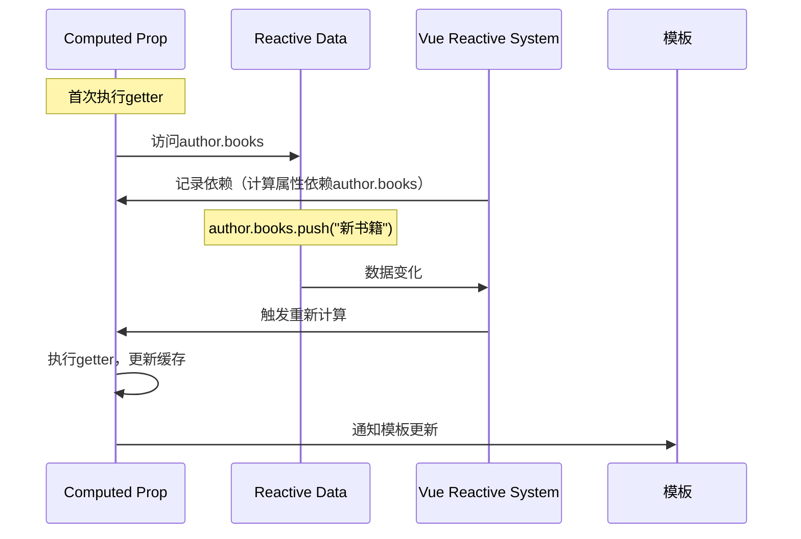

扫描[二维码](https://api2.cmdragon.cn/upload/cmder/20250304_012821924.jpg)关注或者微信搜一搜：`编程智域 前端至全栈交流与成长`

[发现1000+提升效率与开发的AI工具和实用程序](https://tools.cmdragon.cn/zh/apps?category=ai_chat)：https://tools.cmdragon.cn/

### 计算属性的基本用法

计算属性是Vue 3中用于**派生响应式值**的核心工具。当你需要根据现有响应式数据生成新值时，计算属性能让代码更简洁、更易维护。

#### 基础示例：判断作者是否有已出版书籍

假设我们有一个`author`对象，包含`name`和`books`数组。我们需要在模板中显示“是否有已出版书籍”的结果：

```vue

<script setup>
  import {reactive, computed} from 'vue'

  // 响应式数据：作者信息
  const author = reactive({
    name: 'John Doe',
    books: ['Vue 2 - Advanced Guide', 'Vue 3 - Basic Guide']
  })

  // 计算属性：根据books长度派生结果
  const publishedBooksMessage = computed(() => {
    // getter函数：返回派生值
    return author.books.length > 0 ? 'Yes' : 'No'
  })
</script>

<template>
  <p>Has published books:</p>
  <span>{{ publishedBooksMessage }}</span> <!-- 直接使用计算属性 -->
</template>
```

**关键点**：

- 计算属性通过`computed()`函数创建，接收一个**getter函数**（返回派生值）。
- 模板中使用计算属性时，无需加`.value`（Vue会自动解包）。
- 计算属性会**自动追踪依赖**（这里依赖`author.books`），当`author.books`变化时，`publishedBooksMessage`会自动更新。

### 缓存机制：为什么计算属性比方法更高效？

计算属性的核心优势是**缓存**——只有当依赖的响应式数据变化时，才会重新计算；否则直接返回缓存值。

#### 缓存的原理

计算属性的缓存基于**依赖的响应式数据**：

1. 当计算属性的`getter`首次执行时，Vue会记录它访问的所有响应式数据（即“依赖”）。
2. 之后，只有当这些依赖发生变化时，`getter`才会再次执行，更新缓存值。
3. 如果依赖没有变化，多次访问计算属性会直接返回缓存值，避免重复计算。

#### 缓存的必要性：避免重复计算昂贵操作

假设你有一个需要遍历1000条数据的计算属性：

```js
const expensiveComputed = computed(() => {
    return largeArray.value.filter(item => item.isActive).length
})
```

如果用**方法**实现（`function calculateActiveCount() { ... }`），每次组件渲染都会重新遍历1000条数据；而计算属性只会在
`largeArray`变化时重新计算，大幅提升性能。

#### 反例：非响应式依赖不会触发缓存更新

如果计算属性的`getter`访问了**非响应式数据**（如`Date.now()`），缓存永远不会更新：

```js
// 这个计算属性永远不会变！因为Date.now()不是响应式依赖
const now = computed(() => Date.now())
```

### 依赖追踪：Vue如何“知道”计算属性依赖了什么？

Vue的响应式系统通过**依赖收集**实现计算属性的自动更新，流程如下（用流程图简化）：



**详细解释**：

- 当`getter`执行时，Vue会通过**代理（Proxy）**拦截响应式数据的访问（如`author.books`）。
- Vue将当前计算属性标记为这些响应式数据的“依赖”（存入依赖列表）。
- 当响应式数据变化时，Vue会遍历其依赖列表，触发所有相关计算属性重新计算。

### 计算属性 vs 方法：核心区别

| 特性      | 计算属性               | 方法               |
|---------|--------------------|------------------|
| 缓存      | 有（依赖变化才更新）         | 无（每次调用都执行）       |
| 适用场景    | 派生响应式值（如过滤、排序）     | 执行操作（如事件处理、异步请求） |
| 模板中使用方式 | {{ computedProp }} | {{ method() }}   |

#### 代码对比

```vue

<script setup>
  import {reactive} from 'vue'

  const author = reactive({books: ['Vue 3 Guide']})

  // 计算属性：缓存结果
  const computedMessage = computed(() => author.books.length > 0 ? 'Yes' : 'No')

  // 方法：无缓存
  function methodMessage() {
    return author.books.length > 0 ? 'Yes' : 'No'
  }
</script>

<template>
  <!-- 计算属性：依赖不变时直接返回缓存 -->
  <p>Computed: {{ computedMessage }}</p>
  <!-- 方法：每次渲染都重新执行 -->
  <p>Method: {{ methodMessage() }}</p>
</template>
```

### 可写计算属性：不止是“读”，还能“写”

默认情况下，计算属性是**只读**的（只有`getter`）。如果需要**双向绑定**计算属性（如通过表单修改），可以添加`setter`方法。

#### 示例：双向绑定fullName

```vue

<script setup>
  import {ref, computed} from 'vue'

  const firstName = ref('John')
  const lastName = ref('Doe')

  // 可写计算属性：getter + setter
  const fullName = computed({
    // getter：从firstName和lastName派生fullName
    get() {
      return `${firstName.value} ${lastName.value}`
    },
    // setter：从fullName反向修改firstName和lastName
    set(newValue) {
      const [newFirst, newLast] = newValue.split(' ') // 分割新值
      firstName.value = newFirst || '' // 处理空值
      lastName.value = newLast || ''
    }
  })
</script>

<template>
  <!-- 双向绑定计算属性 -->
  <input v-model="fullName" placeholder="Enter full name"/>
  <p>First Name: {{ firstName }}</p> <!-- 自动更新 -->
  <p>Last Name: {{ lastName }}</p>  <!-- 自动更新 -->
</template>
```

**使用场景**：需要将计算属性作为“双向绑定的桥梁”（如表单输入、联动组件）。

### 获取计算属性的之前值（Vue 3.4+）

Vue 3.4+支持在计算属性的`getter`中获取**之前的缓存值**（通过`previous`参数），适用于需要“保留历史状态”的场景。

#### 示例：限制值不超过3

```vue

<script setup>
  import {ref, computed} from 'vue'

  const count = ref(2)

  // 只有count <=3时返回当前值，否则返回之前的值
  const alwaysSmall = computed((previous) => {
    if (count.value <= 3) {
      return count.value
    }
    return previous // 返回之前的缓存值
  })
</script>

<template>
  <button @click="count++">Increment Count ({{ count }})</button>
  <p>Always Small: {{ alwaysSmall }}</p> <!-- 当count=4时，显示3 -->
</template>
```

### 最佳实践：避免踩坑

1. **Getter必须无副作用**：
   计算属性的`getter`应该只返回派生值，**不要**做以下操作：
    - 修改其他响应式状态（如`this.someValue = 'changed'`）
    - 发送网络请求（`fetch('/api/data')`）
    - 操作DOM（`document.querySelector('.foo').innerHTML = 'bar'`）
    - 异步操作（`async`函数）

   **错误示例**：
   ```js
   // 不要这么写！getter有副作用（修改其他状态）
   const badComputed = computed(() => {
     this.otherValue = 'changed' // 副作用
     return this.author.books.length > 0 ? 'Yes' : 'No'
   })
   ```

2. **不要修改计算属性的返回值**：
   计算属性的返回值是“派生状态的快照”，修改它不会影响原始依赖，反而会导致状态不一致。
   ```js
   // 错误：修改计算属性的返回值（无效）
   publishedBooksMessage.value = 'Maybe' // 不会改变author.books
   ```

### 课后Quiz：巩固所学

1. **问题**：计算属性和方法的核心区别是什么？
   **答案**：计算属性基于依赖的响应式数据缓存结果，只有依赖变化时才重新计算；方法每次调用都会重新执行。

2. **问题**：什么时候需要使用可写计算属性？
   **答案**：当需要双向绑定计算属性（如通过表单输入修改计算属性，同时反向修改其依赖的响应式数据）时。

3. **问题**：为什么计算属性的`getter`不能有副作用？
   **答案**：计算属性的职责是“派生值”，副作用会导致不可预测的行为（如重复修改状态、多次发请求），破坏单向数据流原则。

### 常见报错及解决

#### 1. 报错：`Cannot assign to read only property 'value' of object '#<Object>'`

**原因**：试图给默认的**只读计算属性**（只有`getter`）赋值。
**解决**：将计算属性改为**可写**，添加`set`方法：

```js
// 错误：只读计算属性
const fullName = computed(() => `${firstName.value} ${lastName.value}`)
fullName.value = 'Jane Smith' // 报错

// 正确：添加set方法
const fullName = computed({
    get() { /* ... */
    },
    set(newValue) { /* ... */
    }
})
```

#### 2. 报错：`Computed property 'xxx' was assigned to but it has no setter`

**原因**：同1，试图给没有`set`方法的计算属性赋值。
**解决**：添加`set`方法，或检查是否误将计算属性当作普通响应式数据修改。

#### 3. 报错：`Computed property getter returned undefined`

**原因**：计算属性的`getter`没有覆盖所有分支，导致返回`undefined`。
**解决**：确保`getter`在所有情况下都有返回值：

```js
// 错误：缺少else分支
const publishedMessage = computed(() => {
    if (author.books.length > 0) {
        return 'Yes'
    }
    // 没有返回值，导致undefined
})

// 正确：覆盖所有分支
const publishedMessage = computed(() => {
    return author.books.length > 0 ? 'Yes' : 'No'
})
```

参考链接：https://vuejs.org/guide/essentials/computed.html

余下文章内容请点击跳转至 个人博客页面 或者 扫描[二维码](https://api2.cmdragon.cn/upload/cmder/20250304_012821924.jpg)
关注或者微信搜一搜：`编程智域 前端至全栈交流与成长`
，阅读完整的文章：[Vue 3计算属性的缓存与依赖追踪原理是什么？可写性与历史值功能该如何正确使用？](https://blog.cmdragon.cn/posts/a222db116daaa6c34801f06a9ef13428/)


<details>
<summary>往期文章归档</summary>

- [Vue浅响应式如何解决深层响应式的性能问题？适用场景有哪些？ - cmdragon's Blog](https://blog.cmdragon.cn/posts/c85e1fe16a7ae45e965b4e2df4d9d2f4/)
- [Vue浅响应式如何解决深层响应式的性能问题？适用场景有哪些？ - cmdragon's Blog](https://blog.cmdragon.cn/posts/c85e1fe16a7ae45e965b4e2df4d9d2f4/)
- [Vue浅响应式如何解决深层响应式的性能问题？适用场景有哪些？ - cmdragon's Blog](https://blog.cmdragon.cn/posts/c85e1fe16a7ae45e965b4e2df4d9d2f4/)
- [Vue 3组合式API中ref与reactive的核心响应式差异及使用最佳实践是什么？ - cmdragon's Blog](https://blog.cmdragon.cn/posts/be04b02d2723994632de0d4ca22a3391/)
- [Vue 3组合式API中ref与reactive的核心响应式差异及使用最佳实践是什么？ - cmdragon's Blog](https://blog.cmdragon.cn/posts/be04b02d2723994632de0d4ca22a3391/)
- [Vue3响应式系统中，对象新增属性、数组改索引、原始值代理的问题如何解决？ - cmdragon's Blog](https://blog.cmdragon.cn/posts/a0af08dd60a37b9a890a9957f2cbfc9f/)
- [Vue 3中watch侦听器的正确使用姿势你掌握了吗？深度监听、与watchEffect的差异及常见报错解析 - cmdragon's Blog](https://blog.cmdragon.cn/posts/bc287e1e36287afd90750fd907eca85e/)
- [Vue响应式声明的API差异、底层原理与常见陷阱你都搞懂了吗 - cmdragon's Blog](https://blog.cmdragon.cn/posts/654b9447ef1ba7ec1126a1bc26a4726d/)
- [Vue响应式声明的API差异、底层原理与常见陷阱你都搞懂了吗 - cmdragon's Blog](https://blog.cmdragon.cn/posts/654b9447ef1ba7ec1126a1bc26a4726d/)
- [为什么Vue 3需要ref函数？它的响应式原理与正确用法是什么？ - cmdragon's Blog](https://blog.cmdragon.cn/posts/c405a8d9950af5b7c63b56c348ac36b6/)
- [Vue 3中reactive函数如何通过Proxy实现响应式？使用时要避开哪些误区？ - cmdragon's Blog](https://blog.cmdragon.cn/posts/a7e9abb9691a81e4404d9facabe0f7c3/)
- [Vue3响应式系统的底层原理与实践要点你真的懂吗？ - cmdragon's Blog](https://blog.cmdragon.cn/posts/bd995ea45161727597fb85b62566c43d/)
- [Vue 3模板如何通过编译三阶段实现从声明式语法到高效渲染的跨越 - cmdragon's Blog](https://blog.cmdragon.cn/posts/53e3f270a80675df662c6857a3332c0f/)
- [快速入门Vue模板引用：从收DOM“快递”到调子组件方法，你玩明白了吗？ - cmdragon's Blog](https://blog.cmdragon.cn/posts/ddbce4f2a23aa72c96b1c0473900321e/)
- [快速入门Vue模板里的JS表达式有啥不能碰？计算属性为啥比方法更能打？ - cmdragon's Blog](https://blog.cmdragon.cn/posts/23a2d5a334e15575277814c16e45df50/)
- [快速入门Vue的v-model表单绑定：语法糖、动态值、修饰符的小技巧你都掌握了吗？ - cmdragon's Blog](https://blog.cmdragon.cn/posts/6be38de6382e31d282659b689c5b17f0/)
- [快速入门Vue3事件处理的挑战题：v-on、修饰符、自定义事件你能通关吗？ - cmdragon's Blog](https://blog.cmdragon.cn/posts/60ce517684f4a418f453d66aa805606c/)
- [快速入门Vue3的v-指令：数据和DOM的“翻译官”到底有多少本事？ - cmdragon's Blog](https://blog.cmdragon.cn/posts/e4ae7d5e4a9205bb11b2baccb230c637/)
- [快速入门Vue3，插值、动态绑定和避坑技巧你都搞懂了吗？ - cmdragon's Blog](https://blog.cmdragon.cn/posts/999ce4fb32259ff4fbf4bf7bcb851654/)
- [想让PostgreSQL快到飞起？先找健康密码还是先换引擎？ - cmdragon's Blog](https://blog.cmdragon.cn/posts/a6997d81b49cd232b87e1cf603888ad1/)
- [想让PostgreSQL查询快到飞起？分区表、物化视图、并行查询这三招灵不灵？ - cmdragon's Blog](https://blog.cmdragon.cn/posts/1fee7afbb9abd4540b8aa9c141d6845d/)
- [子查询总拖慢查询？把它变成连接就能解决？ - cmdragon's Blog](https://blog.cmdragon.cn/posts/79c590fbd87ece535b11a71c9667884f/)
- [PostgreSQL全表扫描慢到崩溃？建索引+改查询+更统计信息三招能破？ - cmdragon's Blog](https://blog.cmdragon.cn/posts/748cdac2536008199abf8a8a2cd0ec85/)
- [复杂查询总拖后腿？PostgreSQL多列索引+覆盖索引的神仙技巧你get没？ - cmdragon's Blog](https://blog.cmdragon.cn/posts/32ca943703226d317d4276a8fb53b0dd/)
- [只给表子集建索引？用函数结果建索引？PostgreSQL这俩操作凭啥能省空间又加速？ - cmdragon's Blog](https://blog.cmdragon.cn/posts/ca93f1d53aa910e7ba5ffd8df611c12b/)
- [B-tree索引像字典查词一样工作？那哪些数据库查询它能加速，哪些不能？ - cmdragon's Blog](https://blog.cmdragon.cn/posts/f507856ebfddd592448813c510a53669/)
- [想抓PostgreSQL里的慢SQL？pg_stat_statements基础黑匣子和pg_stat_monitor时间窗，谁能帮你更准揪出性能小偷？ - cmdragon's Blog](https://blog.cmdragon.cn/posts/b2213bfcb5b88a862f2138404c03d596/)
- [PostgreSQL的“时光机”MVCC和锁机制是怎么搞定高并发的？ - cmdragon's Blog](https://blog.cmdragon.cn/posts/26614eb7da6c476dde41d367ad888d2f/)
- [PostgreSQL性能暴涨的关键？内存IO并发参数居然要这么设置？ - cmdragon's Blog](https://blog.cmdragon.cn/posts/69f99bc6972a860d559c74aad7280da4/)
- [大表查询慢到翻遍整个书架？PostgreSQL分区表教你怎么“分类”才高效](https://blog.cmdragon.cn/posts/7b7053f392147a8b3b1a16bebeb08d0a/)
- [PostgreSQL 查询慢？是不是忘了优化 GROUP BY、ORDER BY 和窗口函数？ - cmdragon's Blog](https://blog.cmdragon.cn/posts/c856e3cb073822349f3bf2d29995dcfc/)
- [PostgreSQL里的子查询和CTE居然在性能上“掐架”？到底该站哪边？ - cmdragon's Blog](https://blog.cmdragon.cn/posts/c096347d18e67b7431faacd2c4757093/)
- [PostgreSQL选Join策略有啥小九九？Nested Loop/Merge/Hash谁是它的菜？ - cmdragon's Blog](https://blog.cmdragon.cn/posts/2eca89463454fd4250d7b66243b9fe5a/)
- [PostgreSQL新手SQL总翻车？这7个性能陷阱你踩过没？ - cmdragon's Blog](https://blog.cmdragon.cn/posts/068ecb772a87d7df20a8c9fb4b233f8e/)
- [PostgreSQL索引选B-Tree还是GiST？“瑞士军刀”和“多面手”的差别你居然还不知道？ - cmdragon's Blog](https://blog.cmdragon.cn/posts/d498f63cd0a2d5a77e445c688a8b88db/)
- [想知道数据库怎么给查询“算成本选路线”？EXPLAIN能帮你看明白？ - cmdragon's Blog](https://blog.cmdragon.cn/posts/9101b75bdec6faea9b35d54f14e37f36/)
- [PostgreSQL处理SQL居然像做蛋糕？解析到执行的4步里藏着多少查询优化的小心机？ - cmdragon's Blog](https://blog.cmdragon.cn/posts/d527f8ebb6e3dae2c7dfe4c8d8979444/)
- [PostgreSQL备份不是复制文件？物理vs逻辑咋选？误删还能精准恢复到1分钟前？ - cmdragon's Blog](https://blog.cmdragon.cn/posts/6bfdae84f313cf7ad0bb7045c4392347/)
- [转账不翻车、并发不干扰，PostgreSQL的ACID特性到底有啥魔法？ - cmdragon's Blog](https://blog.cmdragon.cn/posts/de3672803de34dbad244d0a8d48b0eb5/)
- [银行转账不白扣钱、电商下单不超卖，PostgreSQL事务的诀窍是啥？ - cmdragon's Blog](https://blog.cmdragon.cn/posts/e463e8a2668abdf00a228c9b79324ded/)
- [PostgreSQL里的PL/pgSQL到底是啥？能让SQL从“说目标”变“讲步骤”？ - cmdragon's Blog](https://blog.cmdragon.cn/posts/5c967e595058c4a1fc4474a68e64031d/)
- [PostgreSQL视图不存数据？那它怎么简化查询还能递归生成序列和控制权限？ - cmdragon's Blog](https://blog.cmdragon.cn/posts/325047855e3e23b5ef82f7d2db134fbd/)
- [PostgreSQL索引这么玩，才能让你的查询真的“飞”起来？ - cmdragon's Blog](https://blog.cmdragon.cn/posts/d2dba50bb6e4df7b27e735245a06a2a2/)
- [PostgreSQL的表关系和约束，咋帮你搞定用户订单不混乱、学生选课不重复？ - cmdragon's Blog](https://blog.cmdragon.cn/posts/849ae5bab0f8c66e94c2f6ad1bb798e3/)
- [PostgreSQL查询的筛子、排序、聚合、分组？你会用它们搞定数据吗？ - cmdragon's Blog](https://blog.cmdragon.cn/posts/ef4800975ffa84f1ca51976a70a1585b/)
- [PostgreSQL数据类型怎么选才高效不踩坑？ - cmdragon's Blog](https://blog.cmdragon.cn/posts/bf54711525c507c5eacfa7b0151c39d2/)
- [想解锁PostgreSQL查询从基础到进阶的核心知识点？你都get了吗？ - cmdragon's Blog](https://blog.cmdragon.cn/posts/887809b3e0375f5956873cd442f516d8/)
- [PostgreSQL DELETE居然有这些操作？返回数据、连表删你试过没？ - cmdragon's Blog](https://blog.cmdragon.cn/posts/934be1203725e8be9d6f6e9104e5abcc/)
- [PostgreSQL UPDATE语句怎么玩？从改邮箱到批量更新的避坑技巧你都会吗？ - cmdragon's Blog](https://blog.cmdragon.cn/posts/0f0622e9b7402b599e618150d0596ffe/)
- [PostgreSQL插入数据还在逐条敲？批量、冲突处理、返回自增ID的技巧你会吗？ - cmdragon's Blog](https://blog.cmdragon.cn/posts/0e3bf7efc030b024ea67ee855a00f2de/)
- [PostgreSQL的“仓库-房间-货架”游戏，你能建出电商数据库和表吗？ - cmdragon's Blog](https://blog.cmdragon.cn/posts/b6cd3c86da6aac26ed829e472d34078e/)
- [PostgreSQL 17安装总翻车？Windows/macOS/Linux避坑指南帮你搞定？ - cmdragon's Blog](https://blog.cmdragon.cn/posts/ba1f545a3410144552fbdbfcf31b5265/)
- [能当关系型数据库还能玩对象特性，能拆复杂查询还能自动管库存，PostgreSQL凭什么这么香？ - cmdragon's Blog](https://blog.cmdragon.cn/posts/b5474d1480509c5072085abc80b3dd9f/)
- [给接口加新字段又不搞崩老客户端？FastAPI的多版本API靠哪三招实现？ - cmdragon's Blog](https://blog.cmdragon.cn/posts/cc098d8836e787baa8a4d92e4d56d5c5/)
- [流量突增要搞崩FastAPI？熔断测试是怎么防系统雪崩的？ - cmdragon's Blog](https://blog.cmdragon.cn/posts/46d05151c5bd31cf37a7bcf0b8f5b0b8/)
- [FastAPI秒杀库存总变负数？Redis分布式锁能帮你守住底线吗 - cmdragon's Blog](https://blog.cmdragon.cn/posts/65ce343cc5df9faf3a8e2eeaab42ae45/)
- [FastAPI的CI流水线怎么自动测端点，还能让Allure报告美到犯规？ - cmdragon's Blog](https://blog.cmdragon.cn/posts/eed6cd8985d9be0a4b092a7da38b3e0c/)
- [如何用GitHub Actions为FastAPI项目打造自动化测试流水线？ - cmdragon's Blog](https://blog.cmdragon.cn/posts/6157d87338ce894d18c013c3c4777abb/)
- [如何用Git Hook和CI流水线为FastAPI项目保驾护航？ - cmdragon's Blog](https://blog.cmdragon.cn/posts/fc4ef84559e04693a620d0714cb30787/)

</details>


<details>
<summary>免费好用的热门在线工具</summary>

- [RAID 计算器 - 应用商店 | By cmdragon](https://tools.cmdragon.cn/zh/apps/raid-calculator)
- [在线PS - 应用商店 | By cmdragon](https://tools.cmdragon.cn/zh/apps/photoshop-online)
- [Mermaid 在线编辑器 - 应用商店 | By cmdragon](https://tools.cmdragon.cn/zh/apps/mermaid-live-editor)
- [数学求解计算器 - 应用商店 | By cmdragon](https://tools.cmdragon.cn/zh/apps/math-solver-calculator)
- [智能提词器 - 应用商店 | By cmdragon](https://tools.cmdragon.cn/zh/apps/smart-teleprompter)
- [魔法简历 - 应用商店 | By cmdragon](https://tools.cmdragon.cn/zh/apps/magic-resume)
- [Image Puzzle Tool - 图片拼图工具 | By cmdragon](https://tools.cmdragon.cn/zh/apps/image-puzzle-tool)
- [字幕下载工具 - 应用商店 | By cmdragon](https://tools.cmdragon.cn/zh/apps/subtitle-downloader)
- [歌词生成工具 - 应用商店 | By cmdragon](https://tools.cmdragon.cn/zh/apps/lyrics-generator)
- [网盘资源聚合搜索 - 应用商店 | By cmdragon](https://tools.cmdragon.cn/zh/apps/cloud-drive-search)
- [ASCII字符画生成器 - 应用商店 | By cmdragon](https://tools.cmdragon.cn/zh/apps/ascii-art-generator)
- [JSON Web Tokens 工具 - 应用商店 | By cmdragon](https://tools.cmdragon.cn/zh/apps/jwt-tool)
- [Bcrypt 密码工具 - 应用商店 | By cmdragon](https://tools.cmdragon.cn/zh/apps/bcrypt-tool)
- [GIF 合成器 - 应用商店 | By cmdragon](https://tools.cmdragon.cn/zh/apps/gif-composer)
- [GIF 分解器 - 应用商店 | By cmdragon](https://tools.cmdragon.cn/zh/apps/gif-decomposer)
- [文本隐写术 - 应用商店 | By cmdragon](https://tools.cmdragon.cn/zh/apps/text-steganography)
- [CMDragon 在线工具 - 高级AI工具箱与开发者套件 | 免费好用的在线工具](https://tools.cmdragon.cn/zh)
- [应用商店 - 发现1000+提升效率与开发的AI工具和实用程序 | 免费好用的在线工具](https://tools.cmdragon.cn/zh/apps?category=trending)
- [CMDragon 更新日志 - 最新更新、功能与改进 | 免费好用的在线工具](https://tools.cmdragon.cn/zh/changelog)
- [支持我们 - 成为赞助者 | 免费好用的在线工具](https://tools.cmdragon.cn/zh/sponsor)
- [AI文本生成图像 - 应用商店 | 免费好用的在线工具](https://tools.cmdragon.cn/zh/apps/text-to-image-ai)
- [临时邮箱 - 应用商店 | 免费好用的在线工具](https://tools.cmdragon.cn/zh/apps/temp-email)
- [二维码解析器 - 应用商店 | 免费好用的在线工具](https://tools.cmdragon.cn/zh/apps/qrcode-parser)
- [文本转思维导图 - 应用商店 | 免费好用的在线工具](https://tools.cmdragon.cn/zh/apps/text-to-mindmap)
- [正则表达式可视化工具 - 应用商店 | 免费好用的在线工具](https://tools.cmdragon.cn/zh/apps/regex-visualizer)
- [文件隐写工具 - 应用商店 | 免费好用的在线工具](https://tools.cmdragon.cn/zh/apps/steganography-tool)
- [IPTV 频道探索器 - 应用商店 | 免费好用的在线工具](https://tools.cmdragon.cn/zh/apps/iptv-explorer)
- [快传 - 应用商店 | 免费好用的在线工具](https://tools.cmdragon.cn/zh/apps/snapdrop)
- [随机抽奖工具 - 应用商店 | 免费好用的在线工具](https://tools.cmdragon.cn/zh/apps/lucky-draw)
- [动漫场景查找器 - 应用商店 | 免费好用的在线工具](https://tools.cmdragon.cn/zh/apps/anime-scene-finder)
- [时间工具箱 - 应用商店 | 免费好用的在线工具](https://tools.cmdragon.cn/zh/apps/time-toolkit)
- [网速测试 - 应用商店 | 免费好用的在线工具](https://tools.cmdragon.cn/zh/apps/speed-test)
- [AI 智能抠图工具 - 应用商店 | 免费好用的在线工具](https://tools.cmdragon.cn/zh/apps/background-remover)
- [背景替换工具 - 应用商店 | 免费好用的在线工具](https://tools.cmdragon.cn/zh/apps/background-replacer)
- [艺术二维码生成器 - 应用商店 | 免费好用的在线工具](https://tools.cmdragon.cn/zh/apps/artistic-qrcode)
- [Open Graph 元标签生成器 - 应用商店 | 免费好用的在线工具](https://tools.cmdragon.cn/zh/apps/open-graph-generator)
- [图像对比工具 - 应用商店 | 免费好用的在线工具](https://tools.cmdragon.cn/zh/apps/image-comparison)
- [图片压缩专业版 - 应用商店 | 免费好用的在线工具](https://tools.cmdragon.cn/zh/apps/image-compressor)
- [密码生成器 - 应用商店 | 免费好用的在线工具](https://tools.cmdragon.cn/zh/apps/password-generator)
- [SVG优化器 - 应用商店 | 免费好用的在线工具](https://tools.cmdragon.cn/zh/apps/svg-optimizer)
- [调色板生成器 - 应用商店 | 免费好用的在线工具](https://tools.cmdragon.cn/zh/apps/color-palette)
- [在线节拍器 - 应用商店 | 免费好用的在线工具](https://tools.cmdragon.cn/zh/apps/online-metronome)
- [IP归属地查询 - 应用商店 | 免费好用的在线工具](https://tools.cmdragon.cn/zh/apps/ip-geolocation)
- [CSS网格布局生成器 - 应用商店 | 免费好用的在线工具](https://tools.cmdragon.cn/zh/apps/css-grid-layout)
- [邮箱验证工具 - 应用商店 | 免费好用的在线工具](https://tools.cmdragon.cn/zh/apps/email-validator)
- [书法练习字帖 - 应用商店 | 免费好用的在线工具](https://tools.cmdragon.cn/zh/apps/calligraphy-practice)
- [金融计算器套件 - 应用商店 | 免费好用的在线工具](https://tools.cmdragon.cn/zh/apps/finance-calculator-suite)
- [中国亲戚关系计算器 - 应用商店 | 免费好用的在线工具](https://tools.cmdragon.cn/zh/apps/chinese-kinship-calculator)
- [Protocol Buffer 工具箱 - 应用商店 | 免费好用的在线工具](https://tools.cmdragon.cn/zh/apps/protobuf-toolkit)
- [IP归属地查询 - 应用商店 | 免费好用的在线工具](https://tools.cmdragon.cn/zh/apps/ip-geolocation)
- [图片无损放大 - 应用商店 | 免费好用的在线工具](https://tools.cmdragon.cn/zh/apps/image-upscaler)
- [文本比较工具 - 应用商店 | 免费好用的在线工具](https://tools.cmdragon.cn/zh/apps/text-compare)
- [IP批量查询工具 - 应用商店 | 免费好用的在线工具](https://tools.cmdragon.cn/zh/apps/ip-batch-lookup)
- [域名查询工具 - 应用商店 | 免费好用的在线工具](https://tools.cmdragon.cn/zh/apps/domain-finder)
- [DNS工具箱 - 应用商店 | 免费好用的在线工具](https://tools.cmdragon.cn/zh/apps/dns-toolkit)
- [网站图标生成器 - 应用商店 | 免费好用的在线工具](https://tools.cmdragon.cn/zh/apps/favicon-generator)
- [XML Sitemap](https://tools.cmdragon.cn/sitemap_index.xml)

</details>