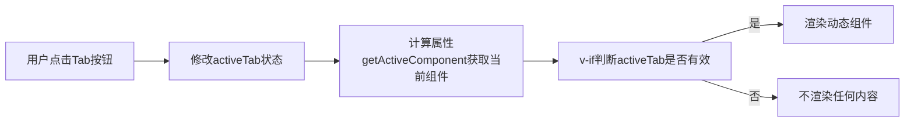

扫描[二维码](https://api2.cmdragon.cn/upload/cmder/20250304_012821924.jpg)关注或者微信搜一搜：`编程智域 前端至全栈交流与成长`

[发现1000+提升效率与开发的AI工具和实用程序](https://tools.cmdragon.cn/zh/apps?category=ai_chat)：https://tools.cmdragon.cn/

### 条件渲染的基础：v-if 与 v-show的区别

在Vue3中，条件渲染的核心是**根据状态决定是否显示元素或组件**。最常用的两个指令是`v-if`和`v-show`，但它们的工作原理和适用场景完全不同——

#### 1. v-if：“真正的”条件渲染

`v-if`会**完全销毁/重建组件**：当条件不满足时，元素会从DOM中移除；条件满足时，重新创建并插入DOM。这种方式的优势是**初始渲染成本低
**（不满足条件时不会渲染），但**切换成本高**（需要销毁重建）。

示例代码：

```vue

<template>
  <div>
    <button @click="toggle">Toggle Content</button>
    <!-- 当isShow为true时，才会渲染<p>标签 -->
    <p v-if="isShow">我是v-if渲染的内容</p>
  </div>
</template>

<script setup>
  import {ref} from 'vue'

  const isShow = ref(true) // 初始显示
  const toggle = () => isShow.value = !isShow.value
</script>
```

#### 2. v-show：“视觉上的”条件渲染

`v-show`不会销毁组件，而是通过**CSS的`display: none`**控制显示隐藏。这种方式的优势是**切换成本低**（只改样式），但**初始渲染成本高
**（无论条件是否满足，都会渲染到DOM）。

示例代码：

```vue

<template>
  <div>
    <button @click="toggle">Toggle Content</button>
    <!-- 始终在DOM中，只是隐藏 -->
    <p v-show="isShow">我是v-show渲染的内容</p>
  </div>
</template>

<script setup>
  import {ref} from 'vue'

  const isShow = ref(true)
  const toggle = () => isShow.value = !isShow.value
</script>
```

#### 关键区别总结

| 特性      | v-if         | v-show        |
|---------|--------------|---------------|
| DOM存在与否 | 销毁/重建        | 始终存在          |
| 切换成本    | 高（销毁重建）      | 低（改CSS）       |
| 初始渲染成本  | 低（不满足则不渲染）   | 高（必渲染）        |
| 适用场景    | 切换频率低（如权限控制） | 切换频率高（如tab切换） |

### 动态组件的基础：<component :is="...">

动态组件是Vue3中**灵活切换组件**的核心工具，通过`<component>`标签配合`:is`属性实现——你可以用一个变量来控制当前渲染的组件。

#### 基本用法

假设我们有两个组件`ComponentA`和`ComponentB`，想要动态切换：

```vue

<template>
  <div>
    <button @click="currentComp = 'ComponentA'">显示A</button>
    <button @click="currentComp = 'ComponentB'">显示B</button>
    <!-- :is绑定当前要渲染的组件 -->
    <component :is="currentComp"></component>
  </div>
</template>

<script setup>
  import {ref} from 'vue'
  // 导入需要的组件
  import ComponentA from './ComponentA.vue'
  import ComponentB from './ComponentB.vue'

  // 当前渲染的组件（初始为ComponentA）
  const currentComp = ref('ComponentA')
</script>
```

#### :is的取值类型

`:is`可以接受三种值：

1. **组件名称字符串**（如上面的`'ComponentA'`，需提前导入）；
2. **组件对象**（直接绑定导入的组件，更推荐，避免字符串拼写错误）；
3. **异步组件**（通过`defineAsyncComponent`导入，适合懒加载）。

比如用组件对象的写法（更安全）：

```vue

<script setup>
  import {ref} from 'vue'
  import ComponentA from './ComponentA.vue'
  import ComponentB from './ComponentB.vue'

  // 直接绑定组件对象
  const currentComp = ref(ComponentA)
</script>
```

### 动态组件与条件渲染的结合：实战案例

当**动态组件需要根据条件决定是否渲染**，或**条件渲染需要动态切换组件**时，两者的结合能发挥更大的威力。最常见的场景是** tabs
切换组件**——

#### 案例：实现一个可切换的Tabs组件

我们要做一个包含“首页”“设置”“个人中心”的Tabs，点击Tab切换对应的组件，且只有激活的Tab才会渲染。

##### 1. 目录结构

```
src/
├── components/
│   ├── Tabs.vue       // 父组件（Tabs容器）
│   ├── HomeTab.vue    // 首页Tab内容
│   ├── SettingsTab.vue// 设置Tab内容
│   └── ProfileTab.vue // 个人中心Tab内容
```

##### 2. Tabs.vue（父组件）代码

```vue

<template>
  <div class="tabs-container">
    <!-- Tab导航栏 -->
    <div class="tabs-header">
      <button
          v-for="tab in tabs"
          :key="tab.id"
          @click="activeTab = tab.id"
          :class="{ active: activeTab === tab.id }"
      >
        {{ tab.title }}
      </button>
    </div>
    <!-- 动态渲染Tab内容 -->
    <div class="tabs-content">
      <!-- 用v-if确保只有激活的Tab才渲染 -->
      <component
          v-if="activeTab"
          :is="getActiveComponent()"
          :tab-data="getActiveTabData()"
      ></component>
    </div>
  </div>
</template>

<script setup>
  import {ref, computed} from 'vue'
  // 导入Tab内容组件
  import HomeTab from './HomeTab.vue'
  import SettingsTab from './SettingsTab.vue'
  import ProfileTab from './ProfileTab.vue'

  // 定义Tab列表（包含每个Tab的配置）
  const tabs = ref([
    {
      id: 'home',
      title: '首页',
      component: HomeTab, // 对应的组件
      data: {msg: '欢迎来到首页！'} // 传递给组件的数据
    },
    {
      id: 'settings',
      title: '设置',
      component: SettingsTab,
      data: {theme: '深色模式'}
    },
    {
      id: 'profile',
      title: '个人中心',
      component: ProfileTab,
      data: {name: '张三'}
    }
  ])

  // 当前激活的Tab（初始为首页）
  const activeTab = ref('home')

  // 计算属性：获取当前激活的组件
  const getActiveComponent = computed(() => {
    return tabs.value.find(tab => tab.id === activeTab.value)?.component
  })

  // 计算属性：获取当前Tab的数据
  const getActiveTabData = computed(() => {
    return tabs.value.find(tab => tab.id === activeTab.value)?.data
  })
</script>

<style scoped>
  .tabs-container {
    margin: 20px;
  }

  .tabs-header {
    margin-bottom: 10px;
  }

  .tabs-header button {
    padding: 8px 16px;
    margin-right: 8px;
    border: none;
    cursor: pointer;
  }

  .tabs-header button.active {
    background: #42b983;
    color: white;
  }

  .tabs-content {
    padding: 20px;
    border: 1px solid #eee;
  }
</style>
```

##### 3. HomeTab.vue（子组件）代码

```vue

<template>
  <div>
    <h3>首页</h3>
    <p>{{ tabData.msg }}</p>
  </div>
</template>

<script setup>
  // 接收父组件传递的tab-data
  defineProps(['tabData'])
</script>
```

#### 结合的核心逻辑

通过**条件渲染（v-if）控制动态组件的显示**，确保只有激活的Tab才会渲染到DOM；同时通过**动态组件（:is）切换不同的Tab内容**
。整个流程可以用流程图表示：



### 实战技巧：保持动态组件的状态

当切换动态组件时，默认情况下Vue会**销毁旧组件、创建新组件**，导致组件的状态（如输入框内容、滚动位置）丢失。这时需要用
`<KeepAlive>`组件**缓存不活动的组件**。

#### 用法示例

在动态组件外层包裹`<KeepAlive>`：

```vue

<template>
  <div>
    <button @click="currentComp = ComponentA">显示A</button>
    <button @click="currentComp = ComponentB">显示B</button>
    <!-- KeepAlive缓存不活动的组件 -->
    <KeepAlive>
      <component :is="currentComp"></component>
    </KeepAlive>
  </div>
</template>
```

#### 效果

当切换回之前的组件时，组件的状态会**保留**（比如ComponentA中的输入框内容不会消失）。

### 课后Quiz：巩固你的理解

#### 问题1：`v-if`和`v-show`的核心区别是什么？在什么场景下应该用`v-if`？

**答案解析**：

- 核心区别：`v-if`通过销毁/重建DOM实现条件渲染，`v-show`通过CSS`display`控制显示隐藏。
- 适用场景：当**切换频率低**（如权限控制、根据用户角色显示内容）时用`v-if`，因为初始渲染成本低；当**切换频率高**
  （如Tab切换、按钮控制显示）时用`v-show`，因为切换成本低。

#### 问题2：动态组件中如何传递数据？

**答案解析**：  
通过**props传递**——在`<component>`标签上绑定props，子组件用`defineProps`接收。比如上面案例中的
`:tab-data="getActiveTabData()"`，子组件用`defineProps(['tabData'])`接收。

### 常见报错及解决方案

#### 报错1：`Failed to resolve component: ComponentA`

**原因**：

1. 没有导入`ComponentA`组件；
2. 导入路径错误（如`./ComponentA.vue`写成`./componentA.vue`，大小写错误）；
3. `:is`绑定的组件名称拼写错误（如`ComponentA`写成`Componenta`）。

**解决**：

- 检查组件导入语句：`import ComponentA from './ComponentA.vue'`；
- 确保路径大小写与文件名一致；
- 推荐用**组件对象**代替字符串（如`currentComp = ref(ComponentA)`），避免拼写错误。

#### 报错2：`Component is missing template or render function.`

**原因**：

1. 组件文件中没有`<template>`标签（如误删了`<template>`）；
2. 组件导出错误（如用`export default`而不是`defineComponent`，或没有导出）；
3. 导入的文件不是Vue组件（如导入了`.js`文件而不是`.vue`）。

**解决**：

- 确保组件文件有完整的`<template>`部分；
- 用Vue3的`defineComponent`导出组件（或用`<script setup>`语法，自动导出）；
- 检查导入路径的文件后缀（必须是`.vue`）。

#### 报错3：`v-if`和`v-for`一起使用时的警告

**原因**：  
Vue3中`v-for`的优先级比`v-if`高（Vue2中相反），一起使用会导致逻辑混乱（比如循环所有元素后再过滤）。

**解决**：  
用**计算属性过滤数据**，避免`v-if`和`v-for`同时作用于同一个元素：

```vue

<template>
  <!-- 不推荐：v-for和v-if一起用 -->
  <li v-for="item in items" v-if="item.active">{{ item.name }}</li>

  <!-- 推荐：用计算属性过滤 -->
  <li v-for="item in activeItems" :key="item.id">{{ item.name }}</li>
</template>

<script setup>
  import {ref, computed} from 'vue'

  const items = ref([{name: 'A', active: true}, {name: 'B', active: false}])
  // 计算属性过滤出active为true的项
  const activeItems = computed(() => items.value.filter(item => item.active))
</script>
```

### 参考链接

- Vue3条件渲染官方文档：https://vuejs.org/guide/essentials/conditional.html
- Vue3动态组件官方文档：https://vuejs.org/guide/essentials/component-basics.html#dynamic-components
- Vue3`<KeepAlive>`官方文档：https://vuejs.org/guide/built-ins/keep-alive.html

余下文章内容请点击跳转至 个人博客页面 或者 扫描[二维码](https://api2.cmdragon.cn/upload/cmder/20250304_012821924.jpg)
关注或者微信搜一搜：`编程智域 前端至全栈交流与成长`
，阅读完整的文章：[Vue3中v-if与v-show的本质区别及动态组件状态保持的关键策略是什么？](https://blog.cmdragon.cn/posts/0242a94dc552b93a1bc335ac4fc33db5/)


<details>
<summary>往期文章归档</summary>

- [Vue3中v-show如何通过CSS修改display属性控制条件显示？与v-if的应用场景该如何区分？](https://blog.cmdragon.cn/posts/97c66a18ae0e9b57c6a69b8b3a41ddf6/)
- [Vue3条件渲染中v-if系列指令如何合理使用与规避错误？](https://blog.cmdragon.cn/posts/8a1ddfac64b25062ac56403e4c1201d2/)
- [Vue3动态样式控制：ref、reactive、watch与computed的应用场景与区别是什么？](https://blog.cmdragon.cn/posts/218c3a59282c3b757447ee08a01937bb/)
- [Vue3中动态样式数组的后项覆盖规则如何与计算属性结合实现复杂状态样式管理？](https://blog.cmdragon.cn/posts/1bab953e41f66ac53de099fa9fe76483/)
- [Vue浅响应式如何解决深层响应式的性能问题？适用场景有哪些？ - cmdragon's Blog](https://blog.cmdragon.cn/posts/c85e1fe16a7ae45e965b4e2df4d9d2f4/)
- [Vue 3组合式API中ref与reactive的核心响应式差异及使用最佳实践是什么？ - cmdragon's Blog](https://blog.cmdragon.cn/posts/be04b02d2723994632de0d4ca22a3391/)
- [Vue 3组合式API中ref与reactive的核心响应式差异及使用最佳实践是什么？ - cmdragon's Blog](https://blog.cmdragon.cn/posts/be04b02d2723994632de0d4ca22a3391/)
- [Vue3响应式系统中，对象新增属性、数组改索引、原始值代理的问题如何解决？ - cmdragon's Blog](https://blog.cmdragon.cn/posts/a0af08dd60a37b9a890a9957f2cbfc9f/)
- [Vue 3中watch侦听器的正确使用姿势你掌握了吗？深度监听、与watchEffect的差异及常见报错解析 - cmdragon's Blog](https://blog.cmdragon.cn/posts/bc287e1e36287afd90750fd907eca85e/)
- [Vue响应式声明的API差异、底层原理与常见陷阱你都搞懂了吗 - cmdragon's Blog](https://blog.cmdragon.cn/posts/654b9447ef1ba7ec1126a1bc26a4726d/)
- [Vue响应式声明的API差异、底层原理与常见陷阱你都搞懂了吗 - cmdragon's Blog](https://blog.cmdragon.cn/posts/654b9447ef1ba7ec1126a1bc26a4726d/)
- [为什么Vue 3需要ref函数？它的响应式原理与正确用法是什么？ - cmdragon's Blog](https://blog.cmdragon.cn/posts/c405a8d9950af5b7c63b56c348ac36b6/)
- [Vue 3中reactive函数如何通过Proxy实现响应式？使用时要避开哪些误区？ - cmdragon's Blog](https://blog.cmdragon.cn/posts/a7e9abb9691a81e4404d9facabe0f7c3/)
- [Vue3响应式系统的底层原理与实践要点你真的懂吗？ - cmdragon's Blog](https://blog.cmdragon.cn/posts/bd995ea45161727597fb85b62566c43d/)
- [Vue 3模板如何通过编译三阶段实现从声明式语法到高效渲染的跨越 - cmdragon's Blog](https://blog.cmdragon.cn/posts/53e3f270a80675df662c6857a3332c0f/)
- [快速入门Vue模板引用：从收DOM“快递”到调子组件方法，你玩明白了吗？ - cmdragon's Blog](https://blog.cmdragon.cn/posts/ddbce4f2a23aa72c96b1c0473900321e/)
- [快速入门Vue模板里的JS表达式有啥不能碰？计算属性为啥比方法更能打？ - cmdragon's Blog](https://blog.cmdragon.cn/posts/23a2d5a334e15575277814c16e45df50/)
- [快速入门Vue的v-model表单绑定：语法糖、动态值、修饰符的小技巧你都掌握了吗？ - cmdragon's Blog](https://blog.cmdragon.cn/posts/6be38de6382e31d282659b689c5b17f0/)
- [快速入门Vue3事件处理的挑战题：v-on、修饰符、自定义事件你能通关吗？ - cmdragon's Blog](https://blog.cmdragon.cn/posts/60ce517684f4a418f453d66aa805606c/)
- [快速入门Vue3的v-指令：数据和DOM的“翻译官”到底有多少本事？ - cmdragon's Blog](https://blog.cmdragon.cn/posts/e4ae7d5e4a9205bb11b2baccb230c637/)
- [快速入门Vue3，插值、动态绑定和避坑技巧你都搞懂了吗？ - cmdragon's Blog](https://blog.cmdragon.cn/posts/999ce4fb32259ff4fbf4bf7bcb851654/)
- [想让PostgreSQL快到飞起？先找健康密码还是先换引擎？ - cmdragon's Blog](https://blog.cmdragon.cn/posts/a6997d81b49cd232b87e1cf603888ad1/)
- [想让PostgreSQL查询快到飞起？分区表、物化视图、并行查询这三招灵不灵？ - cmdragon's Blog](https://blog.cmdragon.cn/posts/1fee7afbb9abd4540b8aa9c141d6845d/)
- [子查询总拖慢查询？把它变成连接就能解决？ - cmdragon's Blog](https://blog.cmdragon.cn/posts/79c590fbd87ece535b11a71c9667884f/)
- [PostgreSQL全表扫描慢到崩溃？建索引+改查询+更统计信息三招能破？ - cmdragon's Blog](https://blog.cmdragon.cn/posts/748cdac2536008199abf8a8a2cd0ec85/)
- [复杂查询总拖后腿？PostgreSQL多列索引+覆盖索引的神仙技巧你get没？ - cmdragon's Blog](https://blog.cmdragon.cn/posts/32ca943703226d317d4276a8fb53b0dd/)
- [只给表子集建索引？用函数结果建索引？PostgreSQL这俩操作凭啥能省空间又加速？ - cmdragon's Blog](https://blog.cmdragon.cn/posts/ca93f1d53aa910e7ba5ffd8df611c12b/)
- [B-tree索引像字典查词一样工作？那哪些数据库查询它能加速，哪些不能？ - cmdragon's Blog](https://blog.cmdragon.cn/posts/f507856ebfddd592448813c510a53669/)
- [想抓PostgreSQL里的慢SQL？pg_stat_statements基础黑匣子和pg_stat_monitor时间窗，谁能帮你更准揪出性能小偷？ - cmdragon's Blog](https://blog.cmdragon.cn/posts/b2213bfcb5b88a862f2138404c03d596/)
- [PostgreSQL的“时光机”MVCC和锁机制是怎么搞定高并发的？ - cmdragon's Blog](https://blog.cmdragon.cn/posts/26614eb7da6c476dde41d367ad888d2f/)
- [PostgreSQL性能暴涨的关键？内存IO并发参数居然要这么设置？ - cmdragon's Blog](https://blog.cmdragon.cn/posts/69f99bc6972a860d559c74aad7280da4/)
- [大表查询慢到翻遍整个书架？PostgreSQL分区表教你怎么“分类”才高效](https://blog.cmdragon.cn/posts/7b7053f392147a8b3b1a16bebeb08d0a/)
- [PostgreSQL 查询慢？是不是忘了优化 GROUP BY、ORDER BY 和窗口函数？ - cmdragon's Blog](https://blog.cmdragon.cn/posts/c856e3cb073822349f3bf2d29995dcfc/)
- [PostgreSQL里的子查询和CTE居然在性能上“掐架”？到底该站哪边？ - cmdragon's Blog](https://blog.cmdragon.cn/posts/c096347d18e67b7431faacd2c4757093/)
- [PostgreSQL选Join策略有啥小九九？Nested Loop/Merge/Hash谁是它的菜？ - cmdragon's Blog](https://blog.cmdragon.cn/posts/2eca89463454fd4250d7b66243b9fe5a/)
- [PostgreSQL新手SQL总翻车？这7个性能陷阱你踩过没？ - cmdragon's Blog](https://blog.cmdragon.cn/posts/068ecb772a87d7df20a8c9fb4b233f8e/)
- [PostgreSQL索引选B-Tree还是GiST？“瑞士军刀”和“多面手”的差别你居然还不知道？ - cmdragon's Blog](https://blog.cmdragon.cn/posts/d498f63cd0a2d5a77e445c688a8b88db/)
- [想知道数据库怎么给查询“算成本选路线”？EXPLAIN能帮你看明白？ - cmdragon's Blog](https://blog.cmdragon.cn/posts/9101b75bdec6faea9b35d54f14e37f36/)
- [PostgreSQL处理SQL居然像做蛋糕？解析到执行的4步里藏着多少查询优化的小心机？ - cmdragon's Blog](https://blog.cmdragon.cn/posts/d527f8ebb6e3dae2c7dfe4c8d8979444/)
- [PostgreSQL备份不是复制文件？物理vs逻辑咋选？误删还能精准恢复到1分钟前？ - cmdragon's Blog](https://blog.cmdragon.cn/posts/6bfdae84f313cf7ad0bb7045c4392347/)
- [转账不翻车、并发不干扰，PostgreSQL的ACID特性到底有啥魔法？ - cmdragon's Blog](https://blog.cmdragon.cn/posts/de3672803de34dbad244d0a8d48b0eb5/)
- [银行转账不白扣钱、电商下单不超卖，PostgreSQL事务的诀窍是啥？ - cmdragon's Blog](https://blog.cmdragon.cn/posts/e463e8a2668abdf00a228c9b79324ded/)
- [PostgreSQL里的PL/pgSQL到底是啥？能让SQL从“说目标”变“讲步骤”？ - cmdragon's Blog](https://blog.cmdragon.cn/posts/5c967e595058c4a1fc4474a68e64031d/)
- [PostgreSQL视图不存数据？那它怎么简化查询还能递归生成序列和控制权限？ - cmdragon's Blog](https://blog.cmdragon.cn/posts/325047855e3e23b5ef82f7d2db134fbd/)
- [PostgreSQL索引这么玩，才能让你的查询真的“飞”起来？ - cmdragon's Blog](https://blog.cmdragon.cn/posts/d2dba50bb6e4df7b27e735245a06a2a2/)
- [PostgreSQL的表关系和约束，咋帮你搞定用户订单不混乱、学生选课不重复？ - cmdragon's Blog](https://blog.cmdragon.cn/posts/849ae5bab0f8c66e94c2f6ad1bb798e3/)
- [PostgreSQL查询的筛子、排序、聚合、分组？你会用它们搞定数据吗？ - cmdragon's Blog](https://blog.cmdragon.cn/posts/ef4800975ffa84f1ca51976a70a1585b/)
- [PostgreSQL数据类型怎么选才高效不踩坑？ - cmdragon's Blog](https://blog.cmdragon.cn/posts/bf54711525c507c5eacfa7b0151c39d2/)
- [想解锁PostgreSQL查询从基础到进阶的核心知识点？你都get了吗？ - cmdragon's Blog](https://blog.cmdragon.cn/posts/887809b3e0375f5956873cd442f516d8/)
- [PostgreSQL DELETE居然有这些操作？返回数据、连表删你试过没？ - cmdragon's Blog](https://blog.cmdragon.cn/posts/934be1203725e8be9d6f6e9104e5abcc/)
- [PostgreSQL UPDATE语句怎么玩？从改邮箱到批量更新的避坑技巧你都会吗？ - cmdragon's Blog](https://blog.cmdragon.cn/posts/0f0622e9b7402b599e618150d0596ffe/)
- [PostgreSQL插入数据还在逐条敲？批量、冲突处理、返回自增ID的技巧你会吗？ - cmdragon's Blog](https://blog.cmdragon.cn/posts/0e3bf7efc030b024ea67ee855a00f2de/)
- [PostgreSQL的“仓库-房间-货架”游戏，你能建出电商数据库和表吗？ - cmdragon's Blog](https://blog.cmdragon.cn/posts/b6cd3c86da6aac26ed829e472d34078e/)
- [PostgreSQL 17安装总翻车？Windows/macOS/Linux避坑指南帮你搞定？ - cmdragon's Blog](https://blog.cmdragon.cn/posts/ba1f545a3410144552fbdbfcf31b5265/)
- [能当关系型数据库还能玩对象特性，能拆复杂查询还能自动管库存，PostgreSQL凭什么这么香？ - cmdragon's Blog](https://blog.cmdragon.cn/posts/b5474d1480509c5072085abc80b3dd9f/)
- [给接口加新字段又不搞崩老客户端？FastAPI的多版本API靠哪三招实现？ - cmdragon's Blog](https://blog.cmdragon.cn/posts/cc098d8836e787baa8a4d92e4d56d5c5/)
- [流量突增要搞崩FastAPI？熔断测试是怎么防系统雪崩的？ - cmdragon's Blog](https://blog.cmdragon.cn/posts/46d05151c5bd31cf37a7bcf0b8f5b0b8/)
- [FastAPI秒杀库存总变负数？Redis分布式锁能帮你守住底线吗 - cmdragon's Blog](https://blog.cmdragon.cn/posts/65ce343cc5df9faf3a8e2eeaab42ae45/)
- [FastAPI的CI流水线怎么自动测端点，还能让Allure报告美到犯规？ - cmdragon's Blog](https://blog.cmdragon.cn/posts/eed6cd8985d9be0a4b092a7da38b3e0c/)
- [如何用GitHub Actions为FastAPI项目打造自动化测试流水线？ - cmdragon's Blog](https://blog.cmdragon.cn/posts/6157d87338ce894d18c013c3c4777abb/)

</details>


<details>
<summary>免费好用的热门在线工具</summary>

- [RAID 计算器 - 应用商店 | By cmdragon](https://tools.cmdragon.cn/zh/apps/raid-calculator)
- [在线PS - 应用商店 | By cmdragon](https://tools.cmdragon.cn/zh/apps/photoshop-online)
- [Mermaid 在线编辑器 - 应用商店 | By cmdragon](https://tools.cmdragon.cn/zh/apps/mermaid-live-editor)
- [数学求解计算器 - 应用商店 | By cmdragon](https://tools.cmdragon.cn/zh/apps/math-solver-calculator)
- [智能提词器 - 应用商店 | By cmdragon](https://tools.cmdragon.cn/zh/apps/smart-teleprompter)
- [魔法简历 - 应用商店 | By cmdragon](https://tools.cmdragon.cn/zh/apps/magic-resume)
- [Image Puzzle Tool - 图片拼图工具 | By cmdragon](https://tools.cmdragon.cn/zh/apps/image-puzzle-tool)
- [字幕下载工具 - 应用商店 | By cmdragon](https://tools.cmdragon.cn/zh/apps/subtitle-downloader)
- [歌词生成工具 - 应用商店 | By cmdragon](https://tools.cmdragon.cn/zh/apps/lyrics-generator)
- [网盘资源聚合搜索 - 应用商店 | By cmdragon](https://tools.cmdragon.cn/zh/apps/cloud-drive-search)
- [ASCII字符画生成器 - 应用商店 | By cmdragon](https://tools.cmdragon.cn/zh/apps/ascii-art-generator)
- [JSON Web Tokens 工具 - 应用商店 | By cmdragon](https://tools.cmdragon.cn/zh/apps/jwt-tool)
- [Bcrypt 密码工具 - 应用商店 | By cmdragon](https://tools.cmdragon.cn/zh/apps/bcrypt-tool)
- [GIF 合成器 - 应用商店 | By cmdragon](https://tools.cmdragon.cn/zh/apps/gif-composer)
- [GIF 分解器 - 应用商店 | By cmdragon](https://tools.cmdragon.cn/zh/apps/gif-decomposer)
- [文本隐写术 - 应用商店 | By cmdragon](https://tools.cmdragon.cn/zh/apps/text-steganography)
- [CMDragon 在线工具 - 高级AI工具箱与开发者套件 | 免费好用的在线工具](https://tools.cmdragon.cn/zh)
- [应用商店 - 发现1000+提升效率与开发的AI工具和实用程序 | 免费好用的在线工具](https://tools.cmdragon.cn/zh/apps?category=trending)
- [CMDragon 更新日志 - 最新更新、功能与改进 | 免费好用的在线工具](https://tools.cmdragon.cn/zh/changelog)
- [支持我们 - 成为赞助者 | 免费好用的在线工具](https://tools.cmdragon.cn/zh/sponsor)
- [AI文本生成图像 - 应用商店 | 免费好用的在线工具](https://tools.cmdragon.cn/zh/apps/text-to-image-ai)
- [临时邮箱 - 应用商店 | 免费好用的在线工具](https://tools.cmdragon.cn/zh/apps/temp-email)
- [二维码解析器 - 应用商店 | 免费好用的在线工具](https://tools.cmdragon.cn/zh/apps/qrcode-parser)
- [文本转思维导图 - 应用商店 | 免费好用的在线工具](https://tools.cmdragon.cn/zh/apps/text-to-mindmap)
- [正则表达式可视化工具 - 应用商店 | 免费好用的在线工具](https://tools.cmdragon.cn/zh/apps/regex-visualizer)
- [文件隐写工具 - 应用商店 | 免费好用的在线工具](https://tools.cmdragon.cn/zh/apps/steganography-tool)
- [IPTV 频道探索器 - 应用商店 | 免费好用的在线工具](https://tools.cmdragon.cn/zh/apps/iptv-explorer)
- [快传 - 应用商店 | 免费好用的在线工具](https://tools.cmdragon.cn/zh/apps/snapdrop)
- [随机抽奖工具 - 应用商店 | 免费好用的在线工具](https://tools.cmdragon.cn/zh/apps/lucky-draw)
- [动漫场景查找器 - 应用商店 | 免费好用的在线工具](https://tools.cmdragon.cn/zh/apps/anime-scene-finder)
- [时间工具箱 - 应用商店 | 免费好用的在线工具](https://tools.cmdragon.cn/zh/apps/time-toolkit)
- [网速测试 - 应用商店 | 免费好用的在线工具](https://tools.cmdragon.cn/zh/apps/speed-test)
- [AI 智能抠图工具 - 应用商店 | 免费好用的在线工具](https://tools.cmdragon.cn/zh/apps/background-remover)
- [背景替换工具 - 应用商店 | 免费好用的在线工具](https://tools.cmdragon.cn/zh/apps/background-replacer)
- [艺术二维码生成器 - 应用商店 | 免费好用的在线工具](https://tools.cmdragon.cn/zh/apps/artistic-qrcode)
- [Open Graph 元标签生成器 - 应用商店 | 免费好用的在线工具](https://tools.cmdragon.cn/zh/apps/open-graph-generator)
- [图像对比工具 - 应用商店 | 免费好用的在线工具](https://tools.cmdragon.cn/zh/apps/image-comparison)
- [图片压缩专业版 - 应用商店 | 免费好用的在线工具](https://tools.cmdragon.cn/zh/apps/image-compressor)
- [密码生成器 - 应用商店 | 免费好用的在线工具](https://tools.cmdragon.cn/zh/apps/password-generator)
- [SVG优化器 - 应用商店 | 免费好用的在线工具](https://tools.cmdragon.cn/zh/apps/svg-optimizer)
- [调色板生成器 - 应用商店 | 免费好用的在线工具](https://tools.cmdragon.cn/zh/apps/color-palette)
- [在线节拍器 - 应用商店 | 免费好用的在线工具](https://tools.cmdragon.cn/zh/apps/online-metronome)
- [IP归属地查询 - 应用商店 | 免费好用的在线工具](https://tools.cmdragon.cn/zh/apps/ip-geolocation)
- [CSS网格布局生成器 - 应用商店 | 免费好用的在线工具](https://tools.cmdragon.cn/zh/apps/css-grid-layout)
- [邮箱验证工具 - 应用商店 | 免费好用的在线工具](https://tools.cmdragon.cn/zh/apps/email-validator)
- [书法练习字帖 - 应用商店 | 免费好用的在线工具](https://tools.cmdragon.cn/zh/apps/calligraphy-practice)
- [金融计算器套件 - 应用商店 | 免费好用的在线工具](https://tools.cmdragon.cn/zh/apps/finance-calculator-suite)
- [中国亲戚关系计算器 - 应用商店 | 免费好用的在线工具](https://tools.cmdragon.cn/zh/apps/chinese-kinship-calculator)
- [Protocol Buffer 工具箱 - 应用商店 | 免费好用的在线工具](https://tools.cmdragon.cn/zh/apps/protobuf-toolkit)
- [IP归属地查询 - 应用商店 | 免费好用的在线工具](https://tools.cmdragon.cn/zh/apps/ip-geolocation)
- [图片无损放大 - 应用商店 | 免费好用的在线工具](https://tools.cmdragon.cn/zh/apps/image-upscaler)
- [文本比较工具 - 应用商店 | 免费好用的在线工具](https://tools.cmdragon.cn/zh/apps/text-compare)
- [IP批量查询工具 - 应用商店 | 免费好用的在线工具](https://tools.cmdragon.cn/zh/apps/ip-batch-lookup)
- [域名查询工具 - 应用商店 | 免费好用的在线工具](https://tools.cmdragon.cn/zh/apps/domain-finder)
- [DNS工具箱 - 应用商店 | 免费好用的在线工具](https://tools.cmdragon.cn/zh/apps/dns-toolkit)
- [网站图标生成器 - 应用商店 | 免费好用的在线工具](https://tools.cmdragon.cn/zh/apps/favicon-generator)
- [XML Sitemap](https://tools.cmdragon.cn/sitemap_index.xml)

</details>