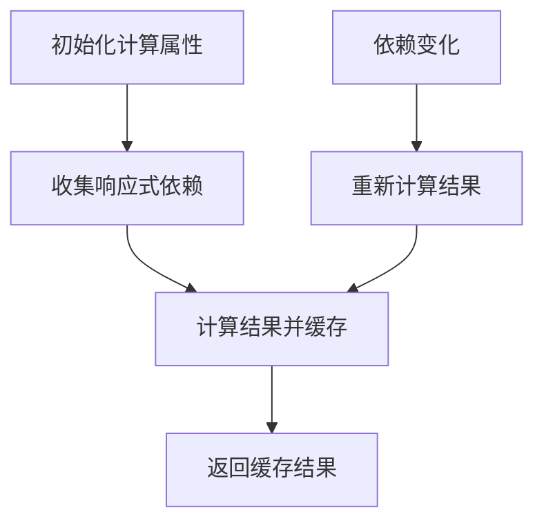
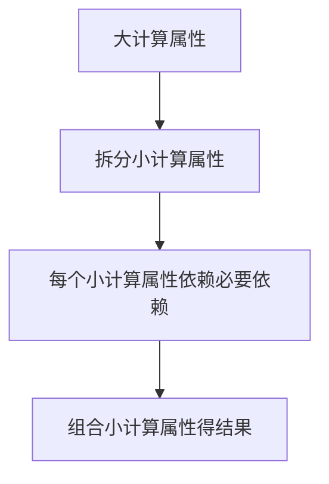

扫描[二维码](https://api2.cmdragon.cn/upload/cmder/20250304_012821924.jpg)关注或者微信搜一搜：`编程智域 前端至全栈交流与成长`

[发现1000+提升效率与开发的AI工具和实用程序](https://tools.cmdragon.cn/zh/apps?category=ai_chat)：https://tools.cmdragon.cn/

### 计算属性的缓存原理：像“备忘录”一样工作

在聊性能优化前，我们得先搞懂计算属性的「核心魔法」——**基于响应式依赖的缓存**
。官网里说：“计算属性是基于它们的响应式依赖进行缓存的”，翻译成人话就是：Vue会偷偷记录计算属性用到了哪些响应式数据（比如`ref`或
`reactive`的变量），只有当这些数据变了，计算属性才会重新计算；如果依赖没变化，直接复用之前的结果。

类比一下：你有个备忘录，记着“今天的总开销=早餐10元+午餐20元+晚餐15元”。如果早餐钱没变，午餐钱没变，晚餐钱也没变，你不会再算一遍——直接看备忘录就行。但如果晚餐改成20元，你就得重新算一遍总开销，再更新备忘录。计算属性的缓存逻辑，和这个备忘录完全一样。

### 缓存失效的3个常见场景，踩过坑的都懂

缓存是个好东西，但用不对就会“失效”——明明改了变量，计算属性却纹丝不动。我们来扒扒最常见的3个场景：

#### 场景1：依赖了「非响应式数据」

**例子**：你写了个计算属性算折扣后的总价，依赖了一个普通JS变量`discount`：

```js
import {ref, reactive, computed} from 'vue'

const products = reactive([{price: 100, quantity: 2}])
const coupon = ref(20)
let discount = 0.8 // 非响应式变量！

// 计算属性：总价=（商品总价-优惠券）×折扣
const total = computed(() => {
    const subtotal = products.reduce((sum, p) => sum + p.price * p.quantity, 0)
    return (subtotal - coupon.value) * discount
})
```

当你修改`discount = 0.9`时，会发现`total`的值**压根没变化**——因为`discount`不是响应式数据（没包`ref`或`reactive`
），Vue根本“看不到”它的变化，自然不会触发重新计算。

**解决办法**：把非响应式变量改成响应式的！

```js
const discount = ref(0.8) // 改成ref
const total = computed(() => {
    return (subtotal - coupon.value) * discount.value // 用.value访问
})
```

#### 场景2：响应式对象被「解构丢失响应式」

**例子**：你用`reactive`定义了一个对象，解构后直接用属性：

```js
import {reactive, computed} from 'vue'

const user = reactive({name: '张三', age: 18})
const {age} = user // 解构时没加toRefs！

const isAdult = computed(() => age >= 18)
```

当你修改`user.age = 20`时，`isAdult`**不会更新**——因为`age`已经变成了普通变量（解构`reactive`对象时，会失去响应式）。

**解决办法**：用`toRefs`保留响应式：

```js
import {reactive, toRefs, computed} from 'vue'

const user = reactive({name: '张三', age: 18})
const {age} = toRefs(user) // 用toRefs解构

const isAdult = computed(() => age.value >= 18) // 用.value访问
```

#### 场景3：主动触发缓存失效的需求

有时候我们想**强制让计算属性更新**，比如用户点击“刷新”按钮时，不管依赖有没有变，都要重新计算。这时候可以加一个「空依赖」——用一个
`ref`变量当“开关”：

```js
import {ref, computed} from 'vue'

const refreshTrigger = ref(0) // 空依赖开关
const data = ref([])

// 计算属性依赖data和refreshTrigger
const processedData = computed(() => {
    refreshTrigger.value // 引用开关，让开关变时触发重新计算
    return data.value.map(item => item * 2)
})

// 主动刷新：修改开关的值
const refresh = () => {
    refreshTrigger.value++ // 每次加1，触发重新计算
}
```

### 依赖精简：给计算属性“瘦个身”

缓存失效是“没更该更的”，而依赖冗余是“更了不该更的”——比如计算属性依赖了10个响应式数据，但其实只需要3个，结果只要其中1个变了，整个计算属性都要重新跑一遍，浪费性能。

我们的目标是：**让计算属性只依赖「必要的响应式数据」**，常用技巧有3个：

#### 技巧1：拆分计算属性，拆成“小颗粒”

把大的计算属性拆成多个小的，每个只做一件事。比如一个“过滤+排序+统计”的计算属性，可以拆成3步：

```js
import {ref, computed} from 'vue'

const rawList = ref([1, 3, 2, 5, 4])
const filterKeyword = ref('') // 过滤关键词
const sortType = ref('asc') // 排序类型（升序/降序）

// 1. 过滤列表：只依赖rawList和filterKeyword
const filteredList = computed(() => {
    return rawList.value.filter(item => item.toString().includes(filterKeyword.value))
})

// 2. 排序列表：只依赖filteredList和sortType
const sortedList = computed(() => {
    return [...filteredList.value].sort((a, b) => {
        return sortType.value === 'asc' ? a - b : b - a
    })
})

// 3. 统计数量：只依赖sortedList
const total = computed(() => sortedList.value.length)
```

这样优化后：

- 改`filterKeyword`，只有`filteredList`、`sortedList`、`total`更新；
- 改`sortType`，只有`sortedList`、`total`更新；
- 改`rawList`，三个计算属性都更新；
  相比原来的“大计算属性”，**减少了很多不必要的重新计算**。

#### 技巧2：取“具体属性”，别拿“整个对象”

如果计算属性依赖`reactive`对象，**别直接用整个对象**，要取具体的属性。比如依赖路由参数时：

```js
import {useRoute, computed} from 'vue-router'

const route = useRoute()

// 坏例子：依赖整个route，任何路由变化都触发计算
const userIdBad = computed(() => route.params.id)

// 好例子：只依赖route.params.id，只有id变时才触发
const userIdGood = computed(() => route.params.id)
```

再比如依赖`reactive`对象的属性：

```js
import {reactive, toRef, computed} from 'vue'

const user = reactive({name: '张三', age: 18})

// 坏例子：依赖整个user，name变时也会触发计算
const isAdultBad = computed(() => user.age >= 18)

// 好例子：用toRef取age，只依赖age
const ageRef = toRef(user, 'age')
const isAdultGood = computed(() => ageRef.value >= 18)
```

#### 技巧3：避免“间接依赖”

别在计算属性里用**不需要的响应式数据**。比如你想算“购物车总价格”，但不小心用了`$route`（路由）的参数——这会导致*
*路由变化时，总价格也重新计算**，完全没必要！

```js
// 坏例子：依赖了$route（不必要）
const totalBad = computed(() => {
    const {shopId} = useRoute().params // 没用的依赖
    return products.value.reduce((sum, p) => sum + p.price, 0)
})

// 好例子：去掉不必要的依赖
const totalGood = computed(() => {
    return products.value.reduce((sum, p) => sum + p.price, 0)
})
```

### 实战案例：优化购物车总价格计算

我们用一个真实场景验证优化效果——**计算购物车的「折后总价」**：

- 原始需求：总价=（商品总价-优惠券）×折扣；
- 响应式数据：`products`（商品列表，`reactive`数组）、`coupon`（优惠券，`ref`）、`discount`（折扣，`ref`）。

#### 优化前：大计算属性“负重前行”

```js
import {reactive, ref, computed} from 'vue'

const products = reactive([
    {id: 1, price: 100, quantity: 2},
    {id: 2, price: 200, quantity: 1}
])
const coupon = ref(50)
const discount = ref(0.8)

// 大计算属性：依赖所有数据，改任何一个都要重新遍历整个列表
const total = computed(() => {
    const subtotal = products.reduce((sum, p) => sum + p.price * p.quantity, 0)
    return (subtotal - coupon.value) * discount.value
})
```

当`coupon`或`discount`变化时，`total`会重新遍历整个`products`数组——如果商品有1000个，这会浪费很多时间！

#### 优化后：拆分计算属性“轻装上阵”

```js
// 1. 计算每个商品的小计：只依赖products
const productSubtotals = computed(() => {
    return products.map(p => p.price * p.quantity)
})

// 2. 计算减优惠券后的总价：只依赖productSubtotals和coupon
const totalBeforeDiscount = computed(() => {
    return productSubtotals.value.reduce((sum, s) => sum + s, 0) - coupon.value
})

// 3. 计算折后总价：只依赖totalBeforeDiscount和discount
const total = computed(() => {
    return totalBeforeDiscount.value * discount.value
})
```

优化后：

- 改`coupon`：只有`totalBeforeDiscount`和`total`更新，不用遍历`products`；
- 改`discount`：只有`total`更新，其他都不动；
- 改`products`：只有`productSubtotals`、`totalBeforeDiscount`、`total`更新——这是必须的，因为商品数据变了。

### 缓存原理与依赖精简的流程图

用两张图帮你快速理解核心逻辑：

#### 1. 计算属性的缓存流程



#### 2. 依赖精简的拆分逻辑



### 课后Quiz：巩固你的理解

#### 问题1：修改了变量但计算属性没更新，可能是什么原因？

**答案与解析**：

1. **依赖了非响应式数据**：比如用`let`定义的普通变量（如`let discount = 0.8`），Vue无法追踪其变化。解决：改成`ref`或
   `reactive`。
2. **响应式对象解构丢失响应式**：比如`const { age } = reactive({ age: 18 })`，`age`变成普通变量。解决：用`toRefs`解构（
   `const { age } = toRefs(user)`）。
3. **依赖了非响应式对象的属性**：比如`const obj = { a: 1 }`，计算属性依赖`obj.a`，修改`obj.a`时不会触发更新。解决：把`obj`改成
   `reactive`。

#### 问题2：如何优化依赖多个响应式数据的计算属性？

**答案与解析**：

1. **拆分计算属性**：把大计算属性拆成多个小的，每个只依赖必要数据（如把“过滤+排序+统计”拆成3步）。
2. **取具体属性**：用`toRef`或`toRefs`取响应式对象的具体属性，避免依赖整个对象（如`const ageRef = toRef(user, 'age')`）。
3. **删除不必要依赖**：去掉计算属性里用不到的响应式数据（如`$route`的非必要参数）。

### 常见报错与解决办法

#### 报错1：计算属性没跟着变量更新

**现象**：修改了变量，计算属性的值没变化。  
**原因**：依赖的变量不是响应式数据，或响应式数据未被正确追踪。  
**解决**：

- 检查变量是否是`ref`或`reactive`；
- 解构`reactive`对象时用`toRefs`；
- 避免依赖非响应式数据（如普通`let`变量）。

#### 报错2：计算属性频繁更新，页面卡顿

**现象**：明明只改了一个小变量，计算属性却反复重新计算。  
**原因**：依赖了过多不必要的响应式数据（如依赖整个`$route`对象）。  
**解决**：

- 拆分计算属性，减少每个计算属性的依赖；
- 用`toRef`取响应式对象的具体属性（如`route.params.id`而不是`route`）；
- 删除计算属性里的无用依赖。

#### 预防建议：

1. 写计算属性前，先列清楚“用到了哪些响应式数据”；
2. 尽量用`ref`而不是`reactive`（`ref`的响应式更直观）；
3. 解构`reactive`对象时，必用`toRefs`。

参考链接：https://vuejs.org/guide/essentials/computed.html

余下文章内容请点击跳转至 个人博客页面 或者 扫描[二维码](https://api2.cmdragon.cn/upload/cmder/20250304_012821924.jpg)
关注或者微信搜一搜：`编程智域 前端至全栈交流与成长`
，阅读完整的文章：[Vue计算属性缓存与依赖优化：如何避免“改了不更新”并精简依赖？](https://blog.cmdragon.cn/posts/a145200829769ff66bffedd24b86630b/)


<details>
<summary>往期文章归档</summary>

- [Vue浅响应式如何解决深层响应式的性能问题？适用场景有哪些？ - cmdragon's Blog](https://blog.cmdragon.cn/posts/c85e1fe16a7ae45e965b4e2df4d9d2f4/)
- [Vue 3组合式API中ref与reactive的核心响应式差异及使用最佳实践是什么？ - cmdragon's Blog](https://blog.cmdragon.cn/posts/be04b02d2723994632de0d4ca22a3391/)
- [Vue 3组合式API中ref与reactive的核心响应式差异及使用最佳实践是什么？ - cmdragon's Blog](https://blog.cmdragon.cn/posts/be04b02d2723994632de0d4ca22a3391/)
- [Vue3响应式系统中，对象新增属性、数组改索引、原始值代理的问题如何解决？ - cmdragon's Blog](https://blog.cmdragon.cn/posts/a0af08dd60a37b9a890a9957f2cbfc9f/)
- [Vue 3中watch侦听器的正确使用姿势你掌握了吗？深度监听、与watchEffect的差异及常见报错解析 - cmdragon's Blog](https://blog.cmdragon.cn/posts/bc287e1e36287afd90750fd907eca85e/)
- [Vue响应式声明的API差异、底层原理与常见陷阱你都搞懂了吗 - cmdragon's Blog](https://blog.cmdragon.cn/posts/654b9447ef1ba7ec1126a1bc26a4726d/)
- [Vue响应式声明的API差异、底层原理与常见陷阱你都搞懂了吗 - cmdragon's Blog](https://blog.cmdragon.cn/posts/654b9447ef1ba7ec1126a1bc26a4726d/)
- [为什么Vue 3需要ref函数？它的响应式原理与正确用法是什么？ - cmdragon's Blog](https://blog.cmdragon.cn/posts/c405a8d9950af5b7c63b56c348ac36b6/)
- [Vue 3中reactive函数如何通过Proxy实现响应式？使用时要避开哪些误区？ - cmdragon's Blog](https://blog.cmdragon.cn/posts/a7e9abb9691a81e4404d9facabe0f7c3/)
- [Vue3响应式系统的底层原理与实践要点你真的懂吗？ - cmdragon's Blog](https://blog.cmdragon.cn/posts/bd995ea45161727597fb85b62566c43d/)
- [Vue 3模板如何通过编译三阶段实现从声明式语法到高效渲染的跨越 - cmdragon's Blog](https://blog.cmdragon.cn/posts/53e3f270a80675df662c6857a3332c0f/)
- [快速入门Vue模板引用：从收DOM“快递”到调子组件方法，你玩明白了吗？ - cmdragon's Blog](https://blog.cmdragon.cn/posts/ddbce4f2a23aa72c96b1c0473900321e/)
- [快速入门Vue模板里的JS表达式有啥不能碰？计算属性为啥比方法更能打？ - cmdragon's Blog](https://blog.cmdragon.cn/posts/23a2d5a334e15575277814c16e45df50/)
- [快速入门Vue的v-model表单绑定：语法糖、动态值、修饰符的小技巧你都掌握了吗？ - cmdragon's Blog](https://blog.cmdragon.cn/posts/6be38de6382e31d282659b689c5b17f0/)
- [快速入门Vue3事件处理的挑战题：v-on、修饰符、自定义事件你能通关吗？ - cmdragon's Blog](https://blog.cmdragon.cn/posts/60ce517684f4a418f453d66aa805606c/)
- [快速入门Vue3的v-指令：数据和DOM的“翻译官”到底有多少本事？ - cmdragon's Blog](https://blog.cmdragon.cn/posts/e4ae7d5e4a9205bb11b2baccb230c637/)
- [快速入门Vue3，插值、动态绑定和避坑技巧你都搞懂了吗？ - cmdragon's Blog](https://blog.cmdragon.cn/posts/999ce4fb32259ff4fbf4bf7bcb851654/)
- [想让PostgreSQL快到飞起？先找健康密码还是先换引擎？ - cmdragon's Blog](https://blog.cmdragon.cn/posts/a6997d81b49cd232b87e1cf603888ad1/)
- [想让PostgreSQL查询快到飞起？分区表、物化视图、并行查询这三招灵不灵？ - cmdragon's Blog](https://blog.cmdragon.cn/posts/1fee7afbb9abd4540b8aa9c141d6845d/)
- [子查询总拖慢查询？把它变成连接就能解决？ - cmdragon's Blog](https://blog.cmdragon.cn/posts/79c590fbd87ece535b11a71c9667884f/)
- [PostgreSQL全表扫描慢到崩溃？建索引+改查询+更统计信息三招能破？ - cmdragon's Blog](https://blog.cmdragon.cn/posts/748cdac2536008199abf8a8a2cd0ec85/)
- [复杂查询总拖后腿？PostgreSQL多列索引+覆盖索引的神仙技巧你get没？ - cmdragon's Blog](https://blog.cmdragon.cn/posts/32ca943703226d317d4276a8fb53b0dd/)
- [只给表子集建索引？用函数结果建索引？PostgreSQL这俩操作凭啥能省空间又加速？ - cmdragon's Blog](https://blog.cmdragon.cn/posts/ca93f1d53aa910e7ba5ffd8df611c12b/)
- [B-tree索引像字典查词一样工作？那哪些数据库查询它能加速，哪些不能？ - cmdragon's Blog](https://blog.cmdragon.cn/posts/f507856ebfddd592448813c510a53669/)
- [想抓PostgreSQL里的慢SQL？pg_stat_statements基础黑匣子和pg_stat_monitor时间窗，谁能帮你更准揪出性能小偷？ - cmdragon's Blog](https://blog.cmdragon.cn/posts/b2213bfcb5b88a862f2138404c03d596/)
- [PostgreSQL的“时光机”MVCC和锁机制是怎么搞定高并发的？ - cmdragon's Blog](https://blog.cmdragon.cn/posts/26614eb7da6c476dde41d367ad888d2f/)
- [PostgreSQL性能暴涨的关键？内存IO并发参数居然要这么设置？ - cmdragon's Blog](https://blog.cmdragon.cn/posts/69f99bc6972a860d559c74aad7280da4/)
- [大表查询慢到翻遍整个书架？PostgreSQL分区表教你怎么“分类”才高效](https://blog.cmdragon.cn/posts/7b7053f392147a8b3b1a16bebeb08d0a/)
- [PostgreSQL 查询慢？是不是忘了优化 GROUP BY、ORDER BY 和窗口函数？ - cmdragon's Blog](https://blog.cmdragon.cn/posts/c856e3cb073822349f3bf2d29995dcfc/)
- [PostgreSQL里的子查询和CTE居然在性能上“掐架”？到底该站哪边？ - cmdragon's Blog](https://blog.cmdragon.cn/posts/c096347d18e67b7431faacd2c4757093/)
- [PostgreSQL选Join策略有啥小九九？Nested Loop/Merge/Hash谁是它的菜？ - cmdragon's Blog](https://blog.cmdragon.cn/posts/2eca89463454fd4250d7b66243b9fe5a/)
- [PostgreSQL新手SQL总翻车？这7个性能陷阱你踩过没？ - cmdragon's Blog](https://blog.cmdragon.cn/posts/068ecb772a87d7df20a8c9fb4b233f8e/)
- [PostgreSQL索引选B-Tree还是GiST？“瑞士军刀”和“多面手”的差别你居然还不知道？ - cmdragon's Blog](https://blog.cmdragon.cn/posts/d498f63cd0a2d5a77e445c688a8b88db/)
- [想知道数据库怎么给查询“算成本选路线”？EXPLAIN能帮你看明白？ - cmdragon's Blog](https://blog.cmdragon.cn/posts/9101b75bdec6faea9b35d54f14e37f36/)
- [PostgreSQL处理SQL居然像做蛋糕？解析到执行的4步里藏着多少查询优化的小心机？ - cmdragon's Blog](https://blog.cmdragon.cn/posts/d527f8ebb6e3dae2c7dfe4c8d8979444/)
- [PostgreSQL备份不是复制文件？物理vs逻辑咋选？误删还能精准恢复到1分钟前？ - cmdragon's Blog](https://blog.cmdragon.cn/posts/6bfdae84f313cf7ad0bb7045c4392347/)
- [转账不翻车、并发不干扰，PostgreSQL的ACID特性到底有啥魔法？ - cmdragon's Blog](https://blog.cmdragon.cn/posts/de3672803de34dbad244d0a8d48b0eb5/)
- [银行转账不白扣钱、电商下单不超卖，PostgreSQL事务的诀窍是啥？ - cmdragon's Blog](https://blog.cmdragon.cn/posts/e463e8a2668abdf00a228c9b79324ded/)
- [PostgreSQL里的PL/pgSQL到底是啥？能让SQL从“说目标”变“讲步骤”？ - cmdragon's Blog](https://blog.cmdragon.cn/posts/5c967e595058c4a1fc4474a68e64031d/)
- [PostgreSQL视图不存数据？那它怎么简化查询还能递归生成序列和控制权限？ - cmdragon's Blog](https://blog.cmdragon.cn/posts/325047855e3e23b5ef82f7d2db134fbd/)
- [PostgreSQL索引这么玩，才能让你的查询真的“飞”起来？ - cmdragon's Blog](https://blog.cmdragon.cn/posts/d2dba50bb6e4df7b27e735245a06a2a2/)
- [PostgreSQL的表关系和约束，咋帮你搞定用户订单不混乱、学生选课不重复？ - cmdragon's Blog](https://blog.cmdragon.cn/posts/849ae5bab0f8c66e94c2f6ad1bb798e3/)
- [PostgreSQL查询的筛子、排序、聚合、分组？你会用它们搞定数据吗？ - cmdragon's Blog](https://blog.cmdragon.cn/posts/ef4800975ffa84f1ca51976a70a1585b/)
- [PostgreSQL数据类型怎么选才高效不踩坑？ - cmdragon's Blog](https://blog.cmdragon.cn/posts/bf54711525c507c5eacfa7b0151c39d2/)
- [想解锁PostgreSQL查询从基础到进阶的核心知识点？你都get了吗？ - cmdragon's Blog](https://blog.cmdragon.cn/posts/887809b3e0375f5956873cd442f516d8/)
- [PostgreSQL DELETE居然有这些操作？返回数据、连表删你试过没？ - cmdragon's Blog](https://blog.cmdragon.cn/posts/934be1203725e8be9d6f6e9104e5abcc/)
- [PostgreSQL UPDATE语句怎么玩？从改邮箱到批量更新的避坑技巧你都会吗？ - cmdragon's Blog](https://blog.cmdragon.cn/posts/0f0622e9b7402b599e618150d0596ffe/)
- [PostgreSQL插入数据还在逐条敲？批量、冲突处理、返回自增ID的技巧你会吗？ - cmdragon's Blog](https://blog.cmdragon.cn/posts/0e3bf7efc030b024ea67ee855a00f2de/)
- [PostgreSQL的“仓库-房间-货架”游戏，你能建出电商数据库和表吗？ - cmdragon's Blog](https://blog.cmdragon.cn/posts/b6cd3c86da6aac26ed829e472d34078e/)
- [PostgreSQL 17安装总翻车？Windows/macOS/Linux避坑指南帮你搞定？ - cmdragon's Blog](https://blog.cmdragon.cn/posts/ba1f545a3410144552fbdbfcf31b5265/)
- [能当关系型数据库还能玩对象特性，能拆复杂查询还能自动管库存，PostgreSQL凭什么这么香？ - cmdragon's Blog](https://blog.cmdragon.cn/posts/b5474d1480509c5072085abc80b3dd9f/)
- [给接口加新字段又不搞崩老客户端？FastAPI的多版本API靠哪三招实现？ - cmdragon's Blog](https://blog.cmdragon.cn/posts/cc098d8836e787baa8a4d92e4d56d5c5/)
- [流量突增要搞崩FastAPI？熔断测试是怎么防系统雪崩的？ - cmdragon's Blog](https://blog.cmdragon.cn/posts/46d05151c5bd31cf37a7bcf0b8f5b0b8/)
- [FastAPI秒杀库存总变负数？Redis分布式锁能帮你守住底线吗 - cmdragon's Blog](https://blog.cmdragon.cn/posts/65ce343cc5df9faf3a8e2eeaab42ae45/)
- [FastAPI的CI流水线怎么自动测端点，还能让Allure报告美到犯规？ - cmdragon's Blog](https://blog.cmdragon.cn/posts/eed6cd8985d9be0a4b092a7da38b3e0c/)
- [如何用GitHub Actions为FastAPI项目打造自动化测试流水线？ - cmdragon's Blog](https://blog.cmdragon.cn/posts/6157d87338ce894d18c013c3c4777abb/)
- [如何用Git Hook和CI流水线为FastAPI项目保驾护航？ - cmdragon's Blog](https://blog.cmdragon.cn/posts/fc4ef84559e04693a620d0714cb30787/)

</details>


<details>
<summary>免费好用的热门在线工具</summary>

- [RAID 计算器 - 应用商店 | By cmdragon](https://tools.cmdragon.cn/zh/apps/raid-calculator)
- [在线PS - 应用商店 | By cmdragon](https://tools.cmdragon.cn/zh/apps/photoshop-online)
- [Mermaid 在线编辑器 - 应用商店 | By cmdragon](https://tools.cmdragon.cn/zh/apps/mermaid-live-editor)
- [数学求解计算器 - 应用商店 | By cmdragon](https://tools.cmdragon.cn/zh/apps/math-solver-calculator)
- [智能提词器 - 应用商店 | By cmdragon](https://tools.cmdragon.cn/zh/apps/smart-teleprompter)
- [魔法简历 - 应用商店 | By cmdragon](https://tools.cmdragon.cn/zh/apps/magic-resume)
- [Image Puzzle Tool - 图片拼图工具 | By cmdragon](https://tools.cmdragon.cn/zh/apps/image-puzzle-tool)
- [字幕下载工具 - 应用商店 | By cmdragon](https://tools.cmdragon.cn/zh/apps/subtitle-downloader)
- [歌词生成工具 - 应用商店 | By cmdragon](https://tools.cmdragon.cn/zh/apps/lyrics-generator)
- [网盘资源聚合搜索 - 应用商店 | By cmdragon](https://tools.cmdragon.cn/zh/apps/cloud-drive-search)
- [ASCII字符画生成器 - 应用商店 | By cmdragon](https://tools.cmdragon.cn/zh/apps/ascii-art-generator)
- [JSON Web Tokens 工具 - 应用商店 | By cmdragon](https://tools.cmdragon.cn/zh/apps/jwt-tool)
- [Bcrypt 密码工具 - 应用商店 | By cmdragon](https://tools.cmdragon.cn/zh/apps/bcrypt-tool)
- [GIF 合成器 - 应用商店 | By cmdragon](https://tools.cmdragon.cn/zh/apps/gif-composer)
- [GIF 分解器 - 应用商店 | By cmdragon](https://tools.cmdragon.cn/zh/apps/gif-decomposer)
- [文本隐写术 - 应用商店 | By cmdragon](https://tools.cmdragon.cn/zh/apps/text-steganography)
- [CMDragon 在线工具 - 高级AI工具箱与开发者套件 | 免费好用的在线工具](https://tools.cmdragon.cn/zh)
- [应用商店 - 发现1000+提升效率与开发的AI工具和实用程序 | 免费好用的在线工具](https://tools.cmdragon.cn/zh/apps?category=trending)
- [CMDragon 更新日志 - 最新更新、功能与改进 | 免费好用的在线工具](https://tools.cmdragon.cn/zh/changelog)
- [支持我们 - 成为赞助者 | 免费好用的在线工具](https://tools.cmdragon.cn/zh/sponsor)
- [AI文本生成图像 - 应用商店 | 免费好用的在线工具](https://tools.cmdragon.cn/zh/apps/text-to-image-ai)
- [临时邮箱 - 应用商店 | 免费好用的在线工具](https://tools.cmdragon.cn/zh/apps/temp-email)
- [二维码解析器 - 应用商店 | 免费好用的在线工具](https://tools.cmdragon.cn/zh/apps/qrcode-parser)
- [文本转思维导图 - 应用商店 | 免费好用的在线工具](https://tools.cmdragon.cn/zh/apps/text-to-mindmap)
- [正则表达式可视化工具 - 应用商店 | 免费好用的在线工具](https://tools.cmdragon.cn/zh/apps/regex-visualizer)
- [文件隐写工具 - 应用商店 | 免费好用的在线工具](https://tools.cmdragon.cn/zh/apps/steganography-tool)
- [IPTV 频道探索器 - 应用商店 | 免费好用的在线工具](https://tools.cmdragon.cn/zh/apps/iptv-explorer)
- [快传 - 应用商店 | 免费好用的在线工具](https://tools.cmdragon.cn/zh/apps/snapdrop)
- [随机抽奖工具 - 应用商店 | 免费好用的在线工具](https://tools.cmdragon.cn/zh/apps/lucky-draw)
- [动漫场景查找器 - 应用商店 | 免费好用的在线工具](https://tools.cmdragon.cn/zh/apps/anime-scene-finder)
- [时间工具箱 - 应用商店 | 免费好用的在线工具](https://tools.cmdragon.cn/zh/apps/time-toolkit)
- [网速测试 - 应用商店 | 免费好用的在线工具](https://tools.cmdragon.cn/zh/apps/speed-test)
- [AI 智能抠图工具 - 应用商店 | 免费好用的在线工具](https://tools.cmdragon.cn/zh/apps/background-remover)
- [背景替换工具 - 应用商店 | 免费好用的在线工具](https://tools.cmdragon.cn/zh/apps/background-replacer)
- [艺术二维码生成器 - 应用商店 | 免费好用的在线工具](https://tools.cmdragon.cn/zh/apps/artistic-qrcode)
- [Open Graph 元标签生成器 - 应用商店 | 免费好用的在线工具](https://tools.cmdragon.cn/zh/apps/open-graph-generator)
- [图像对比工具 - 应用商店 | 免费好用的在线工具](https://tools.cmdragon.cn/zh/apps/image-comparison)
- [图片压缩专业版 - 应用商店 | 免费好用的在线工具](https://tools.cmdragon.cn/zh/apps/image-compressor)
- [密码生成器 - 应用商店 | 免费好用的在线工具](https://tools.cmdragon.cn/zh/apps/password-generator)
- [SVG优化器 - 应用商店 | 免费好用的在线工具](https://tools.cmdragon.cn/zh/apps/svg-optimizer)
- [调色板生成器 - 应用商店 | 免费好用的在线工具](https://tools.cmdragon.cn/zh/apps/color-palette)
- [在线节拍器 - 应用商店 | 免费好用的在线工具](https://tools.cmdragon.cn/zh/apps/online-metronome)
- [IP归属地查询 - 应用商店 | 免费好用的在线工具](https://tools.cmdragon.cn/zh/apps/ip-geolocation)
- [CSS网格布局生成器 - 应用商店 | 免费好用的在线工具](https://tools.cmdragon.cn/zh/apps/css-grid-layout)
- [邮箱验证工具 - 应用商店 | 免费好用的在线工具](https://tools.cmdragon.cn/zh/apps/email-validator)
- [书法练习字帖 - 应用商店 | 免费好用的在线工具](https://tools.cmdragon.cn/zh/apps/calligraphy-practice)
- [金融计算器套件 - 应用商店 | 免费好用的在线工具](https://tools.cmdragon.cn/zh/apps/finance-calculator-suite)
- [中国亲戚关系计算器 - 应用商店 | 免费好用的在线工具](https://tools.cmdragon.cn/zh/apps/chinese-kinship-calculator)
- [Protocol Buffer 工具箱 - 应用商店 | 免费好用的在线工具](https://tools.cmdragon.cn/zh/apps/protobuf-toolkit)
- [IP归属地查询 - 应用商店 | 免费好用的在线工具](https://tools.cmdragon.cn/zh/apps/ip-geolocation)
- [图片无损放大 - 应用商店 | 免费好用的在线工具](https://tools.cmdragon.cn/zh/apps/image-upscaler)
- [文本比较工具 - 应用商店 | 免费好用的在线工具](https://tools.cmdragon.cn/zh/apps/text-compare)
- [IP批量查询工具 - 应用商店 | 免费好用的在线工具](https://tools.cmdragon.cn/zh/apps/ip-batch-lookup)
- [域名查询工具 - 应用商店 | 免费好用的在线工具](https://tools.cmdragon.cn/zh/apps/domain-finder)
- [DNS工具箱 - 应用商店 | 免费好用的在线工具](https://tools.cmdragon.cn/zh/apps/dns-toolkit)
- [网站图标生成器 - 应用商店 | 免费好用的在线工具](https://tools.cmdragon.cn/zh/apps/favicon-generator)
- [XML Sitemap](https://tools.cmdragon.cn/sitemap_index.xml)

</details>