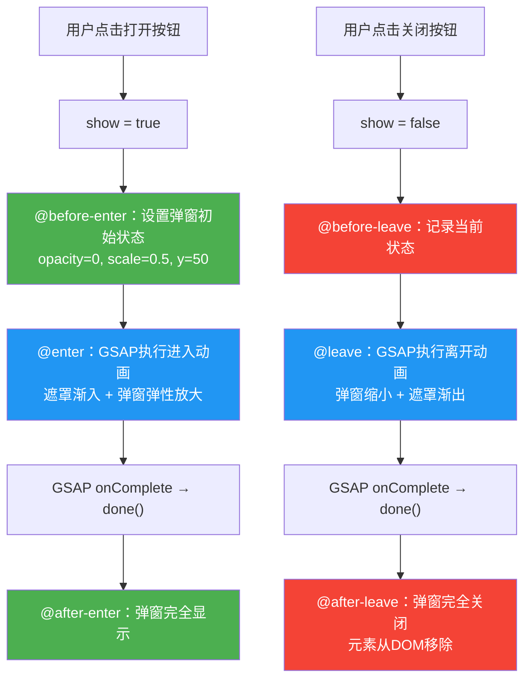

扫描[二维码](https://api2.cmdragon.cn/upload/cmder/20250304_012821924.jpg)关注或者微信搜一搜：`编程智域 前端至全栈交流与成长`

[发现1000+提升效率与开发的AI工具和实用程序](https://tools.cmdragon.cn/zh/apps?category=ai_chat)：https://tools.cmdragon.cn/zh/apps?category=ai_chat

## 一、8个JavaScript钩子，每个都能干啥？

Vue 3的Transition组件不光能用CSS类名做动画，它还给你准备了8个JavaScript钩子事件。说白了，就是让你在动画的每个关键节点都能插一手，用JS代码来控制动画的行为。CSS transition和animation能做的事毕竟有限，碰到那种需要物理弹簧效果、路径动画、或者要根据数据动态计算动画参数的场景，CSS就有点力不从心了。这时候JS钩子就派上大用场了。

这8个钩子分成两组——进入阶段4个，离开阶段4个，咱们一个一个来看。

### 进入阶段的4个钩子

**@before-enter(el)**：元素插入DOM之前触发。这个时候元素还没出现在页面上，你可以在这里设置元素的初始状态，比如把透明度设为0、位置偏移到屏幕外面之类的。参数`el`就是即将进入的DOM元素。

**@enter(el, done)**：元素插入DOM之后触发。这是执行进入动画的主战场。你在这里写动画逻辑，动画结束之后必须调用`done()`回调，告诉Vue"我这边动画播完了，你可以进行下一步了"。如果你不调用`done`，Vue就会一直等着，动画卡在那不动弹。参数`el`是DOM元素，`done`是完成回调函数。

**@after-enter(el)**：进入动画完全结束后触发。可以在这里做一些收尾工作，比如清理临时样式、触发其他组件的更新、发个事件通知父组件之类的。

**@enter-cancelled(el)**：进入动画被取消时触发。啥时候会被取消呢？比如元素正在执行进入动画的过程中，你突然又让元素离开了，那进入动画就会被取消，这个钩子就会触发。可以在这里做清理工作。

### 离开阶段的4个钩子

**@before-leave(el)**：元素离开动画开始之前触发。可以在这里记录元素当前的位置、尺寸等信息，或者设置离开动画的初始状态。

**@leave(el, done)**：元素离开动画开始时触发。跟`enter`一样，这是执行离开动画的核心钩子。动画结束之后必须调用`done()`，否则Vue不知道动画啥时候结束，元素就一直卡在那。参数`el`是DOM元素，`done`是完成回调。

**@after-leave(el)**：离开动画完全结束后触发。元素已经从DOM中移除了，可以在这里做最终的清理工作。

**@leave-cancelled(el)**：离开动画被取消时触发。这种情况比较少见，一般出现在`v-show`切换的时候——元素正在执行离开动画，突然又要显示了，那离开动画就会被取消。

来看一下这8个钩子的触发时序：

```mermaid
flowchart TD
    A[元素状态变化] --> B{显示还是隐藏?}

    B -->|显示 v-if=true| C[@before-enter]
    C --> D[元素插入DOM]
    D --> E["@enter（执行进入动画）"]
    E --> F["调用 done()"]
    F --> G[@after-enter]

    B -->|隐藏 v-if=false| H[@before-leave]
    H --> I["@leave（执行离开动画）"]
    I --> J["调用 done()"]
    J --> K[元素从DOM移除]
    K --> L[@after-leave]

    E -.->|动画被中断| M[@enter-cancelled]
    I -.->|动画被中断| N[@leave-cancelled]

    style C fill:#4CAF50,color:#fff
    style E fill:#2196F3,color:#fff
    style G fill:#4CAF50,color:#fff
    style M fill:#FF9800,color:#fff
    style H fill:#f44336,color:#fff
    style I fill:#2196F3,color:#fff
    style L fill:#f44336,color:#fff
    style N fill:#FF9800,color:#fff
```

下面是一个展示所有8个钩子基本用法的代码示例：

```vue
<template>
  <button @click="show = !show">切换显示</button>

  <Transition
    @before-enter="onBeforeEnter"
    @enter="onEnter"
    @after-enter="onAfterEnter"
    @enter-cancelled="onEnterCancelled"
    @before-leave="onBeforeLeave"
    @leave="onLeave"
    @after-leave="onAfterLeave"
    @leave-cancelled="onLeaveCancelled"
  >
    <div v-if="show" class="box">我是个会动的盒子</div>
  </Transition>
</template>

<script setup>
import { ref } from "vue";

const show = ref(true);

// 进入阶段：元素还没插入DOM，设置初始状态
function onBeforeEnter(el) {
  el.style.opacity = 0;
  el.style.transform = "translateY(-30px)";
}

// 进入阶段：元素已插入DOM，执行进入动画
function onEnter(el, done) {
  // 这里用原生的Web Animation API做动画
  const animation = el.animate(
    [
      { opacity: 0, transform: "translateY(-30px)" },
      { opacity: 1, transform: "translateY(0)" },
    ],
    {
      duration: 500,
      easing: "ease-out",
    },
  );
  // 动画结束后必须调用done，告诉Vue动画播完了
  animation.onfinish = () => {
    done();
  };
}

// 进入阶段：动画播完了
function onAfterEnter(el) {
  console.log("进入动画结束");
}

// 进入阶段：动画被取消了（比如还没播完就又切走了）
function onEnterCancelled(el) {
  console.log("进入动画被取消");
}

// 离开阶段：动画开始前，记录当前状态
function onBeforeLeave(el) {
  el.style.opacity = 1;
}

// 离开阶段：执行离开动画
function onLeave(el, done) {
  const animation = el.animate(
    [
      { opacity: 1, transform: "translateY(0)" },
      { opacity: 0, transform: "translateY(30px)" },
    ],
    {
      duration: 500,
      easing: "ease-in",
    },
  );
  // 同样必须调用done
  animation.onfinish = () => {
    done();
  };
}

// 离开阶段：动画播完了，元素已从DOM移除
function onAfterLeave(el) {
  console.log("离开动画结束，元素已移除");
}

// 离开阶段：离开动画被取消（v-show场景下较常见）
function onLeaveCancelled(el) {
  console.log("离开动画被取消");
}
</script>

<style scoped>
.box {
  width: 200px;
  height: 100px;
  background: #42b883;
  color: white;
  display: flex;
  align-items: center;
  justify-content: center;
  border-radius: 8px;
  margin-top: 20px;
}
</style>
```

有个特别重要的事情得强调一下：`enter`和`leave`这两个钩子里的`done`参数，你**必须**调用它！不调用的话Vue就不知道动画啥时候结束，后续的`after-enter`、`after-leave`这些钩子也不会触发，元素可能就卡在半中间的状态。这就好比你跟朋友说"等我一下"，但从来不告诉他"我好了"，他就一直傻等着。

## 二、:css="false"——告诉Vue别管CSS了

默认情况下，Vue的Transition组件是个"双面手"——它同时检测CSS类名和JavaScript钩子。也就是说，即使你写了JS钩子，Vue还是会去检测CSS的`v-enter-active`、`v-leave-active`这些类名，看看有没有CSS transition或animation定义。这就像你请了两个厨师同时做一道菜，虽然也能做出来，但多少有点浪费资源。

当你只用JavaScript钩子来做动画的时候，就可以加一个`:css="false"`，明确告诉Vue："别去检测CSS类名了，我只用JS来控制动画。"

```vue
<Transition :css="false" @enter="onEnter" @leave="onLeave">
  <div v-if="show">我只用JS做动画</div>
</Transition>
```

加了`:css="false"`之后，会有这么几个变化：

1. Vue不再自动添加和移除CSS类名（`v-enter-from`、`v-enter-active`这些统统不管了）
2. Vue不再通过检测CSS的`transition-duration`和`animation-duration`来判断动画时长
3. 动画的结束完全依赖你在`enter`和`leave`钩子中调用`done()`
4. 性能更好，因为Vue省去了检测CSS规则的开销

来看一个对比示例，让你更直观地感受区别：

```vue
<template>
  <div>
    <button @click="show1 = !show1">不加 :css="false"</button>
    <button @click="show2 = !show2">加了 :css="false"</button>

    <!-- 不加 :css="false"：Vue同时检测CSS和JS -->
    <Transition @enter="onEnter1" @leave="onLeave1">
      <div v-if="show1" class="box">方式一</div>
    </Transition>

    <!-- 加了 :css="false"：Vue只看JS钩子 -->
    <Transition :css="false" @enter="onEnter2" @leave="onLeave2">
      <div v-if="show2" class="box">方式二</div>
    </Transition>
  </div>
</template>

<script setup>
import { ref } from "vue";

const show1 = ref(true);
const show2 = ref(true);

// 方式一：没加 :css="false"，Vue还会去检测CSS类名
// 如果CSS里恰好有同名的transition规则，可能会跟JS动画打架
function onEnter1(el, done) {
  el.animate([{ opacity: 0 }, { opacity: 1 }], { duration: 400 }).onfinish =
    done;
}

function onLeave1(el, done) {
  el.animate([{ opacity: 1 }, { opacity: 0 }], { duration: 400 }).onfinish =
    done;
}

// 方式二：加了 :css="false"，Vue完全不管CSS，只靠JS
// 不会有CSS规则干扰，动画行为更可控
function onEnter2(el, done) {
  el.animate([{ opacity: 0 }, { opacity: 1 }], { duration: 400 }).onfinish =
    done;
}

function onLeave2(el, done) {
  el.animate([{ opacity: 1 }, { opacity: 0 }], { duration: 400 }).onfinish =
    done;
}
</script>
```

那什么时候该加`:css="false"`呢？很简单——**当你只用JavaScript来控制动画，不需要CSS类名参与的时候，就加上它**。这样做既能让代码意图更清晰，又能避免CSS规则意外干扰JS动画，还能稍微提升一点性能。一举三得，何乐而不为呢？

## 三、GSAP——动画界的扛把子

原生Web Animation API虽然能用，但说实话功能还是比较有限。要做那种丝滑的弹性动画、物理弹簧效果、复杂的时间轴编排，还是得上专业的动画库。而GSAP（GreenSock Animation Platform）就是动画库里的"扛把子"，用过的都说香。

### GSAP是什么

GSAP是GreenSock公司开发的JavaScript动画平台，它最大的特点就是——**快**。不是一般的快，是那种60fps丝滑流畅的快。它内部做了大量性能优化，比jQuery的animate快20倍，比CSS动画在某些场景下也更流畅。而且API设计得特别简洁，几行代码就能写出让人眼前一亮的动画效果。

### 安装GSAP

在你的Vue 3项目中，一行命令就能装上：

```bash
npm install gsap
```

截至2026年5月，GSAP的最新稳定版本是3.12.x系列。安装完之后就可以直接在组件里用了。

### GSAP的基本用法

GSAP最核心的API就两个：`gsap.to()`和`gsap.from()`。

`gsap.to()`——让元素从当前状态动画到目标状态：

```javascript
// 让元素在1秒内透明度变为1，向右移动200px
gsap.to(el, {
  opacity: 1,
  x: 200,
  duration: 1,
});
```

`gsap.from()`——让元素从指定状态动画到当前状态：

```javascript
// 让元素从透明+上方30px的位置动画到当前位置
gsap.from(el, {
  opacity: 0,
  y: -30,
  duration: 0.5,
});
```

还有个`gsap.fromTo()`——同时指定起始和结束状态：

```javascript
gsap.fromTo(
  el,
  { opacity: 0, y: -30 }, // 起始状态
  { opacity: 1, y: 0, duration: 0.5 }, // 结束状态
);
```

### 在Transition钩子中使用GSAP

把GSAP和Vue Transition的JS钩子结合起来，那叫一个天作之合。来看一个弹性动画的例子：

```vue
<template>
  <button @click="show = !show">弹性动画</button>

  <Transition :css="false" @enter="onEnter" @leave="onLeave">
    <div v-if="show" class="ball">🏀</div>
  </Transition>
</template>

<script setup>
import { ref } from "vue";
import gsap from "gsap";

const show = ref(true);

function onEnter(el, done) {
  // 设置初始状态：透明 + 缩小
  gsap.set(el, {
    opacity: 0,
    scale: 0.3,
  });

  // 弹性进入动画
  gsap.to(el, {
    opacity: 1,
    scale: 1,
    duration: 0.8,
    // ease参数控制缓动函数，elastic.out是弹性效果
    ease: "elastic.out(1, 0.5)",
    // onComplete是GSAP的完成回调，在这里调用done通知Vue
    onComplete: done,
  });
}

function onLeave(el, done) {
  gsap.to(el, {
    opacity: 0,
    scale: 0.3,
    duration: 0.4,
    ease: "back.in(2)",
    onComplete: done,
  });
}
</script>

<style scoped>
.ball {
  width: 80px;
  height: 80px;
  font-size: 50px;
  display: flex;
  align-items: center;
  justify-content: center;
  margin-top: 20px;
}
</style>
```

注意看上面的代码，GSAP的`onComplete`回调就是用来替代手动调用`done()`的。当GSAP动画播完之后，它会自动调用`onComplete`，我们在里面调用`done()`通知Vue动画结束。这样就不需要自己手动追踪动画状态了。

### 用GSAP做CSS做不到的事

CSS动画虽然方便，但有些效果它就是搞不定。举几个GSAP能做但CSS做不好的例子：

**物理弹簧效果**：CSS的`cubic-bezier`只能定义固定的贝塞尔曲线，而GSAP的`elastic`、`bounce`、`back`这些缓动函数能模拟真实的物理弹簧和弹跳效果，看起来自然多了。

**路径动画**：GSAP的MotionPath插件可以让元素沿着SVG路径运动，CSS要实现这个得费老大劲了。

**时间轴控制**：GSAP的`gsap.timeline()`可以编排多个动画的先后顺序、重叠关系，甚至可以整体暂停、倒放、加速。CSS的`animation-delay`虽然也能做简单的时序控制，但灵活度差远了。

来看一个时间轴编排的例子：

```vue
<template>
  <button @click="show = !show">时间轴动画</button>

  <Transition :css="false" @enter="onEnter" @leave="onLeave">
    <div v-if="show" class="card">
      <div class="card-header">标题</div>
      <div class="card-body">内容区域</div>
      <div class="card-footer">底部</div>
    </div>
  </Transition>
</template>

<script setup>
import { ref } from "vue";
import gsap from "gsap";

const show = ref(true);

function onEnter(el, done) {
  // 创建时间轴，让子元素依次动画进入
  const tl = gsap.timeline({ onComplete: done });

  tl.from(el, {
    opacity: 0,
    y: 30,
    duration: 0.3,
    ease: "power2.out",
  })
    // 标题先出来
    .from(
      el.querySelector(".card-header"),
      {
        opacity: 0,
        x: -20,
        duration: 0.3,
        ease: "power2.out",
      },
      "-=0.1",
    )
    // 内容区域接着出来，跟标题有0.1秒的重叠
    .from(
      el.querySelector(".card-body"),
      {
        opacity: 0,
        y: 15,
        duration: 0.3,
        ease: "power2.out",
      },
      "-=0.1",
    )
    // 底部最后出来
    .from(
      el.querySelector(".card-footer"),
      {
        opacity: 0,
        duration: 0.2,
        ease: "power2.out",
      },
      "-=0.1",
    );
}

function onLeave(el, done) {
  gsap.to(el, {
    opacity: 0,
    scale: 0.95,
    y: 20,
    duration: 0.3,
    ease: "power2.in",
    onComplete: done,
  });
}
</script>

<style scoped>
.card {
  width: 300px;
  margin-top: 20px;
  border-radius: 12px;
  overflow: hidden;
  box-shadow: 0 4px 20px rgba(0, 0, 0, 0.1);
  background: white;
}

.card-header {
  padding: 16px 20px;
  background: #42b883;
  color: white;
  font-weight: bold;
  font-size: 18px;
}

.card-body {
  padding: 20px;
  color: #333;
  line-height: 1.6;
}

.card-footer {
  padding: 12px 20px;
  background: #f5f5f5;
  color: #999;
  font-size: 14px;
}
</style>
```

这种子元素依次入场的效果，用CSS也能勉强做（给每个子元素设不同的`animation-delay`），但代码又臭又长，而且不好维护。用GSAP的时间轴，几行代码就搞定了，还能精确控制动画之间的重叠关系。

## 四、用GSAP做一个完整的弹窗动画

学了一堆理论，咱们来整一个实际项目中最常见的场景——模态框弹窗动画。一个好的弹窗动画应该是什么样的？弹出来的时候要有弹性，让人感觉"弹"出来的；关掉的时候要干脆利落，别拖泥带水。而且弹窗的背景遮罩也要有渐入渐出的效果。

先来看一下整个弹窗动画的流程：



下面是完整的代码实现：

```vue
<template>
  <button class="open-btn" @click="showModal = true">打开弹窗</button>

  <Transition
    :css="false"
    @before-enter="onBeforeEnter"
    @enter="onEnter"
    @before-leave="onBeforeLeave"
    @leave="onLeave"
  >
    <div v-if="showModal" class="modal-overlay" @click.self="showModal = false">
      <div class="modal-content">
        <h2>欢迎来到弹窗世界</h2>
        <p>这是一个用GSAP驱动的弹性弹窗动画，CSS可做不出来这种弹簧效果哦。</p>
        <div class="modal-actions">
          <button class="btn-confirm" @click="showModal = false">确认</button>
          <button class="btn-cancel" @click="showModal = false">取消</button>
        </div>
      </div>
    </div>
  </Transition>
</template>

<script setup>
import { ref } from "vue";
import gsap from "gsap";

const showModal = ref(false);

// 进入前：设置弹窗和遮罩的初始状态
function onBeforeEnter(el) {
  // 遮罩层初始完全透明
  gsap.set(el, {
    opacity: 0,
  });
  // 弹窗内容初始：缩小 + 位置偏下
  const content = el.querySelector(".modal-content");
  gsap.set(content, {
    opacity: 0,
    scale: 0.5,
    y: 50,
  });
}

// 进入动画：遮罩渐入 + 弹窗弹性放大
function onEnter(el, done) {
  const content = el.querySelector(".modal-content");

  // 创建时间轴，编排遮罩和弹窗的动画
  const tl = gsap.timeline({ onComplete: done });

  // 遮罩层先渐入
  tl.to(el, {
    opacity: 1,
    duration: 0.3,
    ease: "power2.out",
  })
    // 弹窗内容弹性放大，跟遮罩有0.1秒重叠
    .to(
      content,
      {
        opacity: 1,
        scale: 1,
        y: 0,
        duration: 0.6,
        // elastic.out模拟弹簧效果，(1, 0.5)控制弹性和阻尼
        ease: "elastic.out(1, 0.5)",
      },
      "-=0.1",
    );
}

// 离开前：不需要特别处理，当前状态就是离开的起始状态
function onBeforeLeave(el) {
  // 可以在这里做一些记录，比如当前弹窗的位置
  // 这个例子中不需要额外操作
}

// 离开动画：弹窗缩小 + 遮罩渐出
function onLeave(el, done) {
  const content = el.querySelector(".modal-content");

  const tl = gsap.timeline({ onComplete: done });

  // 弹窗先缩小消失
  tl.to(content, {
    opacity: 0,
    scale: 0.8,
    y: 30,
    duration: 0.25,
    ease: "power2.in",
  })
    // 遮罩接着渐出
    .to(
      el,
      {
        opacity: 0,
        duration: 0.2,
        ease: "power2.in",
      },
      "-=0.1",
    );
}
</script>

<style scoped>
.open-btn {
  padding: 12px 24px;
  background: #42b883;
  color: white;
  border: none;
  border-radius: 8px;
  font-size: 16px;
  cursor: pointer;
  transition: background 0.2s;
}

.open-btn:hover {
  background: #369970;
}

.modal-overlay {
  position: fixed;
  top: 0;
  left: 0;
  width: 100%;
  height: 100%;
  background: rgba(0, 0, 0, 0.5);
  display: flex;
  align-items: center;
  justify-content: center;
  z-index: 1000;
}

.modal-content {
  background: white;
  border-radius: 16px;
  padding: 32px;
  width: 420px;
  max-width: 90vw;
  box-shadow: 0 20px 60px rgba(0, 0, 0, 0.3);
}

.modal-content h2 {
  margin: 0 0 16px;
  color: #333;
  font-size: 22px;
}

.modal-content p {
  margin: 0 0 24px;
  color: #666;
  line-height: 1.6;
}

.modal-actions {
  display: flex;
  gap: 12px;
  justify-content: flex-end;
}

.btn-confirm {
  padding: 10px 24px;
  background: #42b883;
  color: white;
  border: none;
  border-radius: 8px;
  cursor: pointer;
  font-size: 14px;
}

.btn-cancel {
  padding: 10px 24px;
  background: #f5f5f5;
  color: #666;
  border: none;
  border-radius: 8px;
  cursor: pointer;
  font-size: 14px;
}

.btn-confirm:hover {
  background: #369970;
}

.btn-cancel:hover {
  background: #e8e8e8;
}
</style>
```

这段代码里有几个值得注意的地方：

第一，`onBeforeEnter`里用`gsap.set()`来设置初始状态。`gsap.set()`是立即设置属性值，不带动画，相当于"瞬移"到指定状态。这比手动操作`el.style`要方便得多，因为GSAP会自动处理浏览器兼容性问题。

第二，`onEnter`里用`gsap.timeline()`编排了两个动画——遮罩渐入和弹窗弹性放大。`'-=0.1'`这个参数表示第二个动画提前0.1秒开始，让遮罩和弹窗的动画有一小段重叠，看起来更连贯。

第三，`elastic.out(1, 0.5)`这个缓动函数是整个动画的灵魂。第一个参数1控制弹性强度（越大弹得越厉害），第二个参数0.5控制阻尼（越大弹得越快停下来）。你可以调整这两个参数来获得不同的弹簧感觉。

第四，离开动画用的是`power2.in`缓动函数，这是一个加速效果，让弹窗关掉的时候有一种"被吸走"的感觉，跟进入时的弹性效果形成对比。

## 课后 Quiz

**问题1：在Transition的`enter`钩子中，如果忘记调用`done()`回调，会发生什么？**

答案解析：如果忘记调用`done()`，Vue会认为进入动画一直没有结束，后续的`after-enter`钩子永远不会触发。更严重的是，如果此时用户又触发了离开操作，Vue可能会进入一个混乱的状态，因为前一个动画还没"结案"呢。所以`done()`就像是给Vue的一个"动画完成确认单"，不签收的话Vue就一直等着。如果你加了`:css="false"`，那`done()`就更加关键了，因为Vue完全依赖它来判断动画何时结束。

**问题2：什么时候应该给Transition加上`:css="false"`？不加会有什么影响？**

答案解析：当你只用JavaScript钩子来控制动画、完全不依赖CSS类名的时候，就应该加上`:css="false"`。不加的话，Vue还是会去检测CSS的`v-enter-active`、`v-leave-active`等类名，看看有没有定义`transition`或`animation`属性。这个检测过程虽然开销不大，但完全没必要。更麻烦的是，如果你的CSS里恰好有同名的类名规则（比如全局样式或者UI框架的样式），可能会跟你的JS动画产生冲突，导致动画行为不符合预期。加上`:css="false"`就能彻底避免这些问题。

**问题3：GSAP的`gsap.timeline()`相比单独调用多个`gsap.to()`有什么优势？**

答案解析：`gsap.timeline()`最大的优势是能精确编排多个动画的时序关系。单独调用`gsap.to()`的话，多个动画是同时开始的（除非你手动计算delay），而且很难控制动画之间的重叠和衔接。timeline提供了一套简洁的API来控制动画的先后顺序、重叠时间，还能整体暂停、恢复、倒放、调整播放速度。另外，timeline的`onComplete`只需要写一次，所有子动画都完成后才触发，而单独的`gsap.to()`你得自己追踪每个动画的完成状态，代码会复杂得多。

## 常见报错解决方案

### 报错1：动画卡住不动，元素停在半透明状态

**原因分析**：这是最常见的问题，几乎都是因为在`enter`或`leave`钩子中忘记调用`done()`回调。Vue不知道动画什么时候结束，就一直在等，元素就卡在动画中间的状态了。

**解决方案**：检查你的`enter`和`leave`钩子，确保在动画结束的时候调用了`done()`。如果用的是GSAP，就在`onComplete`里调用；如果用的是Web Animation API，就在`animation.onfinish`里调用。另外，如果你加了`:css="false"`，那`done()`就更加不可或缺了，因为Vue没有任何其他方式知道动画何时结束。

```javascript
// 错误写法：忘记调用done
function onEnter(el, done) {
  gsap.to(el, { opacity: 1, duration: 0.5 });
  // done()去哪了？？？
}

// 正确写法：在onComplete中调用done
function onEnter(el, done) {
  gsap.to(el, {
    opacity: 1,
    duration: 0.5,
    onComplete: done,
  });
}
```

### 报错2：GSAP动画和CSS动画互相打架，效果很诡异

**原因分析**：没有加`:css="false"`，Vue还在自动添加CSS类名。如果你的CSS里定义了`v-enter-active`或`v-leave-active`的`transition`属性，那CSS transition和GSAP动画就会同时作用在同一个元素上，互相干扰。比如GSAP在控制`opacity`，CSS transition也在控制`opacity`，两个动画叠加在一起，效果就乱套了。

**解决方案**：如果你只用JS钩子做动画，一定要加上`:css="false"`。如果你确实需要同时使用CSS和JS动画，那就确保它们控制的是不同的CSS属性，避免冲突。

```vue
<!-- 只用JS做动画时，务必加上 :css="false" -->
<Transition :css="false" @enter="onEnter" @leave="onLeave">
  <div v-if="show">内容</div>
</Transition>
```

### 报错3：快速切换时动画闪烁或元素消失

**原因分析**：快速切换显示/隐藏时，前一个动画还没播完，新的动画就开始了。这时候`enter-cancelled`和`leave-cancelled`钩子会被触发，但如果你没有在取消时清理正在进行的GSAP动画，旧的动画实例还在运行，就会跟新动画冲突。

**解决方案**：在`enter-cancelled`和`leave-cancelled`钩子中，使用GSAP的`kill()`方法来终止正在进行的动画。或者更好的做法是，在每次开始新动画之前，先用`gsap.killTweensOf(el)`清理元素上所有正在进行的GSAP动画。

```javascript
function onEnter(el, done) {
  // 先杀掉元素上可能残留的旧动画
  gsap.killTweensOf(el);

  gsap.fromTo(
    el,
    { opacity: 0, scale: 0.5 },
    {
      opacity: 1,
      scale: 1,
      duration: 0.5,
      ease: "elastic.out(1, 0.5)",
      onComplete: done,
    },
  );
}

function onEnterCancelled(el) {
  // 动画被取消时，杀掉正在进行的GSAP动画
  gsap.killTweensOf(el);
}

function onLeave(el, done) {
  gsap.killTweensOf(el);

  gsap.to(el, {
    opacity: 0,
    scale: 0.8,
    duration: 0.3,
    onComplete: done,
  });
}

function onLeaveCancelled(el) {
  gsap.killTweensOf(el);
}
```

参考链接：https://vuejs.org/guide/built-ins/transition.html

余下文章内容请点击跳转至 个人博客页面 或者 扫描[二维码](https://api2.cmdragon.cn/upload/cmder/20250304_012821924.jpg)关注或者微信搜一搜：`编程智域 前端至全栈交流与成长`，阅读完整的文章：[CSS搞不定的动画？JavaScript钩子配合GSAP让你为所欲为](https://blog.cmdragon.cn/posts/c9d0e1f2a3b4c5d6e7f8a9b0c1d2e3f4/)

<details>
<summary>往期文章归档</summary>

- [Vue 3 静态与动态 Props 如何传递？TypeScript 类型约束有何必要？](https://blog.cmdragon.cn/posts/94ab48753b64780ca3ab7a7115ae8522/)
- [Vue 3中组件局部注册的优势与实现方式如何？](https://blog.cmdragon.cn/posts/dbf576e744870f6de26fd8a2e03e47da/)
- [如何在Vue3中优化生命周期钩子性能并规避常见陷阱？](https://blog.cmdragon.cn/posts/12d98b3b9ccd6c19a1b169d720ac5c80/)
- [Vue 3 Composition API生命周期钩子：如何实现从基础理解到高阶复用？](https://blog.cmdragon.cn/posts/8884e2b70287fcb263c57648eeb27419/)
- [Vue 3生命周期钩子实战指南：如何正确选择onMounted、onUpdated与onUnmounted的应用场景？](https://blog.cmdragon.cn/posts/883c6dbc50ae4183770a4462e0b8ae4d/)
- [Vue 3中生命周期钩子与响应式系统如何实现协同工作？](https://blog.cmdragon.cn/posts/70dad360ffa9dce14d0d69611b8cb019/)
- [Vue 3组件生命周期钩子的执行顺序与使用场景是什么？](https://blog.cmdragon.cn/posts/db44294a78dc9f666f67b053f6c83567/)
- [Vue组件全局注册与局部注册如何抉择？](https://blog.cmdragon.cn/posts/43ead630ea17da65d99ad2eb8188e472/)
- [Vue3组件化开发中，Props与Emits如何实现数据流转与事件协作？](https://blog.cmdragon.cn/posts/8cff7d2df113da66ea7be560c4d1d22a/)
- [Vue 3模板引用如何与其他特性协同实现复杂交互？](https://blog.cmdragon.cn/posts/331bf75d114ab09116eadfcdca602b58/)
- [Vue 3 v-for中模板引用如何实现高效管理与动态控制？](https://blog.cmdragon.cn/posts/cb380897ddc3578b180ecf8843c774c1/)
- [Vue 3的defineExpose：如何突破script setup组件默认封装，实现精准的父子通讯？](https://blog.cmdragon.cn/posts/202ae0f4acde7128e0e31baf63732fb5/)
- [Vue 3模板引用的生命周期时机如何把握？常见陷阱该如何避免？](https://blog.cmdragon.cn/posts/7d2a0f6555ecbe92afd7d2491c427463/)
- [Vue 3模板引用如何实现父组件与子组件的高效交互？](https://blog.cmdragon.cn/posts/3fb7bdd84128b7efaaa1c979e1f28dee/)
- [Vue中为何需要模板引用？又如何高效实现DOM与组件实例的直接访问？](https://blog.cmdragon.cn/posts/23f3464ba16c7054b4783cded50c04c6/)

</details>

<details>
<summary>免费好用的热门在线工具</summary>

- [多直播聚合器 - 应用商店 | By cmdragon](https://tools.cmdragon.cn/zh/apps/multi-live-aggregator)
- [Proto文件生成器 - 应用商店 | By cmdragon](https://tools.cmdragon.cn/zh/apps/proto-file-generator)
- [图片转粒子 - 应用商店 | By cmdragon](https://tools.cmdragon.cn/zh/apps/image-to-particles)
- [视频下载器 - 应用商店 | By cmdragon](https://tools.cmdragon.cn/zh/apps/video-downloader)
- [文件格式转换器 - 应用商店 | By cmdragon](https://tools.cmdragon.cn/zh/apps/file-converter)
- [M3U8在线播放器 - 应用商店 | By cmdragon](https://tools.cmdragon.cn/zh/apps/m3u8-player)
- [快图设计 - 应用商店 | By cmdragon](https://tools.cmdragon.cn/zh/apps/quick-image-design)
- [高级文字转图片转换器 - 应用商店 | By cmdragon](https://tools.cmdragon.cn/zh/apps/text-to-image-advanced)
- [RAID 计算器 - 应用商店 | By cmdragon](https://tools.cmdragon.cn/zh/apps/raid-calculator)
- [在线PS - 应用商店 | By cmdragon](https://tools.cmdragon.cn/zh/apps/photoshop-online)
- [Mermaid 在线编辑器 - 应用商店 | By cmdragon](https://tools.cmdragon.cn/zh/apps/mermaid-live-editor)
- [数学求解计算器 - 应用商店 | By cmdragon](https://tools.cmdragon.cn/zh/apps/math-solver-calculator)
- [智能提词器 - 应用商店 | By cmdragon](https://tools.cmdragon.cn/zh/apps/smart-teleprompter)
- [魔法简历 - 应用商店 | By cmdragon](https://tools.cmdragon.cn/zh/apps/magic-resume)
- [Image Puzzle Tool - 图片拼图工具 | By cmdragon](https://tools.cmdragon.cn/zh/apps/image-puzzle-tool)
- [字幕下载工具 - 应用商店 | By cmdragon](https://tools.cmdragon.cn/zh/apps/subtitle-downloader)
- [歌词生成工具 - 应用商店 | By cmdragon](https://tools.cmdragon.cn/zh/apps/lyrics-generator)
- [网盘资源聚合搜索 - 应用商店 | By cmdragon](https://tools.cmdragon.cn/zh/apps/cloud-drive-search)
- [ASCII字符画生成器 - 应用商店 | By cmdragon](https://tools.cmdragon.cn/zh/apps/ascii-art-generator)
- [JSON Web Tokens 工具 - 应用商店 | By cmdragon](https://tools.cmdragon.cn/zh/apps/jwt-tool)
- [Bcrypt 密码工具 - 应用商店 | By cmdragon](https://tools.cmdragon.cn/zh/apps/bcrypt-tool)
- [GIF 合成器 - 应用商店 | By cmdragon](https://tools.cmdragon.cn/zh/apps/gif-composer)
- [GIF 分解器 - 应用商店 | By cmdragon](https://tools.cmdragon.cn/zh/apps/gif-decomposer)
- [文本隐写术 - 应用商店 | By cmdragon](https://tools.cmdragon.cn/zh/apps/text-steganography)
- [CMDragon 在线工具 - 高级AI工具箱与开发者套件 | 免费好用的在线工具](https://tools.cmdragon.cn/zh)
- [应用商店 - 发现1000+提升效率与开发的AI工具和实用程序 | 免费好用的在线工具](https://tools.cmdragon.cn/zh/apps?category=trending)
- [CMDragon 更新日志 - 最新更新、功能与改进 | 免费好用的在线工具](https://tools.cmdragon.cn/zh/changelog)
- [支持我们 - 成为赞助者 | 免费好用的在线工具](https://tools.cmdragon.cn/zh/sponsor)
- [AI文本生成图像 - 应用商店 | 免费好用的在线工具](https://tools.cmdragon.cn/zh/apps/text-to-image-ai)
- [临时邮箱 - 应用商店 | 免费好用的在线工具](https://tools.cmdragon.cn/zh/apps/temp-email)
- [二维码解析器 - 应用商店 | 免费好用的在线工具](https://tools.cmdragon.cn/zh/apps/qrcode-parser)
- [文本转思维导图 - 应用商店 | 免费好用的在线工具](https://tools.cmdragon.cn/zh/apps/text-to-mindmap)
- [正则表达式可视化工具 - 应用商店 | 免费好用的在线工具](https://tools.cmdragon.cn/zh/apps/regex-visualizer)
- [文件隐写工具 - 应用商店 | 免费好用的在线工具](https://tools.cmdragon.cn/zh/apps/steganography-tool)
- [IPTV 频道探索器 - 应用商店 | 免费好用的在线工具](https://tools.cmdragon.cn/zh/apps/iptv-explorer)
- [快传 - 应用商店 | By cmdragon](https://tools.cmdragon.cn/zh/apps/snapdrop)
- [随机抽奖工具 - 应用商店 | 免费好用的在线工具](https://tools.cmdragon.cn/zh/apps/lucky-draw)
- [动漫场景查找器 - 应用商店 | 免费好用的在线工具](https://tools.cmdragon.cn/zh/apps/anime-scene-finder)
- [时间工具箱 - 应用商店 | 免费好用的在线工具](https://tools.cmdragon.cn/zh/apps/time-toolkit)
- [网速测试 - 应用商店 | 免费好用的在线工具](https://tools.cmdragon.cn/zh/apps/speed-test)
- [AI 智能抠图工具 - 应用商店 | 免费好用的在线工具](https://tools.cmdragon.cn/zh/apps/background-remover)
- [背景替换工具 - 应用商店 | 免费好用的在线工具](https://tools.cmdragon.cn/zh/apps/background-replacer)
- [艺术二维码生成器 - 应用商店 | 免费好用的在线工具](https://tools.cmdragon.cn/zh/apps/artistic-qrcode)
- [Open Graph 元标签生成器 - 应用商店 | 免费好用的在线工具](https://tools.cmdragon.cn/zh/apps/open-graph-generator)
- [图像对比工具 - 应用商店 | 免费好用的在线工具](https://tools.cmdragon.cn/zh/apps/image-comparison)
- [图片压缩专业版 - 应用商店 | 免费好用的在线工具](https://tools.cmdragon.cn/zh/apps/image-compressor)
- [密码生成器 - 应用商店 | 免费好用的在线工具](https://tools.cmdragon.cn/zh/apps/password-generator)
- [SVG优化器 - 应用商店 | 免费好用的在线工具](https://tools.cmdragon.cn/zh/apps/svg-optimizer)
- [调色板生成器 - 应用商店 | 免费好用的在线工具](https://tools.cmdragon.cn/zh/apps/color-palette)
- [在线节拍器 - 应用商店 | 免费好用的在线工具](https://tools.cmdragon.cn/zh/apps/online-metronome)
- [IP归属地查询 - 应用商店 | By cmdragon](https://tools.cmdragon.cn/zh/apps/ip-geolocation)
- [CSS网格布局生成器 - 应用商店 | 免费好用的在线工具](https://tools.cmdragon.cn/zh/apps/css-grid-layout)
- [邮箱验证工具 - 应用商店 | 免费好用的在线工具](https://tools.cmdragon.cn/zh/apps/email-validator)
- [书法练习字帖 - 应用商店 | 免费好用的在线工具](https://tools.cmdragon.cn/zh/apps/calligraphy-practice)
- [金融计算器套件 - 应用商店 | 免费好用的在线工具](https://tools.cmdragon.cn/zh/apps/finance-calculator-suite)
- [中国亲戚关系计算器 - 应用商店 | 免费好用的在线工具](https://tools.cmdragon.cn/zh/apps/chinese-kinship-calculator)
- [Protocol Buffer 工具箱 - 应用商店 | 免费好用的在线工具](https://tools.cmdragon.cn/zh/apps/protobuf-toolkit)
- [IP归属地查询 - 应用商店 | 免费好用的在线工具](https://tools.cmdragon.cn/zh/apps/ip-geolocation)
- [图片无损放大 - 应用商店 | 免费好用的在线工具](https://tools.cmdragon.cn/zh/apps/image-upscaler)
- [文本比较工具 - 应用商店 | 免费好用的在线工具](https://tools.cmdragon.cn/zh/apps/text-compare)
- [IP批量查询工具 - 应用商店 | 免费好用的在线工具](https://tools.cmdragon.cn/zh/apps/ip-batch-lookup)
- [域名查询工具 - 应用商店 | 免费好用的在线工具](https://tools.cmdragon.cn/zh/apps/domain-finder)
- [DNS工具箱 - 应用商店 | 免费好用的在线工具](https://tools.cmdragon.cn/zh/apps/dns-toolkit)
- [网站图标生成器 - 应用商店 | 免费好用的在线工具](https://tools.cmdragon.cn/zh/apps/favicon-generator)
- [XML Sitemap](https://tools.cmdragon.cn/sitemap_index.xml)

</details>
