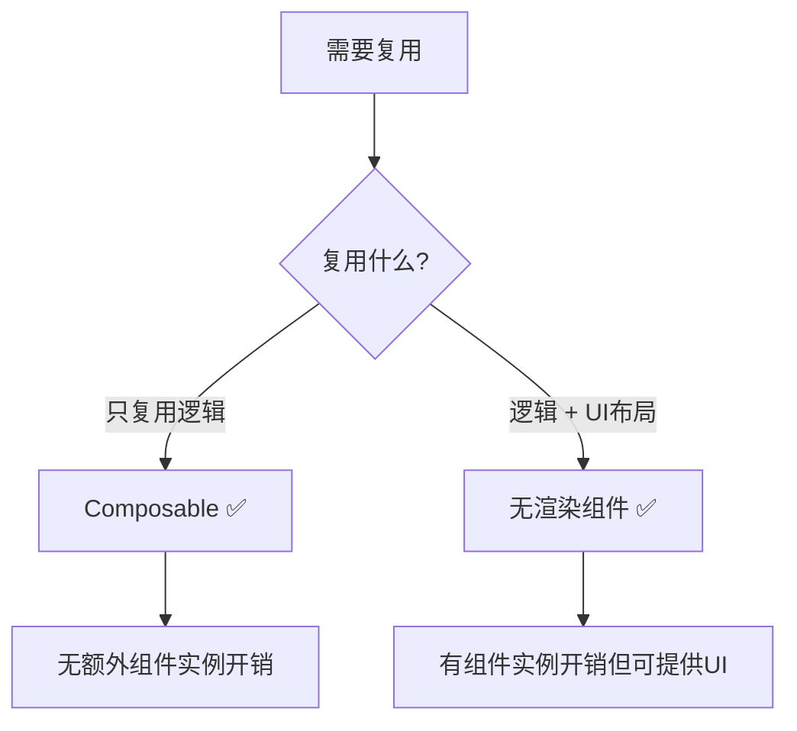
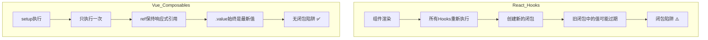

扫描[二维码](https://api2.cmdragon.cn/upload/cmder/20250304_012821924.jpg)关注或者微信搜一搜：`编程智域 前端至全栈交流与成长`

[发现1000+提升效率与开发的AI工具和实用程序](https://tools.cmdragon.cn/zh/apps?category=ai_chat)：https://tools.cmdragon.cn/zh/apps?category=ai_chat


## 一、为啥要对比？选对工具很重要

Vue发展到现在，逻辑复用的方案经历了好几次迭代：Mixins → 无渲染组件 → Composables。如果你是从Vue 2过来的，可能还在用Mixins；如果你是从React转过来的，可能会把Composables和Hooks搞混。

搞清楚每种方案的优缺点，你才能在合适的场景选对工具，而不是拿着锤子看啥都是钉子。

## 二、Composables vs Mixins

### Mixins是啥？

Mixins是Vue 2时代的逻辑复用方案。你可以把一段逻辑写在一个mixin对象里，然后混入到多个组件中：

```javascript
// mouseMixin.js
export default {
  data() {
    return {
      x: 0,
      y: 0
    }
  },
  mounted() {
    window.addEventListener('mousemove', this.updateMouse)
  },
  beforeUnmount() {
    window.removeEventListener('mousemove', this.updateMouse)
  },
  methods: {
    updateMouse(event) {
      this.x = event.pageX
      this.y = event.pageY
    }
  }
}
```

```javascript
// 组件中使用
import mouseMixin from './mouseMixin.js'

export default {
  mixins: [mouseMixin],
  // 组件里可以直接用 this.x, this.y
}
```

看起来还行？但用多了你就会发现三个大坑。

### 坑一：数据来源不清

当你用了多个mixin的时候，你根本分不清某个属性来自哪个mixin：

```javascript
export default {
  mixins: [mouseMixin, windowMixin, userMixin, themeMixin],
  mounted() {
    // 这个x是mouseMixin的还是windowMixin的？🤔
    console.log(this.x)

    // 这个loading是哪个mixin的？🤔🤔
    console.log(this.loading)

    // 这个data又是什么？🤔🤔🤔
    console.log(this.data)
  }
}
```

用Composables就不一样了——解构的时候你就知道每个变量来自哪里：

```javascript
const { x, y } = useMouse()           // 明确来自useMouse
const { width, height } = useWindowSize() // 明确来自useWindowSize
const { user } = useUser()             // 明确来自useUser
```

### 坑二：命名空间冲突

两个mixin可能定义了同名的属性，后注册的会覆盖前面的，而且你完全不知道：

```javascript
// mixinA.js
export default {
  data() {
    return { name: 'A' }
  }
}

// mixinB.js
export default {
  data() {
    return { name: 'B' } // 同名！会覆盖mixinA的name
  }
}

// 组件
export default {
  mixins: [mixinA, mixinB],
  mounted() {
    console.log(this.name) // 'B'，mixinA的name被悄悄覆盖了
  }
}
```

Composables通过解构重命名来避免冲突：

```javascript
const { name: nameA } = useA()
const { name: nameB } = useB()
// 两个name互不影响 ✅
```

### 坑三：隐式的跨mixin交流

多个mixin之间可能依赖同名的属性来互相通信，但这种依赖是隐式的——你看代码根本看不出来：

```javascript
// mixinA提供userId
export default {
  data() {
    return { userId: 123 }
  }
}

// mixinB依赖userId，但你看不出它需要mixinA
export default {
  computed: {
    userUrl() {
      return `/api/users/${this.userId}` // 这个userId哪来的？
    }
  }
}
```

Composables的通信是显式的——通过参数传递：

```javascript
const { userId } = useAuth()
const { userUrl } = useUserUrl(userId) // 明确传入userId
```

```mermaid
flowchart TD
    subgraph Mixins
        A[mixinA: userId] -->|隐式依赖| B[mixinB: this.userId]
        C[mixinC: loading] -->|命名冲突| D[mixinD: loading]
        E[组件] -->|分不清来源| F[this.x / this.loading / this.data]
    end

    subgraph Composables
        G[useAuth: userId] -->|显式传参| H[useUserUrl: userId]
        I[useMouse: x, y] -->|解构重命名| J[mouseX, mouseY]
        K[组件] -->|来源清晰| L[{ x, y } = useMouse]
    end
```

### 完整对比

| 特性 | Mixins | Composables |
|------|--------|-------------|
| 数据来源 | ❌ 不清晰 | ✅ 解构即知来源 |
| 命名冲突 | ❌ 容易冲突 | ✅ 解构重命名 |
| 跨模块通信 | ❌ 隐式依赖 | ✅ 显式传参 |
| TypeScript支持 | ❌ 差 | ✅ 好 |
| 代码提示 | ❌ 弱 | ✅ 强 |
| Vue 3推荐 | ❌ 不推荐 | ✅ 推荐 |

官方的态度很明确：**不再推荐在Vue 3中使用mixin**，保留它只是为了迁移兼容。

## 三、Composables vs 无渲染组件

### 无渲染组件是啥？

无渲染组件（Renderless Component）是一种只负责逻辑、不负责渲染UI的组件。它通过作用域插槽把状态和方法暴露给父组件：

```vue
<!-- MouseTracker.vue -->
<script setup>
import { ref, onMounted, onUnmounted } from 'vue'

const x = ref(0)
const y = ref(0)

function update(event) {
  x.value = event.pageX
  y.value = event.pageY
}

onMounted(() => window.addEventListener('mousemove', update))
onUnmounted(() => window.removeEventListener('mousemove', update))
</script>

<template>
  <slot :x="x" :y="y" />
</template>
```

使用：

```vue
<MouseTracker v-slot="{ x, y }">
  <p>鼠标位置：{{ x }}, {{ y }}</p>
</MouseTracker>
```

### 无渲染组件的问题

最大的问题是**额外的组件实例开销**。每用一次无渲染组件，Vue就得创建一个完整的组件实例——组件初始化、生命周期管理、响应式系统绑定……这些都有性能成本。

当你在整个应用中大量使用无渲染组件时，这些额外的组件实例会带来不可忽视的性能开销。

### 什么时候用无渲染组件？

官方的建议是：

- **纯逻辑复用** → 用Composables
- **同时复用逻辑和视图布局** → 用无渲染组件

啥意思呢？如果你的复用需求只是"一段逻辑"，用Composable就够了。但如果你需要复用的不仅是逻辑，还有一套UI结构（比如一个带特定布局的表单、一个固定样式的弹窗），那无渲染组件更合适，因为它可以通过插槽提供默认的UI结构。



## 四、Composables vs React Hooks

如果你有React经验，可能会觉得Composables和React Hooks很像——确实，Composables的设计灵感部分来自Hooks。但它们的执行模型有本质区别。

### 表面上很像

```javascript
// React Hook
function useMouse() {
  const [x, setX] = useState(0)
  const [y, setY] = useState(0)

  useEffect(() => {
    const update = (e) => { setX(e.pageX); setY(e.pageY) }
    window.addEventListener('mousemove', update)
    return () => window.removeEventListener('mousemove', update)
  }, [])

  return { x, y }
}

// Vue Composable
function useMouse() {
  const x = ref(0)
  const y = ref(0)

  onMounted(() => {
    window.addEventListener('mousemove', (e) => {
      x.value = e.pageX
      y.value = e.pageY
    })
  })

  return { x, y }
}
```

看起来差不多对吧？但底层机制完全不同。

### 核心差异：执行模型

**React Hooks**：每次组件重新渲染，所有Hooks都会重新执行。所以`useState`返回的值在每次渲染时都是新的，`useEffect`的依赖数组决定了它是否重新执行。

**Vue Composables**：只在setup阶段执行一次。响应式数据变了，Composable不会重新执行，而是通过Vue的响应式系统自动更新依赖它的地方。

```javascript
// React：每次渲染都重新执行
function MyComponent() {
  const [count, setCount] = useState(0)
  // 每次渲染，这行都会执行
  const doubled = count * 2

  useEffect(() => {
    // 依赖数组控制是否重新执行
    console.log('count变了', count)
  }, [count])

  return <button onClick={() => setCount(count + 1)}>{doubled}</button>
}

// Vue：setup只执行一次
<script setup>
const count = ref(0)
// 这行只在setup时执行一次
const doubled = computed(() => count.value * 2)

watch(count, (newVal) => {
  console.log('count变了', newVal)
})
</script>
```

### 这个差异带来的影响

| 方面 | React Hooks | Vue Composables |
|------|-------------|-----------------|
| 执行次数 | 每次渲染都执行 | 只执行一次 |
| 闭包陷阱 | ⚠️ 容易踩（stale closure） | ✅ 不会遇到 |
| 依赖数组 | ⚠️ 必须手动声明 | ✅ 自动追踪 |
| 调用顺序 | ⚠️ 不能条件调用 | ✅ 同样不能条件调用 |
| 性能 | 需要useMemo/useCallback优化 | 响应式系统自动优化 |

### React的闭包陷阱

React Hooks最让人头疼的问题之一就是闭包陷阱（stale closure）：

```javascript
// React：闭包陷阱
function Counter() {
  const [count, setCount] = useState(0)

  useEffect(() => {
    const timer = setInterval(() => {
      // 这里的count永远是0！
      // 因为setInterval的回调捕获的是第一次渲染时的count
      console.log(count)
      setCount(count + 1) // 永远是0+1=1
    }, 1000)
    return () => clearInterval(timer)
  }, []) // 空依赖数组，只在mount时执行
}
```

Vue的Composables完全不会有这个问题，因为ref是响应式的，`.value`始终指向最新值：

```javascript
// Vue：没有闭包陷阱
const count = ref(0)

onMounted(() => {
  setInterval(() => {
    // count.value始终是最新的值 ✅
    console.log(count.value)
    count.value++
  }, 1000)
})
```



## 五、总结：各方案的适用场景

| 方案 | 适用场景 | Vue 3推荐度 |
|------|---------|------------|
| Composables | 纯逻辑复用、代码组织 | ⭐⭐⭐⭐⭐ |
| Mixins | Vue 2项目迁移 | ⭐（不推荐新项目使用） |
| 无渲染组件 | 逻辑+UI布局同时复用 | ⭐⭐⭐ |
| React Hooks | React项目 | N/A |

简单来说：
- **新项目**：直接用Composables，别犹豫
- **Vue 2迁移**：逐步把Mixins替换成Composables
- **需要复用UI布局**：考虑无渲染组件
- **React项目**：用Hooks，但要注意闭包陷阱和依赖数组

## 课后 Quiz

### 问题 1
Mixins的三大短板分别是什么？

#### 答案解析
1. **数据来源不清**：用了多个mixin后，分不清某个属性来自哪个mixin
2. **命名空间冲突**：多个mixin可能定义同名属性，后者覆盖前者
3. **隐式的跨mixin交流**：mixin之间通过共享属性名隐式通信，耦合关系不明显

Composables通过解构（来源清晰）、重命名（避免冲突）、显式传参（通信明确）解决了这三个问题。

### 问题 2
什么情况下应该用无渲染组件而不是Composable？

#### 答案解析
当你需要**同时复用逻辑和UI布局**的时候。Composable只负责逻辑，不管UI。如果你有一套固定的UI结构需要一起复用（比如带特定布局的表单、固定样式的弹窗），无渲染组件通过作用域插槽可以同时提供逻辑和UI结构。

### 问题 3
Vue Composables和React Hooks的核心执行模型差异是什么？

#### 答案解析
React Hooks在**每次组件渲染时都会重新执行**，所以需要依赖数组来控制副作用的执行时机，也容易遇到闭包陷阱。Vue Composables只在**setup阶段执行一次**，之后通过响应式系统自动追踪和更新依赖，不需要手动声明依赖，也不会有闭包陷阱的问题。

## 常见报错解决方案

### 报错 1：从Vue 2迁移时Mixins和Composables混用导致状态混乱

**错误场景**：
```javascript
// 同时使用mixin和composable
export default {
  mixins: [mouseMixin],
  setup() {
    const { x, y } = useMouse()
    return { x, y }
  }
}
// this.x 和 setup返回的x冲突了
```

**报错原因**：
mixin的data和setup返回的同名属性会冲突，导致行为不可预测。

**解决方案**：
迁移期间避免混用，逐步把mixin替换成composable：

```javascript
// 只用composable
export default {
  setup() {
    const { x, y } = useMouse()
    return { x, y }
  }
}
```

### 报错 2：无渲染组件过多导致页面卡顿

**错误场景**：
```vue
<!-- 列表中每个项都用了无渲染组件 -->
<div v-for="item in list" :key="item.id">
  <MouseTracker v-slot="{ x, y }">
    <span>{{ x }}, {{ y }}</span>
  </MouseTracker>
</div>
```

**报错原因**：
列表有100项就创建了100个MouseTracker组件实例，每个实例都有完整的组件生命周期开销。

**解决方案**：
纯逻辑复用改用Composable，避免不必要的组件实例：

```vue
<script setup>
import { useMouse } from './composables/useMouse.js'
const { x, y } = useMouse() // 只有一个实例，无额外开销
</script>

<template>
  <div v-for="item in list" :key="item.id">
    <span>{{ x }}, {{ y }}</span>
  </div>
</template>
```

### 报错 3：React开发者写Vue时把Hooks思维带过来

**错误场景**：
```javascript
// React思维：每次渲染重新计算
const doubled = count.value * 2 // 这不是响应式的！

// 期望count变了doubled也变，但不会
```

**报错原因**：
在Vue的Composable中，直接用JS表达式计算不是响应式的。count变了，doubled不会自动更新。

**解决方案**：
用`computed`来创建响应式计算值：

```javascript
const doubled = computed(() => count.value * 2) // ✅ 响应式的
```

## 参考链接

- Vue 3 官方文档 - 组合式函数：https://vuejs.org/guide/reusability/composables.html
- Vue 3 官方文档 - 组合式 API 常见问答：https://vuejs.org/guide/extras/composition-api-faq.html
- Vue 3 官方文档 - 插槽：https://vuejs.org/guide/components/slots.html

余下文章内容请点击跳转至 个人博客页面 或者 扫描[二维码](https://api2.cmdragon.cn/upload/cmder/20250304_012821924.jpg)关注或者微信搜一搜：`编程智域 前端至全栈交流与成长`，阅读完整的文章：[Composables、Mixins、无渲染组件、React Hooks到底谁更香？](https://blog.cmdragon.cn/posts/b8c9d0e1f2a3b4c5d6e7f8a9b0c1d2e3/)


<details>
<summary>往期文章归档</summary>

- [Vue 3 静态与动态 Props 如何传递？TypeScript 类型约束有何必要？](https://blog.cmdragon.cn/posts/94ab48753b64780ca3ab7a7115ae8522/)
- [Vue 3中组件局部注册的优势与实现方式如何？](https://blog.cmdragon.cn/posts/dbf576e744870f6de26fd8a2e03e47da/)
- [如何在Vue3中优化生命周期钩子性能并规避常见陷阱？](https://blog.cmdragon.cn/posts/12d98b3b9ccd6c19a1b169d720ac5c80/)
- [Vue 3 Composition API生命周期钩子：如何实现从基础理解到高阶复用？](https://blog.cmdragon.cn/posts/8884e2b70287fcb263c57648eeb27419/)
- [Vue 3生命周期钩子实战指南：如何正确选择onMounted、onUpdated与onUnmounted的应用场景？](https://blog.cmdragon.cn/posts/883c6dbc50ae4183770a4462e0b8ae4d/)
- [Vue 3中生命周期钩子与响应式系统如何实现协同工作？](https://blog.cmdragon.cn/posts/70dad360ffa9dce14d0d69611b8cb019/)
- [Vue 3组件生命周期钩子的执行顺序与使用场景是什么？](https://blog.cmdragon.cn/posts/db44294a78dc9f666f67b053f6c83567/)
- [Vue组件全局注册与局部注册如何抉择？](https://blog.cmdragon.cn/posts/43ead630ea17da65d99ad2eb8188e472/)
- [Vue3组件化开发中，Props与Emits如何实现数据流转与事件协作？](https://blog.cmdragon.cn/posts/8cff7d2df113da66ea7be560c4d1d22a/)
- [Vue 3模板引用如何与其他特性协同实现复杂交互？](https://blog.cmdragon.cn/posts/331bf75d114ab09116eadfcdca602b58/)
- [Vue 3 v-for中模板引用如何实现高效管理与动态控制？](https://blog.cmdragon.cn/posts/cb380897ddc3578b180ecf8843c774c1/)
- [Vue 3的defineExpose：如何突破script setup组件默认封装，实现精准的父子通讯？](https://blog.cmdragon.cn/posts/202ae0f4acde7128e0e31baf63732fb5/)
- [Vue 3模板引用的生命周期时机如何把握？常见陷阱该如何避免？](https://blog.cmdragon.cn/posts/7d2a0f6555ecbe92afd7d2491c427463/)
- [Vue 3模板引用如何实现父组件与子组件的高效交互？](https://blog.cmdragon.cn/posts/3fb7bdd84128b7efaaa1c979e1f28dee/)
- [Vue中为何需要模板引用？又如何高效实现DOM与组件实例的直接访问？](https://blog.cmdragon.cn/posts/23f3464ba16c7054b4783cded50c04c6/)

</details>


<details>
<summary>免费好用的热门在线工具</summary>

- [多直播聚合器 - 应用商店 | By cmdragon](https://tools.cmdragon.cn/zh/apps/multi-live-aggregator)
- [Proto文件生成器 - 应用商店 | By cmdragon](https://tools.cmdragon.cn/zh/apps/proto-file-generator)
- [图片转粒子 - 应用商店 | By cmdragon](https://tools.cmdragon.cn/zh/apps/image-to-particles)
- [视频下载器 - 应用商店 | By cmdragon](https://tools.cmdragon.cn/zh/apps/video-downloader)
- [文件格式转换器 - 应用商店 | By cmdragon](https://tools.cmdragon.cn/zh/apps/file-converter)
- [M3U8在线播放器 - 应用商店 | By cmdragon](https://tools.cmdragon.cn/zh/apps/m3u8-player)
- [快图设计 - 应用商店 | By cmdragon](https://tools.cmdragon.cn/zh/apps/quick-image-design)
- [高级文字转图片转换器 - 应用商店 | By cmdragon](https://tools.cmdragon.cn/zh/apps/text-to-image-advanced)
- [RAID 计算器 - 应用商店 | By cmdragon](https://tools.cmdragon.cn/zh/apps/raid-calculator)
- [在线PS - 应用商店 | By cmdragon](https://tools.cmdragon.cn/zh/apps/photoshop-online)
- [Mermaid 在线编辑器 - 应用商店 | By cmdragon](https://tools.cmdragon.cn/zh/apps/mermaid-live-editor)
- [数学求解计算器 - 应用商店 | By cmdragon](https://tools.cmdragon.cn/zh/apps/math-solver-calculator)
- [智能提词器 - 应用商店 | By cmdragon](https://tools.cmdragon.cn/zh/apps/smart-teleprompter)
- [魔法简历 - 应用商店 | By cmdragon](https://tools.cmdragon.cn/zh/apps/magic-resume)
- [Image Puzzle Tool - 图片拼图工具 | By cmdragon](https://tools.cmdragon.cn/zh/apps/image-puzzle-tool)
- [字幕下载工具 - 应用商店 | By cmdragon](https://tools.cmdragon.cn/zh/apps/subtitle-downloader)
- [歌词生成工具 - 应用商店 | By cmdragon](https://tools.cmdragon.cn/zh/apps/lyrics-generator)
- [网盘资源聚合搜索 - 应用商店 | By cmdragon](https://tools.cmdragon.cn/zh/apps/cloud-drive-search)
- [ASCII字符画生成器 - 应用商店 | By cmdragon](https://tools.cmdragon.cn/zh/apps/ascii-art-generator)
- [JSON Web Tokens 工具 - 应用商店 | By cmdragon](https://tools.cmdragon.cn/zh/apps/jwt-tool)
- [Bcrypt 密码工具 - 应用商店 | By cmdragon](https://tools.cmdragon.cn/zh/apps/bcrypt-tool)
- [GIF 合成器 - 应用商店 | By cmdragon](https://tools.cmdragon.cn/zh/apps/gif-composer)
- [GIF 分解器 - 应用商店 | By cmdragon](https://tools.cmdragon.cn/zh/apps/gif-decomposer)
- [文本隐写术 - 应用商店 | By cmdragon](https://tools.cmdragon.cn/zh/apps/text-steganography)
- [CMDragon 在线工具 - 高级AI工具箱与开发者套件 | 免费好用的在线工具](https://tools.cmdragon.cn/zh)
- [应用商店 - 发现1000+提升效率与开发的AI工具和实用程序 | 免费好用的在线工具](https://tools.cmdragon.cn/zh/apps?category=trending)
- [CMDragon 更新日志 - 最新更新、功能与改进 | 免费好用的在线工具](https://tools.cmdragon.cn/zh/changelog)
- [支持我们 - 成为赞助者 | 免费好用的在线工具](https://tools.cmdragon.cn/zh/sponsor)
- [AI文本生成图像 - 应用商店 | 免费好用的在线工具](https://tools.cmdragon.cn/zh/apps/text-to-image-ai)
- [临时邮箱 - 应用商店 | 免费好用的在线工具](https://tools.cmdragon.cn/zh/apps/temp-email)
- [二维码解析器 - 应用商店 | 免费好用的在线工具](https://tools.cmdragon.cn/zh/apps/qrcode-parser)
- [文本转思维导图 - 应用商店 | 免费好用的在线工具](https://tools.cmdragon.cn/zh/apps/text-to-mindmap)
- [正则表达式可视化工具 - 应用商店 | 免费好用的在线工具](https://tools.cmdragon.cn/zh/apps/regex-visualizer)
- [文件隐写工具 - 应用商店 | 免费好用的在线工具](https://tools.cmdragon.cn/zh/apps/steganography-tool)
- [IPTV 频道探索器 - 应用商店 | 免费好用的在线工具](https://tools.cmdragon.cn/zh/apps/iptv-explorer)
- [快传 - 应用商店 | 免费好用的在线工具](https://tools.cmdragon.cn/zh/apps/snapdrop)
- [随机抽奖工具 - 应用商店 | 免费好用的在线工具](https://tools.cmdragon.cn/zh/apps/lucky-draw)
- [动漫场景查找器 - 应用商店 | 免费好用的在线工具](https://tools.cmdragon.cn/zh/apps/anime-scene-finder)
- [时间工具箱 - 应用商店 | 免费好用的在线工具](https://tools.cmdragon.cn/zh/apps/time-toolkit)
- [网速测试 - 应用商店 | 免费好用的在线工具](https://tools.cmdragon.cn/zh/apps/speed-test)
- [AI 智能抠图工具 - 应用商店 | 免费好用的在线工具](https://tools.cmdragon.cn/zh/apps/background-remover)
- [背景替换工具 - 应用商店 | 免费好用的在线工具](https://tools.cmdragon.cn/zh/apps/background-replacer)
- [艺术二维码生成器 - 应用商店 | 免费好用的在线工具](https://tools.cmdragon.cn/zh/apps/artistic-qrcode)
- [Open Graph 元标签生成器 - 应用商店 | 免费好用的在线工具](https://tools.cmdragon.cn/zh/apps/open-graph-generator)
- [图像对比工具 - 应用商店 | 免费好用的在线工具](https://tools.cmdragon.cn/zh/apps/image-comparison)
- [图片压缩专业版 - 应用商店 | 免费好用的在线工具](https://tools.cmdragon.cn/zh/apps/image-compressor)
- [密码生成器 - 应用商店 | 免费好用的在线工具](https://tools.cmdragon.cn/zh/apps/password-generator)
- [SVG优化器 - 应用商店 | 免费好用的在线工具](https://tools.cmdragon.cn/zh/apps/svg-optimizer)
- [调色板生成器 - 应用商店 | 免费好用的在线工具](https://tools.cmdragon.cn/zh/apps/color-palette)
- [在线节拍器 - 应用商店 | 免费好用的在线工具](https://tools.cmdragon.cn/zh/apps/online-metronome)
- [IP归属地查询 - 应用商店 | 免费好用的在线工具](https://tools.cmdragon.cn/zh/apps/ip-geolocation)
- [CSS网格布局生成器 - 应用商店 | 免费好用的在线工具](https://tools.cmdragon.cn/zh/apps/css-grid-layout)
- [邮箱验证工具 - 应用商店 | 免费好用的在线工具](https://tools.cmdragon.cn/zh/apps/email-validator)
- [书法练习字帖 - 应用商店 | 免费好用的在线工具](https://tools.cmdragon.cn/zh/apps/calligraphy-practice)
- [金融计算器套件 - 应用商店 | 免费好用的在线工具](https://tools.cmdragon.cn/zh/apps/finance-calculator-suite)
- [中国亲戚关系计算器 - 应用商店 | 免费好用的在线工具](https://tools.cmdragon.cn/zh/apps/chinese-kinship-calculator)
- [Protocol Buffer 工具箱 - 应用商店 | 免费好用的在线工具](https://tools.cmdragon.cn/zh/apps/protobuf-toolkit)
- [IP归属地查询 - 应用商店 | 免费好用的在线工具](https://tools.cmdragon.cn/zh/apps/ip-geolocation)
- [图片无损放大 - 应用商店 | 免费好用的在线工具](https://tools.cmdragon.cn/zh/apps/image-upscaler)
- [文本比较工具 - 应用商店 | 免费好用的在线工具](https://tools.cmdragon.cn/zh/apps/text-compare)
- [IP批量查询工具 - 应用商店 | 免费好用的在线工具](https://tools.cmdragon.cn/zh/apps/ip-batch-lookup)
- [域名查询工具 - 应用商店 | 免费好用的在线工具](https://tools.cmdragon.cn/zh/apps/domain-finder)
- [DNS工具箱 - 应用商店 | 免费好用的在线工具](https://tools.cmdragon.cn/zh/apps/dns-toolkit)
- [网站图标生成器 - 应用商店 | 免费好用的在线工具](https://tools.cmdragon.cn/zh/apps/favicon-generator)
- [XML Sitemap](https://tools.cmdragon.cn/sitemap_index.xml)

</details>
