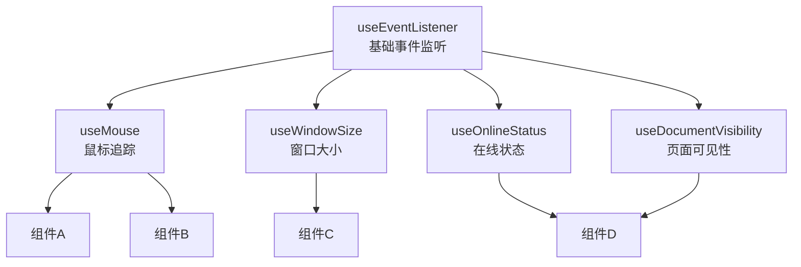
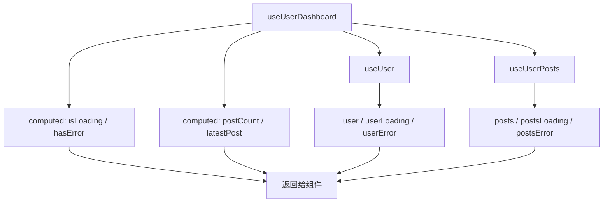
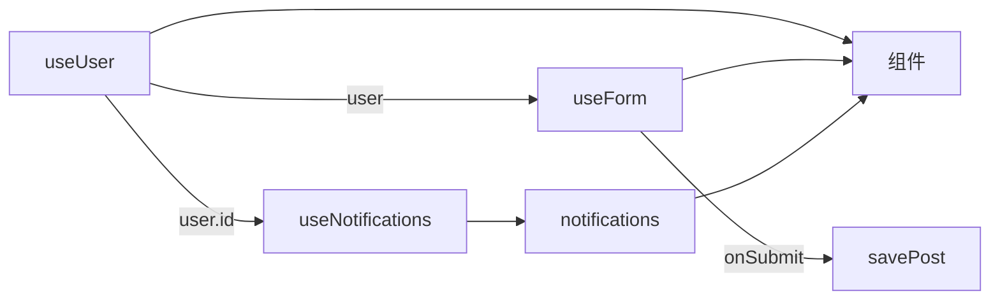

扫描[二维码](https://api2.cmdragon.cn/upload/cmder/20250304_012821924.jpg)关注或者微信搜一搜：`编程智域 前端至全栈交流与成长`

[发现1000+提升效率与开发的AI工具和实用程序](https://tools.cmdragon.cn/zh/apps?category=ai_chat)：https://tools.cmdragon.cn/zh/apps?category=ai_chat


## 一、组合才是Composables的灵魂

你可能觉得Composable就是把一段逻辑抽出来复用，这没错，但这只是它的一半能力。另一半——也是更厉害的一半——是**组合**。

啥叫组合？就是一个Composable可以调用另一个Composable，就像搭积木一样，用小的积木块拼出大的结构。

官方文档里有句话说得特别好：

> 一个组合式函数可以调用一个或多个其他的组合式函数。这使得我们可以像使用多个组件组合成整个应用一样，用多个较小且逻辑独立的单元来组合形成复杂的逻辑。实际上，这正是为什么我们决定将实现了这一设计模式的 API 集合命名为**组合式 API**。

你看，"组合式API"这个名字，核心就在"组合"二字。

## 二、从useEventListener看组合

咱们之前写过`useEventListener`和`useMouse`，来看看它们是怎么组合的。

### 先有useEventListener

```javascript
// composables/useEventListener.js
import { onMounted, onUnmounted } from 'vue'

export function useEventListener(target, event, callback) {
  onMounted(() => target.addEventListener(event, callback))
  onUnmounted(() => target.removeEventListener(event, callback))
}
```

这个Composable只做一件事——帮你注册和移除事件监听器。它不管你监听的是啥事件、回调里干啥，它就管注册和移除。

### 然后useMouse调用useEventListener

```javascript
// composables/useMouse.js
import { ref } from 'vue'
import { useEventListener } from './useEventListener.js'

export function useMouse() {
  const x = ref(0)
  const y = ref(0)

  useEventListener(window, 'mousemove', (event) => {
    x.value = event.pageX
    y.value = event.pageY
  })

  return { x, y }
}
```

`useMouse`不用自己管事件监听器的注册和移除，它把这个活交给`useEventListener`，自己只关心"鼠标移动时更新坐标"这个核心逻辑。

### 更多Composable基于useEventListener

```javascript
// 监听窗口大小
export function useWindowSize() {
  const width = ref(window.innerWidth)
  const height = ref(window.innerHeight)

  useEventListener(window, 'resize', () => {
    width.value = window.innerWidth
    height.value = window.innerHeight
  })

  return { width, height }
}

// 监听在线状态
export function useOnlineStatus() {
  const isOnline = ref(navigator.onLine)

  useEventListener(window, 'online', () => isOnline.value = true)
  useEventListener(window, 'offline', () => isOnline.value = false)

  return { isOnline }
}

// 监听页面可见性
export function useDocumentVisibility() {
  const isVisible = ref(!document.hidden)

  useEventListener(document, 'visibilitychange', () => {
    isVisible.value = !document.hidden
  })

  return { isVisible }
}
```

看到了吧？`useEventListener`就像一块基础积木，各种需要事件监听的Composable都基于它来构建，不用每次都重复写注册和移除的逻辑。



## 三、Composable之间传递数据

Composable之间不仅能嵌套调用，还能传递数据。一个Composable的返回值可以作为另一个Composable的参数。

### 实战：useUserPosts

假设你有个需求——根据用户ID获取该用户的文章列表。这里涉及两个Composable的协作：

```javascript
// composables/useUser.js
import { ref, watchEffect, toValue } from 'vue'

export function useUser(userId) {
  const user = ref(null)
  const loading = ref(false)
  const error = ref(null)

  watchEffect(async () => {
    loading.value = true
    error.value = null

    try {
      const response = await fetch(`/api/users/${toValue(userId)}`)
      user.value = await response.json()
    } catch (err) {
      error.value = err
    } finally {
      loading.value = false
    }
  })

  return { user, loading, error }
}
```

```javascript
// composables/useUserPosts.js
import { ref, watchEffect, toValue } from 'vue'

export function useUserPosts(userId) {
  const posts = ref([])
  const loading = ref(false)
  const error = ref(null)

  watchEffect(async () => {
    loading.value = true
    error.value = null

    try {
      const response = await fetch(`/api/users/${toValue(userId)}/posts`)
      posts.value = await response.json()
    } catch (err) {
      error.value = err
    } finally {
      loading.value = false
    }
  })

  return { posts, loading, error }
}
```

组件里组合使用：

```vue
<script setup>
import { useUser } from './composables/useUser.js'
import { useUserPosts } from './composables/useUserPosts.js'

const props = defineProps(['userId'])

const { user, loading: userLoading } = useUser(() => props.userId)
const { posts, loading: postsLoading } = useUserPosts(() => props.userId)
</script>

<template>
  <div v-if="userLoading">加载用户信息...</div>
  <div v-else>
    <h1>{{ user?.name }} 的文章</h1>
    <div v-if="postsLoading">加载文章列表...</div>
    <ul v-else>
      <li v-for="post in posts" :key="post.id">{{ post.title }}</li>
    </ul>
  </div>
</template>
```

### 更进一步：一个Composable的输出喂给另一个

```javascript
// composables/useUserDashboard.js
import { computed } from 'vue'
import { useUser } from './useUser.js'
import { useUserPosts } from './useUserPosts.js'

export function useUserDashboard(userId) {
  const { user, loading: userLoading, error: userError } = useUser(userId)
  const { posts, loading: postsLoading, error: postsError } = useUserPosts(userId)

  const isLoading = computed(() => userLoading.value || postsLoading.value)
  const hasError = computed(() => userError.value || postsError.value)

  const postCount = computed(() => posts.value.length)
  const latestPost = computed(() => posts.value[0] || null)

  return {
    user,
    posts,
    isLoading,
    hasError,
    postCount,
    latestPost
  }
}
```

组件里就变得超级简单：

```vue
<script setup>
import { useUserDashboard } from './composables/useUserDashboard.js'

const { user, posts, isLoading, postCount, latestPost } = useUserDashboard(() => props.userId)
</script>
```

一个Composable把多个小Composable组合起来，对外提供更高层的抽象。组件不需要知道内部用了几个Composable，只需要关心最终拿到的数据。



## 四、用Composable拆分臃肿组件

组合的另一个重要用途是**代码组织**。当你的组件越来越复杂，`<script setup>`里堆了几百行代码，你就可以按逻辑功能把它拆成多个Composable。

### 拆分前：一个组件啥都干

```vue
<script setup>
import { ref, computed, onMounted, onUnmounted, watch } from 'vue'

// 用户相关逻辑
const user = ref(null)
const userLoading = ref(false)
async function fetchUser() { ... }
function login() { ... }
function logout() { ... }

// 表单相关逻辑
const formData = ref({ title: '', content: '' })
const formErrors = ref({})
function validateForm() { ... }
function submitForm() { ... }
function resetForm() { ... }

// 通知相关逻辑
const notifications = ref([])
const unreadCount = computed(() => notifications.value.filter(n => !n.read).length)
function markAsRead(id) { ... }
function clearAll() { ... }

// 搜索相关逻辑
const searchQuery = ref('')
const searchResults = ref([])
const isSearching = ref(false)
function handleSearch() { ... }

// 几百行代码混在一起... 😵
</script>
```

### 拆分后：各管各的

```vue
<script setup>
import { useUser } from './composables/useUser.js'
import { useForm } from './composables/useForm.js'
import { useNotifications } from './composables/useNotifications.js'
import { useSearch } from './composables/useSearch.js'

const { user, login, logout } = useUser()
const { formData, errors, submit, reset } = useForm()
const { notifications, unreadCount, markAsRead, clearAll } = useNotifications()
const { query, results, isSearching, search } = useSearch()
</script>
```

清爽吧？每个Composable管自己那一摊事，组件只负责把它们组合起来、渲染UI。

### Composable之间还能通信

拆分后的Composable不是完全孤立的，它们可以通过参数传递来协作：

```vue
<script setup>
import { useUser } from './composables/useUser.js'
import { useForm } from './composables/useForm.js'
import { useNotifications } from './composables/useNotifications.js'

const { user } = useUser()

// 把user传给useForm，表单提交时需要用户信息
const { submit } = useForm({
  onSubmit: async (data) => {
    await savePost(user.value.id, data)
  }
})

// 把user传给useNotifications，获取该用户的通知
const { notifications } = useNotifications(() => user.value?.id)
</script>
```



## 五、选项式API中怎么用Composable

如果你还在用选项式API（Options API），Composable也能用，但得在`setup()`函数中调用，并且要把返回值暴露出去：

```javascript
import { useMouse } from './composables/useMouse.js'
import { useFetch } from './composables/useFetch.js'

export default {
  setup() {
    const { x, y } = useMouse()
    const { data, error } = useFetch('/api/data')

    // 必须返回，否则模板和this访问不到
    return { x, y, data, error }
  },

  mounted() {
    // setup返回的属性可以通过this访问
    console.log(this.x)
  }
}
```

不过说实话，如果你已经决定用Composable了，还是建议直接上`<script setup>`，写起来舒服多了。

## 六、组合的边界：啥时候该拆？

不是所有逻辑都需要拆成Composable。拆得太细反而会增加代码的复杂度和阅读成本。

### 该拆的情况

- 逻辑在**多个组件**中重复使用
- 组件的`<script setup>`超过**100行**
- 一段逻辑有**独立的状态和生命周期**

### 不该拆的情况

- 逻辑只在一个组件里用，且不太复杂
- 拆出来反而让人要在多个文件间跳来跳去
- 几行代码的小逻辑，没必要单独建文件

一个简单的判断标准：**如果你下次写另一个组件时，会想复制这段代码，那就该拆了。**

## 课后 Quiz

### 问题 1
为什么说"组合"是Composables的灵魂？

#### 答案解析
因为Composables的核心价值不仅在于复用单个逻辑片段，更在于通过组合构建复杂逻辑。就像组件可以嵌套组件形成完整应用一样，Composable可以调用Composable形成完整的逻辑链。这种"用小的构建块组合出大的结构"的方式，正是组合式API得名的原因。

### 问题 2
下面这种写法有什么好处？

```javascript
export function useUserDashboard(userId) {
  const { user } = useUser(userId)
  const { posts } = useUserPosts(userId)
  const postCount = computed(() => posts.value.length)
  return { user, posts, postCount }
}
```

#### 答案解析
好处是提供了更高层的抽象。组件不需要分别调用`useUser`和`useUserPosts`再自己算`postCount`，只需要调用一个`useUserDashboard`就搞定了。这就像你不需要自己买CPU、内存、硬盘来组装电脑，直接买一台整机就行。同时，内部的Composable仍然可以独立使用，灵活性不受影响。

### 问题 3
选项式API中使用Composable有什么限制？

#### 答案解析
必须在`setup()`函数中调用Composable，并且要把Composable返回的值通过`setup()`的返回值暴露出去，否则模板中无法使用，`this`也无法访问。相比`<script setup>`的自动暴露，选项式API的写法更繁琐。

## 常见报错解决方案

### 报错 1：Composable嵌套调用时生命周期钩子注册到错误的组件

**错误场景**：
```javascript
// 在异步操作之后调用子Composable
export function useParent() {
  const data = ref(null)

  // ❌ 异步之后调用，组件实例可能已经变了
  setTimeout(() => {
    const { x, y } = useMouse() // 生命周期钩子注册不到正确的组件
  }, 1000)

  return { data }
}
```

**报错原因**：
Composable必须在setup上下文中同步调用。异步操作之后，Vue的组件实例上下文已经不存在了。

**解决方案**：
确保Composable在setup阶段同步调用：

```javascript
export function useParent() {
  const data = ref(null)

  // ✅ 同步调用
  const { x, y } = useMouse()

  return { data, x, y }
}
```

### 报错 2：多个Composable返回同名属性导致冲突

**错误场景**：
```javascript
const { loading } = useUser()
const { loading } = usePosts() // 💥 loading被覆盖了
```

**报错原因**：
两个Composable都返回了`loading`，解构时后者覆盖前者。

**解决方案**：
解构时重命名：

```javascript
const { loading: userLoading, user } = useUser()
const { loading: postsLoading, posts } = usePosts()
// ✅ 重命名后不会冲突
```

### 报错 3：Composable之间循环依赖

**错误场景**：
```javascript
// useA.js
import { useB } from './useB.js'
export function useA() {
  const { data } = useB()
  return { data }
}

// useB.js
import { useA } from './useA.js'
export function useB() {
  const { data } = useA()
  return { data }
}
// 💥 循环依赖，无限递归
```

**报错原因**：
两个Composable互相调用，形成无限递归。

**解决方案**：
重新设计Composable的职责划分，避免循环依赖。通常的做法是把共享的逻辑提取到第三个Composable中：

```javascript
// useShared.js - 共享逻辑
export function useShared() {
  const data = ref(null)
  return { data }
}

// useA.js - 只调用useShared
import { useShared } from './useShared.js'
export function useA() {
  const { data } = useShared()
  return { data }
}

// useB.js - 也只调用useShared
import { useShared } from './useShared.js'
export function useB() {
  const { data } = useShared()
  return { data }
}
```

## 参考链接

- Vue 3 官方文档 - 组合式函数：https://vuejs.org/guide/reusability/composables.html
- Vue 3 官方文档 - 组合式 API 常见问答：https://vuejs.org/guide/extras/composition-api-faq.html
- VueUse - Composable 工具库：https://vueuse.org/

余下文章内容请点击跳转至 个人博客页面 或者 扫描[二维码](https://api2.cmdragon.cn/upload/cmder/20250304_012821924.jpg)关注或者微信搜一搜：`编程智域 前端至全栈交流与成长`，阅读完整的文章：[Composable套Composable，像搭积木一样组合逻辑](https://blog.cmdragon.cn/posts/a7b8c9d0e1f2a3b4c5d6e7f8a9b0c1d2/)


<details>
<summary>往期文章归档</summary>

- [Vue 3 静态与动态 Props 如何传递？TypeScript 类型约束有何必要？](https://blog.cmdragon.cn/posts/94ab48753b64780ca3ab7a7115ae8522/)
- [Vue 3中组件局部注册的优势与实现方式如何？](https://blog.cmdragon.cn/posts/dbf576e744870f6de26fd8a2e03e47da/)
- [如何在Vue3中优化生命周期钩子性能并规避常见陷阱？](https://blog.cmdragon.cn/posts/12d98b3b9ccd6c19a1b169d720ac5c80/)
- [Vue 3 Composition API生命周期钩子：如何实现从基础理解到高阶复用？](https://blog.cmdragon.cn/posts/8884e2b70287fcb263c57648eeb27419/)
- [Vue 3生命周期钩子实战指南：如何正确选择onMounted、onUpdated与onUnmounted的应用场景？](https://blog.cmdragon.cn/posts/883c6dbc50ae4183770a4462e0b8ae4d/)
- [Vue 3中生命周期钩子与响应式系统如何实现协同工作？](https://blog.cmdragon.cn/posts/70dad360ffa9dce14d0d69611b8cb019/)
- [Vue 3组件生命周期钩子的执行顺序与使用场景是什么？](https://blog.cmdragon.cn/posts/db44294a78dc9f666f67b053f6c83567/)
- [Vue组件全局注册与局部注册如何抉择？](https://blog.cmdragon.cn/posts/43ead630ea17da65d99ad2eb8188e472/)
- [Vue3组件化开发中，Props与Emits如何实现数据流转与事件协作？](https://blog.cmdragon.cn/posts/8cff7d2df113da66ea7be560c4d1d22a/)
- [Vue 3模板引用如何与其他特性协同实现复杂交互？](https://blog.cmdragon.cn/posts/331bf75d114ab09116eadfcdca602b58/)
- [Vue 3 v-for中模板引用如何实现高效管理与动态控制？](https://blog.cmdragon.cn/posts/cb380897ddc3578b180ecf8843c774c1/)
- [Vue 3的defineExpose：如何突破script setup组件默认封装，实现精准的父子通讯？](https://blog.cmdragon.cn/posts/202ae0f4acde7128e0e31baf63732fb5/)
- [Vue 3模板引用的生命周期时机如何把握？常见陷阱该如何避免？](https://blog.cmdragon.cn/posts/7d2a0f6555ecbe92afd7d2491c427463/)
- [Vue 3模板引用如何实现父组件与子组件的高效交互？](https://blog.cmdragon.cn/posts/3fb7bdd84128b7efaaa1c979e1f28dee/)
- [Vue中为何需要模板引用？又如何高效实现DOM与组件实例的直接访问？](https://blog.cmdragon.cn/posts/23f3464ba16c7054b4783cded50c04c6/)

</details>


<details>
<summary>免费好用的热门在线工具</summary>

- [多直播聚合器 - 应用商店 | By cmdragon](https://tools.cmdragon.cn/zh/apps/multi-live-aggregator)
- [Proto文件生成器 - 应用商店 | By cmdragon](https://tools.cmdragon.cn/zh/apps/proto-file-generator)
- [图片转粒子 - 应用商店 | By cmdragon](https://tools.cmdragon.cn/zh/apps/image-to-particles)
- [视频下载器 - 应用商店 | By cmdragon](https://tools.cmdragon.cn/zh/apps/video-downloader)
- [文件格式转换器 - 应用商店 | By cmdragon](https://tools.cmdragon.cn/zh/apps/file-converter)
- [M3U8在线播放器 - 应用商店 | By cmdragon](https://tools.cmdragon.cn/zh/apps/m3u8-player)
- [快图设计 - 应用商店 | By cmdragon](https://tools.cmdragon.cn/zh/apps/quick-image-design)
- [高级文字转图片转换器 - 应用商店 | By cmdragon](https://tools.cmdragon.cn/zh/apps/text-to-image-advanced)
- [RAID 计算器 - 应用商店 | By cmdragon](https://tools.cmdragon.cn/zh/apps/raid-calculator)
- [在线PS - 应用商店 | By cmdragon](https://tools.cmdragon.cn/zh/apps/photoshop-online)
- [Mermaid 在线编辑器 - 应用商店 | By cmdragon](https://tools.cmdragon.cn/zh/apps/mermaid-live-editor)
- [数学求解计算器 - 应用商店 | By cmdragon](https://tools.cmdragon.cn/zh/apps/math-solver-calculator)
- [智能提词器 - 应用商店 | By cmdragon](https://tools.cmdragon.cn/zh/apps/smart-teleprompter)
- [魔法简历 - 应用商店 | By cmdragon](https://tools.cmdragon.cn/zh/apps/magic-resume)
- [Image Puzzle Tool - 图片拼图工具 | By cmdragon](https://tools.cmdragon.cn/zh/apps/image-puzzle-tool)
- [字幕下载工具 - 应用商店 | By cmdragon](https://tools.cmdragon.cn/zh/apps/subtitle-downloader)
- [歌词生成工具 - 应用商店 | By cmdragon](https://tools.cmdragon.cn/zh/apps/lyrics-generator)
- [网盘资源聚合搜索 - 应用商店 | By cmdragon](https://tools.cmdragon.cn/zh/apps/cloud-drive-search)
- [ASCII字符画生成器 - 应用商店 | By cmdragon](https://tools.cmdragon.cn/zh/apps/ascii-art-generator)
- [JSON Web Tokens 工具 - 应用商店 | By cmdragon](https://tools.cmdragon.cn/zh/apps/jwt-tool)
- [Bcrypt 密码工具 - 应用商店 | By cmdragon](https://tools.cmdragon.cn/zh/apps/bcrypt-tool)
- [GIF 合成器 - 应用商店 | By cmdragon](https://tools.cmdragon.cn/zh/apps/gif-composer)
- [GIF 分解器 - 应用商店 | By cmdragon](https://tools.cmdragon.cn/zh/apps/gif-decomposer)
- [文本隐写术 - 应用商店 | By cmdragon](https://tools.cmdragon.cn/zh/apps/text-steganography)
- [CMDragon 在线工具 - 高级AI工具箱与开发者套件 | 免费好用的在线工具](https://tools.cmdragon.cn/zh)
- [应用商店 - 发现1000+提升效率与开发的AI工具和实用程序 | 免费好用的在线工具](https://tools.cmdragon.cn/zh/apps?category=trending)
- [CMDragon 更新日志 - 最新更新、功能与改进 | 免费好用的在线工具](https://tools.cmdragon.cn/zh/changelog)
- [支持我们 - 成为赞助者 | 免费好用的在线工具](https://tools.cmdragon.cn/zh/sponsor)
- [AI文本生成图像 - 应用商店 | 免费好用的在线工具](https://tools.cmdragon.cn/zh/apps/text-to-image-ai)
- [临时邮箱 - 应用商店 | 免费好用的在线工具](https://tools.cmdragon.cn/zh/apps/temp-email)
- [二维码解析器 - 应用商店 | 免费好用的在线工具](https://tools.cmdragon.cn/zh/apps/qrcode-parser)
- [文本转思维导图 - 应用商店 | 免费好用的在线工具](https://tools.cmdragon.cn/zh/apps/text-to-mindmap)
- [正则表达式可视化工具 - 应用商店 | 免费好用的在线工具](https://tools.cmdragon.cn/zh/apps/regex-visualizer)
- [文件隐写工具 - 应用商店 | 免费好用的在线工具](https://tools.cmdragon.cn/zh/apps/steganography-tool)
- [IPTV 频道探索器 - 应用商店 | 免费好用的在线工具](https://tools.cmdragon.cn/zh/apps/iptv-explorer)
- [快传 - 应用商店 | 免费好用的在线工具](https://tools.cmdragon.cn/zh/apps/snapdrop)
- [随机抽奖工具 - 应用商店 | 免费好用的在线工具](https://tools.cmdragon.cn/zh/apps/lucky-draw)
- [动漫场景查找器 - 应用商店 | 免费好用的在线工具](https://tools.cmdragon.cn/zh/apps/anime-scene-finder)
- [时间工具箱 - 应用商店 | 免费好用的在线工具](https://tools.cmdragon.cn/zh/apps/time-toolkit)
- [网速测试 - 应用商店 | 免费好用的在线工具](https://tools.cmdragon.cn/zh/apps/speed-test)
- [AI 智能抠图工具 - 应用商店 | 免费好用的在线工具](https://tools.cmdragon.cn/zh/apps/background-remover)
- [背景替换工具 - 应用商店 | 免费好用的在线工具](https://tools.cmdragon.cn/zh/apps/background-replacer)
- [艺术二维码生成器 - 应用商店 | 免费好用的在线工具](https://tools.cmdragon.cn/zh/apps/artistic-qrcode)
- [Open Graph 元标签生成器 - 应用商店 | 免费好用的在线工具](https://tools.cmdragon.cn/zh/apps/open-graph-generator)
- [图像对比工具 - 应用商店 | 免费好用的在线工具](https://tools.cmdragon.cn/zh/apps/image-comparison)
- [图片压缩专业版 - 应用商店 | 免费好用的在线工具](https://tools.cmdragon.cn/zh/apps/image-compressor)
- [密码生成器 - 应用商店 | 免费好用的在线工具](https://tools.cmdragon.cn/zh/apps/password-generator)
- [SVG优化器 - 应用商店 | 免费好用的在线工具](https://tools.cmdragon.cn/zh/apps/svg-optimizer)
- [调色板生成器 - 应用商店 | 免费好用的在线工具](https://tools.cmdragon.cn/zh/apps/color-palette)
- [在线节拍器 - 应用商店 | 免费好用的在线工具](https://tools.cmdragon.cn/zh/apps/online-metronome)
- [IP归属地查询 - 应用商店 | 免费好用的在线工具](https://tools.cmdragon.cn/zh/apps/ip-geolocation)
- [CSS网格布局生成器 - 应用商店 | 免费好用的在线工具](https://tools.cmdragon.cn/zh/apps/css-grid-layout)
- [邮箱验证工具 - 应用商店 | 免费好用的在线工具](https://tools.cmdragon.cn/zh/apps/email-validator)
- [书法练习字帖 - 应用商店 | 免费好用的在线工具](https://tools.cmdragon.cn/zh/apps/calligraphy-practice)
- [金融计算器套件 - 应用商店 | 免费好用的在线工具](https://tools.cmdragon.cn/zh/apps/finance-calculator-suite)
- [中国亲戚关系计算器 - 应用商店 | 免费好用的在线工具](https://tools.cmdragon.cn/zh/apps/chinese-kinship-calculator)
- [Protocol Buffer 工具箱 - 应用商店 | 免费好用的在线工具](https://tools.cmdragon.cn/zh/apps/protobuf-toolkit)
- [IP归属地查询 - 应用商店 | 免费好用的在线工具](https://tools.cmdragon.cn/zh/apps/ip-geolocation)
- [图片无损放大 - 应用商店 | 免费好用的在线工具](https://tools.cmdragon.cn/zh/apps/image-upscaler)
- [文本比较工具 - 应用商店 | 免费好用的在线工具](https://tools.cmdragon.cn/zh/apps/text-compare)
- [IP批量查询工具 - 应用商店 | 免费好用的在线工具](https://tools.cmdragon.cn/zh/apps/ip-batch-lookup)
- [域名查询工具 - 应用商店 | 免费好用的在线工具](https://tools.cmdragon.cn/zh/apps/domain-finder)
- [DNS工具箱 - 应用商店 | 免费好用的在线工具](https://tools.cmdragon.cn/zh/apps/dns-toolkit)
- [网站图标生成器 - 应用商店 | 免费好用的在线工具](https://tools.cmdragon.cn/zh/apps/favicon-generator)
- [XML Sitemap](https://tools.cmdragon.cn/sitemap_index.xml)

</details>
