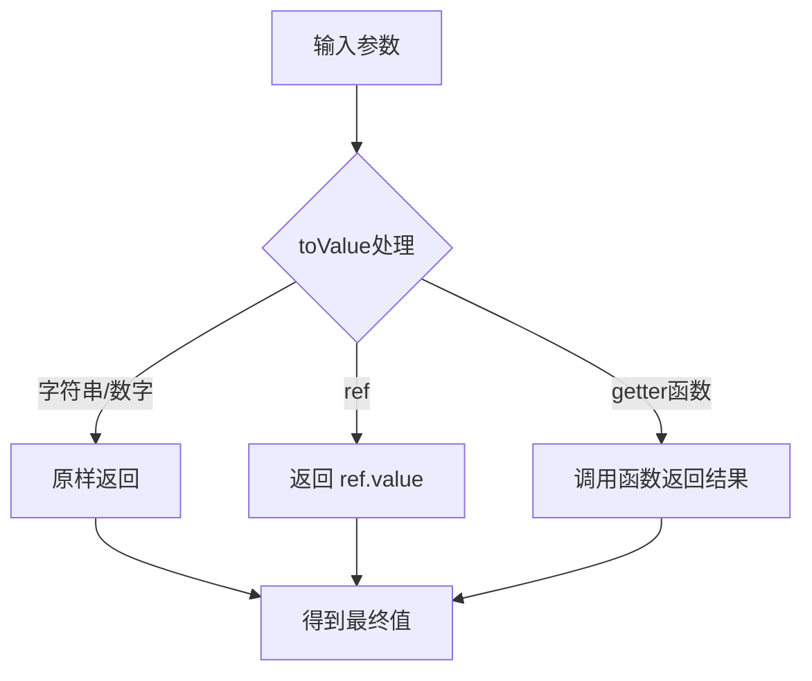
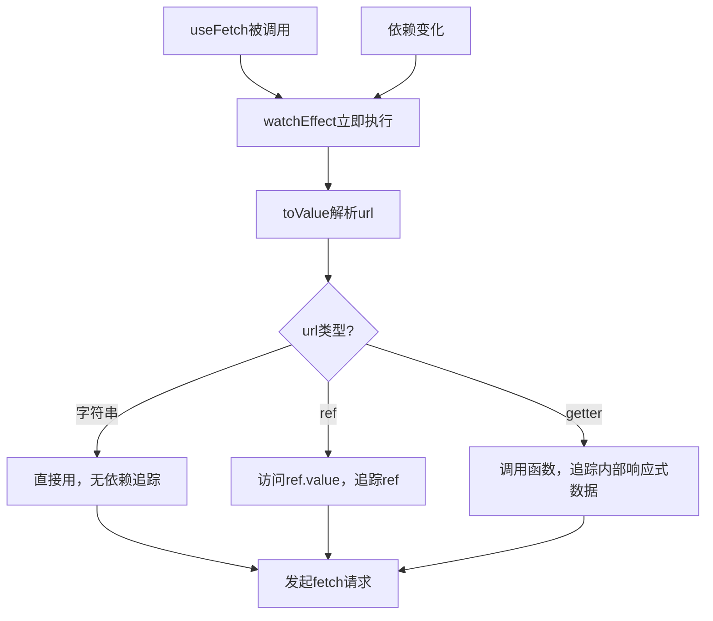

扫描[二维码](https://api2.cmdragon.cn/upload/cmder/20250304_012821924.jpg)关注或者微信搜一搜：`编程智域 前端至全栈交流与成长`

[发现1000+提升效率与开发的AI工具和实用程序](https://tools.cmdragon.cn/zh/apps?category=ai_chat)：https://tools.cmdragon.cn/zh/apps?category=ai_chat


## 一、问题来了：URL变了数据不更新

先看一个最常见的场景——异步数据请求。咱们写个最基础的`useFetch`：

```javascript
// 第一版：只能接收静态字符串
import { ref } from 'vue'

export function useFetch(url) {
  const data = ref(null)
  const error = ref(null)

  fetch(url)
    .then(res => res.json())
    .then(json => data.value = json)
    .catch(err => error.value = err)

  return { data, error }
}
```

用起来没问题：

```javascript
const { data } = useFetch('/api/users') // 传个字符串，OK
```

但当你想动态切换URL的时候，问题就来了：

```javascript
const userId = ref(1)
const { data } = useFetch(`/api/users/${userId.value}`)

userId.value = 2 // URL变了，但不会重新请求！
```

为啥？因为你传给`useFetch`的是个字符串，不是响应式的。字符串一旦传进去就固定了，后面`userId`怎么变都不会触发重新请求。

## 二、让Composable支持ref参数

那我们让它支持ref呗：

```javascript
// 第二版：支持ref
import { ref, watch } from 'vue'

export function useFetch(url) {
  const data = ref(null)
  const error = ref(null)

  function fetchData() {
    data.value = null
    error.value = null

    // 如果url是ref，取.value；如果是字符串，直接用
    const resolvedUrl = typeof url === 'object' ? url.value : url

    fetch(resolvedUrl)
      .then(res => res.json())
      .then(json => data.value = json)
      .catch(err => error.value = err)
  }

  fetchData() // 初始请求

  // 如果url是ref，监听变化
  if (typeof url === 'object') {
    watch(url, fetchData)
  }

  return { data, error }
}
```

这样传ref就能自动重新请求了：

```javascript
const url = ref('/api/users/1')
const { data } = useFetch(url)

url.value = '/api/users/2' // ✅ 自动重新请求
```

但这个版本有个问题——不支持getter函数。有时候URL是根据多个响应式变量算出来的：

```javascript
// 这种写法不支持！
const { data } = useFetch(() => `/api/users/${props.id}/posts?page=${page.value}`)
```

## 三、toValue登场：一个API搞定三种输入

Vue 3.3新增了`toValue()`这个API，专门用来处理"输入可能是字符串、ref、getter函数"的情况。它的工作方式很简单：

```javascript
import { toValue } from 'vue'

toValue('hello')              // 'hello' → 原样返回
toValue(ref('hello'))         // 'hello' → 取ref的值
toValue(() => 'hello')        // 'hello' → 调用函数取返回值
toValue(42)                   // 42 → 原样返回
```

就这么简单粗暴——是ref就取值，是函数就调用，是普通值就原样返回。



## 四、配合watchEffect实现自动追踪

光有`toValue`还不够，你还得让Composable知道"参数变了要重新执行"。这时候`watchEffect`就派上用场了。

`watchEffect`的特点是**自动追踪依赖**——你在它的回调函数里用了哪些响应式数据，它就自动监听哪些。当这些数据变了，回调就会重新执行。

关键点：**`toValue()`要在`watchEffect`的回调里面调用**，这样toValue解析ref或调用getter时访问到的响应式数据，才会被watchEffect追踪到。

```javascript
// 第三版：toValue + watchEffect，终极方案
import { ref, watchEffect, toValue } from 'vue'

export function useFetch(url) {
  const data = ref(null)
  const error = ref(null)

  function fetchData() {
    data.value = null
    error.value = null

    fetch(toValue(url)) // toValue在fetchData里调用
      .then(res => res.json())
      .then(json => data.value = json)
      .catch(err => error.value = err)
  }

  watchEffect(() => {
    fetchData()
    // toValue(url)在fetchData里被调用了
    // 如果url是ref或getter，toValue解析时访问的响应式数据会被watchEffect追踪
  })

  return { data, error }
}
```

等一下，上面这个写法有个小问题——`toValue(url)`是在`fetchData`里调用的，但`watchEffect`追踪的是回调函数里**直接访问**的响应式数据。为了确保依赖被正确追踪，最好把`toValue`的调用放在`watchEffect`回调的直接作用域里：

```javascript
// 更清晰的写法
export function useFetch(url) {
  const data = ref(null)
  const error = ref(null)

  watchEffect(() => {
    // toValue在这里直接调用，确保依赖被追踪
    const resolvedUrl = toValue(url)

    data.value = null
    error.value = null

    fetch(resolvedUrl)
      .then(res => res.json())
      .then(json => data.value = json)
      .catch(err => error.value = err)
  })

  return { data, error }
}
```

现在三种输入方式都支持了：

```javascript
// 1. 传字符串
const { data } = useFetch('/api/users')

// 2. 传ref
const url = ref('/api/users')
const { data } = useFetch(url)
url.value = '/api/posts' // 自动重新请求

// 3. 传getter函数
const { data } = useFetch(() => `/api/users/${props.id}`)
// props.id变了，自动重新请求
```



## 五、三种输入方式的使用场景

### 字符串：URL是固定的

```javascript
// 获取系统配置，URL永远不变
const { data: config } = useFetch('/api/config')
```

### ref：URL需要动态切换

```javascript
// 根据用户选择切换不同的API
const endpoint = ref('/api/users')
const { data } = useFetch(endpoint)

// 切换到文章列表
endpoint.value = '/api/posts' // 自动重新请求
```

### getter函数：URL依赖多个响应式变量

```javascript
// 根据路由参数和分页状态拼接URL
const page = ref(1)
const pageSize = ref(10)

const { data } = useFetch(() => `/api/users?page=${page.value}&size=${pageSize.value}`)

// 翻页
page.value++ // 自动重新请求
```

getter函数是最灵活的方式，因为你可以把任意复杂的逻辑放进去。而且只有getter内部实际访问的响应式数据才会被追踪，不会造成不必要的重复请求。

## 六、加上loading状态让体验更好

实际项目中，光有data和error还不够，还得有个loading状态：

```javascript
// 完整版useFetch
import { ref, watchEffect, toValue } from 'vue'

export function useFetch(url) {
  const data = ref(null)
  const error = ref(null)
  const loading = ref(false)

  watchEffect(async () => {
    const resolvedUrl = toValue(url)

    data.value = null
    error.value = null
    loading.value = true

    try {
      const response = await fetch(resolvedUrl)
      if (!response.ok) {
        throw new Error(`HTTP error! status: ${response.status}`)
      }
      data.value = await response.json()
    } catch (err) {
      error.value = err
    } finally {
      loading.value = false
    }
  })

  return { data, error, loading }
}
```

组件里用：

```vue
<script setup>
import { ref } from 'vue'
import { useFetch } from './composables/useFetch.js'

const userId = ref(1)

const { data, error, loading } = useFetch(() => `/api/users/${userId.value}`)

function nextUser() {
  userId.value++
}
</script>

<template>
  <div v-if="loading">加载中...</div>
  <div v-else-if="error">出错了：{{ error.message }}</div>
  <div v-else-if="data">
    <h2>{{ data.name }}</h2>
    <p>{{ data.email }}</p>
    <button @click="nextUser">下一个用户</button>
  </div>
</template>
```

## 七、toValue在watchEffect中的注意事项

有个细节特别容易忽略——`toValue()`必须在`watchEffect`的回调函数**内部**调用，才能正确追踪依赖。

```javascript
// ❌ 错误：toValue在watchEffect外面调用
const resolvedUrl = toValue(url) // 在外面解析，依赖不会被追踪

watchEffect(() => {
  fetch(resolvedUrl) // resolvedUrl是固定值，不会随url变化
})

// ✅ 正确：toValue在watchEffect里面调用
watchEffect(() => {
  const resolvedUrl = toValue(url) // 在里面解析，依赖会被追踪
  fetch(resolvedUrl)
})
```

原理很简单——`watchEffect`只能追踪在它回调函数执行期间访问到的响应式数据。你在回调外面调用`toValue`，那`toValue`访问ref或调用getter的时候，`watchEffect`根本不知道，自然就追踪不到。

如果你不想用`watchEffect`，也可以用`watch`显式监听：

```javascript
// 用watch显式监听
watch(
  () => toValue(url), // 监听toValue的结果
  (newUrl) => {
    fetchData(newUrl)
  },
  { immediate: true } // 立即执行一次
)
```

两种方式效果一样，`watch`更明确，`watchEffect`更简洁，看你喜欢哪种。

## 课后 Quiz

### 问题 1
`toValue(ref('hello'))`和`toValue(() => 'hello')`分别返回什么？

#### 答案解析
`toValue(ref('hello'))`返回`'hello'`——因为输入是ref，toValue取它的.value。
`toValue(() => 'hello')`也返回`'hello'`——因为输入是函数，toValue调用它并返回结果。
虽然结果一样，但依赖追踪的行为不同：在watchEffect中，前者追踪ref本身，后者追踪getter函数内部访问的响应式数据。

### 问题 2
为什么`toValue()`必须在`watchEffect`的回调内部调用才能正确追踪依赖？

#### 答案解析
因为`watchEffect`只能追踪在其回调函数执行期间访问到的响应式数据。如果`toValue()`在回调外面调用，那么它解析ref或调用getter时访问的响应式数据，`watchEffect`根本感知不到，就无法建立依赖关系。只有把`toValue()`放在回调里面，`watchEffect`才能在回调执行时"看到"这些响应式访问，从而正确追踪。

### 问题 3
下面哪种方式能让`useFetch`在`props.id`变化时自动重新请求？

```javascript
// A
const { data } = useFetch(`/api/users/${props.id}`)

// B
const { data } = useFetch(ref(`/api/users/${props.id}`))

// C
const { data } = useFetch(() => `/api/users/${props.id}`)
```

#### 答案解析
C正确。A传的是字符串，是固定值，props.id变了不会重新请求。B传的是ref，但ref的值在创建时就固定了（字符串模板已经执行了），props.id变了ref的值不会跟着变。C传的是getter函数，每次watchEffect重新执行时都会调用这个函数，函数内部访问了`props.id`，所以props.id变化时会被追踪到并触发重新请求。

## 常见报错解决方案

### 报错 1：传了ref但变化时不重新执行

**错误场景**：
```javascript
export function useFetch(url) {
  const data = ref(null)

  // 直接用了toValue但没有watchEffect
  fetch(toValue(url))
    .then(res => res.json())
    .then(json => data.value = json)

  return { data }
}

const url = ref('/api/users')
useFetch(url)
url.value = '/api/posts' // 不重新请求
```

**报错原因**：
`toValue`只是解析值，不会自动监听变化。你需要配合`watchEffect`或`watch`来追踪依赖。

**解决方案**：
用`watchEffect`包裹请求逻辑：

```javascript
export function useFetch(url) {
  const data = ref(null)

  watchEffect(() => {
    fetch(toValue(url))
      .then(res => res.json())
      .then(json => data.value = json)
  })

  return { data }
}
```

### 报错 2：`toValue is not a function`

**错误场景**：
```javascript
import { toValue } from 'vue' // Vue 3.2会报错
```

**报错原因**：
`toValue`是Vue 3.3新增的API，3.2及以下版本没有。

**解决方案**：
升级Vue到3.3+，或者自己实现一个简易版：

```javascript
import { unref, isRef } from 'vue'

function toValue(value) {
  if (typeof value === 'function') {
    return value()
  }
  return unref(value)
}
```

### 报错 3：watchEffect中发请求导致无限循环

**错误场景**：
```javascript
watchEffect(async () => {
  const res = await fetch(toValue(url))
  data.value = await res.json() // 修改了data
  // 如果data也在watchEffect中被读取了，就会无限循环
})
```

**报错原因**：
如果`watchEffect`回调中既读取了响应式数据又修改了响应式数据，可能会形成无限循环——修改触发重新执行，重新执行又修改……

**解决方案**：
确保`watchEffect`中只读取依赖，不修改会被自身读取的状态。或者用`watch`替代，明确指定监听源：

```javascript
watch(
  () => toValue(url),
  async (newUrl) => {
    const res = await fetch(newUrl)
    data.value = await res.json()
  },
  { immediate: true }
)
```

## 参考链接

- Vue 3 官方文档 - 组合式函数：https://vuejs.org/guide/reusability/composables.html
- Vue 3 官方文档 - toValue API：https://vuejs.org/api/utility-functions.html#tovalue
- Vue 3 官方文档 - watchEffect：https://vuejs.org/guide/essentials/watchers.html#watcheffect

余下文章内容请点击跳转至 个人博客页面 或者 扫描[二维码](https://api2.cmdragon.cn/upload/cmder/20250304_012821924.jpg)关注或者微信搜一搜：`编程智域 前端至全栈交流与成长`，阅读完整的文章：[Composable怎么接收响应式参数？toValue和watchEffect帮你搞定](https://blog.cmdragon.cn/posts/e5f6a7b8c9d0e1f2a3b4c5d6e7f8a9b0/)


<details>
<summary>往期文章归档</summary>

- [Vue 3 静态与动态 Props 如何传递？TypeScript 类型约束有何必要？](https://blog.cmdragon.cn/posts/94ab48753b64780ca3ab7a7115ae8522/)
- [Vue 3中组件局部注册的优势与实现方式如何？](https://blog.cmdragon.cn/posts/dbf576e744870f6de26fd8a2e03e47da/)
- [如何在Vue3中优化生命周期钩子性能并规避常见陷阱？](https://blog.cmdragon.cn/posts/12d98b3b9ccd6c19a1b169d720ac5c80/)
- [Vue 3 Composition API生命周期钩子：如何实现从基础理解到高阶复用？](https://blog.cmdragon.cn/posts/8884e2b70287fcb263c57648eeb27419/)
- [Vue 3生命周期钩子实战指南：如何正确选择onMounted、onUpdated与onUnmounted的应用场景？](https://blog.cmdragon.cn/posts/883c6dbc50ae4183770a4462e0b8ae4d/)
- [Vue 3中生命周期钩子与响应式系统如何实现协同工作？](https://blog.cmdragon.cn/posts/70dad360ffa9dce14d0d69611b8cb019/)
- [Vue 3组件生命周期钩子的执行顺序与使用场景是什么？](https://blog.cmdragon.cn/posts/db44294a78dc9f666f67b053f6c83567/)
- [Vue组件全局注册与局部注册如何抉择？](https://blog.cmdragon.cn/posts/43ead630ea17da65d99ad2eb8188e472/)
- [Vue3组件化开发中，Props与Emits如何实现数据流转与事件协作？](https://blog.cmdragon.cn/posts/8cff7d2df113da66ea7be560c4d1d22a/)
- [Vue 3模板引用如何与其他特性协同实现复杂交互？](https://blog.cmdragon.cn/posts/331bf75d114ab09116eadfcdca602b58/)
- [Vue 3 v-for中模板引用如何实现高效管理与动态控制？](https://blog.cmdragon.cn/posts/cb380897ddc3578b180ecf8843c774c1/)
- [Vue 3的defineExpose：如何突破script setup组件默认封装，实现精准的父子通讯？](https://blog.cmdragon.cn/posts/202ae0f4acde7128e0e31baf63732fb5/)
- [Vue 3模板引用的生命周期时机如何把握？常见陷阱该如何避免？](https://blog.cmdragon.cn/posts/7d2a0f6555ecbe92afd7d2491c427463/)
- [Vue 3模板引用如何实现父组件与子组件的高效交互？](https://blog.cmdragon.cn/posts/3fb7bdd84128b7efaaa1c979e1f28dee/)
- [Vue中为何需要模板引用？又如何高效实现DOM与组件实例的直接访问？](https://blog.cmdragon.cn/posts/23f3464ba16c7054b4783cded50c04c6/)

</details>


<details>
<summary>免费好用的热门在线工具</summary>

- [多直播聚合器 - 应用商店 | By cmdragon](https://tools.cmdragon.cn/zh/apps/multi-live-aggregator)
- [Proto文件生成器 - 应用商店 | By cmdragon](https://tools.cmdragon.cn/zh/apps/proto-file-generator)
- [图片转粒子 - 应用商店 | By cmdragon](https://tools.cmdragon.cn/zh/apps/image-to-particles)
- [视频下载器 - 应用商店 | By cmdragon](https://tools.cmdragon.cn/zh/apps/video-downloader)
- [文件格式转换器 - 应用商店 | By cmdragon](https://tools.cmdragon.cn/zh/apps/file-converter)
- [M3U8在线播放器 - 应用商店 | By cmdragon](https://tools.cmdragon.cn/zh/apps/m3u8-player)
- [快图设计 - 应用商店 | By cmdragon](https://tools.cmdragon.cn/zh/apps/quick-image-design)
- [高级文字转图片转换器 - 应用商店 | By cmdragon](https://tools.cmdragon.cn/zh/apps/text-to-image-advanced)
- [RAID 计算器 - 应用商店 | By cmdragon](https://tools.cmdragon.cn/zh/apps/raid-calculator)
- [在线PS - 应用商店 | By cmdragon](https://tools.cmdragon.cn/zh/apps/photoshop-online)
- [Mermaid 在线编辑器 - 应用商店 | By cmdragon](https://tools.cmdragon.cn/zh/apps/mermaid-live-editor)
- [数学求解计算器 - 应用商店 | By cmdragon](https://tools.cmdragon.cn/zh/apps/math-solver-calculator)
- [智能提词器 - 应用商店 | By cmdragon](https://tools.cmdragon.cn/zh/apps/smart-teleprompter)
- [魔法简历 - 应用商店 | By cmdragon](https://tools.cmdragon.cn/zh/apps/magic-resume)
- [Image Puzzle Tool - 图片拼图工具 | By cmdragon](https://tools.cmdragon.cn/zh/apps/image-puzzle-tool)
- [字幕下载工具 - 应用商店 | By cmdragon](https://tools.cmdragon.cn/zh/apps/subtitle-downloader)
- [歌词生成工具 - 应用商店 | By cmdragon](https://tools.cmdragon.cn/zh/apps/lyrics-generator)
- [网盘资源聚合搜索 - 应用商店 | By cmdragon](https://tools.cmdragon.cn/zh/apps/cloud-drive-search)
- [ASCII字符画生成器 - 应用商店 | By cmdragon](https://tools.cmdragon.cn/zh/apps/ascii-art-generator)
- [JSON Web Tokens 工具 - 应用商店 | By cmdragon](https://tools.cmdragon.cn/zh/apps/jwt-tool)
- [Bcrypt 密码工具 - 应用商店 | By cmdragon](https://tools.cmdragon.cn/zh/apps/bcrypt-tool)
- [GIF 合成器 - 应用商店 | By cmdragon](https://tools.cmdragon.cn/zh/apps/gif-composer)
- [GIF 分解器 - 应用商店 | By cmdragon](https://tools.cmdragon.cn/zh/apps/gif-decomposer)
- [文本隐写术 - 应用商店 | By cmdragon](https://tools.cmdragon.cn/zh/apps/text-steganography)
- [CMDragon 在线工具 - 高级AI工具箱与开发者套件 | 免费好用的在线工具](https://tools.cmdragon.cn/zh)
- [应用商店 - 发现1000+提升效率与开发的AI工具和实用程序 | 免费好用的在线工具](https://tools.cmdragon.cn/zh/apps?category=trending)
- [CMDragon 更新日志 - 最新更新、功能与改进 | 免费好用的在线工具](https://tools.cmdragon.cn/zh/changelog)
- [支持我们 - 成为赞助者 | 免费好用的在线工具](https://tools.cmdragon.cn/zh/sponsor)
- [AI文本生成图像 - 应用商店 | 免费好用的在线工具](https://tools.cmdragon.cn/zh/apps/text-to-image-ai)
- [临时邮箱 - 应用商店 | 免费好用的在线工具](https://tools.cmdragon.cn/zh/apps/temp-email)
- [二维码解析器 - 应用商店 | 免费好用的在线工具](https://tools.cmdragon.cn/zh/apps/qrcode-parser)
- [文本转思维导图 - 应用商店 | 免费好用的在线工具](https://tools.cmdragon.cn/zh/apps/text-to-mindmap)
- [正则表达式可视化工具 - 应用商店 | 免费好用的在线工具](https://tools.cmdragon.cn/zh/apps/regex-visualizer)
- [文件隐写工具 - 应用商店 | 免费好用的在线工具](https://tools.cmdragon.cn/zh/apps/steganography-tool)
- [IPTV 频道探索器 - 应用商店 | 免费好用的在线工具](https://tools.cmdragon.cn/zh/apps/iptv-explorer)
- [快传 - 应用商店 | 免费好用的在线工具](https://tools.cmdragon.cn/zh/apps/snapdrop)
- [随机抽奖工具 - 应用商店 | 免费好用的在线工具](https://tools.cmdragon.cn/zh/apps/lucky-draw)
- [动漫场景查找器 - 应用商店 | 免费好用的在线工具](https://tools.cmdragon.cn/zh/apps/anime-scene-finder)
- [时间工具箱 - 应用商店 | 免费好用的在线工具](https://tools.cmdragon.cn/zh/apps/time-toolkit)
- [网速测试 - 应用商店 | 免费好用的在线工具](https://tools.cmdragon.cn/zh/apps/speed-test)
- [AI 智能抠图工具 - 应用商店 | 免费好用的在线工具](https://tools.cmdragon.cn/zh/apps/background-remover)
- [背景替换工具 - 应用商店 | 免费好用的在线工具](https://tools.cmdragon.cn/zh/apps/background-replacer)
- [艺术二维码生成器 - 应用商店 | 免费好用的在线工具](https://tools.cmdragon.cn/zh/apps/artistic-qrcode)
- [Open Graph 元标签生成器 - 应用商店 | 免费好用的在线工具](https://tools.cmdragon.cn/zh/apps/open-graph-generator)
- [图像对比工具 - 应用商店 | 免费好用的在线工具](https://tools.cmdragon.cn/zh/apps/image-comparison)
- [图片压缩专业版 - 应用商店 | 免费好用的在线工具](https://tools.cmdragon.cn/zh/apps/image-compressor)
- [密码生成器 - 应用商店 | 免费好用的在线工具](https://tools.cmdragon.cn/zh/apps/password-generator)
- [SVG优化器 - 应用商店 | 免费好用的在线工具](https://tools.cmdragon.cn/zh/apps/svg-optimizer)
- [调色板生成器 - 应用商店 | 免费好用的在线工具](https://tools.cmdragon.cn/zh/apps/color-palette)
- [在线节拍器 - 应用商店 | 免费好用的在线工具](https://tools.cmdragon.cn/zh/apps/online-metronome)
- [IP归属地查询 - 应用商店 | 免费好用的在线工具](https://tools.cmdragon.cn/zh/apps/ip-geolocation)
- [CSS网格布局生成器 - 应用商店 | 免费好用的在线工具](https://tools.cmdragon.cn/zh/apps/css-grid-layout)
- [邮箱验证工具 - 应用商店 | 免费好用的在线工具](https://tools.cmdragon.cn/zh/apps/email-validator)
- [书法练习字帖 - 应用商店 | 免费好用的在线工具](https://tools.cmdragon.cn/zh/apps/calligraphy-practice)
- [金融计算器套件 - 应用商店 | 免费好用的在线工具](https://tools.cmdragon.cn/zh/apps/finance-calculator-suite)
- [中国亲戚关系计算器 - 应用商店 | 免费好用的在线工具](https://tools.cmdragon.cn/zh/apps/chinese-kinship-calculator)
- [Protocol Buffer 工具箱 - 应用商店 | 免费好用的在线工具](https://tools.cmdragon.cn/zh/apps/protobuf-toolkit)
- [IP归属地查询 - 应用商店 | 免费好用的在线工具](https://tools.cmdragon.cn/zh/apps/ip-geolocation)
- [图片无损放大 - 应用商店 | 免费好用的在线工具](https://tools.cmdragon.cn/zh/apps/image-upscaler)
- [文本比较工具 - 应用商店 | 免费好用的在线工具](https://tools.cmdragon.cn/zh/apps/text-compare)
- [IP批量查询工具 - 应用商店 | 免费好用的在线工具](https://tools.cmdragon.cn/zh/apps/ip-batch-lookup)
- [域名查询工具 - 应用商店 | 免费好用的在线工具](https://tools.cmdragon.cn/zh/apps/domain-finder)
- [DNS工具箱 - 应用商店 | 免费好用的在线工具](https://tools.cmdragon.cn/zh/apps/dns-toolkit)
- [网站图标生成器 - 应用商店 | 免费好用的在线工具](https://tools.cmdragon.cn/zh/apps/favicon-generator)
- [XML Sitemap](https://tools.cmdragon.cn/sitemap_index.xml)

</details>
