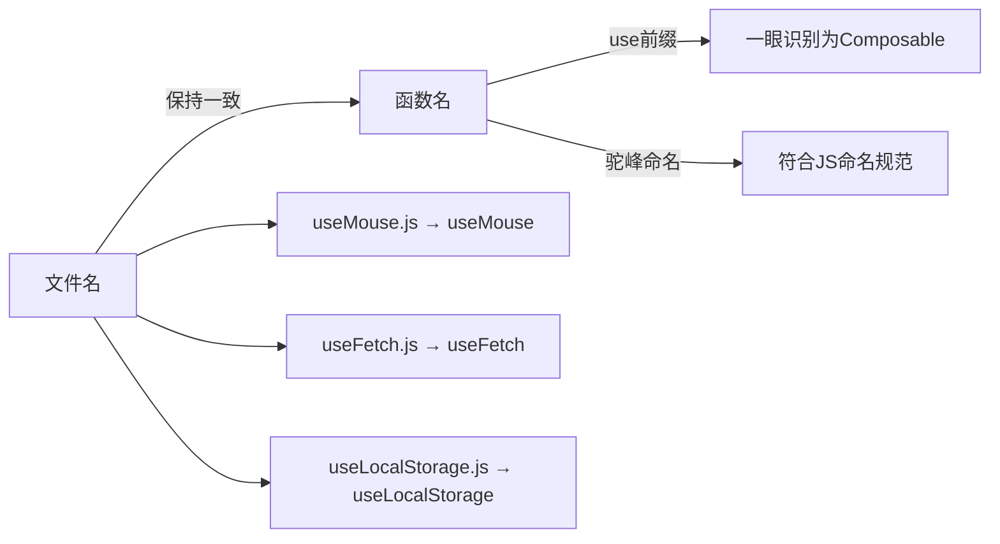
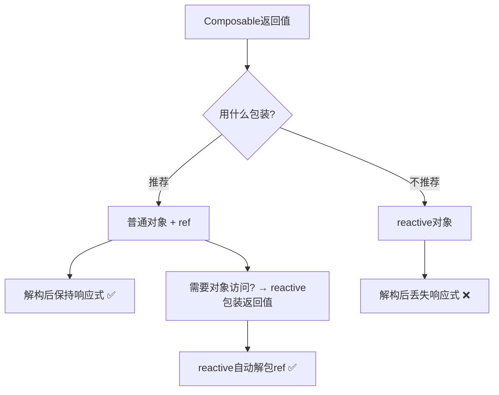

扫描[二维码](https://api2.cmdragon.cn/upload/cmder/20250304_012821924.jpg)关注或者微信搜一搜：`编程智域 前端至全栈交流与成长`

[发现1000+提升效率与开发的AI工具和实用程序](https://tools.cmdragon.cn/zh/apps?category=ai_chat)：https://tools.cmdragon.cn/zh/apps?category=ai_chat

## 一、为啥要有约定？你乱写别人看不懂啊

你有没有接过别人的项目，打开代码一看——`getData`、`fetchInfo`、`mouseHelper`、`windowSizeTool`……啥名字都有，完全不知道哪个是Composable，哪个是普通工具函数。

约定存在的意义就是让代码有"可预测性"。你看到`use`开头就知道这是个Composable，看到返回值就知道该怎么解构，不用猜、不用问、不用翻文档。

Vue社区对Composables有一套公认的约定，虽然不是强制的，但大家都这么干，你跟着走准没错。

## 二、命名约定：use开头，驼峰走起

### 函数名以use开头

这是最最最重要的约定，没有之一。所有Composable函数名都以`use`开头：

```javascript
// ✅ 正确的命名
export function useMouse() { ... }
export function useFetch() { ... }
export function useLocalStorage() { ... }
export function useDebounce() { ... }

// ❌ 别这么写
export function getMousePosition() { ... }
export function fetchHelper() { ... }
export function localStorageManager() { ... }
```

为啥一定要`use`开头？因为：

1. **一眼识别**：看到`use`就知道这是个Composable，不是普通函数
2. **语义清晰**：`useMouse` = "使用鼠标追踪功能"，`useFetch` = "使用数据请求功能"
3. **社区统一**：VueUse（最流行的Composable库）里几百个函数全是`use`开头

### 用驼峰命名法

```javascript
// ✅ 驼峰命名
export function useWindowSize() { ... }
export function useScrollPosition() { ... }

// ❌ 别用下划线
export function use_window_size() { ... }
export function use_scroll_position() { ... }

// ❌ 别用短横线（JS函数名不允许）
export function use-window-size() { ... }
```

### 文件名和函数名保持一致

```javascript
// 文件名：useMouse.js
export function useMouse() { ... }

// 文件名：useFetch.js
export function useFetch() { ... }
```

这样别人看到文件名就知道里面导出的是啥函数，不用打开文件去看。



## 三、输入参数约定：能接收ref和getter才够灵活

### 问题来了

假设你写了个`useFetch`，接收一个URL字符串：

```javascript
export function useFetch(url) {
  const data = ref(null);
  const error = ref(null);

  fetch(url)
    .then((res) => res.json())
    .then((json) => (data.value = json))
    .catch((err) => (error.value = err));

  return { data, error };
}
```

用起来是这样的：

```javascript
const { data } = useFetch("/api/users"); // 传个字符串，没问题
```

但问题来了——如果URL是动态的呢？比如根据路由参数变化来请求不同的数据：

```javascript
// 这个不会自动重新请求！
const url = ref("/api/users/1");
const { data } = useFetch(url.value); // 传的是字符串值，不是ref

url.value = "/api/users/2"; // URL变了，但不会重新fetch
```

### 解决方案：用toValue兼容多种输入

Vue 3.3新增了`toValue()`这个API，专门用来处理这种"输入可能是字符串、也可能是ref、还可能是getter函数"的情况：

```javascript
import { toValue } from "vue";

export function useFetch(url) {
  const data = ref(null);
  const error = ref(null);

  // toValue() 的行为：
  // - 如果是 ref → 返回 ref.value
  // - 如果是函数 → 调用函数并返回结果
  // - 如果是普通值 → 原样返回
  const resolvedUrl = toValue(url);

  fetch(resolvedUrl)
    .then((res) => res.json())
    .then((json) => (data.value = json))
    .catch((err) => (error.value = err));

  return { data, error };
}
```

这样不管调用方传字符串、ref还是getter，都能正常工作：

```javascript
// 传字符串
useFetch("/api/users");

// 传ref
const url = ref("/api/users");
useFetch(url);

// 传getter函数
useFetch(() => `/api/users/${props.id}`);
```

### toValue和unref有啥区别？

你可能会问，`unref()`不也能把ref变成值吗？它俩的区别在于：

| 输入            | unref()      | toValue()             |
| --------------- | ------------ | --------------------- |
| `ref('hello')`  | `'hello'`    | `'hello'`             |
| `'hello'`       | `'hello'`    | `'hello'`             |
| `() => 'hello'` | 原样返回函数 | `'hello'`（调用函数） |

`toValue()`多了一步——如果输入是函数，它会调用这个函数并返回结果。所以当你需要兼容getter函数时，用`toValue()`更合适。

### 什么时候该用toValue？

不是所有Composable都需要用`toValue`。只有当你的参数**可能需要是响应式的**时候才用：

```javascript
// ✅ 需要用toValue的场景
// URL可能动态变化
export function useFetch(url) {
  const value = toValue(url);
}

// ✅ 需要用toValue的场景
// 目标元素可能动态变化
export function useEventListener(target, event, callback) {
  const el = toValue(target);
}

// ❌ 不需要toValue的场景
// 配置项一般是静态的
export function useTheme(options) {
  // options就是个普通对象，不需要toValue
}
```

## 四、返回值约定：ref包在普通对象里

### 核心规则：返回包含ref的普通对象

```javascript
// ✅ 推荐写法
export function useMouse() {
  const x = ref(0);
  const y = ref(0);
  return { x, y }; // 普通对象，里面是ref
}

// 组件里解构后，ref依然保持响应式
const { x, y } = useMouse();
```

### 为啥不用reactive返回？

```javascript
// ❌ 不推荐
export function useMouse() {
  return reactive({
    x: 0,
    y: 0,
  });
}

// 解构后丢失响应性！
const { x, y } = useMouse(); // x和y变成普通数字了
```

`reactive`对象被解构后，每个属性就变成了普通值，跟原来的响应式对象断了联系。而`ref`不会——解构出来的ref本身就是一个响应式引用，不管你怎么传递都保持响应性。

### 如果你想用对象属性的方式访问

有些人不喜欢在模板里写`x.value`（虽然`<template>`里会自动解包），更喜欢用`mouse.x`这种方式。那你可以用`reactive`把返回值包装一下：

```javascript
const mouse = reactive(useMouse());
// mouse.x 自动解包了ref，直接就是值
// 而且响应性还在！因为reactive会自动解包ref
```

```vue
<template>鼠标位置：{{ mouse.x }}, {{ mouse.y }}</template>
```



## 五、一个完整的约定示例

把上面说的约定都合在一起，来写一个规范的Composable：

```javascript
// composables/useUserList.js
import { ref, toValue, watchEffect } from "vue";

// 1. 函数名以use开头，驼峰命名
export function useUserList(url) {
  // 2. 用ref定义状态
  const users = ref([]);
  const loading = ref(false);
  const error = ref(null);

  // 3. 用toValue处理可能为ref/getter的参数
  // 4. 用watchEffect监听响应式依赖变化
  watchEffect(async () => {
    loading.value = true;
    error.value = null;

    try {
      const response = await fetch(toValue(url));
      users.value = await response.json();
    } catch (err) {
      error.value = err;
    } finally {
      loading.value = false;
    }
  });

  // 5. 返回包含ref的普通对象
  return { users, loading, error };
}
```

组件里用：

```vue
<script setup>
import { ref } from "vue";
import { useUserList } from "./composables/useUserList.js";

// 可以传字符串
const { users, loading, error } = useUserList("/api/users");

// 也可以传ref，URL变了会自动重新请求
const apiUrl = ref("/api/users");
const { users, loading, error } = useUserList(apiUrl);

// 还可以传getter
const { users, loading, error } = useUserList(
  () => `/api/users?page=${page.value}`,
);
</script>

<template>
  <div v-if="loading">加载中...</div>
  <div v-else-if="error">出错了：{{ error.message }}</div>
  <ul v-else>
    <li v-for="user in users" :key="user.id">{{ user.name }}</li>
  </ul>
</template>
```

## 课后 Quiz

### 问题 1

以下哪个Composable函数名不符合约定？

- A. `useDarkMode`
- B. `getThemeColor`
- C. `useScrollPosition`
- D. `useLocalStorage`

#### 答案解析

B不符合约定。Composable函数名应该以`use`开头，`getThemeColor`看起来像普通工具函数。改成`useThemeColor`就对了。

### 问题 2

`toValue()`和`unref()`的核心区别是什么？

#### 答案解析

`toValue()`在遇到函数类型的参数时，会调用该函数并返回结果；而`unref()`遇到函数会原样返回，不会调用。对于ref和普通值，它俩的行为是一样的。所以当你需要兼容getter函数作为输入时，应该用`toValue()`。

### 问题 3

为什么Composable推荐返回包含ref的普通对象，而不是reactive对象？

#### 答案解析

因为reactive对象被解构后，每个属性会变成普通值，丢失响应性。而ref被解构后依然是ref，保持响应性。组件里通常会用解构的方式接收Composable的返回值，所以返回ref更安全。

## 常见报错解决方案

### 报错 1：`toValue is not a function`

**错误场景**：

```javascript
import { toValue } from "vue"; // 💥 报错
```

**报错原因**：
`toValue()`是Vue 3.3才新增的API，如果你的Vue版本低于3.3，就没有这个函数。

**解决方案**：
升级Vue到3.3以上，或者自己写一个简易版：

```javascript
function toValue(value) {
  if (typeof value === "function") {
    return value();
  }
  return unref(value);
}
```

### 报错 2：Composable返回reactive对象后解构丢失响应性

**错误场景**：

```javascript
export function useCounter() {
  return reactive({
    count: 0,
    increment() {
      this.count++;
    },
  });
}

const { count, increment } = useCounter();
// count是普通数字，increment里的this也指向不对了
```

**报错原因**：
reactive对象解构后属性变成普通值，而且方法中的`this`在解构后不再指向原对象。

**解决方案**：
改用ref + 普通对象的模式：

```javascript
export function useCounter() {
  const count = ref(0);
  function increment() {
    count.value++;
  }
  return { count, increment }; // ✅ ref解构后保持响应式
}
```

### 报错 3：传了ref给Composable但变化时没有重新执行

**错误场景**：

```javascript
export function useFetch(url) {
  const data = ref(null);
  // 直接用了url，没有用toValue和watchEffect
  fetch(url)
    .then((res) => res.json())
    .then((json) => (data.value = json));
  return { data };
}

const url = ref("/api/users");
const { data } = useFetch(url); // 传了ref但没效果
url.value = "/api/posts"; // 不会重新请求
```

**报错原因**：
直接使用ref作为参数时，fetch拿到的是ref对象而不是它的值。而且没有用`watchEffect`来监听ref的变化，所以URL变了也不会重新请求。

**解决方案**：
用`toValue()`解析参数，用`watchEffect()`监听变化：

```javascript
export function useFetch(url) {
  const data = ref(null);

  watchEffect(() => {
    fetch(toValue(url)) // ✅ toValue解析ref，watchEffect追踪依赖
      .then((res) => res.json())
      .then((json) => (data.value = json));
  });

  return { data };
}
```

## 参考链接

- Vue 3 官方文档 - 组合式函数：https://vuejs.org/guide/reusability/composables.html
- Vue 3 官方文档 - toValue API：https://vuejs.org/api/utility-functions.html#tovalue
- Vue 3 官方文档 - 响应式 API：工具函数：https://vuejs.org/api/reactivity-utilities.html

余下文章内容请点击跳转至 个人博客页面 或者 扫描[二维码](https://api2.cmdragon.cn/upload/cmder/20250304_012821924.jpg)关注或者微信搜一搜：`编程智域 前端至全栈交流与成长`，阅读完整的文章：[Composable的命名规矩和参数约定，别再瞎写了](https://blog.cmdragon.cn/posts/c3d4e5f6a7b8c9d0e1f2a3b4c5d6e7f8/)

<details>
<summary>往期文章归档</summary>

- [Vue 3 静态与动态 Props 如何传递？TypeScript 类型约束有何必要？](https://blog.cmdragon.cn/posts/94ab48753b64780ca3ab7a7115ae8522/)
- [Vue 3中组件局部注册的优势与实现方式如何？](https://blog.cmdragon.cn/posts/dbf576e744870f6de26fd8a2e03e47da/)
- [如何在Vue3中优化生命周期钩子性能并规避常见陷阱？](https://blog.cmdragon.cn/posts/12d98b3b9ccd6c19a1b169d720ac5c80/)
- [Vue 3 Composition API生命周期钩子：如何实现从基础理解到高阶复用？](https://blog.cmdragon.cn/posts/8884e2b70287fcb263c57648eeb27419/)
- [Vue 3生命周期钩子实战指南：如何正确选择onMounted、onUpdated与onUnmounted的应用场景？](https://blog.cmdragon.cn/posts/883c6dbc50ae4183770a4462e0b8ae4d/)
- [Vue 3中生命周期钩子与响应式系统如何实现协同工作？](https://blog.cmdragon.cn/posts/70dad360ffa9dce14d0d69611b8cb019/)
- [Vue 3组件生命周期钩子的执行顺序与使用场景是什么？](https://blog.cmdragon.cn/posts/db44294a78dc9f666f67b053f6c83567/)
- [Vue组件全局注册与局部注册如何抉择？](https://blog.cmdragon.cn/posts/43ead630ea17da65d99ad2eb8188e472/)
- [Vue3组件化开发中，Props与Emits如何实现数据流转与事件协作？](https://blog.cmdragon.cn/posts/8cff7d2df113da66ea7be560c4d1d22a/)
- [Vue 3模板引用如何与其他特性协同实现复杂交互？](https://blog.cmdragon.cn/posts/331bf75d114ab09116eadfcdca602b58/)
- [Vue 3 v-for中模板引用如何实现高效管理与动态控制？](https://blog.cmdragon.cn/posts/cb380897ddc3578b180ecf8843c774c1/)
- [Vue 3的defineExpose：如何突破script setup组件默认封装，实现精准的父子通讯？](https://blog.cmdragon.cn/posts/202ae0f4acde7128e0e31baf63732fb5/)
- [Vue 3模板引用的生命周期时机如何把握？常见陷阱该如何避免？](https://blog.cmdragon.cn/posts/7d2a0f6555ecbe92afd7d2491c427463/)
- [Vue 3模板引用如何实现父组件与子组件的高效交互？](https://blog.cmdragon.cn/posts/3fb7bdd84128b7efaaa1c979e1f28dee/)
- [Vue中为何需要模板引用？又如何高效实现DOM与组件实例的直接访问？](https://blog.cmdragon.cn/posts/23f3464ba16c7054b4783cded50c04c6/)

</details>

<details>
<summary>免费好用的热门在线工具</summary>

- [多直播聚合器 - 应用商店 | By cmdragon](https://tools.cmdragon.cn/zh/apps/multi-live-aggregator)
- [Proto文件生成器 - 应用商店 | By cmdragon](https://tools.cmdragon.cn/zh/apps/proto-file-generator)
- [图片转粒子 - 应用商店 | By cmdragon](https://tools.cmdragon.cn/zh/apps/image-to-particles)
- [视频下载器 - 应用商店 | By cmdragon](https://tools.cmdragon.cn/zh/apps/video-downloader)
- [文件格式转换器 - 应用商店 | By cmdragon](https://tools.cmdragon.cn/zh/apps/file-converter)
- [M3U8在线播放器 - 应用商店 | By cmdragon](https://tools.cmdragon.cn/zh/apps/m3u8-player)
- [快图设计 - 应用商店 | By cmdragon](https://tools.cmdragon.cn/zh/apps/quick-image-design)
- [高级文字转图片转换器 - 应用商店 | By cmdragon](https://tools.cmdragon.cn/zh/apps/text-to-image-advanced)
- [RAID 计算器 - 应用商店 | By cmdragon](https://tools.cmdragon.cn/zh/apps/raid-calculator)
- [在线PS - 应用商店 | By cmdragon](https://tools.cmdragon.cn/zh/apps/photoshop-online)
- [Mermaid 在线编辑器 - 应用商店 | By cmdragon](https://tools.cmdragon.cn/zh/apps/mermaid-live-editor)
- [数学求解计算器 - 应用商店 | By cmdragon](https://tools.cmdragon.cn/zh/apps/math-solver-calculator)
- [智能提词器 - 应用商店 | By cmdragon](https://tools.cmdragon.cn/zh/apps/smart-teleprompter)
- [魔法简历 - 应用商店 | By cmdragon](https://tools.cmdragon.cn/zh/apps/magic-resume)
- [Image Puzzle Tool - 图片拼图工具 | By cmdragon](https://tools.cmdragon.cn/zh/apps/image-puzzle-tool)
- [字幕下载工具 - 应用商店 | By cmdragon](https://tools.cmdragon.cn/zh/apps/subtitle-downloader)
- [歌词生成工具 - 应用商店 | By cmdragon](https://tools.cmdragon.cn/zh/apps/lyrics-generator)
- [网盘资源聚合搜索 - 应用商店 | By cmdragon](https://tools.cmdragon.cn/zh/apps/cloud-drive-search)
- [ASCII字符画生成器 - 应用商店 | By cmdragon](https://tools.cmdragon.cn/zh/apps/ascii-art-generator)
- [JSON Web Tokens 工具 - 应用商店 | By cmdragon](https://tools.cmdragon.cn/zh/apps/jwt-tool)
- [Bcrypt 密码工具 - 应用商店 | By cmdragon](https://tools.cmdragon.cn/zh/apps/bcrypt-tool)
- [GIF 合成器 - 应用商店 | By cmdragon](https://tools.cmdragon.cn/zh/apps/gif-composer)
- [GIF 分解器 - 应用商店 | By cmdragon](https://tools.cmdragon.cn/zh/apps/gif-decomposer)
- [文本隐写术 - 应用商店 | By cmdragon](https://tools.cmdragon.cn/zh/apps/text-steganography)
- [CMDragon 在线工具 - 高级AI工具箱与开发者套件 | 免费好用的在线工具](https://tools.cmdragon.cn/zh)
- [应用商店 - 发现1000+提升效率与开发的AI工具和实用程序 | 免费好用的在线工具](https://tools.cmdragon.cn/zh/apps?category=trending)
- [CMDragon 更新日志 - 最新更新、功能与改进 | 免费好用的在线工具](https://tools.cmdragon.cn/zh/changelog)
- [支持我们 - 成为赞助者 | 免费好用的在线工具](https://tools.cmdragon.cn/zh/sponsor)
- [AI文本生成图像 - 应用商店 | 免费好用的在线工具](https://tools.cmdragon.cn/zh/apps/text-to-image-ai)
- [临时邮箱 - 应用商店 | 免费好用的在线工具](https://tools.cmdragon.cn/zh/apps/temp-email)
- [二维码解析器 - 应用商店 | 免费好用的在线工具](https://tools.cmdragon.cn/zh/apps/qrcode-parser)
- [文本转思维导图 - 应用商店 | 免费好用的在线工具](https://tools.cmdragon.cn/zh/apps/text-to-mindmap)
- [正则表达式可视化工具 - 应用商店 | 免费好用的在线工具](https://tools.cmdragon.cn/zh/apps/regex-visualizer)
- [文件隐写工具 - 应用商店 | 免费好用的在线工具](https://tools.cmdragon.cn/zh/apps/steganography-tool)
- [IPTV 频道探索器 - 应用商店 | 免费好用的在线工具](https://tools.cmdragon.cn/zh/apps/iptv-explorer)
- [快传 - 应用商店 | 免费好用的在线工具](https://tools.cmdragon.cn/zh/apps/snapdrop)
- [随机抽奖工具 - 应用商店 | 免费好用的在线工具](https://tools.cmdragon.cn/zh/apps/lucky-draw)
- [动漫场景查找器 - 应用商店 | 免费好用的在线工具](https://tools.cmdragon.cn/zh/apps/anime-scene-finder)
- [时间工具箱 - 应用商店 | 免费好用的在线工具](https://tools.cmdragon.cn/zh/apps/time-toolkit)
- [网速测试 - 应用商店 | 免费好用的在线工具](https://tools.cmdragon.cn/zh/apps/speed-test)
- [AI 智能抠图工具 - 应用商店 | 免费好用的在线工具](https://tools.cmdragon.cn/zh/apps/background-remover)
- [背景替换工具 - 应用商店 | 免费好用的在线工具](https://tools.cmdragon.cn/zh/apps/background-replacer)
- [艺术二维码生成器 - 应用商店 | 免费好用的在线工具](https://tools.cmdragon.cn/zh/apps/artistic-qrcode)
- [Open Graph 元标签生成器 - 应用商店 | 免费好用的在线工具](https://tools.cmdragon.cn/zh/apps/open-graph-generator)
- [图像对比工具 - 应用商店 | 免费好用的在线工具](https://tools.cmdragon.cn/zh/apps/image-comparison)
- [图片压缩专业版 - 应用商店 | 免费好用的在线工具](https://tools.cmdragon.cn/zh/apps/image-compressor)
- [密码生成器 - 应用商店 | 免费好用的在线工具](https://tools.cmdragon.cn/zh/apps/password-generator)
- [SVG优化器 - 应用商店 | 免费好用的在线工具](https://tools.cmdragon.cn/zh/apps/svg-optimizer)
- [调色板生成器 - 应用商店 | 免费好用的在线工具](https://tools.cmdragon.cn/zh/apps/color-palette)
- [在线节拍器 - 应用商店 | 免费好用的在线工具](https://tools.cmdragon.cn/zh/apps/online-metronome)
- [IP归属地查询 - 应用商店 | 免费好用的在线工具](https://tools.cmdragon.cn/zh/apps/ip-geolocation)
- [CSS网格布局生成器 - 应用商店 | 免费好用的在线工具](https://tools.cmdragon.cn/zh/apps/css-grid-layout)
- [邮箱验证工具 - 应用商店 | 免费好用的在线工具](https://tools.cmdragon.cn/zh/apps/email-validator)
- [书法练习字帖 - 应用商店 | 免费好用的在线工具](https://tools.cmdragon.cn/zh/apps/calligraphy-practice)
- [金融计算器套件 - 应用商店 | 免费好用的在线工具](https://tools.cmdragon.cn/zh/apps/finance-calculator-suite)
- [中国亲戚关系计算器 - 应用商店 | 免费好用的在线工具](https://tools.cmdragon.cn/zh/apps/chinese-kinship-calculator)
- [Protocol Buffer 工具箱 - 应用商店 | 免费好用的在线工具](https://tools.cmdragon.cn/zh/apps/protobuf-toolkit)
- [IP归属地查询 - 应用商店 | 免费好用的在线工具](https://tools.cmdragon.cn/zh/apps/ip-geolocation)
- [图片无损放大 - 应用商店 | 免费好用的在线工具](https://tools.cmdragon.cn/zh/apps/image-upscaler)
- [文本比较工具 - 应用商店 | 免费好用的在线工具](https://tools.cmdragon.cn/zh/apps/text-compare)
- [IP批量查询工具 - 应用商店 | 免费好用的在线工具](https://tools.cmdragon.cn/zh/apps/ip-batch-lookup)
- [域名查询工具 - 应用商店 | 免费好用的在线工具](https://tools.cmdragon.cn/zh/apps/domain-finder)
- [DNS工具箱 - 应用商店 | 免费好用的在线工具](https://tools.cmdragon.cn/zh/apps/dns-toolkit)
- [网站图标生成器 - 应用商店 | 免费好用的在线工具](https://tools.cmdragon.cn/zh/apps/favicon-generator)
- [XML Sitemap](https://tools.cmdragon.cn/sitemap_index.xml)

</details>
