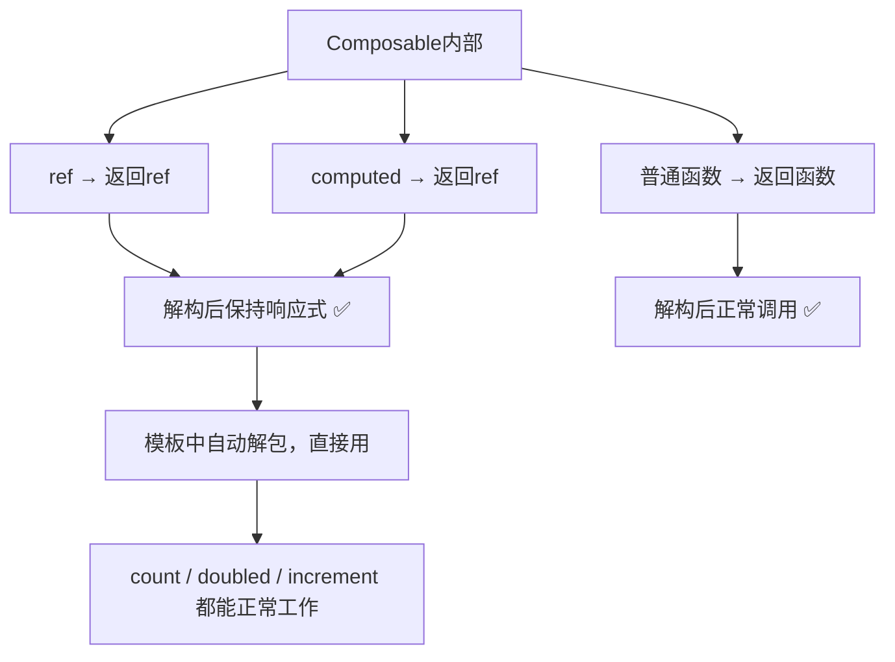

扫描[二维码](https://api2.cmdragon.cn/upload/cmder/20250304_012821924.jpg)关注或者微信搜一搜：`编程智域 前端至全栈交流与成长`

[发现1000+提升效率与开发的AI工具和实用程序](https://tools.cmdragon.cn/zh/apps?category=ai_chat)：https://tools.cmdragon.cn/zh/apps?category=ai_chat


## 一、先看问题：解构后数据不动了

这是很多人写Composable时踩的第一个坑。咱们直接上代码：

```javascript
// 用reactive返回
export function useCounter() {
  const state = reactive({
    count: 0,
    name: '计数器'
  })

  function increment() {
    state.count++
  }

  return state
}
```

组件里用的时候，你可能习惯性地解构：

```vue
<script setup>
import { useCounter } from './useCounter.js'

const { count, name, increment } = useCounter()
</script>

<template>
  <p>{{ count }}</p>
  <button @click="increment">+1</button>
</template>
```

点按钮——没反应！count还是0，页面纹丝不动。为啥？因为`reactive`对象被解构后，`count`就变成了一个普通的数字`0`，跟原来的响应式对象彻底断了联系。

## 二、ref为啥不怕解构？

咱们换成ref试试：

```javascript
// 用ref返回
export function useCounter() {
  const count = ref(0)
  const name = ref('计数器')

  function increment() {
    count.value++
  }

  return { count, name, increment }
}
```

组件里解构：

```vue
<script setup>
import { useCounter } from './useCounter.js'

const { count, name, increment } = useCounter()
</script>

<template>
  <p>{{ count }}</p>
  <button @click="increment">+1</button>
</template>
```

点按钮——count变了！页面正常更新！

### 原理是啥？

关键在于ref的本质——它是一个**对象**，里面有个`.value`属性。不管你怎么解构、怎么传递，ref对象本身的引用不变，`.value`始终指向同一个响应式数据源。

```javascript
const count = ref(0)

// 解构出来的是ref对象本身
const { count: myCount } = { count }

// myCount 和 count 是同一个ref对象
// myCount.value === count.value → true
// 改 myCount.value 也会触发 count 的更新
```

而reactive就不一样了：

```javascript
const state = reactive({ count: 0 })

// 解构出来的是属性值，不是响应式引用
const { count } = state

// count 就是数字 0，跟 state.count 断了联系
// 改 count 不会影响 state.count
```

```mermaid
flowchart TD
    A[Composable返回值] --> B{返回方式}
    B --> C[ref + 普通对象]
    B --> D[reactive对象]

    C --> E[解构: const count = ref(0)]
    E --> F[count是ref对象 ✅]
    F --> G[.value始终指向响应式数据源]
    G --> H[解构后保持响应性 ✅]

    D --> I[解构: const count = state.count]
    I --> J[count是普通值 ❌]
    J --> K[跟原对象断了联系]
    K --> L[解构后丢失响应性 ❌]
```

## 三、官方推荐的写法

Vue官方文档说得很明确：

> 我们推荐的约定是组合式函数始终返回一个包含多个 ref 的普通的非响应式对象，这样该对象在组件中被解构为 ref 之后仍可以保持响应性。

翻译成人话就是：**返回`{ x, y }`这种普通对象，里面的值用`ref`包一下**。

### 标准模板

```javascript
export function useXxx() {
  // 状态用ref
  const state1 = ref(initialValue1)
  const state2 = ref(initialValue2)

  // 计算属性
  const computed1 = computed(() => state1.value + state2.value)

  // 方法
  function doSomething() {
    state1.value++
  }

  // 返回普通对象，里面全是ref和方法
  return {
    state1,
    state2,
    computed1,
    doSomething
  }
}
```

### 实战示例：useTodoList

```javascript
// composables/useTodoList.js
import { ref, computed } from 'vue'

export function useTodoList() {
  const todos = ref([])
  const filter = ref('all')

  const filteredTodos = computed(() => {
    switch (filter.value) {
      case 'done':
        return todos.value.filter(t => t.done)
      case 'undone':
        return todos.value.filter(t => !t.done)
      default:
        return todos.value
    }
  })

  const stats = computed(() => ({
    total: todos.value.length,
    done: todos.value.filter(t => t.done).length,
    undone: todos.value.filter(t => !t.done).length
  }))

  function addTodo(text) {
    todos.value.push({ id: Date.now(), text, done: false })
  }

  function toggleTodo(id) {
    const todo = todos.value.find(t => t.id === id)
    if (todo) todo.done = !todo.done
  }

  function removeTodo(id) {
    todos.value = todos.value.filter(t => t.id !== id)
  }

  return { todos, filter, filteredTodos, stats, addTodo, toggleTodo, removeTodo }
}
```

组件里用：

```vue
<script setup>
import { useTodoList } from './composables/useTodoList.js'

const {
  filter,
  filteredTodos,
  stats,
  addTodo,
  toggleTodo,
  removeTodo
} = useTodoList()

const newTodo = ref('')

function handleAdd() {
  if (newTodo.value.trim()) {
    addTodo(newTodo.value.trim())
    newTodo.value = ''
  }
}
</script>

<template>
  <div>
    <input v-model="newTodo" @keyup.enter="handleAdd" placeholder="添加待办" />
    <button @click="handleAdd">添加</button>

    <select v-model="filter">
      <option value="all">全部</option>
      <option value="done">已完成</option>
      <option value="undone">未完成</option>
    </select>

    <p>共 {{ stats.total }} 项，完成 {{ stats.done }} 项</p>

    <ul>
      <li v-for="todo in filteredTodos" :key="todo.id">
        <input type="checkbox" :checked="todo.done" @change="toggleTodo(todo.id)" />
        <span :style="{ textDecoration: todo.done ? 'line-through' : 'none' }">
          {{ todo.text }}
        </span>
        <button @click="removeTodo(todo.id)">删除</button>
      </li>
    </ul>
  </div>
</template>
```

你看，解构出来的每一个值都是响应式的，页面更新完全没问题。

## 四、就想用对象属性的方式访问咋办？

有些人就是不喜欢在JS里写`.value`（虽然模板里不用写），更喜欢`mouse.x`这种风格。那你可以用`reactive`把Composable的返回值包装一下：

```javascript
// Composable还是正常返回ref
export function useMouse() {
  const x = ref(0)
  const y = ref(0)
  return { x, y }
}

// 组件里用reactive包装
const mouse = reactive(useMouse())
```

这样做之后：
- `mouse.x`会自动解包ref，直接就是值（不需要`.value`）
- 响应性依然保持，因为`reactive`内部会追踪ref的变化

```vue
<template>
  <!-- 直接用 mouse.x，不需要 mouse.x.value -->
  鼠标位置：{{ mouse.x }}, {{ mouse.y }}
</template>
```

### 但要注意：这种方式有局限

```javascript
const mouse = reactive(useMouse())

// ✅ 读取没问题
console.log(mouse.x) // 自动解包，直接是值

// ❌ 直接赋值会断开连接
mouse.x = 100 // 这会替换掉ref，响应性就断了

// ✅ 如果要改值，得通过原始ref
// 但解构后的ref你拿不到原始的了...
// 所以这种方式更适合只读场景
```

## 五、ref和reactive在Composable中的完整对比

| 特性 | ref + 普通对象 | reactive对象 |
|------|---------------|-------------|
| 解构后响应性 | ✅ 保持 | ❌ 丢失 |
| 模板中使用 | 自动解包，直接用 | 需要对象前缀 |
| JS中访问 | 需要.value | 直接访问 |
| 重命名 | 解构时直接重命名 | 不方便 |
| 来源追踪 | 一目了然 | 混在一起看不清 |
| 官方推荐 | ✅ 推荐 | ❌ 不推荐 |

### 来源追踪的好处

用ref + 解构的方式，你能一眼看出每个状态来自哪个Composable：

```javascript
// ✅ 清晰：每个变量来自哪个Composable一目了然
const { x, y } = useMouse()
const { width, height } = useWindowSize()
const { users, loading } = useUserList()

// ❌ 混乱：全混在一个对象里，分不清谁是谁
const state = reactive({
  ...useMouse(),
  ...useWindowSize(),
  ...useUserList()
})
// 万一两个Composable都返回了同名的属性咋办？直接覆盖了！
```

## 六、computed返回值也是ref，放心用

你可能注意到，`computed()`返回的也是一个ref，所以它和`ref()`在返回值中的表现是一样的：

```javascript
export function useCounter() {
  const count = ref(0)
  const doubled = computed(() => count.value * 2) // computed也是ref

  function increment() {
    count.value++
  }

  return { count, doubled, increment }
}

// 组件里
const { count, doubled, increment } = useCounter()
// count是ref，doubled也是ref，都能正常解构使用
```



## 课后 Quiz

### 问题 1
下面这段Composable代码有什么问题？

```javascript
export function useUserInfo() {
  return reactive({
    name: '张三',
    age: 25,
    updateName(newName) {
      this.name = newName
    }
  })
}
```

#### 答案解析
主要问题有两个：
1. 返回reactive对象，解构后属性会丢失响应性
2. 方法里用`this`，解构后`this`指向会变，导致方法无法正常工作

应该改成ref + 普通对象的方式：

```javascript
export function useUserInfo() {
  const name = ref('张三')
  const age = ref(25)

  function updateName(newName) {
    name.value = newName
  }

  return { name, age, updateName }
}
```

### 问题 2
如果你想在组件里用`user.name`而不是`name`的方式访问Composable返回的状态，应该怎么做？

#### 答案解析
用`reactive`包装Composable的返回值：

```javascript
const user = reactive(useUserInfo())
// user.name 自动解包ref，直接就是值
// 而且响应性还在
```

但要注意这种方式不适合需要修改值的场景，因为直接赋值`user.name = '李四'`会断开ref的连接。

### 问题 3
为什么解构reactive对象会丢失响应性，而解构包含ref的普通对象不会？

#### 答案解析
因为reactive对象的属性值是原始值（如数字、字符串），解构出来就是值的拷贝，跟原对象没有关系了。而ref是一个对象引用，解构出来的是ref对象本身（不是.value），ref对象的引用不管怎么传递都不变，所以.value始终指向同一个响应式数据源。

## 常见报错解决方案

### 报错 1：解构reactive返回值后页面不更新

**错误场景**：
```javascript
export function useTheme() {
  return reactive({
    dark: false,
    primaryColor: '#409eff',
    toggleDark() { this.dark = !this.dark }
  })
}

const { dark, toggleDark } = useTheme()
// dark是普通布尔值，toggleDark里的this也不对
```

**报错原因**：
reactive对象解构后，属性变成普通值，方法中的`this`指向也变了。

**解决方案**：
改用ref + 普通对象返回：

```javascript
export function useTheme() {
  const dark = ref(false)
  const primaryColor = ref('#409eff')

  function toggleDark() {
    dark.value = !dark.value
  }

  return { dark, primaryColor, toggleDark }
}
```

### 报错 2：`Cannot read property 'value' of undefined`

**错误场景**：
```javascript
export function useConfig() {
  const config = reactive({ theme: 'dark', lang: 'zh' })
  return { config }
}

const { config } = useConfig()
config.value.theme // 💥 config不是ref，没有.value
```

**报错原因**：
返回的是reactive对象的引用，不是ref，所以没有`.value`属性。

**解决方案**：
reactive对象直接访问属性即可，不需要`.value`：

```javascript
const { config } = useConfig()
config.theme // ✅ 直接访问
```

或者统一改成ref风格：

```javascript
export function useConfig() {
  const theme = ref('dark')
  const lang = ref('zh')
  return { theme, lang }
}

const { theme, lang } = useConfig()
theme.value // ✅ ref用.value访问
```

### 报错 3：多个Composable返回同名属性导致覆盖

**错误场景**：
```javascript
const mouseState = reactive(useMouse())    // 有 x, y
const scrollState = reactive(useScroll())  // 也有 x, y
// scrollState的x和y覆盖了mouseState的！
```

**报错原因**：
两个Composable都返回了同名属性，用reactive展开后后者覆盖前者。

**解决方案**：
用ref + 解构的方式，解构时可以重命名：

```javascript
const { x: mouseX, y: mouseY } = useMouse()
const { x: scrollX, y: scrollY } = useScroll()
// ✅ 重命名后不会冲突
```

## 参考链接

- Vue 3 官方文档 - 组合式函数：https://vuejs.org/guide/reusability/composables.html
- Vue 3 官方文档 - 响应式基础：https://vuejs.org/guide/essentials/reactivity-fundamentals.html
- Vue 3 官方文档 - ref vs reactive：https://vuejs.org/guide/essentials/reactivity-fundamentals.html#reactive

余下文章内容请点击跳转至 个人博客页面 或者 扫描[二维码](https://api2.cmdragon.cn/upload/cmder/20250304_012821924.jpg)关注或者微信搜一搜：`编程智域 前端至全栈交流与成长`，阅读完整的文章：[Composable返回ref还是reactive？解构后响应性丢了咋办](https://blog.cmdragon.cn/posts/d4e5f6a7b8c9d0e1f2a3b4c5d6e7f8a9/)


<details>
<summary>往期文章归档</summary>

- [Vue 3 静态与动态 Props 如何传递？TypeScript 类型约束有何必要？](https://blog.cmdragon.cn/posts/94ab48753b64780ca3ab7a7115ae8522/)
- [Vue 3中组件局部注册的优势与实现方式如何？](https://blog.cmdragon.cn/posts/dbf576e744870f6de26fd8a2e03e47da/)
- [如何在Vue3中优化生命周期钩子性能并规避常见陷阱？](https://blog.cmdragon.cn/posts/12d98b3b9ccd6c19a1b169d720ac5c80/)
- [Vue 3 Composition API生命周期钩子：如何实现从基础理解到高阶复用？](https://blog.cmdragon.cn/posts/8884e2b70287fcb263c57648eeb27419/)
- [Vue 3生命周期钩子实战指南：如何正确选择onMounted、onUpdated与onUnmounted的应用场景？](https://blog.cmdragon.cn/posts/883c6dbc50ae4183770a4462e0b8ae4d/)
- [Vue 3中生命周期钩子与响应式系统如何实现协同工作？](https://blog.cmdragon.cn/posts/70dad360ffa9dce14d0d69611b8cb019/)
- [Vue 3组件生命周期钩子的执行顺序与使用场景是什么？](https://blog.cmdragon.cn/posts/db44294a78dc9f666f67b053f6c83567/)
- [Vue组件全局注册与局部注册如何抉择？](https://blog.cmdragon.cn/posts/43ead630ea17da65d99ad2eb8188e472/)
- [Vue3组件化开发中，Props与Emits如何实现数据流转与事件协作？](https://blog.cmdragon.cn/posts/8cff7d2df113da66ea7be560c4d1d22a/)
- [Vue 3模板引用如何与其他特性协同实现复杂交互？](https://blog.cmdragon.cn/posts/331bf75d114ab09116eadfcdca602b58/)
- [Vue 3 v-for中模板引用如何实现高效管理与动态控制？](https://blog.cmdragon.cn/posts/cb380897ddc3578b180ecf8843c774c1/)
- [Vue 3的defineExpose：如何突破script setup组件默认封装，实现精准的父子通讯？](https://blog.cmdragon.cn/posts/202ae0f4acde7128e0e31baf63732fb5/)
- [Vue 3模板引用的生命周期时机如何把握？常见陷阱该如何避免？](https://blog.cmdragon.cn/posts/7d2a0f6555ecbe92afd7d2491c427463/)
- [Vue 3模板引用如何实现父组件与子组件的高效交互？](https://blog.cmdragon.cn/posts/3fb7bdd84128b7efaaa1c979e1f28dee/)
- [Vue中为何需要模板引用？又如何高效实现DOM与组件实例的直接访问？](https://blog.cmdragon.cn/posts/23f3464ba16c7054b4783cded50c04c6/)

</details>


<details>
<summary>免费好用的热门在线工具</summary>

- [多直播聚合器 - 应用商店 | By cmdragon](https://tools.cmdragon.cn/zh/apps/multi-live-aggregator)
- [Proto文件生成器 - 应用商店 | By cmdragon](https://tools.cmdragon.cn/zh/apps/proto-file-generator)
- [图片转粒子 - 应用商店 | By cmdragon](https://tools.cmdragon.cn/zh/apps/image-to-particles)
- [视频下载器 - 应用商店 | By cmdragon](https://tools.cmdragon.cn/zh/apps/video-downloader)
- [文件格式转换器 - 应用商店 | By cmdragon](https://tools.cmdragon.cn/zh/apps/file-converter)
- [M3U8在线播放器 - 应用商店 | By cmdragon](https://tools.cmdragon.cn/zh/apps/m3u8-player)
- [快图设计 - 应用商店 | By cmdragon](https://tools.cmdragon.cn/zh/apps/quick-image-design)
- [高级文字转图片转换器 - 应用商店 | By cmdragon](https://tools.cmdragon.cn/zh/apps/text-to-image-advanced)
- [RAID 计算器 - 应用商店 | By cmdragon](https://tools.cmdragon.cn/zh/apps/raid-calculator)
- [在线PS - 应用商店 | By cmdragon](https://tools.cmdragon.cn/zh/apps/photoshop-online)
- [Mermaid 在线编辑器 - 应用商店 | By cmdragon](https://tools.cmdragon.cn/zh/apps/mermaid-live-editor)
- [数学求解计算器 - 应用商店 | By cmdragon](https://tools.cmdragon.cn/zh/apps/math-solver-calculator)
- [智能提词器 - 应用商店 | By cmdragon](https://tools.cmdragon.cn/zh/apps/smart-teleprompter)
- [魔法简历 - 应用商店 | By cmdragon](https://tools.cmdragon.cn/zh/apps/magic-resume)
- [Image Puzzle Tool - 图片拼图工具 | By cmdragon](https://tools.cmdragon.cn/zh/apps/image-puzzle-tool)
- [字幕下载工具 - 应用商店 | By cmdragon](https://tools.cmdragon.cn/zh/apps/subtitle-downloader)
- [歌词生成工具 - 应用商店 | By cmdragon](https://tools.cmdragon.cn/zh/apps/lyrics-generator)
- [网盘资源聚合搜索 - 应用商店 | By cmdragon](https://tools.cmdragon.cn/zh/apps/cloud-drive-search)
- [ASCII字符画生成器 - 应用商店 | By cmdragon](https://tools.cmdragon.cn/zh/apps/ascii-art-generator)
- [JSON Web Tokens 工具 - 应用商店 | By cmdragon](https://tools.cmdragon.cn/zh/apps/jwt-tool)
- [Bcrypt 密码工具 - 应用商店 | By cmdragon](https://tools.cmdragon.cn/zh/apps/bcrypt-tool)
- [GIF 合成器 - 应用商店 | By cmdragon](https://tools.cmdragon.cn/zh/apps/gif-composer)
- [GIF 分解器 - 应用商店 | By cmdragon](https://tools.cmdragon.cn/zh/apps/gif-decomposer)
- [文本隐写术 - 应用商店 | By cmdragon](https://tools.cmdragon.cn/zh/apps/text-steganography)
- [CMDragon 在线工具 - 高级AI工具箱与开发者套件 | 免费好用的在线工具](https://tools.cmdragon.cn/zh)
- [应用商店 - 发现1000+提升效率与开发的AI工具和实用程序 | 免费好用的在线工具](https://tools.cmdragon.cn/zh/apps?category=trending)
- [CMDragon 更新日志 - 最新更新、功能与改进 | 免费好用的在线工具](https://tools.cmdragon.cn/zh/changelog)
- [支持我们 - 成为赞助者 | 免费好用的在线工具](https://tools.cmdragon.cn/zh/sponsor)
- [AI文本生成图像 - 应用商店 | 免费好用的在线工具](https://tools.cmdragon.cn/zh/apps/text-to-image-ai)
- [临时邮箱 - 应用商店 | 免费好用的在线工具](https://tools.cmdragon.cn/zh/apps/temp-email)
- [二维码解析器 - 应用商店 | 免费好用的在线工具](https://tools.cmdragon.cn/zh/apps/qrcode-parser)
- [文本转思维导图 - 应用商店 | 免费好用的在线工具](https://tools.cmdragon.cn/zh/apps/text-to-mindmap)
- [正则表达式可视化工具 - 应用商店 | 免费好用的在线工具](https://tools.cmdragon.cn/zh/apps/regex-visualizer)
- [文件隐写工具 - 应用商店 | 免费好用的在线工具](https://tools.cmdragon.cn/zh/apps/steganography-tool)
- [IPTV 频道探索器 - 应用商店 | 免费好用的在线工具](https://tools.cmdragon.cn/zh/apps/iptv-explorer)
- [快传 - 应用商店 | 免费好用的在线工具](https://tools.cmdragon.cn/zh/apps/snapdrop)
- [随机抽奖工具 - 应用商店 | 免费好用的在线工具](https://tools.cmdragon.cn/zh/apps/lucky-draw)
- [动漫场景查找器 - 应用商店 | 免费好用的在线工具](https://tools.cmdragon.cn/zh/apps/anime-scene-finder)
- [时间工具箱 - 应用商店 | 免费好用的在线工具](https://tools.cmdragon.cn/zh/apps/time-toolkit)
- [网速测试 - 应用商店 | 免费好用的在线工具](https://tools.cmdragon.cn/zh/apps/speed-test)
- [AI 智能抠图工具 - 应用商店 | 免费好用的在线工具](https://tools.cmdragon.cn/zh/apps/background-remover)
- [背景替换工具 - 应用商店 | 免费好用的在线工具](https://tools.cmdragon.cn/zh/apps/background-replacer)
- [艺术二维码生成器 - 应用商店 | 免费好用的在线工具](https://tools.cmdragon.cn/zh/apps/artistic-qrcode)
- [Open Graph 元标签生成器 - 应用商店 | 免费好用的在线工具](https://tools.cmdragon.cn/zh/apps/open-graph-generator)
- [图像对比工具 - 应用商店 | 免费好用的在线工具](https://tools.cmdragon.cn/zh/apps/image-comparison)
- [图片压缩专业版 - 应用商店 | 免费好用的在线工具](https://tools.cmdragon.cn/zh/apps/image-compressor)
- [密码生成器 - 应用商店 | 免费好用的在线工具](https://tools.cmdragon.cn/zh/apps/password-generator)
- [SVG优化器 - 应用商店 | 免费好用的在线工具](https://tools.cmdragon.cn/zh/apps/svg-optimizer)
- [调色板生成器 - 应用商店 | 免费好用的在线工具](https://tools.cmdragon.cn/zh/apps/color-palette)
- [在线节拍器 - 应用商店 | 免费好用的在线工具](https://tools.cmdragon.cn/zh/apps/online-metronome)
- [IP归属地查询 - 应用商店 | 免费好用的在线工具](https://tools.cmdragon.cn/zh/apps/ip-geolocation)
- [CSS网格布局生成器 - 应用商店 | 免费好用的在线工具](https://tools.cmdragon.cn/zh/apps/css-grid-layout)
- [邮箱验证工具 - 应用商店 | 免费好用的在线工具](https://tools.cmdragon.cn/zh/apps/email-validator)
- [书法练习字帖 - 应用商店 | 免费好用的在线工具](https://tools.cmdragon.cn/zh/apps/calligraphy-practice)
- [金融计算器套件 - 应用商店 | 免费好用的在线工具](https://tools.cmdragon.cn/zh/apps/finance-calculator-suite)
- [中国亲戚关系计算器 - 应用商店 | 免费好用的在线工具](https://tools.cmdragon.cn/zh/apps/chinese-kinship-calculator)
- [Protocol Buffer 工具箱 - 应用商店 | 免费好用的在线工具](https://tools.cmdragon.cn/zh/apps/protobuf-toolkit)
- [IP归属地查询 - 应用商店 | 免费好用的在线工具](https://tools.cmdragon.cn/zh/apps/ip-geolocation)
- [图片无损放大 - 应用商店 | 免费好用的在线工具](https://tools.cmdragon.cn/zh/apps/image-upscaler)
- [文本比较工具 - 应用商店 | 免费好用的在线工具](https://tools.cmdragon.cn/zh/apps/text-compare)
- [IP批量查询工具 - 应用商店 | 免费好用的在线工具](https://tools.cmdragon.cn/zh/apps/ip-batch-lookup)
- [域名查询工具 - 应用商店 | 免费好用的在线工具](https://tools.cmdragon.cn/zh/apps/domain-finder)
- [DNS工具箱 - 应用商店 | 免费好用的在线工具](https://tools.cmdragon.cn/zh/apps/dns-toolkit)
- [网站图标生成器 - 应用商店 | 免费好用的在线工具](https://tools.cmdragon.cn/zh/apps/favicon-generator)
- [XML Sitemap](https://tools.cmdragon.cn/sitemap_index.xml)

</details>
