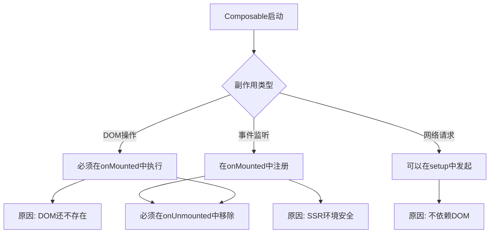
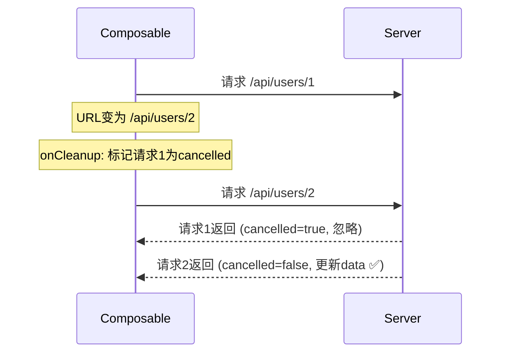

扫描[二维码](https://api2.cmdragon.cn/upload/cmder/20250304_012821924.jpg)关注或者微信搜一搜：`编程智域 前端至全栈交流与成长`

[发现1000+提升效率与开发的AI工具和实用程序](https://tools.cmdragon.cn/zh/apps?category=ai_chat)：https://tools.cmdragon.cn/zh/apps?category=ai_chat


## 一、啥是副作用？为啥要管它？

在Composable的语境下，**副作用**就是那些"不是单纯返回值"的操作，比如：
- 注册DOM事件监听器
- 发起网络请求
- 设置定时器（setTimeout、setInterval）
- 操作DOM元素
- 修改浏览器URL

这些操作有个共同特点——**它们会在组件外部留下"痕迹"**。如果组件卸载了，这些痕迹还在，就会出问题。最典型的就是内存泄漏——事件监听器越积越多，定时器还在跑但组件已经没了……

所以管理副作用的核心就两件事：
1. **在正确的时机启动**（别太早）
2. **在正确的时机清理**（别太晚）

## 二、规则一：DOM相关副作用必须在onMounted后执行

### 为啥？

因为组件还没挂载的时候，DOM还不存在。你要是在`setup`阶段就去操作DOM，大概率会拿到`null`。

```javascript
// ❌ 错误：setup阶段DOM还不存在
export function useElementSize(selector) {
  const width = ref(0)
  const height = ref(0)

  // 这时候DOM还没渲染，document.querySelector大概率返回null
  const el = document.querySelector(selector)
  // el 是 null！💥

  return { width, height }
}
```

### 正确做法

把DOM操作放到`onMounted`里：

```javascript
// ✅ 正确：onMounted时DOM已经渲染好了
export function useElementSize(selector) {
  const width = ref(0)
  const height = ref(0)

  onMounted(() => {
    const el = document.querySelector(selector)
    if (!el) return

    width.value = el.offsetWidth
    height.value = el.offsetHeight

    const observer = new ResizeObserver((entries) => {
      width.value = entries[0].contentRect.width
      height.value = entries[0].contentRect.height
    })

    observer.observe(el)

    onUnmounted(() => {
      observer.disconnect()
    })
  })

  return { width, height }
}
```

### SSR场景更要注意

如果你的项目用了服务端渲染（SSR），那`onMounted`之前的代码在服务器上也会执行。但服务器上没有DOM，也没有`window`和`document`。所以所有DOM相关的操作都必须放在`onMounted`里——因为`onMounted`只在浏览器端执行。

```javascript
export function useMouse() {
  const x = ref(0)
  const y = ref(0)

  // ❌ SSR时会报错：window is not defined
  window.addEventListener('mousemove', update)

  // ✅ onMounted只在浏览器执行
  onMounted(() => {
    window.addEventListener('mousemove', update)
  })

  return { x, y }
}
```



## 三、规则二：必须在onUnmounted时清理副作用

这是最最重要的一条规则。每当你注册了一个"持续存在"的东西（事件监听器、定时器、观察器等），就必须在组件卸载时把它清理掉。

### 事件监听器

```javascript
export function useMouse() {
  const x = ref(0)
  const y = ref(0)

  function update(event) {
    x.value = event.pageX
    y.value = event.pageY
  }

  onMounted(() => {
    window.addEventListener('mousemove', update)
  })

  // ✅ 必须移除！
  onUnmounted(() => {
    window.removeEventListener('mousemove', update)
  })

  return { x, y }
}
```

### 定时器

```javascript
export function useCurrentTime() {
  const now = ref(new Date())

  let timer = null

  onMounted(() => {
    timer = setInterval(() => {
      now.value = new Date()
    }, 1000)
  })

  // ✅ 清除定时器
  onUnmounted(() => {
    if (timer) {
      clearInterval(timer)
      timer = null
    }
  })

  return { now }
}
```

### ResizeObserver

```javascript
export function useWindowSize() {
  const width = ref(window.innerWidth)
  const height = ref(window.innerHeight)

  let observer = null

  onMounted(() => {
    observer = new ResizeObserver(() => {
      width.value = window.innerWidth
      height.value = window.innerHeight
    })
    observer.observe(document.documentElement)
  })

  // ✅ 断开观察器
  onUnmounted(() => {
    if (observer) {
      observer.disconnect()
      observer = null
    }
  })

  return { width, height }
}
```

### 不清理会怎样？

来算笔账。假设你有个组件每秒更新时间，组件每分钟被挂载和卸载一次：

```
1分钟后：1个定时器在跑
10分钟后：10个定时器在跑
1小时后：60个定时器在跑
1天后：1440个定时器在跑！
```

每个定时器都在每秒执行一次回调，你的浏览器CPU占用率会越来越高，页面越来越卡，最终直接卡死。

## 四、watchEffect的清理函数

`watchEffect`提供了一个`onCleanup`回调，用来清理上一次effect执行产生的副作用。这个在处理异步请求时特别有用——避免竞态条件。

### 竞态条件是啥？

假设你请求用户1的数据，还没返回的时候又请求了用户2的数据。用户1的数据后到，把用户2的数据覆盖了——这就是竞态条件。

```javascript
export function useFetch(url) {
  const data = ref(null)

  watchEffect((onCleanup) => {
    let cancelled = false

    fetch(toValue(url))
      .then(res => res.json())
      .then(json => {
        // 如果这次请求已经被取消了，就不更新数据
        if (!cancelled) {
          data.value = json
        }
      })

    // 清理函数：下次effect执行前会调用
    // 把上一次的请求标记为"已取消"
    onCleanup(() => {
      cancelled = true
    })
  })

  return { data }
}
```

流程是这样的：

1. URL是`/api/users/1`，发起请求A
2. URL变成`/api/users/2`，watchEffect重新执行
3. 先调用上一次的清理函数，把请求A标记为cancelled
4. 发起请求B
5. 请求A返回了，但cancelled是true，不更新数据
6. 请求B返回了，cancelled是false，更新数据 ✅



### AbortController：更优雅的取消方式

上面的`cancelled`标记只是让回调不执行，请求本身还是发出去了。如果你想真正取消请求，可以用`AbortController`：

```javascript
export function useFetch(url) {
  const data = ref(null)
  const error = ref(null)

  watchEffect((onCleanup) => {
    const controller = new AbortController()

    data.value = null
    error.value = null

    fetch(toValue(url), { signal: controller.signal })
      .then(res => res.json())
      .then(json => data.value = json)
      .catch(err => {
        if (err.name !== 'AbortError') {
          error.value = err
        }
      })

    onCleanup(() => {
      controller.abort() // 真正取消请求
    })
  })

  return { data, error }
}
```

## 五、用useEventListener统一管理事件副作用

之前咱们写过`useEventListener`，它就是专门帮你管理事件监听器注册和移除的Composable。用它来写其他Composable，就不需要每次都手写`onMounted`和`onUnmounted`了：

```javascript
// composables/useEventListener.js
import { onMounted, onUnmounted } from 'vue'

export function useEventListener(target, event, callback) {
  onMounted(() => target.addEventListener(event, callback))
  onUnmounted(() => target.removeEventListener(event, callback))
}
```

有了它，写其他Composable就简洁多了：

```javascript
// 用useEventListener管理事件
export function useMouse() {
  const x = ref(0)
  const y = ref(0)

  useEventListener(window, 'mousemove', (event) => {
    x.value = event.pageX
    y.value = event.pageY
  })

  return { x, y }
}

// 监听键盘
export function useKeyboard() {
  const lastKey = ref('')

  useEventListener(window, 'keydown', (event) => {
    lastKey.value = event.key
  })

  return { lastKey }
}

// 监听滚动
export function useScroll() {
  const scrollY = ref(0)

  useEventListener(window, 'scroll', () => {
    scrollY.value = window.scrollY
  })

  return { scrollY }
}
```

你看，再也不用写`onMounted`和`onUnmounted`了，`useEventListener`帮你全包了。

## 六、Composable的调用时机限制

官方文档明确说了，Composables只能在以下位置调用：

1. **`<script setup>`中**（最常用）
2. **`setup()`函数中**
3. **生命周期钩子中**（如`onMounted`）

而且必须是**同步调用**。不能在`setTimeout`、`Promise.then`、`async`函数的`await`之后调用。

```javascript
// ✅ 正确
<script setup>
const { x, y } = useMouse()
</script>

// ✅ 正确
setup() {
  const { x, y } = useMouse()
  return { x, y }
}

// ✅ 正确
onMounted(() => {
  const { x, y } = useMouse()
})

// ❌ 错误：setTimeout里调用
setTimeout(() => {
  const { x, y } = useMouse() // 找不到组件实例
}, 1000)

// ❌ 错误：async/await之后调用
async function init() {
  await someAsyncOperation()
  const { x, y } = useMouse() // 组件实例可能已经变了
}
```

### 为啥有这个限制？

因为Vue需要知道"当前活跃的组件实例"是哪个，才能把生命周期钩子、计算属性、侦听器注册到正确的组件上。而Vue确定当前组件实例的方式就是通过调用上下文——只有在setup阶段，Vue才知道当前是哪个组件在初始化。

> 唯一的例外是`<script setup>`中`await`之后仍然可以调用Composable，因为编译器会自动帮你恢复组件实例。

## 课后 Quiz

### 问题 1
下面这个Composable有什么问题？

```javascript
export function useDocumentTitle(title) {
  document.title = title
}
```

#### 答案解析
在SSR环境下，`document`是不存在的，这行代码会报错。应该把DOM操作放到`onMounted`中：

```javascript
export function useDocumentTitle(title) {
  onMounted(() => {
    document.title = toValue(title)
  })
}
```

### 问题 2
`watchEffect`的`onCleanup`回调在什么时候执行？

#### 答案解析
`onCleanup`注册的清理函数会在以下情况执行：
1. watchEffect的依赖变化，effect重新执行之前
2. 组件卸载时

它主要用于清理上一次effect产生的副作用，比如取消未完成的异步请求、清除临时DOM状态等。

### 问题 3
为什么不能在`setTimeout`里调用Composable？

#### 答案解析
因为Vue通过调用上下文来确定当前活跃的组件实例。在`setTimeout`的回调执行时，Vue已经不在setup阶段了，无法确定当前是哪个组件。Composable内部的`onMounted`、`onUnmounted`等生命周期钩子需要注册到具体的组件实例上，找不到实例就会报错。

## 常见报错解决方案

### 报错 1：`window is not defined`（SSR环境）

**错误场景**：
```javascript
export function useMouse() {
  const x = ref(0)
  window.addEventListener('mousemove', update) // SSR报错
  return { x }
}
```

**报错原因**：
SSR环境下没有`window`对象，直接访问会报错。

**解决方案**：
把所有依赖浏览器API的操作放到`onMounted`中：

```javascript
export function useMouse() {
  const x = ref(0)

  onMounted(() => {
    window.addEventListener('mousemove', update)
  })

  onUnmounted(() => {
    window.removeEventListener('mousemove', update)
  })

  return { x }
}
```

### 报错 2：组件频繁挂载卸载后页面越来越卡

**错误场景**：
使用了`v-if`控制组件显示隐藏，组件内有定时器但没清理。

**报错原因**：
每次组件挂载都创建新的定时器，但卸载时没清除。定时器越积越多，CPU占用率持续上升。

**解决方案**：
在`onUnmounted`中清除所有定时器：

```javascript
export function useAutoRefresh(interval = 5000) {
  const data = ref(null)
  let timer = null

  async function refresh() {
    data.value = await fetchData()
  }

  onMounted(() => {
    refresh()
    timer = setInterval(refresh, interval)
  })

  onUnmounted(() => {
    clearInterval(timer) // ✅ 清除定时器
  })

  return { data, refresh }
}
```

### 报错 3：异步请求的竞态条件导致数据错乱

**错误场景**：
```javascript
// 快速切换用户ID
userId.value = 1  // 请求用户1
userId.value = 2  // 请求用户2
// 用户1的数据后返回，覆盖了用户2的数据
```

**报错原因**：
两次请求的返回顺序不确定，后到的请求可能覆盖先到的正确数据。

**解决方案**：
使用`watchEffect`的`onCleanup`配合`AbortController`：

```javascript
watchEffect((onCleanup) => {
  const controller = new AbortController()

  fetch(`/api/users/${toValue(userId)}`, { signal: controller.signal })
    .then(res => res.json())
    .then(json => data.value = json)

  onCleanup(() => controller.abort())
})
```

## 参考链接

- Vue 3 官方文档 - 组合式函数：https://vuejs.org/guide/reusability/composables.html
- Vue 3 官方文档 - 生命周期钩子：https://vuejs.org/guide/essentials/lifecycle.html
- Vue 3 官方文档 - watchEffect：https://vuejs.org/guide/essentials/watchers.html#watcheffect

余下文章内容请点击跳转至 个人博客页面 或者 扫描[二维码](https://api2.cmdragon.cn/upload/cmder/20250304_012821924.jpg)关注或者微信搜一搜：`编程智域 前端至全栈交流与成长`，阅读完整的文章：[Composable里的副作用怎么管？不清理内存泄漏等着你](https://blog.cmdragon.cn/posts/f6a7b8c9d0e1f2a3b4c5d6e7f8a9b0c1/)


<details>
<summary>往期文章归档</summary>

- [Vue 3 静态与动态 Props 如何传递？TypeScript 类型约束有何必要？](https://blog.cmdragon.cn/posts/94ab48753b64780ca3ab7a7115ae8522/)
- [Vue 3中组件局部注册的优势与实现方式如何？](https://blog.cmdragon.cn/posts/dbf576e744870f6de26fd8a2e03e47da/)
- [如何在Vue3中优化生命周期钩子性能并规避常见陷阱？](https://blog.cmdragon.cn/posts/12d98b3b9ccd6c19a1b169d720ac5c80/)
- [Vue 3 Composition API生命周期钩子：如何实现从基础理解到高阶复用？](https://blog.cmdragon.cn/posts/8884e2b70287fcb263c57648eeb27419/)
- [Vue 3生命周期钩子实战指南：如何正确选择onMounted、onUpdated与onUnmounted的应用场景？](https://blog.cmdragon.cn/posts/883c6dbc50ae4183770a4462e0b8ae4d/)
- [Vue 3中生命周期钩子与响应式系统如何实现协同工作？](https://blog.cmdragon.cn/posts/70dad360ffa9dce14d0d69611b8cb019/)
- [Vue 3组件生命周期钩子的执行顺序与使用场景是什么？](https://blog.cmdragon.cn/posts/db44294a78dc9f666f67b053f6c83567/)
- [Vue组件全局注册与局部注册如何抉择？](https://blog.cmdragon.cn/posts/43ead630ea17da65d99ad2eb8188e472/)
- [Vue3组件化开发中，Props与Emits如何实现数据流转与事件协作？](https://blog.cmdragon.cn/posts/8cff7d2df113da66ea7be560c4d1d22a/)
- [Vue 3模板引用如何与其他特性协同实现复杂交互？](https://blog.cmdragon.cn/posts/331bf75d114ab09116eadfcdca602b58/)
- [Vue 3 v-for中模板引用如何实现高效管理与动态控制？](https://blog.cmdragon.cn/posts/cb380897ddc3578b180ecf8843c774c1/)
- [Vue 3的defineExpose：如何突破script setup组件默认封装，实现精准的父子通讯？](https://blog.cmdragon.cn/posts/202ae0f4acde7128e0e31baf63732fb5/)
- [Vue 3模板引用的生命周期时机如何把握？常见陷阱该如何避免？](https://blog.cmdragon.cn/posts/7d2a0f6555ecbe92afd7d2491c427463/)
- [Vue 3模板引用如何实现父组件与子组件的高效交互？](https://blog.cmdragon.cn/posts/3fb7bdd84128b7efaaa1c979e1f28dee/)
- [Vue中为何需要模板引用？又如何高效实现DOM与组件实例的直接访问？](https://blog.cmdragon.cn/posts/23f3464ba16c7054b4783cded50c04c6/)

</details>


<details>
<summary>免费好用的热门在线工具</summary>

- [多直播聚合器 - 应用商店 | By cmdragon](https://tools.cmdragon.cn/zh/apps/multi-live-aggregator)
- [Proto文件生成器 - 应用商店 | By cmdragon](https://tools.cmdragon.cn/zh/apps/proto-file-generator)
- [图片转粒子 - 应用商店 | By cmdragon](https://tools.cmdragon.cn/zh/apps/image-to-particles)
- [视频下载器 - 应用商店 | By cmdragon](https://tools.cmdragon.cn/zh/apps/video-downloader)
- [文件格式转换器 - 应用商店 | By cmdragon](https://tools.cmdragon.cn/zh/apps/file-converter)
- [M3U8在线播放器 - 应用商店 | By cmdragon](https://tools.cmdragon.cn/zh/apps/m3u8-player)
- [快图设计 - 应用商店 | By cmdragon](https://tools.cmdragon.cn/zh/apps/quick-image-design)
- [高级文字转图片转换器 - 应用商店 | By cmdragon](https://tools.cmdragon.cn/zh/apps/text-to-image-advanced)
- [RAID 计算器 - 应用商店 | By cmdragon](https://tools.cmdragon.cn/zh/apps/raid-calculator)
- [在线PS - 应用商店 | By cmdragon](https://tools.cmdragon.cn/zh/apps/photoshop-online)
- [Mermaid 在线编辑器 - 应用商店 | By cmdragon](https://tools.cmdragon.cn/zh/apps/mermaid-live-editor)
- [数学求解计算器 - 应用商店 | By cmdragon](https://tools.cmdragon.cn/zh/apps/math-solver-calculator)
- [智能提词器 - 应用商店 | By cmdragon](https://tools.cmdragon.cn/zh/apps/smart-teleprompter)
- [魔法简历 - 应用商店 | By cmdragon](https://tools.cmdragon.cn/zh/apps/magic-resume)
- [Image Puzzle Tool - 图片拼图工具 | By cmdragon](https://tools.cmdragon.cn/zh/apps/image-puzzle-tool)
- [字幕下载工具 - 应用商店 | By cmdragon](https://tools.cmdragon.cn/zh/apps/subtitle-downloader)
- [歌词生成工具 - 应用商店 | By cmdragon](https://tools.cmdragon.cn/zh/apps/lyrics-generator)
- [网盘资源聚合搜索 - 应用商店 | By cmdragon](https://tools.cmdragon.cn/zh/apps/cloud-drive-search)
- [ASCII字符画生成器 - 应用商店 | By cmdragon](https://tools.cmdragon.cn/zh/apps/ascii-art-generator)
- [JSON Web Tokens 工具 - 应用商店 | By cmdragon](https://tools.cmdragon.cn/zh/apps/jwt-tool)
- [Bcrypt 密码工具 - 应用商店 | By cmdragon](https://tools.cmdragon.cn/zh/apps/bcrypt-tool)
- [GIF 合成器 - 应用商店 | By cmdragon](https://tools.cmdragon.cn/zh/apps/gif-composer)
- [GIF 分解器 - 应用商店 | By cmdragon](https://tools.cmdragon.cn/zh/apps/gif-decomposer)
- [文本隐写术 - 应用商店 | By cmdragon](https://tools.cmdragon.cn/zh/apps/text-steganography)
- [CMDragon 在线工具 - 高级AI工具箱与开发者套件 | 免费好用的在线工具](https://tools.cmdragon.cn/zh)
- [应用商店 - 发现1000+提升效率与开发的AI工具和实用程序 | 免费好用的在线工具](https://tools.cmdragon.cn/zh/apps?category=trending)
- [CMDragon 更新日志 - 最新更新、功能与改进 | 免费好用的在线工具](https://tools.cmdragon.cn/zh/changelog)
- [支持我们 - 成为赞助者 | 免费好用的在线工具](https://tools.cmdragon.cn/zh/sponsor)
- [AI文本生成图像 - 应用商店 | 免费好用的在线工具](https://tools.cmdragon.cn/zh/apps/text-to-image-ai)
- [临时邮箱 - 应用商店 | 免费好用的在线工具](https://tools.cmdragon.cn/zh/apps/temp-email)
- [二维码解析器 - 应用商店 | 免费好用的在线工具](https://tools.cmdragon.cn/zh/apps/qrcode-parser)
- [文本转思维导图 - 应用商店 | 免费好用的在线工具](https://tools.cmdragon.cn/zh/apps/text-to-mindmap)
- [正则表达式可视化工具 - 应用商店 | 免费好用的在线工具](https://tools.cmdragon.cn/zh/apps/regex-visualizer)
- [文件隐写工具 - 应用商店 | 免费好用的在线工具](https://tools.cmdragon.cn/zh/apps/steganography-tool)
- [IPTV 频道探索器 - 应用商店 | 免费好用的在线工具](https://tools.cmdragon.cn/zh/apps/iptv-explorer)
- [快传 - 应用商店 | 免费好用的在线工具](https://tools.cmdragon.cn/zh/apps/snapdrop)
- [随机抽奖工具 - 应用商店 | 免费好用的在线工具](https://tools.cmdragon.cn/zh/apps/lucky-draw)
- [动漫场景查找器 - 应用商店 | 免费好用的在线工具](https://tools.cmdragon.cn/zh/apps/anime-scene-finder)
- [时间工具箱 - 应用商店 | 免费好用的在线工具](https://tools.cmdragon.cn/zh/apps/time-toolkit)
- [网速测试 - 应用商店 | 免费好用的在线工具](https://tools.cmdragon.cn/zh/apps/speed-test)
- [AI 智能抠图工具 - 应用商店 | 免费好用的在线工具](https://tools.cmdragon.cn/zh/apps/background-remover)
- [背景替换工具 - 应用商店 | 免费好用的在线工具](https://tools.cmdragon.cn/zh/apps/background-replacer)
- [艺术二维码生成器 - 应用商店 | 免费好用的在线工具](https://tools.cmdragon.cn/zh/apps/artistic-qrcode)
- [Open Graph 元标签生成器 - 应用商店 | 免费好用的在线工具](https://tools.cmdragon.cn/zh/apps/open-graph-generator)
- [图像对比工具 - 应用商店 | 免费好用的在线工具](https://tools.cmdragon.cn/zh/apps/image-comparison)
- [图片压缩专业版 - 应用商店 | 免费好用的在线工具](https://tools.cmdragon.cn/zh/apps/image-compressor)
- [密码生成器 - 应用商店 | 免费好用的在线工具](https://tools.cmdragon.cn/zh/apps/password-generator)
- [SVG优化器 - 应用商店 | 免费好用的在线工具](https://tools.cmdragon.cn/zh/apps/svg-optimizer)
- [调色板生成器 - 应用商店 | 免费好用的在线工具](https://tools.cmdragon.cn/zh/apps/color-palette)
- [在线节拍器 - 应用商店 | 免费好用的在线工具](https://tools.cmdragon.cn/zh/apps/online-metronome)
- [IP归属地查询 - 应用商店 | 免费好用的在线工具](https://tools.cmdragon.cn/zh/apps/ip-geolocation)
- [CSS网格布局生成器 - 应用商店 | 免费好用的在线工具](https://tools.cmdragon.cn/zh/apps/css-grid-layout)
- [邮箱验证工具 - 应用商店 | 免费好用的在线工具](https://tools.cmdragon.cn/zh/apps/email-validator)
- [书法练习字帖 - 应用商店 | 免费好用的在线工具](https://tools.cmdragon.cn/zh/apps/calligraphy-practice)
- [金融计算器套件 - 应用商店 | 免费好用的在线工具](https://tools.cmdragon.cn/zh/apps/finance-calculator-suite)
- [中国亲戚关系计算器 - 应用商店 | 免费好用的在线工具](https://tools.cmdragon.cn/zh/apps/chinese-kinship-calculator)
- [Protocol Buffer 工具箱 - 应用商店 | 免费好用的在线工具](https://tools.cmdragon.cn/zh/apps/protobuf-toolkit)
- [IP归属地查询 - 应用商店 | 免费好用的在线工具](https://tools.cmdragon.cn/zh/apps/ip-geolocation)
- [图片无损放大 - 应用商店 | 免费好用的在线工具](https://tools.cmdragon.cn/zh/apps/image-upscaler)
- [文本比较工具 - 应用商店 | 免费好用的在线工具](https://tools.cmdragon.cn/zh/apps/text-compare)
- [IP批量查询工具 - 应用商店 | 免费好用的在线工具](https://tools.cmdragon.cn/zh/apps/ip-batch-lookup)
- [域名查询工具 - 应用商店 | 免费好用的在线工具](https://tools.cmdragon.cn/zh/apps/domain-finder)
- [DNS工具箱 - 应用商店 | 免费好用的在线工具](https://tools.cmdragon.cn/zh/apps/dns-toolkit)
- [网站图标生成器 - 应用商店 | 免费好用的在线工具](https://tools.cmdragon.cn/zh/apps/favicon-generator)
- [XML Sitemap](https://tools.cmdragon.cn/sitemap_index.xml)

</details>
