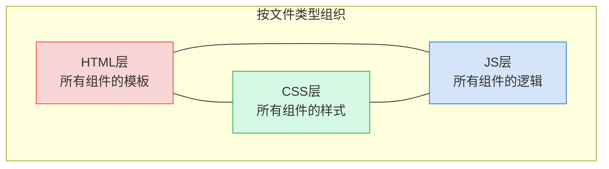
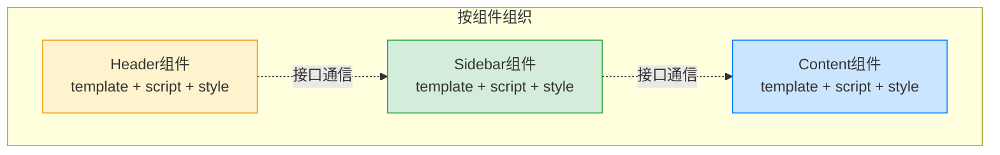
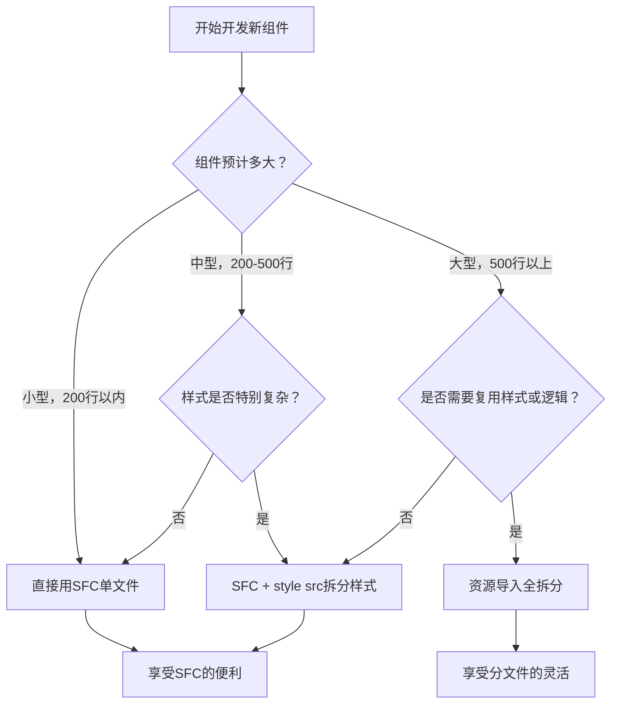

扫描[二维码](https://api2.cmdragon.cn/upload/cmder/20250304_012821924.jpg)关注或者微信搜一搜：`编程智域 前端至全栈交流与成长`

[发现1000+提升效率与开发的AI工具和实用程序](https://tools.cmdragon.cn/zh/apps?category=ai_chat)：https://tools.cmdragon.cn/zh/apps?category=ai_chat

## 一、传统观念——HTML/CSS/JS就该分家？

刚入行那会儿，老师教的第一课就是：HTML管结构，CSS管样式，JS管行为，三者各司其职，最好分文件存放。这几乎成了前端开发的"金科玉律"。

于是我们习惯了这样的项目结构：

```
project/
├── index.html
├── css/
│   └── style.css
└── js/
    └── main.js
```

HTML文件里写结构，CSS文件里写样式，JS文件里写逻辑，看起来整整齐齐，各归各位。这种"三件套"分家的模式确实在传统Web页面开发中运行得很好——毕竟一个页面就那么点东西，HTML、CSS、JS之间的关联也没那么紧密。

但当你第一次打开一个 `.vue` 文件，看到 `<template>`、`<script>`、`<style>` 三个标签挤在同一个文件里的时候，心里难免犯嘀咕：这不是把本来分好的东西又搅到一块儿了嘛？这不乱套了吗？

这种顾虑特别正常。我刚开始接触Vue的时候也是这么想的——好不容易养成了分文件的习惯，你让我又写回一个文件里？那跟以前那种HTML里到处嵌`<style>`和`<script>`的写法有啥区别？

打个比方：传统方式就像把衣服、裤子、袜子分三个衣柜放，看起来整整齐齐；SFC就像把一套搭配好的衣服裤子袜子挂在同一个衣架上。乍一看好像后者更乱，但每天早上出门的时候，你是希望从三个柜子里翻找搭配，还是直接从衣架上拿一整套走人？

答案不言而喻。不过光靠比喻说服不了人，咱们得搞清楚"关注点分离"这个词到底啥意思。

## 二、关注点分离的真正含义

"关注点分离"（Separation of Concerns）这个词，很多开发者把它简单理解成了"按文件类型分离"——HTML一个文件、CSS一个文件、JS一个文件。但这个理解其实是有偏差的。

关注点分离的核心思想是：**把不同职责的代码分开管理，使得修改某一职责的代码时，不会影响到其他职责的代码**。注意，这里说的是"职责"，不是"文件类型"。

在前端开发中，关注点不是完全基于文件类型来划分的。前端工程化的最终目的是更好地维护代码、提高开发效率。如果一种代码组织方式让你改一个按钮的样式要跨三个文件跳来跳去，那这种"分离"真的帮你提高效率了吗？

仅仅按文件类型分离，在日益复杂的前端应用中并不够帮我们提高开发效率。你想啊，一个电商网站的购物车组件，它的模板（HTML）、逻辑（JS）和样式（CSS）本来就是围绕"购物车"这个功能紧密关联的。当你需要修改购物车的展示逻辑时，大概率要同时改模板和脚本；当你调整购物车的交互效果时，样式和逻辑也得分着改。这种情况下，把三者分散到三个文件里，反而增加了跳转和查找的成本。

再来一个比喻：关注点分离不是"把不同颜色的衣服分开放"，而是"把一套搭配放一起，方便穿"。你想想，红色上衣和红色裤子分开放在"红色区"，看起来很整齐，但你想穿出门的时候还得在红色区里翻来翻去找搭配。反过来，把红色上衣和配套的卡其裤放在一个收纳袋里，虽然打破了"按颜色分类"的规矩，但出门的时候一拎就走，效率高多了。

Vue官方文档里也明确说了这个观点：**关注点分离不应该是教条式地按文件类型划分，而应该是按功能模块划分**。在组件化的世界里，一个组件就是一个功能单元，它的模板、逻辑和样式天然就是同一个关注点的不同侧面。

## 三、组件内聚——模板、逻辑、样式本来就是一家人

在现代UI开发中，如果我们按照传统方式组织代码，就是把代码库划分为三个巨大的层——HTML层、CSS层、JS层，然后这三层之间相互交织、互相引用。听起来就头大对吧？



你看，三个层之间全是交叉引用。改一个按钮的功能，你可能要在HTML层找到按钮的DOM结构，去CSS层改它的样式，再跑JS层改它的点击逻辑。三个文件来回跳，眼睛都看花了。

更好的方式是什么呢？**划分为松散耦合的组件，再按需组合**。每个组件自己包含模板、逻辑和样式，组件之间通过清晰的接口（Props和Emits）通信：



在一个组件中，模板、逻辑和样式本就是有内在联系的、是耦合的。将它们放在一起，使组件更有内聚性和可维护性。

还是那个人的比喻：一个人，头、身体、四肢分开看没啥意义，合在一起才是一个完整的人。你不会把头放一个房间、身体放一个房间、四肢放一个房间吧？那想认识这个人得跑三个房间，多费劲。组件也是一样的道理——模板决定了它长啥样，逻辑决定了它能干啥，样式决定了它好不好看，这三者合在一起才是一个完整的组件。

来看一个实际的SFC组件例子：

```vue
<!-- UserCard.vue - 用户卡片组件 -->
<!-- 一个完整的用户卡片，模板、逻辑、样式都在这一个文件里 -->
<template>
  <!-- 卡片容器，绑定动态class来控制激活状态 -->
  <div class="user-card" :class="{ active: isActive }" @click="toggleActive">
    <!-- 用户头像 -->
    
    <!-- 用户信息区域 -->
    <div class="info">
      <!-- 用户名，用插值显示 -->
      <h3>{{ user.name }}</h3>
      <!-- 用户角色标签 -->
      <span class="role">{{ user.role }}</span>
    </div>
    <!-- 激活状态指示器 -->
    <span class="status-dot" :class="{ on: isActive }"></span>
  </div>
</template>

<script setup>
// 引入Vue的响应式API
import { ref } from "vue";

// 定义组件接收的props
const props = defineProps({
  // 用户对象，包含头像、名字、角色信息
  user: {
    type: Object,
    required: true,
  },
});

// 激活状态，默认为false
const isActive = ref(false);

// 切换激活状态的方法
const toggleActive = () => {
  isActive.value = !isActive.value;
};
</script>

<style scoped>
/* 卡片容器样式 */
.user-card {
  display: flex;
  align-items: center;
  padding: 16px;
  border-radius: 8px;
  background: #fff;
  box-shadow: 0 2px 8px rgba(0, 0, 0, 0.1);
  cursor: pointer;
  transition: all 0.3s ease;
}

/* 激活状态的卡片 */
.user-card.active {
  border-left: 4px solid #42b883;
  background: #f0faf5;
}

/* 头像样式 */
.avatar {
  width: 48px;
  height: 48px;
  border-radius: 50%;
  object-fit: cover;
  margin-right: 12px;
}

/* 信息区域 */
.info {
  flex: 1;
}

.info h3 {
  margin: 0;
  font-size: 16px;
  color: #333;
}

.role {
  font-size: 12px;
  color: #999;
}

/* 状态指示点 */
.status-dot {
  width: 10px;
  height: 10px;
  border-radius: 50%;
  background: #ddd;
  transition: background 0.3s;
}

.status-dot.on {
  background: #42b883;
}
</style>
```

你看，打开这一个文件，用户卡片的模板结构、交互逻辑、视觉样式一目了然。改功能不用跳文件，改样式不用翻目录，改模板不用找半天——这就是组件内聚带来的好处。

## 四、还是想分文件？资源导入也能用

说了这么多SFC的好处，但有些同学就是习惯不了把所有东西写在一个文件里，或者组件确实特别大，一个文件上千行看着头疼。没关系，Vue也给你留了后路——**资源导入**（src attribute）。

即使不喜欢SFC的形式，你仍然可以选择拆分单独的JS和CSS文件，通过 `src` 属性引入到 `.vue` 文件中。而且最关键的是，这样写仍然能享受HMR（热模块替换）和预编译的好处！

先看看项目结构：

```
components/
├── UserCard/
│   ├── UserCard.vue        # 主文件，只做引入
│   ├── template.html        # 模板单独存放
│   ├── logic.js            # 逻辑单独存放
│   └── style.css           # 样式单独存放
```

然后 `UserCard.vue` 的写法是这样的：

```vue
<!-- UserCard.vue - 通过src属性引入外部文件 -->
<!-- template的src指向外部HTML文件 -->
<template src="./template.html"></template>

<!-- script的src指向外部JS文件 -->
<script setup src="./logic.js"></script>

<!-- style的src指向外部CSS文件 -->
<style scoped src="./style.css"></style>
```

对应的 `template.html`：

```html
<!-- template.html - 用户卡片的模板 -->
<div class="user-card" :class="{ active: isActive }" @click="toggleActive">
  
  <div class="info">
    <h3>{{ user.name }}</h3>
    <span class="role">{{ user.role }}</span>
  </div>
  <span class="status-dot" :class="{ on: isActive }"></span>
</div>
```

对应的 `logic.js`：

```javascript
// logic.js - 用户卡片的逻辑
// 引入Vue的响应式API
import { ref } from "vue";

// 定义组件接收的props
const props = defineProps({
  // 用户对象
  user: {
    type: Object,
    required: true,
  },
});

// 激活状态
const isActive = ref(false);

// 切换激活状态
const toggleActive = () => {
  isActive.value = !isActive.value;
};
```

对应的 `style.css`：

```css
/* style.css - 用户卡片的样式 */
.user-card {
  display: flex;
  align-items: center;
  padding: 16px;
  border-radius: 8px;
  background: #fff;
  box-shadow: 0 2px 8px rgba(0, 0, 0, 0.1);
  cursor: pointer;
  transition: all 0.3s ease;
}

.user-card.active {
  border-left: 4px solid #42b883;
  background: #f0faf5;
}

.avatar {
  width: 48px;
  height: 48px;
  border-radius: 50%;
  object-fit: cover;
  margin-right: 12px;
}

.info {
  flex: 1;
}

.info h3 {
  margin: 0;
  font-size: 16px;
  color: #333;
}

.role {
  font-size: 12px;
  color: #999;
}

.status-dot {
  width: 10px;
  height: 10px;
  border-radius: 50%;
  background: #ddd;
  transition: background 0.3s;
}

.status-dot.on {
  background: #42b883;
}
```

看到没？通过 `src` 属性，你完全可以把模板、逻辑、样式拆到三个文件里，但 `.vue` 文件仍然是组件的入口。Vite的HMR会正确追踪这些外部文件的变更——你改了 `logic.js`，页面照样热更新；你改了 `style.css`，样式照样即时生效。预编译也不会因为分文件就失效，`<style scoped>` 照样能生成作用域哈希。

打个比方：SFC像整套房，一个人住，啥都方便；资源导入像合租——空间分开了，但共享设施（HMR、预编译）照样能用，就是得多走两步路而已。

不过有一点要注意：用了 `src` 属性之后，对应标签里面就不能再写内容了。比如 `<script setup src="./logic.js">这里写啥都没用</script>`，Vite只会读 `src` 指向的文件，标签内的内容会被直接忽略。

## 五、SFC vs 分文件——怎么选？

既然两种方式都行，那到底该选哪个？咱来掰扯掰扯。

先看SFC的优势：

- **一个文件看全貌**：打开一个 `.vue` 文件，模板、逻辑、样式全在眼前，不用来回跳文件
- **IDE支持好**：Volar（现在叫Vue - Official）对SFC的语法高亮、类型检查、自动补全都是一等公民的支持
- **组件内聚**：修改一个组件的所有内容都在同一个文件里完成，上下文不中断
- **scoped样式天然支持**：`<style scoped>` 直接写就行，不用额外配置

再看分文件的优势：

- **文件更短**：每个文件只管一件事，单个文件行数少，看着不累
- **可以复用样式/逻辑**：同一个 `style.css` 可以被多个 `.vue` 文件引入，逻辑文件同理
- **团队分工明确**：如果团队里有人专写样式、有人专写逻辑，分文件能减少Git冲突

来个对比表格更直观：

| 对比维度   | SFC单文件                      | 资源导入分文件                   |
| ---------- | ------------------------------ | -------------------------------- |
| 代码可读性 | 一个文件看全貌，上下文连贯     | 需要跳转文件，但单个文件更短     |
| IDE支持    | 完美支持（Volar/Vue Official） | 支持良好，但模板文件可能缺少提示 |
| HMR热更新  | 原生支持                       | 同样支持                         |
| 预编译     | 原生支持                       | 同样支持                         |
| 样式复用   | 需要抽取公共CSS文件            | 天然支持，多个组件引入同一CSS    |
| Git协作    | 可能产生合并冲突               | 不同文件类型可并行修改           |
| 适用场景   | 中小型组件，绝大多数场景       | 超大组件，或需要复用样式/逻辑    |

实际项目中，大多数团队用SFC，少数特别大的组件才考虑分文件。这基本是Vue社区的共识了。

最佳实践也很简单：**默认用SFC，样式特别复杂时可以用 `<style src>`**。比如一个组件的样式有几百行，那把样式抽出去单独管理也是合理的。逻辑和模板一般不建议拆，因为它们之间的关联太紧密了，拆开反而增加理解成本。

来看个决策流程图：



说白了，选哪个不是非黑即白的事。SFC是默认选项，分文件是备选方案，根据实际情况灵活选择就好。别为了"纯粹"而牺牲效率，也别为了"方便"而把一个文件写成一两千行的怪物。

## 课后 Quiz

**问题1：Vue SFC把模板、逻辑、样式写在同一个文件里，这是否违反了"关注点分离"原则？为什么？**

<details>
<summary>点击查看答案</summary>

没有违反。关注点分离的核心是"把不同职责的代码分开管理，使修改某一职责时不影响其他职责"，而不是教条式地按文件类型分离。在组件化开发中，一个组件的模板、逻辑和样式天然属于同一个功能关注点——它们共同描述了这个组件"长什么样、能干啥、怎么交互"。把它们放在同一个文件里，反而增强了组件的内聚性，使得修改一个组件时不需要跨多个文件跳转。真正的关注点分离是按功能模块（组件）划分，而不是按技术类型（HTML/CSS/JS）划分。

参考：https://vuejs.org/guide/scaling-up/sfc.html 中明确指出 "In modern UI development, we've found that it's much more natural to organize code by feature instead of by file type."

</details>

**问题2：使用 `<script setup src="./logic.js"></script>` 引入外部JS文件时，该文件能否使用 `<script setup>` 的编译器宏（如 `defineProps`、`defineEmits`）？**

<details>
<summary>点击查看答案</summary>

可以。通过 `src` 属性引入的外部JS文件，其内容会被编译器当作 `<script setup>` 的内容来处理，所以 `defineProps`、`defineEmits`、`defineExpose` 等编译器宏都可以正常使用。这些宏是编译时的语法糖，Vite在编译时会正确识别 `src` 指向的文件内容并进行转换。不过需要注意，外部文件必须使用 `.js` 或 `.ts` 扩展名，并且文件路径必须是相对路径（以 `./` 或 `../` 开头）。

参考：https://vuejs.org/guide/scaling-up/sfc.html 中提到 "If you prefer, you can split your SFC into multiple files using the `src` attribute... The `src` import works the same way as script tag `src`, so the file can be any valid JavaScript or TypeScript file."

</details>

**问题3：在SFC中使用 `<style scoped src="./style.css"></style>`，scoped的作用域隔离在外部CSS文件中是否仍然生效？**

<details>
<summary>点击查看答案</summary>

生效。`scoped` 属性的生效机制是在编译阶段给组件的模板元素和样式规则添加相同的唯一属性选择器（如 `data-v-f3f3eg9`），从而实现样式隔离。当你使用 `src` 引入外部CSS文件时，Vite的SFC编译器同样会读取该文件内容，并在编译时为每条CSS规则添加对应的作用域属性选择器。所以无论样式是直接写在 `<style>` 标签内还是通过 `src` 引入，`scoped` 的隔离效果都是一样的。

参考：https://vuejs.org/guide/scaling-up/sfc.html 中说明资源导入方式与内联写法享有相同的编译处理能力。

</details>

## 常见报错解决方案

### 报错1：`[plugin:vite:vue] <template> cannot contain both src attribute and inline content`

**原因分析**：在 `.vue` 文件中，当你给 `<template>`、`<script>` 或 `<style>` 标签设置了 `src` 属性后，又在标签内部写了内容。Vite的SFC编译器不允许 `src` 属性和内联内容同时存在，因为它不知道该用哪个。

**解决方案**：二选一——要么只用 `src` 引入外部文件（标签内保持为空），要么去掉 `src` 直接在标签内写内容。比如：

```vue
<!-- 错误写法：src和内联内容同时存在 -->
<template src="./template.html">
  <div>这段内容会被忽略，但编译器会报错</div>
</template>

<!-- 正确写法一：只用src -->
<template src="./template.html"></template>

<!-- 正确写法二：只用内联内容 -->
<template>
  <div>直接写在这里</div>
</template>
```

**预防建议**：使用 `src` 属性时养成习惯，标签写成自闭合形式或者确保标签内没有任何内容（包括空格和换行）。

### 报错2：`Failed to resolve module specifier "./logic.js"` 或引入的外部文件404

**原因分析**：`src` 属性的路径写错了，或者文件实际不存在。常见的情况包括：路径没有用 `./` 开头、文件扩展名写错、文件还没创建。

**解决方案**：

1. 确保 `src` 使用相对路径，必须以 `./` 或 `../` 开头
2. 确保文件扩展名正确（`.js`、`.ts`、`.html`、`.css`）
3. 确保文件确实存在于指定路径

```vue
<!-- 错误写法：缺少 ./ 前缀 -->
<script setup src="logic.js"></script>

<!-- 正确写法 -->
<script setup src="./logic.js"></script>
```

**预防建议**：在创建 `.vue` 文件之前，先把要引入的外部文件建好，避免路径指向不存在的文件。也可以借助IDE的路径自动补全功能来减少手写路径出错的可能。

### 报错3：外部引入的JS文件中使用 `defineProps` 报 `defineProps is not defined`

**原因分析**：外部JS文件被当作普通JS模块处理，而不是SFC的 `<script setup>` 上下文。这通常是因为Vite版本过旧，或者文件没有被正确关联到 `.vue` 文件的编译流程中。另一个常见原因是外部文件使用了 `.mjs` 扩展名，某些旧版本编译器可能无法正确识别。

**解决方案**：

1. 确保Vite和 `@vitejs/plugin-vue` 版本是最新的（Vite 5.x+，插件 5.x+）
2. 外部JS文件使用 `.js` 或 `.ts` 扩展名
3. 确保 `.vue` 文件中的 `<script setup src="./logic.js"></script>` 语法正确

```javascript
// logic.js - 外部逻辑文件
// 这些编译器宏在通过src引入时是可用的
// 不需要import，直接使用即可
import { ref } from "vue";

// defineProps 是编译器宏，不需要导入
const props = defineProps({
  user: {
    type: Object,
    required: true,
  },
});

const isActive = ref(false);

const toggleActive = () => {
  isActive.value = !isActive.value;
};
```

**预防建议**：如果项目确实存在编译器宏无法识别的问题，可以考虑退回到内联写法，把逻辑直接写在 `<script setup>` 标签内。另外，确保IDE安装了 Vue - Official（原Volar）插件，它能正确处理 `src` 引入的文件中的编译器宏。

参考链接：https://vuejs.org/guide/scaling-up/sfc.html

余下文章内容请点击跳转至 个人博客页面 或者 扫描[二维码](https://api2.cmdragon.cn/upload/cmder/20250304_012821924.jpg)关注或者微信搜一搜：`编程智域 前端至全栈交流与成长`，阅读完整的文章：[HTMLCSSJS非要分三个文件写？SFC的关注点分离才不是你想的那样](https://blog.cmdragon.cn/posts/p2q3r4s5t6u7v8w9x0y1z2a3b4c5d6e7/)

<details>
<summary>往期文章归档</summary>

- [Vue 3 静态与动态 Props 如何传递？TypeScript 类型约束有何必要？](https://blog.cmdragon.cn/posts/94ab48753b64780ca3ab7a7115ae8522/)
- [Vue 3中组件局部注册的优势与实现方式如何？](https://blog.cmdragon.cn/posts/dbf576e744870f6de26fd8a2e03e47da/)
- [如何在Vue3中优化生命周期钩子性能并规避常见陷阱？](https://blog.cmdragon.cn/posts/12d98b3b9ccd6c19a1b169d720ac5c80/)
- [Vue 3 Composition API生命周期钩子：如何实现从基础理解到高阶复用？](https://blog.cmdragon.cn/posts/8884e2b70287fcb263c57648eeb27419/)
- [Vue 3生命周期钩子实战指南：如何正确选择onMounted、onUpdated与onUnmounted的应用场景？](https://blog.cmdragon.cn/posts/883c6dbc50ae4183770a4462e0b8ae4d/)
- [Vue 3中生命周期钩子与响应式系统如何实现协同工作？](https://blog.cmdragon.cn/posts/70dad360ffa9dce14d0d69611b8cb019/)
- [Vue 3组件生命周期钩子的执行顺序与使用场景是什么？](https://blog.cmdragon.cn/posts/db44294a78dc9f666f67b053f6c83567/)
- [Vue组件全局注册与局部注册如何抉择？](https://blog.cmdragon.cn/posts/43ead630ea17da65d99ad2eb8188e472/)
- [Vue3组件化开发中，Props与Emits如何实现数据流转与事件协作？](https://blog.cmdragon.cn/posts/8cff7d2df113da66ea7be560c4d1d22a/)
- [Vue 3模板引用如何与其他特性协同实现复杂交互？](https://blog.cmdragon.cn/posts/331bf75d114ab09116eadfcdca602b58/)
- [Vue 3 v-for中模板引用如何实现高效管理与动态控制？](https://blog.cmdragon.cn/posts/cb380897ddc3578b180ecf8843c774c1/)
- [Vue 3的defineExpose：如何突破script setup组件默认封装，实现精准的父子通讯？](https://blog.cmdragon.cn/posts/202ae0f4acde7128e0e31baf63732fb5/)
- [Vue 3模板引用的生命周期时机如何把握？常见陷阱该如何避免？](https://blog.cmdragon.cn/posts/7d2a0f6555ecbe92afd7d2491c427463/)
- [Vue 3模板引用如何实现父组件与子组件的高效交互？](https://blog.cmdragon.cn/posts/3fb7bdd84128b7efaaa1c979e1f28dee/)
- [Vue中为何需要模板引用？又如何高效实现DOM与组件实例的直接访问？](https://blog.cmdragon.cn/posts/23f3464ba16c7054b4783cded50c04c6/)

</details>

<details>
<summary>免费好用的热门在线工具</summary>

- [多直播聚合器 - 应用商店 | By cmdragon](https://tools.cmdragon.cn/zh/apps/multi-live-aggregator)
- [Proto文件生成器 - 应用商店 | By cmdragon](https://tools.cmdragon.cn/zh/apps/proto-file-generator)
- [图片转粒子 - 应用商店 | By cmdragon](https://tools.cmdragon.cn/zh/apps/image-to-particles)
- [视频下载器 - 应用商店 | By cmdragon](https://tools.cmdragon.cn/zh/apps/video-downloader)
- [文件格式转换器 - 应用商店 | By cmdragon](https://tools.cmdragon.cn/zh/apps/file-converter)
- [M3U8在线播放器 - 应用商店 | By cmdragon](https://tools.cmdragon.cn/zh/apps/m3u8-player)
- [快图设计 - 应用商店 | By cmdragon](https://tools.cmdragon.cn/zh/apps/quick-image-design)
- [高级文字转图片转换器 - 应用商店 | By cmdragon](https://tools.cmdragon.cn/zh/apps/text-to-image-advanced)
- [RAID 计算器 - 应用商店 | By cmdragon](https://tools.cmdragon.cn/zh/apps/raid-calculator)
- [在线PS - 应用商店 | By cmdragon](https://tools.cmdragon.cn/zh/apps/photoshop-online)
- [Mermaid 在线编辑器 - 应用商店 | By cmdragon](https://tools.cmdragon.cn/zh/apps/mermaid-live-editor)
- [数学求解计算器 - 应用商店 | By cmdragon](https://tools.cmdragon.cn/zh/apps/math-solver-calculator)
- [智能提词器 - 应用商店 | By cmdragon](https://tools.cmdragon.cn/zh/apps/smart-teleprompter)
- [魔法简历 - 应用商店 | By cmdragon](https://tools.cmdragon.cn/zh/apps/magic-resume)
- [Image Puzzle Tool - 图片拼图工具 | By cmdragon](https://tools.cmdragon.cn/zh/apps/image-puzzle-tool)
- [字幕下载工具 - 应用商店 | By cmdragon](https://tools.cmdragon.cn/zh/apps/subtitle-downloader)
- [歌词生成工具 - 应用商店 | By cmdragon](https://tools.cmdragon.cn/zh/apps/lyrics-generator)
- [网盘资源聚合搜索 - 应用商店 | By cmdragon](https://tools.cmdragon.cn/zh/apps/cloud-drive-search)
- [ASCII字符画生成器 - 应用商店 | By cmdragon](https://tools.cmdragon.cn/zh/apps/ascii-art-generator)
- [JSON Web Tokens 工具 - 应用商店 | By cmdragon](https://tools.cmdragon.cn/zh/apps/jwt-tool)
- [Bcrypt 密码工具 - 应用商店 | By cmdragon](https://tools.cmdragon.cn/zh/apps/bcrypt-tool)
- [GIF 合成器 - 应用商店 | By cmdragon](https://tools.cmdragon.cn/zh/apps/gif-composer)
- [GIF 分解器 - 应用商店 | By cmdragon](https://tools.cmdragon.cn/zh/apps/gif-decomposer)
- [文本隐写术 - 应用商店 | By cmdragon](https://tools.cmdragon.cn/zh/apps/text-steganography)
- [CMDragon 在线工具 - 高级AI工具箱与开发者套件 | 免费好用的在线工具](https://tools.cmdragon.cn/zh)
- [应用商店 - 发现1000+提升效率与开发的AI工具和实用程序 | 免费好用的在线工具](https://tools.cmdragon.cn/zh/apps?category=trending)
- [CMDragon 更新日志 - 最新更新、功能与改进 | 免费好用的在线工具](https://tools.cmdragon.cn/zh/changelog)
- [支持我们 - 成为赞助者 | 免费好用的在线工具](https://tools.cmdragon.cn/zh/sponsor)
- [AI文本生成图像 - 应用商店 | 免费好用的在线工具](https://tools.cmdragon.cn/zh/apps/text-to-image-ai)
- [临时邮箱 - 应用商店 | 免费好用的在线工具](https://tools.cmdragon.cn/zh/apps/temp-email)
- [二维码解析器 - 应用商店 | 免费好用的在线工具](https://tools.cmdragon.cn/zh/apps/qrcode-parser)
- [文本转思维导图 - 应用商店 | 免费好用的在线工具](https://tools.cmdragon.cn/zh/apps/text-to-mindmap)
- [正则表达式可视化工具 - 应用商店 | 免费好用的在线工具](https://tools.cmdragon.cn/zh/apps/regex-visualizer)
- [文件隐写工具 - 应用商店 | 免费好用的在线工具](https://tools.cmdragon.cn/zh/apps/steganography-tool)
- [IPTV 频道探索器 - 应用商店 | 免费好用的在线工具](https://tools.cmdragon.cn/zh/apps/iptv-explorer)
- [快传 - 应用商店 | By cmdragon](https://tools.cmdragon.cn/zh/apps/snapdrop)
- [随机抽奖工具 - 应用商店 | 免费好用的在线工具](https://tools.cmdragon.cn/zh/apps/lucky-draw)
- [动漫场景查找器 - 应用商店 | 免费好用的在线工具](https://tools.cmdragon.cn/zh/apps/anime-scene-finder)
- [时间工具箱 - 应用商店 | 免费好用的在线工具](https://tools.cmdragon.cn/zh/apps/time-toolkit)
- [网速测试 - 应用商店 | 免费好用的在线工具](https://tools.cmdragon.cn/zh/apps/speed-test)
- [AI 智能抠图工具 - 应用商店 | 免费好用的在线工具](https://tools.cmdragon.cn/zh/apps/background-remover)
- [背景替换工具 - 应用商店 | 免费好用的在线工具](https://tools.cmdragon.cn/zh/apps/background-replacer)
- [艺术二维码生成器 - 应用商店 | 免费好用的在线工具](https://tools.cmdragon.cn/zh/apps/artistic-qrcode)
- [Open Graph 元标签生成器 - 应用商店 | 免费好用的在线工具](https://tools.cmdragon.cn/zh/apps/open-graph-generator)
- [图像对比工具 - 应用商店 | 免费好用的在线工具](https://tools.cmdragon.cn/zh/apps/image-comparison)
- [图片压缩专业版 - 应用商店 | 免费好用的在线工具](https://tools.cmdragon.cn/zh/apps/image-compressor)
- [密码生成器 - 应用商店 | 免费好用的在线工具](https://tools.cmdragon.cn/zh/apps/password-generator)
- [SVG优化器 - 应用商店 | 免费好用的在线工具](https://tools.cmdragon.cn/zh/apps/svg-optimizer)
- [调色板生成器 - 应用商店 | 免费好用的在线工具](https://tools.cmdragon.cn/zh/apps/color-palette)
- [在线节拍器 - 应用商店 | 免费好用的在线工具](https://tools.cmdragon.cn/zh/apps/online-metronome)
- [IP归属地查询 - 应用商店 | By cmdragon](https://tools.cmdragon.cn/zh/apps/ip-geolocation)
- [CSS网格布局生成器 - 应用商店 | 免费好用的在线工具](https://tools.cmdragon.cn/zh/apps/css-grid-layout)
- [邮箱验证工具 - 应用商店 | 免费好用的在线工具](https://tools.cmdragon.cn/zh/apps/email-validator)
- [书法练习字帖 - 应用商店 | 免费好用的在线工具](https://tools.cmdragon.cn/zh/apps/calligraphy-practice)
- [金融计算器套件 - 应用商店 | 免费好用的在线工具](https://tools.cmdragon.cn/zh/apps/finance-calculator-suite)
- [中国亲戚关系计算器 - 应用商店 | 免费好用的在线工具](https://tools.cmdragon.cn/zh/apps/chinese-kinship-calculator)
- [Protocol Buffer 工具箱 - 应用商店 | 免费好用的在线工具](https://tools.cmdragon.cn/zh/apps/protobuf-toolkit)
- [IP归属地查询 - 应用商店 | 免费好用的在线工具](https://tools.cmdragon.cn/zh/apps/ip-geolocation)
- [图片无损放大 - 应用商店 | 免费好用的在线工具](https://tools.cmdragon.cn/zh/apps/image-upscaler)
- [文本比较工具 - 应用商店 | 免费好用的在线工具](https://tools.cmdragon.cn/zh/apps/text-compare)
- [IP批量查询工具 - 应用商店 | 免费好用的在线工具](https://tools.cmdragon.cn/zh/apps/ip-batch-lookup)
- [域名查询工具 - 应用商店 | 免费好用的在线工具](https://tools.cmdragon.cn/zh/apps/domain-finder)
- [DNS工具箱 - 应用商店 | 免费好用的在线工具](https://tools.cmdragon.cn/zh/apps/dns-toolkit)
- [网站图标生成器 - 应用商店 | 免费好用的在线工具](https://tools.cmdragon.cn/zh/apps/favicon-generator)
- [XML Sitemap](https://tools.cmdragon.cn/sitemap_index.xml)

</details>
